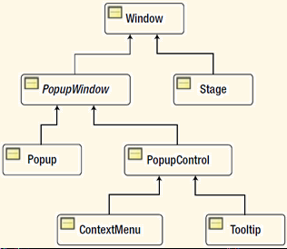

# 大纲
- [大纲](#%e5%a4%a7%e7%ba%b2)
- [JavaFX 程序基本结构](#javafx-%e7%a8%8b%e5%ba%8f%e5%9f%ba%e6%9c%ac%e7%bb%93%e6%9e%84)
  - [第一个 JavaFX 程序](#%e7%ac%ac%e4%b8%80%e4%b8%aa-javafx-%e7%a8%8b%e5%ba%8f)
  - [传递参数](#%e4%bc%a0%e9%80%92%e5%8f%82%e6%95%b0)
- [Stage](#stage)
  - [显示主 Stage](#%e6%98%be%e7%a4%ba%e4%b8%bb-stage)
  - [设置 Stage 的边界](#%e8%ae%be%e7%bd%ae-stage-%e7%9a%84%e8%be%b9%e7%95%8c)
  - [Stage 样式](#stage-%e6%a0%b7%e5%bc%8f)
  - [初始化 Stage 模态](#%e5%88%9d%e5%a7%8b%e5%8c%96-stage-%e6%a8%a1%e6%80%81)
  - [Stage 透明度设置](#stage-%e9%80%8f%e6%98%8e%e5%ba%a6%e8%ae%be%e7%bd%ae)
  - [Stage 大小设置](#stage-%e5%a4%a7%e5%b0%8f%e8%ae%be%e7%bd%ae)
  - [拖动 Stage](#%e6%8b%96%e5%8a%a8-stage)
- [Scene](#scene)
- [Screen](#screen)
  - [获得主屏幕](#%e8%8e%b7%e5%be%97%e4%b8%bb%e5%b1%8f%e5%b9%95)
  - [获得所有屏幕](#%e8%8e%b7%e5%be%97%e6%89%80%e6%9c%89%e5%b1%8f%e5%b9%95)
  - [屏幕分辨率](#%e5%b1%8f%e5%b9%95%e5%88%86%e8%be%a8%e7%8e%87)
  - [屏幕大小](#%e5%b1%8f%e5%b9%95%e5%a4%a7%e5%b0%8f)
# JavaFX 程序基本结构
JavaFX运行时创建两个线程：JavaFX-Launcher 和 JavaFX Application Thread.
Application 的 launch() 方法创建这两线程。然后依次调用如下方法：
- no-args constructor
- init() method
- start() method
- stop() method

JavaFX Launcher Thread 调用init()方法，该方法在Application中默认实现为空。

## 第一个 JavaFX 程序
第一个程序，在窗口中显示 "Hello JavaFX"。
```java
public class HelloJavaFX extends Application{

	public static void main(String[] args){
		launch(args);
	}

	@Override
	public void start(Stage primaryStage){
		primaryStage.setTitle("HelloJavaFX");
		primaryStage.show();
	}
}
```

所有的 JavaFX 程序要扩展 `javafx.application.Application` 类，该类为抽象类，需要实现其抽象方法 `start()`.
- `start()` 方法是 JavaFX 程序的入口。
- `setTitle()` 设置窗口的标题
- `show()` 用于显示窗口。
- JavaFX 应用中 `main()` 方法不是必须的


## 传递参数
JavaFX 程序将参数保存在 `Application` 类的内部类 `Parameters` 类中。`Parameter`将参数分为三部分：
- 命名参数
- 非命名参数
- 原始参数（包含命名参数和非命名参数）

通过 `Application.getParameters()` 可获得参数。

# Stage
`Stage` 是 JavaFX 的顶层容器，用于装 `Scene`，`Scene` 包含所有的可视化组件。和主屏幕对应的主 Stage 由平台创建，传递给 `Application` 类的 `start(Stage s)`方法。

NOTE: `Stage`是顶层容器并不代表它会被单独显示，如在 Web 环境中，`Stage`都是内嵌在网页中显示。

下面是 `Stage` 的类图：



`Window` 是用于托管 `Scene` 的顶层窗口。

`Stage` 的创建和修改必须在 JavaFX 应用线程上进行。


## 显示主 Stage
JavaFX 应用线程在调用 `Platform.exit()` 方法或者最后可见的 `stage` 被关掉，该线程才会终止。只有在所有的非守护线程死掉，JVM才会终止。JavaFX 应用线程不是守护线程。

如果 `stage` 没有显示，调用 `close()` 方法无效，就无法终止 JavaFX 应用线程。关闭 JavaFX 应用线程的方法有：
- 调用 `Platform.exit()`
- 先调用 `show()`，然后调用 `close()`
- 关闭显示的窗口
- 直接通过OS操作终止

> NOTE:  `Stage` 的 `close()` 方法和 `Window` 类的 `hide()` 方法效果一样。如果窗口没有显示，调用 `close()` 方法无效。


## 设置 Stage 的边界
stage 的边界由 x, y, width, height 四个属性决定。
当 stage 不包含 scene，也没有设置其位置和大小，则其位置和大小由 platform 设置。

stage 默认在屏幕居中(`centerOnScreen`)：
- 水平居中
- 垂直方向，左上角为屏幕高度的 1/3 减去stage高度

`sizeToScene()`  
Stage 大小根据 scene 的内容来设置。

## Stage 样式
`Stage` 的区域可以分为两块：内容区域（Content area）和装饰（Decoration）。
- 内容区域用于显示 `Scene` 的内容，即可视化组件;
- 装饰部分包含标题栏和边框。

标题栏及其内容根据平台不同有所差别，并且有些装饰不仅仅是外观差异，还提供了额外的功能。例如，可以通过标题栏将 stage 拖曳到不同的地方；标题栏上的最大化、最小化、还原和关闭按钮；边框可用于调整 stage 大小等功能。

`Stage` 的 Style 属性用于设置 `Stage` 的装饰部分和背景色，根据风格不同分为以下五类:

|`StageStyle`|说明|
|---|---|
|`DECORATED`|白色背景，基于平台风格的装饰|
|`UNDECORATED`|白色背景，无装饰(无标题栏)|
|`TRANSPARENT`|透明背景，无装饰(无标题栏)|
|`UNIFIED`|背景色和装饰一致，平台风格装饰，装饰和client area间无边框|
|`UTILITY`|白色背景，最低的平台风格装饰配置|

> NOTE: stage 的样式仅仅指定装饰，而背景色由 scene 的背景设置决定，默认为白色。如果将 stage 的风格设置为 `TRANSPARENT`,对应的 stage 依然为白色背景，要获得统一的透明 stage，需要调用scene的 `setFill(null)`方法。

**设置 stage 的样式：**  
`initStyle(StageStyle style)`  
该方法的调用，必须在 stage 显示之前，否则会抛出 runtime 异常。

## 初始化 Stage 模态
GUI应用的窗口可以分为两类：模态(modal)和非模态(modeless)。模态窗口显示时，不能和该应用的其他窗口交互，直到模态窗口关闭；非模态窗口则没有此限制，可以在多个非模态窗口间随意切换。

模态：显示模态窗口时，无法操作应用中的其他窗口，直到模态窗口关闭。

JavaFX 的 Stage 有三种模态类型，由 `Modality` enum 定义：
|Modal|值|说明|
|---|---|---|
|None|Modality.None|默认值，不阻止其他窗口显示，效果等同于 modeless|
|Window modal|Modality.WINDOW_MODAL|阻止其 owner 内的其他窗口，如果没有owner，则和None效果相同|
|Application modal|Modality.APPLICATION_MODAL|阻止该应用内所有其他的窗口|

通过 `Stage` 的 `initModality(Modality m)` 方法设置。
> NOTE: 模态的设置，需要在 Stage 显示之前进行。

**initOwner(Window owner)**  
Stage 可有一个 Window 类型的 owner, 该 owner 为其他的 `Window`。通过 initOwner(Window owner)方法设置。需要在stage显示前设置。当 owner 最小化、隐藏等，stage也会最小化或隐藏，owner可以为null。

例：有四个 stages: s1, s2, s3, s4。 s1， s4 的modal为None，并且没有owner，s1是s2的owner，s2是s3的owner，四个stages都显示。
- 设置s3的modality为WINDOW_MODAL，则s3和s4可同时显示，s3和s1, s2不能同时显示。
- 设置s4的modality为APPLICATION_MODAL，则在s4关闭前，其他的窗口都不能显示。

## Stage 透明度设置

```java
setOpacity(double opacity)
getOpacity()
```
值范围：[0.0, 1.0]。

0.0 表示完全透明，1.0表示完全不透明。

## Stage 大小设置
```java
setResizable(boolean resizable)
setMinWidth()
setMaxWidth()
setMinHeight()
setMaxHeight()
```
上面的方法只能设置禁用用户缩放窗口，即使 `setResizable(false)`，依然可以通过程序设置 Stage 的缩放。

## 拖动 Stage
由于 Undecorated 和 Transparent 风格的Stage没有标题栏，无法用鼠标拖动移动窗口。此时只能通过添加鼠标事件实现拖动窗口功能

# Scene
Scene 是 JavaFX scene graph的顶级容器，是 scene graph 的容器，scene graph 是所有节点的树形结构表示，包含Stage中显示的所有元素。

Scene 常用属性
|Type|Name|Property and Description|
|---|---|---|
|ObjectProperty<Cursor>|cursor|It defines the mouse cursor for the scene|
|ObjectProperty<Paint>|fill|It defines the background fill of the Scene|
|ReadOnlyObjectProperty<Node>|focusOwner|It defines the node in the Scene that owns the focus|
|ReadOnlyDoubleProperty|height|It defines the height of the Scene|
|ObjectProperty<Parent>|root|It defines the root Node of the scene graph|
|ReadOnlyDoubleProperty|width|It defines the width of the Scene|
|ReadOnlyObjectProperty<Window>|window|It defines the Window for the Scene|
|ReadOnlyDoubleProperty|x|It defines the horizontal location of the Scene on the window|
|ReadOnlyDoubleProperty|y|It defines the vertical location of the Scene on the window|

# Screen
`javafx.stage.Screen` 类用于获得屏幕的详细信息，如DPI，大小、设置等。如果一个电脑有多个屏幕，则一个称为主屏幕，其他的为非主屏幕。

NOTE: 虽然 `Screen` 类的API没有名说，但是 `Screen` 类只能在 JavaFX 程序中使用。

## 获得主屏幕
```java
// Get the reference to the primary screen
Screen primaryScreen = Screen.getPrimary();
```

## 获得所有屏幕
```java
ObservableList<Screen> screenList = Screen.getScreens();
```

## 屏幕分辨率
```java
Screen primaryScreen = Screen.getPrimary();
double dpi = primaryScreen.getDpi();
```

## 屏幕大小
```java
// 获得屏幕大小
getBounds()

// 获得屏幕可视区域大小
getVisualBounds()
```
可视区域排除了系统本地窗口使用的区域（如任务栏和菜单栏）之后，屏幕剩余的区域，所以一般来说，可视区域小于整个屏幕区域。

如果一个桌面跨越多个屏幕，则副屏幕的边界是相对主屏幕定义的。例如，如果一个桌面跨越两个屏幕，主屏幕左上角坐标为 (0, 0)，宽度为 1600，则副屏幕左上角的坐标为 (1600, 0)。