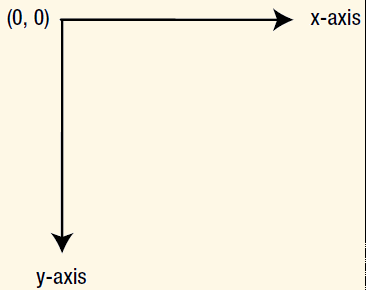
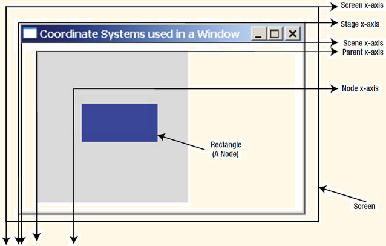
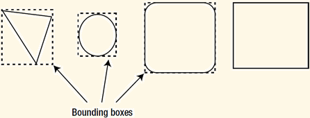
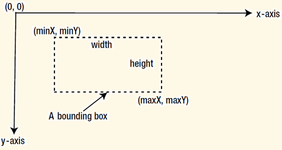
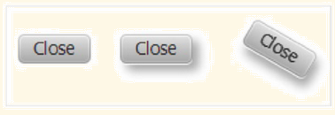
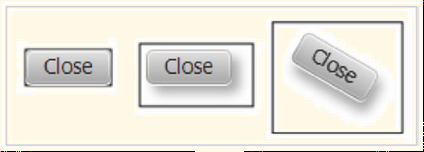
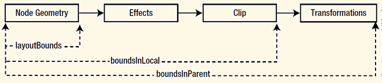

# Node

- [Node](#node)
  - [概述](#%e6%a6%82%e8%bf%b0)
  - [属性](#%e5%b1%9e%e6%80%a7)
    - [layoutX, layoutY](#layoutx-layouty)
    - [String ID](#string-id)
    - [focusTraversableProperty](#focustraversableproperty)
    - [Node 的坐标系](#node-%e7%9a%84%e5%9d%90%e6%a0%87%e7%b3%bb)
  - [转换](#%e8%bd%ac%e6%8d%a2)
    - [平移（translation）](#%e5%b9%b3%e7%a7%bbtranslation)
    - [旋转（rotation）](#%e6%97%8b%e8%bd%acrotation)
    - [缩放（scaling）](#%e7%bc%a9%e6%94%bescaling)
    - [剪切（shearing）](#%e5%89%aa%e5%88%87shearing)
  - [设置Node大小](#%e8%ae%be%e7%bd%aenode%e5%a4%a7%e5%b0%8f)
    - [Resizable Nodes](#resizable-nodes)
  - [边框（Bounding Rectangle）](#%e8%be%b9%e6%a1%86bounding-rectangle)
  - [Node 的边框](#node-%e7%9a%84%e8%be%b9%e6%a1%86)
  - [Group 的边界](#group-%e7%9a%84%e8%be%b9%e7%95%8c)
  - [CSS](#css)

## 概述

节点（Node）说明:

- scene graph 是一棵结构树，`Node` 是 scene graph 上节点的基类，树的节点对应可视化组件（javafx.scene.Node）
- 每个节点包含 0 或 1 个父节点
- 不包含子节点的称为叶节点（leaf）
- 包含1个或多个子节点的称为分支（branch）
- 在一个 `scene graph` 中，只有一个节点没有父节点，该节点称为根节点-（root）
- 一个 `scene graph` 中可以有多可树，有些树是 `Scene` 的一部分，可-以被显示
- 在 Node 添加到 scene graph 前，可以在任意线程创建或修改，添加到 -scene graph 后，就只能在 JavaFX 应用线程中操作。

`Node` 为抽象类，包含许多具体实现：

- 分支节点为 `Parent` 类型，其具体实现有 `Group`, `Region`, `Control` 和它们的子类；
- 叶节点有 `Rectangle`, `Text`, `ImageView`, `MediaView` 等任意不能有子节点的类。

Node 位置具有唯一性：
如果将一个 Node 作为子节点添加到 Parent (包括 Group, Region 等)，而该 Node 已经是另一个 Parent 的子节点，则该节点自动从之前所属的 Parent 移除。所以在修改 scene graph 时，可以将一个 subtree 从一个位置移到另一个位置，你可以按照常规操作，将这个 subtree 从原来的位置移除，然后添加到新的位置。但是，在你将其添加到新的位置的时候，即使没有从显式操作从原来位置移除，该操作也默认进行了。

Node 对象在添加到 Scene 显示之前，可以在任意线程构建和修改。添加之后，则只可以在 JavaFX Application Thread 修改。

## 属性

| 属性    | 说明                                                                                                              |
| ------- | ----------------------------------------------------------------------------------------------------------------- |
| id      | 节点的 id，用于在 scene graph 中查找特定 Node。如果节点 id 为 "myId"，则可以使用 scene.lookup("#myId") 查找该节点 |
| parent  | 节点的父节点。如果该节点还未添加到 Scene graph 中，则为 null                                                      |
| scene   | 节点所在的 scene。如果该节点还未添加到 scene 中，则为 null                                                        |
| style   | 该节点 CSS 的字符串表示                                                                                           |
| visible | 是否作为 scene graph 的内容进行渲染                                                                               |

### layoutX, layoutY

相对 layoutBounds minX 在 x 轴方向的偏移值。例如，节点位置在 `finalX`：

```java
textnode.setLayoutX(finalX - textnode.getLayoutBounds().getMinX());
```

如果不减去 `layoutBounds minX`，位置就可能不对。使用 `relocate(x, y)` 方法会自动进行这种校正，所以应该优先使用该方法。

节点的最终位置是 `layoutX + translateX`，`layoutX` 为节点的稳定位置，`translateX` 则在实现动态功能时使用。

如果节点为托管节点由 `Region` 的父节点管理，则其 `layoutX` 由父节点确定；如果节点为非托管，或者父节点为 Group，则需要直接设置 layoutX.

大部分容器使用其自身的定位策略，而忽略子组件的 `layoutX` 和 `layoutY` 值。

如果想完全控制组件在父容器中的位置，使用`Pane`或 `Group`。`Pane`继承自`Region`，并不干扰子组件的位置，需要你自己使用子组件的 `layoutX` 和 `layoutY` 进行调整。

### String ID

node 可以设置一个 id 值用于识别 node，对应 `idProperty` 属性，该属性类似于CSS的选择器，在使用 CSS 时，可以使用该 id 识别节点。

该 id 的唯一性，由用户自己把握。

```java
public Node lookup(String selector)
```

该 `Node` 功能：从当前 Node 出发，找到第一个和该选择器匹配的节点或子节点。如果当前是 `Parent` 类型，则其子节点也会被查找。例如，如果一个节点的 id 为 "myId"，则可以使用 `scene.lookup("#myId")` 找到该节点。

### focusTraversableProperty

指定 `Node` 是否为焦点（focus）遍历循环的一部分。当该值为 true，使用焦点遍历快键键可以将焦点从其它 `Node` 移到当前 `Node`，或者从当前 `Node` 移除。

在桌面系统中，一般使用 `TAB` 键向前移动焦点，使用 `SHIFT+TAB` 向后移动焦点。

在创建 `Scene` 后，焦点一般在 `focusTraversable`为 true 的 `Node` 上。

`Node#requestFocus()` 方法可以使 `Node` 获得输入焦点，并且 `Node` 所在的顶级窗口成为 focus 窗口。node 要获得焦点，首先必须是 scene 的 一部分，并且其所有的父容器都是可见且非 disabled 状态。

每个 scene 最多只有一个 node 获得 focus，不过获得焦点还不能够输入，除非 node 所在的 scene 归属的 `Stage` 可见且处于活动状态。

### Node 的坐标系

相对坐标系在 GUI 中应用十分广泛。如下图，在计算机中，坐标系一般如此定义：



Node 类定义了该 "local" 坐标系。Node 的具体实现子类提供变量定义其形状和以及在坐标系中的位置。例如，`Rectangle`提供了x, y, width, heigth 变量，`Circle` 提供了 centerX, centerY 和 radius。

一个GUI程序，节点放在其父节点中，根节点放在 scene 中，scene 放在 stage 中，一层一层，各层都有对应的坐标系：



从设备的像素考虑，整数坐标值对应边角和像素之间的位置，而像 (0.5, 0.5) 这样的值则指向像素点的中心位置。
由于所有的坐标值采用的浮点数，所以可以准确控制指向像素点的任意位置。

例：在 (0, 0) 大小为 10, 10 的矩形，矩形右下角最后一个像素的中间位置的坐标为 (9.5, 9.5)。

实际上，大部分节点的坐标系都被转换了。因此，上面描述的坐标，都是相对转换后的坐标系，而不是节点的 local 坐标系。

## 转换

可以对任何 Node 进行转换操作，转换包括平移（translation）、旋转（rotation）、缩放（scaling）和剪切（shearing）。

### 平移（translation）

Node 的坐标系原点沿着 x 或 y 轴移动。例如，在原点 (x=0, y=0) 绘制矩形 (width=100, height=50)，然后沿着 x 轴平移 10 (x=10)，则矩形出现在 (x=10, y=0)，矩形的长宽不变。注意，平移的是原点，而不是矩形的 x 值。

平移值一般采用整数值，这样保证了像素点的映射关系。

### 旋转（rotation）

坐标系绕着指定点旋转，使得 node 表现为旋转效果。以矩形为例，在(x=0, y=0) 的矩形(width=100, height=30)，顺时针绕原点 (pivotX=0, pivotY=0) 旋转90°，此时绘制的矩形就好像在 (x=0,y=0) （width=-30, height=100）的矩形。
注意，在旋转后，矩形的 x, y, width, heigth 都没有变化（依然是相对本地坐标空间），变化的是矩形的坐标空间。

### 缩放（scaling）

根据缩放因子，Node 被方法或缩小。缩放使得坐标空间的本地坐标乘上了缩放因子。和旋转一样，缩放是围绕一个轴点（pivot）进行的。

### 剪切（shearing）

也称为歪斜（skew），剪切变换旋转某个坐标轴，使得 x 和 y 轴不再垂直。

可以同时进行多个变换，通过 `ObservableList` 类型的 `transforms` 变量即可。

## 设置Node大小

Node 可以分为两种类型，大小可调（_resizable_）Node 和大小不可调（_nonresizable_）Node：

- _resizable_ 的 node 在layout 过程中可以被父节点调节大小。
- _nonresizable_ 的 node，只能通过修改其属性调节大小。

_resizable_ 的 node 包括 `Region`s、`Control`s和`WebView`等。  
_nonresizable_ 的 node 包括 `Group`、`Text`和 `Shape` 等节点，这些 node 只能通过设置 `width` 和 `height` 属性修改大小。

通过 `isResizable()`  方法可以知道该 node 是否 resizable.

### Resizable Nodes

_resizable_ 节点的大小由两个条件确定：

- node 所在容器调节大小的策略
- node 自身设置的大小属性

_resizable_ 节点通过三个属性设置其大小范围：

- Preferred size，即最理想的高度和宽度
- Minimum size, 最小尺寸
- Maximum size, 最大尺寸

不限制节点的最大尺寸，将其设置为 `Double.MAX_VALUE`。

大部分 _resizable_ 根据其内容和属性设置自动计算其 preferred, minium 和 maximum 尺寸。该尺寸称为固定尺寸（_intrinsic_）。`Region` 和 `Control` 类定义了两个常量用于指定节点的固定尺寸：

- `USE_COMPUTED_SIZE`，根据内容和属性设置自动计算尺寸；
- `USE_PREF_SIZE`，将 min 和 max 尺寸设置和 pref 一样。

绝大多数情况使用 `USE_COMPUTED_SIZE`，即自动计算的大小就可以。只有在不满足要求时，才覆盖自动计算的尺寸。

_resizable_ 节点大小相关的属性和方法：
| 方法/属性  | 类             | 使用                                        |
| ---------- | -------------- | ------------------------------------------- |
| 属性       |                |                                             |
| prefWidth  | Region,Control | 定义节点 preferred, minimum, maximum 大小。 |
| prefHeight |                |                                             |
| minWidth   |
| minHeight  |
| maxWidth   |
| maxHeight  |

## 边框（Bounding Rectangle）

每个 node 都有一个几何形状，并且在其父节点的坐标系中有一个具体的位置。node的大小和位置统称为边界（bounds）。边界以一个完全包含节点的矩形定义，如下图所示：



由于每个 node 都有变换操作，因为每个node的几何边框矩形可以根据是否考虑变换操作来进行描述。

不管node的形状如何，其边界都是矩形。在JavaFX中，边界由 `javafx.geometry.Bounds` 类定义。`Bounds`是一个抽象类，其实现类为 `BoundingBox`。`Bounds` 类可以处理 3D 空间的边界。其属性包括左上角最浅深度对应的坐标、宽度、高度和深度。`getMinX()`, `getMinY()`, `getMinZ()` 用于左上角坐标。

`getWidth()`, `getHeight()` 和 `getDepth()` 用于获得边框尺寸。`getMaxX()`, `getMaxY()`, `getMaxZ()` 获得右下角最深深度点的坐标。

2D 空间的边界定义如下：



`Bounds` 类的其他方法：

- isEmpty(), 边界长、宽、高任意值为负，返回 true。
- contains(), 判断一个边界是否包含另外一个边界
- intersects(), 判断两个边界是否交叉

## Node 的边框

下图展示了三个包含文字的按钮：



说明：

- 第一个按钮没有特效和和转换
- 第二个按钮有阴影特效
- 第三个按钮有阴影特效及旋转

下图是三种按钮的边界：



可以看到，特效和转换都会影响边界。一个 Node 在 scene graph 中有三种类型的边界，以三种只读（readonly）属性定义：

- layoutBounds
- boundsInLocal
- boundsInParent

下图显示了Node 的不同属性对边界的影响：



- `boundsInLocal` 是 Node 在未转换的 local 坐标系中的边框，定义了 Node 几何形状的边框，包括 non-zero stroke，clip,和effect 所需的空间。
- `boundsInParent` 变量定义的边框包括了所有的变换，包括 `transforms`, `scaleX/scaleY`, `rotate`, `translateX/translateY` 和`layoutX/layoutY` 定义的变换。之所以成为 `boundsInParent`，是因为该边框是相对 parent 的坐标系定义的。为 Node 的视觉边界。
- `layoutBounds` 用于 Node 的 layout 计算，它不同于视觉边界。对 shapes, Text, ImageView, `layoutBounds` 只包括几何形状，包括non-zero的 strokeWidth，但不包括 effect, clip或其他变换。对可调整大小的类，`layoutBounds` 总是 (0, 0) width x height。

`layoutBounds` 属性根据node的几何形状计算而来。根据 node 是否resizable，计算方法有所不同：

- 对 resizable node（Region, Control, WebView），其左上角的坐标为 (0,0)。如，button 的 `layoutBounds`的 (minX, minY) 一直为 (0,0)
- 对 nonresizable node (Shape, Text, Group)，左上角坐标根据 Node 的几何特性计算。

容器在为子节点分配空间时，需要用到 `layoutBounds`。对 `Group`，其 `layoutBounds` 是其所有子Node 的 `boundsInParent`的加和。

下图显示没有转换操作的图形及其 `boundsInLocal`:


如果将该图形绕中心旋转 20°，得到如下结果：


红色边界表示节点在其父节点的坐标空间中的 `boundsInParent`。而其 `boundsInLocal` 和第一个图一样，保持不变，绿色边框表示在 Node 的坐标空间的 `boundsInLocal`。

下图是两个矩形，一个带 stroke，一个不带。

- 矩形1 [x:10 y:10 width:100 height:100 strokeWdith:0] 的边界为 [x:10 y:10 width:100 height:100]。
- 矩形2 [x:10 y:10 width:100 height:100 strokeWidth:5] 的边界为 [x:7.5 y:7.5 width:105 height: 105] (stroke 默认居中，所以只计算一半的宽度) 。

由于两者没有转换，所以 `boundsInParent` 和 `boundsInLocal` 相同。


## Group 的边界

- `Group` 的 `layoutBounds` 是其所有子节点的 `boundsInParent`的总和。
- `Group` 的 `boundsInLocal` 是其 `layoutBounds` 加上直接作用于 `Group` 的特效和剪辑。
- `Group` 的 `boundsInParent` 是其 `boundsInLocal` 加上直接作用于 `Group` 的转换。

## CSS

Node 类包含的 `id`, `styleClass` 和 `style` 变量用于实现 CSS 个性化。`id` 和 `styleClass` 用于 CSS 样式表中识别 Node，`style` 变量包含直接用于 node 的风格设置。

[CSS 参考](https://openjfx.io/javadoc/11/javafx.graphics/javafx/scene/doc-files/cssref.html)
