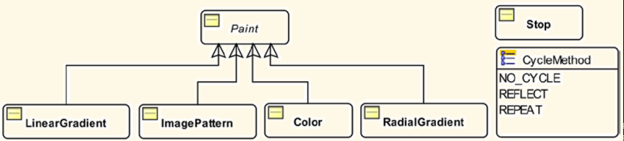

# JavaFX Color

- [JavaFX Color](#javafx-color)
  - [概述](#概述)
  - [Color](#color)
  - [ImagePattern](#imagepattern)
  - [Gradient](#gradient)
    - [LinearGradient](#lineargradient)
    - [Radial Gradient](#radial-gradient)

2020-05-16, 16:13
***

## 概述

在 JavaFX 中，可以设置文本颜色、背景颜色。颜色有多种形式：单一纯色、渐变色，还可以使用图片填充背景。下图是 JavaFX 颜色相关的类：



`Paint` 类是抽象类，它只包含一个 static 方法，用于将字符串转换为合适的具体类：

 ```java
 public static Paint valueOf(String value)
 ```

返回的 `Paint` 实例，根据参数不同，可以是 `LinearGradient`, `RadicalGradient` 和 `Color` 中的一种。 `valueOf` 很少直接使用，一般用于将 CSS 文件中的颜色值转换为实例。如下：

 ```java
// redColor is an instance of the Color class
Paint redColor = Paint.valueOf("red");

// aLinearGradientColor is an instance of the LinearGradient class
Paint aLinearGradientColor = Paint.valueOf("linear-gradient(to bottom right, red, black)" );

// aRadialGradientColor is an instance of the RadialGradient class
Paint aRadialGradientColor = Paint.valueOf("radial-gradient(radius 100%, red, blue, black)");
```

## Color

`Color` 类表示 RGB 颜色空间的一个颜色。每种颜色都有一个 alpha 值，返回在 `[0.0, 1.0]` 或 `[0, 255]`，表示透明度。alpha=0.0 或 0 表示完全透明，alpha=1.0 或 255表示完全不透明。alpha值默认为1.0，即完全不透明。

创建 `Color` 类实例的方法有三种：

- 构造函数
- 工厂方法
- `Color` 类已经定义的常量

`Color` 类只有一个构造函数：

```java
public Color(double red, double green, double blue, double opacity)
```

`Color` 类中包含如下的工厂方法：

- Color color(double red, double green, double blue)
- Color color(double red, double green, double blue, double opacity)
- Color hsb(double hue, double saturation, double brightness)
- Color hsb(double hue, double saturation, double brightness, double opacity)
- Color rgb(int red, int green, int blue)
- Color rgb(int red, int green, int blue, double opacity)

`valueOf()` 和 `web()` 方法可以从网络颜色字符串创建颜色。如下：

```java
Color blue = Color.valueOf("blue");
Color blue = Color.web("blue");
Color blue = Color.web("#0000FF");
Color blue = Color.web("0X0000FF");
Color blue = Color.web("rgb(0, 0, 255)");
Color blue = Color.web("rgba(0, 0, 255, 0.5)"); // 50% transparent blue
```

`Color` 类中定义了大约 140 种颜色常量。

## ImagePattern

`ImagePattern` 使用图片填充。图片可以部分填充一个形状，也可以完全填充。使用 `ImagePattern` 的步骤：

1. 使用 `Image` 载入图片
2. 定义一个矩形，为图片显示区域

如果待填充的区域大于定义的矩形，则矩形区域重复以填满。

`ImagePattern` 构造函数：
|构造函数|说明|
|---|---|
|ImagePattern(Image image)|使用图片填满整个区域|
|ImagePattern(Image image, double x, double y, double width, double height, boolean proportional)|如果 proportional 为 true，则定义的矩形参数值是相对填充区域的比值，否则，为本地坐标系统值|

## Gradient

渐变色：从明到暗，或从一种颜色过度要另外一种颜色。有两种渐变色：

- 线性渐变
- 径向渐变

### LinearGradient

定义方式：

```java
LinearGradient linearGrad = new LinearGradient(
        0, // start X
        0, // start Y
        0, // end X
        1, // end Y
        true, // proportional
        CycleMethod.NO_CYCLE, // cycle colors stops
        new Stop(0.1f, Color.rgb(255, 200, 0, .784)),
        new Stop(1.0f, Color.rgb(0, 0, 0, .784)));
```

### Radial Gradient

|属性|类型|描述|
|---|---|---|
|focusAngle|Double|从渐变中心到第一个颜色映射到焦点的角度|
|focusDistance|Double||
|centerX|||
|centerY|||
