# JavaFX Shapes

## 概述

JavaFX 所有的形状相关类都放在 `javafx.scene.shape` 包中。2D 形状均扩展自抽象类 `Shape` 如下图所示：

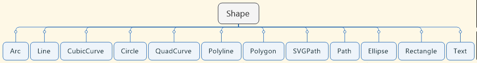

`Shape` 类提供了几何形状对象的常用属性，定义其外围的线条和线条内部区域，需要如下属性：

|属性|类型|说明|
|---|---|---|
|fill|Paint|形状填充颜色，default = `Color.BLACK` for all shapes except Line, Polyline, Path. The default value is null for those shapes|
|smooth|Boolean|反锯齿平滑效果，default = `true`|
|strokeDashOffset|Double|虚线从虚线数组中开始的位置，default=0|
|strokeLineCap|StrokeLineCap|线条末端形状，包括 `StrokeLineCap.BUTT, ROUND, SQUARE`，default=SQUARE|
|strokeLineJoin|StrokeLineJoin|线条连接的方式，取值有 `StrkeLineJoin.BEVEL, MITER, ROUND`|
|strokeMiterLimit|Double|对 `MITER` 线段连接方式，两条线段通过延伸外边框进行连接，线条角度很小时，延伸线可能很长，该属性用于指定 miter 长度和线条宽度的比值。default=10.0|
|stroke|Paint|线条边框颜色，default = `null`, `Line`, `Polyline`, `Path` 例外，default = `Color.BLACK`
|strokeType|StrokeType|stroke 沿着形状的边框绘制，strokeType 属性用于指定stroke相对边框的位置。有三种取值：`CENTERED`, `INSIDE`, `OUTSIDE`，默认为 `CENTERED`，即线条一半在边框内，一半在边框外. |defaut=CENTERED|
|strokeWidth|Double|线条默认宽度, default = 1.0px|

JavaFX 形状的大小不受其父容器的影响，只能修改其大小相关的属性。

## 虚线定义
`(10d, 5d, 15d, 5d, 20d)`  
分别对应实线，空白，实线，空白… 线段的长度。

由于上面线段数目是奇数，所以第二个循环，第一个 10d 长度的线段，就是空白线段。

`strokeDashOffset`, 虚线模式距离线段开始的距离。


如图所示，第一个虚线数组 [25, 20, 5, 20]，offset=0  
第二个 offset=45，即刚好是第一个线段+空白的长度，所以虚线从第二个线段开始。

# 边界模糊问题
大多数 Node 采用整数定义形状和转换值，因此，填充（fill）具有直线边缘的形状，其边缘往往是清晰的，因为其参数为整数，使得这些性质的边界得以覆盖完整的像素点。

另一方面，对相同的 stroking 形状，其边界往往是模糊的。因为 stroke 的默认宽度为 1.0，正好对应一个像素点，默认行为是，stroke 一半在边界内，一半在边界外。大部分形状的边界的位置一般为整数坐标值，从而边界内外各占 50%，从而导致 fill 是清晰的，而 stroke 为模糊的。

解决该问题的方法有两种：
- 使用更宽的 stroke，在没有缩放的情况下，2.0 px 足以
- 使用 `StrokeType.INSIDE` 或 `StrokeType.OUTSIDE`，而不是默认的 stroke 类型。

# Line
Line 没有内部区域，定义一个线条需要如下属性：
|属性|说明|
|---|---|
|startX	|线条起点 X 值|
|startY	|线条起点 Y 值|
|endX	|线条终点 X 值|
|endY	|线条终点 Y 值|

构造方法有两种，构造时指定参数，构造后设置参数：
```java
Line line = new Line(100, 10, 10, 110);

Line line = new Line();
line.setStartX(100);
line.setStartY(10);
line.setEndX(10);
line.setEndY(110);
```

例：
```java
// 默认起始点均为0，(0,0) 处的一个点
Line line1 = new Line();

Line line2 = new Line(0, 0, 50, 0);
line2.setStrokeWidth(1.0);

Line line3 = new Line(0, 50, 50, 0);
line3.setStrokeWidth(2.0);
line3.setStroke(Color.RED);

Line line4 = new Line(0, 0, 50, 50);
line4.setStrokeWidth(5.0);
line4.setStroke(Color.BLUE);
```

效果如下：

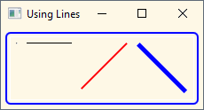

# Rectangle 
除了形状的常规属性，定义一个矩形额外需要如下属性：
|属性|说明|
|---|---|
|x|左上角坐标 X 值|
|y|左上角坐标 Y 值|
|width|宽度|
|height|高度|
|arcWidth|圆角水平直径, default = 0|
|arcHeight|圆角垂直直接，default = 0|

矩形的四个角默认为直角，`arcWidth` 和 `arcHeight` 属性用于将四个角改成圆角，其值是椭圆弧线的水平和垂直直径，如下图所示：

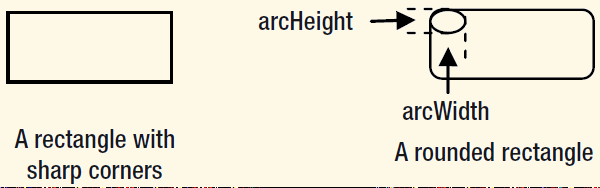

例：
```java
 // x=0, y=0, width=100, height=50, fill=LIGHTGRAY, stroke=null
Rectangle rect1 = new Rectangle(100, 50, Color.LIGHTGRAY);

// x=120, y=20, width=100, height=50, fill=WHITE, stroke=BLACK
Rectangle rect2 = new Rectangle(120, 20, 100, 50);

rect2.setFill(Color.WHITE);
rect2.setStroke(Color.BLACK);
rect2.setArcWidth(10);
rect2.setArcHeight(10);
```

效果如下：

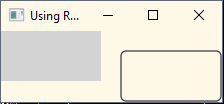

# Circle
圆形需要如下属性定义：
|属性|说明|
|---|---|
|centerX	|原点 X 值|
|centerY	|原点 Y 值|
|radius|圆半径，default = 0|

例：
```java
// centerX=0, centerY=0, radius=40, fill=LIGHTGRAY, stroke=null
Circle c1 = new Circle(0, 0, 40);
c1.setFill(Color.LIGHTGRAY);

// centerX=10, centerY=10, radius=40. fill=YELLOW, stroke=BLACK
Circle c2 = new Circle(10, 10, 40, Color.YELLOW);
c2.setStroke(Color.BLACK);
c2.setStrokeWidth(2.0);
```
效果如下：

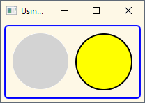

上图是将两个圆放在 `HBox` 中的效果，`HBox` 并不使用 `centerX` 和 `centerY` 属性。

# Ellipse
椭圆绘制和圆很类似，属性：
|属性|说明|
|---|---|
|centerX|原点 X 值|
|centerY|原点 Y 值|
|radiusX|水平半径，default = 0|
|radiuxY|垂直半径，default = 0|

例：
```java
Ellipse e1 = new Ellipse(50, 30);
e1.setFill(Color.LIGHTGRAY);

Ellipse e2 = new Ellipse(60, 30);
e2.setFill(Color.YELLOW);
e2.setStroke(Color.BLACK);
e2.setStrokeWidth(2.0);

// Draw a circle using the Ellipse class (radiusX=radiusY=30)
Ellipse e3 = new Ellipse(30, 30);
e3.setFill(Color.YELLOW);
e3.setStroke(Color.BLACK);
e3.setStrokeWidth(2.0);

HBox root = new HBox(e1, e2, e3);
root.setSpacing(10);
root.setStyle("-fx-padding: 10;" +
        "-fx-border-style: solid inside;" +
        "-fx-border-width: 2;" +
        "-fx-border-insets: 5;" +
        "-fx-border-radius: 5;" +
        "-fx-border-color: blue;");
Scene scene = new Scene(root);
primaryStage.setScene(scene);
primaryStage.setTitle("Using Ellipses");
primaryStage.show();
```
效果如下：

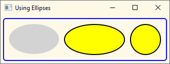

圆是一种特殊的椭圆，如图第三个，当 radiusX=radiusY，就是一个圆。

# 多边形（Polygon）
`Polygon` 类表示多边形。该类没有定义任何 public 属性，通过 (x,y) 坐标数组指定多边形的各个角的坐标即可。

`Polygon` 类将坐标保存在 `ObservableList<Double>` 类中，通过 `getPoints()` 方法获得该列表。连续的每两个值表示一个坐标，所以要确保传入的参数为偶数个，否则出错，无法创建多边形。

构造 `Polygon` 的方法有两种：
```java
// Create an empty triangle and add vertices later
Polygon triangle1 = new Polygon();
triangle1.getPoints().addAll(50.0, 0.0,
        0.0, 100.0,
        100.0, 100.0);

// Create a triangle with vertices
Polygon triangle2 = new Polygon(50.0, 0.0,
        0.0, 100.0,
        100.0, 100.0);
```

例：
```java
Polygon triangle1 = new Polygon();
triangle1.getPoints().addAll(50.0, 0.0,
        0.0, 50.0,
        100.0, 50.0);
triangle1.setFill(Color.WHITE);
triangle1.setStroke(Color.RED);

Polygon parallelogram = new Polygon();
parallelogram.getPoints().addAll(30.0, 0.0,
        130.0, 0.0,
        100.00, 50.0,
        0.0, 50.0);
parallelogram.setFill(Color.YELLOW);
parallelogram.setStroke(Color.BLACK);

Polygon hexagon = new Polygon(100.0, 0.0,
        120.0, 20.0,
        120.0, 40.0,
        100.0, 60.0,
        80.0, 40.0,
        80.0, 20.0);
hexagon.setFill(Color.WHITE);
hexagon.setStroke(Color.BLACK);

HBox root = new HBox(triangle1, parallelogram, hexagon);
root.setSpacing(10);
root.setStyle("-fx-padding: 10;" +
        "-fx-border-style: solid inside;" +
        "-fx-border-width: 2;" +
        "-fx-border-insets: 5;" +
        "-fx-border-radius: 5;" +
        "-fx-border-color: blue;");
Scene scene = new Scene(root);
primaryStage.setScene(scene);
primaryStage.setTitle("Using Polygons");
primaryStage.show();
```
效果图：

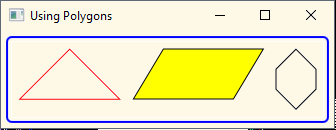

# 折线（Polyline）
折线和多边形类似，只是终点和起点不连接，没有构成封闭图形，除非你手动添加起点后终点的连接。不过 `fill` 属性则通过假设该图形是封闭的来填充颜色。

例：
```java
Polyline triangle1 = new Polyline();
triangle1.getPoints().addAll(50.0, 0.0,
        0.0, 50.0,
        100.0, 50.0,
        50.0, 0.0);
triangle1.setFill(Color.WHITE);
triangle1.setStroke(Color.RED);

// Create an open parallelogram
Polyline parallelogram = new Polyline();
parallelogram.getPoints().addAll(30.0, 0.0,
        130.0, 0.0,
        100.00, 50.0,
        0.0, 50.0);
parallelogram.setFill(Color.YELLOW);
parallelogram.setStroke(Color.BLACK);

Polyline hexagon = new Polyline(100.0, 0.0,
        120.0, 20.0,
        120.0, 40.0,
        100.0, 60.0,
        80.0, 40.0,
        80.0, 20.0,
        100.0, 0.0);
hexagon.setFill(Color.WHITE);
hexagon.setStroke(Color.BLACK);

HBox root = new HBox(triangle1, parallelogram, hexagon);
root.setSpacing(10);
root.setStyle("-fx-padding: 10;" +
        "-fx-border-style: solid inside;" +
        "-fx-border-width: 2;" +
        "-fx-border-insets: 5;" +
        "-fx-border-radius: 5;" +
        "-fx-border-color: blue;");
Scene scene = new Scene(root);
primaryStage.setScene(scene);
primaryStage.setTitle("Using Polylines");
primaryStage.show();
```
效果图：

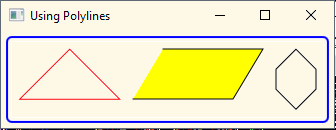

# 弧线（Arc）
弧线由 `Arc` 类表示，表示一个 2D 弧线对象，以椭圆的一部分来定义，所需属性如下：
|属性|说明|
|---|---|
|centerX|椭圆原点 X 值|
|centerY|椭圆原点 Y 值|
|radiusX|椭圆水平半径，default = 0|
|radiuxY|椭圆垂直半径，default = 0|
|startAngle|弧线起始角度（从X轴开始逆时针方向扫过的角度)|
|length	|弧线扫过的角度，default=0.0|
|type	|指定弧线封闭的方式|

前面四个属性定义了一个椭圆，后面三个属性定义了椭圆上的一个扇形。如下：

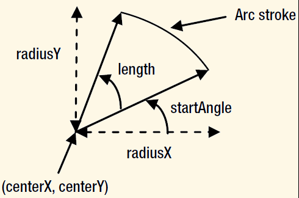

type 属性取值 `ArcType` 有三种：`OPEN`, `CHORD`, `ROUND`。
- `ArcType.OPEN`, 不封闭弧线，默认值。
- `ArcType.CHORD`, 以一条直线连接弧线的起始点。
- `ArcType.ROUND`, 将弧线的起始点和原点连接。

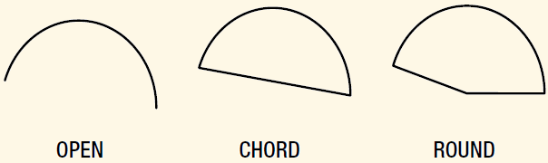

如果不指定 stroke，则指定 `ArcType` 无效。
- fill 属性，默认填充 `ArcType.CHORD` 区域

例：
```java
// An OPEN arc with a fill
Arc arc1 = new Arc(0, 0, 50, 100, 0, 90);
arc1.setFill(Color.LIGHTGRAY);

// An OPEN arc with no fill and a stroke
Arc arc2 = new Arc(0, 0, 50, 100, 0, 90);
arc2.setFill(Color.TRANSPARENT);
arc2.setStroke(Color.BLACK);

// A CHORD arc with no fill and a stroke
Arc arc3 = new Arc(0, 0, 50, 100, 0, 90);
arc3.setFill(Color.TRANSPARENT);
arc3.setStroke(Color.BLACK);
arc3.setType(ArcType.CHORD);

// A ROUND arc with no fill and a stroke
Arc arc4 = new Arc(0, 0, 50, 100, 0, 90);
arc4.setFill(Color.TRANSPARENT);
arc4.setStroke(Color.BLACK);
arc4.setType(ArcType.ROUND);

// A ROUND arc with a gray fill and a stroke
Arc arc5 = new Arc(0, 0, 50, 100, 0, 90);
arc5.setFill(Color.GRAY);
arc5.setStroke(Color.BLACK);
arc5.setType(ArcType.ROUND);

HBox root = new HBox(arc1, arc2, arc3, arc4, arc5);
root.setSpacing(10);
root.setStyle("-fx-padding: 10;" +
        "-fx-border-style: solid inside;" +
        "-fx-border-width: 2;" +
        "-fx-border-insets: 5;" +
        "-fx-border-radius: 5;" +
        "-fx-border-color: blue;");
Scene scene = new Scene(root);
primaryStage.setScene(scene);
primaryStage.setTitle("Using Arcs");
primaryStage.show();
```
效果图：

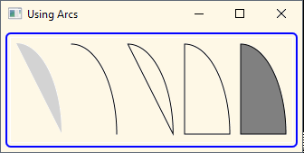

# 二次曲线（QuadCurve）
计算机中使用 [Bezier 曲线](https://en.wikipedia.org/wiki/B%C3%A9zier_curve) 绘制平滑曲线。`QuadCurve` 类表示有一个控制点两个指定点的 Bezier 曲线。(startX, startY), (controlX, controlY), (endX, endY)。例：

```java
QuadCurve qc1 = new QuadCurve(0, 100, 20, 0, 150, 100);
qc1.setFill(Color.TRANSPARENT);
qc1.setStroke(Color.BLACK);

QuadCurve qc2 = new QuadCurve(0, 100, 20, 0, 150, 100);
qc2.setFill(Color.LIGHTGRAY);

HBox root = new HBox(qc1, qc2);
root.setSpacing(10);
root.setStyle("-fx-padding: 10;" +
        "-fx-border-style: solid inside;" +
        "-fx-border-width: 2;" +
        "-fx-border-insets: 5;" +
        "-fx-border-radius: 5;" +
        "-fx-border-color: blue;");
Scene scene = new Scene(root);
primaryStage.setScene(scene);
primaryStage.setTitle("Using QuadCurves");
primaryStage.show();
```
效果如下：

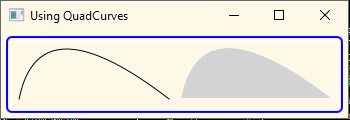

两个曲线：第一个黑线不填充，第二个stroke为null，浅灰色填充。

# 三次曲线（CubicCurve）
`CubicCurve` 三次曲线需要指定四个点: (startX, startY), (controlX1, controlY1), (controlX2, controlY2), (endX, endY)。

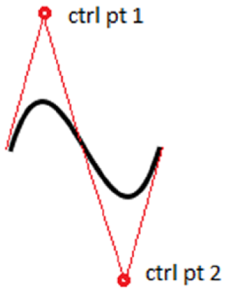

控制点，可以看做曲线切线的交点。

# Path
使用 `Path` 类定义图形的路径，可以创建复杂图形。`Path` 路径又分为多个子路径，子路径又由多个路径元素组成，路径元素由 `PathElement`类表示，其实就是定义线路。

`PathElement` 有多个子类：
- MoveTo
- LineTo
- HLineTo
- VLineTo
- ArcTo
- QuadCurveTo
- CubicCurveTo
- ClosePath

定义 `PathElement` 的坐标值可以采用相对或绝对值，默认采用绝对值：
- 绝对值坐标是相对 node 的本地坐标系
- 相对值坐标是相对上一个 `PathElement`的终点

可以通过 `absolute` 属性设置相对或绝对。

## MoveTo
`MoveTo` 将指定的坐标作为当前点，相当于提起笔，放到指定位置。`Path` 的第一个元素必须是 `MoveTo`，并且必须采用绝对坐标。`MoveTo` 定义了两个 double 属性 (x,y)。

构造函数：
```java
// Create a MoveTo path element to move the current point to (0.0, 0.0)
MoveTo mt1 = new MoveTo();

// Create a MoveTo path element to move the current point to (10.0, 10.0)
MoveTo mt2 = new MoveTo(10.0, 10.0);
```

## LineTo
`LineTo` 从当前点到指定点绘制直线。构造函数：
```java
// Create a LineTo path element with its end at (0.0, 0.0)
LineTo lt1 = new LineTo();

// Create a LineTo path element with its end at (10.0, 10.0)
LineTo lt2 = new LineTo(10.0, 10.0);
```

例：用 `MoveTo` 和 `LineTo` 绘制三角形
```java
Path triangle = new Path(new MoveTo(0, 0),
        new LineTo(0, 50),
        new LineTo(50, 50),
        new LineTo(0, 0));
```
效果图：

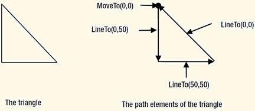

`ClosePath` 在当前点和起点之间绘制直线，封闭形状。如果路径中有多个 `MoveTo`，`ClosePath` 在当前点和上个 `MoveTo` 的起点绘制直线。

使用 `ClosePath` 重绘上面的三角形：
```java
Path triangle = new Path(new MoveTo(0, 0),
new LineTo(0, 50),
new LineTo(50, 50),
new ClosePath());
```

实例：绘制一个三角形和一个六角形
```java
Path triangle = new Path(new MoveTo(0, 0),
        new LineTo(0, 50),
        new LineTo(50, 50),
        new ClosePath());

Path star = new Path();
star.getElements().addAll(new MoveTo(30, 0),
        new LineTo(0, 30),
        new LineTo(60, 30),
        new ClosePath(),/* new LineTo(30, 0), */
        new MoveTo(0, 10),
        new LineTo(60, 10),
        new LineTo(30, 40),
        new ClosePath() /*new LineTo(0, 10)*/);

HBox root = new HBox(triangle, star);
root.setSpacing(10);
root.setStyle("-fx-padding: 10;" +
        "-fx-border-style: solid inside;" +
        "-fx-border-width: 2;" +
        "-fx-border-insets: 5;" +
        "-fx-border-radius: 5;" +
        "-fx-border-color: blue;");
Scene scene = new Scene(root);
primaryStage.setScene(scene);
primaryStage.setTitle("Using Paths");
primaryStage.show();
```
效果图：

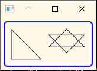

## HLineTo 和 VLineTo
`HLineTo` 绘制水平线，`VLineTo` 绘制垂直线，两者为特殊类型的 `LineTo`。如下：
```java
// Create an horizontal line from the current point (x, y) to (50, y)
HLineTo hlt = new HLineTo(50);

// Create a vertical line from the current point (x, y) to (x, 50)
VLineTo vlt = new VLineTo(50);
```

## ArcTo
绘制弧线。通过如下属性定义：
|属性|说明|
|---|---|
|radiusX, radiusY|指定椭圆的水平和垂直半径|
|x, y|弧线的终点|
|XAsixRotation|指定相对x轴旋转的度数|
|largeArcFlag||
|sweepFlag||

## Path 的填充规则
`Path` 类的 `fillRule` 属性用于确定一个点到底是形状内还是形状外。`FillRule` enum 只有两个值：`NON_ZERO` 和 `EVEN_ODD`。

如果一个点在形状内，会被指定的颜色渲染。如下图：

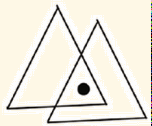

下面讨论其中的点到底如何渲染。

线条的方向对于确定一个点是否在图形内很重要。上面的图形可以采用不同的方向绘制。如下图所示：

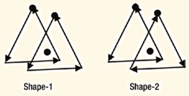

在 Shape-1 中，两个三角形都是逆时针绘制，在 Shape-2 中，一个逆时针，一个顺时针。

`Path` 的填充规则是：从考察点绘制射线，保证射线和图形相交。

对 `NON_ZERO` 填充规则，如果和射线相交的边的数量在顺时针和逆时针的方向相同，则该点在图形外，否则在图形内。可以以计数器的形式来算：每和逆时针线段相交，计数+1，和顺时针线段相交，计数-1，最终为0，则在图形外，不为0，则在图形内，这就是 `NON_ZERO` 的含义：


在上图中，左图，逆时针相交数目为6，在图形内；右图计数为0，在图形外。
- `EVEN_ODD` 和 `NON_ZERO` 类似，从考察点绘制射线。如果相交边数为偶数，则在图形外，否则在图形内。

按照该规则，上图的中点均在图形外。
例：采用不同的填充规则，填充图形，注意图形边的绘制方向：
```java
// Both triangles use a couterclockwise stroke
PathElement[] pathEleemnts1 = {new MoveTo(50, 0),
        new LineTo(0, 50),
        new LineTo(100, 50),
        new LineTo(50, 0),
        new MoveTo(90, 15),
        new LineTo(40, 65),
        new LineTo(140, 65),
        new LineTo(90, 15)};

// One traingle uses a clockwise stroke and
// another uses a couterclockwise stroke
PathElement[] pathEleemnts2 = {new MoveTo(50, 0),
        new LineTo(0, 50),
        new LineTo(100, 50),
        new LineTo(50, 0),
        new MoveTo(90, 15),
        new LineTo(140, 65),
        new LineTo(40, 65),
        new LineTo(90, 15)};
/* Using the NON-ZERO fill rule by default */
Path p1 = new Path(pathEleemnts1);
p1.setFill(Color.LIGHTGRAY);
Path p2 = new Path(pathEleemnts2);
p2.setFill(Color.LIGHTGRAY);

/* Using the EVEN_ODD fill rule */
Path p3 = new Path(pathEleemnts1);
p3.setFill(Color.LIGHTGRAY);
p3.setFillRule(FillRule.EVEN_ODD);
Path p4 = new Path(pathEleemnts2);
p4.setFill(Color.LIGHTGRAY);
p4.setFillRule(FillRule.EVEN_ODD);
HBox root = new HBox(p1, p2, p3, p4);
root.setSpacing(10);
root.setStyle("-fx-padding: 10;" +
        "-fx-border-style: solid inside;" +
        "-fx-border-width: 2;" +
        "-fx-border-insets: 5;" +
        "-fx-border-radius: 5;" +
        "-fx-border-color: blue;");
Scene scene = new Scene(root);
primaryStage.setScene(scene);
primaryStage.setTitle("Using Fill Rules for Paths");
primaryStage.show();
```
图形1的两个三角形都是逆时针绘制，图形2的靠左的三角形是逆时针，靠右的是顺时针。
- 按照 `NON_ZERO` 规则，图1相交区域在图内，图2的相交区域则在图外。
- 按照 `EVEN_ODD` 规则，两个图形的相交区域都在图形外。

效果：

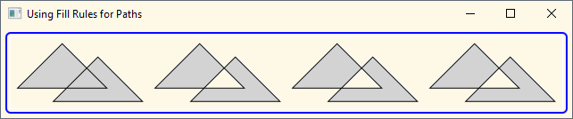

# SVG
`SVGPath` 类通过编码的字符串数据绘制图形。JavaFX 部分支持SVG标准。`SVGPath` 类包含两个属性：
- content, 表示svg字符串
- fillRule, 指定填充规则，`FillRule.NONE_ZERO` 或 `FillRule.EVEN_ODD`，和上节讨论的填充规则一样。

`SVGPath` 的 `content` 字符串满足如下规则：
- 该字符串包含一系列命令
- 每个命令名称只有一个字符
- 命令后为参数
- 参数之间以逗号或空格分开。如 “M50, 0 L0, 50 L100, 50 Z” and “M50 0 L0 50 L100 50 Z” 意思相同。一般建议以逗号分隔。
- 命令前后不需要空格。例如“M50 0 L0 50 L100 50 Z” 可以写为 “M50 0L0 50L100 50Z”.

下面来详细讨论一下命令：
	`M50, 0 L0, 50 L100, 50 Z`

该内容包含四个命令：

|命令	|解释|
|---|---|
|M50,0	|MoveTo(50,0)|
|L0,50	|LineTo(0,50)|
|L100,50|LineTo(100,50)|
|Z|ClosePath|

命令名和 `PathElement` 是一一对应的。命令参数为坐标值，可以为绝对或相对值。当命令大写（如 M），表示绝对，当命令小写（如 m），表示相对。“closepath”的命令为 `Z` 或 `z`。因为 `closepath` 命令不带任何参数，所以大小写无所谓。

如下两个SVG路径：
- M50, 0 L0, 50 L100, 50 Z
- M50, 0 l0, 50 l100, 50 Z

第一个路径使用绝对坐标系，第二个使用绝对和相对坐标系。和 `Path` 一样，`SVGPath` 必须以 `moveTo` 开头，且必须是绝对坐标系。如果 `SVGPath` 以相对坐标 `moveTo` 命令开头，依然会当做绝对坐标处理。

上面两个SVG路径绘制的两个三角形完全不同，既是参数相同。如下图所示：

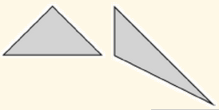

下表列出了 `SVGPath` 常用的命令。其中 (+) 表示可以使用多个参数。
|命令|参数|命令名|Path类|
|---|---|---|---|
|M|(x,y)+|moveto|MoveTo|
|L|(x,y)+|lineto|LineTo|
|H|x+|lineto|HLineTo|
|V|y+|lineto|VLineTo|
|A|(rx,ry,x-axis-rotation,large-arc-flag,sweep-flag,x,y)+|arcto|ArcTo|
|Q|(x1,y1,x,y)+|Quadratic Bezier curveto|QuadCurveTo|
|T|(x,y)+|Shorthand/smooth quadratic Bezier|curveto|QuadCurveTo|
|C|(x1, y1, x2, y2, x, y)+|curveto|CubicCurveTo|
|S|(x2,y2,x,y)+|Shorthand/smooth curveto|CubicCurveTo|
|Z|None|closePath|ClosePath|
