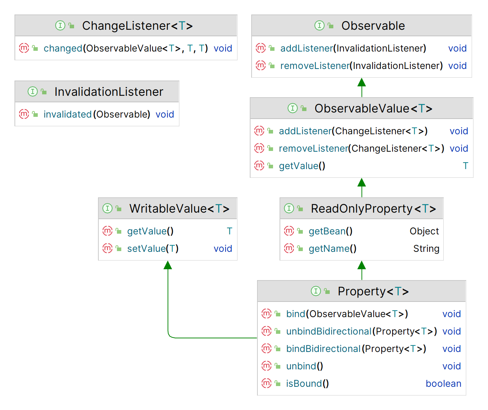

# Property 类的层次结构

2023-06-27, 19:34
****
## 1. 简介

在使用 JavaFX 属性和绑定 API 前，了解其核心类和接口很重要。下图是属性 API 的核心接口和类：



JavaFX 属性 API 的类和接口分布在不同包中，包括 `javafx.beans`, `javafx.beans.binding`, `javafx.beans.property` 和 `javafx.beans.value`。

## 2. Observable

`Observable` 接口位于属性 API 顶层，用于支持监控失效功能。使用 `Observable.addListener()` 添加 `InvalidationListener`，当 `Observable` 的内容失效时，调用 `InvalidationListener` 的 `invalidated() `方法。

所有 JavaFX 属性都是 `Observable`。

注意：仅当 `Observable` 包含内容的状态从有效变为无效时，才让 `Observable` 生成一个失效事件。如果同时发生多个失效操作，应该只生成一个失效事件。JavaFX 属性均遵循该原则。 

```ad-tip
`Observable` 生成失效事件，并不一定是因为内容发生了变化。例如，对 `ObservableList` 排序可能生成一个失效事件，但是排序不会改变内容，只是改变内容顺序。
```

## 3. ObservableValue

`ObservableValue` 接口继承 `Observable` 接口。`ObservableValue` 封装了一个值，并且可以观察值的变化。`getValue()` 返回封装的值。

`ObservableValue` 可以生成两类事件：

- 失效事件：当 `ObservableValue` 封装的值失效
- 更改事件：当 `ObservableValue` 封装的值发生变化

对重新计算值，`ObservableValue` 支持延迟和即时两种策略：

- 延迟策略：`ObservableValue` 值失效后不立刻重新计算，而是等到下一次读取值才重新计算
- 即时策略：值失效后立刻重新计算

延迟策略的效率更高。不过，在生成更改事件时，会强制 `ObservableValue` 立即重新计算值，因为它必须将新值传递给注册的 `ChangeListener`。

## 4. Property

`ReadOnlyProperty` 接口增加了 `getBean()` 和 `getName()` 方法：

- `getBean()` 返回包含属性对象的 bean 引用
- `getName()` 返回属性名称

所有属性都实现了 `ReadOnlyProperty` 接口。

`WritableValue` 封装了一个值，可以使用 `getValue()` 和 `setValue()` 方法进行读写。read-write 属性实现了该接口。

`Property` 接口继承了 `ReadOnlyProperty` 和 `WritableValue` 接口。添加了 5 个方法以支持绑定：

- `void bind(ObservableValue<? extends T> observable)`
- `void unbind()`
- `void bindBidirectional(Property<T> other)`
- `void unbindBidirectional(Property<T> other)`
- `boolean isBound()`

`bind()` 和 `unbind()` 用于添加和移除单向绑定。

`bindBidirectional()` 和 `unbindBidirectional()` 添加或移除双向绑定。

注意 `bind()` 和 `bindBidirectional()` 参数的区别：

- 单向绑定可以在 `Property` 和 `ObservableValue` 之间创建，且类型具有继承关系即可
- 双向绑定要求在两个 `Property` 之间创建，且类型必须相同

对绑定属性，`isBound()` 返回 `true`。

下图是 JavaFX 中 `Integer` 属性的部分类图，说明了 JavaFX 属性 API 的复杂性。


