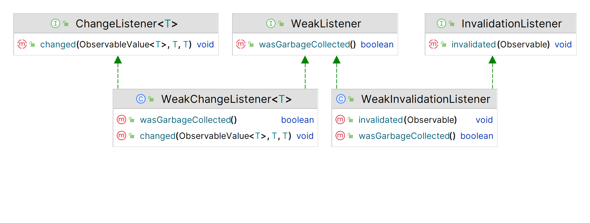

# Property Event

2023-06-27, 20:45
****
## 1. Invalidation Event

属性失效会生成一个 invalidation 事件。JavaFX 属性采用延迟计算策略处理 invalidation 事件，失效属性再次失效，不会重复生成 invalidation 事件。失效属性在重新计算后变为生效，例如调用属性的 `get(`) 或 `getValue() `方法会迫使重新计算属性值，使属性生效。

**示例：** 演示属性失效事件

```java
import javafx.beans.Observable;
import javafx.beans.property.IntegerProperty;
import javafx.beans.property.SimpleIntegerProperty;

public class InvalidationTest {

    public static void main(String[] args) {
        IntegerProperty counter = new SimpleIntegerProperty(100);

        // 为 counter 属性添加失效 listener
        counter.addListener(InvalidationTest::invalidated);

        System.out.println("Before changing the counter value-1");
        counter.set(101);
        System.out.println("After changing the counter value-1");

        // 此时 counter 属性失效，继续修改值也不会生成失效事件
        System.out.println("\nBefore changing the counter value-2");
        counter.set(102);
        System.out.println("After changing the counter value-2");

        // 调用 get() 方法使 counter 属性重新生效
        int value = counter.get();
        System.out.println("Counter value = " + value);

        // 此时 counter 属性有效
        // 修改为相同的值，不会生成失效事件，因为值没有变化
        System.out.println("\nBefore changing the counter value-3");
        counter.set(102);
        System.out.println("After changing the counter value-3");

        // 修改为不同的值
        System.out.println("\nBefore changing the counter value-4");
        counter.set(103);
        System.out.println("After changing the counter value-4");
    }

    public static void invalidated(Observable prop) {
        System.out.println("Counter is invalid.");
    }
}
```

```
Before changing the counter value-1
Counter is invalid.
After changing the counter value-1

Before changing the counter value-2
After changing the counter value-2
Counter value = 102

Before changing the counter value-3
After changing the counter value-3

Before changing the counter value-4
Counter is invalid.
After changing the counter value-4
```

```ad-tip
可以为 `Property` 添加任意数目的 `InvalidationListener`，使用完后最好调用 `Observable.removeListener(InvalidationListener listener)` 删除，否则可能导致内存泄漏。
```

## 2. Change Event

注册 `ChangeListener` 可以接收属性变化通知。每当属性值发生变化，都会触发属性变化事件。`ChangeListener` 的 `changed()` 方法有三个参数：属性对象引用，原来的值，新值。

**示例：** 演示 `ChangeListener` 的使用。

```java
import javafx.beans.property.IntegerProperty;
import javafx.beans.property.SimpleIntegerProperty;
import javafx.beans.value.ObservableValue;

public class ChangeTest {

    public static void main(String[] args) {
        // 创建属性
        IntegerProperty counter = new SimpleIntegerProperty(100);

        // 为 counter 属性添加 ChangeListener
        counter.addListener(ChangeTest::changed);

        System.out.println("\nBefore changing the counter value-1");
        counter.set(101); // 修改值，触发属性变化事件
        System.out.println("After changing the counter value-1");

        System.out.println("\nBefore changing the counter value-2");
        counter.set(102); // 修改值，触发属性变化事件
        System.out.println("After changing the counter value-2");

        // 设置为相同的值
        System.out.println("\nBefore changing the counter value-3");
        counter.set(102); // 值不变，不会触发事件
        System.out.println("After changing the counter value-3");

        // Try to set a different value
        System.out.println("\nBefore changing the counter value-4");
        counter.set(103);
        System.out.println("After changing the counter value-4");
    }

    public static void changed(ObservableValue<? extends Number> prop,
                               Number oldValue,
                               Number newValue) {
        System.out.print("Counter changed: ");
        System.out.println("Old = " + oldValue + ", new = " + newValue);
    }
}
```

```
Before changing the counter value-1
Counter changed: Old = 100, new = 101
After changing the counter value-1

Before changing the counter value-2
Counter changed: Old = 101, new = 102
After changing the counter value-2

Before changing the counter value-3
After changing the counter value-3

Before changing the counter value-4
Counter changed: Old = 102, new = 103
After changing the counter value-4
```

添加 `ChangeListener` 有个小技巧。在 `IntegerPropertyBase` 中 `addListener()` 的定义如下：

```java
void addListener(ChangeListener<? super Number> listener)
```

如果使用泛型，`IntegerProperty` 的 `ChangeListener` 必须根据 `Number` 类或其超类编写。为 `counter` 添加 `ChangeListener` 的三种方式：

```java
// 方法 1：使用泛型和 Number 类
counter.addListener(new ChangeListener<Number>() {
        @Override
        public void changed(ObservableValue<? extends Number> prop,
                            Number oldValue,
                            Number newValue) {
            System.out.print("Counter changed: ");
            System.out.println("Old = " + oldValue + ", new = " + newValue);
        }});

// 方法 2：使用泛型和 Object 类
counter.addListener( new ChangeListener<Object>() {
        @Override
        public void changed(ObservableValue<? extends Object> prop,
                            Object oldValue,
                            Object newValue) {
            System.out.print("Counter changed: ");
            System.out.println("Old = " + oldValue + ", new = " + newValue);
        }});

// 方法 3：不使用泛型，可能生成编译警告
counter.addListener(new ChangeListener() {
        @Override
        public void changed(ObservableValue prop,
                            Object oldValue,
                            Object newValue) {
            System.out.print("Counter changed: ");
            System.out.println("Old = " + oldValue + ", new = " + newValue);
        }});
```

前面的示例采用的第一种方式。

与失效事件不同，属性变化事件采用的是即时计算策略，因为它需要将新值传递给 `ChangeListener`。

## 3. Invalidation 和 Change Event

使用 `InvalidationListener` 还是 `ChangeListener`，需要考虑性能。一般来说，`InvalidationListener` 比 `ChangeListener` 性能更好。因为：

- `InvalidationListener` 采用的延迟计算策略
- 多个失效操作只生成一个失效事件

但是，使用哪个 Listener 取决于具体情况。根据经验，如果在失效事件处理器中需要读取属性值，就应该改用 `ChangeListener`。当你在 `InvalidationListener` 中读取属性值，会触发重新计算该值，该过程在触发 Change 事件前自动完成。

如果不需要读取属性值，使用 `InvalidationListener`。

**示例：** 为 `IntegerProperty` 添加一个 `InvalidationListener` 和一个 `ChangeListener`。

```java
import javafx.beans.Observable;
import javafx.beans.property.IntegerProperty;
import javafx.beans.property.SimpleIntegerProperty;
import javafx.beans.value.ObservableValue;

public class ChangeAndInvalidationTest {

    public static void main(String[] args) {
        IntegerProperty counter = new SimpleIntegerProperty(100);
		
        // 添加 InvalidationListener
        counter.addListener(ChangeAndInvalidationTest::invalidated);

        // 添加 ChangeListener
        counter.addListener(ChangeAndInvalidationTest::changed);

        System.out.println("Before changing the counter value-1");
        counter.set(101); // 触发两种事件
        System.out.println("After changing the counter value-1");

        System.out.println("\nBefore changing the counter value-2");
        counter.set(102); // 触发两种事件
        System.out.println("After changing the counter value-2");

        // Try to set the same value
        System.out.println("\nBefore changing the counter value-3");
        counter.set(102);
        System.out.println("After changing the counter value-3");

        // Try to set a different value
        System.out.println("\nBefore changing the counter value-4");
        counter.set(103);
        System.out.println("After changing the counter value-4");
    }

    public static void invalidated(Observable prop) {
        System.out.println("Counter is invalid.");
    }

    public static void changed(ObservableValue<? extends Number> prop,
                               Number oldValue,
                               Number newValue) {
        System.out.print("Counter changed: ");
        System.out.println("old = " + oldValue + ", new = " + newValue);
    }
}
```

```
Before changing the counter value-1
Counter is invalid.
Counter changed: old = 100, new = 101
After changing the counter value-1

Before changing the counter value-2
Counter is invalid.
Counter changed: old = 101, new = 102
After changing the counter value-2

Before changing the counter value-3
After changing the counter value-3

Before changing the counter value-4
Counter is invalid.
Counter changed: old = 102, new = 103
After changing the counter value-4
```

当属性值发生变化时，会同时触发 invaliation 和 change 事件。因为 change 事件会在属性变化后立即使属性生效。

## 4. Weak Listener

为 Observable 添加 InvalidationListener，Observable 保存对 InvalidationListener 的强引用。ObservableValue 类似，对注册的 `ChangeListener` 保持强引用。对运行较短的小型应用，基本无法察觉差异；然而在长时间运行的大型应用中，可能会遇到内存泄漏问题。该问题由 Observable 对象对注册 listener 的强引用引起。

解决方案是在不需要 listeners 调用 removeListener() 删除它们。实现这个方案并不容易，主要问题是何时删除 listeners。

**示例：** 添加、使用和删除 `ChangeListener`。

创建 IntegerProperty 类型的 static 变量 counter。在 main() 方法中，调用 addListener() 为 counter 添加 ChangeListener，修改 counter 值触发 Change 事件。最后删除 ChangeListener。

```java
// CleanupListener.java
package mjw.study.javafx.bean;

import javafx.beans.property.IntegerProperty;
import javafx.beans.property.SimpleIntegerProperty;
import javafx.beans.value.ChangeListener;
import javafx.beans.value.ObservableValue;

public class CleanupListener {

    public static IntegerProperty counter = new SimpleIntegerProperty(100);

    public static void main(String[] args) {
        // Add a change listener to the property
        ChangeListener<Number> listener = CleanupListener::changed;
        counter.addListener(listener);

        // Change the counter value
        counter.set(200);

        // Remove the listener
        counter.removeListener(listener);

        // Will not fire change event as change listener has 
        // already been removed.
        counter.set(300);
    }

    public static void changed(ObservableValue<? extends Number> prop,
                               Number oldValue,
                               Number newValue) {
        System.out.print("Counter changed: ");
        System.out.println("old = " + oldValue + ", new = " + newValue);
    }
}

```

```
Counter changed: old = 100, new = 200
```

**示例：** 强引用

稍微修改一下上面的示例，在 addStrongListener() 中为 counter 属性添加 ChangeListener，但后面不删除。

第二行输出证明，在 addStrongListener() 执行完毕后，counter 属性仍然保持对 ChangeListener 的引用。问题是，addStrongListener() 执行完毕后，因为 ChangeListener 是局部变量，所以失去了对它的引用，因此都无法删除该 listener。

该示例展示了在 Property 中使用 ChangeListener 和 InvalidationListener 可能存在的内存泄漏问题。 

```java
import javafx.beans.property.IntegerProperty;
import javafx.beans.property.SimpleIntegerProperty;
import javafx.beans.value.ChangeListener;
import javafx.beans.value.ObservableValue;

public class StrongListener {

    public static IntegerProperty counter = new SimpleIntegerProperty(100);

    public static void main(String[] args) {
        // Add a change listener to the property
        addStrongListener();
		
        // Change counter value. It will fire a change event.
        counter.set(300);
    }

    public static void addStrongListener() {
        ChangeListener<Number> listener = StrongListener::changed;
        counter.addListener(listener);

        // Change the counter value
        counter.set(200);
    }

    public static void changed(ObservableValue<? extends Number> prop,
                               Number oldValue,
                               Number newValue) {
        System.out.print("Counter changed: ");
        System.out.println("old = " + oldValue + ", new = " + newValue);
    }
}
```

```
Counter changed: old = 100, new = 200
Counter changed: old = 200, new = 300
```

解决方案是使用弱监听器。弱监听器为 WeakListener 接口的实例。JavaFX 提供了 WeakInvalidationListener 和 WeakChangeListener 两个实现，其类图如下：



WeakListener 接口的 wasGarbageCollected() 方法返回该 listener 是否被垃圾回收。下面主要讨论 ChangeListener，讨论内容也适用于 InvalidationListener。

WeakChangeListener 封装了 ChangeListener，只提供了一个构造函数。创建 WeakChangeListener 的方式如下：

```java
ChangeListener<Number> cListener = create a change listener...
WeakChangeListener<Number> wListener = new WeakChangeListener(cListener);

// Add a weak change listener, assuming that counter is a property
counter.addListener(wListener);
```

