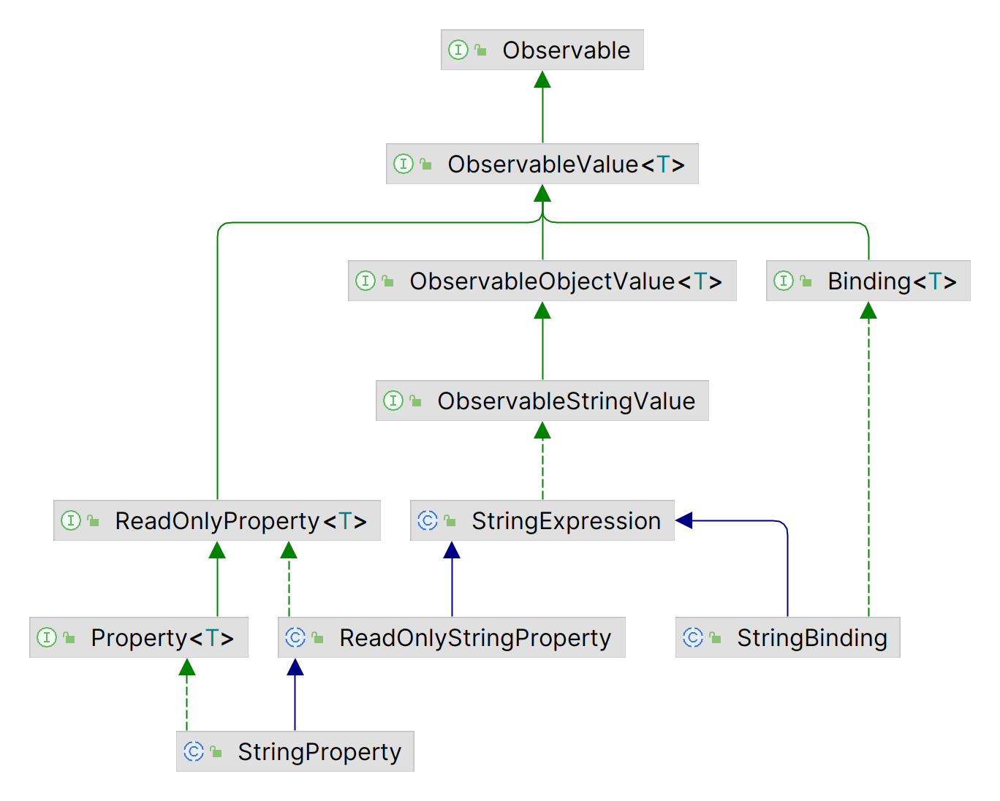

# Binding API

2023-06-28, 14:50
****
## 1. 简介

前面几节简单介绍了 JavaFX 绑定的概念，下面详细介绍绑定 API。绑定 API 分为两类：

- 高级绑定 API
- 底层绑定 API

高级绑定 API 使用已有 JavaFX 类库定义绑定；底层绑定 API 用于自定义绑定类。

## 2. 高级 API

高级绑定 API 分为两部分：Fluent API 和 `Bindings` 类，两者可以单独定义绑定，也可以组合起来定义绑定。

### 2.1. Fluent API

Fluent API 编写的代码可读性更好，但设计更复杂。Fluent API 的一个主要特性是方法链，可以将多次方法调用合并为一条语句。

例如，假设 `x`, `y`, `z` 是三个属性，nonfluent API 样式：

```java
x.add(y);
x.add(z);
```

fluent API 样式：

```java
x.add(y).add(z);
```

下图是 `IntegerBinding` 和 `IntegerProperty` 的类图（省略了部分接口和类），`long`, `float` 和 `double` 的类图类似。


学习 Fluent API，重点关注 `XXXExpression` 和 `XXXBinding` 类。`XXXExpression` 类用于创建绑定表达式。

#### 2.1.1. Binding 接口

`Binding` 接口表示从一个或多个依赖项派生值，该接口包含 4 个方法：

- `public void dispose()`
- `public ObservableList<?> getDependencies()`
- `public void invalidate()`
- `public boolean isValid()`

`dispose()` 的实现可选，用于告诉 `Binding` 不再使用它，可以删除对其它对象的引用。绑定 API 内部使用弱失效 Listener，因此没必要调用该方法。

`getDependencies()` 的实现可选，返回绑定依赖项的 unmodifiable `ObservableList`。只用于 debug，在生产代码中不应使用。

`invalidate()` 使绑定失效，如果绑定有效，`isValid()` 返回 `true`。

#### 2.1.2. NumberBinding 接口

`NumberBinding` 接口为 `Binding` 的数值扩展。该接口同时扩展 `NumberExpression` 接口，添加了许多数值相关的操作。

`NumberBinding` 的实现包括 `DoubleBinding`, `FloatBinding`, `IntegerBinding` 和 `LongBinding`。

#### 2.1.3. ObservableNumberValue 接口

`ObservableNumberValue` 接口封装数值类型。提供 4 个获取数值的方法：

- `double doubleValue()`
- `float floatValue()`
- `int intValue()`
- `long longValue()`

例如：

```java
IntegerProperty x = new SimpleIntegerProperty(100);
IntegerProperty y = new SimpleIntegerProperty(200);

// 创建绑定: sum = x + y
NumberBinding sum = x.add(y);
int value = sum.intValue(); // 获取值
```

#### 2.1.4. ObservableIntegerValue 接口

`ObservableIntegerValue` 在 `ObservableNumberValue` 的基础上提供了 `int` 特异性的 `get()` 方法：

```java
int get();
```

#### 2.1.5. NumberExpression 接口

`NumberExpression` 接口为数值类型 `Binding` 提供了丰富的方法。`NumberExpression` 包含 60 个方法，大多数是重载的。这些方法返回 `NumberBinding`, `BooleanBinding` 等 `Binding` 类型。下表列出了 `NumberExpression` 的主要方法：

| 方法                     | 返回类型         | 说明                                                                                                      |
| ------------------------ | ---------------- | --------------------------------------------------------------------------------------------------------- |
| `add()`                  | `NumberBinding`  | 以 `NumberExpression` 与 `ObservableNumberValue` 或 `double` 等数值类型的加和创建一个新的 `NumberBinding` |
| `subtract()`             | `NumberBinding`  | 同上                                                                                                      |
| `multiply()`             | `NumberBinding`  | 同上                                                                                                      |
| `divide()`               | `NumberBinding`  | 同上                                                                                                      |
| `greaterThan()`          | `BooleanBinding` | 以 `NumberExpression` 与 `ObservableNumberValue` 或 `double` 等数值类型的比较结果创建一个 `BooleanBinding`        |
| `greaterThanOrEqualTo()` | `BooleanBinding` | 同上                                                                                                      |
| `isEqualTo()`            | `BooleanBinding` | 同上                                                                                                      |
| `isNotEqualTo()`         | `BooleanBinding` | 同上                                                                                                      |
| `lessThan()`             | `BooleanBinding` | 同上                                                                                                      |
| `lessThanOrEqualTo()`    | `BooleanBinding` | 同上                                                                                                      |
| `negate()`               | `NumberBinding`  | 将 `NumberExpression` 取反创建一个新的 `NumberBinding`                                                        |
| `asString()`             | `StringBinding`  | 将 `NumberExpression` 的值转换为 `String`                                                                 |

`NumberExpression` 接口中的方法在定义绑定时，允许 `int`, `long`, `float` 和 `double` 类型混合使用。返回 `NumberBinding` 的具体类型是 `IntegerBinding`, `LongBinding`, `FloatBinding` 还是 `DoubleBinding`，与 Java 的规则一致：

- 包含 `double` 操作数 ，结果为 double
- 没有 `double` 操作数，但有 `float`，结果为 `float`
- 没有 `double` 和 `float` 操作数，但有 `long`，结果为 `long`
- 两个操作数都是 `int`，返回 `int`

例如：

```java
IntegerProperty x = new SimpleIntegerProperty(1);
IntegerProperty y = new SimpleIntegerProperty(2);
NumberBinding sum = x.add(y);
int value = sum.intValue();
```

`x` 和 `y` 都是 `int`，所以结果为 `int`，返回 `IntegerBinding` 对象。

上面的代码也可以写为：

```java
IntegerProperty x = new SimpleIntegerProperty(1);
IntegerProperty y = new SimpleIntegerProperty(2);

// 可以转换
IntegerBinding sum = (IntegerBinding)x.add(y);
int value = sum.get();
```

`NumberExpressionBase` 实现了 `NumberExpression` 接口；`IntegerExpression` 扩展 `NumberExpressionBase` 类，覆盖超类中的部分方法，以提供 `int` 特异性的返回值。

**示例**： 创建 `DoubleBinding` 计算圆的面积，同时创建一个 `DoubleProperty` 绑定到相同表达式计算面积。

使用 `DoubleBinding` 或 `DoubleProperty` 都可以，两者都实现了 `ObservableNumberValue`。  

```java
import javafx.beans.binding.DoubleBinding;
import javafx.beans.property.DoubleProperty;
import javafx.beans.property.SimpleDoubleProperty;

public class CircleArea {

    public static void main(String[] args) {

        DoubleProperty radius = new SimpleDoubleProperty(7.0);

        // 创建 binding 计算圆面积
        DoubleBinding area = radius.multiply(radius).multiply(Math.PI);

        System.out.println("Radius = " + radius.get() +
                ", Area = " + area.get());

        // 修改半径
        radius.set(14.0);
        System.out.println("Radius = " + radius.get() +
                ", Area = " + area.get());

        // 创建 DoubleProperty 绑定到计算圆面积的表达式
        DoubleProperty area2 = new SimpleDoubleProperty();
        area2.bind(radius.multiply(radius).multiply(Math.PI));
        System.out.println("Radius = " + radius.get() +
                ", Area2 = " + area2.get());
    }
}
```

```
Radius = 7.0, Area = 153.93804002589985
Radius = 14.0, Area = 615.7521601035994
Radius = 14.0, Area2 = 615.7521601035994
```

#### 2.1.6. StringBinding 类

`StringBinding` 的类图如下：



`ObservableStringValue` 接口声明了返回 `String` 的 `get()` 方法。

`StringExpression` 类提供了丰富的 fluent 风格方法。它有两个获取值的方法：`getValue()` 和 `getValueSafe()`，两者都返回当前值，差别在于，如果当前值为 `null` 时，`getValueSafe()` 返回空字符串。

**示例：** 演示 `StringBinding` 和 `StringExpression` 的使用

`StringExpression` 的 `concat()` 方法的参数为 `Object` 类型，如果参数为 `ObservableValue` 类型，当参数改变时 `StringExpression` 会自动更新值。

```java
import javafx.beans.binding.StringExpression;
import javafx.beans.property.DoubleProperty;
import javafx.beans.property.SimpleDoubleProperty;
import javafx.beans.property.SimpleStringProperty;
import javafx.beans.property.StringProperty;

import java.util.Locale;

public class StringExpressionTest {

    public static void main(String[] args) {
        DoubleProperty radius = new SimpleDoubleProperty(7.0);
        DoubleProperty area = new SimpleDoubleProperty(0);
        StringProperty initStr = new SimpleStringProperty("Radius = ");
		
        // 将面积与 表达式绑定
        area.bind(radius.multiply(radius).multiply(Math.PI));

        // 创建 StringExpression 描述 Circle
        StringExpression desc = initStr.concat(radius.asString())
                .concat(", Area = ")
                .concat(area.asString(Locale.US, "%.2f"));

        System.out.println(desc.getValue());

        // Change the radius
        radius.set(14.0);
        System.out.println(desc.getValue());
    }
}
```

```
Radius = 7.0, Area = 153.94
Radius = 14.0, Area = 615.75
```

#### 2.1.7. BooleanExpression 和 BooleanBinding

`BooleanExpression` 包含 `and(),` `or()`, `not()` 等布尔操作。

`isEqualTo()` 和 `isNotEqualTo()` 可以将 `BooleanExpression` 与另一个 `ObservableBooleanValue` 对比生成新的 `BooleanBinding`。

**示例：** `BooleanExpression` 使用示例

使用 fluent API 创建 `x > y && y != z `布尔表达式。

```java
import javafx.beans.binding.BooleanExpression;
import javafx.beans.property.IntegerProperty;
import javafx.beans.property.SimpleIntegerProperty;

public class BooelanExpressionTest {

    public static void main(String[] args) {
        IntegerProperty x = new SimpleIntegerProperty(1);
        IntegerProperty y = new SimpleIntegerProperty(2);
        IntegerProperty z = new SimpleIntegerProperty(3);

        // 创建 BooleanExpression: x > y && y <> z
        BooleanExpression condition = x.greaterThan(y).and(y.isNotEqualTo(z));

        System.out.println(condition.get());

        // Make the condition true by setting x to 3
        x.set(3);
        System.out.println(condition.get());
    }
}
```

```
false
true
```

### 2.2. 三元运算

Java 语言提供了 `(condition?value1:value2)` 形式的三元运算，JavaFX 的 `When` 类提供了绑定的三元运算，使用语法

```java
new When(condition).then(value1).otherwise(value2)
```

其中 `condition` 为 `ObservableBooleanValue` 类型。当 `condition` 为 `true`，返回 `value1`，否则返回 `value2`。

`value1` 和 `value2` 的类型必须相同。`value` 可以为常量或 `ObservableValue` 实例。

**示例：** 根据 `IntegerProperty` 为奇数还是偶数返回 "even" 或 "odd" 字符串。

Fluent API 没有计算模的方法，所以需要自定义。

```java
import javafx.beans.binding.StringBinding;
import javafx.beans.binding.When;
import javafx.beans.property.IntegerProperty;
import javafx.beans.property.SimpleIntegerProperty;

public class TernaryTest {

    public static void main(String[] args) {
        IntegerProperty num = new SimpleIntegerProperty(10);
        StringBinding desc = new When(num.divide(2).multiply(2).isEqualTo(num))
                .then("even")
                .otherwise("odd");

        System.out.println(num.get() + " is " + desc.get());

        num.set(19);
        System.out.println(num.get() + " is " + desc.get());
    }
}
```

```
10 is even
19 is odd
```

### 2.3. Bindings 工具类

`Bindings` 类用于辅助创建简单的绑定，`Bindings` 包含 150 多个 `static` 方法，大多数为重载类型。下表列出了 `Bindings` 的部分方法：

| 方法                  | 说明                                                                                                                            |
| --------------------- | ------------------------------------------------------------------------------------------------------------------------------- |
| `add()`                 | 参数相加创建绑定。至少一个参数为 `ObservableNumberValue` 类型。如果有 `double` 类型参数，返回 `DoubleBinding`，否则返回 `NumberBinding` |
| `subtract()`            | 同上                                                                                                                            |
| `multiply()`            | 同上                                                                                                                            |
| `divide()`              | 同上                                                                                                                            |
| `and()`                 | 使用 and 布尔运算创建 `BooleanBinding`                                                                                            |
| `bindBidirectional()`   | 使用两个 `Property` 创建一个双向绑定                                                                                              |
| `unbindBidirectional()` | 解除双向绑定                                                                                                                    |
| `concat()`              | 拼接字符串，返回 `StringExpression`                                                                                               |
| `convert()`             | 封装参数为 `StringExpression`                                                                                                     |
| `createXXXBinding()`    | 创建 `XXX` 类型的绑定，其中 `XXX` 为 `Boolean`, `Double`, `Float`, `Integer`, `String`, `Object`                                              |
| `equal()`               | 根据两个参数是否相等创建 `BooleanBinding`，支持 `tolerance`                                                                         |
| `notEqual(`)            | 同上                                                                                                                            |
| `equalIgnoreCase()`     | 对比 `String` 类型                                                                                                                |
| `notEqualIgnoreCase()`  | 同上                                                                                                                            |
| `format()`              | 使用指定格式化字符串对多个对象格式化，返回 `StringExpression`                                                                     |
| `greaterThan()`         | 对比参数，创建 `BooleanBinding`                                                                                                   |
| `greaterThanOrEqual()`  |                                                                                                                                 |
| `lessThan()`            |                                                                                                                                 |
| `lessThanOrEqual()`     |                                                                                                                                 |
| `isNotNull`             | 根据参数是否为 `null` 返回 `BooleanBinding`                                                                                         |
| `isNull`                | 同上                                                                                                                            |
| `max()`                 | 最大值操作，至少一个参数为 `ObservableNumberValue` 类型                                                                           |
| `min()`                 | 最小值操作                                                                                                                      |
| `negate()`              | 取反操作，参数为 `ObservableNumberValue` 类型，返回 `NumberBinding`                                                                 |
| `not()`                 | 布尔操作：`ObservableBooleanValue` 参数，返回 `BooleanBinding`                                                                      |
| `or()`                  | 同上                                                                                                                            |
| `selectXXX()`           | 创建绑定来选择嵌套属性                                                                                                          |
| `when()`                | 创建 `When` 实例                                                                                                                                |

**示例：** 使用 Fluent API 创建的大多数示例都可以使用 `Bindings` 类实现。

```java
import javafx.beans.binding.Bindings;
import javafx.beans.binding.StringExpression;
import javafx.beans.property.DoubleProperty;
import javafx.beans.property.SimpleDoubleProperty;

import java.util.Locale;

public class BindingsClassTest {

    public static void main(String[] args) {
        DoubleProperty radius = new SimpleDoubleProperty(7.0);
        DoubleProperty area = new SimpleDoubleProperty(0.0);
	
        // Bind area to an expression that computes the area of the circle
        area.bind(Bindings.multiply(Bindings.multiply(radius, radius), Math.PI));

        // 创建 StringExpression 来描述圆	    
        StringExpression desc = Bindings.format(Locale.US,
                "Radius = %.2f, Area = %.2f", radius, area);

        System.out.println(desc.get());

        // 修改半径
        radius.set(14.0);
        System.out.println(desc.getValue());
    }
}

```

```
Radius = 7.00, Area = 153.94
Radius = 14.00, Area = 615.75
```

**示例：** `Bindings` 的 `selectXXX()` 方法的使用

`selectXXX()` 为嵌套属性创建绑定。在嵌套层次结构中，所有类和属性必须是 `public`。

假设有一个 `Address` 类包含一个 `zip` 属性，`Person` 类包含 `addr` 属性。

```java
import javafx.beans.property.SimpleStringProperty;
import javafx.beans.property.StringProperty;

public class Address {

    private StringProperty zip = new SimpleStringProperty("36106");

    public StringProperty zipProperty() {
        return zip;
    }
}
```

```java
import javafx.beans.property.ObjectProperty;
import javafx.beans.property.SimpleObjectProperty;

public class Person {

    private ObjectProperty<Address> addr = new SimpleObjectProperty<>(new Address());

    public ObjectProperty<Address> addrProperty() {
        return addr;
    }
}
```

为 `Person` 创建一个 `ObjectProperty`：

```java
ObjectProperty<Person> p = new SimpleObjectProperty(new Person());
```

使用 `Bindings.selectString()` 可以为 `Person` 的 `addr` 属性下的 `zip` 属性创建 `StringBinding`：

```java
StringBinding zipBinding = Bindings.selectString(p, "addr", "zip");
```

`selectXXX()` 支持多级嵌套，例如：

```java
StringBinding xyzBinding = Bindings.selectString(x, "a", "b", "c", "d");
```

完整示例：

```java
import javafx.beans.binding.Bindings;
import javafx.beans.binding.StringBinding;
import javafx.beans.property.ObjectProperty;
import javafx.beans.property.SimpleObjectProperty;
import javafx.beans.property.SimpleStringProperty;
import javafx.beans.property.StringProperty;

public class BindNestedProperty {

    public static class Address {

        private StringProperty zip = new SimpleStringProperty("36106");

        public StringProperty zipProperty() {
            return zip;
        }

        public String getZip() {
            return zip.get();
        }

        public void setZip(String newZip) {
            zip.set(newZip);
        }
    }

    public static class Person {

        private ObjectProperty<Address> addr = new SimpleObjectProperty<>(new Address());

        public ObjectProperty<Address> addrProperty() {
            return addr;
        }

        public Address getAddr() {
            return addr.get();
        }

        public void setZip(Address newAddr) {
            addr.set(newAddr);
        }
    }

    public static void main(String[] args) {
        ObjectProperty<Person> p = new SimpleObjectProperty<>(new Person());

        // Bind p.addr.zip
        StringBinding zipBinding = Bindings.selectString(p, "addr", "zip");
        System.out.println(zipBinding.get());

        // Change the zip
        p.get().addrProperty().get().setZip("35217");
        System.out.println(zipBinding.get());

        // Bind p.addr.state, which does not exist
        StringBinding stateBinding = Bindings.selectString(p, "addr", "state");
        System.out.println(stateBinding.get());
    }
}
```

绑定不存在的属性 `p.addr.state` 抛出异常并返回 `null`。

```
36106
35217
Jun 28, 2023 1:59:25 PM com.sun.javafx.binding.SelectBinding$SelectBindingHelper getObservableValue
警告: Exception while evaluating select-binding [addr, state]
java.lang.NoSuchMethodException: mjw.study.javafx.bean.BindNestedProperty$Address.getState()
	at java.base/java.lang.Class.getMethod(Class.java:2108)
    ...
null
```

### 2.4. 结合 Fluent API 和 Bindings 类

例如：

```java
DoubleProperty radius = new SimpleDoubleProperty(7.0);
DoubleProperty area = new SimpleDoubleProperty(0);
// Combine the Fluent API and Bindings class API
area.bind(Bindings.multiply(Math.PI, radius.multiply(radius)));
```

## 3. 底层 API

当高级 API 不满足需求，例如，没有计算 `Observable` 数值平方根的方法。如果高级绑定 API 变得太麻烦，或者没有提供你需要的功能，此时可以用底层绑定 API。底层绑定 API 更加灵活，代价是没那么方便。

使用底层 API 需要三步：

1. 自定义类，扩展某个绑定类，如 `DoubleBinding`
2. 调用超类的 `bind(`) 方法绑定所有依赖项。所有绑定类都实现了 `bind()` 方法，其参数为 `Observable` 类的 varargs
3. 重写超类的 `computeValue()` 方法，在其中编写绑定逻辑。负责计算绑定的当前值，返回类型与绑定类型相同。

此外，可以覆盖绑定类的其它方法。比如重写 `dispose()` 方法，以便在销毁绑定时执行其它操作；如果希望在绑定失效时执行其它操作，可以重写 `onInvalidating()` 方法。

**示例：** 使用底层 API 计算圆面积

```java
final DoubleProperty radius = new SimpleDoubleProperty(7.0);
DoubleProperty area = new SimpleDoubleProperty(0);

DoubleBinding areaBinding = new DoubleBinding() {
    {
        this.bind(radius);
    }

    @Override
    protected double computeValue() {
        double r = radius.get();
        double area = Math.PI * r * r;
        return area;
    }
};

area.bind(areaBinding); // Bind the area property to the areaBinding
```

上面扩展 `DoubleBinding` 创建了一个匿名类。它调用 `bind()` 与 `radius` 属性绑定。

匿名类没有构造函数，所以必须使用实例初始化方式调用 `bind()`。

`computeValue()` 计算并返回圆的面积。

```java
import javafx.beans.binding.DoubleBinding;
import javafx.beans.binding.StringBinding;
import javafx.beans.property.DoubleProperty;
import javafx.beans.property.SimpleDoubleProperty;
import javafx.collections.FXCollections;
import javafx.collections.ObservableList;

import java.util.Formatter;
import java.util.Locale;

public class LowLevelBinding {

    public static void main(String[] args) {
        final DoubleProperty radius = new SimpleDoubleProperty(7.0);
        final DoubleProperty area = new SimpleDoubleProperty(0);

        DoubleBinding areaBinding = new DoubleBinding() {
            {
                this.bind(radius);
            }

            @Override
            protected double computeValue() {
                double r = radius.get();
                double area = Math.PI * r * r;
                return area;
            }
        };

        // Bind area to areaBinding
        area.bind(areaBinding);

        // Create a StringBinding
        StringBinding desc = new StringBinding() {
            {
                this.bind(radius, area);
            }

            @Override
            protected String computeValue() {
                Formatter f = new Formatter();
                f.format(Locale.US, "Radius = %.2f, Area = %.2f",
                        radius.get(), area.get());
                String desc = f.toString();
                return desc;
            }

            @Override
            public ObservableList<?> getDependencies() {
                return FXCollections.unmodifiableObservableList(
                        FXCollections.observableArrayList(radius, area)
                );
            }

            @Override
            public void dispose() {
                System.out.println("Description binding is disposed.");
            }

            @Override
            protected void onInvalidating() {
                System.out.println("Description is invalid.");
            }
        };

        System.out.println(desc.getValue());

        // Change the radius
        radius.set(14.0);
        System.out.println(desc.getValue());
    }
}

```

```
Radius = 7.00, Area = 153.94
Description is invalid.
Radius = 14.00, Area = 615.75
```
