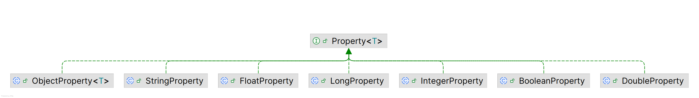

# JavaFX 属性和绑定

2025-05-23⭐
@author Jiawei Mao

***
## 概述

### 什么是属性

Java 类可以包含字段和方法两种类成员。字段表示对象的状态，一般声明为 `private`，然后提供 `public` 的 getter 和 setter 方法：

- 对部分或所有字段提供 public getter 和 setter 的 Java 类称为 Java bean
- getter 和 setter 定义了 bean 的**属性**（property）
- Java bean 可以通过属性定义其状态和行为

Java bean 是可观察的（observable），支持属性变更通知。当 Java bean 的 `public` 属性发生变化，会向注册的监听器发送通知。本质上，Java bean 定义了可重用组件，这些组件甚至可以通过构建工具来创建 Java 应用。

属性包含 read-only, write-only 以及 read-write 类型：read-only 属性只有 getter 方法，write-only 属性只有 setter 方法。

Java IDE 等构建工具通过内省（introspection）获取 bean 的属性列表。

JavaBeans API 在 `java.beans` 包中提供了创建和使用 Java beans 的功能及命名约定。下面是一个具有 `name` 属性的 `Person` bean：

```java
public class Person {
    private String name;
    
    public String getName() {
        return name;
    }
    public void setName(String name) {
        this.name = name;
    }
}
```

按照**约定**，getter 和 setter 方法名称是在属性名称前添加 *get* 或 *set* 前缀：

- getter 方法没有参数，返回类型与字段相同
- setter 方法的参数与字段类型相同，返回 `void`

以编程的方式操作 `Person` bean 的 `name` 属性：

```java
Person p = new Person();
p.setName("John Jacobs");
String name = p.getName();
```

有些面向对象编程语言，如 C#，提供了第三种类成员，称为属性（property）。`Person` 的 C# 实现：

```csharp
public class Person {
    private string name;

    public string Name {
        get { return name; }
        set { name = value; }
    }
}
```

对应的 `Name` 属性操作：

```csharp
Person p = new Person();
p.Name = "John Jacobs";
string name = p.Name;
```

如果只需要访问和返回字段值，C# 还有一种更紧凑的定义：

```csharp
public class Person {
    public string Name { get; set; }
}
```

```ad-tip
属性（*property*）定义了对象的 `public` 状态，支持读写，是可观察的（observable），支持变更通知。
```

### 什么是数据绑定

**数据绑定**（*data binding*）定义程序中数据元素（通常是变量）之间的关系，保持它们同步。GUI 程序通常使用数据绑定同步数据模型元素和相应的 UI 元素。

假设 x, y, z 是数值变量：

```java
x = y + z;
```

该语句定义了 x, y, z 之间的数据绑定。执行时，x 的值与 y, z 的加和同步。

绑定具有**时效性**，执行该语句之前和之后，x 的值不一定是 y 和 z 的加和。

有时候，希望绑定能持续一段时间。例如：

```java
soldPrice = listPrice - discounts + taxes;
```

此时，希望绑定永远有效，这样当 `listPrice`、`discounts` 或 `taxes` 发生变化时，都能正确计算 `soldPrice`。其中，`listPrice`、`discounts` 和 `taxes` 称为**依赖项**，`soldPrice` 与这些依赖性绑定。

为了使绑定正确工作，必须在依赖项发生变化时通知绑定。当依赖项无效或发生变化，所有 listeners 收到通知。绑定收到通知后，将自己与其依赖项同步。

绑定分为**即时绑定**（*eager binding*）和**延迟绑定**（*lazy binding*）：

- 即时绑定，绑定变量在其依赖项发生变化时立即重新计算
- 延迟绑定，依赖项发生变化时不重新计算，而是在下一次读取时重新计算

延迟绑定比即时绑定性能更好。

绑定还可以分为**单向绑定**和**双向绑定**：

- 单向绑定，依赖项的变化单向传递到绑定变量
- 双向绑定，绑定变量和依赖项保持同步

双向绑定只能在两个变量之间定义，例如，x=y 或 y=x 为双向绑定，使 x 和 y 的值相同。

在 GUI 应用程序中，GUI 控件显示的数据与底层数据模型同步，就可以使用双向绑定实现。

### JavaBeans 绑定

Java 很早就支持 bean 属性绑定。

**示例：** `Employee` 包含两个属性，`name` 和 `salary`

```java
import java.beans.PropertyChangeListener;
import java.beans.PropertyChangeSupport;

public class Employee {

    private String name;
    private double salary;
    private PropertyChangeSupport pcs = new PropertyChangeSupport(this);

    public Employee() {
        this.name = "John Doe";
        this.salary = 1000.0;
    }

    public Employee(String name, double salary) {
        this.name = name;
        this.salary = salary;
    }

    public String getName() {
        return name;
    }

    public void setName(String name) {
        this.name = name;
    }

    public double getSalary() {
        return salary;
    }

    public void setSalary(double newSalary) {
        double oldSalary = this.salary;
        this.salary = newSalary;
        // 通知注册的 listeners salary 发生变化
        pcs.firePropertyChange("salary", oldSalary, newSalary);
    }

    public void addPropertyChangeListener(PropertyChangeListener listener) {
        pcs.addPropertyChangeListener(listener);
    }

    public void removePropertyChangeListener(PropertyChangeListener listener) {
        pcs.removePropertyChangeListener(listener);
    }

    @Override
    public String toString() {
        return "name = " + name + ", salary = " + salary;
    }
}
```

`Employee` 的两个属性都是 read-write 类型。`salary` 是绑定属性，当 `salary` 发生变化，其 setter 方法会发出属性变化通知。对 `salary` 变更感兴趣的对象可以调用 `addPropertyChangeListener()` 和 `removePropertyChangeListener()` 注册或注销 listener。

`PropertyChangeSupport` 类是 JavaBeans 的一部分，用于辅助注册和注销 listener，并发出属性变更通知。对 `salary` 改变感兴趣的类需要向 `Employee` bean 注册 listener，在收到变更通知时采取必要操作。

**示例：** 展示为 `Employee` bean 注册 `salary` 注册更改通知。

```java
import java.beans.PropertyChangeEvent;

public class EmployeeTest {

    public static void main(String[] args) {
        final Employee e1 = new Employee("John Jacobs", 2000.0);

        // 计算 tax
        computeTax(e1.getSalary());
        // 为 e1 添加一个属性更改 listener
        e1.addPropertyChangeListener(EmployeeTest::handlePropertyChange);

        // 修改 salary
        e1.setSalary(3000.00);
        e1.setSalary(3000.00); // No change notification is sent.
        e1.setSalary(6000.00);
    }

    public static void handlePropertyChange(PropertyChangeEvent e) {
        String propertyName = e.getPropertyName();
        if ("salary".equals(propertyName)) {
            System.out.print("Salary has changed. ");
            System.out.print("Old:" + e.getOldValue());
            System.out.println(", New:" + e.getNewValue());
            computeTax((Double) e.getNewValue());
        }
    }

    public static void computeTax(double salary) {
        final double TAX_PERCENT = 20.0;
        double tax = salary * TAX_PERCENT / 100.0;
        System.out.println("Salary:" + salary + ", Tax:" + tax);
    }
}
```

```
Salary:2000.0, Tax:400.0
Salary has changed. Old:2000.0, New:3000.0
Salary:3000.0, Tax:600.0
Salary has changed. Old:3000.0, New:6000.0
Salary:6000.0, Tax:1200.0
```

从输出可以发现，调用了三次 `setSalary()`，但只触发了两次 `salary` 变更通知。这是因为第二次调用 `setSalary()` 使用的 `salary` 值与第一次调用 `setSalary() `的值相同，而 `PropertyChangeSupport` 能够检测到这一点。

## JavaFX 属性

JavaFX 对属性、事件和绑定具有良好支持。JavaFX 的所有属性都是 observable，可以监听属性的失效或变更。JavaFX 属性包含 read-write 和 read-only 类型，所有 read-write 属性支持绑定。

JavaFX 属性分为单值属性或集合属性。这里介绍单值属性，下一节介绍集合属性。

JavaFX 属性均定义为单独的类。如 `IntegerProperty`, `DoubleProperty`, `StringProperty` 类分别定义 `int`, `double` 和 `String` 类型属性。这些都是抽象类，它们均有两种具体实现：

- read-write 实现，如 `SimpleDoubleProperty` 为 `DoubleProperty` 的 read-write 实现
- read-only 实现，如 `ReadOnlyDoubleWrapper` 为 `DoubleProperty` 的 read-only 实现

下面创建一个初始值为 100 的 read-write `IntegerProperty`：

```java
IntegerProperty counter = new SimpleIntegerProperty(100);
```

### getter 和 setter

getter 和 setter 统称为 accessor，`Property` 类提供了两种 accessors：

- `get()`/`set()`，用于基本类型，如 `IntegerProperty` 的 `get(`) 返回 `int` 类型，`set()` 参数为 `int` 类型
- `getValue()`/`setValue()`，用于对象类型，如 `IntegerProperty` 的 `getValue()` 返回 Integer 类型，`setValue()` 参数为 `Integer` 类型

> [!TIP]
>
> 对引用类型属性，如 `StringProperty` 和 `ObjectProperty<T>`，两种 accessors 都采用对象类型，即 `StringProperty` 的 `get()` 和 `getValue()` 都返回 `String`，`set()` 和 `setValue()` 的参数都是 `String`。基本类型由于自动装箱，采用哪种 accessor 都行，提供 `getValue()` 和 `setValue()` 是为了方便编写泛型代码。

**示例：** 演示 `IntegerProperty` 及其 accessor 的使用。

`counter` 为 `SimpleIntegerProperty` 类型，是 read-write 属性。

```java
IntegerProperty counter = new SimpleIntegerProperty(1);
int counterValue = counter.get();
System.out.println("Counter:" + counterValue);

counter.set(2);
counterValue = counter.get();
System.out.println("Counter:" + counterValue);
```

```
Counter:1
Counter:2
```

### read-only 属性

read-only 属性的设计有点意思。`ReadOnlyXXXWrapper` 类包装了两个 `XXX` 类型属性：

- 一个 read-only
- 一个 read-write

两个属性的值同步。`ReadOnlyXXXWrapper.getReadOnlyProperty()` 返回 `ReadOnlyXXXProperty`，为 read-only 属性。

**示例：** 创建 read-only `Integer` 属性

- `idWrapper` 其实是 read-write 类型
- `id` 是 read-only 属性
- 当 `idWrapper` 的值改变，`id` 的值随之改变

```java
ReadOnlyIntegerWrapper idWrapper = new ReadOnlyIntegerWrapper(100);
ReadOnlyIntegerProperty id = idWrapper.getReadOnlyProperty();

System.out.println("idWrapper:" + idWrapper.get());
System.out.println("id:" + id.get());

// Change the value
idWrapper.set(101);
System.out.println("idWrapper:" + idWrapper.get());
System.out.println("id:" + id.get());
```

```
idWrapper:100
id:100
idWrapper:101
id:101
```

```ad-tip
wrapper 属性一般作为 `private` 变量使用，这样可以在类的内部修改属性值。然后提供了一个 `public` 方法返回 wrapper 的 read-only 属性对象，这样该属性对外为 read-only。
```

### 属性类

单值属性有 7 种类型。这些属性：

- 基类名为 `XXXProperty`
- read-only 类名为 `ReadOnlyXXXProperty`
- wrapper 类名为 `ReadOnlyXXXWrapper`

各个类型的 `XXX` 值列表：

| 类型    | XXX 值  |
| ------- | ------- |
| int     | Integer |
| long    | Long    |
| float   | Float   |
| double  | Double  |
| boolean | Boolean |
| String  | String  |
| Object  | Object  |

如，int 类似属性，基类名为 `IntegerProperty`, read-only 类名为 `ReadOnlyIntegerProperty`, wrapper 类名为 `ReadOnlyIntegerWrapper`。

`Property` 对象包含三种信息：

- 对包含该属性的 bean 引用
- name
- value

`Property` 实现类通常提供了 4 个构造函数，以 `SimpleIntegerProperty` 为例：

```java
SimpleIntegerProperty()
SimpleIntegerProperty(int initialValue)
SimpleIntegerProperty(Object bean, String name)
SimpleIntegerProperty(Object bean, String name, int initialValue)
```

`initialValue` 的默认值取决于属性类型：

- 数值类型为 0
- `boolean` 类型为 `false`
- 引用类型为 `null`

属性可以是 bean 的一部分，也可以是独立对象：

- 作为 bean 的一部分时，构造函数中的 `bean` 参数是对 bean 对象的引用
- 作为独立对象时，`bean` 为 `null`，bean 默认为 `null`。

`name` 是属性名称，默认为空字符串。

**示例：** 创建一个属性，作为 bean 的一部分

```java
public class Person {

    private StringProperty name = new SimpleStringProperty(this, "name", "Li");
    // More code goes here...
}
```

## JavaFX Bean

主要内容：如何使用 JavaFX 属性。

下面创建一个 `Book` 类，在其中定义三个属性：`ISBN`, `title` 和 `price`。

### read-write 属性

**定义 title 属性**

```java
public class Book {
    private StringProperty title = new SimpleStringProperty(this, "title", "Unknown");
}
```

**定义 getter 方法**

```java
public class Book {
    private StringProperty title = new SimpleStringProperty(this, "title", "Unknown");

    public final StringProperty titleProperty() {
        return title;
    }
}
```

**使用 title 属性**

```java
Book b = new Book();
b.titleProperty().set("Harnessing JavaFX 17.0");
String title = b.titleProperty().get();
```

**定义 getter 和 setter**

根据 JavaFX 设计模式，每个 JavaFX 属性应该提供与 JavaBeans 类似的 getter 和 setter。`title` 属性的 getter 和 setter 定义：

```java
public class Book {
    private StringProperty title = new SimpleStringProperty(this, "title", "Unknown");
    
    public final StringProperty titleProperty() {
        return title;
    }

    public final String getTitle() {
        return title.get();
    }

    public final void setTitle(String title) {
        this.title.set(title);
    }
}
```

这里 `getTitle()` 和 `setTitle()` 内部使用 `title` 属性获取和设置 `title` 值。

```ad-tip
属性的 getter 和 setter 方法一般声明为 `final`。附加的 getter 和 setter 命名方法与 JavaBeans 一致，方便一些老的工具识别。
```

### read-only 属性

**定义 ISBN read-only 属性**

```java
public class Book {
    private ReadOnlyStringWrapper ISBN = new ReadOnlyStringWrapper(this, "ISBN", "Unknown");

    public final String getISBN() {
        return ISBN.get();
    }

    public final ReadOnlyStringProperty ISBNProperty() {
        return ISBN.getReadOnlyProperty();
    }
    // More code goes here...
}
```

要点：

- 使用 `ReadOnlyStringWrapper` 而非 `SimpleStringProperty`
- 没有 setter 方法，你可以定义一个，但必须为 `private`
- getter 方法与 read-write 属性一样
- `ISBNProperty()` 返回 `ReadOnlyStringProperty` 类型，而不是 `ReadOnlyStringWrapper` 类型。即从 wrapper 获得一个 read-only 版本

对使用 `Book` API 的用户，`ISBN` 是 read-only；而在 `Book` 内部可以修改 `ISBN` 值，并且修改结果会自动同步到 read-only 版本。

### 完整示例

`Book` 定义了两个 read-write 属性，一个 read-only 属性。

```java
import javafx.beans.property.*;

public class Book {

    private StringProperty title = new SimpleStringProperty(this, "title", "Unknown");
    private DoubleProperty price = new SimpleDoubleProperty(this, "price", 0.0);
    private ReadOnlyStringWrapper ISBN = new ReadOnlyStringWrapper(this, "ISBN", "Unknown");

    public Book() {}

    public Book(String title, double price, String ISBN) {
        this.title.set(title);
        this.price.set(price);
        this.ISBN.set(ISBN);
    }

    public final String getTitle() {
        return title.get();
    }

    public final void setTitle(String title) {
        this.title.set(title);
    }

    public final StringProperty titleProperty() {
        return title;
    }

    public final double getPrice() {
        return price.get();
    }

    public final void setPrice(double price) {
        this.price.set(price);
    }

    public final DoubleProperty priceProperty() {
        return price;
    }

    public final String getISBN() {
        return ISBN.get();
    }

    public final ReadOnlyStringProperty ISBNProperty() {
        return ISBN.getReadOnlyProperty();
    }
}
```


测试：

1. 创建 `Book`
2. 打印 `Book` 信息
3. 修改 `Book` 属性
4. 打印 `Book` 信息

注意 `printDetails()` 方法的参数类型为 `ReadOnlyProperty`。因为所有属性类直接或间接地实现了 `ReadOnlyProperty` 接口。

```java
import javafx.beans.property.ReadOnlyProperty;

public class BookPropertyTest {

    public static void main(String[] args) {
        Book book = new Book("Harnessing JavaFX", 9.99, "0123456789");

        System.out.println("After creating the Book object...");

        // Print Property details
        printDetails(book.titleProperty());
        printDetails(book.priceProperty());
        printDetails(book.ISBNProperty());

        // Change the book's properties
        book.setTitle("Harnessing JavaFX 8.0");
        book.setPrice(9.49);

        System.out.println("\nAfter changing the Book properties...");

        // Print Property details
        printDetails(book.titleProperty());
        printDetails(book.priceProperty());
        printDetails(book.ISBNProperty());
    }

    public static void printDetails(ReadOnlyProperty<?> p) {
        String name = p.getName();
        Object value = p.getValue();
        Object bean = p.getBean();
        String beanClassName
                = (bean == null) ? "null" : bean.getClass().getSimpleName();
        String propClassName = p.getClass().getSimpleName();

        System.out.print(propClassName);
        System.out.print("[Name:" + name);
        System.out.print(", Bean Class:" + beanClassName);
        System.out.println(", Value:" + value + "]");
    }
}

```

```
After creating the Book object...
SimpleStringProperty[Name:title, Bean Class:Book, Value:Harnessing JavaFX]
SimpleDoubleProperty[Name:price, Bean Class:Book, Value:9.99]
ReadOnlyPropertyImpl[Name:ISBN, Bean Class:Book, Value:0123456789]

After changing the Book properties...
SimpleStringProperty[Name:title, Bean Class:Book, Value:Harnessing JavaFX 8.0]
SimpleDoubleProperty[Name:price, Bean Class:Book, Value:9.49]
ReadOnlyPropertyImpl[Name:ISBN, Bean Class:Book, Value:0123456789]
```

## Property 类结构

在使用 JavaFX 属性和绑定 API 前，了解其核心类和接口很重要。下图是属性 API 的核心接口和类：


JavaFX 属性 API 的类和接口分布在不同包中，包括 `javafx.beans`, `javafx.beans.binding`, `javafx.beans.property` 和 `javafx.beans.value`。

### Observable

`Observable` 接口位于属性 API 顶层，为 `Property` 添加失效通知功能。使用 `Observable.addListener()` 添加 `InvalidationListener`，当 `Observable` 的内容失效时，调用 `InvalidationListener` 的 `invalidated() `方法。

```java
public interface Observable {
    void addListener(InvalidationListener listener);
    void removeListener(InvalidationListener listener);
}
```

所有 JavaFX 属性都是 `Observable`。

注意：仅当 `Observable` 的状态从有效变为无效，才让 `Observable` 发出失效通知。如果同时发生多个失效操作，应该只生成一个失效通知。JavaFX 属性均遵循该原则。 

> [!TIP]
>
> `Observable` 生成失效通知，并不一定是因为内容发生了变化。例如，对 `ObservableList` 排序可能生成一个失效通知，但是排序不会改变内容，只是改变内容顺序。

### ObservableValue

`ObservableValue` 接口继承 `Observable` 接口并支持发出值变更通知。`getValue()` 返回封装的值。

```java
public interface ObservableValue<T> extends Observable {

    void addListener(ChangeListener<? super T> listener);

    void removeListener(ChangeListener<? super T> listener);

    T getValue();
}
```

`ObservableValue` 可以生成两类通知：

- 失效通知：当 `ObservableValue` 封装的值失效
- 变更通知：当 `ObservableValue` 封装的值发生变化

对重新计算值，`ObservableValue` 支持延迟和即时两种策略：

- 延迟策略：`ObservableValue` 值失效后不立刻重新计算，而是等到下一次读取值才重新计算
- 即时策略：值失效后立刻重新计算

延迟策略的效率更高。不过，在生成变更通知时，会强制 `ObservableValue` 立即重新计算值，因为它必须将变更后的值传递给注册的 `ChangeListener`。

### Property

> [!TIP]
>
> `Property` 特点：
>
> - 可以保存值
> - 在值发生变化时通知其它对象
> - 与其他对象绑定

`ReadOnlyProperty` 接口在 `ObservableValue` 的基础上增加了 `getBean()` 和 `getName()` 方法：

```java
public interface ReadOnlyProperty<T> extends ObservableValue<T> {

    Object getBean(); // 返回包含属性对象的 bean 引用

    String getName(); // 返回属性名称
}
```

所有属性都实现了 `ReadOnlyProperty` 接口。

`WritableValue` 表示支持读写的属性：

```java
public interface WritableValue<T> {

    T getValue();

    void setValue(T value);
}
```

`Property` 接口继承了 `ReadOnlyProperty` 和 `WritableValue` 接口。添加了 5 个方法以支持绑定：

```java
void bind(ObservableValue<? extends T> observable)
void unbind()
void bindBidirectional(Property<T> other)
void unbindBidirectional(Property<T> other)
boolean isBound()
```

- `bind()` 和 `unbind()` 用于添加和移除**单向绑定**
- `bindBidirectional()` 和 `unbindBidirectional()` 添加和移除**双向绑定**
- `unbind()` 释放绑定
- `isBound()` 报告单向绑定是否生效

注意 `bind()` 和 `bindBidirectional()` 参数的区别：

- 单向绑定可以在 `Property` 和 `ObservableValue` 之间创建，类型具有继承关系即可
- 双向绑定只能在两个 `Property` 之间创建，且类型必须相同

> [!NOTE]
>
> 每个属性最多只能拥有哦一个 active 单向绑定，可以同时拥有多个双向绑定。`isBound()` 方法仅适用于单向绑定。
>
> 使用摆脱那个 `ObservableValue` 再次调用 `bind()` 将解除前一个绑定，将其替换为新的 `ObservableValue`。

下图是 JavaFX 中 `Integer` 属性的部分类图，说明了 JavaFX 属性 API 的复杂性。


### 类型特异性

为了提高性能，避免开箱和装箱的开销，JavaFX 为 `Property` 提供了类型特异性实现：



由于数字类都实现了 `Binding<Number>`，因此它们可以互相绑定，例如：

```java
IntegerProperty i = new SimpleIntegerProperty(null, "i", 1024);
LongProperty l = new SimpleLongProperty(null, "l", 0L);
FloatProperty f = new SimpleFloatProperty(null, "f", 0.0F);
DoubleProperty d = new SimpleDoubleProperty(null, "d", 0.0);

System.out.println(i.get());
System.out.println(l.get());
System.out.println(f.get());
System.out.println(d.get());

l.bind(i);
f.bind(l);
d.bind(f);

System.out.println("Binding d->f->l->i");
System.out.println(i.get());
System.out.println(l.get());
System.out.println(f.get());
System.out.println(d.get());

System.out.println("i.set(2048)");
i.set(2048);
System.out.println(i.get());
System.out.println(l.get());
System.out.println(f.get());
System.out.println(d.get());

d.unbind();
f.unbind();
l.unbind();

f.bind(d);
l.bind(f);
i.bind(l);

System.out.println("Binding i->l->f->d");
d.set(10000000000L);
System.out.println(d.get());
System.out.println(f.get());
System.out.println(l.get());
System.out.println(i.get());
```

```
1024
0
0.0
0.0
Binding d->f->l->i
1024
1024
1024.0
1024.0
i.set(2048)
2048
2048
2048.0
2048.0
Binding i->l->f->d
1.0E10
1.0E10
10000000000
1410065408
```

## Property Event

适用于 JavaFX 对象属性（非集合属性）的 listener 有两类：invalidation-listener 和 change-listener。

### Invalidation Event

属性失效会生成一个 invalid-event。JavaFX 属性采用延迟计算策略处理 invalid-event，失效的属性再次失效，不会重复生成 invalid-event。失效属性在重新计算后变为生效，例如调用属性的 `get(`) 或 `getValue() `方法会迫使重新计算属性值，使属性生效。

`InvalidationListener` 接口只有一个方法：

```java
public interface InvalidationListener {
    public void invalidated(Observable observable);
}
```

**示例：** 演示属性失效事件

```java
import javafx.beans.Observable;
import javafx.beans.property.IntegerProperty;
import javafx.beans.property.SimpleIntegerProperty;

public class InvalidationTest {

    public static void main(String[] args) {
        IntegerProperty counter = new SimpleIntegerProperty(100);

        // 为 counter 属性添加失效 listener
        counter.addListener(InvalidationTest::invalidated);

        System.out.println("Before changing the counter value-1");
        counter.set(101);
        System.out.println("After changing the counter value-1");

        // 此时 counter 属性失效，继续修改值也不会生成失效事件
        System.out.println("\nBefore changing the counter value-2");
        counter.set(102);
        System.out.println("After changing the counter value-2");

        // 调用 get() 方法使 counter 属性重新生效
        int value = counter.get();
        System.out.println("Counter value = " + value);

        // 此时 counter 属性有效
        // 修改为相同的值，不会生成失效事件，因为值没有变化
        System.out.println("\nBefore changing the counter value-3");
        counter.set(102);
        System.out.println("After changing the counter value-3");

        // 修改为不同的值
        System.out.println("\nBefore changing the counter value-4");
        counter.set(103);
        System.out.println("After changing the counter value-4");
    }

    public static void invalidated(Observable prop) {
        System.out.println("Counter is invalid.");
    }
}
```

```
Before changing the counter value-1
Counter is invalid.
After changing the counter value-1

Before changing the counter value-2
After changing the counter value-2
Counter value = 102

Before changing the counter value-3
After changing the counter value-3

Before changing the counter value-4
Counter is invalid.
After changing the counter value-4
```

> [!TIP]
>
> 可以为 `Property` 添加多个 `InvalidationListener`，使用完后最好调用 `Observable.removeListener(InvalidationListener listener)` 删除，否则可能导致内存泄漏。

### Change Event

注册 `ChangeListener` 可以接收属性变更通知。当属性值发生变化，触发属性变化事件。`ChangeListener` 的 `changed()` 方法有三个参数：属性对象引用，原来的值，新值。

**示例：** 演示 `ChangeListener` 的使用。

```java
import javafx.beans.property.IntegerProperty;
import javafx.beans.property.SimpleIntegerProperty;
import javafx.beans.value.ObservableValue;

public class ChangeTest {

    public static void main(String[] args) {
        // 创建属性
        IntegerProperty counter = new SimpleIntegerProperty(100);

        // 为 counter 属性添加 ChangeListener
        counter.addListener(ChangeTest::changed);

        System.out.println("\nBefore changing the counter value-1");
        counter.set(101); // 修改值，触发属性变化事件
        System.out.println("After changing the counter value-1");

        System.out.println("\nBefore changing the counter value-2");
        counter.set(102); // 修改值，触发属性变化事件
        System.out.println("After changing the counter value-2");

        // 设置为相同的值
        System.out.println("\nBefore changing the counter value-3");
        counter.set(102); // 值不变，不会触发事件
        System.out.println("After changing the counter value-3");

        // Try to set a different value
        System.out.println("\nBefore changing the counter value-4");
        counter.set(103);
        System.out.println("After changing the counter value-4");
    }

    public static void changed(ObservableValue<? extends Number> prop,
                               Number oldValue,
                               Number newValue) {
        System.out.print("Counter changed: ");
        System.out.println("Old = " + oldValue + ", new = " + newValue);
    }
}
```

```
Before changing the counter value-1
Counter changed: Old = 100, new = 101
After changing the counter value-1

Before changing the counter value-2
Counter changed: Old = 101, new = 102
After changing the counter value-2

Before changing the counter value-3
After changing the counter value-3

Before changing the counter value-4
Counter changed: Old = 102, new = 103
After changing the counter value-4
```

添加 `ChangeListener` 时需要注意。在 `IntegerPropertyBase` 中 `addListener()` 的定义如下：

```java
void addListener(ChangeListener<? super Number> listener)
```

如果使用泛型，`IntegerProperty` 的 `ChangeListener` 必须根据 `Number` 类或其超类编写。为 `counter` 添加 `ChangeListener` 的三种方式：

```java
// 方法 1：使用泛型和 Number 类
counter.addListener(new ChangeListener<Number>() {
        @Override
        public void changed(ObservableValue<? extends Number> prop,
                            Number oldValue,
                            Number newValue) {
            System.out.print("Counter changed: ");
            System.out.println("Old = " + oldValue + ", new = " + newValue);
        }});

// 方法 2：使用泛型和 Object 类
counter.addListener( new ChangeListener<Object>() {
        @Override
        public void changed(ObservableValue<? extends Object> prop,
                            Object oldValue,
                            Object newValue) {
            System.out.print("Counter changed: ");
            System.out.println("Old = " + oldValue + ", new = " + newValue);
        }});

// 方法 3：不使用泛型，可能生成编译警告
counter.addListener(new ChangeListener() {
        @Override
        public void changed(ObservableValue prop,
                            Object oldValue,
                            Object newValue) {
            System.out.print("Counter changed: ");
            System.out.println("Old = " + oldValue + ", new = " + newValue);
        }});
```

前面的示例采用的第一种方式。

```ad-note
与失效事件不同，变更事件采用即时计算策略，因为它需要将变更后的值传递给 `ChangeListener`
```

### Invalidation 和 Change Event

使用 `InvalidationListener` 还是 `ChangeListener`，需要考虑性能。一般来说，`InvalidationListener` 比 `ChangeListener` 性能更好。因为：

- `InvalidationListener` 采用的延迟计算策略
- 多个失效操作只生成一个失效事件

但是，到底使用哪个 Listener 取决于具体情况。根据经验:

- 如果在 `InvalidationListener` 中需要读取属性值，就应该改用 `ChangeListener`
- 如果不需要读取属性值，使用 `InvalidationListener`

**示例：** 为 `IntegerProperty` 添加一个 `InvalidationListener` 和一个 `ChangeListener`。

```java
import javafx.beans.Observable;
import javafx.beans.property.IntegerProperty;
import javafx.beans.property.SimpleIntegerProperty;
import javafx.beans.value.ObservableValue;

public class ChangeAndInvalidationTest {

    public static void main(String[] args) {
        IntegerProperty counter = new SimpleIntegerProperty(100);
		
        // 添加 InvalidationListener
        counter.addListener(ChangeAndInvalidationTest::invalidated);

        // 添加 ChangeListener
        counter.addListener(ChangeAndInvalidationTest::changed);

        System.out.println("Before changing the counter value-1");
        counter.set(101); // 触发两种事件
        System.out.println("After changing the counter value-1");

        System.out.println("\nBefore changing the counter value-2");
        counter.set(102); // 触发两种事件
        System.out.println("After changing the counter value-2");

        // Try to set the same value
        System.out.println("\nBefore changing the counter value-3");
        counter.set(102); // 不触发事件
        System.out.println("After changing the counter value-3");

        // Try to set a different value
        System.out.println("\nBefore changing the counter value-4");
        counter.set(103); // 触发两种事件
        System.out.println("After changing the counter value-4");
    }

    public static void invalidated(Observable prop) {
        System.out.println("Counter is invalid.");
    }

    public static void changed(ObservableValue<? extends Number> prop,
                               Number oldValue,
                               Number newValue) {
        System.out.print("Counter changed: ");
        System.out.println("old = " + oldValue + ", new = " + newValue);
    }
}
```

```
Before changing the counter value-1
Counter is invalid.
Counter changed: old = 100, new = 101
After changing the counter value-1

Before changing the counter value-2
Counter is invalid.
Counter changed: old = 101, new = 102
After changing the counter value-2

Before changing the counter value-3
After changing the counter value-3

Before changing the counter value-4
Counter is invalid.
Counter changed: old = 102, new = 103
After changing the counter value-4
```

当属性值发生变化时，会同时触发 invalid 和 change 事件。因为 change 事件会在属性变化后立即使属性生效。

### Weak Listener

为 `Observable` 添加 `InvalidationListener`，`Observable` 保存对 `InvalidationListener` 的强引用。`ObservableValue` 类似，对注册的 `ChangeListener` 保持强引用。对运行较短的小型应用，基本无法察觉差异；然而在长时间运行的大型应用中，可能会遇到内存泄漏问题。该问题由 `Observable` 对注册 listener 的强引用引起。

#### 1. 删除 Listener

解决方案是在不需要 listeners 调用 `removeListener()` 删除它们。实现这个方案并不容易，主要问题是何时删除 listeners。

**示例：** 添加、使用和删除 `ChangeListener`。

创建 `IntegerProperty` 类型的 static 变量 `counter`。在 `main()` 方法中，调用 `addListener()` 为 `counter` 添加 `ChangeListener`，修改 `counter` 值触发 Change 事件。最后删除 `ChangeListener`。

```java
import javafx.beans.property.IntegerProperty;
import javafx.beans.property.SimpleIntegerProperty;
import javafx.beans.value.ChangeListener;
import javafx.beans.value.ObservableValue;

public class CleanupListener {

    public static IntegerProperty counter = new SimpleIntegerProperty(100);

    public static void main(String[] args) {
        // Add a change listener to the property
        ChangeListener<Number> listener = CleanupListener::changed;
        counter.addListener(listener);

        // Change the counter value
        counter.set(200);

        // Remove the listener
        counter.removeListener(listener);

        // Will not fire change event as change listener has 
        // already been removed.
        counter.set(300);
    }

    public static void changed(ObservableValue<? extends Number> prop,
                               Number oldValue,
                               Number newValue) {
        System.out.print("Counter changed: ");
        System.out.println("old = " + oldValue + ", new = " + newValue);
    }
}

```

```
Counter changed: old = 100, new = 200
```

#### 2. 强引用

稍微修改一下上面的示例，在 `addStrongListener()` 中为 `counter` 属性添加 `ChangeListener`，但后面不删除。

展示在 `Property` 中使用 `ChangeListener` 和 `InvalidationListener` 可能存在的内存泄漏问题。 

```java
import javafx.beans.property.IntegerProperty;
import javafx.beans.property.SimpleIntegerProperty;
import javafx.beans.value.ChangeListener;
import javafx.beans.value.ObservableValue;

public class StrongListener {

    public static IntegerProperty counter = new SimpleIntegerProperty(100);

    public static void main(String[] args) {
        // Add a change listener to the property
        addStrongListener();
		
        // Change counter value. It will fire a change event.
        counter.set(300);
    }

    public static void addStrongListener() {
        ChangeListener<Number> listener = StrongListener::changed;
        counter.addListener(listener);

        // Change the counter value
        counter.set(200);
    }

    public static void changed(ObservableValue<? extends Number> prop,
                               Number oldValue,
                               Number newValue) {
        System.out.print("Counter changed: ");
        System.out.println("old = " + oldValue + ", new = " + newValue);
    }
}
```

```
Counter changed: old = 100, new = 200
Counter changed: old = 200, new = 300
```

第二行输出证明，在 `addStrongListener()` 执行完毕后，`counter` 属性仍然保持对 ChangeListener 的引用。问题是，`addStrongListener()` 执行完毕后，因为 `ChangeListener` 是局部变量，所以失去了对它的引用，因此都无法删除该 listener。

#### 3. 弱监听器

解决方案是使用弱监听器。弱监听器为 `WeakListener` 接口的实例。JavaFX 提供了 `WeakInvalidationListener` 和 `WeakChangeListener` 两个实现，其类图如下：


`WeakListener` 接口的 `wasGarbageCollected()` 方法返回该 listener 是否被垃圾回收。下面主要讨论 `ChangeListener`，讨论内容也适用于 `InvalidationListener`。

`WeakChangeListener` 封装了 `ChangeListener`，只提供了一个构造函数。创建 `WeakChangeListener` 的方式如下：

```java
ChangeListener<Number> cListener = create a change listener...
WeakChangeListener<Number> wListener = new WeakChangeListener(cListener);

// Add a weak change listener, assuming that counter is a property
counter.addListener(wListener);
```

## JavaFX Binding

在 JavaFX 中，binding 是一个求值表达式，由一个或多个 observable 类型的依赖项组成。binding 会观察依赖项的变化，并根据需要重新计算值。

JavaFX 对所有 binding 采用**延迟计算**策略：

- 刚定义的 binding 以及依赖项发生变化的 binding 被标记为失效
- 调用 `get()` 或 `getValue(`) 请求值时，重新计算 binding 值，binding 重新生效

JavaFX 的所有 property 类都支持 binding。

### 创建绑定

**示例：** 两个整数 x 和 y 的加和

```java
x + y
```

表达式 $x+y$ 表示一个 binding，依赖项为 $x$ 和 $y$。将该 binding 命名为 `sum`：

```java
sum = x + y
```

在 JavaFX 中实现上述逻辑。首先创建 `x` 和 `y` 两个 `IntegerProperty` 变量：

```java
IntegerProperty x = new SimpleIntegerProperty(100);
IntegerProperty y = new SimpleIntegerProperty(200);
```

然后，创建 `x` 和 `y` 的 binding `sum`：

```java
NumberBinding sum = x.add(y);
```

binding 的 `isValid()` 方法用于判断 binding 是否有效，有效时返回 `true`，失效时返回 `false`。

`NumberBinding` 的 `intValue()`, `longValue()`, `floatValue()` 和 `doubleValue()` 返回对应类型的 binding 值。

完整示例：

```java
import javafx.beans.binding.NumberBinding;
import javafx.beans.property.IntegerProperty;
import javafx.beans.property.SimpleIntegerProperty;

public class BindingTest {

    public static void main(String[] args) {
        IntegerProperty x = new SimpleIntegerProperty(100);
        IntegerProperty y = new SimpleIntegerProperty(200);

        // 创建绑定: sum = x + y
        NumberBinding sum = x.add(y); // 此时 binding 无效

        System.out.println("After creating sum");
        System.out.println("sum.isValid(): " + sum.isValid());

        // 计算值，binding 生效
        int value = sum.intValue();

        System.out.println("\nAfter requesting value");
        System.out.println("sum.isValid(): " + sum.isValid());
        System.out.println("sum = " + value);

        // 修改依赖项 x 的值，binding 失效
        x.set(250);
    
        System.out.println("\nAfter changing x");
        System.out.println("sum.isValid(): " + sum.isValid());

        // 请求 sum 值
        value = sum.intValue();

        System.out.println("\nAfter requesting value");
        System.out.println("sum.isValid(): " + sum.isValid());
        System.out.println("sum = " + value);
    }
}
```

```
After creating sum
sum.isValid(): false

After requesting value
sum.isValid(): true
sum = 300

After changing x
sum.isValid(): false

After requesting value
sum.isValid(): true
sum = 450
```

> [!TIP]
>
> 两个 `Property` 绑定，生成 `Binding` 对象。

### Property 绑定

binding 在内部会给它的所有依赖项添加失效监听器。当它的任何依赖项失效，binding 将自身标记为失效。当然，binding 失效并不意味着它的值发生变化，只表示在下一次请求其值时，需要重新计算 binding 值。

可以将 property 与 binding 绑定。binding 是一个自动与其依赖项同步的表达式，根据该定义，绑定的 property 的值基于 binding 表达式，当 binding 的依赖项发生变化时自动同步 property 值。假设有 `x`, `y`, `z` 三个属性：

```java
IntegerProperty x = new SimpleIntegerProperty(10);
IntegerProperty y = new SimpleIntegerProperty(20);
IntegerProperty z = new SimpleIntegerProperty(60);
```

使用 `Property` 的 `bind()` 方法将属性 `z` 与表达式 $x+y$ 绑定：

```java
z.bind(x.add(y));
```

绑定后，`x` 或 `y` 的值发生变化时，属性 `z` 就会失效。在下次请求 `z` 的值时，会重新计算表达式 `x.add(y)` 以获得 `z` 的值。

使用 `Property` 的 `unbind()` 方法解除绑定：

```java
z.unbind();
```

完整示例：

```java
import javafx.beans.property.IntegerProperty;
import javafx.beans.property.SimpleIntegerProperty;

public class BoundProperty {
    public static void main(String[] args) {
    
        IntegerProperty x = new SimpleIntegerProperty(10);
        IntegerProperty y = new SimpleIntegerProperty(20);
        IntegerProperty z = new SimpleIntegerProperty(60);
        z.bind(x.add(y));
        System.out.println("After binding z: Bound = " + z.isBound() +
                ", z = " + z.get());

        // Change x and y
        x.set(15);
        y.set(19);
        System.out.println("After changing x and y: Bound = " + z.isBound() +
                ", z = " + z.get());
        // Unbind z
        z.unbind();

        // 解绑后，修改 x 和 y 不影响 z
        x.set(100);
        y.set(200);
        System.out.println("After unbinding z: Bound = " + z.isBound() +
                ", z = " + z.get());
    }
}
```

```
After binding z: Bound = true, z = 30
After changing x and y: Bound = true, z = 34
After unbinding z: Bound = false, z = 34
```

```ad-summary
将 `Property` 与 `Property` 表达式生成的 `Binding` 对象绑定。
```

### 单向绑定

绑定具有方向性，即变化传播的方向。JavaFX 支持单向（unidirectional binding）和双向（bidirectional binding）绑定：

- 单向绑定：变化从依赖项向属性传播
- 双向绑定：变化可以从依赖项向属性传播，也可以从属性向依赖项传播

`Property` 的 `bind()` 在 property 和 `ObservableValue` 之间创建单向绑定。`bindBidirectional()` 在 `Property` 和另一个同类型的 `Property` 之间创建双向绑定。

假设 `x`, `y`, `z` 都是 `IntegerProperty`，定义如下 binding：

```java
z = x + y
```

对这类绑定，JavaFX 只能定义单向绑定：

```java
z.bind(x.add(y)
```

单向绑定限制一：`Property` 与 `Binding` 绑定后，不能直接设置 `Property` 值，它的值只能通过绑定自动计算。只有解除绑定，才能直接修改其值。例如：

```java
IntegerProperty x = new SimpleIntegerProperty(10);
IntegerProperty y = new SimpleIntegerProperty(20);
IntegerProperty z = new SimpleIntegerProperty(60);
z.bind(x.add(y));

z.set(7878); // 抛出 RuntimeException
```

先解绑，再直接修改 `z` 的值：

```java
z.unbind(); // Unbind z first
z.set(7878); // OK
```

单向绑定限制二：一个属性一次只能有一个单向绑定。假设 `x`, `y`, `z`, `a`, `b` 都是 `IntegerProperty` 实例：

```java
z = x + y
z = a + b
```

如果 `x`, `y`, `a`, `b` 是 4 个不同的属性，`z` 的两个绑定不能同时发生，否则可能出现冲突。

对已有单向绑定的属性重新绑定，会自动解绑上一个绑定。例如：

```java
IntegerProperty x = new SimpleIntegerProperty(1);
IntegerProperty y = new SimpleIntegerProperty(2);
IntegerProperty a = new SimpleIntegerProperty(3);
IntegerProperty b = new SimpleIntegerProperty(4);
IntegerProperty z = new SimpleIntegerProperty(0);

z.bind(x.add(y));
System.out.println("z = " + z.get());

z.bind(a.add(b)); // 会自动解除上一个绑定
System.out.println("z = " + z.get());
```

```
z = 3
z = 7
```

### 双向绑定

双向绑定只能在相同类型的两个属性之间创建。即只有 $x=y$ 或 $y=x$ 两种形式，且 `x` 和 `y` 类型相同。

一个属性可以有多个双向绑定；双向绑定属性可以独立修改值，修改会传递到所有绑定的属性中。例如：

```java
x = y
x = z
```

`x`, `y`, `z` 的值总是同步。即绑定后，它们的值总是相同。

也可以按如下方式绑定：

```java
x = z
z = y
```

那么，这两种绑定方式是否相同？答案是否定的。设 $x=1$, $y=2$, $z=3$，使用下面的绑定方式：

```java
x = y
x = z
```

第一个绑定 $x=y$，使得 $x$ 等于 $y$ ，所以 $x=y=2$；第二个绑定 $x=z$，使得 $x$ 等于 $z$，即 $x=z=3$。由于 $x$ 已经与 $y$ 双向绑定，所以 $x$ 的新值 3 传递给 $y$，最后 $x=y=z=3$。

**示例：** 双向绑定

```java
import javafx.beans.property.IntegerProperty;
import javafx.beans.property.SimpleIntegerProperty;

public class BidirectionalBinding {

    public static void main(String[] args) {
        IntegerProperty x = new SimpleIntegerProperty(1);
        IntegerProperty y = new SimpleIntegerProperty(2);
        IntegerProperty z = new SimpleIntegerProperty(3);

        System.out.println("Before binding:");
        System.out.println("x=" + x.get() + ", y=" + y.get() + ", z=" + z.get());

        x.bindBidirectional(y); // x=y
        System.out.println("After binding-1:");
        System.out.println("x=" + x.get() + ", y=" + y.get() + ", z=" + z.get());

        x.bindBidirectional(z); // x=z
        System.out.println("After binding-2:");
        System.out.println("x=" + x.get() + ", y=" + y.get() + ", z=" + z.get());

        System.out.println("After changing z:");
        z.set(19);
        System.out.println("x=" + x.get() + ", y=" + y.get() + ", z=" + z.get());

        // 移除绑定
        x.unbindBidirectional(y);
        x.unbindBidirectional(z);
        System.out.println("After unbinding and changing them separately:");
        x.set(100);
        y.set(200);
        z.set(300);
        System.out.println("x=" + x.get() + ", y=" + y.get() + ", z=" + z.get());
    }
}
```

```
Before binding:
x=1, y=2, z=3
After binding-1:
x=2, y=2, z=3
After binding-2:
x=3, y=3, z=3
After changing z:
x=19, y=19, z=19
After unbinding and changing them separately:
x=100, y=200, z=300
```

与单向绑定不同，在创建双向绑定时，不会删除之前的绑定。必须使用 `unbindBidirectional()` 移除绑定：

```java
// Create bidirectional bindings
x.bindBidirectional(y);
x.bindBidirectional(z);

// Remove bidirectional bindings
x.unbindBidirectional(y);
x.unbindBidirectional(z);
```

## Binding API

前面几节简单介绍了 JavaFX 绑定的概念，下面详细介绍绑定 API。绑定 API 分为两类：

- 高级绑定 API
- 底层绑定 API

高级绑定 API 使用已有 JavaFX 类库定义绑定；底层绑定 API 用于自定义绑定类。

与属性不同，javafx 没有提供 `Binding` 的具体实现类，创建 `Binding`  有三种方法：

1. 扩展抽象类，如扩展 `DoubleBinding`，参考下面的底层 API
2. 使用 `Bindings` 工厂方法
3. 使用属性和 binding 类中的 fluent-api

### 1. 高级 API

高级绑定 API 分为两部分：Fluent API 和 `Bindings` 类，两者可以单独定义绑定，也可以组合起来定义绑定。

#### Fluent API

> [!TIP]
>
> 首选 fluent-api，当逻辑过于复杂，或者没有所需功能，则建议使用继承方式。

Fluent API 编写的代码可读性更好，但设计更复杂。Fluent API 主要特性是方法链，可以将多次方法调用合并为一条语句。

例如，假设 `x`, `y`, `z` 是三个属性，non-fluent API 样式：

```java
x.add(y);
x.add(z);
```

fluent API 样式：

```java
x.add(y).add(z);
```

下图是 `IntegerBinding` 和 `IntegerProperty` 的类图（省略了部分接口和类），`long`, `float` 和 `double` 的类图类似。


学习 Fluent API，重点关注 `XXXExpression` 和 `XXXBinding` 类。`XXXExpression` 类用于创建绑定表达式。

##### 1. Binding 接口

`Binding` 接口表示从一个或多个依赖项派生值，该接口包含 4 个方法：

```java
public interface Binding<T> extends ObservableValue<T> {

    boolean isValid();

    void invalidate();

    ObservableList<?> getDependencies();

    void dispose();
}
```

`dispose()` 的实现可选，表示废弃该 `Binding`，可以清理掉。绑定 API 内部使用弱失效 Listener，因此没必要调用该方法。

`getDependencies()` 的实现可选，返回绑定依赖项的 unmodifiable `ObservableList`。只用于 debug，在生产代码中不应使用。

`invalidate()` 使绑定失效，如果绑定有效，`isValid()` 返回 `true`。

因此，`Binding` 表示具有多个依赖项的单向绑定。每个依赖项都可以给 `Binding` 发送 invalidation-event 使其失效。当通过 `get()` 或 `getValue()` 查询 `Binding` 值时，如果该值失效，则会根据依赖项的值重新计算，该值会缓存用于后续查询，直到 `Binding` 再次失效。

##### 2. NumberBinding 接口

`NumberBinding` 接口为 `Binding` 的数值扩展。该接口同时扩展 `NumberExpression` 接口，添加了许多数值相关的操作。

`NumberBinding` 的实现包括 `DoubleBinding`, `FloatBinding`, `IntegerBinding` 和 `LongBinding`。

##### 3. ObservableNumberValue 接口

`ObservableNumberValue` 接口封装数值类型。提供 4 个获取数值的方法：

- `double doubleValue()`
- `float floatValue()`
- `int intValue()`
- `long longValue()`

例如：

```java
IntegerProperty x = new SimpleIntegerProperty(100);
IntegerProperty y = new SimpleIntegerProperty(200);

// 创建绑定: sum = x + y
NumberBinding sum = x.add(y);
int value = sum.intValue(); // 获取值
```

##### 4. ObservableIntegerValue 接口

`ObservableIntegerValue` 在 `ObservableNumberValue` 的基础上提供了 `int` 特异性的 `get()` 方法：

```java
int get();
```

##### 5. NumberExpression 接口

`NumberExpression` 接口为数值类型 `Binding` 提供了丰富的方法。`NumberExpression` 包含 60 个方法，大多数是重载的。这些方法返回 `NumberBinding`, `BooleanBinding` 等 `Binding` 类型。下表列出了 `NumberExpression` 的主要方法：

| 方法                     | 返回类型         | 说明                                                                                                      |
| ------------------------ | ---------------- | --------------------------------------------------------------------------------------------------------- |
| `add()`                  | `NumberBinding`  | 以 `NumberExpression` 与 `ObservableNumberValue` 或 `double` 等数值类型的加和创建一个新的 `NumberBinding` |
| `subtract()`             | `NumberBinding`  | 同上                                                                                                      |
| `multiply()`             | `NumberBinding`  | 同上                                                                                                      |
| `divide()`               | `NumberBinding`  | 同上                                                                                                      |
| `greaterThan()`          | `BooleanBinding` | 以 `NumberExpression` 与 `ObservableNumberValue` 或 `double` 等数值类型的比较结果创建一个 `BooleanBinding`        |
| `greaterThanOrEqualTo()` | `BooleanBinding` | 同上                                                                                                      |
| `isEqualTo()`            | `BooleanBinding` | 同上                                                                                                      |
| `isNotEqualTo()`         | `BooleanBinding` | 同上                                                                                                      |
| `lessThan()`             | `BooleanBinding` | 同上                                                                                                      |
| `lessThanOrEqualTo()`    | `BooleanBinding` | 同上                                                                                                      |
| `negate()`               | `NumberBinding`  | 将 `NumberExpression` 取反创建一个新的 `NumberBinding`                                                        |
| `asString()`             | `StringBinding`  | 将 `NumberExpression` 的值转换为 `String`                                                                 |

`NumberExpression` 接口中的方法在定义绑定时，允许 `int`, `long`, `float` 和 `double` 类型混合使用。返回 `NumberBinding` 的具体类型是 `IntegerBinding`, `LongBinding`, `FloatBinding` 还是 `DoubleBinding`，与 Java 的规则一致：

- 包含 `double` 操作数 ，结果为 double
- 没有 `double` 操作数，但有 `float`，结果为 `float`
- 没有 `double` 和 `float` 操作数，但有 `long`，结果为 `long`
- 两个操作数都是 `int`，返回 `int`

例如：

```java
IntegerProperty x = new SimpleIntegerProperty(1);
IntegerProperty y = new SimpleIntegerProperty(2);
NumberBinding sum = x.add(y);
int value = sum.intValue();
```

`x` 和 `y` 都是 `int`，所以结果为 `int`，返回 `IntegerBinding` 对象。

上面的代码也可以写为：

```java
IntegerProperty x = new SimpleIntegerProperty(1);
IntegerProperty y = new SimpleIntegerProperty(2);

// 可以转换
IntegerBinding sum = (IntegerBinding)x.add(y);
int value = sum.get();
```

`NumberExpressionBase` 实现了 `NumberExpression` 接口；`IntegerExpression` 扩展 `NumberExpressionBase` 类，覆盖超类中的部分方法，以提供 `int` 特异性的返回值。

**示例**： 创建 `DoubleBinding` 计算圆的面积，同时创建一个 `DoubleProperty` 绑定到相同表达式计算面积。

使用 `DoubleBinding` 或 `DoubleProperty` 都可以，两者都实现了 `ObservableNumberValue`。  

```java
import javafx.beans.binding.DoubleBinding;
import javafx.beans.property.DoubleProperty;
import javafx.beans.property.SimpleDoubleProperty;

public class CircleArea {

    public static void main(String[] args) {

        DoubleProperty radius = new SimpleDoubleProperty(7.0);

        // 创建 binding 计算圆面积
        DoubleBinding area = radius.multiply(radius).multiply(Math.PI);

        System.out.println("Radius = " + radius.get() +
                ", Area = " + area.get());

        // 修改半径
        radius.set(14.0);
        System.out.println("Radius = " + radius.get() +
                ", Area = " + area.get());

        // 创建 DoubleProperty 绑定到计算圆面积的表达式
        DoubleProperty area2 = new SimpleDoubleProperty();
        area2.bind(radius.multiply(radius).multiply(Math.PI));
        System.out.println("Radius = " + radius.get() +
                ", Area2 = " + area2.get());
    }
}
```

```
Radius = 7.0, Area = 153.93804002589985
Radius = 14.0, Area = 615.7521601035994
Radius = 14.0, Area2 = 615.7521601035994
```

##### 6. StringBinding 类

`StringBinding` 的类图如下：


`ObservableStringValue` 接口声明了返回 `String` 的 `get()` 方法。

`StringExpression` 类提供了丰富的 fluent 风格方法。它有两个获取值的方法：`getValue()` 和 `getValueSafe()`，两者都返回当前值，差别在于，如果当前值为 `null` 时，`getValueSafe()` 返回空字符串。

**示例：** 演示 `StringBinding` 和 `StringExpression` 的使用

`StringExpression` 的 `concat()` 方法的参数为 `Object` 类型，如果参数为 `ObservableValue` 类型，当参数改变时 `StringExpression` 会自动更新值。

```java
import javafx.beans.binding.StringExpression;
import javafx.beans.property.DoubleProperty;
import javafx.beans.property.SimpleDoubleProperty;
import javafx.beans.property.SimpleStringProperty;
import javafx.beans.property.StringProperty;

import java.util.Locale;

public class StringExpressionTest {

    public static void main(String[] args) {
        DoubleProperty radius = new SimpleDoubleProperty(7.0);
        DoubleProperty area = new SimpleDoubleProperty(0);
        StringProperty initStr = new SimpleStringProperty("Radius = ");
		
        // 将面积与 表达式绑定
        area.bind(radius.multiply(radius).multiply(Math.PI));

        // 创建 StringExpression 描述 Circle
        StringExpression desc = initStr.concat(radius.asString())
                .concat(", Area = ")
                .concat(area.asString(Locale.US, "%.2f"));

        System.out.println(desc.getValue());

        // Change the radius
        radius.set(14.0);
        System.out.println(desc.getValue());
    }
}
```

```
Radius = 7.0, Area = 153.94
Radius = 14.0, Area = 615.75
```

##### 7. BooleanExpression 和 BooleanBinding

`BooleanExpression` 包含 `and(),` `or()`, `not()` 等布尔操作。

`isEqualTo()` 和 `isNotEqualTo()` 可以将 `BooleanExpression` 与另一个 `ObservableBooleanValue` 对比生成新的 `BooleanBinding`。

**示例：** `BooleanExpression` 使用示例

使用 fluent API 创建 `x > y && y != z `布尔表达式。

```java
import javafx.beans.binding.BooleanExpression;
import javafx.beans.property.IntegerProperty;
import javafx.beans.property.SimpleIntegerProperty;

public class BooelanExpressionTest {

    public static void main(String[] args) {
        IntegerProperty x = new SimpleIntegerProperty(1);
        IntegerProperty y = new SimpleIntegerProperty(2);
        IntegerProperty z = new SimpleIntegerProperty(3);

        // 创建 BooleanExpression: x > y && y <> z
        BooleanExpression condition = x.greaterThan(y).and(y.isNotEqualTo(z));

        System.out.println(condition.get());

        // Make the condition true by setting x to 3
        x.set(3);
        System.out.println(condition.get());
    }
}
```

```
false
true
```

#### 三元运算

Java 语言提供了 `(condition?value1:value2)` 形式的三元运算，JavaFX 的 `When` 类提供了绑定的三元运算，使用语法

```java
new When(condition).then(value1).otherwise(value2)
```

其中 `condition` 为 `ObservableBooleanValue` 类型。当 `condition` 为 `true`，返回 `value1`，否则返回 `value2`。

`value1` 和 `value2` 的类型必须相同。`value` 可以为常量或 `ObservableValue` 实例。

**示例：** 根据 `IntegerProperty` 为奇数还是偶数返回 "even" 或 "odd" 字符串。

Fluent API 没有计算模的方法，所以需要自定义。

```java
import javafx.beans.binding.StringBinding;
import javafx.beans.binding.When;
import javafx.beans.property.IntegerProperty;
import javafx.beans.property.SimpleIntegerProperty;

public class TernaryTest {

    public static void main(String[] args) {
        IntegerProperty num = new SimpleIntegerProperty(10);
        StringBinding desc = new When(num.divide(2).multiply(2).isEqualTo(num))
                .then("even")
                .otherwise("odd");

        System.out.println(num.get() + " is " + desc.get());

        num.set(19);
        System.out.println(num.get() + " is " + desc.get());
    }
}
```

```
10 is even
19 is odd
```

#### Bindings 工具类

`Bindings` 类用于辅助创建简单的绑定，`Bindings` 包含 200 多个 `static` 方法，大多数为重载类型。下表列出了 `Bindings` 的部分方法：

| 方法                  | 说明                                                                                                                            |
| --------------------- | ------------------------------------------------------------------------------------------------------------------------------- |
| `add()`                 | 参数相加创建绑定。至少一个参数为 `ObservableNumberValue` 类型。如果有 `double` 类型参数，返回 `DoubleBinding`，否则返回 `NumberBinding` |
| `subtract()`            | 同上                                                                                                                            |
| `multiply()`            | 同上                                                                                                                            |
| `divide()`              | 同上                                                                                                                            |
| `and()`                 | 使用 and 布尔运算创建 `BooleanBinding`                                                                                            |
| `bindBidirectional()`   | 使用两个 `Property` 创建一个双向绑定                                                                                              |
| `unbindBidirectional()` | 解除双向绑定                                                                                                                    |
| `concat()`              | 拼接字符串，返回 `StringExpression`                                                                                               |
| `convert()`             | 封装参数为 `StringExpression`                                                                                                     |
| `createXXXBinding()`    | 创建 `XXX` 类型的绑定，其中 `XXX` 为 `Boolean`, `Double`, `Float`, `Integer`, `String`, `Object`                                              |
| `equal()`               | 根据两个参数是否相等创建 `BooleanBinding`，支持 `tolerance`                                                                         |
| `notEqual(`)            | 同上                                                                                                                            |
| `equalIgnoreCase()`     | 对比 `String` 类型                                                                                                                |
| `notEqualIgnoreCase()`  | 同上                                                                                                                            |
| `format()`              | 使用指定格式化字符串对多个对象格式化，返回 `StringExpression`                                                                     |
| `greaterThan()`         | 对比参数，创建 `BooleanBinding`                                                                                                   |
| `greaterThanOrEqual()`  |                                                                                                                                 |
| `lessThan()`            |                                                                                                                                 |
| `lessThanOrEqual()`     |                                                                                                                                 |
| `isNotNull`             | 根据参数是否为 `null` 返回 `BooleanBinding`                                                                                         |
| `isNull`                | 同上                                                                                                                            |
| `max()`                 | 最大值操作，至少一个参数为 `ObservableNumberValue` 类型                                                                           |
| `min()`                 | 最小值操作                                                                                                                      |
| `negate()`              | 取反操作，参数为 `ObservableNumberValue` 类型，返回 `NumberBinding`                                                                 |
| `not()`                 | 布尔操作：`ObservableBooleanValue` 参数，返回 `BooleanBinding`                                                                      |
| `or()`                  | 同上                                                                                                                            |
| `selectXXX()`           | 创建绑定来选择嵌套属性                                                                                                          |
| `when()`                | 创建 `When` 实例                                                                                                                                |

`convert()`, `concat()` 和 `format()` 方法可以将 non-string observable 值转换为 `String` 类型。

**示例：** 使用 Fluent API 创建的大多数示例都可以使用 `Bindings` 类实现。

```java
import javafx.beans.binding.Bindings;
import javafx.beans.binding.StringExpression;
import javafx.beans.property.DoubleProperty;
import javafx.beans.property.SimpleDoubleProperty;

import java.util.Locale;

public class BindingsClassTest {

    public static void main(String[] args) {
        DoubleProperty radius = new SimpleDoubleProperty(7.0);
        DoubleProperty area = new SimpleDoubleProperty(0.0);
	
        // Bind area to an expression that computes the area of the circle
        area.bind(Bindings.multiply(Bindings.multiply(radius, radius), Math.PI));

        // 创建 StringExpression 来描述圆	    
        StringExpression desc = Bindings.format(Locale.US,
                "Radius = %.2f, Area = %.2f", radius, area);

        System.out.println(desc.get());

        // 修改半径
        radius.set(14.0);
        System.out.println(desc.getValue());
    }
}
```

```
Radius = 7.00, Area = 153.94
Radius = 14.00, Area = 615.75
```

**示例：** `Bindings` 的 `selectXXX()` 方法的使用

`selectXXX()` 为嵌套属性创建绑定。在嵌套层次结构中，所有类和属性必须是 `public`。

假设有一个 `Address` 类包含一个 `zip` 属性，`Person` 类包含 `addr` 属性。

```java
import javafx.beans.property.SimpleStringProperty;
import javafx.beans.property.StringProperty;

public class Address {

    private StringProperty zip = new SimpleStringProperty("36106");

    public StringProperty zipProperty() {
        return zip;
    }
}
```

```java
import javafx.beans.property.ObjectProperty;
import javafx.beans.property.SimpleObjectProperty;

public class Person {

    private ObjectProperty<Address> addr = new SimpleObjectProperty<>(new Address());

    public ObjectProperty<Address> addrProperty() {
        return addr;
    }
}
```

为 `Person` 创建一个 `ObjectProperty`：

```java
ObjectProperty<Person> p = new SimpleObjectProperty(new Person());
```

使用 `Bindings.selectString()` 可以为 `Person` 的 `addr` 属性下的 `zip` 属性创建 `StringBinding`：

```java
StringBinding zipBinding = Bindings.selectString(p, "addr", "zip");
```

`selectXXX()` 支持多级嵌套，例如：

```java
StringBinding xyzBinding = Bindings.selectString(x, "a", "b", "c", "d");
```

完整示例：

```java
import javafx.beans.binding.Bindings;
import javafx.beans.binding.StringBinding;
import javafx.beans.property.ObjectProperty;
import javafx.beans.property.SimpleObjectProperty;
import javafx.beans.property.SimpleStringProperty;
import javafx.beans.property.StringProperty;

public class BindNestedProperty {

    public static class Address {

        private StringProperty zip = new SimpleStringProperty("36106");

        public StringProperty zipProperty() {
            return zip;
        }

        public String getZip() {
            return zip.get();
        }

        public void setZip(String newZip) {
            zip.set(newZip);
        }
    }

    public static class Person {

        private ObjectProperty<Address> addr = new SimpleObjectProperty<>(new Address());

        public ObjectProperty<Address> addrProperty() {
            return addr;
        }

        public Address getAddr() {
            return addr.get();
        }

        public void setZip(Address newAddr) {
            addr.set(newAddr);
        }
    }

    public static void main(String[] args) {
        ObjectProperty<Person> p = new SimpleObjectProperty<>(new Person());

        // Bind p.addr.zip
        StringBinding zipBinding = Bindings.selectString(p, "addr", "zip");
        System.out.println(zipBinding.get());

        // Change the zip
        p.get().addrProperty().get().setZip("35217");
        System.out.println(zipBinding.get());

        // Bind p.addr.state, which does not exist
        StringBinding stateBinding = Bindings.selectString(p, "addr", "state");
        System.out.println(stateBinding.get());
    }
}
```

绑定不存在的属性 `p.addr.state` 抛出异常并返回 `null`。

```
36106
35217
Jun 28, 2023 1:59:25 PM com.sun.javafx.binding.SelectBinding$SelectBindingHelper getObservableValue
警告: Exception while evaluating select-binding [addr, state]
java.lang.NoSuchMethodException: mjw.javafx.bean.BindNestedProperty$Address.getState()
	at java.base/java.lang.Class.getMethod(Class.java:2108)
    ...
null
```

#### 结合 Fluent API 和 Bindings 类

例如：

```java
DoubleProperty radius = new SimpleDoubleProperty(7.0);
DoubleProperty area = new SimpleDoubleProperty(0);
// Combine the Fluent API and Bindings class API
area.bind(Bindings.multiply(Math.PI, radius.multiply(radius)));
```

### 2. 底层 API

当高级 API 不满足需求，或者高级绑定 API 变得太麻烦。例如，没有计算 `Observable` 数值平方根的方法，此时可以用底层绑定 API。底层绑定 API 更加灵活，代价是没那么方便。

使用底层 API 需要三步：

1. 自定义类，扩展某个绑定类，如 `DoubleBinding`
2. 调用超类的 `bind(`) 方法绑定所有依赖项。所有绑定类都实现了 `bind()` 方法，其参数为 `Observable` 类的 varargs
3. 重写超类的 `computeValue()` 方法，在其中编写绑定逻辑，计算绑定的当前值，返回类型与绑定类型相同。

此外，可以覆盖绑定类的其它方法。比如重写 `dispose()` 方法，以便在销毁绑定时执行其它操作；如果希望在绑定失效时执行其它操作，可以重写 `onInvalidating()` 方法。

**示例：** 使用底层 API 计算圆面积

```java
final DoubleProperty radius = new SimpleDoubleProperty(7.0);
DoubleProperty area = new SimpleDoubleProperty(0);

DoubleBinding areaBinding = new DoubleBinding() {
    {
        this.bind(radius);
    }

    @Override
    protected double computeValue() {
        double r = radius.get();
        double area = Math.PI * r * r;
        return area;
    }
};

area.bind(areaBinding); // Bind the area property to the areaBinding
```

上面扩展 `DoubleBinding` 创建了一个匿名类。它调用 `bind()` 与 `radius` 属性绑定。

匿名类没有构造函数，所以必须使用实例初始化方式调用 `bind()`。

`computeValue()` 计算并返回圆的面积。

```java
import javafx.beans.binding.DoubleBinding;
import javafx.beans.binding.StringBinding;
import javafx.beans.property.DoubleProperty;
import javafx.beans.property.SimpleDoubleProperty;
import javafx.collections.FXCollections;
import javafx.collections.ObservableList;

import java.util.Formatter;
import java.util.Locale;

public class LowLevelBinding {

    public static void main(String[] args) {
        final DoubleProperty radius = new SimpleDoubleProperty(7.0);
        final DoubleProperty area = new SimpleDoubleProperty(0);

        DoubleBinding areaBinding = new DoubleBinding() {
            {
                this.bind(radius);
            }

            @Override
            protected double computeValue() {
                double r = radius.get();
                double area = Math.PI * r * r;
                return area;
            }
        };

        // Bind area to areaBinding
        area.bind(areaBinding);

        // Create a StringBinding
        StringBinding desc = new StringBinding() {
            {
                this.bind(radius, area);
            }

            @Override
            protected String computeValue() {
                Formatter f = new Formatter();
                f.format(Locale.US, "Radius = %.2f, Area = %.2f",
                        radius.get(), area.get());
                String desc = f.toString();
                return desc;
            }

            @Override
            public ObservableList<?> getDependencies() {
                return FXCollections.unmodifiableObservableList(
                        FXCollections.observableArrayList(radius, area)
                );
            }

            @Override
            public void dispose() {
                System.out.println("Description binding is disposed.");
            }

            @Override
            protected void onInvalidating() {
                System.out.println("Description is invalid.");
            }
        };

        System.out.println(desc.getValue());

        // Change the radius
        radius.set(14.0);
        System.out.println(desc.getValue());
    }
}
```

```
Radius = 7.00, Area = 153.94
Description is invalid.
Radius = 14.00, Area = 615.75
```
## 示例：使用绑定将 Circle 居中

这是在 GUI 中使用绑定的一个简单例子。

创建一个带 `Circle` 的 `Scene`，`Circle` 在 `Scene` 中总是居中，即使调整 `Scene` 尺寸，`Circle` 也保持居中。`Circle` 的半径会随着 `Scene` 变化而调整，总是挨着 `Scene` 边界。

使用 binding 很容易实现该功能。`javafx.scene.shape` 包中的 `Circle` 表示圆，它包含三个属性：`centerX`, `centerY` 和 `radius`，均为 `DoubleProperty` 类型。

```java{.line-numbers}
import javafx.application.Application;
import javafx.beans.binding.Bindings;
import javafx.scene.Group;
import javafx.scene.Scene;
import javafx.scene.shape.Circle;
import javafx.stage.Stage;

public class CenteredCircle extends Application {

    public static void main(String[] args) {
        Application.launch(args);
    }

    @Override
    public void start(Stage stage) {
        Circle c = new Circle();
        Group root = new Group(c);
        Scene scene = new Scene(root, 100, 100);

        // Bind the centerX, centerY, and radius to the scene width and height
        c.centerXProperty().bind(scene.widthProperty().divide(2));
        c.centerYProperty().bind(scene.heightProperty().divide(2));
        c.radiusProperty().bind(Bindings.min(scene.widthProperty(),
                        scene.heightProperty())
                .divide(2));

        // Set the stage properties and make it visible
        stage.setTitle("Binding in JavaFX");
        stage.setScene(scene);
        stage.sizeToScene();
        stage.show();
    }
}
```

@import "images/2023-06-28-14-57-50.png" {width="250px" title=""}

### 登录对话框

该示例主要演示 JavaFX 属性与 UI 控件的绑定。

登录对话框的基本要求：

1. 用户有三次输入机会
2. 用户输入密码错误，右侧显示红色 X
3. 用户输入密码正确，右侧显示绿色 √

@import "images/2023-08-10-14-52-56.png" {width="360px" title=""}

`User` 作为 domain 对象与 UI 交互：

```java{.line-numbers}
import javafx.beans.property.ReadOnlyStringProperty;
import javafx.beans.property.ReadOnlyStringWrapper;
import javafx.beans.property.SimpleStringProperty;
import javafx.beans.property.StringProperty;

public class User {

    private final static String USERNAME_PROP_NAME = "userName";
    private final ReadOnlyStringWrapper userName;

    private final static String PASSWORD_PROP_NAME = "password";
    private StringProperty password;

    public User() {
        userName = new ReadOnlyStringWrapper(this, USERNAME_PROP_NAME, System.getProperty("user.name"));
        password = new SimpleStringProperty(this, PASSWORD_PROP_NAME, "");
    }

    public final String getUserName() {
        return userName.get();
    }

    public ReadOnlyStringProperty userNameProperty() {
        return userName.getReadOnlyProperty();
    }

    public final String getPassword() {
        return password.get();
    }

    public final void setPassword(String password) {
        this.password.set(password);
    }

    public StringProperty passwordProperty() {
        return password;
    }
}
```

`FormValidation` 演示 lambda，属性和绑定

```java
import javafx.application.Application;
import javafx.application.Platform;
import javafx.beans.property.BooleanProperty;
import javafx.beans.property.IntegerProperty;
import javafx.beans.property.SimpleBooleanProperty;
import javafx.beans.property.SimpleIntegerProperty;
import javafx.scene.Group;
import javafx.scene.Scene;
import javafx.scene.control.Label;
import javafx.scene.control.PasswordField;
import javafx.scene.layout.*;
import javafx.scene.shape.Rectangle;
import javafx.stage.Stage;
import javafx.stage.StageStyle;

public class FormValidation extends Application {

    private final static String MY_PASS = "password1";
    private final static BooleanProperty GRANTED_ACCESS = new SimpleBooleanProperty();
    private final static int MAX_ATTEMPTS = 3;
    private final IntegerProperty ATTEMPTS = new SimpleIntegerProperty();

    @Override
    public void start(Stage primaryStage) {
        // create a model representing a user
        User user = new User();

        // 设置 Stage 透明
        primaryStage.initStyle(StageStyle.TRANSPARENT);
        primaryStage.setAlwaysOnTop(true);

        Group root = new Group();
        // Scene 的 fill 设置为 null，保持透明
        Scene scene = new Scene(root, 320, 112, null);

        // load style.css to style JavaFX nodes
        scene.getStylesheets().add(getClass().getResource("/css/style.css")
                        .toExternalForm());

        primaryStage.setScene(scene);

        // 圆角矩形作为背景
        Rectangle background = new Rectangle();
        background.setId("background-rect");

        background.widthProperty()
                .bind(scene.widthProperty()
                        .subtract(5));
        background.heightProperty()
                .bind(scene.heightProperty()
                        .subtract(5));

        // a read only field holding the user name.
        Label userName = new Label();
        userName.setId("username");
//        userName.setText("A very long username");
        userName.textProperty()
                .bind(user.userNameProperty());

        HBox userNameCell = new HBox();
        userNameCell.getChildren()
                .add(userName);

        // When Label's text is wider than the background minus the padlock icon.
        userNameCell.maxWidthProperty()
                .bind(primaryStage.widthProperty()
                        .subtract(45));
        userNameCell.prefWidthProperty()
                .bind(primaryStage.widthProperty()
                        .subtract(45));

        // padlock
        Region padlock = new Region();
        padlock.setId("padlock");

        HBox padLockCell = new HBox();
        padLockCell.setId("padLockCell");
        HBox.setHgrow(padLockCell, Priority.ALWAYS);
        padLockCell.getChildren().add(padlock);

        // first row 
        HBox row1 = new HBox();
        row1.getChildren()
                .addAll(userNameCell, padLockCell);

        // password text field 
        PasswordField passwordField = new PasswordField();
        passwordField.setId("password-field");
        passwordField.setPromptText("Password");
        passwordField.prefWidthProperty()
                .bind(primaryStage.widthProperty()
                        .subtract(55));

        // populate user object's password from password field
        user.passwordProperty()
                .bind(passwordField.textProperty());

        // error icon 
        Region deniedIcon = new Region();
        deniedIcon.setId("denied-icon");
        deniedIcon.setVisible(false);

        // granted icon
        Region grantedIcon = new Region();
        grantedIcon.setId("granted-icon");
        grantedIcon.visibleProperty()
                .bind(GRANTED_ACCESS);

        // hide and show denied icon and granted icon
        StackPane accessIndicator = new StackPane();
        accessIndicator.getChildren().addAll(deniedIcon, grantedIcon);

        // second row
        HBox row2 = new HBox(3);
        row2.getChildren().addAll(passwordField, accessIndicator);
        HBox.setHgrow(accessIndicator, Priority.ALWAYS);

        // user hits the enter key on the password field
        passwordField.setOnAction(actionEvent -> {
            if (GRANTED_ACCESS.get()) {
                System.out.printf("User %s is granted access.\n",
                        user.getUserName());
                System.out.printf("User %s entered the password: %s\n",
                        user.getUserName(), user.getPassword());
                Platform.exit();
            } else {
                deniedIcon.setVisible(true);
                ATTEMPTS.set(ATTEMPTS.add(1).get());
            }
        });

        // listener when the user types into the password field
        passwordField.textProperty().addListener((obs, ov, nv) -> {
            GRANTED_ACCESS.set(passwordField.getText().equals(MY_PASS));
            if (GRANTED_ACCESS.get()) {
                deniedIcon.setVisible(false);
            }
        });

        // listener on number of attempts
        ATTEMPTS.addListener((obs, ov, nv) -> {
            // failed attempts
            System.out.println("Attempts: " + ATTEMPTS.get());
            if (MAX_ATTEMPTS == nv.intValue()) {
                System.out.printf("User %s is denied access.\n", user.getUserName());
                Platform.exit();
            }
        });

        VBox formLayout = new VBox(4);
        formLayout.getChildren().addAll(row1, row2);
        formLayout.setLayoutX(12);
        formLayout.setLayoutY(12);

        root.getChildren().addAll(background, formLayout);

        primaryStage.show();
    }

    public static void main(String[] args) {
        launch(args);
    }
}
```

style.css 文件设置样式：

```css
.root {
    common-foreground-color: rgb(255, 255, 255, 0.90);
}

#background-rect {
    -fx-translate-x: 5px;
    -fx-translate-y: 5px;
    -fx-arc-height: 15;
    -fx-arc-width: 15;
    -fx-fill: rgba(0, 0, 0, .55);
    -fx-stroke: common-foreground-color;
    -fx-stroke-width: 1.5;
}

#username {
    -fx-font-family: "Helvetica";
    -fx-font-weight: bold;
    -fx-font-size: 30;
    -fx-text-fill: common-foreground-color;
    -fx-smooth: true;
}

#padLockCell {
    -fx-alignment: center-right;
}

#padlock {
    -fx-position-shape: true;
    -fx-padding: 0 0 0 20;
    -fx-scale-shape: false;
    -fx-background-color: common-foreground-color;
    -fx-shape: "M24.875,15.334v-4.876c0-4.894-3.981-8.875-8.875-8.875s-8.875,3.981-8.875,8.875v4.876H5.042v15.083h21.916V15.334H24.875zM10.625,10.458c0-2.964,2.411-5.375,5.375-5.375s5.375,2.411,5.375,5.375v4.876h-10.75V10.458zM18.272,26.956h-4.545l1.222-3.667c-0.782-0.389-1.324-1.188-1.324-2.119c0-1.312,1.063-2.375,2.375-2.375s2.375,1.062,2.375,2.375c0,0.932-0.542,1.73-1.324,2.119L18.272,26.956z";
}

#denied-icon {
    -fx-position-shape: true;
    -fx-padding: 0 0 0 20;
    -fx-scale-shape: false;
    -fx-border-color: white;
    -fx-background-color: rgba(255, 0, 0, .9);
    -fx-shape: "M24.778,21.419 19.276,15.917 24.777,10.415 21.949,7.585 16.447,13.087 10.945,7.585 8.117,10.415 13.618,15.917 8.116,21.419 10.946,24.248 16.447,18.746 21.948,24.248z";
}

#granted-icon {
    -fx-position-shape: true;
    -fx-padding: 0 0 0 20;
    -fx-scale-shape: false;
    -fx-border-color: white;
    -fx-background-color: rgba(0, 255, 0, .9);
    -fx-shape: "M2.379,14.729 5.208,11.899 12.958,19.648 25.877,6.733 28.707,9.561 12.958,25.308z";
}

#password-field {
    -fx-font-family: "Helvetica";
    -fx-font-size: 20;
    -fx-text-fill: black;
    -fx-prompt-text-fill: gray;
    -fx-highlight-text-fill: black;
    -fx-highlight-fill: gray;
    -fx-background-color: rgba(255, 255, 255, .80);
}
```

类成员变量：

- `MY_PASS` 硬编码的密码
- `GRANTED_ACCESS`：`SimpleBooleanProperty` 类型，默认 false。绿色 √ 的 `visible` 属性与其绑定
  - 用户输入密码正确，`GRANTED_ACCESS` 变为 true，转而将绿色 √ 的 `visible` 属性设置为 true
  - 用户输入密码错误，`visible` 属性为 false，隐藏绿色 √ node (Region)
- ATTEMPTS 属性表示尝试次数，常量 MAX_ATTEMPTS 表示允许最大尝试次数

