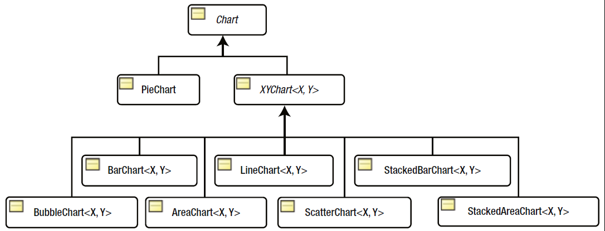
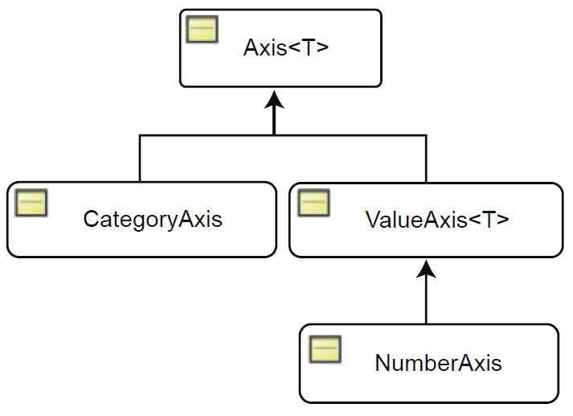

# 图表

- [图表](#图表)
  - [简介](#简介)
  - [CSS](#css)
    - [Legend](#legend)
  - [Pie Chart](#pie-chart)
  - [PieChart CSS](#piechart-css)
    - [颜色设置](#颜色设置)
    - [symbol](#symbol)
  - [事件处理](#事件处理)
  - [XYChart](#xychart)
    - [坐标轴表示](#坐标轴表示)
  - [LineChart](#linechart)

2022-04-24, 14:55
***

## 简介

JavaFX 支持如下的图表类型：



抽象类 `Chart` 继承 `Node`，是所有 chart 的基类。

可以将 Chart 添加到 scene graph 中，且能用 CSS 个性化。

JavaFX 将图表分为两类：

- 不包含坐标轴
- 包含 x-轴和 y-轴

`PieChart` 属于第一类。

每个 Chart 至少包含三部分：标题，legend，数据内容。

不同类型的图表定义数据方式不同，下面是所有 `Chart` 的共同属性。。

|属性|说明|
|---|---|
|title|标题|
|titleSide|标题位置，默认上方，可用值 Side enum: TOP, RIGHT, BOTTOM, LEFT|
|legend|图例|
|legendSide|指定 legend 位置|
|legendVisible|legend 可见性|
|animated|动画效果，default=True|

`legend` 属性是 `Node` 类型。

## CSS

使用 CSS 个性化，`Chart` 类 CSS 类名为 `chart`，定义所有 chart 的共有属性。 例：

```css
.chart {
    -fx-legend-side: top;
    -fx-legend-visible: true;
    -fx-title-side: bottom;
}
```

chart 有两个子类：chart-title, chart-content.

`chart-title` 为 `Label` 对象，`chart-content` 为 `Pane`.

例：设置所有 charts 的背景为 yellow, 标题字体为 Arial 16px bold

```css
.chart-content{
    -fx-background-color:  yellow;
}
.chart-title{
    -fx-font-family: "Arial";
    -fx-font-size: 16px;
    -fx-font-weight: bold;
}
```

### Legend

legend 的默认类名为 `chart-legend`。例：设置 legend 背景

```css
.chart-legend{
    -fx-background-color: lightgray;
}
```

每个 legend 有两个子结构：

- `chart-legend-item`, `Label` 类型，用于指定 legend 的文本；
- `chart-legend-item-symbol`, `Node` 类型，用于指定 legend 的图标，默认为圆。

例：设置 legend 的字体，并将图标设置为箭头

```css
.chart-legend-item{
    -fx-font-size: 16px;
}
.chart-legend-item-symbol{
    -fx-shape: "M0 -3.5 v7 l 4 -3.5z"
}
```

## Pie Chart

饼图通过 `PieChart` 类创建。创建过程很简单，为 PieChart 指定数据，然后添加到面板中即可。

|PieChart 属性|说明|
|---|---|
|data|ObservableList<PieChart.Data>|
|startAngle|第一个 pie slice 起始角度，默认 zero|
|clockwise|从 startAngle，顺时针或逆时针|
|labelsVisible|slice labels 是否可见，label 通过 PieChart.Data 指定|
|labelLineLength|label 和对应 slice 连线的长度，默认 20.0 px|

PieChart 默认包含标签和 legend。
`PieChart.Data` 包括数据名称和数值，其标签为数据名称。

首先，定义所需数据：
```java
import javafx.collections.FXCollections;
import javafx.collections.ObservableList;
import javafx.scene.chart.PieChart;
 
public class PieChartUtil {
 
	public static ObservableList<PieChart.Data> getChartData() {
		ObservableList<PieChart.Data> data = FXCollections.observableArrayList();
		data.add(new PieChart.Data("China", 1275));
		data.add(new PieChart.Data("India", 1017));
		data.add(new PieChart.Data("Brazil", 172));
		data.add(new PieChart.Data("UK", 59));
		data.add(new PieChart.Data("USA", 285));
		return data;
	}
}
```

绘制饼图：
```java
import javafx.application.Application;
import javafx.collections.ObservableList;
import javafx.geometry.Side;
import javafx.scene.Scene;
import javafx.scene.chart.PieChart;
import javafx.scene.layout.StackPane;
import javafx.stage.Stage;
 
public class PieChartEx3 extends Application {
 
	@Override
	public void start(Stage stage) {
		PieChart chart = new PieChart();
		chart.setTitle("Population in 2000");
 
		// Place the legend on the left side
		chart.setLegendSide(Side.LEFT);
		// set the data for the chart
		ObservableList<PieChart.Data> chartData = PieChartUtil.getChartData();
		chart.setData(chartData);
 
		StackPane root = new StackPane(chart);
		Scene scene = new Scene(root);
		stage.setScene(scene);
		stage.setTitle("A Pie Chart");
		stage.show();
	}
 
	public static void main(String[] args) {
		launch(args);
	}
}
```
效果：


每个 pie slice 数据由 `Node` 表示，通过 `PieChart.Data` 的 `getNode()` 获得其引用。不过该 Node 在对应的 slice添加到 pie chart 后才创建，所以提前调用返回 null。

例：为每个 slice 设置 tooltip
```java
import javafx.application.Application;
import javafx.collections.ObservableList;
import javafx.geometry.Side;
import javafx.scene.Node;
import javafx.scene.Scene;
import javafx.scene.chart.PieChart;
import javafx.scene.control.Tooltip;
import javafx.scene.layout.StackPane;
import javafx.stage.Stage;
 
public class PieChartEx4_slice extends Application {
 
	@Override
	public void start(Stage stage) {
		PieChart chart = new PieChart();
		chart.setTitle("Population in 2000");
 
		// Place the legend on the left side
		chart.setLegendSide(Side.LEFT);
		// Set the data for the chart
		ObservableList<PieChart.Data> chartData = PieChartUtil.getChartData();
		chart.setData(chartData);
		// Add a Tooltip to all pie slices
		this.addSliceTooltip(chart);
		StackPane root = new StackPane(chart);
		Scene scene = new Scene(root);
		stage.setScene(scene);
		stage.setTitle("Customizing Pie Slices");
		stage.show();
	}
 
	private void addSliceTooltip(PieChart chart) {
		// Compute the total pie value
		double totalPieValue = 0.0;
		for (PieChart.Data d : chart.getData()) {
			totalPieValue += d.getPieValue();
		}
		// Add a tooltip to all pie slices
		for (PieChart.Data d : chart.getData()) {
			Node sliceNode = d.getNode();
			double pieValue = d.getPieValue();
			double percentPieValue = (pieValue / totalPieValue) * 100;
			// Create and install a Tooltip for the slice
			String msg = d.getName() + "=" + pieValue + " (" + String.format("%.2f", percentPieValue) + "%)";
			Tooltip tt = new Tooltip(msg);
			tt.setStyle("-fx-background-color: yellow;" + "-fx-text-fill: black;");
			Tooltip.install(sliceNode, tt);
		}
	}
 
	public static void main(String[] args) {
		launch(args);
	}
}
```
效果：


## PieChart CSS
除了 `data` 属性，PieChart 的其他属性都由 CSS 定义。如：
```css
.chart{
	-fx.clockwise: false;
	-fx-pie-label-visible: true;
	-fx-label-line-length: 10;
	-fx-start-angle: 90;
}
```

pie slice 有 4 个样式类：
- `chart-pie`, 
- `data<i>`, 
- `default-color<j>`
- `negative`

`<i>` 为 slice index，如第一个 slice 对应 `data0`.

`<j>` 为 series index，在 pie chart，可以将每个 slice 看作一个 slice。

### 颜色设置
在CSS中自定义颜色：
```css
.chart-pie.default-color0 {-fx-pie-color: red;}
.chart-pie.default-color1 {-fx-pie-color: green;}
.chart-pie.default-color2 {-fx-pie-color: blue;}
.chart-pie.default-color3 {-fx-pie-color: yellow;}
.chart-pie.default-color4 {-fx-pie-color: tan;}
```

如果 pie chart 的 slice 超过 8 个，如果你不希望颜色重复，可以在 CSS 中定义余下的颜色，例如：
```css
/* additional_series_colors.css */
.chart-pie.default-color8 {
	-fx-pie-color: gold;
}
.chart-pie.default-color9 {
	-fx-pie-color: khaki;
}
```
该方法也可用于其它的图表类型。

### symbol
`pie-legend-symbol`

legend 里的每一项都有样式类 `pie-legend-symbol` 加上对应的`data`，例如 `pie-legend-symbol.data0.default-color1` 表示第一个数据的第二种颜色。

## 事件处理
虽然 pie chart slice 不是 Node 对象，但是每个 `PieChart.Data` 对象都有一个关联的 node ，可用于事件处理。

例，添加鼠标事件：

## XYChart

`XYChart<X.Y>` 类定义包含两个坐标轴的 chart。泛型参数 `X` 和 `Y` 分别定义 x-axis 和 y-axis 的数据类型。

### 坐标轴表示

`XYChart` 的轴又抽象类 `Axis<T>` 的具体子类定义。类图如下：



`Axis` 的 `label` 属性定义轴标签。

`ValueAxis` 的轴范围一般根据数据自定设置，可以使用 `autoRanging` 属性关闭该行为。


## LineChart

由 `javafx.scene.chart.LineChart` 类表示。
