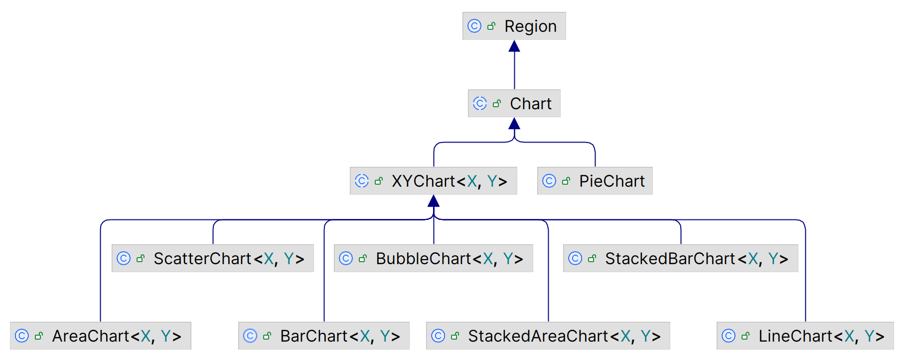
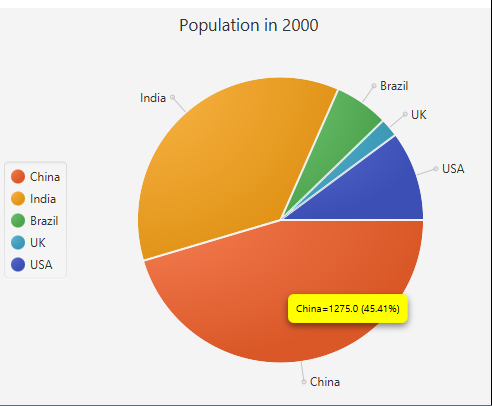
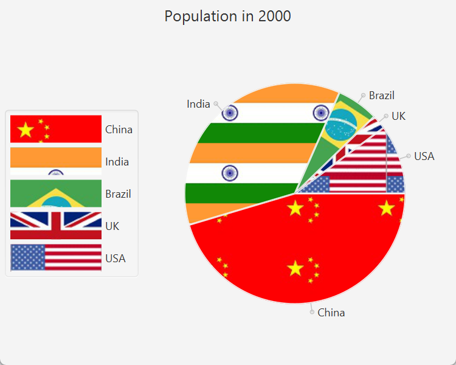
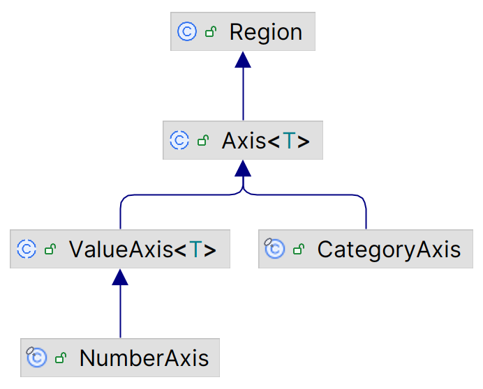

# JavaFX Chart 入门

2023-06-01
@author Jiawei Mao
***
## 概述

JavaFX Chart API 定义在 `javafx.scene.chart` 包中，JavaFX 支持的图表类型如下所示：



抽象类 `Chart` 是所有 chart 的基类。Chart 可以添加到 scene graph，且支持 CSS 个性化。`Chart` 包含所有图表共有的属性和方法。

JavaFX 将图表分为两类：

- 不包含坐标轴，如 `PieChart`
- 包含 x-轴和 y-轴，如 `XYChart`

每个 Chart 至少包含三部分：

- title
- legend
- content

不同类型的 chart 定义数据方式不同，下面是所有 `Chart` 的共同属性。。

|属性|说明|
|---|---|
|title|标题|
|titleSide|标题位置，默认上方，可用值 Side enum: TOP, RIGHT, BOTTOM, LEFT|
|legend|图例|
|legendSide|指定 legend 位置|
|legendVisible|legend 可见性|
|animated|动画效果，default=True|

chart 对不同类型的数据通常使用不同符号表示。legend 列出不同类型数据的符号和描述。`legend` 是 `Node` 类型，指定 chart 的图例，默认在 chart 下方。`legendSide` 属性指定 legend 位置。

`legendVisible` 属性指定 legend 是否可见，默认可见。

`animated` 属性指定 chart 内容变化是否以动画形式显示，默认 `true`。

## CSS

`Chart` 类定义所有 chart 的共有属性，其 CSS 类名为 `chart`。

例如，定义所有 chart 的 `legendSide`, `legendVisible` 和 `titleSide` 属性： 

```css
.chart {
    -fx-legend-side: top;
    -fx-legend-visible: true;
    -fx-title-side: bottom;
}
```

chart 有两个子类：

- chart-title
- chart-content

`chart-title` 为 `Label` 类型，`chart-content` 为 `Pane` 类型。

示例：设置所有 charts 的背景为 yellow, title 字体为 Arial 16px bold

```css
.chart-content{
    -fx-background-color:  yellow;
}
.chart-title{
    -fx-font-family: "Arial";
    -fx-font-size: 16px;
    -fx-font-weight: bold;
}
```


### Legend

legend 的默认类名为 `chart-legend`。

示例：设置 legend 背景为 light-gray

```css
.chart-legend{
    -fx-background-color: lightgray;
}
```

每个 legend 有两个子结构：

- `chart-legend-item`, `Label` 类型，指定 legend 文本
- `chart-legend-item-symbol`, `Node` 类型，指定 legend 的图标，默认为圆

示例：设置 legend 的字体，并将图标设置为箭头

```css
.chart-legend-item{
    -fx-font-size: 16px;
}
.chart-legend-item-symbol{
    -fx-shape: "M0 -3.5 v7 l 4 -3.5z"
}
```

## PieChart

饼图是一个分成不同扇区的圆，每个扇区的面积（或）代表数据量的大小。

通过 `PieChart` 类创建饼图。该类包含两个构造函数：

- `PieChart()`
- `PieChart(ObservableList<PieChart.Data> data)`

创建过程很简单，为 `PieChart` 指定数据，然后添加到面板中即可。

```java
PieChart()
PieChart(ObservableList<PieChart.Data> data)
```

两个构造函数，差别在于是否指定数据。

饼图的扇区用 `PieChart.Data` 类表示。每个扇区包含名字和数值，对应 `PieChart.Data` 的 `name` 和 `pieValue` 属性。例如，创建一个扇区，名称为 "China"，数值为 1275：

```java
PieChart.Data chinaSlice = new PieChart.Data("China", 1275);
```

饼图的数据类型为 `ObservableList<PieChart.Data>`。例如，创建包含三个数据的饼图：

```java
ObservableList<PieChart.Data> chartData = FXCollections.observableArrayList();

chartData.add(new PieChart.Data("China", 1275));
chartData.add(new PieChart.Data("India", 1017));
chartData.add(new PieChart.Data("Brazil", 172));
```

然后使用构造函数创建饼图：

```java
PieChart charts = new PieChart(chartData);
```

**示例**：使用饼图显示 2000 年五个国家的人口数

```java
import javafx.application.Application;
import javafx.collections.FXCollections;
import javafx.collections.ObservableList;
import javafx.geometry.Side;
import javafx.scene.Scene;
import javafx.scene.chart.PieChart;
import javafx.scene.layout.StackPane;
import javafx.stage.Stage;

public class PieChartTest extends Application {
    public static void main(String[] args) {
        Application.launch(args);
    }

    @Override
    public void start(Stage stage) {
        PieChart chart = new PieChart();
        chart.setTitle("Population in 2000");

        // legend 放左侧
        chart.setLegendSide(Side.LEFT);

        // Set the data for the chart
        ObservableList<PieChart.Data> chartData = FXCollections.observableArrayList();
        chartData.add(new PieChart.Data("China", 1275));
        chartData.add(new PieChart.Data("India", 1017));
        chartData.add(new PieChart.Data("Brazil", 172));
        chartData.add(new PieChart.Data("UK", 59));
        chartData.add(new PieChart.Data("USA", 285));

        chart.setData(chartData);

        StackPane root = new StackPane(chart);
        Scene scene = new Scene(root);

        stage.setScene(scene);
        stage.setTitle("A Pie Chart");
        stage.show();
    }
}
```


### PieChart 属性

|PieChart 属性|说明|
|---|---|
|data|指定数据，类型为 `ObservableList<PieChart.Data>`|
|startAngle|第一个 pie slice 起始角度，默认 0，对应三点钟方向；`startAngle` 为正数表示逆时针方向计算，例如 90° 表示从 12 点钟位置开始|
|clockwise|从 startAngle，顺时针或逆时针排列 slices，true 表示顺时针，默认为 true|
|labelsVisible|slice labels 是否可见，label 在 slice 附近显示，通过 `PieChart.Data` 指定|
|labelLineLength|label 和对应 slice 连线的长度，默认 20.0 px|

PieChart 默认包含标签和 legend。
`PieChart.Data` 包括数据名称和数值，其标签为数据名称。


### 自定义 Slice

每个 pie-slice 由 `Node` 表示，通过 `PieChart.Data` 的 `getNode()` 获得其引用。不过该 `Node` 在对应的 slice 添加到 pie chart 后才创建，所以提前调用返回 null。

示例：为每个 slice 设置 tooltip，tool-tip 显示鼠标下数据的信息：

- slice name
- pie value
- percent pie value

`addSliceTooltip()` 方法中包含访问 slice-nodes 以及添加 tool-tips 的逻辑。

```java
import javafx.application.Application;
import javafx.collections.FXCollections;
import javafx.collections.ObservableList;
import javafx.geometry.Side;
import javafx.scene.Node;
import javafx.scene.Scene;
import javafx.scene.chart.PieChart;
import javafx.scene.control.Tooltip;
import javafx.scene.layout.StackPane;
import javafx.stage.Stage;

public class PieChartEx4_slice extends Application {

    @Override
    public void start(Stage stage) {
        PieChart chart = new PieChart();
        chart.setTitle("Population in 2000");

        chart.setLegendSide(Side.LEFT);

        ObservableList<PieChart.Data> data = FXCollections.observableArrayList();
        data.add(new PieChart.Data("China", 1275));
        data.add(new PieChart.Data("India", 1017));
        data.add(new PieChart.Data("Brazil", 172));
        data.add(new PieChart.Data("UK", 59));
        data.add(new PieChart.Data("USA", 285));
        chart.setData(data);

        // Add a Tooltip to all pie slices
        this.addSliceTooltip(chart);
        StackPane root = new StackPane(chart);
        Scene scene = new Scene(root);
        stage.setScene(scene);
        stage.setTitle("Customizing Pie Slices");
        stage.show();
    }

    private void addSliceTooltip(PieChart chart) {
        double totalPieValue = 0.0;
        for (PieChart.Data d : chart.getData()) {
            totalPieValue += d.getPieValue();
        }
        // Add a tooltip to all pie slices
        for (PieChart.Data d : chart.getData()) {
            Node sliceNode = d.getNode();
            double pieValue = d.getPieValue();
            double percentPieValue = (pieValue / totalPieValue) * 100;
            // Create and install a Tooltip for the slice
            String msg = d.getName() + "=" + pieValue + " (" + String.format("%.2f", percentPieValue) + "%)";
            Tooltip tt = new Tooltip(msg);
            tt.setStyle("-fx-background-color: yellow;" + "-fx-text-fill: black;");
            Tooltip.install(sliceNode, tt);
        }
    }

    public static void main(String[] args) {
        launch(args);
    }
}
```


### PieChart CSS

除了 `data` 属性，`PieChart` 的其它属性都可以由 CSS 定义。如：

```css
.chart{
	-fx.clockwise: false;
	-fx-pie-label-visible: true;
	-fx-label-line-length: 10;
	-fx-start-angle: 90;
}
```

pie-slice 有 4 个样式类：

- `chart-pie`, 
- `data<i>`, 
- `default-color<j>`
- `negative`

`<i>` 为 slice-index，如第一个 slice 对应 `data0`，第二个为 `date1`，依此类推。

`<j>` 为 series-index，在 pie chart，可以将每个 slice 看作一个 series。默认 CSS （Modena.css）定义了 8 种颜色，如果 pie slice 超过 8 个，则循环使用颜色。

当某个 slice 的数据为负数，则具有 `negative` 样式类。

需要应用于所有 pie slices 的样式，在 `chart-pie` 中定义。例如，下面将所有 pie slices 的边框设为白色，添加 2px 的背景内边距（inset）。这样两个 slice 之间的距离更宽：

```css
.chart-pie {
	-fx-border-color: white;
	-fx-background-insets: 2;
}
```

可以使用如下方式为每个 pie-slices 设置颜色：

```css
.chart-pie.default-color0 {-fx-pie-color: red;}
.chart-pie.default-color1 {-fx-pie-color: green;}
.chart-pie.default-color2 {-fx-pie-color: blue;}
.chart-pie.default-color3 {-fx-pie-color: yellow;}
.chart-pie.default-color4 {-fx-pie-color: tan;}
```

这里只定义了 5 个，后面的采用默认颜色。

#### 更多颜色

如果 pie-chart 的 slice 超过 8 个，且不希望颜色重复，可以在 CSS 中定义余下的颜色，例如：

```css
/* additional_series_colors.css */
.chart-pie.default-color8 {
	-fx-pie-color: gold;
}
.chart-pie.default-color9 {
	-fx-pie-color: khaki;
}
```

**该方法也可用于其它的图表类型**。

pie-slices 和 legend-symbols 被分配的类名样式为 default-color0, default-color1, ... default-color7。

下面演示如何设置颜色：

```java
import javafx.application.Application;
import javafx.collections.FXCollections;
import javafx.collections.ObservableList;
import javafx.geometry.Side;
import javafx.scene.Node;
import javafx.scene.Scene;
import javafx.scene.chart.PieChart;
import javafx.scene.layout.StackPane;
import javafx.stage.Stage;

public class PieChartExtraColor extends Application {
    public static void main(String[] args) {
        Application.launch(args);
    }

    @Override
    public void start(Stage stage) {
        PieChart chart = new PieChart();
        chart.setTitle("Population in 2000");

        chart.setLegendSide(Side.LEFT);

        ObservableList<PieChart.Data> data = FXCollections.observableArrayList();
        data.add(new PieChart.Data("China", 1275));
        data.add(new PieChart.Data("India", 1017));
        data.add(new PieChart.Data("Brazil", 172));
        data.add(new PieChart.Data("UK", 59));
        data.add(new PieChart.Data("USA", 285));
        data.add(new PieChart.Data("Bangladesh", 138));
        data.add(new PieChart.Data("Egypt", 68));
        data.add(new PieChart.Data("France", 59));
        data.add(new PieChart.Data("Germany", 82));
        data.add(new PieChart.Data("Indonesia", 212));

        chart.setData(data);

        StackPane root = new StackPane(chart);
        Scene scene = new Scene(root);

        scene.getStylesheets().add(PieChartExtraColor.class.getResource("additional_series_colors.css").toExternalForm());
        stage.setScene(scene);
        stage.setTitle("A Pie Chart with over 8 Slices");
        stage.show();

        // Override the default series color style class-name for slices over 8.
        // Works only when you set it after the scene is visible
        this.setSeriesColorStyles(chart);
    }

    // 以下是关键内容
    private void setSeriesColorStyles(PieChart chart) {
        ObservableList<PieChart.Data> chartData = chart.getData();
        int size = chartData.size();
        for (int i = 8; i < size; i++) {
            String removedStyle = "default-color" + (i % 8);
            String addedStyle = "default-color" + (i % size);

            // Reset the pie slice colors
            Node node = chartData.get(i).getNode();
            node.getStyleClass().remove(removedStyle);
            node.getStyleClass().add(addedStyle);

            // Reset the legend colors
            String styleClass = ".pie-legend-symbol.data" + i +
                    ".default-color" + (i % 8);
            Node legendNode = chart.lookup(styleClass);
            if (legendNode != null) {
                legendNode.getStyleClass().remove(removedStyle);
                legendNode.getStyleClass().add(addedStyle);
            }
        }
    }
}
```


#### pie-slice 背景图片

可以使用 CSS 设置 pie-slice 的背景图片：

```css
.chart-pie.data0 {
	-fx-background-image: url("china_flag.jpg");
}
```

下面的pie_slice.css 文件定义了一些 pie-slice 的 background-image，legend-symbol-size 以及连接 pie-slice 和 label 的线段的长度。

```css
// pie_slice.css
/* Set a background image for pie slices */
.chart-pie.data0 {-fx-background-image: url("china_flag.jpg");}
.chart-pie.data1 {-fx-background-image: url("india_flag.jpg");}
.chart-pie.data2 {-fx-background-image: url("brazil_flag.jpg");}
.chart-pie.data3 {-fx-background-image: url("uk_flag.jpg");}
.chart-pie.data4 {-fx-background-image: url("usa_flag.jpg");}

/* Set the preferred size for legend symbols */
.chart-legend-item-symbol {
    -fx-pref-width: 100;
    -fx-pref-height: 30;
}
.chart {
	-fx-label-line-length: 10;
}
```

**示例**：使用 pie_slice.css 个性化 PieChart

```java
import javafx.application.Application;
import javafx.collections.FXCollections;
import javafx.collections.ObservableList;
import javafx.geometry.Side;
import javafx.scene.Scene;
import javafx.scene.chart.PieChart;
import javafx.scene.layout.StackPane;
import javafx.stage.Stage;

public class PieChartCustomSlice extends Application {
    public static void main(String[] args) {
        Application.launch(args);
    }

    @Override
    public void start(Stage stage) {
        PieChart chart = new PieChart();
        chart.setTitle("Population in 2000");

        chart.setLegendSide(Side.LEFT);

        ObservableList<PieChart.Data> data = FXCollections.observableArrayList();
        data.add(new PieChart.Data("China", 1275));
        data.add(new PieChart.Data("India", 1017));
        data.add(new PieChart.Data("Brazil", 172));
        data.add(new PieChart.Data("UK", 59));
        data.add(new PieChart.Data("USA", 285));
        chart.setData(data);

        StackPane root = new StackPane(chart);
        Scene scene = new Scene(root);

        scene.getStylesheets().addAll(PieChartCustomSlice.class
                .getResource("pie_slice.css").toExternalForm());

        stage.setScene(scene);
        stage.setTitle("Custom Pie Slices");
        stage.show();
    }
}
```



#### symbol

`pie-legend-symbol`

legend 里的每一项都有样式类 `pie-legend-symbol` 加上对应的`data`，例如 `pie-legend-symbol.data0.default-color1` 表示第一个数据的第二种颜色。

### 事件处理
虽然 pie chart slice 不是 Node 对象，但是每个 `PieChart.Data` 对象都有一个关联的 node ，可用于事件处理。


## XYChart

`XYChart<X.Y>` 定义包含两个坐标轴的 chart。泛型参数 `X` 和 `Y` 分别定义 x-axis 和 y-axis 的数据类型。

### 坐标轴表示

`XYChart` 的坐标轴由抽象类 `Axis<T>` 定义。类图如下：



泛型参数 `T` 表示数据类型，如 `String`, `Number` 等。

axis 显示 tick 和 tick-labels，`Axis` 包含相关设置方法。

`Axis` 的 `label` 属性定义轴标签。

`CategoryAxis` 和 `NumberAxis` 分别用于绘制 `String` 和 `Number`。它们包含特定于数值的属性，例如，`NumberAxis` 继承 `ValueAxis<T>` 的 `lowerBound` 和 `upperBound` 属性，用于指定数据的最小值和最大值。默认情况下，`ValueAxis` 范围一般根据数据自动确定，可以将 `Axis<T>` 的 `autoRanging` 属性设置为 false 来关闭该行为。

示例：分别创建 `CategoryAxis` 和 `NumberAixs`，并设置标签

```java
CategoryAxis xAxis = new CategoryAxis();
xAxis.setLabel("Country");

NumberAxis yAxis = new NumberAxis();
yAxis.setLabel("Population (in millions)");
```

### 添加数据

`XYChart` 中的数据由 x 轴和 y 轴定义二维坐标确定。`XYChart` 的数据保存在 `ObservableList` 类型的命名 series 中，每个 series 包含多个数据。如何渲染数据点取决于图表类型。例如，散点图将数据点渲染为 symbol，而条形图将其渲染为一个 bar。

`XYChart.Data<X,Y>` 定义一个数据点，包含如下属性：

- XValue, x 轴坐标
- YValue, y 轴坐标
- extraValue, `Object` 类型，用于存储数据的额外信息，其用途取决于 chart-type，如果 chart 不使用，则可以将其用于其它目的，例如存储数据的 tool-tip 值
- node，数据呈现方式

假设 X 和 Y 都是数字类型，创建数据：

```java
XYChart.Data<Number, Number> data1 = new XYChart.Data<>(1950, 555);
XYChart.Data<Number, Number> data2 = new XYChart.Data<>(2000, 1275);
XYChart.Data<Number, Number> data3 = new XYChart.Data<>(2050, 1395);
```

`XYChart.Series<X,Y>` 表示一个 series。该类具体如下属性：

- name, series 名称
- data, `ObservableList of XYChart.Data<X,Y>` 实例，包含数据
- chart, 所属 chart 的引用
- node, 用于显示该 series 的 `Node`，根据 chart 类型会自动创建一个默认 node

下面创建一个 series，设置 name 并添加数据：

```java
XYChart.Series<Number, Number> seriesChina = new XYChart.Series<>();
seriesChina.setName("China");
seriesChina.getData().addAll(data1, data2, data3);
```

`XYChart.data` 属性为表示 chart 的数据，其类型为包含 `XYChart.Series` 的 `ObservableList`。

**示例**：创建 `XYChart`并添加数据

```java
XYChart<Number, Number> chart = ...
chart.getData().addAll(seriesChina, seriesIndia, seriesUSA);
```

如何显示数据取决于 chart-type。

示例数据：

- `getCountrySeries()`，x 轴为 year，y 轴为人口数量
-  `getYearSeries()`，x 轴为 country，y 轴为人口数量

```java
import javafx.collections.FXCollections;
import javafx.collections.ObservableList;
import javafx.scene.chart.XYChart;

@SuppressWarnings("unchecked")
public class XYChartDataUtil {

    public static ObservableList<XYChart.Series<Number, Number>> getCountrySeries() {
        XYChart.Series<Number, Number> seriesChina = new XYChart.Series<>();
        seriesChina.setName("China");
        seriesChina.getData().addAll(
                new XYChart.Data<>(1950, 555),
                new XYChart.Data<>(2000, 1275),
                new XYChart.Data<>(2050, 1395),
                new XYChart.Data<>(2100, 1182),
                new XYChart.Data<>(2150, 1149));

        XYChart.Series<Number, Number> seriesIndia = new XYChart.Series<>();
        seriesIndia.setName("India");
        seriesIndia.getData().addAll(
                new XYChart.Data<>(1950, 358),
                new XYChart.Data<>(2000, 1017),
                new XYChart.Data<>(2050, 1531),
                new XYChart.Data<>(2100, 1458),
                new XYChart.Data<>(2150, 1308));

        XYChart.Series<Number, Number> seriesUSA = new XYChart.Series<>();
        seriesUSA.setName("USA");
        seriesUSA.getData().addAll(
                new XYChart.Data<>(1950, 158),
                new XYChart.Data<>(2000, 285),
                new XYChart.Data<>(2050, 409),
                new XYChart.Data<>(2100, 437),
                new XYChart.Data<>(2150, 453));

        ObservableList<XYChart.Series<Number, Number>> data = FXCollections.observableArrayList();
        data.addAll(seriesChina, seriesIndia, seriesUSA);
        return data;
    }

    public static ObservableList<XYChart.Series<String, Number>> getYearSeries() {
        XYChart.Series<String, Number> series1950 = new XYChart.Series<>();
        series1950.setName("1950");
        series1950.getData().addAll(
                new XYChart.Data<>("China", 555),
                new XYChart.Data<>("India", 358),
                new XYChart.Data<>("Brazil", 54),
                new XYChart.Data<>("UK", 50),
                new XYChart.Data<>("USA", 158));

        XYChart.Series<String, Number> series2000 = new XYChart.Series<>();
        series2000.setName("2000");
        series2000.getData().addAll(
                new XYChart.Data<>("China", 1275),
                new XYChart.Data<>("India", 1017),
                new XYChart.Data<>("Brazil", 172),
                new XYChart.Data<>("UK", 59),
                new XYChart.Data<>("USA", 285));

        XYChart.Series<String, Number> series2050 = new XYChart.Series<>();
        series2050.setName("2050");
        series2050.getData().addAll(
                new XYChart.Data<>("China", 1395),
                new XYChart.Data<>("India", 1531),
                new XYChart.Data<>("Brazil", 233),
                new XYChart.Data<>("UK", 66),
                new XYChart.Data<>("USA", 409));

        ObservableList<XYChart.Series<String, Number>> data = FXCollections.observableArrayList();
        data.addAll(series1950, series2000, series2050);
        return data;
    }
}
```

## BarChart

条形图（BarChart）将数据呈现为水平或垂直的矩形条，矩形的长度与数据大小成正比。

`BarChart` 类表示条形图。在条形图中，其中一个轴必须是 `CategoryAxis`，另一个为 `ValueAxis` 或 `NumberAxis`。

## LineChart

由 `javafx.scene.chart.LineChart` 类表示。
