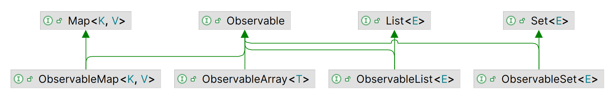

# Observable 集合

2023-08-15, 09:36
modify: 样式
2023-07-04, 15:22
@author Jiawei Mao
****
## 1. 简介

JavaFX `Observable` 集合对 Java 集合进行扩展，支持 4 种可观察内容变化的集合，类图如下：



`ObservableMap`, `ObservableSet` 和 `ObservableList` 都是泛型实现，`ObservableArray` 主要用于 JavaFX 3D API，提供 float 和 int 两种类型实现。

JavaFX `Observable` 集合具有两个额外功能：

- 支持 Invalidation 通知
- 支持 Change 通知

`javafx.collections.FXCollections` 是 JavaFX 集合工具类，包含许多 `static` 方法，用于创建这些集合类。

## 2. 集合类型

### ObservableList

`ObservableList` 接口的类图如下：


添加 `ListChangeListener` 监听 `ObservableList` 的变化，当 `ObservableList` 发生变化，会自动调用 `ListChangeListener` 的 `onChanged()` 方法。

`Change` 是 `ListChangeListener` 的内部类，用来表示 `ObservableList` 发生的变化。

`javafx.collections.transformation` 中包含 `FilteredList` 和 `SortedList` 类：

   - `FilteredList` 也是 `ObservableList`，根据指定 `Predicate` 过滤内容
   - `SortedList` 对内容进行排序

#### 创建 ObservableList

使用 `FXCollections` 的工厂方法创建  `ObservableList`：

```java
<E> ObservableList<E> emptyObservableList()
<E> ObservableList<E> observableArrayList()
<E> ObservableList<E> observableArrayList(Collection<? extends E> col)
<E> ObservableList<E> observableArrayList(E... items)
<E> ObservableList<E> observableList(List<E> list)
<E> ObservableList<E> observableArrayList(Callback<E, Observable[]> extractor)
<E> ObservableList<E> observableList(List<E> list, Callback<E, Observable[]> extractor)
```

- `emptyObservableList()` 创建一个空的 unmodifiable `ObservableList`。该方法一般用来提供空 list 参数

**示例：** 创建空 `String` 类型 `ObservableList`

```java
ObservableList<String> emptyList = FXCollections.emptyObservableList();
```

- `observableArrayList()` 创建一个由 `ArrayList` 支持的 `ObservableList`。其它变体指定初始元素

最后两个方法可以监听元素的更新。

**示例：** 创建 `ObservableList`

```java
import javafx.collections.FXCollections;
import javafx.collections.ObservableList;

public class ObservableListTest {

    @SuppressWarnings("unchecked")
    public static void main(String[] args) {
        // 创建 ObservableList：指定初始值
        ObservableList<String> list = FXCollections.observableArrayList("one", "two");
        System.out.println("After creating list: " + list);

        // 添加元素
        list.addAll("three", "four");
        System.out.println("After adding elements: " + list);

        // 此时有 4 个元素，删除中间两个
        list.remove(1, 3);
        System.out.println("After removing elements: " + list);

        // 只保留 "one"
        list.retainAll("one");
        System.out.println("After retaining \"one\": " + list);

        // 再创建一个 ObservableList
        ObservableList<String> list2 =
                FXCollections.<String>observableArrayList("1", "2", "3");

        // 设置 list 的值为 list2
        list.setAll(list2);
        System.out.println("After setting list2 to list: " + list);

        // 创建另一个 list
        ObservableList<String> list3 =
                FXCollections.<String>observableArrayList("ten", "twenty", "thirty");

        // 将 list2 和 list3 串起来
        ObservableList<String> list4 = FXCollections.concat(list2, list3);
        System.out.println("list2 is " + list2);
        System.out.println("list3 is " + list3);
        System.out.println("After concatenating list2 and list3:" + list4);
    }
}
```

```
After creating list: [one, two]
After adding elements: [one, two, three, four]
After removing elements: [one, four]
After retaining "one": [one]
After setting list2 to list: [1, 2, 3]
list2 is [1, 2, 3]
list3 is [ten, twenty, thirty]
After concatenating list2 and list3:[1, 2, 3, ten, twenty, thirty]
```

#### 监听 ObservableList 的 Invalidation

`ObservableList` 支持 `InvalidationListener`。

```java
import javafx.beans.Observable;
import javafx.collections.FXCollections;
import javafx.collections.ObservableList;

public class ListInvalidationTest {

    public static void main(String[] args) {
        // 创建 list
        ObservableList<String> list =
                FXCollections.observableArrayList("one", "two");
        
        // 添加 InvalidationListener
        list.addListener(ListInvalidationTest::invalidated);

        System.out.println("Before adding three.");
        list.add("three"); // 触发一次 invalid
        System.out.println("After adding three.");

        System.out.println("Before adding four and five.");
        list.addAll("four", "five"); // 触发一次 invalid
        System.out.println("After adding four and five.");

        System.out.println("Before replacing one with one.");
        list.set(0, "one"); // 触发一次 invalid
        System.out.println("After replacing one with one.");
    }

    public static void invalidated(Observable list) {
        System.out.println("List is invalid.");
    }
}
```

```
Before adding three.
List is invalid.
After adding three.
Before adding four and five.
List is invalid.
After adding four and five.
Before replacing one with one.
List is invalid.
After replacing one with one.
```

> [!TIP]
>
>  `InvalidationListener` 对所有改变 `ObservableList` 的操作，都触发一次 Invalid 事件。       


#### 监听 ObservableList 的 Change 事件

列表的元素可以重排、更新、替换、添加和删除，这些都属于 Change 事件。使用 `ObservableList.addListener()` 添加 `ListChangeListener` 来监听这些事件。例如：

```java
ObservableList<String> list = FXCollections.observableArrayList();

list.addListener(new ListChangeListener<String>() {
    @Override
    public void onChanged(ListChangeListener.Change<? extends String> change) {
        System.out.println("List has changed.");
    }
});
```

**示例：** 演示 `ListChangeListener`，添加 listener 后，操作 list 4 次，listener 每次都收到通知。

```java
public class SimpleListChangeTest {

    public static void main(String[] args) {
        // 创建 ObservableList
        ObservableList<String> list = FXCollections.observableArrayList();

        // 添加 ListChangeListener
        list.addListener(SimpleListChangeTest::onChanged);

        // 下面 4 次操作，触发 4 次事件
        list.add("one");
        list.add("two");
        FXCollections.sort(list);
        list.clear();
    }
    
    public static void onChanged(ListChangeListener.Change<? extends String> change) {
        System.out.println("List has changed");
    }
}
```

```
List has changed
List has changed
List has changed
List has changed
```

##### ListChangeListener.Change 类

传递给 `onChanged()` 的 `ListChangeListener.Change` 类包含对 list 所作修改的详细信息。下表是 `ListChangeListener.Change` 类的相关方法：

| 方法                               | 说明                                    |
| ---------------------------------- | --------------------------------------- |
| `ObservableList<E> getList()`      | 返回生成事件的 list                     |
| `boolean next()`                   | Cursor movement                         |
| `void reset()`                     | Cursor movement                         |
| `boolean wasAdded()`               | 修改：添加元素                          |
| `boolean wasRemoved()`             | 修改：删除元素                          |
| `boolean wasReplaced()`            | 修改：替换元素                          |
| `boolean wasPermutated()`          | 修改：重新排序                          |
| `boolean wasUpdated()`             | 修改：更新                              |
| `int getFrom()`                    | 起始索引（inclusive）                   |
| `int getTo()`                      | 结束索引（exclusive）                   |
| `int getAddedSize()`               | 添加元素的个数                          |
| `List<E> getAddedSubList()`        | 添加元素的 sublist                      |
| `List<E> getRemoved()`             | 包含被删除或替换的元素的 immutable list |
| `int getRemovedSize()`             | 返回元素的个数                          |
| `int getPermutation(int oldIndex)` | 重排后元素新的索引                      |

`getList()` 返回更改前的 list。`ListChangeListener.Change` 可能包含多个部分的更改。例如：

```java
ObservableList<String> list = FXCollections.observableArrayList();

// 假设这里添加 listener

list.addAll("one", "two", "three");
list.removeAll("one", "three");
```

在该代码中，`ListChangeListener` 将收到两次通知：一次因为调用 `addAll()`，一次因为调用 `removeAll()`。调用 `removeAll()` 删除第 1,3 两个元素，因此 `Change` 包含这两次删除的信息：

- 第一次删除 "one"，索引为 0，**删除后** list 只包含 2 个元素
- 第二次删除 "three"，索引为 1

`Change` 包含一个 cursor，指向特定修改，便于查看修改项，`next()` 和 `reset()` 用于移动 cursor。调用 `onChanged()` 时，cursor 指向第一个更改前面（即 `cursor=-1`），调用 `next()` 移动到下一个修改项。当 cursor 移动到有效修改项，`next()` 返回 `true`，否则返回 `false`。

`reset()` 重置 cursor 为 -1。`next() `一般在 while 循环中使用，例如：

```java
ObservableList<String> list = FXCollections.observableArrayList();
...
// 添加 ListChangeListener
list.addListener(new ListChangeListener<String>() {
    @Override
    public void onChanged(ListChangeListener.Change<? extends String> change) {
        while(change.next()) {
            // 处理当前 change
        }
    }
});
```

**替换操作**可以看作删除元素后，在原位置再插入一个元素，所以如果 `wasReplaced()` 返回 `true`，`wasRemoved()` 和 `wasAdded()` 也返回 `true`。

`wasPermutated()` 表示是否发生重排操作（没有删除、添加或更新）。

`wasUpdated()` 表示 list 的元素是否更新。

> [!NOTE]
>
> add, remove, replace, permutate, update 这五种修改事件，permutate 和 update 具有排他性，余下三种可能同时发生。

可以在 `onChanged() `方法中添加如下代码处理所有类型的 change 事件：

```java
public void onChanged(ListChangeListener.Change change) {
    while (change.next()) {
        if (change.wasPermutated()) {
            // Handle permutations
        } else if (change.wasUpdated()) {
            // Handle updates
        } else if (change.wasReplaced()) {
            // Handle replacements
        } else {
            if (change.wasRemoved()) {
                // Handle removals
            }
            else if (change.wasAdded()) {
                // Handle additions
            }
        }
    }
}
```

`getFrom()` (inclusive) 和 `getTo()` (exclusive) 返回受影响范围的索引：

- `wasPermutated()` 为 `true` 时，返回重排元素的范围
- `wasUpdated()` 为 `true` 时，返回更新元素的索引范围
- `wasAdded()` 为 `true` 时，返回添加元素的索引范围
- `wasRemoved()` 为 `true` 且 `wasAdded()` 为 false 时，getFrom() 和 getTo() 的值相同，为删除元素的索引

`getAddedSize()` 返回添加的元素个数。

`getAddedSubList()` 返回包含添加的元素的 list。

`getRemovedSize()` 返回删除的元素个数。

`getRemoved()` 返回包含删除或替换的元素的 immutable-list。

`getPermutation(int oldIndex)` 返回重排后元素的新索引。例如，如果元素从 index 2 移动到 5，那么 `getPermutation(2)`  返回 5.

##### Update 事件处理

`FXCollections` 有如下两个创建 `ObservableList` 的工厂方法：

```java
<E> ObservableList<E> observableArrayList(Callback<E, Observable[]> extractor)
<E> ObservableList<E> observableList(List<E> list, Callback<E, Observable[]> extractor)
```

如果要监听 update 事件，需要使用以上两个方法创建 `ObservableList`。`javafx.util` 包中的 `Callback<P,R>` 接口定义如下：

```java
public interface Callback<P,R> {
    R call(P param)
}
```

参数 `Callback<E, Observable[]> extractor`，参数 `E` 是 list 的元素类型，第二个为 `Observable` 数组。

- 从 `ObservableList` 添加或删除元素，不管是否使用 extractor 都会触发事件。
- 但是，如果 `ObservableList` 中的元素是 `Observable` 属性、或者是对 `Observable` 属性的引用，那么只有在构造 `ObservableList` 时指定 extractor，`extractor` 从 list 元素提取 `Observable` 属性数组，才能在这些元素发生变化时触发事件。
- 例如，list 元素类型为 `Shape`，`extractor` 提取其 `fill` 属性并监听。

**示例**：演示 extractor 功能

```java
import javafx.beans.Observable;
import javafx.beans.property.IntegerProperty;
import javafx.beans.property.SimpleIntegerProperty;
import javafx.collections.FXCollections;
import javafx.collections.ListChangeListener;
import javafx.collections.ListChangeListener.Change;
import javafx.collections.ObservableList;

public class ListExtractorDemo {

    public static void main(String[] args) {
        ObservableList<IntegerProperty> listWithoutExtractor =
                FXCollections.observableArrayList();

        ObservableList<IntegerProperty> listWithExtractor =
                FXCollections.observableArrayList(p -> new Observable[]{p});

        listWithoutExtractor.addListener(createListener("listWithoutExtractor"));
        listWithExtractor.addListener(createListener("listWithExtractor"));

        IntegerProperty p1 = new SimpleIntegerProperty(1);
        IntegerProperty p2 = new SimpleIntegerProperty(2);

        // add 或 remove 元素，两个 list 都触发 change 事件
        listWithoutExtractor.addAll(p1, p2);
        listWithExtractor.addAll(p1, p2);

        // 此时只有配备 extractor 的 list 才能触发 update 事件
        p2.set(3);
    }

    private static ListChangeListener<IntegerProperty> createListener(String listId) {
        return (Change<? extends IntegerProperty> c) -> {
            while (c.next()) {
                if (c.wasAdded()) {
                    System.out.println(listId + " added: " + c.getAddedSubList());
                }
                if (c.wasRemoved()) {
                    System.out.println(listId + " removed: " + c.getRemoved());
                }
                if (c.wasUpdated()) {
                    System.out.println(listId + " updated");
                }
            }
        };
    }
}
```

```
listWithoutExtractor added: [IntegerProperty [value: 1], IntegerProperty [value: 2]]
listWithExtractor added: [IntegerProperty [value: 1], IntegerProperty [value: 2]]
listWithExtractor updated
```

##### 完整示例

```java
import javafx.beans.property.SimpleStringProperty;
import javafx.beans.property.StringProperty;

public class Person implements Comparable<Person> {

    private StringProperty firstName = new SimpleStringProperty();
    private StringProperty lastName = new SimpleStringProperty();

    public Person() {
        this.setFirstName("Unknown");
        this.setLastName("Unknown");
    }

    public Person(String firstName, String lastName) {
        this.setFirstName(firstName);
        this.setLastName(lastName);
    }

    public final String getFirstName() {
        return firstName.get();
    }

    public final void setFirstName(String newFirstName) {
        firstName.set(newFirstName);
    }

    public StringProperty firstNameProperty() {
        return firstName;
    }

    public final String getLastName() {
        return lastName.get();
    }

    public final void setLastName(String newLastName) {
        lastName.set(newLastName);
    }

    public StringProperty lastNameProperty() {
        return lastName;
    }

    @Override
    public int compareTo(Person p) {
        // Assume that the first and last names are always not null
        int diff = this.getFirstName().compareTo(p.getFirstName());
        if (diff == 0) {
            diff = this.getLastName().compareTo(p.getLastName());
        }

        return diff;
    }

    @Override
    public String toString() {
        return getFirstName() + " " + getLastName();
    }
}
```

```java
import javafx.collections.ListChangeListener;
import java.util.List;

public class PersonListChangeListener implements ListChangeListener<Person> {

    @Override
    public void onChanged(ListChangeListener.Change<? extends Person> change) {
        while (change.next()) {
            if (change.wasPermutated()) {
                handlePermutated(change);
            } else if (change.wasUpdated()) {
                handleUpdated(change);
            } else if (change.wasReplaced()) { 
                // replace 同时触发 add 和 remove，所以应先处理该事件
                handleReplaced(change);
            } else {
                if (change.wasRemoved()) {
                    handleRemoved(change);
                } else if (change.wasAdded()) {
                    handleAdded(change);
                }
            }
        }
    }

    public void handlePermutated(ListChangeListener.Change<? extends Person> change) {
        System.out.println("Change Type: Permutated");
        System.out.println("Permutated Range: " + getRangeText(change));
        int start = change.getFrom();
        int end = change.getTo();
        for (int oldIndex = start; oldIndex < end; oldIndex++) {
            int newIndex = change.getPermutation(oldIndex);
            System.out.println("index[" + oldIndex + "] moved to " +
                    "index[" + newIndex + "]");
        }
    }

    public void handleUpdated(ListChangeListener.Change<? extends Person> change) {
        System.out.println("Change Type: Updated");
        System.out.println("Updated Range : " + getRangeText(change));
        System.out.println("Updated elements are: " +
                change.getList().subList(change.getFrom(), change.getTo()));
    }

    public void handleReplaced(ListChangeListener.Change<? extends Person> change) {
        System.out.println("Change Type: Replaced");

        // A "replace" is the same as a “remove” followed with an "add"
        handleRemoved(change);
        handleAdded(change);
    }

    public void handleRemoved(ListChangeListener.Change<? extends Person> change) {
        System.out.println("Change Type: Removed");

        int removedSize = change.getRemovedSize();
        List<? extends Person> subList = change.getRemoved();

        System.out.println("Removed Size: " + removedSize);
        System.out.println("Removed Range: " + getRangeText(change));
        System.out.println("Removed List: " + subList);
    }

    public void handleAdded(ListChangeListener.Change<? extends Person> change) {
        System.out.println("Change Type: Added");

        int addedSize = change.getAddedSize();
        List<? extends Person> subList = change.getAddedSubList();

        System.out.println("Added Size: " + addedSize);
        System.out.println("Added Range: " + getRangeText(change));
        System.out.println("Added List: " + subList);
    }

    public String getRangeText(ListChangeListener.Change<? extends Person> change) {
        return "[" + change.getFrom() + ", " + change.getTo() + "]";
    }
}
```

```java
import javafx.beans.Observable;
import javafx.collections.FXCollections;
import javafx.collections.ObservableList;
import javafx.util.Callback;

public class ListChangeTest {

    public static void main(String[] args) {
        Callback<Person, Observable[]> cb =
                (Person p) -> new Observable[]{
                        p.firstNameProperty(),
                        p.lastNameProperty()
                };

        // 创建包含 extractor 的 list
        ObservableList<Person> list = FXCollections.observableArrayList(cb);

        // 添加自定义的 listener
        list.addListener(new PersonListChangeListener());

        Person p1 = new Person("Li", "Na");
        System.out.println("Before adding " + p1 + ": " + list);
        list.add(p1); // 触发 add 事件
        System.out.println("After adding " + p1 + ": " + list);

        Person p2 = new Person("Vivi", "Gin");
        Person p3 = new Person("Li", "He");
        System.out.println("\nBefore adding " + p2 + " and " + p3 + ": " + list);
        list.addAll(p2, p3); // 再次触发 add 事件
        System.out.println("After adding " + p2 + " and " + p3 + ": " + list);

        System.out.println("\nBefore sorting the list:" + list);
        FXCollections.sort(list); // 排序，触发 permutate 事件
        System.out.println("After sorting the list:" + list);

        System.out.println("\nBefore updating " + p1 + ": " + list);
        p1.setLastName("Smith"); // 设置属性值，设置 extractor 后可以监听该事件
        System.out.println("After updating " + p1 + ": " + list);

        Person p = list.get(0);
        Person p4 = new Person("Simon", "Ng");
        System.out.println("\nBefore replacing " + p +
                " with " + p4 + ": " + list);
        list.set(0, p4); // 触发 replace 事件
        System.out.println("After replacing " + p + " with " + p4 + ": " + list);

        System.out.println("\nBefore setAll(): " + list);
        Person p5 = new Person("Lia", "Li");
        Person p6 = new Person("Liz", "Na");
        Person p7 = new Person("Li", "Ho");
        list.setAll(p5, p6, p7); // 触发 replace 事件
        System.out.println("After setAll(): " + list);

        System.out.println("\nBefore removeAll(): " + list);
        list.removeAll(p5, p7); // Leave p6 in the list
        System.out.println("After removeAll(): " + list);
    }
}
```

```
Before adding Li Na: []
Change Type: Added
Added Size: 1
Added Range: [0, 1]
Added List: [Li Na]
After adding Li Na: [Li Na]

Before adding Vivi Gin and Li He: [Li Na]
Change Type: Added
Added Size: 2
Added Range: [1, 3]
Added List: [Vivi Gin, Li He]
After adding Vivi Gin and Li He: [Li Na, Vivi Gin, Li He]

Before sorting the list:[Li Na, Vivi Gin, Li He]
Change Type: Permutated
Permutated Range: [0, 3]
index[0] moved to index[1]
index[1] moved to index[2]
index[2] moved to index[0]
After sorting the list:[Li He, Li Na, Vivi Gin]

Before updating Li Na: [Li He, Li Na, Vivi Gin]
Change Type: Updated
Updated Range : [1, 2]
Updated elements are: [Li Smith]
After updating Li Smith: [Li He, Li Smith, Vivi Gin]

Before replacing Li He with Simon Ng: [Li He, Li Smith, Vivi Gin]
Change Type: Replaced
Change Type: Removed
Removed Size: 1
Removed Range: [0, 1]
Removed List: [Li He]
Change Type: Added
Added Size: 1
Added Range: [0, 1]
Added List: [Simon Ng]
After replacing Li He with Simon Ng: [Simon Ng, Li Smith, Vivi Gin]

Before setAll(): [Simon Ng, Li Smith, Vivi Gin]
Change Type: Replaced
Change Type: Removed
Removed Size: 3
Removed Range: [0, 3]
Removed List: [Simon Ng, Li Smith, Vivi Gin]
Change Type: Added
Added Size: 3
Added Range: [0, 3]
Added List: [Lia Li, Liz Na, Li Ho]
After setAll(): [Lia Li, Liz Na, Li Ho]

Before removeAll(): [Lia Li, Liz Na, Li Ho]
Change Type: Removed
Removed Size: 1
Removed Range: [0, 0]
Removed List: [Lia Li]
Change Type: Removed
Removed Size: 1
Removed Range: [1, 1]
Removed List: [Li Ho]
After removeAll(): [Liz Na]
```

#### FilteredList

`FilteredList` 实现了 `ObservableList`，根据 `Predicate` 过滤列表元素。对 ObservableList 的更改都会同步到 `FilteredList`。

https://courses.bekwam.net/public_tutorials/bkcourse_filterlistapp.html

### ObservableSet

除了继承 `Set` 的所有方法，`ObservableSet` 的类图如下所示：

@import "images/2023-07-04-10-45-43.png" {width="600px" title=""}

`ObservableSet` 支持 `InvalidationListener` 和 `SetChangeListener`。

`FXCollections` 提供了三个工厂方法创建  `ObservableSet`：

```java
<E> ObservableSet<E> observableSet(E... elements)
<E> ObservableSet<E> observableSet(Set<E> set)
<E> ObservableSet<E> emptyObservableSet()
```

`ObservableSet` 的使用与 `ObservableList` 差别不大，且更简单。

**示例：** 创建 `ObservableSet`

```java{.line-numbers}
import javafx.collections.FXCollections;
import javafx.collections.ObservableSet;

import java.util.HashSet;
import java.util.Set;

public class ObservableSetTest {

    public static void main(String[] args) {
        // 创建 ObservableSet：指定初始元素
        ObservableSet<String> s1 = FXCollections.observableSet("one", "two", "three");
        System.out.println("s1: " + s1);

        // Create a Set, and not an ObservableSet
        Set<String> s2 = new HashSet<String>();
        s2.add("one");
        s2.add("two");
        System.out.println("s2: " + s2);

        // 创建 ObservableSet：用 Set 指定初始元素
        ObservableSet<String> s3 = FXCollections.observableSet(s2);
        s3.add("three");
        System.out.println("s3: " + s3);
    }
}

```

```
s1: [two, three, one]
s2: [one, two]
s3: [one, two, three]
```

**示例：** `ObservableSet` 的 `SetChangeListener` 演示

```java{.line-numbers}
import javafx.collections.FXCollections;
import javafx.collections.ObservableSet;
import javafx.collections.SetChangeListener;

import java.util.HashSet;
import java.util.Set;

public class SetChangeTest {

    public static void main(String[] args) {
        // 创建 ObservableSet
        ObservableSet<String> set = FXCollections.observableSet("one", "two");

        // 添加 SetChangeListener
        set.addListener(SetChangeTest::onChanged);

        set.add("three"); // 触发 add

        // 因为集合中已有 one，所以 add 失败，不会触发 add 事件
        set.add("one");

        // 创建 set
        Set<String> s = new HashSet<>();
        s.add("four");
        s.add("five");

        // 添加 s 中的所有元素
        set.addAll(s); // 触发两次 add 事件

        set.remove("one"); // 触发 remove 事件
        set.clear();       // 触发 4 次 remove 事件
    }

    public static void onChanged(SetChangeListener.Change<? extends String> change) {
        if (change.wasAdded()) {
            System.out.print("Added: " + change.getElementAdded());
        } else if (change.wasRemoved()) {
            System.out.print("Removed: " + change.getElementRemoved());
        }

        System.out.println(", Set after the change: " + change.getSet());
    }
}
```

```
Added: three, Set after the change: [two, three, one]
Added: four, Set after the change: [two, three, four, one]
Added: five, Set after the change: [two, three, five, four, one]
Removed: one, Set after the change: [two, three, five, four]
Removed: two, Set after the change: [three, five, four]
Removed: three, Set after the change: [five, four]
Removed: five, Set after the change: [four]
Removed: four, Set after the change: []
```

**示例：** `ObservableSet` 的 `InvalidationListener` 演示

```java{.line-numbers}
import javafx.beans.Observable;
import javafx.collections.FXCollections;
import javafx.collections.ObservableSet;

public class SetInvalidationTest {

    public static void main(String[] args) {
        // 创建 ObservableSet
        ObservableSet<String> set = FXCollections.observableSet("one", "two");

        // 添加 InvalidationListener
        set.addListener(SetInvalidationTest::invalidated);

        System.out.println("Before adding three.");
        set.add("three"); // add 触发失效
        System.out.println("After adding three.");

        System.out.println("\nBefore adding four.");
        set.add("four"); // 再次 add，依然触发失效
        System.out.println("After adding four.");

        System.out.println("\nBefore adding one.");
        set.add("one"); // 已有元素，不触发
        System.out.println("After adding one.");

        System.out.println("\nBefore removing one.");
        set.remove("one"); // remove 触发失效
        System.out.println("After removing one.");

        System.out.println("\nBefore removing 123.");
        set.remove("123"); // 非已有元素，不会触发失效
        System.out.println("After removing 123.");
    }

    public static void invalidated(Observable set) {
        System.out.println("Set is invalid.");
    }
}
```

```
Before adding three.
Set is invalid.
After adding three.

Before adding four.
Set is invalid.
After adding four.

Before adding one.
After adding one.

Before removing one.
Set is invalid.
After removing one.

Before removing 123.
After removing 123.
```

### ObservableMap

除了 `java.util.Map` 接口的相关方法，`ObservableMap` 的类图如下：

`FXCollections` 提供了如下创建 `ObservableMap` 的方法：

```java
<K,V> ObservableMap<K, V> observableHashMap()
<K,V> ObservableMap<K, V> observableMap(Map<K, V> map)
<K,V> ObservableMap<K, V> emptyObservableMap()
```

**示例：** 创建 `ObservableMap`

```java{.line-numbers}
import javafx.collections.FXCollections;
import javafx.collections.ObservableMap;

import java.util.HashMap;
import java.util.Map;

public class ObservableMapTest {

    public static void main(String[] args) {
        ObservableMap<String, Integer> map1 = FXCollections.observableHashMap();

        map1.put("one", 1);
        map1.put("two", 2);
        System.out.println("Map 1: " + map1);

        Map<String, Integer> backingMap = new HashMap<>();
        backingMap.put("ten", 10);
        backingMap.put("twenty", 20);

        ObservableMap<String, Integer> map2 = FXCollections.observableMap(backingMap);
        System.out.println("Map 2: " + map2);
    }
}
```

```
Map 1: {one=1, two=2}
Map 2: {ten=10, twenty=20}
```

**示例：** `MapChangeListener` 演示

```java{.line-numbers}
import javafx.collections.FXCollections;
import javafx.collections.MapChangeListener;
import javafx.collections.ObservableMap;

public class MapChangeTest {

    public static void main(String[] args) {
        ObservableMap<String, Integer> map = FXCollections.observableHashMap();

        // 添加 MapChangeListener
        map.addListener(MapChangeTest::onChanged);

        System.out.println("Before adding (\"one\", 1)");
        map.put("one", 1); // 触发 add
        System.out.println("After adding (\"one\", 1)");

        System.out.println("\nBefore adding (\"two\", 2)");
        map.put("two", 2); // 触发 add
        System.out.println("After adding (\"two\", 2)");

        System.out.println("\nBefore adding (\"one\", 3)");
        // 会删除 ("one", 1) 并添加 ("one", 3)
        map.put("one", 3); // 触发 remove 和 add
        System.out.println("After adding (\"one\", 3)");

        System.out.println("\nBefore calling clear()");
        map.clear(); // 触发多次 remove
        System.out.println("After calling clear()");
    }

    public static void onChanged(
            MapChangeListener.Change<? extends String, ? extends Integer> change) {
        if (change.wasRemoved()) {
            System.out.println("Removed (" + change.getKey() + ", " +
                    change.getValueRemoved() + ")");
        }

        if (change.wasAdded()) {
            System.out.println("Added (" + change.getKey() + ", " +
                    change.getValueAdded() + ")");
        }
    }
}
```

```
Before adding ("one", 1)
Added (one, 1)
After adding ("one", 1)

Before adding ("two", 2)
Added (two, 2)
After adding ("two", 2)

Before adding ("one", 3)
Removed (one, 1)
Added (one, 3)
After adding ("one", 3)

Before calling clear()
Removed (one, 3)
Removed (two, 2)
After calling clear()
```

**示例：** `InvalidationLisener` 演示

```java{.line-numbers}
import javafx.beans.Observable;
import javafx.collections.FXCollections;
import javafx.collections.ObservableMap;

public class MapInvalidationTest {

    public static void main(String[] args) {
        ObservableMap<String, Integer> map = FXCollections.observableHashMap();

        //添加 InvalidationListener
        map.addListener(MapInvalidationTest::invalidated);

        System.out.println("Before adding (\"one\", 1)");
        map.put("one", 1); // 触发 invalid
        System.out.println("After adding (\"one\", 1)");

        System.out.println("\nBefore adding (\"two\", 2)");
        map.put("two", 2); // 再次触发 invalid
        System.out.println("After adding (\"two\", 2)");

        System.out.println("\nBefore adding (\"one\", 1)");
        // 添加已有 key,value 不会触发
        map.put("one", 1);
        System.out.println("After adding (\"one\", 1)");

        System.out.println("\nBefore adding (\"one\", 100)");
        // 添加已有 key，不同 value 触发 invalid
        map.put("one", 100);
        System.out.println("After adding (\"one\", 100)");

        System.out.println("\nBefore calling clear()");
        map.clear(); // 有多少元素，触发多少次 invalid
        System.out.println("After calling clear()");
    }

    public static void invalidated(Observable map) {
        System.out.println("Map is invalid.");
    }
}
```

```
Before adding ("one", 1)
Map is invalid.
After adding ("one", 1)

Before adding ("two", 2)
Map is invalid.
After adding ("two", 2)

Before adding ("one", 1)
After adding ("one", 1)

Before adding ("one", 100)
Map is invalid.
After adding ("one", 100)

Before calling clear()
Map is invalid.
Map is invalid.
After calling clear()
```

## JavaFX 集合的属性和绑定

`ObservableList`, `ObservableSet` 和 `ObservableMap` 集合都有对应的 `Property` 类型，支持高级和底层绑定 API。

### 2. ObservableList 属性和绑定

下面是 `ListProperty` 的类图。`ListProperty` 实现了 `ObservableValue` 和 `ObservableList` 接口。


使用 `SimpleListProperty` 类的构造函数创建 `ListProperty`：

```java
SimpleListProperty()
SimpleListProperty(ObservableList<E> initialValue)
SimpleListProperty(Object bean, String name)
SimpleListProperty(Object bean, String name, ObservableList<E> initialValue)
```

使用 `ListProperty` 的一个常见错误是没有在构造函数中传入 `ObservableList`。`ListProperty` 内部使用 `ObservableList` 实现相关功能。例如：

```java
ListProperty<String> lp = new SimpleListProperty<String>();  
// 内部没有 ObservableList，抛出异常
lp.add("Hello");
```

```
Exception in thread "main" java.lang.UnsupportedOperationException
    at java.base/java.util.AbstractList.add(AbstractList.java:153)
    at java.base/java.util.AbstractList.add(AbstractList.java:111)
    at javafx.base/javafx.beans.binding.ListExpression.add(ListExpression.java:256)
```

**示例：** 创建和初始化 `ListProperty`

```java
ObservableList<String> list1 = FXCollections.observableArrayList();
ListProperty<String> lp1 = new SimpleListProperty<String>(list1);
lp1.add("Hello");

ListProperty<String> lp2 = new SimpleListProperty<String>();
lp2.set(FXCollections.observableArrayList());
lp2.add("Hello");
```

### 2.1. 监听 ListProperty 事件

`ListProperty` 支持三种类型的 listeners：

- `InvalidationListener`
- `ChangeListener`
- `ListChangeListener`

当 `ListProperty` 中封装的 `ObservableList` 发生变化，或 `ObservableList` 的内容发生变化，会触发这三种 listeners。

`ChangeListener` 说明：

- 当 `ObservableList` 的内容发生变化，`ChangeListener` 的 `changed()` 收到的 old 和 new 是对相同 `ObservableList` 的引用
- 当封装的 `ObservableList` 替换为另一个 `ObservableList`，则 `changed()` 收到的 old 和 new ObservableList 不同

**示例：** 处理 `ListProperty` 的这三类 listeners

```java
import javafx.beans.Observable;
import javafx.beans.property.ListProperty;
import javafx.beans.property.SimpleListProperty;
import javafx.beans.value.ObservableValue;
import javafx.collections.FXCollections;
import javafx.collections.ListChangeListener;
import javafx.collections.ObservableList;

public class ListPropertyTest {

    public static void main(String[] args) {
        // 创建 ListProperty
        ListProperty<String> lp =
                new SimpleListProperty<>(FXCollections.observableArrayList());

        // 添加三种 listeners
        lp.addListener(ListPropertyTest::invalidated);
        lp.addListener(ListPropertyTest::changed);
        lp.addListener(ListPropertyTest::onChanged);

        System.out.println("Before addAll()");
        lp.addAll("one", "two", "three");
        System.out.println("After addAll()");

        System.out.println("\nBefore set()");

        // 替换封装的 ObservableList
        lp.set(FXCollections.observableArrayList("two", "three"));
        System.out.println("After set()");

        System.out.println("\nBefore remove()");
        lp.remove("two");
        System.out.println("After remove()");
    }

    // An invalidation listener
    public static void invalidated(Observable list) {
        System.out.println("List property is invalid.");
    }

    // A change listener
    public static void changed(
                    ObservableValue<? extends ObservableList<String>> observable,
                    ObservableList<String> oldList,
                    ObservableList<String> newList) {
        System.out.print("List Property has changed.");
        System.out.print(" Old List: " + oldList);
        System.out.println(", New List: " + newList);
    }

    // A list change listener
    public static void onChanged(ListChangeListener.Change<? extends String> change) {
        while (change.next()) {
            String action = change.wasPermutated() ? "Permutated" : change.wasUpdated()
                    ? "Updated" : change.wasRemoved() && change.wasAdded() ? "Replaced"
                    : change.wasRemoved() ? "Removed" : "Added";

            System.out.print("Action taken on the list: " + action);
            System.out.print(". Removed: " + change.getRemoved());
            System.out.println(", Added: " + change.getAddedSubList());
        }
    }
}
```

```
Before addAll()
List property is invalid.
List Property has changed. Old List: [one, two, three], New List: [one, two, three]
Action taken on the list: Added. Removed: [], Added: [one, two, three]
After addAll()

Before set()
List property is invalid.
List Property has changed. Old List: [one, two, three], New List: [two, three]
Action taken on the list: Replaced. Removed: [one, two, three], Added: [two, three]
After set()

Before remove()
List property is invalid.
List Property has changed. Old List: [three], New List: [three]
Action taken on the list: Removed. Removed: [two], Added: []
After remove()
```

```ad-tip
`ListProperty` 采用 `ListChangeListener` 监听内容变化，与 `ObservableList` 完全相同，所以这方面的详细内容可以参考上一节。
```

### 2.2. 绑定 ListProperty 的 size 和 empty 属性

`ListProperty` 继承的 `ListExpression` 包含两个 `public` 属性：

```java
ReadOnlyIntegerProperty sizeProperty()
ReadOnlyBooleanProperty emptyProperty()
```

它们在 GUI 中非常有用。例如，GUI 应用中可能采用 `ListProperty` 存储信息，将这两个信息与 `Label` 的 `text` 属性绑定，这样在 `ListProperty` 变化时，`Label` 通过绑定可以自动更新。

**示例：** size 和 empty 属性的使用

```java
import javafx.beans.property.ListProperty;
import javafx.beans.property.SimpleListProperty;
import javafx.beans.property.SimpleStringProperty;
import javafx.beans.property.StringProperty;
import javafx.collections.FXCollections;

public class ListBindingTest {

    public static void main(String[] args) {
        ListProperty<String> lp = new SimpleListProperty<>(FXCollections.observableArrayList());

        //将 ListProperty 的 size 和 empty 属性与 StringProperty 绑定
        //以生成 ListProperty 的描述信息
        StringProperty initStr = new SimpleStringProperty("Size: ");
        StringProperty desc = new SimpleStringProperty();
        desc.bind(initStr.concat(lp.sizeProperty())
                .concat(", Empty: ")
                .concat(lp.emptyProperty())
                .concat(", List: ")
                .concat(lp.asString()));

        System.out.println("Before addAll(): " + desc.get());
        lp.addAll("John", "Jacobs");
        System.out.println("After addAll(): " + desc.get());
    }
}
```

```
Before addAll(): Size: 0, Empty: true, List: []
After addAll(): Size: 2, Empty: false, List: [John, Jacobs]
```

### 3. List 属性和内容绑定

`ListProperty` 的高级绑定 API 在 `ListExpression` 和 `Bindings` 类中。底层 API 通过继承 `ListBinding` 实现。`ListProperty` 支持两类绑定：

- 绑定封装的 `ObservableList` 引用
- 绑定封装的 `ObservableList` 的内容

`bind()` 和 `bindBidirectional()` 创建绑定引用。

**示例：** `ObservableList` 引用绑定

```java
import javafx.beans.property.ListProperty;
import javafx.beans.property.SimpleListProperty;
import javafx.collections.FXCollections;

public class BindingListReference {

    public static void main(String[] args) {
        ListProperty<String> lp1 =
                new SimpleListProperty<>(FXCollections.observableArrayList());
        ListProperty<String> lp2 =
                new SimpleListProperty<>(FXCollections.observableArrayList());

        lp1.bind(lp2);

        print("Before addAll():", lp1, lp2);
        lp1.addAll("One", "Two");
        print("After addAll():", lp1, lp2);

        // 修改 ObservableList 引用
        lp2.set(FXCollections.observableArrayList("1", "2"));
        print("After lp2.set():", lp1, lp2);

        // Cannot do the following as lp1 is a bound property
        // lp1.set(FXCollections.observableArrayList("1", "2"));
        // 解绑 lp1
        lp1.unbind();
        print("After unbind():", lp1, lp2);

        // lp1 和 lp2 双向绑定
        lp1.bindBidirectional(lp2);
        print("After bindBidirectional():", lp1, lp2);

        lp1.set(FXCollections.observableArrayList("X", "Y"));
        print("After lp1.set():", lp1, lp2);
    }

    public static void print(String msg, ListProperty<String> lp1, ListProperty<String> lp2) {
        System.out.println(msg);
        System.out.println("lp1: " + lp1.get() + ", lp2: " + lp2.get() +
                ", lp1.get() == lp2.get(): " + (lp1.get() == lp2.get()));
        System.out.println("---------------------------");
    }
}
```

```
Before addAll():
lp1: [], lp2: [], lp1.get() == lp2.get(): true
---------------------------
After addAll():
lp1: [One, Two], lp2: [One, Two], lp1.get() == lp2.get(): true
---------------------------
After lp2.set():
lp1: [1, 2], lp2: [1, 2], lp1.get() == lp2.get(): true
---------------------------
After unbind():
lp1: [1, 2], lp2: [1, 2], lp1.get() == lp2.get(): true
---------------------------
After bindBidirectional():
lp1: [1, 2], lp2: [1, 2], lp1.get() == lp2.get(): true
---------------------------
After lp1.set():
lp1: [X, Y], lp2: [X, Y], lp1.get() == lp2.get(): true
---------------------------
```

`bindContent()` 和 `bindContentBidirectional()` 将 `ListProperty` 中封装的 `ObservableList` 的内容与另一个 `ObservableList` 绑定。`unbindContent()` 和 `unbindContentBidirectional()` 分别用于解绑。`Bindings` 类也有对应的方法。

**示例：** `ListProperty` 内容绑定

```java
import javafx.beans.property.ListProperty;
import javafx.beans.property.SimpleListProperty;
import javafx.collections.FXCollections;

public class BindingListContent {

    public static void main(String[] args) {
        ListProperty<String> lp1 =
                new SimpleListProperty<>(FXCollections.observableArrayList());
        ListProperty<String> lp2 =
                new SimpleListProperty<>(FXCollections.observableArrayList());

        // 将 lp1 的内容与 lp2 的内容绑定
        lp1.bindContent(lp2);

        // 此时可以修改 lp1 的内容。但是不推荐，因为会打破内容绑定
        // 使用 lp1 的内容不再与 lp2 的内容同步
        // lp1.addAll("X", "Y");
        
        print("Before lp2.addAll():", lp1, lp2);
        lp2.addAll("1", "2");
        print("After lp2.addAll():", lp1, lp2);

        lp1.unbindContent(lp2);
        print("After lp1.unbindContent(lp2):", lp1, lp2);

        // lp1 和 lp2 的内容双向绑定
        lp1.bindContentBidirectional(lp2);

        print("Before lp1.addAll():", lp1, lp2);
        lp1.addAll("3", "4");
        print("After lp1.addAll():", lp1, lp2);

        print("Before lp2.addAll():", lp1, lp2);
        lp2.addAll("5", "6");
        print("After lp2.addAll():", lp1, lp2);
    }

    public static void print(String msg, ListProperty<String> lp1, ListProperty<String> lp2) {
        System.out.println(msg + " lp1: " + lp1.get() + ", lp2: " + lp2.get());
    }
}

```

```
Before lp2.addAll(): lp1: [], lp2: []
After lp2.addAll(): lp1: [1, 2], lp2: [1, 2]
After lp1.unbindContent(lp2): lp1: [1, 2], lp2: [1, 2]
Before lp1.addAll(): lp1: [1, 2], lp2: [1, 2]
After lp1.addAll(): lp1: [1, 2, 3, 4], lp2: [1, 2, 3, 4]
Before lp2.addAll(): lp1: [1, 2, 3, 4], lp2: [1, 2, 3, 4]
After lp2.addAll(): lp1: [1, 2, 3, 4, 5, 6], lp2: [1, 2, 3, 4, 5, 6]
```

### 4. List 元素绑定

可以绑定 `ListProperty` 封装的 `ObservableList` 中的元素：

```java
ObjectBinding<E> valueAt(int index)
ObjectBinding<E> valueAt(ObservableIntegerValue index)
```

第一个与 list 中指定索引处元素绑定，返回 `ObjectBinding`。第二个参数为 `ObservableIntegerValue`，索引可以变化。

当索引超过 list 范围，返回的 `ObjectBinding` 封装内容为 `null`。

```java
import javafx.beans.binding.ObjectBinding;
import javafx.beans.property.ListProperty;
import javafx.beans.property.SimpleListProperty;
import javafx.collections.FXCollections;

public class BindingToListElements {
    public static void main(String[] args) {
        ListProperty<String> lp =
                new SimpleListProperty<>(FXCollections.observableArrayList());

        // 与 list 的最后一个元素绑定
        ObjectBinding<String> last = lp.valueAt(lp.sizeProperty().subtract(1));
        System.out.println("List:" + lp.get() + ", Last Value: " + last.get());

        lp.add("John");
        System.out.println("List:" + lp.get() + ", Last Value: " + last.get());

        lp.addAll("Donna", "Geshan");
        System.out.println("List:" + lp.get() + ", Last Value: " + last.get());

        lp.remove("Geshan");
        System.out.println("List:" + lp.get() + ", Last Value: " + last.get());

        lp.clear();
        System.out.println("List:" + lp.get() + ", Last Value: " + last.get());
    }
}
```

```
List:[], Last Value: null
List:[John], Last Value: John
List:[John, Donna, Geshan], Last Value: Geshan
List:[John, Donna], Last Value: Donna
List:[], Last Value: null
```

### 5. ObservableSet 属性和绑定

`SetProperty` 封装 `ObservableSet`。`SetProperty` 的使用与 `ListProperty` 类似。要点：

- `SetExpression` 和 `Bindings` 包含 `SetProperty` 的高级绑定 API，继承 `SetBinding` 自定义绑定
- `SetProperty` 公开了 `size` 和 `empty` 属性
- `SetProperty` 支持引用绑定和内容绑定
- `SetProperty` 支持三种通知：Invalidation, Change 和 SetChange
- 与 `ListProperty` 不同的是，`SetProperty` 是无序的，其元素没有索引，因此不支持与特定元素绑定，即没有 `valueAt()` 这类方法

`SetProperty` 构造函数：

```java
SimpleSetProperty()
SimpleSetProperty(ObservableSet<E> initialValue)
SimpleSetProperty(Object bean, String name)
SimpleSetProperty(Object bean, String name, ObservableSet<E> initialValue)
```

**示例：** 创建 `SetProperty` 并添加元素

```java
SetProperty<String> sp = new SimpleSetProperty<String>(FXCollections.observableSet());
sp.add("two");

// 获取封装的 ObservableSet
ObservableSet<String> set = sp.get();
```

**示例：** `SetProperty` 绑定

```java
import javafx.beans.property.SetProperty;
import javafx.beans.property.SimpleSetProperty;
import javafx.beans.property.SimpleStringProperty;
import javafx.beans.property.StringProperty;
import javafx.collections.FXCollections;

public class SetBindingTest {

    public static void main(String[] args) {
        SetProperty<String> sp1 =
                new SimpleSetProperty<>(FXCollections.observableSet());

        // 绑定 SetProperty 的 size 和 empty 属性
        StringProperty initStr = new SimpleStringProperty("Size: ");
        StringProperty desc = new SimpleStringProperty();
        desc.bind(initStr
                .concat(sp1.sizeProperty())
                .concat(", Empty: ")
                .concat(sp1.emptyProperty())
                .concat(", Set: ")
                .concat(sp1.asString())
        );

        System.out.println("Before sp1.add(): " + desc.get());
        sp1.add("John");
        sp1.add("Jacobs");
        System.out.println("After sp1.add(): " + desc.get());

        SetProperty<String> sp2 =
                new SimpleSetProperty<>(FXCollections.observableSet());

        // sp1 与 sp2 内容绑定
        sp1.bindContent(sp2);
        System.out.println("Called sp1.bindContent(sp2)...");

        // 此时可以修改 sp1，但是打破了内容绑定，使得 sp1 与 sp2 内容不同步
        // 所以不推荐
        // sp1.add("X");

        print("Before sp2.add():", sp1, sp2);
        sp2.add("1");
        print("After sp2.add():", sp1, sp2);

        sp1.unbindContent(sp2);
        print("After sp1.unbindContent(sp2):", sp1, sp2);

        // sp1 与 sp2 内容双向绑定
        sp1.bindContentBidirectional(sp2);

        print("Before sp2.add():", sp1, sp2);
        sp2.add("2");
        print("After sp2.add():", sp1, sp2);
    }

    public static void print(String msg, SetProperty<String> sp1, 
                            SetProperty<String> sp2) {
        System.out.println(msg + " sp1: " + sp1.get() + ", sp2: " + sp2.get());
    }
}

```

```
Before sp1.add(): Size: 0, Empty: true, Set: []
After sp1.add(): Size: 2, Empty: false, Set: [John, Jacobs]
Called sp1.bindContent(sp2)...
Before sp2.add(): sp1: [], sp2: []
After sp2.add(): sp1: [1], sp2: [1]
After sp1.unbindContent(sp2): sp1: [1], sp2: [1]
Before sp2.add(): sp1: [1], sp2: [1]
After sp2.add(): sp1: [1, 2], sp2: [1, 2]
```

### 6. ObservableMap 属性和绑定

`MapProperty` 封装 `ObservableMap`。`MapProperty` 的使用与 `ListProperty` 类似。`MapProperty` 要点：

- `MapExpression` 和 `Bindings` 类包含 `MapProperty` 高级绑定 API，继承 `MapBinding` 类自定义底层绑定
- `MapProperty` 包含 `size` 和 `empty` 属性
- `MapProperty` 包含引用和内容两种绑定
- `MapProperty` 支持三种 notifications：Invalidation, change 和 map change
- `MapProperty` 的 `valueAt()` 方法支持绑定特定 key 的 value

`SimpleMapProperty` 构造函数：

```java
SimpleMapProperty()
SimpleMapProperty(Object bean, String name)
SimpleMapProperty(Object bean, String name, ObservableMap<K,V> initialValue)
SimpleMapProperty(ObservableMap<K,V> initialValue)
```

**示例：** 创建 `MapProperty`，并添加值

```java
MapProperty<String, Double> mp = 
        new SimpleMapProperty<String, Double>(FXCollections.observableHashMap());

// Add two entries to the wrapped ObservableMap
mp.put("Ken", 8190.20);
mp.put("Jim", 8990.90);

// Get the wrapped map from the mp property
ObservableMap<String, Double> map = mp.get();
```

**示例：** `ObservableMap` 属性和绑定

```java
import javafx.beans.binding.ObjectBinding;
import javafx.beans.property.MapProperty;
import javafx.beans.property.SimpleMapProperty;
import javafx.beans.property.SimpleStringProperty;
import javafx.beans.property.StringProperty;
import javafx.collections.FXCollections;

public class MapBindingTest {

    public static void main(String[] args) {
        MapProperty<String, Double> mp1 =
                new SimpleMapProperty<>(FXCollections.observableHashMap());
        
        // Create an object binding to bind mp1 to the value of the key "Ken"
        // 创建与 "Ken" 映射值 value 的绑定
        ObjectBinding<Double> kenSalary = mp1.valueAt("Ken");
        System.out.println("Ken Salary: " + kenSalary.get()); // 此时为 null

        // 绑定 size 和 empty 属性
        StringProperty initStr = new SimpleStringProperty("Size: ");
        StringProperty desc = new SimpleStringProperty();
        desc.bind(initStr.concat(mp1.sizeProperty())
                .concat(", Empty: ")
                .concat(mp1.emptyProperty())
                .concat(", Map: ")
                .concat(mp1.asString())
                .concat(", Ken Salary: ")
                .concat(kenSalary));

        System.out.println("Before mp1.put(): " + desc.get());
        mp1.put("Ken", 7890.90);
        mp1.put("Jim", 9800.80);
        mp1.put("Lee", 6000.20);
        System.out.println("After mp1.put(): " + desc.get());

        // 创建一个新的 MapProperty
        MapProperty<String, Double> mp2 =
                new SimpleMapProperty<>(FXCollections.observableHashMap());

        // map1 和 map2 内容绑定
        mp1.bindContent(mp2);
        System.out.println("Called mp1.bindContent(mp2)...");

        /* At this point, you can change the content of mp1. However,
         * that will defeat the purpose of content binding, because the
         * content of mp1 is no longer in sync with the content of mp2.
         * Do not do this:
         * mp1.put("k1", 8989.90);
         */
        System.out.println("Before mp2.put(): " + desc.get());
        mp2.put("Ken", 7500.90);
        mp2.put("Cindy", 7800.20);
        System.out.println("After mp2.put(): " + desc.get());
    }
}
```

```
Ken Salary: null
Before mp1.put(): Size: 0, Empty: true, Map: {}, Ken Salary: null
After mp1.put(): Size: 3, Empty: false, Map: {Ken=7890.9, Lee=6000.2, Jim=9800.8}, Ken Salary: 7890.9
Called mp1.bindContent(mp2)...
Before mp2.put(): Size: 0, Empty: true, Map: {}, Ken Salary: null
After mp2.put(): Size: 2, Empty: false, Map: {Ken=7500.9, Cindy=7800.2}, Ken Salary: 7500.9
```
