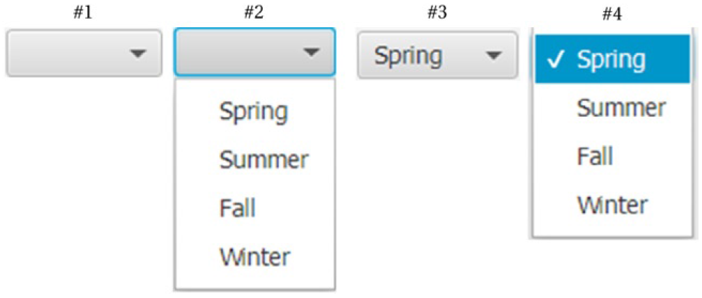

# ChoiceBox

- [ChoiceBox](#choicebox)
  - [简介](#简介)
    - [CheckBox 状态](#checkbox-状态)
    - [ChoiceBox 属性](#choicebox-属性)
    - [设置值](#设置值)
    - [选择模型](#选择模型)
    - [实例](#实例)

2020-05-19, 09:18
***

## 简介

`ChoiceBox` 用于显示少量元素列表。`ChoiceBox`为参数化类，可显示任意类型，如果要同时显示多种类型，可使用 raw type。如下所示：

```java
// 可存储任意类型
ChoiceBox seasons = new ChoiceBox();

// 只保存字符串类型
ChoiceBox<String> seasons = new ChoiceBox<String>();
```

在创建时，可以指定包含的元素：

```java
// 创建时指定值
ObservableList<String> seasonList = FXCollections.<String>observableArrayList("Spring", "Summer", "Fall", "Winter");
ChoiceBox<String> seasons = new ChoiceBox<>(seasonList);
```

创建之后，也可以使用 `items` 属性继续添加元素：

```java
// 创建后指定值
ChoiceBox<String> seasons = new ChoiceBox<>();
seasons.getItems().addAll("Spring", "Summer", "Fall", "Winter");
```

### CheckBox 状态

下图是 `CheckBox` 的不同状态。



- 图 #1 是初始态，可以用鼠标或键盘打开列表
  - 点击控件内任意地方打开弹窗列表
  - 如果控件持有焦点，按向下箭头也可以打开列表
- 图 #2 是打开列表的效果，可以鼠标点击选择，也可以箭头上下移动，用 Enter 键选择
- 图 #3 是选择后的效果
- 图 #4 是选择后，再次打开列表的效果

### ChoiceBox 属性

|属性|类型|说明|
|---|---|---|
|converter|`ObjectProperty<StringConverter<T>>`|converter 的 `toString()` 用于创建对应类型的字符串形式，用于显示|
|items|`ObjectProperty<ObservableList<T>>`|所有选项列表|
|selectionModel|`ObjectProperty<SingleSelectionModel<T>>`|选择模型，用于保存当前被选择的项|
|showing|`ReadOnlyBooleanProperty`|true 表示显示列表项，false表示列表项收缩|
|value|`ObjectProperty<T>`|当前被选择项，如果未选择，为 null|

可以使用 `show()` 和 `hide()` 方法显示或隐藏列表。

### 设置值

`value` 属性保存当前选择的元素。其类型为 `ObjectProperty<T>`。如果没有选择任何元素，为 `null`。

设置 `value` 值的方法：

```java
// Create a ChoiceBox for String items
ChoiceBox<String> seasons = new ChoiceBox<String>();
seasons.getItems().addAll("Spring", "Summer", "Fall", "Winter");

// Get the selected value
String selectedValue = seasons.getValue();

// Set a new value
seasons.setValue("Fall");
```

使用 `setValue()` 设置值：

- 如果值存在于列表中，`ChoiceBox` 选择该值
- 如果值不存在，也可以设置该值，但是控件不显示该值，而显示之前选择的值。

### 选择模型

`ChoiceBox` 需要记录当前选择的元素及其索引，`ChoiceBox` 使用选择模型（selection model）对象实现该功能，对应类为 `SingleSelectionModel`。选择模型的提供的功能：

- 选择元素
  - `select(int index)`，根据索引选择元素
  - `select(T item)`，选择指定元素
  - 第一个 `selectFirst()`
  - 下一个`selectNext()`，当已经选的最后一个元素，调用该方法无效
  - 上一个 `selectPrevious()`，
  - 最后一个 `selectLast()`
  - 也可以使用 `setValue()` 选择值
- 清除选择 `clearSelection()`
- `selectedItem` 和 `selectedIndex` 属性分别记录当前选择的元素和索引，可以添加 `ChangeListener` 监听它们的改变。当没有选择元素，`selectedItem` 为 `null`，`selectedIndex` 为 -1。

例如，选择第一个元素：

```java
ChoiceBox<String> seasons = new ChoiceBox<>();
seasons.getItems().addAll("Spring", "Summer", "Fall", "Winter", "Fall");

// Select the first item in the list
seasons.getSelectionModel().selectFirst();
```

### 实例

创建一个包含四季的 `ChoiceBox`。

```java
import javafx.application.Application;
import javafx.beans.value.ChangeListener;
import javafx.beans.value.ObservableValue;
import javafx.scene.Scene;
import javafx.scene.control.ChoiceBox;
import javafx.scene.control.Label;
import javafx.scene.layout.GridPane;
import javafx.stage.Stage;

public class ChoiceBoxEx1 extends Application
{

    @Override
    public void start(Stage primaryStage)
    {
        Label seasonLbl = new Label("Select a Season:");
        ChoiceBox<String> seasons = new ChoiceBox<>();
        seasons.getItems().addAll("Spring", "Summer", "Fall", "Winter");

        // Select the first season from the list
        seasons.getSelectionModel().selectFirst();

        // Add ChangeListeners to track change in selected index and item. Only
        // one listener is necessary if you want to track change in selection
        seasons.getSelectionModel().selectedItemProperty()
                .addListener((observable, oldValue, newValue) -> System.out.println("Itemchanged: old = " + oldValue + ",new = " + newValue));
        seasons.getSelectionModel().selectedIndexProperty()
                .addListener((observable, oldValue, newValue) -> System.out.println("Indexchanged: old = " + oldValue + ", new = " + newValue));

        Label selectionMsgLbl = new Label("Your selection:");
        Label selectedValueLbl = new Label("None");
        // Bind the value property to the text property of the Label
        selectedValueLbl.textProperty().bind(seasons.valueProperty());
        // Display controls in a GridPane
        GridPane root = new GridPane();
        root.setVgap(10);
        root.setHgap(10);
        root.addRow(0, seasonLbl, seasons);
        root.addRow(1, selectionMsgLbl, selectedValueLbl);
        root.setStyle("-fx-padding: 10;" + "-fx-border-style: solid inside;" + "-fx-border-width: 2;"
                + "-fx-border-insets: 5;" + "-fx-border-radius: 5;" + "-fx-border-color: blue;");
        Scene scene = new Scene(root);
        primaryStage.setScene(scene);
        primaryStage.setTitle("Using ChoiceBox Controls");
        primaryStage.show();
    }

    public static void main(String[] args)
    {
        launch(args);
    }
}
```

