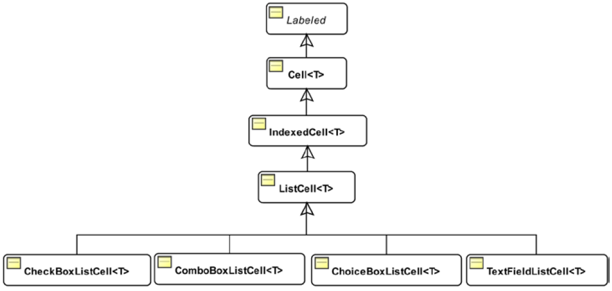
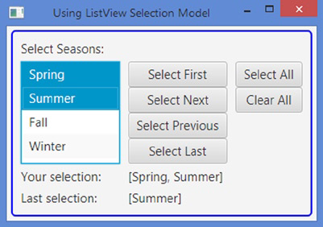
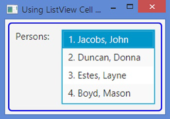

# ListView

- [ListView](#listview)
  - [简介](#%e7%ae%80%e4%bb%8b)
  - [ListView 方向](#listview-%e6%96%b9%e5%90%91)
  - [Selection Model](#selection-model)
  - [Cell Factory](#cell-factory)
  - [Editable ListView](#editable-listview)
    - [使用 TextField 编辑](#%e4%bd%bf%e7%94%a8-textfield-%e7%bc%96%e8%be%91)

2020-05-18, 17:57
***

## 简介

`ListView` 可用于显示一列元素，用户可以从中选择一个或多个进行交互。

`ListView` 存储的元素可以为任意类型，对应控件为 `ListCell` 类。

如果想一个 `ListView` 存储多种类型，可以使用非参数化类，创建方式：

```java
// Create a ListView for any type of items
ListView seasons = new ListView();

// Create a ListView for String items
ListView<String> seasons = new ListView<String>();
```

还可以在构造时指定内容：

```java
ObservableList<String> names = FXCollections.observableArrayList(
        "Julia", "Ian", "Sue", "Matthew", "Hannah", "Stephan", "Denise");
ListView<String> listView = new ListView<String>(names);
```

在构造后，可以通过 `items` 属性添加和删除元素。例如：

```java
ListView<String> seasons = new ListView<>();
seasons.getItems().addAll("Spring", "Summer", "Fall", "Winter");
```

在 `ListView` 中元素较多无法一次显示时，会自动添加水平或垂直滚动条。

另外，`ListView` 的 `placeholder` 属性存储一个 `Node` 引用，在没有元素时显示该 `Node`。例如，下面设置一个 `Label` 为占位符：

```java
Label placeHolder = new Label("No seasons available for selection.");
seasons.setPlaceholder(placeHolder);
```

`ListView` 还提供了一个滚动功能。使用 `scrollTo(int index)` 或 `scrollTo(T item)` 可以滚到列表中指定索引或元素，如果对应元素不在可见区，或自动转到可见区。在调用 `scrollTo()` 方法，或者用户拖动滚动条时，触发 `ScrollToEvent` 事件，可以调用 `setOnScrollTo()` 方法监听该事件。

`ListView` 的元素使用 `ListCell` 类显示。`ListCell` 是一个标签控件，可以显示文本和图形。`ListView` 的 `cellFactory`可以指定一个 `Callback` 对象，提供自定义的 `ListCell`，而且 `ListCell` 已有多个子类可供选择。

另外 `ListView` 包含的 `ListCell` 数目和当前显示的元素个数相同，而非和包含的元素个数相同，在拖动滚动条时，`ListCell` 可重复使用显示元素。下图是 `ListCell` 相关类图：



`Cell` 在多个控件中都是基本组成模块，如 `ListView`, `TreeView`, `TableView`，它们均使用 `Cell` 显示和编辑数据。覆盖 `Cell` 的 `updateItem(T object, booleam empty)` 方法可以设置其填充方式。在需要更新 `Cell` 内容时，该方法被自动调用。

`Cell` 有多个实用的属性：`editable`, `editing`, `empty`, `item` 以及 `selected`。在 `Cell` 为空，即没有和任何数据关联，`empty` 属性为 true。

`IndexedCell` 添加了 `index` 属性，是元素在底层模型的索引。例如 `ListView` 使用 `ObservableList` 作为模型，则 `ObservableList` 的第二个元素对应 `Cell` 的索引为 1。`Cell` 的索引有助于基于索引的自定义，例如，对奇、偶单元格采用不同的颜色。在单元格为空时，其索引为 -1。

## ListView 方向

`ListView` 中的元素可以单列垂直排列（默认），也可以单行水平排列。该性质由 `orientation` 属性设置，如下所示：

```java
// Arrange list of seasons horizontally
seasons.setOrientation(Orientation.HORIZONTAL);
```

下图显示了两个 `ListView`，一个垂直，一个水平。其中奇数和偶数的行或列背景色不同。这是 `ListView` 的默认样式。


## Selection Model

`SelectionModel` 选择模型用于保存元素的选择状态，`selectionModel` 属性保存当前选择模型，默认为 `MultipleSelectionModel` 类。你可以自定一个选择模型，不过一般用不着。

`ListView` 支持两种选择模式: Single, Multiple，对应单项和多项选择。

- `ListView` 默认为单选
  - 一次只能选择一个元素，当选择一个元素，上一个被选择的元素自动取消选择
  - 可以用鼠标点击选择
  - 在 `ListView` 持有焦点时，可以用键盘选择
- 对多项选择
  - 按 Shift 键一次选择连续多个
  - 按 Ctrl 键间隔选择
  - 也可以通过上下箭头移动，按 Space 选择

模式选择：

```java
// 多选模式
seasons.getSelectionModel().setSelectionMode(SelectionMode.MULTIPLE);
// 单选模式
seasons.getSelectionModel().setSelectionMode(SelectionMode.SINGLE);
```

`MultipleSelectionModel` 类继承自 `SelectionModel`，该类包含 `selectedIndex` 和 `selectedItem` 属性。

`selectedIndex` 值：

- 没有选择时，`selectedIndex` 为 -1
- 在单选模式，为对应元素索引
- 在多选模式，使用 `getSelectedIndices()` 返回包含所有选择元素索引的 `ObservableList<Integer>`

可以对 `selectedIndex` 属性添加 `ChangeListener`，或者对 `getSelectedIndices()` 返回的 `ObservableList` 添加 `ListChangeListener`，监听索引的变化。

`selectedItem` 属性：

- 没有选择时，为 null
- 在单选模式，为当前被选的元素
- 在多选模式，为最后一个选择的元素。
- 在多选模式，`getSelectedItems()` 方法返回只读的 `ObservableList<T>`，包含被选的所有元素。

为 `selectedItem` 添加 `ChangeListener` 监听单选元素变化。

为 `getSelectedItems()` 返回的 `ObservableList<T>` 添加 `ListChangeListener` 鉴定多选元素变化。

`ListView` 包含选择元素的方法：

- `selectAll()` 选择所有元素
- `selectFirst()` 和 `selectLast()` 分别选择第一个和最后一个元素
- `selectIndices(int index, int... indices)` 根据索引选择多个元素，溢出的索引直接忽略
- `selectRange(int start, int end)` 选择 [start, end) 范围内的所有元素
- `clearSelection()` 清除所有选择，`clearSelection(int index)` 清除指定位置的选择。

下例演示选择模型：

```java
import javafx.application.Application;
import javafx.beans.value.ObservableValue;
import javafx.collections.ObservableList;
import javafx.scene.Scene;
import javafx.scene.control.Button;
import javafx.scene.control.Label;
import javafx.scene.control.ListView;
import javafx.scene.control.SelectionMode;
import javafx.scene.layout.GridPane;
import javafx.scene.layout.VBox;
import javafx.stage.Stage;

public class ListViewSelectionModel extends Application
{
    private ListView<String> seasons;
    private final Label selectedItemsLbl = new Label("[None]");
    private final Label lastSelectedItemLbl = new Label("[None]");

    public static void main(String[] args)
    {
        Application.launch(args);
    }

    @Override
    public void start(Stage stage)
    {
        Label seasonsLbl = new Label("Select Seasons:");
        seasons = new ListView<>();
        seasons.setPrefSize(120, 120);
        seasons.getItems().addAll("Spring", "Summer", "Fall", "Winter");

        // Enable multiple selection
        seasons.getSelectionModel().setSelectionMode(SelectionMode.MULTIPLE);

        // Add a selection change listener
        seasons.getSelectionModel().selectedItemProperty()
                .addListener(this::selectionChanged);

        // Add some buttons to assist in selection
        Button selectAllBtn = new Button("Select All");
        selectAllBtn.setOnAction(e -> seasons.getSelectionModel().selectAll());
        Button clearAllBtn = new Button("Clear All");
        clearAllBtn.setOnAction(e -> seasons.getSelectionModel().clearSelection());
        Button selectFirstBtn = new Button("Select First");
        selectFirstBtn.setOnAction(e -> seasons.getSelectionModel().selectFirst());
        Button selectLastBtn = new Button("Select Last");
        selectLastBtn.setOnAction(e -> seasons.getSelectionModel().selectLast());
        Button selectNextBtn = new Button("Select Next");
        selectNextBtn.setOnAction(e -> seasons.getSelectionModel().selectNext());
        Button selectPreviousBtn = new Button("Select Previous");
        selectPreviousBtn.setOnAction(e -> seasons.getSelectionModel().selectPrevious());
        // Let all buttons expand as needed
        selectAllBtn.setMaxWidth(Double.MAX_VALUE);
        clearAllBtn.setMaxWidth(Double.MAX_VALUE);
        selectFirstBtn.setMaxWidth(Double.MAX_VALUE);
        selectLastBtn.setMaxWidth(Double.MAX_VALUE);
        selectNextBtn.setMaxWidth(Double.MAX_VALUE);
        selectPreviousBtn.setMaxWidth(Double.MAX_VALUE);
        // Display controls in a GridPane
        GridPane root = new GridPane();
        root.setHgap(10);
        root.setVgap(5);
        // Add buttons to two VBox objects
        VBox singleSelectionBtns = new VBox(selectFirstBtn, selectNextBtn,
                selectPreviousBtn, selectLastBtn);
        VBox allSelectionBtns = new VBox(selectAllBtn, clearAllBtn);
        root.addColumn(0, seasonsLbl, seasons);
        root.add(singleSelectionBtns, 1, 1, 1, 1);
        root.add(allSelectionBtns, 2, 1, 1, 1);
        // Add controls to display the user selection
        Label selectionLbl = new Label("Your selection:");
        root.add(selectionLbl, 0, 2);
        root.add(selectedItemsLbl, 1, 2, 2, 1);
        Label lastSelectionLbl = new Label("Last selection:");
        root.add(lastSelectionLbl, 0, 3);
        root.add(lastSelectedItemLbl, 1, 3, 2, 1);
        root.setStyle("-fx-padding: 10;" +
                "-fx-border-style: solid inside;" +
                "-fx-border-width: 2;" +
                "-fx-border-insets: 5;" +
                "-fx-border-radius: 5;" +
                "-fx-border-color: blue;");
        Scene scene = new Scene(root);
        stage.setScene(scene);
        stage.setTitle("Using ListView Selection Model");
        stage.show();
    }

    // A change listener to track the change in item selection
    public void selectionChanged(ObservableValue<? extends String> observable,
            String oldValue, String newValue)
    {
        String lastItem = (newValue == null) ? "[None]" : "[" + newValue + "]";
        lastSelectedItemLbl.setText(lastItem);
        ObservableList<String> selectedItems =
                seasons.getSelectionModel().getSelectedItems();
        String selectedValues =
                (selectedItems.isEmpty()) ? "[None]" : selectedItems.toString();
        this.selectedItemsLbl.setText(selectedValues);
    }
}
```



## Cell Factory

`ListView` 的单元格使用 `ListCell` 显示。`ListView` 的 `cellFactory` 用于自定义单元格，其类型为 `ObjectProperty<Callback<ListView<T>, ListCell<T>>>`。

对大型列表，`ListCell` 会被重用，在拖动列表时，`ListCell` 的 `updateItem()` 方法接收新数据的引用。

`ListView` 默认调用元素的 `toString()` 方法，显示该字符串。在自定义 `ListCell` 的 `updateItem()` 方法中，可以根据单元格内容填充任意文本和图形到单元格中。

例如，下面使用自定义的 cellFactory 显示格式化的 `Person`。

```java
import javafx.application.Application;
import javafx.scene.Scene;
import javafx.scene.control.Label;
import javafx.scene.control.ListCell;
import javafx.scene.control.ListView;
import javafx.scene.layout.HBox;
import javafx.stage.Stage;
import javafx.util.Callback;

public class ListViewDomainObjects extends Application
{
    public static void main(String[] args)
    {
        Application.launch(args);
    }

    @Override
    public void start(Stage stage)
    {
        ListView<Person> persons = new ListView<>();
        persons.setPrefSize(150, 120);
        persons.getItems().addAll(new Person("John", "Jacobs", null),
                new Person("Donna", "Duncan", null),
                new Person("Layne", "Estes", null),
                new Person("Mason", "Boyd", null));

        // Add a custom cell factory to display formatted names of persons
        persons.setCellFactory(
                new Callback<ListView<Person>, ListCell<Person>>()
                {
                    @Override
                    public ListCell<Person> call(ListView<Person> listView)
                    {
                        return new ListCell<Person>()
                        {
                            @Override
                            public void updateItem(Person item, boolean empty)
                            {
                                // 必须调用 super
                                super.updateItem(item, empty);
                                int index = this.getIndex();
                                String name = null;
                                // Format name
                                if (item == null || empty) {
                                // No action to perform
                                } else {
                                    name = (index + 1) + ". " +
                                            item.getLastName() + ", " +
                                            item.getFirstName();
                                }
                                this.setText(name);
                                setGraphic(null);
                            }
                        };
                    }
                });
        HBox root = new HBox(new Label("Persons:"), persons);
        root.setSpacing(20);
        root.setStyle("-fx-padding: 10;" +
                "-fx-border-style: solid inside;" +
                "-fx-border-width: 2;" +
                "-fx-border-insets: 5;" +
                "-fx-border-radius: 5;" +
                "-fx-border-color: blue;");
        Scene scene = new Scene(root);
        stage.setScene(scene);
        stage.setTitle("Using ListView Cell Factory");
        stage.show();
    }
}
```



## Editable ListView

`ListView` 提供了让用户编辑的功能，其中两个属性用于实现该功能：

- `editable` 设置 true，以允许编辑
- 设置 `cellFactory`，以提供编辑状态的单元格

选择后点击单元格开始编辑。持焦点后点击空格也开始编辑。

如果 `ListView` 是可编辑的，毕竟包含可编辑单元格，则可以通过 `edit(int index)` 方法编辑指定索引下的单元格。

`ListView` 的只读属性 `editingIndex` 表示当前正被编辑单元格的索引，如果没有被编辑的单元格，其值为 -1。

JavaFX 提供了多个 cellFactory，从而可以使用 `TextField`, `ChoiceBox`, `ComboBox` 和 `CheckBox` 任意编辑 `ListCell`，对应 `ListCell` 子类为 `TextFieldListCell`, `ChoiceBoxListCell`, `ComboBoxListCell`, `CheckBoxListCell`。

### 使用 TextField 编辑

`TextFieldListCell` 在显示状态使用 `Label` 显示文本，在编辑状态使用 `TextField`。

如果需要编辑`ListView`，需要设置 `StringConverter`，以提供字符串和元素对象之间的转换。

`TextFieldListCell` 的 `forListView()` 静态方法返回一个用于编辑字符串的 cellFactory。

下面是设置 `TextField` 作为单元格编辑器的方法：

```java
ListView<String> breakfasts = new ListView<>();
breakfasts.setEditable(true);

// Set a TextField as the editor
Callback<ListView<String>, ListCell<String>> cellFactory = TextFieldListCell.forListView();
breakfasts.setCellFactory(cellFactory);
```

对非字符串类型，如 `Person`，使用方法如下：

```java
ListView<Person> persons = new ListView<>();
persons.setEditable(true);
// Set a TextField as the editor.
// Need to use a StringConverter for Person objects.
StringConverter<Person> converter = new PersonStringConverter();
Callback<ListView<Person>, ListCell<Person>> cellFactory = TextFieldListCell.forListView(converter);
persons.setCellFactory(cellFactory);
```
