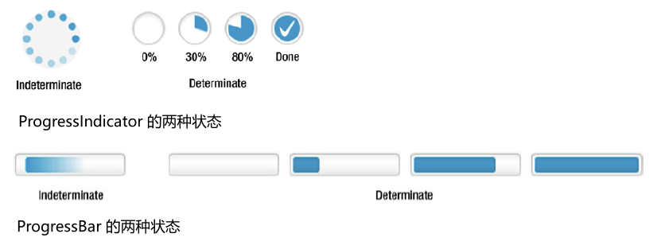

# 任务进度

## 简介

JavaFX 提供了两个显示进度的控件：

- ProgressIndicator
- ProgressBar

它们只是在显示进度的方式上不同。`ProgressIndicator` 咋圆形控件中显示进度，而 `ProgressBar` 使用长条。如下图所示：



## 进度

进度分为两种状态，可确定和不可确定。如果无法确定进度，称其处于 `indeterminate` 状态。`ProgressIndicator` 声明了两个属性：

- indeterminate
- progress

`indeterminate` 是一个只读 boolean 属性。`true` 表示无法确定进度，此时 `ProgressIndicator` 展示循环的动画。

`progress` 是 `double` 属性。其值表示进度在 0% ~ 100% 之间，**负数表示进度不确**定。0 到 1.0 之间对应正常进度，大于 1.0 则视为 1.0 (100%)。

`ProgressIndicator` 和 `ProgressBar` 的默认构造函数创建的控件均处于不确定状态：

```java
// Create an indeterminate progress indicator and a progress bar
ProgressIndicator indeterminateInd = new ProgressIndicator();
ProgressBar indeterminateBar = new ProgressBar();
```

以非负数为参数的构造函数，创建以指定进度开始的控件，处于确定状态；如果进度为负值，则处于不确定状态。

```java
// Create a determinate progress indicator with 10% progress
ProgressIndicator indeterminateInd = new ProgressIndicator(0.10);
// Create a determinate progress bar with 70% progress
ProgressBar indeterminateBar = new ProgressBar(0.70);
```

