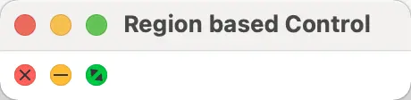

# 自定义控件

2023-11-14, 22:47
@author Jiawei Mao

****
## 简介

当现有控件无法满足需求，就需要自定义实现新的控件。JavaFX 提供了多种自定义控件的方法：

- 使用 CSS 重新定义控件样式
- 组合已有控件
- 扩展已有控件
- 使用 `Control`+Skin 类
- 使用 `Region` 类
- 使用 `Canvas` 类

## 使用 CSS 重新定义控件样式

例如，我们想将 `CheckBox` 的样式更改为 MaterialDesign 类型。

因为我们只想重新设计 `CheckBox`，所以需要查看 CheckBox 当前 CSS 样式。为此，需要查看 modena.css 文件，该文件包含 JavaFX 所有控件的默认 CSS 样式。在 openjfx GitHub 可以找到 [modena.css](https://raw.githubusercontent.com/openjdk/jfx/master/modules/javafx.controls/src/main/resources/com/sun/javafx/scene/control/skin/modena/modena.css) 文件。

在 modena.css 之前是 caspian.css 文件，两个文件结构不同：

- modena.css 进行了很多优化，但并不是为了增加可读性
- caspian.css 中的样式按照控件进行分组，因此很容易找到 CheckBox 的所有样式
- modena.css 中 CheckBox 的样式分散在不同位置

所以需要从 modena.css 文件中将 CheckBox 的相关样式收集起来，复制到一个单独的 css 文件，例如 restyled.css。该文件类似于：

```css
.check-box > .box {}
    -fx-background-color: -fx-shadow-highlight-color, -fx-outer-border, -fx-inner-border, -fx-body-color;
    -fx-background-insets: 0 0 -1 0, 0, 1, 2;
    -fx-background-radius: 3px, 3px, 2px, 1px;
    -fx-padding: 0.333333em 0.666667em 0.333333em 0.666667em;
    -fx-text-fill: -fx-text-base-color;
    -fx-alignment: CENTER;
    -fx-content-display: LEFT;
}
.check-box:hover > .box {
    -fx-color: -fx-hover-base;
}
.check-box:armed .box {
    -fx-color: -fx-pressed-base;
}
.check-box:focused > .box {
    -fx-background-color: -fx-focus-color, -fx-inner-border, -fx-body-color, -fx-faint-focus-color, -fx-body-color;
    -fx-background-insets: -0.2, 1, 2, -1.4, 2.6;
    -fx-background-radius: 3, 2, 1, 4, 1;
}
.check-box:disabled {
    -fx-opacity: 0.4;
}
.check-box:show-mnemonics > .mnemonic-underline {
    -fx-stroke: -fx-text-base-color;
}
.check-box:selected > .box > .mark,
.check-box:indeterminate  > .box > .mark {
    -fx-background-color: -fx-mark-highlight-color, -fx-mark-color;
    -fx-background-insets: 1 0 -1 0, 0;
}
.check-box {
    -fx-label-padding: 0.0em 0.0em 0.0em 0.416667em; /* 0 0 0 5 */
    -fx-text-fill: -fx-text-background-color;
}
.check-box > .box {
    -fx-background-radius: 3, 2, 1;
    -fx-padding: 0.166667em 0.166667em 0.25em 0.25em; /* 2 2 3 3 */
}
.check-box > .box > .mark {
    -fx-background-color: null;
    -fx-padding: 0.416667em 0.416667em 0.5em 0.5em; /* 5 5 6 6 */
    -fx-shape: "M-0.25,6.083c0.843-0.758,4.583,4.833,5.75,4.833S14.5-1.5,15.917-0.917c1.292,0.532-8.75,17.083-10.5,17.083C3,16.167-1.083,6.833-0.25,6.083z";
}
.check-box:indeterminate > .box {
    -fx-padding: 0;
}
.check-box:indeterminate  > .box > .mark {
    -fx-shape: "M0,0H10V2H0Z";
    -fx-scale-shape: false;
    -fx-padding: 0.666667em;
}
```

总的来说，JavaFX CSS 与 Web CSS 非常相似，除了基于 CSS 2.1  设计，所有属性包含 `-fx-` 前缀，支持遍历。

下面实现 [MaterialDesign](https://material.io/develop/web/components/input-controls/checkboxes#checkboxes "MaterialDesign") 样式的 `CheckBox`，需要对现有 CSS 样式进行一些修改：


- 取消渐变，使 UI 更扁平化
- 不同的 checkmark
- 勾选时填充背景
- 不同 focus indicator

取消渐变很容易，只需要定义一些颜色来代替渐变。为此，在 restyled.css 文件中定义如下遍历：

```css
.check-box {
    -material-design-color: #3f51b5;
    -material-design-color-transparent-12: #3f51b51f;
    -material-design-color-transparent-24: #3f51b53e;
    -material-design-color-transparent-40: #3f51b566;
    ...
}
```

这样就能在 CSS 文件的 `.check-box` 中使用 `-material-design-color`。

### 修改 checkmark

checkmark 是使用 `-fx-shape` 定义的 SVGPath。modena.css 中的定义：

```css
.check-box > .box > .mark {
    -fx-background-color: null;
    -fx-padding: 0.416667em 0.416667em 0.5em 0.5em; /* 5 5 6 6 */
    -fx-shape: "M-0.25,6.083c0.843-0.758,4.583,4.833,5.75,4.833S14.5-1.5,15.917-0.917c1.292,0.532-8.75,17.083-10.5,17.083C3,16.167-1.083,6.833-0.25,6.083z";
}
```

上面的 `-fx-shape` 定义了如下形状


现在自定义一个 SVGPath，替换原有的 -fx-shape:

```css
.check-box > .box > .mark {
    -fx-background-color: null;
    -fx-padding: 0.45em;
    -fx-scale-x: 1.1;
    -fx-scale-y: 0.8;
    -fx-shape: "M9.998,13.946L22.473,1.457L26.035,5.016L10.012,21.055L0.618,11.688L4.178,8.127L9.998,13.946Z";
}
```


上面还调整了 scale-x 和 scale-y 属性使 checkmark 和 CheckBox 更匹配。

### 修改 box

下面要取消 CheckBox 的渐变背景吗，即取消 modena.css 中定义的线性渐变，将背景设置为透明，并设置一个边框：

```css
.check-box > .box {
    -fx-background-color: transparent;
    -fx-background-insets: 0;
    -fx-border-color: #0000008a;
    -fx-border-width: 2px;
    -fx-border-radius: 2px;
    -fx-padding: 0.083333em; /* 1px */
    -fx-text-fill: -fx-text-base-color;
    -fx-alignment: CENTER;
    -fx-content-display: LEFT;
}
```

- 当勾选复选框时，填充 box

```css
.check-box:selected > .box {
    -fx-background-color: -material-design-color;
    -fx-background-radius: 2px;
    -fx-background-insets: 0;
    -fx-border-color: transparent;
}
```

这里简单地填充背景，并将 border 设置为透明。

### CheckBox 状态

接下来就是 CheckBox 在  hover, focused 和 selected 状态的样式。原始 MaterialDesign CheckBox 在 CheckBox 周围画一个圆。

使用 CSS 很容易实现该样式，在 focused 状态添加圆的 CSS：

```css
.check-box:focused > .box {
    -fx-background-color: #6161613e, transparent;
    -fx-background-insets: -14, 0;
    -fx-background-radius: 1024;
}
```

这个状态圆比 CheckBox 要大一点。为了实现该效果，这里定义了两个 background colors `-fx-background-color: #6161613e, transparent;`

## 扩展已有控件

## 扩展 Region

2023-08-14, 10:45

`Region` 是 `Control` 和 `Pane` 的父类，是一个 resizable 的 `Parent` node，可以通过 CSS 设置样式。扩展该类是自定义控件最直观的方法。

`Region` 和 Control+Skin 的主要区别在于，基于 `Region` 的控件同时包含逻辑和 UI，而 Control+Skin 的逻辑和 UI 分离，逻辑在 `Control` 中，UI 在 Skin 中。

在 Mac 的每个窗口上有三个按钮（红、黄、绿），可用来关闭、最小化和缩放窗口。MacOS 的深色模式还不直接支持 JavaFX，如果在 MacOS 深色模式运行 JavaFX，JavaFX 依然为浅色模式。

所以，我们现在自定义一个 MacOS 深色模式的按钮。按钮样式如下：


当鼠标悬停在按钮上，会显示符号。

即需要创建一个显示彩色圆圈的控件，鼠标悬停显示符号。

对**复现**现有控件，可以将控件的截图作为背景图片加载到矢量绘图程序，然后在截图上绘制副本。这样可以获得正确的尺寸、位置和颜色：


确定圆的大小、距离和颜色后，还需要添加符号。这比较耗时，因为必须手动绘制这些符号。

我们通常使用 JavaFX 提供的 `:hover` pseudo class 显示/隐藏按钮上的符号，但这里需要自定义 `:hover` pseudo class，因为在 MacOS 中，鼠标悬停在一个按钮上，所有按钮都显示符号。在代码中，我们将按钮放在 `HBox` 中，并添加一个 `MouseListener`，当鼠标悬停在 `HBox` ，将所有按钮设置为 `:hover`，触发显示符号。

该控件由两个元素组成，`Circle` 和 `Region`。原则上，这里可以不用 `Circle`，将背景设置为圆形即可。不过这里保留 `Circle`。`Circle` 继承自 `Shape`，没有 `-fx-background-color` 和 `-fx-border-color` 属性，但有 `-fx-fill` 和 `-fx-stroke` 属性。

因为已知颜色，所以不用为颜色添加 styleable 属性，而是直接在 CSS 中预定义这三种颜色。

然后为 close, minimize, zoom 和 hovered 状态定义属性。

该控件另一个好处是不需要调整它的大小，它的尺寸保持不变。尽管如此，我们还是添加调整大小的代码，有备无患。

- 定义所需变量

```java
public class RegionControl extends Region {

    public enum Type { CLOSE, MINIMIZE, ZOOM }

    private static final double PREFERRED_WIDTH = 12;
    private static final double PREFERRED_HEIGHT = 12;
    
    private static final double MINIMUM_WIDTH = 12;
    private static final double MINIMUM_HEIGHT = 12;
    
    private static final double MAXIMUM_WIDTH = 12;
    private static final double MAXIMUM_HEIGHT = 12;
    
    private static final PseudoClass CLOSE_PSEUDO_CLASS = 
                                    PseudoClass.getPseudoClass("close");
    private static final PseudoClass MINIMIZE_PSEUDO_CLASS = 
                                    PseudoClass.getPseudoClass("minimize");
    private static final PseudoClass ZOOM_PSEUDO_CLASS = 
                                    PseudoClass.getPseudoClass("zoom");
    private static final PseudoClass HOVERED_PSEUDO_CLASS = 
                                    PseudoClass.getPseudoClass("hovered");
    private static final PseudoClass PRESSED_PSEUDO_CLASS = 
                                    PseudoClass.getPseudoClass("pressed");
    
    private BooleanProperty hovered;
    private static String userAgentStyleSheet;
    private ObjectProperty<Type> type;
    private double size;
    private double width;
    private double height;
    private Circle circle;
    private Region symbol;
    private Consumer<MouseEvent> mousePressedConsumer;
    private Consumer<MouseEvent> mouseReleasedConsumer;
```

这里为三种不同的状态定义了一个 enum 类，并为每种状态创建了一个 `PseudoClass`。并为 `hovered` 和 `pressed` 状态创建了 `PseudoClass`。

还提供了 `hovered` 和 `type` 属性，便于从外部设置这些属性。

因为该控件是一个按钮，所以添加了鼠标按下和释放的 `Consumer`，以便后续添加自定义 handler。

- 构造函数

```java
public RegionControl() {
        this(Type.CLOSE);
}

public RegionControl(final Type type) {
    this.type = new ObjectPropertyBase<>(type) {
        @Override protected void invalidated() {
            switch(get()) {
                case CLOSE -> {
                    pseudoClassStateChanged(CLOSE_PSEUDO_CLASS, true);
                    pseudoClassStateChanged(MINIMIZE_PSEUDO_CLASS, false);
                    pseudoClassStateChanged(ZOOM_PSEUDO_CLASS, false);
                }
                case MINIMIZE -> {
                    pseudoClassStateChanged(CLOSE_PSEUDO_CLASS, false);
                    pseudoClassStateChanged(MINIMIZE_PSEUDO_CLASS, true);
                    pseudoClassStateChanged(ZOOM_PSEUDO_CLASS, false);
                }
                case ZOOM -> {
                    pseudoClassStateChanged(CLOSE_PSEUDO_CLASS, false);
                    pseudoClassStateChanged(MINIMIZE_PSEUDO_CLASS, false);
                    pseudoClassStateChanged(ZOOM_PSEUDO_CLASS, true);
                }
            }
        }
        @Override public Object getBean() { return RegionControl.this; }
        @Override public String getName() { return "type"; }
    };
    
    this.hovered = new BooleanPropertyBase() {
        @Override protected void invalidated() { pseudoClassStateChanged(HOVERED_PSEUDO_CLASS, get()); }
        @Override public Object getBean() { return RegionControl.this; }
        @Override public String getName() { return "hovered"; }
    };

    // 使用传入的 type 参数初始化 type
    pseudoClassStateChanged(CLOSE_PSEUDO_CLASS, Type.CLOSE == type);
    pseudoClassStateChanged(MINIMIZE_PSEUDO_CLASS, Type.MINIMIZE == type);
    pseudoClassStateChanged(ZOOM_PSEUDO_CLASS, Type.ZOOM == type);

    initGraphics();
    registerListeners();
}
```

在构造函数中，在 `type` 属性的 `invalidated()` 方法中为 `type` 设置了 pseudo-classes。有了它，就可以在运行时更改 `type`。

为了确保正确初始化 `type`，在构造使用中使用给定的 `type` 参数调用 `pseudoClassStateChanged()`。

`initGraphics` 和 `registerListeners` 实现：

```java
private void initGraphics() {
    if (Double.compare(getPrefWidth(), 0.0) <= 0 
        || Double.compare(getPrefHeight(), 0.0) <= 0 
        || Double.compare(getWidth(), 0.0) <= 0 
        || Double.compare(getHeight(), 0.0) <= 0) {
        if (getPrefWidth() > 0 && getPrefHeight() > 0) {
            setPrefSize(getPrefWidth(), getPrefHeight());
        } else {
            setPrefSize(PREFERRED_WIDTH, PREFERRED_HEIGHT);
        }
    }
    
    // 为当前控件添加样式类
    getStyleClass().add("region-based");

    circle = new Circle();
    circle.getStyleClass().add("circle");
    circle.setStrokeType(StrokeType.INSIDE);
    
    // 用来显示 hover 符号
    symbol = new Region();
    symbol.getStyleClass().add("symbol");

    getChildren().setAll(circle, symbol);
}

private void registerListeners() {
    widthProperty().addListener(o -> resize());
    heightProperty().addListener(o -> resize());
    
    addEventFilter(MouseEvent.MOUSE_PRESSED, e -> {
        pseudoClassStateChanged(PRESSED_PSEUDO_CLASS, true);
        if (null == mousePressedConsumer) { return; }
        mousePressedConsumer.accept(e);
    });
    addEventFilter(MouseEvent.MOUSE_RELEASED, e -> {
        pseudoClassStateChanged(PRESSED_PSEUDO_CLASS, false);
        if (null == mouseReleasedConsumer) { return; }
        mouseReleasedConsumer.accept(e);
    });
}
```

在 `initGraphics` 中添加了 `Circle` 和 `Region`，并分别设置了样式类名。

在 `registerListeners` 中：

- 添加了常见的 size listeners（也可以在 layoutChildren() 方法中调整大小/重绘）
- 设置了两个 `EventFilter` 来捕获 `MOUSE_PRESSED` 和 `MOUSE_RELEASED` 事件，并转发给 `mousePressedConsumer` 和 `mouseReleasedConsumer`
- 在 EventFilter 方法调用 pseudoClassStateChanged，确保按下鼠标时控件样式被正确设置

CSS 文件包含 UI 相关的所有内容，如下：

```css
.region-based {
    /* 不同状态的颜色 */
    -RED: #ff6058;
    -YELLOW: #ffbc35;
    -GREEN: #00c844;
    /* 禁用状态颜色 */
    -GRAY: #535353;
    /* 符号颜色 */
    -DARK_GRAY: #343535;
}

.region-based .circle {
    -fx-stroke-width: 0.5px;
}

.region-based:close .circle,
.region-based:close:hovered .circle {
    -fx-fill: -RED;
    -fx-stroke: derive(-RED, -10%);
}
.region-based:close:pressed .circle {
    -fx-fill: derive(-RED, -20%);
    -fx-stroke: derive(-RED, -30%);
}

.region-based:minimize .circle,
.region-based:minimize:hovered .circle {
    -fx-fill: -YELLOW;
    -fx-stroke: derive(-YELLOW, -10%);
}
.region-based:minimize:pressed .circle {
    -fx-fill: derive(-YELLOW, -20%);
    -fx-stroke: derive(-YELLOW, -30%);
}

.region-based:zoom .circle,
.region-based:zoom:hovered .circle {
    -fx-fill: -GREEN;
    -fx-stroke: derive(-GREEN, -10%);
}
.region-based:zoom:pressed .circle {
    -fx-fill: derive(-GREEN, -20%);
    -fx-stroke: derive(-GREEN, -30%);
}

.region-based:disabled:close .circle,
.region-based:disabled:minimize .circle,
.region-based:disabled:zoom .circle {
    -fx-fill: -GRAY;
    -fx-stroke: transparent;
}

.region-based:close .symbol,
.region-based:minimize .symbol,
.region-based:zoom .symbol {
    -fx-background-color: transparent;
}

.region-based:hovered:close .symbol {
    -fx-background-color: -DARK_GRAY;
    -fx-border-color: -DARK_GRAY;
    -fx-scale-shape: false;
    -fx-shape: "M6.001,5.429l2.554,-2.555l0.571,0.571l-2.555,2.554l2.55,2.55l-0.572,0.572l-2.55,-2.55l-2.554,2.555l-0.571,-0.571l2.555,-2.554l-2.55,-2.55l0.572,-0.572l2.55,2.55Z";
}
.region-based:hovered:minimize .symbol {
    -fx-background-color: -DARK_GRAY;
    -fx-scale-shape: false;
    -fx-shape: "M2.0,5.5l8,0l0,1l-8,0l0,-1Z";
}
.region-based:hovered:zoom .symbol {
    -fx-background-color: -DARK_GRAY;
    -fx-scale-shape: false;
    -fx-shape: "M2.696,2.582l4.545,0.656l-3.889,3.889l-0.656,-4.545ZM9.533,9.418l-0.656,-4.545l-3.889,3.889l4.545,0.656Z";
}
```

MacOS 按钮看起来要么有一个 inner-shadow，要么有一个比 fill 深一点的 border。因此，将 stroke 设置为 0.5px。同时定义一个比 fill 深一点的 stroke-color。

在 JavaFX CSS 中通过 derive 方法很容易定义该颜色。创建一个深红色 border：

```css
-fx-stroke: derive(-RED, -10%);
```

对 pressed 状态使用相同技术，即 fill 和 stroke 颜色比圆来深一点，以表示 pressed 状态。

上面对每个状态（:close, :minimize, :zoom, :hovered, :pressed）以及这些状态的组合都定义了相关颜色。

当然也有其它技术实现该效果。这里采用组合 CSS PseudoClasses 设置控件样式并非唯一方式。

Normal state:


Hovered state:



完整代码：

```java
@DefaultProperty("children")
public class RegionControl extends Region {

    public enum Type {CLOSE, MINIMIZE, ZOOM}

    private static final double PREFERRED_WIDTH = 12;
    private static final double PREFERRED_HEIGHT = 12;
    private static final double MINIMUM_WIDTH = 12;
    private static final double MINIMUM_HEIGHT = 12;
    private static final double MAXIMUM_WIDTH = 12;
    private static final double MAXIMUM_HEIGHT = 12;
    private static final PseudoClass CLOSE_PSEUDO_CLASS = PseudoClass.getPseudoClass("close");
    private static final PseudoClass MINIMIZE_PSEUDO_CLASS = PseudoClass.getPseudoClass("minimize");
    private static final PseudoClass ZOOM_PSEUDO_CLASS = PseudoClass.getPseudoClass("zoom");
    private static final PseudoClass HOVERED_PSEUDO_CLASS = PseudoClass.getPseudoClass("hovered");
    private static final PseudoClass PRESSED_PSEUDO_CLASS = PseudoClass.getPseudoClass("pressed");
    private static final PseudoClass STATE_PSEUDO_CLASS = PseudoClass.getPseudoClass("state");
    private BooleanProperty hovered;
    private BooleanProperty state;
    private static String userAgentStyleSheet;
    private ObjectProperty<Type> type;
    private double size;
    private double width;
    private double height;
    private Circle circle;
    private Region symbol;
    private Consumer<MouseEvent> mousePressedConsumer;
    private Consumer<MouseEvent> mouseReleasedConsumer;

    public RegionControl() {
        this(Type.CLOSE);
    }

    public RegionControl(final Type type) {
        this.type = new ObjectPropertyBase<>(type) {
            @Override
            protected void invalidated() {
                switch (get()) {
                    case CLOSE -> {
                        pseudoClassStateChanged(CLOSE_PSEUDO_CLASS, true);
                        pseudoClassStateChanged(MINIMIZE_PSEUDO_CLASS, false);
                        pseudoClassStateChanged(ZOOM_PSEUDO_CLASS, false);
                    }
                    case MINIMIZE -> {
                        pseudoClassStateChanged(CLOSE_PSEUDO_CLASS, false);
                        pseudoClassStateChanged(MINIMIZE_PSEUDO_CLASS, true);
                        pseudoClassStateChanged(ZOOM_PSEUDO_CLASS, false);
                    }
                    case ZOOM -> {
                        pseudoClassStateChanged(CLOSE_PSEUDO_CLASS, false);
                        pseudoClassStateChanged(MINIMIZE_PSEUDO_CLASS, false);
                        pseudoClassStateChanged(ZOOM_PSEUDO_CLASS, true);
                    }
                }
            }

            @Override
            public Object getBean() {return RegionControl.this;}

            @Override
            public String getName() {return "type";}
        };
        this.hovered = new BooleanPropertyBase() {
            @Override
            protected void invalidated() {pseudoClassStateChanged(HOVERED_PSEUDO_CLASS, get());}

            @Override
            public Object getBean() {return RegionControl.this;}

            @Override
            public String getName() {return "hovered";}
        };
        this.state = new BooleanPropertyBase(false) {
            @Override
            protected void invalidated() {pseudoClassStateChanged(STATE_PSEUDO_CLASS, get());}

            @Override
            public Object getBean() {return RegionControl.this;}

            @Override
            public String getName() {return "state";}
        };

        pseudoClassStateChanged(CLOSE_PSEUDO_CLASS, Type.CLOSE == type);
        pseudoClassStateChanged(MINIMIZE_PSEUDO_CLASS, Type.MINIMIZE == type);
        pseudoClassStateChanged(ZOOM_PSEUDO_CLASS, Type.ZOOM == type);

        initGraphics();
        registerListeners();
    }


    // ******************** Initialization ************************************
    private void initGraphics() {
        if (Double.compare(getPrefWidth(), 0.0) <= 0 || Double.compare(getPrefHeight(), 0.0) <= 0 || Double.compare(getWidth(), 0.0) <= 0 ||
                Double.compare(getHeight(), 0.0) <= 0) {
            if (getPrefWidth() > 0 && getPrefHeight() > 0) {
                setPrefSize(getPrefWidth(), getPrefHeight());
            } else {
                setPrefSize(PREFERRED_WIDTH, PREFERRED_HEIGHT);
            }
        }

        getStyleClass().add("region-based");

        circle = new Circle();
        circle.getStyleClass().add("circle");
        circle.setStrokeType(StrokeType.INSIDE);

        symbol = new Region();
        symbol.getStyleClass().add("symbol");

        getChildren().setAll(circle, symbol);
    }

    private void registerListeners() {
        widthProperty().addListener(o -> resize());
        heightProperty().addListener(o -> resize());
        addEventFilter(MouseEvent.MOUSE_PRESSED, e -> {
            pseudoClassStateChanged(PRESSED_PSEUDO_CLASS, true);
            if (null == mousePressedConsumer) {
                return;
            }
            mousePressedConsumer.accept(e);
        });
        addEventFilter(MouseEvent.MOUSE_RELEASED, e -> {
            pseudoClassStateChanged(PRESSED_PSEUDO_CLASS, false);
            if (null == mouseReleasedConsumer) {
                return;
            }
            mouseReleasedConsumer.accept(e);
        });
    }


    @Override
    protected double computeMinWidth(final double height) {return MINIMUM_WIDTH;}

    @Override
    protected double computeMinHeight(final double width) {return MINIMUM_HEIGHT;}

    @Override
    protected double computePrefWidth(final double height) {return super.computePrefWidth(height);}

    @Override
    protected double computePrefHeight(final double width) {return super.computePrefHeight(width);}

    @Override
    protected double computeMaxWidth(final double height) {return MAXIMUM_WIDTH;}

    @Override
    protected double computeMaxHeight(final double width) {return MAXIMUM_HEIGHT;}

    @Override
    public ObservableList<Node> getChildren() {return super.getChildren();}

    public Type getType() {return type.get();}

    public void setType(final Type type) {this.type.set(type);}

    public ObjectProperty<Type> typeProperty() {return type;}

    public boolean isHovered() {return hovered.get();}

    public void setHovered(final boolean hovered) {this.hovered.set(hovered);}

    public BooleanProperty hoveredProperty() {return hovered;}

    public boolean getState() {return state.get();}

    public void setState(final boolean state) {this.state.set(state);}

    public BooleanProperty stateProperty() {return state;}

    public void setOnMousePressed(final Consumer<MouseEvent> mousePressedConsumer) {this.mousePressedConsumer = mousePressedConsumer;}

    public void setOnMouseReleased(final Consumer<MouseEvent> mouseReleasedConsumer) {this.mouseReleasedConsumer = mouseReleasedConsumer;}


    // ******************** Layout ********************************************
    private void resize() {
        width = getWidth() - getInsets().getLeft() - getInsets().getRight();
        height = getHeight() - getInsets().getTop() - getInsets().getBottom();
        size = width < height ? width : height;


        if (width > 0 && height > 0) {
            setMaxSize(size, size);
            setPrefSize(size, size);

            double center = size * 0.5;
            circle.setRadius(center);
            circle.setCenterX(center);
            circle.setCenterY(center);

            symbol.setPrefSize(size, size);
        }
    }

    @Override
    public String getUserAgentStylesheet() {
        if (null == userAgentStyleSheet) {
            userAgentStyleSheet = RegionControl.class.getResource("region-based.css").toExternalForm();
        }
        return userAgentStyleSheet;
    }
}
```

## 使用 Canvas

为了理解 Canvas 及其优点，可以参考 [JavaFX 的渲染机制](../scene/scene2_rendering_mode.md)。

直接在 Canvas 上绘图渲染非常快，缺点是事件处理起来比较麻烦。因此，只有控件非常复杂，直接在 Scene graph 上构建需要大量 nodes，才推荐使用 Canvas.

## 示例

2023-08-14, 15:59

### LED 控件

LED 常用于指示状态（如开关）。现在要自定义一个 LED 样式的控件。LED 样式如下：

@import "images/2023-08-10-17-22-29.png" {width="150px" title=""}

LED 通常安装在插座上。要创建自定义 JavaFX 控件来模拟物理对象，首先要决定要描绘哪些材质和组件。

Java 开发人员通常不喜欢使用绘图程序，但这对设计控件非常有帮助。准确地说，是适量绘图程序。当控件的外观非常重要，使用一种有利于可视化的工具非常有意义。因此，首先要做的是创建控件的矢量图，例如：

@import "images/2023-08-10-17-27-08.png" {width="150px" title=""}

在红色塑料周围有金属外框和白色高亮。红色部分包含 inner-shadow 和 outer-shadow，以创造一个更真实的外观。这里包含三个渐变填充的圆：

@import "images/2023-08-10-17-30-04.png" {width="450px" title=""}

在绘图程序中确定 LED 的大小、颜色、梯度以及位置。下面通过扩展 Region 并使用 CSS 实现 LED。

### 代码结构

按以下结构组织代码：

- Constructor
- Initialization
  - `init()` 定义初始尺寸
  - `initGraphics()` 设置 scene graph
  - `registerListeners()` 为属性添加 listeners
- Method block: get, set 和 property 方法
- Resizing block: 根据需要 resize 和 redraw 控件

### LED 属性

LED 控件包含控件的逻辑（包括属性）和可视化代码。这里只使用 5 个属性：

- On (Boolean property for current state)
- Blinking (Boolean property to switch on/off blinking)
- Interval (long property to define the blink interval)
- FrameVisible (Boolean property to switch on/off the metal socket)
- LedColor (object property of type `Color` to define the color of the LED)

这些属性相关代码：

```java{.line-numbers}
public class Led extends Region {
    private static final double PREFERRED_SIZE = 16;
    private static final double MINIMUM_SIZE = 8;
    private static final double MAXIMUM_SIZE = 1024;
    private static final PseudoClass ON_PSEUDO_CLASS = PseudoClass.getPseudoClass("on");
    private static final long SHORTEST_INTERVAL = 50_000_000l;
    private static final long LONGEST_INTERVAL = 5_000_000_000l;
    // Model/Controller related
    private ObjectProperty<Color> ledColor;
    private BooleanProperty on;
    private boolean _blinking = false;
    private BooleanProperty blinking;
    private boolean _frameVisible = true;
    private BooleanProperty frameVisible;
    private long lastTimerCall;
    private long _interval = 500_000_000l;
    private LongProperty interval;
    private AnimationTimer timer;
    // View related
    private double size;
    private Region frame;
    private Region led;
    private Region highlight;
    private InnerShadow innerShadow;
    private DropShadow glow;

    public final boolean isOn() {
        return null == on ? false : on.get();
    }

    public final void setOn(final boolean ON) {
        onProperty().set(ON);
    }

    public final BooleanProperty onProperty() {
        if (null == on) {
            on = new BooleanPropertyBase(false) {
                @Override
                protected void invalidated() {pseudoClassStateChanged(ON_PSEUDO_CLASS, get());}
                @Override
                public Object getBean() {return this;}
                @Override
                public String getName() {return "on";}
            };
        }
        return on;
    }

    public final boolean isBlinking() {
        return null == blinking ? _blinking : blinking.get();
    }

    public final void setBlinking(final boolean BLINKING) {
        if (null == blinking) {
            _blinking = BLINKING;
            if (BLINKING) {
                timer.start();
            } else {
                timer.stop();
                setOn(false);
            }
        } else {
            blinking.set(BLINKING);
        }
    }

    public final BooleanProperty blinkingProperty() {
        if (null == blinking) {
            blinking = new BooleanPropertyBase() {
                @Override
                public void set(final boolean BLINKING) {
                    super.set(BLINKING);
                    if (BLINKING) {
                        timer.start();
                    } else {
                        timer.stop();
                        setOn(false);
                    }
                }

                @Override
                public Object getBean() {
                    return Led.this;
                }

                @Override
                public String getName() {
                    return "blinking";
                }
            };
        }
        return blinking;
    }

    public final long getInterval() {
        return null == interval ? _interval : interval.get();
    }

    public final void setInterval(final long INTERVAL) {
        if (null == interval) {
            _interval = clamp(SHORTEST_INTERVAL, LONGEST_INTERVAL, INTERVAL);
        } else {
            interval.set(INTERVAL);
        }
    }

    public final LongProperty intervalProperty() {
        if (null == interval) {
            interval = new LongPropertyBase() {
                @Override
                public void set(final long INTERVAL) {
                    super.set(clamp(SHORTEST_INTERVAL, LONGEST_INTERVAL, INTERVAL));
                }

                @Override
                public Object getBean() {
                    return Led.this;
                }

                @Override
                public String getName() {
                    return "interval";
                }
            };
        }
        return interval;
    }

    public final boolean isFrameVisible() {
        return null == frameVisible ? _frameVisible : frameVisible.get();
    }

    public final void setFrameVisible(final boolean FRAME_VISIBLE) {
        if (null == frameVisible) {
            _frameVisible = FRAME_VISIBLE;
        } else {
            frameVisible.set(FRAME_VISIBLE);
        }
    }

    public final BooleanProperty frameVisibleProperty() {
        if (null == frameVisible) {
            frameVisible = new SimpleBooleanProperty(this, "frameVisible", _frameVisible);
        }
        return frameVisible;
    }

    public final Color getLedColor() {
        return null == ledColor ? Color.RED : ledColor.get();
    }

    public final void setLedColor(final Color LED_COLOR) {
        ledColorProperty().set(LED_COLOR);
    }

    public final ObjectProperty<Color> ledColorProperty() {
        if (null == ledColor) {
            ledColor = new SimpleObjectProperty<>(this, "ledColor", Color.RED);
        }
        return ledColor;
    }

    // ******************** Utility Methods ***********************************
    public static long clamp(final long MIN, final long MAX, final long VALUE) {
        if (VALUE < MIN) return MIN;
        if (VALUE > MAX) return MAX;
        return VALUE;
    }
```

### LED 控件初始化

在构造函数中，首先加载样式表，添加样式类：

```java
public Led() {
    getStylesheets().add(getClass().getResource("led.css").toExternalForm());
    getStyleClass().add("led");
}
```

因为需要让 LED 闪缩，所以在构造函数中添加 `AnimationTimer`：

```java
lastTimerCall = System.nanoTime();
timer = new AnimationTimer() {
    @Override
    public void handle(final long NOW) {
        if (NOW > lastTimerCall + getInterval()) {
            setOn(!isOn());
            lastTimerCall = NOW;
        }
    }
};
```

然后在构造函数中添加初始化方法：

```java
init();
initGraphics();
registerListeners();
```

为了确保 LED 控件在初始化过程中正确设置大小，比如在 init() 方法中设置 minSize, prefSize 和 maxSize：

```java
private void init() {
    if (Double.compare(getWidth(), 0) <= 0 || Double.compare(getHeight(), 0) <= 0 
        || Double.compare(getPrefWidth(), 0) <= 0 || Double.compare(getPrefHeight(), 0) <= 0) {
        setPrefSize(PREFERRED_SIZE, PREFERRED_SIZE);
    }
    if (Double.compare(getMinWidth(), 0) <= 0 || Double.compare(getMinHeight(), 0) <= 0) {
        setMinSize(MINIMUM_SIZE, MINIMUM_SIZE);
    }
    if (Double.compare(getMaxWidth(), 0) <= 0 || Double.compare(getMaxHeight(), 0) <= 0) {
        setMaxSize(MAXIMUM_SIZE, MAXIMUM_SIZE);
    }
}
```

### 可视化代码

`javafx.scene.layout.Region` 是一个轻量级的 JavaFX 容器，可以包含其它 nodes，支持 CSS 设置样式。

通过扩展 `Region` 自定义控件将包含控件逻辑和可视化代码。

在 `initGraphics()` 方法中创建所需 nodes，应用合适的 CSS 样式。

```java{.line-numbers}
private void initGraphics() {
    // 金属边框 node
    frame = new Region();
    frame.getStyleClass().setAll("frame");
    frame.setOpacity(isFrameVisible() ? 1 : 0);
    
    // 红色 LED 塑料部分
    led = new Region();
    led.getStyleClass().setAll("main");
    led.setStyle("-led-color: " + (getLedColor()).toString().replace("0x", "#") + ";");

    // 为 main LED 设置 inner shadow 特效
    innerShadow = new InnerShadow(BlurType.TWO_PASS_BOX, Color.rgb(0, 0, 0, 0.65), 8, 0d, 0d, 0d);
    
    // 在 main LED body 上设置 dropShadow 特效
    glow = new DropShadow(BlurType.TWO_PASS_BOX, getLedColor(), 20, 0d, 0d, 0d);
    glow.setInput(innerShadow);

    // 在 main LED body 上创建高亮效果
    highlight = new Region();
    highlight.getStyleClass().setAll("highlight");

    // 将所有 nodes 添加到该控件
    getChildren().addAll(frame, led, highlight);
}
```

到目前为止，已经创建了 LED 控件所需的每个 nodes，并从 CSS 文件应用了合适的样式。

### LED Control CSS

在 `initGraphics()` 中创建的每个 nodes 都有自己的 CSS 样式类，在 led.css 文件中可以看到：

```css
.led {
    -led-color  : red;
    -frame-color: linear-gradient(from 14% 14% to 84% 84%,
                                  rgba(20, 20, 20, 0.64706) 0%,
                                  rgba(20, 20, 20, 0.64706) 15%,
                                  rgba(41, 41, 41, 0.64706) 26%,
                                  rgba(200, 200, 200, 0.40631) 85%,
                                  rgba(200, 200, 200, 0.3451) 100%);
}

.led .frame {
    -fx-background-color : -frame-color;
    -fx-background-radius: 1024;
}
.led .main {
    -fx-background-color : linear-gradient(from 15% 15% to 83% 83%,
                                           derive(-led-color, -80%) 0%,
                                           derive(-led-color, -87%) 49%,
                                           derive(-led-color, -80) 100%);
    -fx-background-radius: 1024;
}
.led:on .main {
    -fx-background-color: linear-gradient(from 15% 15% to 83% 83%,
                                          derive(-led-color, -23%) 0%,
                                          derive(-led-color, -50%) 49%,
                                          -led-color 100%);
}
.led .highlight {
    -fx-background-color : radial-gradient(center 15% 15%, radius 50%,
                                           white 0%,
                                           transparent 100%);   
    -fx-background-radius: 1024;
}
```

在 CSS 中可以使用百分比定义渐变，不用担心控件的实际大小。与 Java Swing 相比，这是一个巨大优势。

### Resizing LED Control

在 JavaFX 中，layoutPane 的尺寸决定了它 children 的尺寸，所以必须确保控件能够根据 layoutPane 调整大小。如果将 LED 控件放在 StackPane 中，LED 尺寸将与 StackPane 相同。因此，比如在 `registerListeners()` 中将监听器连接到控件的 `widthProperty()` 和 `heightProperty()`。

```java
private void registerListeners() {
    widthProperty().addListener(observable -> resize());
    heightProperty().addListener(observable -> resize());

    frameVisibleProperty().addListener(observable -> frame.setOpacity(isFrameVisible() ? 1 : 0));
    onProperty().addListener(observable -> led.setEffect(isOn() ? glow : innerShadow));
    ledColorProperty().addListener(observable -> {
        led.setStyle("-led-color: " + (getLedColor()).toString().replace("0x", "#") + ";");
        resize();
    });
}
```

此方法对可能影响 LED 控件可视化或尺寸的属性添加监听器。

当 width 和 height 的 listeners 被触发，它们调用 resize() 方法，该方法负责设置控件所有 nodes 的大小：

```java
private void resize() {
    size = getWidth() < getHeight() ? getWidth() : getHeight();
    if (size > 0) {
        if (getWidth() > getHeight()) {
            setTranslateX(0.5 * (getWidth() - size));
        } else if (getHeight() > getWidth()) {
            setTranslateY(0.5 * (getHeight() - size));
        }

        innerShadow.setRadius(0.07 * size);
        glow.setRadius(0.36 * size);
        glow.setColor(getLedColor());

        frame.setPrefSize(size, size);

        led.setPrefSize(0.72 * size, 0.72 * size);
        led.relocate(0.14 * size, 0.14 * size);
        led.setEffect(isOn() ? glow : innerShadow);

        highlight.setPrefSize(0.58 * size, 0.58 * size);
        highlight.relocate(0.21 * size, 0.21 * size);
    }
}
```

在 resize() 方法中，唯一要做的是计算每个 node 的大小，并重新设置位置：

- 首先计算 LED 的最小尺寸，因为它是方形的，如果宽度小于高度就取宽度，反之亦然
- 确保只有当前大小大于 0 才调整


## 参考

- https://foojay.io/today/custom-controls-in-javafx-part-i/