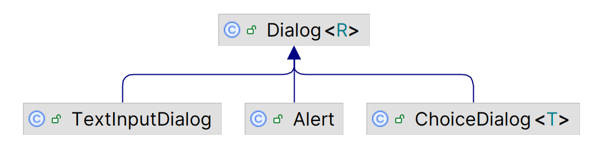
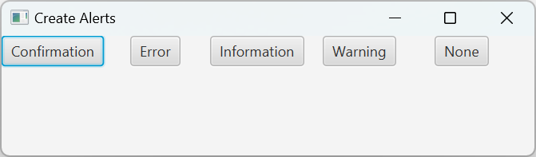
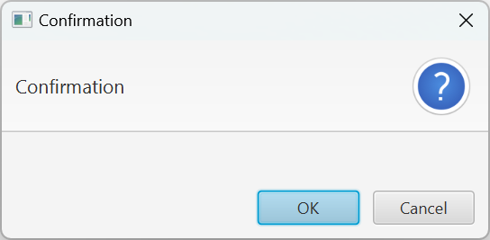
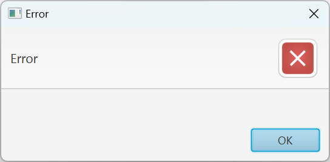
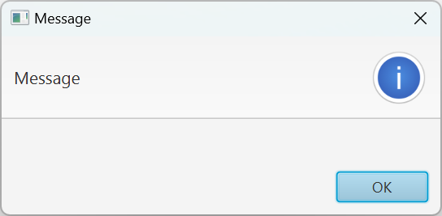
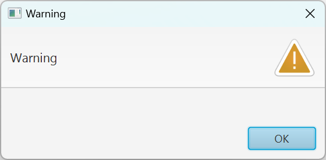
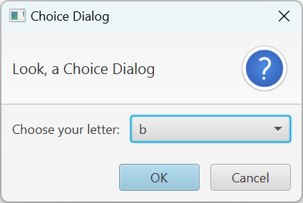
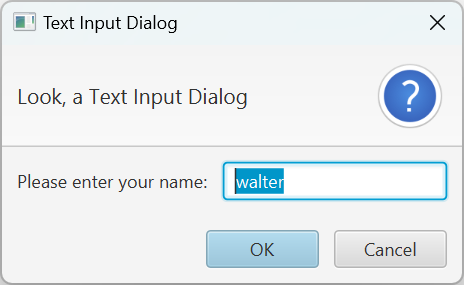

# JavaFX 对话框

2025-06-04⭐
@author Jiawei Mao

***
## 简介

JavaFX 提供了一套用户向用户发出警报、查询和通知的 dialog api。

- `Alert`：使用方便的预定义 dialog，主要用于发出警告信息
- `TextInputDialog`：提示用户输入文本
-  `ChoiceDialog`：提示用户从选项列表选择
- `Dialog` 和 `DialogPane`：自定义 dialog

类图如下：



dialog 涉及两个术语：模态（modal）和阻塞（blocking）

- 当**模态（modal）**对话框在另一个窗口上面显示，会阻止用户点击对话框下面的窗口，直到用户关闭对话框
- **阻塞对话框**（blocking）会导致代码在显示对话框的那一行代码停止执行。对话框关闭后，代码从停止的地方继续执行。阻塞对话框可以看作一种同步对话框，使用起来简单，开发者可以从对话框获取值后继续执行，而无需依赖 listener 或 callback

在 JavaFX 中，**所有对话框默认都是模态的**，不过可以使用 `initModality(Modality)` 将其设置为非模态。

阻塞对话框可以设置：

- `showAndWait()` 显示阻塞对话框，大多情况的推荐选择
- `show()` 显示非阻塞对话框。

## Alert

`Alert` 是 `Dialog` 的子类，提供许多预置对话框类型，包含不同的 icons 和默认按钮。对大多数应用场景推荐使用`Alert`，而不是直接使用 `Dialog`。

enum 类 `AlertType` 用于指定弹窗的类型，对应不同按钮和 icons，包括：

- `NONE`，无任何预设信息，除非需要自定义实现，否则避免使用
- `INFORMATION`，用于信息提示，包含一个 'information' 图像、标题以及 OK 按钮，点击按钮窗口关闭
- `WARNING`，用于警告，弹窗包含一个 'warning'图像、标题以及OK按钮；
- `CONFIRMATION`，用于确认，显示蓝色问号以及 "Cancel", "OK" 按钮
- `ERROR`，错误提示，显示一个 "X" image 和一个 "OK" 按钮

### 创建 Alert

创建 `Alert`，需要指定 `AlertType`。`Alert` 根据 `AlertType` 设置合适的 title, header, graphic 以及 button 类型。创建方式：

```java
Alert alert = new Alert(AlertType.CONFIRMATION, "Are you sure you want to format your system?");
```

创建后肯定要显示，`Alert` 通常为 modal & blocking。Alert 默认为 modal，修改方法：

```java
Dialog.initModality(javafx.stage.Modality);
```

是否 blocking，则从选择的显示方式决定：

```java
Dialog.showAndWait();
```

或：

```java
Dialog.show();
```

### Alert 的使用方式

下面是使用 `Alert` 的三种代码风格，效果是等价的。

1. 传统方法

```java
Optional<ButtonType> result = alert.showAndWait();
 if (result.isPresent() && result.get() == ButtonType.OK) {
     formatSystem();
 }
```

2. 传统+Optional 方法

```java
alert.showAndWait().ifPresent(response -> {
     if (response == ButtonType.OK) {
         formatSystem();
     }
 });
```

3. lambda 方法

```java
alert.showAndWait()
      .filter(response -> response == ButtonType.OK)
      .ifPresent(response -> formatSystem());
```

三种方法无有优劣，看个人习惯。

示例：

```java
import javafx.application.Application;
import javafx.scene.Scene;
import javafx.scene.control.Alert;
import javafx.scene.control.Button;
import javafx.scene.layout.TilePane;
import javafx.stage.Stage;

public class AlertDemo extends Application {
    @Override
    public void start(Stage stage) throws Exception {
        stage.setTitle("Create Alerts");

        Button b1 = new Button("Confirmation");
        Button b2 = new Button("Error");
        Button b3 = new Button("Information");
        Button b4 = new Button("Warning");
        Button b5 = new Button("None");

        TilePane r = new TilePane();

        b1.setOnAction(event -> {
            Alert alert = new Alert(Alert.AlertType.CONFIRMATION);
            alert.showAndWait();
        });
        b2.setOnAction(event -> {
            Alert alert = new Alert(Alert.AlertType.ERROR);
            alert.showAndWait();
        });
        b3.setOnAction(event -> {
            Alert alert = new Alert(Alert.AlertType.INFORMATION);
            alert.showAndWait();
        });
        b4.setOnAction(event -> {
            Alert alert = new Alert(Alert.AlertType.WARNING);
            alert.showAndWait();
        });
        b5.setOnAction(event -> {
            Alert alert = new Alert(Alert.AlertType.NONE);
            alert.showAndWait();
        });

        r.getChildren().addAll(b1, b2, b3, b4, b5);

        Scene scene = new Scene(r, 200, 200);
        stage.setScene(scene);
        stage.show();
    }

    public static void main(String[] args) {
        launch(args);
    }
}
```



点击不同按钮，显示对应的 `AlertType`。









点击 `None` 按钮显示的对话框中没有任何内容，也无法操作。

其它类型的 `Alert` 具有不同的默认设置。可以使用对应方法进行设置：

- `Dialog.setContentText` 设置 content-text
- 

## ChoiceDialog

`ChoiceDialog` 用于向用户显示选项列表的对话框。用户最多可以从中选择一项。换言之，`ChoiceBox` 使用诸如 `ChoiceBox`, `ComboBox` 之类的控件让用户进行选择。随后，将选项返回给开发人员。

创建：

```java
List<String> colors = List.of("Red", "Yellow", "Green");
ChoiceDialog choiceDialog = new ChoiceDialog<>("Yellow", colors);
choiceDialog.showAndWait();
```

示例：

```java
public class Dialogs extends Application {
    @Override
    public void start(Stage stage) throws Exception {
        List<String> choices = new ArrayList<>();
        choices.add("a");
        choices.add("b");
        choices.add("c");

        ChoiceDialog<String> dialog = new ChoiceDialog<>("b", choices);
        dialog.setTitle("Choice Dialog");
        dialog.setHeaderText("Look, a Choice Dialog");
        dialog.setContentText("Choose your letter:");

        Optional<String> result = dialog.showAndWait();
        if (result.isPresent()) {
            System.out.println("Your choice: " + result.get());
        }
    }

    public static void main(String[] args) {
        launch(args);
    }
}
```



## TextInputDialog

`TextInputDialog` 让用户输入一行文本，其重要方法为：`getEditor()`，返回 dialog 显示的 `TextField`。

**示例**：创建一个 modal blocking dialog，当用户点击 OK 按钮，用户输入打印到 console

```java
TextInputDialog dialog = new TextInputDialog ("Please enter your name");
dialog.showAndWait()
    .ifPresent(result -> log("Result is " + result));
```

示例：

```java
public class Dialogs extends Application {
    @Override
    public void start(Stage stage) throws Exception {
        TextInputDialog dialog = new TextInputDialog("walter");
        dialog.setTitle("Text Input Dialog");
        dialog.setHeaderText("Look, a Text Input Dialog");
        dialog.setContentText("Please enter your name:");

        Optional<String> result = dialog.showAndWait();
        if (result.isPresent()) {
            System.out.println("Your name: " + result.get());
        }
    }

    public static void main(String[] args) {
        launch(args);
    }
}
```



## DialogPane

`DialogPane` 为 `Dialog` 显示的 root-node，负责 `headers`, `graphics`, `content`, `buttons` 的 layout。`DialogPane` 的默认实现（即 `DialogPane` 类本身）通过常规的 `layoutChildren()` 处理布局。如果希望以其它方式处理布局，则可以覆盖 `layoutChildren()` 方法。

 除了 `header` 和 `content` 属性，还有 `headerText` 和 `contentText` 属性。`*Text` 属性的优先级低于 `Node` 属性，但是对开发人员来说更方便，因为大多时候开发人员只想在 `DialogPane` 的 header 或 content 区域设置字符串。

理解 `header` 和 `headerText` 属性设置非常重要：

1. `header` 属性优先级高于 `headerText` 属性，因此如果两者都设置为非 `null` 值，则使用 `header` 属性，忽略 `headerText` 属性
2. 如果将 `headerText` 设置为非 `null` 值，同时设置 `graphic`，则 graphic 从默认位置（content-area 左侧）移到 header-text 右侧
3. 如果将 `header` 设置为非 `null` 值，同时设置 `graphic`，那么 graphics 从默认位置（content-area 左侧）移出，如果需要 `graphic`，则需要手动将其添加到自定义 `header` node 中

`DialogPane` 基于 `ButtonType` 进行操作。`ButtonType` 是单个 button 的描述符，在 `DialogPane` 中以可视化的方式进行呈现。因此，创建 `DialogPane` 时必须指定要显示的 button-types，这可以通过 `getButtonTypes()` 方法完成，该方法返回一个 modifiable `ObservableList`，用户可以根据需要添加和删除该 list。

`ButtonType` 类定义了许多预定义的 button-types，如 `ButtonType.OK` 和 `ButtonType.CANCEL`，这些预定义 button-types 能够满足大多数需求，并且其中文本可以翻译为 JavaFX 支持的所有语言。如果想自定义 `ButtonType`（大多时候是自定义文本），可以通过 `ButtonType` 的构造函数实现。

`ButtonType` 类提供的设置选项非常有限。这是有意为之，但开发者依然可以修改由 `ButtonType` 创建的按钮。为此，开发者只需调用 `lookupButton(ButtonType)` 传入 `ButtonType` (假设该 `ButtonType` 已在 `getButtonTypes` list 中)。返回的 `Node` 通常为 `Button` 类型，具体取决于是否覆盖 `createButton(ButtonType)` 方法。

`DialogPane` 类提供了一些可以被子类覆盖的方法。包括：

- `createButton(ButtonType)`
- `createDetailsButton()`
- `createButtonBar()`

这些方法都有详细的文档信息。

## Dialog

`Dialog` 是 JavaFX 提供的最灵活的对话框选择，支持完整的自定义。如用户名、密码弹窗，表单等。

实例化 `Dialog` 时可以指定泛型 `R`，代表 `result` 属性的类型，即 dialog 关闭时返回的类型。

由于 `Dialog` 类不知道它显示的内容，因此也不知道如何将用户输入值转换为 `R` 类型，所以需要开发人员设置 `resultConverter` 属性。当 `R` 类型不是 `Void` 或 `ButtonType`，就需要设置该属性，否则会抛出 `ClassCastException`。

`Dialog` 属性：

| 属性              | 类型                                      | 说明                           |
| ----------------- | ----------------------------------------- | ------------------------------ |
| `contentText`     | `StringProperty`                          | 显示的主要文本                 |
| `dialogPane`      | `ObjectProperty<DialogPane>`              | `Dialog` 的 root-node          |
| `graphic`         | `ObjectProperty<Node>`                    | 显示的 `graphic`               |
| `headerText`      | `StringProperty`                          | 标题区域显示的文本             |
| `result`          | `ObjectProperty<R>`                       | dialog 关闭时返回的值          |
| `resultConverter` | `ObjectProperty<Callback<ButtonType, R>>` | 将用户点击按钮转换为结果的函数 |
| `title`           | `StringProperty`                          | dialog 标题                    |

`Dialog` 的 layout 由 `DialogPane` 处理。实际上，`Dialog` 的许多属性都用于设置 `DialogPane`。

示例：

```java
```

