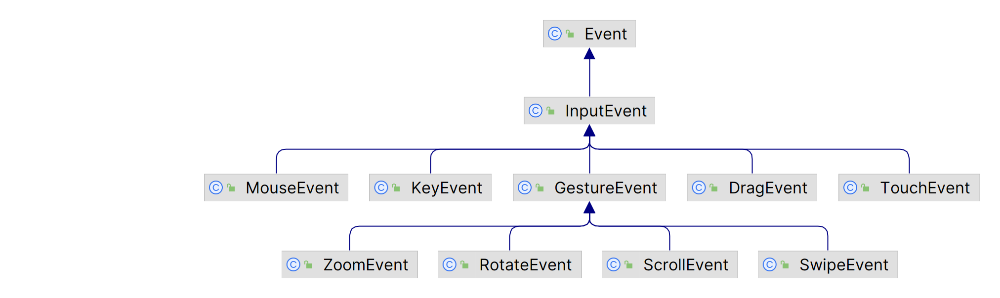

# 输入事件

2023-06-26, 08:48
****

输入事件表示用户输入操作产生的事件，如点击鼠标、按下按键、触摸触屏等。JavaFX 支持多种类型的输入事件，如下所示：

所有输入相关的事件类在 `javafx.scene.input` 包中。`InputEvent` 是所有输入事件类的基类。

节点通常先执行用户注册的输入事件处理器，如果用户事件处理器消耗了事件，节点不再执行默认操作。

例如，为 `TextField` 注册一个 key-typed 事件处理器消耗事件；当输入一个字符，`TextField` 不再添加并显示该字符。因此，消耗节点的输入事件可以禁用节点的某些默认行为。
