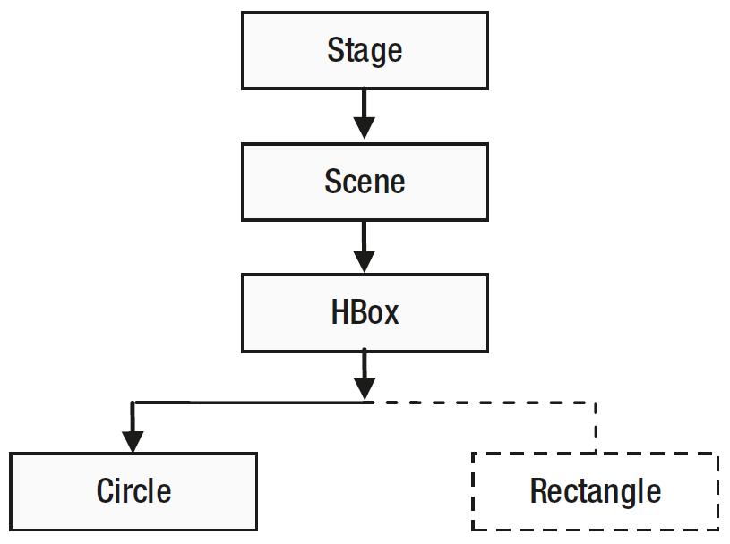

# JavaFX 事件处理

2025-05-23⭐
@author Jiawei Mao

***
## 概述

### 什么是事件

事件（event）通知有感兴趣的事情发生，在 GUI 应用程序中，用户与应用程序交互的操作产生事件，如点击鼠标、敲击键盘等都是 JavaFX 事件。一般来说，事件系统至少包含 3 个职责：

- 触发（`fire`）事件
- 通知 `listeners`
- 处理 `handle` 事件

其中**事件通知机制**由 JavaFX 平台自动完成。因此，我们只需要考虑如何触发、监听和处理事件。

JavaFX 事件由 `javafx.event.Event` 类表示。每个事件至少包含三个属性：

- 事件源（Event Source）
- 事件目标（Event Target）
- 事件类型（Event Type）

当事件发生时，一般要执行一段代码，响应事件执行的这一段代码称为**事件处理器**（event-handler）或**事件过滤器**（event-filter）。

调用 `EventHandler` 的 UI 元素称为**事件源**，事件沿着事件分发链传递，随着事件的传递，事件源也随之改变。

**事件目标**是事件的目的地。事件目标决定了事件处理的路径。假设点击一个 `Circle` 节点，此时，`Circle` 节点是鼠标点击事件的事件目标。

**事件类型**以以分层的方式定义，描述事件发生的类型。

事件的三个属性均由单独的类表示。

| 名称         | 类/接口 | 说明                                   |
| ------------ | ------- | -------------------------------------- |
| `Event`        | 类      | 表示事件，Event 的不同子类代表不同事件 |
| `EventTarget`  | 接口    | 事件目标                               |
| `EventType`    | 类      | 事件类型                               |
| `EventHandler` | 接口    | 事件处理程序                           |

### Event 类图

事件类图：


`Event` 的子类表示特定的事件类型。例如：

- `InputEvent` 表示用户输入事件
- `WindowEvent` 表示窗口事件，如显示和隐藏窗口
- `ActionEvent` 表示执行某种操作的事件

`Event` 类定义了所有事件共有属性和方法：

- `getSource()` 返回 `Object`，为事件源
- `getTarget()` 返回 `EventTarget`，为事件目标
- `getEventType()` 返回 `EventType`，为事件类型

事件沿着事件分发链传递，调用 `consume()` 表示事件已被处理，不需要继续传递；如果已调用 `Event.consume()`，`Event.isConsumed()` 返回 `true`。

`Event` 的子类根据需要定义了更多属性和方法。如 `MouseEvent` 类定义了 `getX()` 和 `getY()` 方法，返回鼠标指针相对事件源的 x 和 y 坐标。

### Event Target

Event Target 是可以响应事件的 UI 元素。从技术上讲，需要响应事件的 UI 元素必须实现 `EventTarget` 接口。所以在 JavaFX 中，实现 `EventTarget` 接口可以使 UI 元素成为 Event Target。

`Window`, `Scene` 和 `Node` 类实现了 `EventTarget` 接口。这意味着所有 nodes，包括 windows 和 scenes 都可以响应事件。有些 UI 元素，如 `Tab`, `TreeItem` 和 `MenuItem` 没有继承 `Node`，它们仍然可以响应事件，因为它们实现了 `EventTarget` 接口。如果你自定义了一个 UI 元素，想让它响应事件，就需要实现这个接口。

Event Target 负责构建**事件分发器链**（chain of event dispatchers），也称为**事件路径**（event route）。事件分发器实现了 `EventDispatcher` 接口，`buildEventDispatchChain` 方法负责构建事件分发器链。链中的每个 dispatcher 都可以处理和 consume 事件，包括修改事件属性，用新事件替代原事件，或者将事件分发器连接起来。

通常来说，一个事件路径包含 container-child 树形结构中所有 UI 元素相关的 dispatcher。假设 Stage 的 Scene 中包含一个 HBox，其中有一个 Circle，鼠标点击 Circle，Circle 成为 event target。Circle 构建事件分发器链，其路径从头到尾依次为 Stage, Scene, HBox 和 Circle。

### Event Type

`EventType` 类定义事件类型。`EventType` 提供了对事件更细致的划分，例如，`MouseEvent` 只告诉我们用户使用了鼠标，但是不知道使用鼠标的细节，如鼠标左键是被按下、释放还是拖动。

`EventType` 是泛型类，其 type 参数定义为：

```java
EventType<T extends Event>
```

`EventType` 也是分层组织。每个事件类型都有一个名称和一个超类型：

- `getName()` 返回事件类型名称
- `getSuperType()` 返回事件的超类型

常量 `Event.ANY`，等价于 `EventType.ROOT`，是 JavaFX 中所有事件的超类型。

下图是某些事件类中定义的一些事件类型：


> [!NOTE]
>
> 图中表示的是事件类型，而非类的继承关系。`Event.ANY`, `InputEvent.Any` 都是 `EventType` 类型。

### Event 示例

- 自定义 event

```java
public class UserEvent extends Event {

    public static final EventType<UserEvent> ANY = new EventType<>(Event.ANY, "ANY");

    public static final EventType<UserEvent> LOGIN_SUCCEEDED = 
                                        new EventType<>(ANY, "LOGIN_SUCCEEDED");

    public static final EventType<UserEvent> LOGIN_FAILED = 
                                        new EventType<>(ANY, "LOGIN_FAILED");

    public UserEvent(EventType<? extends Event> eventType) {
        super(eventType);
    }

    // any other fields of importance, e.g. data, timestamp
}
```

事件类型一般是固定的，通常与事件在同一个源文件中定义。可以看到，这里定义了两种事件类型：`LOGIN_SUCCEEDED` 和 `LOGIN_FAILED`。

- 可以监听这些特定类型 `UserEvent` 事件

```java
Node node = ...
node.addEventHandler(UserEvent.LOGIN_SUCCEEDED, event -> {
    // handle event
});
```

- 也可以处理任何任何 `UserEvent` 

```java
Node node = ...
node.addEventHandler(UserEvent.ANY, event -> {
    // handle event
});
```

最后，我们可以构建并触发自己的事件：

```java
UserEvent event = new UserEvent(UserEvent.LOGIN_SUCCEEDED);
Node node = ...
node.fireEvent(event);
```

例如，当用户尝试登录应用时，可以触发 `LOGIN_SUCCEEDED` 或 `LOGIN_FAILED`。

## 事件处理机制

事件发生时，将执行以下几个步骤：

1. 选择事件 target
2. 构建事件路径
3. 遍历事件路径

### 选择 event-target

事件 target 根据事件类型选择：

- 对鼠标事件, target 是光标下的节点。光标下可能有多个节点，如将一个 circle 放在 rectangle 中，此时最上面的节点为事件 target。
- 对键盘事件, target 是持有焦点的节点。获取焦点的方式取决于节点类型。例如，`TextField` 可以通过鼠标点击或快捷键 Tab 或 Shift+Tab 获取焦点。

`Circle` 或 `Rectangle` 等 `Shape` 默认不会获得焦点。如果需要让它们接收键盘事件，可以调用 `Node.requestFocus()` 方法获取焦点。

JavaFX 支持触控设备上的触摸和手势事件。

触摸事件通过触摸触屏产生。每个触摸动作都有一个接触点，称为**触点**（touch point）。可以用多个手指接触触摸屏，产生多个触点。触点的每个状态，如按下、释放等，都会生成一个触摸事件，所以一个触摸动作可以产生多个触摸事件。例如，如果触摸事件的位置是圆内的一个点，那么圆就成为触摸事件的 target。当触点有多个节点时，target 为最上面的节点。

JavaFX 支持手势。通常，触屏上的一个手势由多个触点的多个触摸动作组成，如旋转、滚动、滑动和缩放：

- 旋转（rotating）手势通过旋转两个手指完成
- 滚动（scrolling）手势通过在触屏上拖动手指完成
- 滑动（swiping）手势通过在一个方向拖动触屏上一个或多个手指完成
- 缩放（zooming）手势通过拖动两个手指完成

手势的 target 选择取决于手势类型。对直接手势，如在触屏上执行的手势，选择手势开始处触点中心点最顶层节点作为 target；对间接手势，如在触摸板上执行的手势，选择鼠标光标最顶层节点作为 target。

### 3. 构建事件路径

事件在**事件分发链**（event diapatch chain）中通过事件分发器（event dispatcher）传递。事件分发链即**事件路径**（event route）。事件的初始路径和默认路径由事件 target 确定。默认的事件路径从 stage 开始，到事件 target 节点结束。

```ad-note
事件路径由与节点关联的事件分发器组成，为了便于解释和理解，这里直接将事件路径作为节点构成的路径进行解释。
```

下图是一个鼠标点击事件的事件路径。


鼠标点击 `Circle`，`Circle` 为事件 target，由 `Circle` 构建默认事件路径，该路径从 `Circle` 所在的 `Stage` 开始。需要注意的是，位于相同 `Scene` 中的 `Rectangle` 不在事件路径中。

事件路径包含头和尾。上例中，`Stage` 是头，`Circle` 是尾。随着事件处理的进行，事件路径可能发生变化。

### 4. 遍历事件路径

事件路径遍历包含两个阶段：

- 捕获阶段（capture）
- 冒泡阶段（bubbling）

所以要遍历两次事件路径，一次在捕获阶段，一次在冒泡阶段。可以为特定类型事件在特定节点注册事件过滤器（filter）和事件处理器（handler）：

- 事件过滤器（filter）在捕获阶段执行
- 事件处理器（handler）在冒泡阶段执行

当事件从一个节点递到另一个节点，事件源发生变化；但是事件 target 在遍历过程中保持不变。

在遍历事件路径过程中，节点可以在过滤器或处理器中消耗（consume）事件，从而完成事件处理。在 event 对象上调用 `consume()` 方法消耗事件。事件被消耗后，事件处理停止，忽略事件路径上还未遍历的节点。

#### 4.1. 事件捕获阶段

在捕获阶段，从头到尾遍历事件路径。



如图所示，鼠标点击 `Circle`，捕获阶段从 `Stage` 到 `Circle` 进行遍历（箭头方向）。

当事件通过节点时，执行节点上注册的过滤器。上图中，依次执行 `Stage`, `Scene`, `HBox` 和 `Circle` 上注册的过滤器 (假设这些过滤器没有消耗事件)。

```ad-note
事件捕获阶段只执行事件**过滤器**，不执行事件**处理器**。
```

一个节点可以注册多个过滤器，当其中一个过滤器消耗掉事件，该节点余下未执行的过滤器会继续执行。例如，假设上面的 `Scene` 注册了 5 个过滤器，第一个过滤器执行并消耗掉事件，此时，`Scene` 余下的 4 个过滤器继续执行。执行完 `Scene` 的 5 个过滤器后，事件处理停止，不会传递到余下的节点。

#### 4.2. 事件冒泡阶段

在冒泡阶段，从尾到头遍历事件路径。


在事件冒泡阶段，执行注册的事件处理器（handler）。

一个节点可以注册多个处理。当其中一个处理器消耗掉事件，该节点余下未执行的处理器会继续执行。例如，假设上面的 `Circle` 注册了 5 个处理器，第一个处理器执行并消耗掉事件，`Circle` 余下的 4 个处理器继续执行。执行完 `Circle` 的 5 个处理器后，事件处理停止，不会传递到余下的节点 (`HBox`, `Scene`, `Stage`)。

通常将处理器注册到 target 节点以提供对特定事件的响应。偶尔也会在父节点上注册处理器，为其所有子节点提供默认的事件响应。如果 target 决定为某个事件提供特定响应，它可以添加处理器并 消耗事件来实现，从而在终止事件向事件路径的头部传播。

例如，假设需要实现鼠标点击窗口中任何位置显示一个消息框，可以向 `Window` 注册一个处理器来显示消息框。当用户点击窗口内的一个 `Circle` 时，希望显示一条特定的消息，可以为 `Circle` 注册一个处理器，以提供特定消息并消耗事件。这样，注册在 `Window` 上的处理器提供了默认响应，注册在 `Circle` 上的处理器提供了特定响应。

## 处理事件

处理事件，表示执行应用逻辑来响应事件的发生。应用逻辑包含在事件过滤器和事件处理器中，时 `EventHandler` 接口类型：

```java
public interface EventHandler<T extends Event> extends EventListener
    void handle(T event);
}
```

`EventHandler` 为泛型接口，位于 `javafx.event` 包中，扩展 `EventListener` 接口。其中 `handle()` 方法接受 `Event` 参数。

事件过滤器和事件处理器都是使用 `EventHanler` 接口。查看 `EventHandler` 实现类无法判断是过滤器还是处理器。实际上，一个 `EventHandler` 对象可以同为作为过滤器和处理器。过滤器和处理器的差别在于它们何时注册到节点：

- 在事件捕获阶段，执行过滤器的 `handle()` 方法
- 在事件冒泡节点，执行处理器的 `handle()` 方法

```ad-tip
处理事件：实现 `EventHandler` 接口，在 `handle()` 方法中编写应用程序逻辑，并将其注册为节点的过滤器或/和处理器。
```

### 2. 创建过滤器和处理器

创建事件过滤器或处理器，实现 `EventHandler` 接口即可。

对简单的事件处理逻辑，使用 lambda 表达式最佳：

```java
EventHandler<MouseEvent> aHandler = e -> /* Event handling code goes here */;
```

例如，创建一个 `MouseEvent` 处理器，打印鼠标事件类型：

```java
EventHandler<MouseEvent> mouseEventHandler =
        e -> System.out.println("Mouse event type: " + e.getEventType());
```

### 3. 注册过滤器和处理器

如果节点要处理特定类型的事件，需要为其注册事件过滤器和处理器:

- 当事件发生时，节点注册的过滤器和处理器的 `handle()` 方法会按照上一节介绍的规则被调用
- 当对该事件不再感兴趣，需要从该节点注销事件过滤器和处理器

JavaFX 提供了两种注册和注销事件处理器和过滤器的方法：

- `addEventFilter()`, `addEventHandler()` 和 `removeEventFilter()`,
`removeEventHandler()`
- `onXXX` 系列便捷属性

#### 3.1. addXXX 和 removeXXX 方法

`Node`、`Scene` 和 `Window` 类中定义了 `addEventFilter()` 和 `addEventHandler()` 方法用于注册事件过滤器和处理器：

```java
<T extends Event> void addEventFilter(EventType<T> eventType,         
                EventHandler<? super T> eventFilter)
<T extends Event> void addEventHandler(EventType<T> eventType,
                EventHandler<? super T> eventHandler)
```

有些类，如 `MenuItem` 和 `TreeItem` 可以作为事件 target，然而它们不是 `Node` 子类，不支持过滤器。

例如，处理 `Circle` 的鼠标单击事件：

```java
import javafx.scene.shape.Circle;
import javafx.event.EventHandler;
import javafx.scene.input.MouseEvent;

...
Circle circle = new Circle (100, 100, 50);
// 创建 MouseEvent 过滤器
EventHandler<MouseEvent> mouseEventFilter =
        e -> System.out.println("Mouse event filter has been called.");
// 创建 MouseEvent 处理器
EventHandler<MouseEvent> mouseEventHandler =
        e -> System.out.println("Mouse event handler has been called.");
// 为 Circle 的鼠标单击事件注册过滤器和处理器
circle.addEventFilter(MouseEvent.MOUSE_CLICKED, mouseEventFilter);
circle.addEventHandler(MouseEvent.MOUSE_CLICKED, mouseEventHandler);
```

上面创建了两个 `EventHandler` 对象，均在控制台打印一条消息。最后两句将一个 `EventHandler` 注册为事件过滤器，另一个注册为事件处理器。

允许将一个 `EventHandler` 对象同时注册为过滤器和处理器。例如：

```java
// 创建 MouseEvent EventHandler 对象
EventHandler<MouseEvent> handler = e ->
        System.out.println("Mouse event filter or handler has been called.");
// 将其注册为 Circle 的鼠标单击事件的过滤器和处理器
circle.addEventFilter(MouseEvent.MOUSE_CLICKED, handler);
circle.addEventHandler(MouseEvent.MOUSE_CLICKED, handler);
```

```ad-tip
多次调用 `addEventFilter()` 和 `addEventHandler()` 可以为一个节点添加多个过滤器和处理器。
```

- 演示 `Circle` 的鼠标单击事件处理的完整程序

点击 `Circle`，事件过滤器和处理器依次被调用。在 `Circle` 外点击鼠标，鼠标点击事件依然发生，但是看不到任何输出，因为没有为 `HBox`, `Scene` 和 `Stage` 注册事件过滤器或处理器。

```java
import javafx.application.Application;
import javafx.event.EventHandler;
import javafx.scene.Scene;
import javafx.scene.input.MouseEvent;
import javafx.scene.layout.HBox;
import javafx.scene.paint.Color;
import javafx.scene.shape.Circle;
import javafx.stage.Stage;

public class EventRegistration extends Application {

    public static void main(String[] args) {
        Application.launch(args);
    }

    @Override
    public void start(Stage stage) {
        Circle circle = new Circle(100, 100, 50);
        circle.setFill(Color.CORAL);

        // 创建 MouseEvent 过滤器
        EventHandler<MouseEvent> mouseEventFilter =
                e -> System.out.println("Mouse event filter has been called.");

        // 创建 MouseEvent 处理器
        EventHandler<MouseEvent> mouseEventHandler =
                e -> System.out.println("Mouse event handler has been called.");

        // 为 Circle 的鼠标单击事件注册 MouseEvent 过滤器和处理器
        circle.addEventFilter(MouseEvent.MOUSE_CLICKED, mouseEventFilter);
        circle.addEventHandler(MouseEvent.MOUSE_CLICKED, mouseEventHandler);

        HBox root = new HBox();
        root.getChildren().add(circle);
        Scene scene = new Scene(root);
        stage.setScene(scene);
        stage.setTitle("Registering Event Filters and Handlers");
        stage.show();
        stage.sizeToScene();
    }
}
```

点击 `Circle`，输出：

```
Mouse event filter has been called.
Mouse event handler has been called.
```

- 从 `Circle` 移除事件过滤器

```java
// 创建 MouseEvent EventHandler 对象
EventHandler<MouseEvent> handler = e ->
        System.out.println("Mouse event filter or handler has been called.");
// 为 Circle 的鼠标单击事件注册相同的 EventHandler 对象为过滤器和处理器
circle.addEventFilter(MouseEvent.MOUSE_CLICKED, handler);
circle.addEventHandler(MouseEvent.MOUSE_CLICKED, handler);
...
// 注销过滤器和处理器
circle.removeEventFilter(MouseEvent.MOUSE_CLICKED, handler);
circle.removeEventHandler(MouseEvent.MOUSE_CLICKED, handler);
```

注销 `EventHandler` 后，在事件发生时不再调用其 `handle()` 方法。

#### 3.2. onXXX 便捷属性

`Node`, `Scene` 和 `Window` 类包含一些事件属性，用于存储某些事件类型的事件处理程序。

这些属性统一采用 `onXXX` 命名格式。例如，`onMouseClicked` 属性保存鼠标点击类型事件的事件处理程序；`onKeyTyped` 属性保存按键类型事件的事件处理程序。

使用这些属性的 `setOnXXX()` 方法为节点注册事件处理程序。例如，`setOnMouseClicked()` 为鼠标单击事件注册事件处理程序；`setOnKeyTyped()` 为按键事件注册事件处理程序。各种类中的 `setOnXXX()` 为注册事件处理器的便捷方法。

`onXXX` 便捷属性使用要点：

- 只支持注册事件处理器，不支持事件过滤器，注册事件过滤器使用 `addEventFilter()`
- 只支持注册一个事件处理器，要注册多个处理器，使用 `addEventHandler()`
- 只有一些常用的事件类型的属性，例如，`Node` 和 `Scene` 中有 `onMouseClicked` 属性，`Window` 中没有；`Window` 类有 `onShowing` 属性，`Node` 和 `Scene` 类没有

下例和上例相同。只是将 `addEventHandler` 替换为 `onMouseClicked`：

```java
import javafx.application.Application;
import javafx.event.EventHandler;
import javafx.scene.Scene;
import javafx.scene.input.MouseEvent;
import javafx.scene.layout.HBox;
import javafx.scene.paint.Color;
import javafx.scene.shape.Circle;
import javafx.stage.Stage;

public class EventHandlerProperties extends Application {

    public static void main(String[] args) {
        Application.launch(args);
    }

    @Override
    public void start(Stage stage) {
        Circle circle = new Circle(100, 100, 50);
        circle.setFill(Color.CORAL);

        HBox root = new HBox();
        root.getChildren().add(circle);
        Scene scene = new Scene(root);
        stage.setScene(scene);
        stage.setTitle("Using convenience event handler properties");
        stage.show();
        stage.sizeToScene();

        // 创建 MouseEvent 过滤器
        EventHandler<MouseEvent> eventFilter =
                e -> System.out.println("Mouse event filter has been called.");

        // 创建 MouseEvent 处理器
        EventHandler<MouseEvent> eventHandler =
                e -> System.out.println("Mouse event handler has been called.");

        // 使用 addEventFilter() 注册过滤器
        circle.addEventFilter(MouseEvent.MOUSE_CLICKED, eventFilter);

        // 使用 onMouseCicked 属性注册处理器
        circle.setOnMouseClicked(eventHandler);
    }
}
```

便捷事件属性没有提供单独**注销事件处理器**的方法。将该属性设置为 `null` 可以注销已经注册的事件处理器：

```java
// 注册处理器
circle.setOnMouseClicked(eventHandler);
...
// 注销处理器
circle.setOnMouseClicked(null);
```

定义 `onXXX` 事件属性的类还定义了 `getOnXXX()` 方法返回注册的处理器。如果没有注册任何处理器，返回 `null`。

## 事件过滤器和处理器的执行顺序

事件过滤器和处理器的执行顺序：

- 过滤器在处理器之前执行。

过滤器按照从顶层的父级到事件 target 的从父到子的顺序执行；处理器按照从子到父相反的顺序执行。

- 对同一个节点，特定事件类型的过滤器和处理器在泛型类型之前执行。

例如，假设为一个节点注册了 `MouseEvent.ANY` 和 `MouseEvent.MOUSE_CLICKED` 处理器。两个事件类型的处理器都可以处理 `MOUSE_CLICKED` 事件。当在该节点上单击鼠标，先执行 `MouseEvent.MOUSE_CLICKED` 事件类型的处理器，再执行 `MouseEvent.ANY` 事件类型的处理器。注意，在 `MOUSE_CLICKED` 事件之前，先发生按下鼠标和释放鼠标事件，这些事件由 `MouseEvent.ANY` 事件类型的处理器处理。

- 一个节点上相同事件类型的多个过滤器或处理器的顺序不确定。

这个规则有个例外，使用 `addEventHandler()` 注册的处理器比使用 `setOnXXX()` 注册的处理器先执行。

### 2. 示例一

下面演示不同节点的事件过滤器和处理器的执行顺序。`Scene` 中的 `HBox` 包含一个 `Rectangle` 和一个 `Circle`。

```java
import javafx.application.Application;
import javafx.event.EventHandler;
import javafx.geometry.Insets;
import javafx.scene.Scene;
import javafx.scene.input.MouseEvent;
import javafx.scene.layout.HBox;
import javafx.scene.paint.Color;
import javafx.scene.shape.Circle;
import javafx.scene.shape.Rectangle;
import javafx.stage.Stage;

import static javafx.scene.input.MouseEvent.MOUSE_CLICKED;

public class CaptureBubblingOrder extends Application {

    public static void main(String[] args) {
        Application.launch(args);
    }

    @Override
    public void start(Stage stage) {
        Circle circle = new Circle(50, 50, 50);
        circle.setFill(Color.CORAL);

        Rectangle rect = new Rectangle(100, 100);
        rect.setFill(Color.TAN);

        HBox root = new HBox();
        root.setPadding(new Insets(20));
        root.setSpacing(20);
        root.getChildren().addAll(circle, rect);

        Scene scene = new Scene(root);

        // Create two EventHandlders
        EventHandler<MouseEvent> filter = e -> handleEvent("Capture", e);
        EventHandler<MouseEvent> handler = e -> handleEvent("Bubbling", e);

        // Register filters
        stage.addEventFilter(MOUSE_CLICKED, filter);
        scene.addEventFilter(MOUSE_CLICKED, filter);
        root.addEventFilter(MOUSE_CLICKED, filter);
        circle.addEventFilter(MOUSE_CLICKED, filter);

        // Register handlers
        stage.addEventHandler(MOUSE_CLICKED, handler);
        scene.addEventHandler(MOUSE_CLICKED, handler);
        root.addEventHandler(MOUSE_CLICKED, handler);
        circle.addEventHandler(MOUSE_CLICKED, handler);

        stage.setScene(scene);
        stage.setTitle("Event Capture and Bubbling Execution Order");
        stage.show();
    }

    public void handleEvent(String phase, MouseEvent e) {
        String type = e.getEventType().getName();
        String source = e.getSource().getClass().getSimpleName();
        String target = e.getTarget().getClass().getSimpleName();

        // Get coordinates of the mouse cursor relative to the event source
        double x = e.getX();
        double y = e.getY();

        System.out.println(phase + ": Type=" + type +
                ", Target=" + target + ", Source=" + source +
                ", location(" + x + ", " + y + ")");
    }
}
```

```
Capture: Type=MOUSE_CLICKED, Target=Circle, Source=Stage, location(83.33333333333333, 66.66666666666667)
Capture: Type=MOUSE_CLICKED, Target=Circle, Source=Scene, location(83.33333333333333, 66.66666666666667)
Capture: Type=MOUSE_CLICKED, Target=Circle, Source=HBox, location(83.33333333333333, 66.66666666666667)
Capture: Type=MOUSE_CLICKED, Target=Circle, Source=Circle, location(63.33333333333333, 46.66666666666667)
Bubbling: Type=MOUSE_CLICKED, Target=Circle, Source=Circle, location(63.33333333333333, 46.66666666666667)
Bubbling: Type=MOUSE_CLICKED, Target=Circle, Source=HBox, location(83.33333333333333, 66.66666666666667)
Bubbling: Type=MOUSE_CLICKED, Target=Circle, Source=Scene, location(83.33333333333333, 66.66666666666667)
Bubbling: Type=MOUSE_CLICKED, Target=Circle, Source=Stage, location(83.33333333333333, 66.66666666666667)

Capture: Type=MOUSE_CLICKED, Target=Rectangle, Source=Stage, location(205.33333333333334, 93.33333333333333)
Capture: Type=MOUSE_CLICKED, Target=Rectangle, Source=Scene, location(205.33333333333334, 93.33333333333333)
Capture: Type=MOUSE_CLICKED, Target=Rectangle, Source=HBox, location(205.33333333333334, 93.33333333333333)
Bubbling: Type=MOUSE_CLICKED, Target=Rectangle, Source=HBox, location(205.33333333333334, 93.33333333333333)
Bubbling: Type=MOUSE_CLICKED, Target=Rectangle, Source=Scene, location(205.33333333333334, 93.33333333333333)
Bubbling: Type=MOUSE_CLICKED, Target=Rectangle, Source=Stage, location(205.33333333333334, 93.33333333333333)
```

为 `Stage`, `Scene`, `HBox`, `Circle` 添加鼠标单击事件的过滤器和处理器。点击 `Circle`，输出过滤器和处理的执行顺序。输出包括：事件阶段、类型、target、事件源以及位置。

可以看到，当事件从一个节点传递到另一个节点，事件源随之变化。

位置是相对事件源的位置。每个节点都有自己的坐标系，所以鼠标单击一个点对不同节点的 (x,y) 值不同。

单击 `Rectangle` 可以看到与 `Circle` 相同的父路径。因为没有给 `Rectangle` 注册过滤器和处理器，所以看不到 `Rectangle` 的输出，但是事件发生后，依然按照捕获和冒泡两个顺序执行。

### 3. 示例二

下面演示一个节点多个处理器的执行顺序。为 `Circle` 注册三个处理器：

- 一个 `MouseEvent.ANY` 类型
- 一个使用 `addEventHandler()` 添加的 `MouseEvent.MOUSE_CLICKED` 类型
- 一个使用 `setOnMouseClicked()` 添加的 `MouseEvent.MOUSE_CLICKED` 类型

```java
import javafx.application.Application;
import javafx.scene.Scene;
import javafx.scene.input.MouseEvent;
import javafx.scene.layout.HBox;
import javafx.scene.paint.Color;
import javafx.scene.shape.Circle;
import javafx.stage.Stage;

public class HandlersOrder extends Application {

    public static void main(String[] args) {
        Application.launch(args);
    }

    @Override
    public void start(Stage stage) {
        Circle circle = new Circle(50, 50, 50);
        circle.setFill(Color.CORAL);

        HBox root = new HBox();
        root.getChildren().addAll(circle);
        Scene scene = new Scene(root);
        
        // 注册三个处理器
        // 这个最后执行
        circle.addEventHandler(MouseEvent.ANY, e -> handleAnyMouseEvent(e));

        // 这个最先执行
        circle.addEventHandler(MouseEvent.MOUSE_CLICKED,
                e -> handleMouseClicked("addEventHandler()", e));

        // 这个老二
        circle.setOnMouseClicked(e -> handleMouseClicked("setOnMouseClicked()", e));

        stage.setScene(scene);
        stage.setTitle("Execution Order of Event Handlers of a Node");
        stage.show();
    }

    public void handleMouseClicked(String registrationMethod, MouseEvent e) {
        System.out.println(registrationMethod
                + ": MOUSE_CLICKED handler detected a mouse click.");
    }

    public void handleAnyMouseEvent(MouseEvent e) {
        // 输出 mouse-clicked 事件信息，忽略其它鼠标事件，如 mouse-pressed, mouse-released
        if (e.getEventType() == MouseEvent.MOUSE_CLICKED) {
            System.out.println("MouseEvent.ANY handler detected a mouse click.");
        }
    }
}
```

```
addEventHandler(): MOUSE_CLICKED handler detected a mouse click.
setOnMouseClicked(): MOUSE_CLICKED handler detected a mouse click.
MouseEvent.ANY handler detected a mouse click.
```
## 消耗事件

通过调用 `Event` 的 `consume() `方法消耗事件。一般在事件过滤器和处理器的 `handle()` 方法中调用 `consume()`。

**消耗事件**表示事件处理完成，事件不再沿着事件路径继续传播。如果事件在节点的过滤器中消耗，之间不会传递到子节点；如果事件在节点的处理器中消耗，则事件不会传递到父节点。

不管节点的哪个过滤器或处理器消耗了事件，该节点所有的过滤器或处理器都会执行。假设你为节点注册了三个处理器，第一个处理器消耗了事件，该节点余下的两个处理器仍会执行。

如果父节点不希望其子节点响应事件，则可以在父节点的过滤器中消耗事件。如果父节点为特定事件提供了默认处理器，子节点可以提供特异性的响应并消耗事件，从而抑制父节点的默认响应。

### 2. 示例

演示如何消耗事件。

```java
import javafx.application.Application;
import javafx.event.EventHandler;
import javafx.geometry.Insets;
import javafx.scene.Scene;
import javafx.scene.control.CheckBox;
import javafx.scene.input.MouseEvent;
import javafx.scene.layout.HBox;
import javafx.scene.paint.Color;
import javafx.scene.shape.Circle;
import javafx.scene.shape.Rectangle;
import javafx.stage.Stage;

import static javafx.scene.input.MouseEvent.MOUSE_CLICKED;

public class ConsumingEvents extends Application {

    private CheckBox consumeEventCbx = new CheckBox("Consume Mouse Click at Circle");

    public static void main(String[] args) {
        Application.launch(args);
    }

    @Override
    public void start(Stage stage) {
        Circle circle = new Circle(50, 50, 50);
        circle.setFill(Color.CORAL);

        Rectangle rect = new Rectangle(100, 100);
        rect.setFill(Color.TAN);

        HBox root = new HBox();
        root.setPadding(new Insets(20));
        root.setSpacing(20);
        root.getChildren().addAll(circle, rect, consumeEventCbx);

        Scene scene = new Scene(root);

        // Register mouse-clicked event handlers to all nodes,
        // except the rectangle and checkbox
        EventHandler<MouseEvent> handler = e -> handleEvent(e);
        EventHandler<MouseEvent> circleMeHandler = e -> handleEventforCircle(e);

        stage.addEventHandler(MOUSE_CLICKED, handler);
        scene.addEventHandler(MOUSE_CLICKED, handler);
        root.addEventHandler(MOUSE_CLICKED, handler);
        circle.addEventHandler(MOUSE_CLICKED, circleMeHandler);

        stage.setScene(scene);
        stage.setTitle("Consuming Events");
        stage.show();
    }

    public void handleEvent(MouseEvent e) {
        print(e);
    }

    public void handleEventforCircle(MouseEvent e) {
        print(e);
        if (consumeEventCbx.isSelected()) {
            e.consume();
        }
    }

    public void print(MouseEvent e) {
        String type = e.getEventType().getName();
        String source = e.getSource().getClass().getSimpleName();
        String target = e.getTarget().getClass().getSimpleName();

        // Get coordinates of the mouse cursor relative to the event source
        double x = e.getX();
        double y = e.getY();

        System.out.println("Type=" + type + ", Target=" + target +
                ", Source=" + source +
                ", location(" + x + ", " + y + ")");
    }
}
```


说明：

- 添加 `Circle`, `Rectangle` 和 `CheckBox` 到 `HBox`，`HBox` 作为 `Scene` 的根节点。
- 为 `Stage`, `Scene`, `HBox` 和 `Circle` 添加事件处理器，其中 `Circle` 的处理器不同。
- 当勾选复选框，`Circle` 的事件处理器会消耗事件，从而阻止事件向上传播到 `HBox`, `Scene` 和 `Stage`
- 当不勾选复选框，事件按 `Circle` -> `HBox` -> `Scene` -> `Stage` 顺序传播

```
# 不勾选复选框，点击圆
Type=MOUSE_CLICKED, Target=Circle, Source=Circle, location(50.66666666666667, 48.66666666666667)
Type=MOUSE_CLICKED, Target=Circle, Source=HBox, location(70.66666666666667, 68.66666666666667)
Type=MOUSE_CLICKED, Target=Circle, Source=Scene, location(70.66666666666667, 68.66666666666667)
Type=MOUSE_CLICKED, Target=Circle, Source=Stage, location(70.66666666666667, 68.66666666666667)

# 勾选复选项，点击圆
Type=MOUSE_CLICKED, Target=Circle, Source=Circle, location(46.0, 38.666666666666664)

# 点击 Rectangle
Type=MOUSE_CLICKED, Target=Rectangle, Source=HBox, location(192.66666666666666, 61.333333333333336)
Type=MOUSE_CLICKED, Target=Rectangle, Source=Scene, location(192.66666666666666, 61.333333333333336)
Type=MOUSE_CLICKED, Target=Rectangle, Source=Stage, location(192.66666666666666, 61.333333333333336)
```

```ad-note
点击复选框不会执行 `HBox`, `Scene` 和 `Stage` 的点击鼠标事件，而点击 `Rectangle` 会。这是因为 `CheckBox` 有一个默认的事件处理器会消耗事件，从而组织事件沿着事件路径向上传播。而 `Rectangle` 不会消耗事件。
```

在事件 target 的过滤器中消耗事件对执行其它事件过滤器没有影响，但会阻止冒泡阶段的发生，即阻止所有事件处理器的执行。在顶层节点（事件路径的头部）的事件处理器中消耗事件，对整个事件处理过程毫无影响。

## 输入事件

输入事件表示用户输入操作产生的事件，如点击鼠标、按下按键、触摸触屏等。JavaFX 支持多种类型的输入事件，如下所示：


所有输入相关的事件类在 `javafx.scene.input` 包中。`InputEvent` 是所有输入事件类的基类。

节点通常先执行用户注册的输入事件处理器，如果用户事件处理器消耗了事件，节点不再执行默认操作。

例如，为 `TextField` 注册一个 key-typed 事件处理器消耗事件；当输入一个字符，`TextField` 不再添加并显示该字符。因此，消耗节点的输入事件可以禁用节点的某些默认行为。

## 鼠标事件

鼠标事件由 `MouseEvent` 类定义。`MouseEvent` 定义了下列鼠标相关的事件类型常量。所有常量的类型都是 `EventType<MouseEvent>`。

`Node` 类为大多数鼠标事件类型定义了 `onXXX` 属性，可为特定鼠标事件添加事件处理器。

| 鼠标事件类型  | 说明  |
| -------- | ------ |
| `ANY`                  | 所有鼠标事件类型的超类型。如果一个节点想接收所有类型的鼠标事件，则应为该类型注册处理器。`InputEvent.ANY` 是该事件类型的超类型  |
| `MOUSE_PRESSED`        | 按下鼠标按钮生成。`MouseEvent.getButton()` 返回按下的按钮。鼠标按钮由枚举类 `MouseButton` 定义：`NONE`, `PRIMARY`, `MIDDLE`, `SECONDARY`    |
| `MOUSE_RELEASED`       | 释放鼠标按钮生成。该事件会传递到鼠标被按下的节点。如在 `Circle` 内按下鼠标按钮，拖动到 `Circle` 外释放，产生的 `MOUSE_RELEASED` 事件会传递到 `Circle`，而不是鼠标按钮释放位置的节点 |
| `MOUSE_CLICKED`        | 单击鼠标按钮生成。需要在同一个节点上按下并释放按钮才会生成    |
| `MOUSE_MOVED`          | 移动鼠标（不按下任何鼠标按钮）生成       |
| `MOUSE_ENTERED`        | 鼠标进入节点时生成。该事件没有事件捕获和冒泡阶段，即不会调用目标节点父节点的过滤器和处理器    |
| `MOUSE_ENTERED_TARGET` | 鼠标进入节点时生成。与 `MOUSE_ENTERED` 的差别在于，该事件具有事件捕获和冒泡阶段  |
| `MOUSE_EXITED`         | 鼠标离开节点时生成。该事件没有事件捕获和冒泡阶段，即只传递给目标节点，不会调用目标节点父节点的过滤器和处理器  |
| `MOUSE_EXITED_TARGET`  | 鼠标离开节点时生成。与 `MOUSE_EXITED` 的差别在于，该事件具有事件捕获和冒泡阶段   |
| `DRAG_DETECTED`        | 在单个节点上按下并拖动鼠标超过一定距离生成，距离阈值为平台特异性    |
| `MOUSE_DRAGGED`        | 按下鼠标按钮并拖动鼠标生成，无论鼠标拖动到什么地方，事件都传递到按下鼠标按钮的节点  |

### 2. 鼠标位置

`MouseEvent` 包含鼠标事件发生时鼠标的位置信息。

| 方法                       | 说明                          |
| -------------------------- | ----------------------------- |
| `getX()`, `getY()`             | 鼠标相对事件源节点的坐标      |
| `getSceneX()`, `getSceneY()`   | 鼠标相对节点所在 `Scene` 的坐标 |
| `getScreenX()`, `getScreenY()` | 鼠标相对节点所在屏幕的坐标    |

**示例：** 使用 `MouseEvent` 的方法获取鼠标位置

为 `Stage` 添加 `MOUSE_CLICKED` 事件处理器。运行程序，点击 `Stage` 任意位置，控制台会输出事件源、事件目标和鼠标位置信息。

```java {.line-numbers}
import javafx.application.Application;
import javafx.geometry.Insets;
import javafx.scene.Scene;
import javafx.scene.input.MouseEvent;
import javafx.scene.layout.HBox;
import javafx.scene.paint.Color;
import javafx.scene.shape.Circle;
import javafx.scene.shape.Rectangle;
import javafx.stage.Stage;

public class MouseLocation extends Application {

    public static void main(String[] args) {
        Application.launch(args);
    }

    @Override
    public void start(Stage stage) {
        Circle circle = new Circle(50, 50, 50);
        circle.setFill(Color.CORAL);

        Rectangle rect = new Rectangle(100, 100);
        rect.setFill(Color.TAN);

        HBox root = new HBox();
        root.setPadding(new Insets(20));
        root.setSpacing(20);
        root.getChildren().addAll(circle, rect);

        // 为 stage 添加 MOUSE_CLICKED 处理器
        stage.addEventHandler(MouseEvent.MOUSE_CLICKED, e -> handleMouseMove(e));

        Scene scene = new Scene(root);
        stage.setScene(scene);
        stage.setTitle("Mouse Location");
        stage.show();
    }

    public void handleMouseMove(MouseEvent e) {
        String source = e.getSource().getClass().getSimpleName();
        String target = e.getTarget().getClass().getSimpleName();

        // 相对事件源的坐标
        double sourceX = e.getX();
        double sourceY = e.getY();

        // 相对 scene 的坐标
        double sceneX = e.getSceneX();
        double sceneY = e.getSceneY();

        // 相对屏幕的坐标
        double screenX = e.getScreenX();
        double screenY = e.getScreenY();

        System.out.println("Source=" + source + ", Target=" + target +
                ", Location:" +
                " source(" + sourceX + ", " + sourceY + ")" +
                ", scene(" + sceneX + ", " + sceneY + ")" +
                ", screen(" + screenX + ", " + screenY + ")");
    }
}
```

@import "images/2023-06-26-09-28-51.png" {width="250px" title=""}

分别点击 `Circle`, `Rectangle` 和空白位置的输出：

```
Source=Stage, Target=Circle, Location: source(63.333333333333336, 60.666666666666664), scene(63.333333333333336, 60.666666666666664), screen(1213.3333333333333, 495.3333333333333)
Source=Stage, Target=Rectangle, Location: source(194.0, 60.666666666666664), scene(194.0, 60.666666666666664), screen(1344.0, 495.3333333333333)
Source=Stage, Target=HBox, Location: source(105.33333333333333, 7.333333333333333), scene(105.33333333333333, 7.333333333333333), screen(1255.3333333333333, 442.0)
```

可以发现，由于事件注册在 `Stage` 上，所以事件源都是 `Stage`，因此 `getX() `和 `getSceneX()` 返回的坐标总是一样。

### 3. 鼠标按钮表示

`javafx.scene.input` 包中的 `MouseButton` 枚举类表示鼠标按钮：

| MouseButton | 功能                     |
| ----------- | ------------------------ |
| `NONE`        | 表示无按钮               |
| `PRIMARY`     | 鼠标主按钮，一般为左按钮 |
| `MIDDLE`      | 中间键                   |
| `SECONDARY`   | 鼠标副按钮，一般为右按钮 |

鼠标的主按钮和副按钮的位置，取决于鼠标配置。对惯用右手的用户，一般左按钮为主按钮、右按钮为副按钮。对左撇子用户则相反。

### 4. 鼠标按钮状态

`MouseEvent` 保存了鼠标事件发生时鼠标按钮的状态。`MouseEvent` 的下列方法可用来查询鼠标按钮状态：

| 方法                           | 功能                         |
| ------------------------------ | ---------------------------- |
| `MouseButton getButton()`        | 鼠标事件对应的按钮           |
| `int getClickCount()`            | 鼠标点击次数                 |
| `boolean isPrimaryButtonDown()`  | 鼠标主按钮按下               |
| `boolean isMiddleButtonDown()`   | 鼠标中间按钮按下             |
| `bolean isSecondaryButtonDown()` | 鼠标副按钮按下               |
| `boolean isPopupTrigger()`       | 鼠标事件为平台的弹出菜单触发 |
| `boolean isStillSincePress()`    | 鼠标保持在某个位置没变       |

`getButton()` 很多时候都返回 `MouseButton.NONE`。例如，触屏上通过手指而非鼠标触发的鼠标事件，或者 `MOUSE_MOVED` 这类不需要按下按钮的事件。

`getButton()` 与 `isPrimaryButtonDown()`、`isSecondaryButtonDown()` 的差别：

- `getButton()` 返回**触发事件的按钮**，但并非所有鼠标事件由按钮触发。如果鼠标事件与按钮无关，`getButton()` 返回 `MouseButton.NONE`。
- 发生 `MOUSE_PRESSED` 事件，如果按下了主按钮，`isPrimaryButtonDown()` 返回 true，不管主按钮与该事件是否有关。

例如，假设先按主按钮（不松开），再按副按钮时，又生成一个 `MOUSE_PRESSED` 事件，此时 `getButton()` 返回 `MouseButton.SECONDARY`，但 `isPrimaryButtonDown()` 和 `isSecondaryButtonDown()` 都返回 `true`。

**弹出式菜单**（pop-up），也称为上下文菜单（context）或快捷菜单（shortcut）。例如，在浏览器中单击鼠标右键，会弹出一个菜单。不同平台触发弹出式菜单的方式不同，在 Windows 平台快捷键通常为 `Shift+F10`。

如果鼠标事件触发弹出式菜单，`isPopupTrigger()` 返回 `true`。在该方法返回 `true` 时，通常让系统显示默认的弹出式菜单。

!!! tip
    JavaFX 提供了一个专门的上下文菜单输入事件。由 `javafx.scene.input` 包中的 `ContextMenuEvent` 类表示。如果需要处理上下文菜单事件，请使用该类。

### 5. GUI 应用中的迟滞

**迟滞**（*hysteresis*）是一种允许用户在一定时间或距离内输入的特性（不是延迟）。

用户输入可被接受的时间范围称为**滞后时间**（*hysteresis time*）；用户输入可被接受的区域称为**滞后区**（*hysteresis area*）。

滞后时间和滞后区与系统有关。例如，现代 GUI 应用可以通过双击鼠标按钮来调用，两次点击之间存在时间间隔，如果时间间隔在系统的滞后时间内，则两次单击被认为是双击，否则它们只是两次单独的单击。

在鼠标点击事件中，`MOUSE_PRESSED` 和 `MOUSE_RELEASED` 之间鼠标通常移动了一小段距离。如果鼠标移动的距离在系统允许的滞后区域内，`isStillSincePress()` 返回 `true`。在考虑鼠标拖动操作时`isStillSincePress(`) 很重要，如果该方法返回 true，由于鼠标移动距离在滞后距离内，可以忽略鼠标拖动事件。

### 6. 修饰键

修饰键（modifier key）用于改变其它键的行为。常见的修饰键包括 Alt, Shift, Ctrl, Meta, Caps Lock 以及 Num Lock。当然，并非所有平台支持所有这些修饰键，如 Meta 键在 Mac 上，Windows 没有。有些系统可以模拟修饰键的功能，例如，在 Windows 上用 `Win` 键模拟 `Meta` 键。

`MouseEvent` 包含鼠标事件发生时修饰键的状态信息。`MouseEvent` 中与修饰键相关的方法有：

| 方法                    | 说明                                                                               |
| ----------------------- | ---------------------------------------------------------------------------------- |
| `boolean isAltDown()`     | 鼠标事件中，按下了 Alt 键                                                          |
| `boolean isControlDown()` | 鼠标事件中，按下了 Ctrl 键                                                         |
| `isMetaDown()`            | 鼠标事件中，按下了 Meta 键                                                         |
| `isShiftDown()`           | 鼠标事件中，按下了 Shift 键                                                        |
| `isShortcutDown()`        | 鼠标事件中，按下了平台特异性的快捷键，在 Windows 上为 Ctrl 键，在 Mac 上为 Meta 键 |

### 7. 边框与鼠标事件

`Node` 有一个 `pickOnBounds` 属性，用于控制节点生成鼠标事件的方式。

节点可以是任何形状，但它的边界总是矩形：

- 如果 `pickOnBounds` 为 `true`，那么鼠标落在节点的边界上或边界内，就会生成相应的鼠标事件
- 如果 `pickOnBounds` 为 `false`（默认），鼠标在节点几何形状的边界上或边界内，才会触发相应的鼠标事件。

有些节点的 `pickOnBounds` 属性默认为 `true`，如 `Text`。

下图是一个圆的几何边界和边框。`pickOnBounds` 为 `false` 时，鼠标在圆的几何边界和边框之间的白色区域内不会触发圆的鼠标事件。

@import "images/2023-06-26-10-54-22.png" {width="400px"}

**示例：** 演示 `Circle` 的 `pickOnBounds` 效果

@import "images/2023-06-26-10-56-02.png" {width="250px" title=""}

该程序将一个 `Rectangle` 和一个 `Circle` 添加到 `Group`。`Rectangle` 在 `Circle` 之前添加，以保证 `Circle` 在上面。

```java {.line-numbers}
import javafx.application.Application;
import javafx.event.ActionEvent;
import javafx.geometry.Insets;
import javafx.scene.Group;
import javafx.scene.Scene;
import javafx.scene.control.CheckBox;
import javafx.scene.input.MouseEvent;
import javafx.scene.layout.HBox;
import javafx.scene.paint.Color;
import javafx.scene.shape.Circle;
import javafx.scene.shape.Rectangle;
import javafx.stage.Stage;

public class PickOnBounds extends Application {

    private CheckBox pickonBoundsCbx = new CheckBox("Pick on Bounds");
    Circle circle = new Circle(50, 50, 50, Color.LIGHTGRAY);

    public static void main(String[] args) {
        Application.launch(args);
    }

    @Override
    public void start(Stage stage) {
        Rectangle rect = new Rectangle(100, 100);
        rect.setFill(Color.RED);

        Group group = new Group();
        group.getChildren().addAll(rect, circle);

        HBox root = new HBox();
        root.setPadding(new Insets(20));
        root.setSpacing(20);
        root.getChildren().addAll(group, pickonBoundsCbx);

        // 为 circle 和 rectangle 添加 MOUSE_CLICKED 处理器
        circle.setOnMouseClicked(e -> handleMouseClicked(e));
        rect.setOnMouseClicked(e -> handleMouseClicked(e));

        // 为 checkbox 添加 action 处理器
        pickonBoundsCbx.setOnAction(e -> handleActionEvent(e));

        Scene scene = new Scene(root);
        stage.setScene(scene);
        stage.setTitle("Pick on Bounds");
        stage.show();
    }

    public void handleMouseClicked(MouseEvent e) {
        String target = e.getTarget().getClass().getSimpleName();
        String type = e.getEventType().getName();
        System.out.println(type + " on " + target);
    }

    public void handleActionEvent(ActionEvent e) {
        if (pickonBoundsCbx.isSelected()) {
            circle.setPickOnBounds(true);
        } else {
            circle.setPickOnBounds(false);
        }
    }
}
```

`Rectangle` 填充为红色，`Circle` 填充为灰色。红色区域正好是 `Circle` 几何形状和边框之间的区域。

复选框用于控制 `Circle` 的 `pickOnBounds` 属性。勾选时 `pickOnBounds` 为 true。

点击灰色区域时，`Circle` 必然接受鼠标点击事件。点击**红色区域**时：

- 勾选复选框，`Circle` 接收事件
- 不勾选复选框，`Rectangle` 接收事件

### 8. 鼠标事件穿透

`Node` 类有一个 `mouseTransparent` 属性，用于控制节点及其子节点是否接收鼠标事件。

对比 `pickOnBounds` 和 `mouseTransparent` 属性：

- 前者确定生成节点鼠标事件的区域，后者确定节点及其子节点是否生成鼠标事件。
- `pickOnBounds` 只影响设置它的节点，`mouseTransparent` 影响设置它的节点及其所有子节点。

**示例：** 演示 `Circle` 的 `mouseTransparent` 属性

界面和上个例子类似。勾选复选框时，`Circle` 的 `mouseTransparent` 属性为 `true`。

@import "images/2023-06-26-11-31-43.png" {width="250px" title=""}

```java {.line-numbers}
import javafx.application.Application;
import javafx.event.ActionEvent;
import javafx.geometry.Insets;
import javafx.scene.Group;
import javafx.scene.Scene;
import javafx.scene.control.CheckBox;
import javafx.scene.input.MouseEvent;
import javafx.scene.layout.HBox;
import javafx.scene.paint.Color;
import javafx.scene.shape.Circle;
import javafx.scene.shape.Rectangle;
import javafx.stage.Stage;

public class MouseTransparency extends Application {

    private CheckBox mouseTransparentCbx = new CheckBox("Mouse Transparent");
    Circle circle = new Circle(50, 50, 50, Color.LIGHTGRAY);

    public static void main(String[] args) {
        Application.launch(args);
    }

    @Override
    public void start(Stage stage) {
        Rectangle rect = new Rectangle(100, 100);
        rect.setFill(Color.RED);

        Group group = new Group();
        group.getChildren().addAll(rect, circle);

        HBox root = new HBox();
        root.setPadding(new Insets(20));
        root.setSpacing(20);
        root.getChildren().addAll(group, mouseTransparentCbx);

        // 为 circle 和 rectangle 添加 MOUSE_CLICKED 处理器
        circle.setOnMouseClicked(e -> handleMouseClicked(e));
        rect.setOnMouseClicked(e -> handleMouseClicked(e));

        // 为 checkbox 添加 action 处理器
        mouseTransparentCbx.setOnAction(e -> handleActionEvent(e));

        Scene scene = new Scene(root);
        stage.setScene(scene);
        stage.setTitle("Mouse Transparency");
        stage.show();
    }

    public void handleMouseClicked(MouseEvent e) {
        String target = e.getTarget().getClass().getSimpleName();
        String type = e.getEventType().getName();
        System.out.println(type + " on " + target);
    }

    public void handleActionEvent(ActionEvent e) {
        if (mouseTransparentCbx.isSelected()) {
            circle.setMouseTransparent(true);
        } else {
            circle.setMouseTransparent(false);
        }
    }
} 
```

说明：

- 勾选复选框时，点击 `Circle` 的灰色区域，鼠标点击事件被传递到 `Rectangle`，因为 `Circle` 是鼠标透明的，使得鼠标事件通过（此时 `Circle` 收不到鼠标事件）
- 取消勾选复选框，点击 `Circle` 的灰色区域，鼠标事件发动到 `Circle`
- 点击红色区域，事件传递到 `Rectangle`，因为 `Circle` 的 `pickOnBounds` 属性默认为 `false`

### 9. 合成鼠标事件

鼠标、触控板和触摸屏都可以生成鼠标事件。触摸屏上的操作生成的鼠标事件称为**合成鼠标事件**（*synthesized mouse events*）。

如果鼠标事件是通过触摸屏生成的合成事件，`MouseEvent.isSynthesized()` 返回 `true`。

当手指在触摸屏上拖动时，会同时生成 scrolling-gesture 事件和 mouse-dragged 事件。根据 `isSynthesized()` 返回值可以检测鼠标事件是通过触摸屏上拖动手指生成，还是拖动鼠标生成。

### 10. Mouse-Entered 和 Mouse-Exited 事件

下面四个鼠标事件类型用于处理鼠标进入或离开节点的事件：

- `MOUSE_ENTERED`
- `MOUSE_EXITED`
- `MOUSE_ENTERED_TARGET`
- `MOUSE_EXITED_TARGET`

这里有两套处理鼠标进入和离开节点的事件类型。两者触发机制相同，传递机制不同。

当鼠标进入节点，生成 `MOUSE_ENTERED` 事件；当鼠标离开节点，生成 `MOUSE_EXITED` 事件。这两个事件不经过捕获和冒泡阶段，即直接交付给目标节点，不经过任何父节点，因此也不会触发父节点的过滤器和处理器方法。

**示例：** 演示 `MOUSE_ENTERED` 和 `MOUSE_EXITED` 事件的传递

@import "images/2023-06-26-14-31-40.png" {width="150px" title=""}

`HBox` 中包含一个 `Circle`，为 `Circle` 和 `HBox` 添加 `MOUSE_ENTERED` 和 `MOUSE_EXITED` 事件处理器。

```java {.line-numbers}
import javafx.application.Application;
import javafx.event.EventHandler;
import javafx.geometry.Insets;
import javafx.scene.Scene;
import javafx.scene.input.MouseEvent;
import javafx.scene.layout.HBox;
import javafx.scene.paint.Color;
import javafx.scene.shape.Circle;
import javafx.stage.Stage;

import static javafx.scene.input.MouseEvent.MOUSE_ENTERED;
import static javafx.scene.input.MouseEvent.MOUSE_EXITED;

public class MouseEnteredExited extends Application {

    public static void main(String[] args) {
        Application.launch(args);
    }

    @Override
    public void start(Stage stage) {
        Circle circle = new Circle(50, 50, 50);
        circle.setFill(Color.GRAY);

        HBox root = new HBox();
        root.setPadding(new Insets(20));
        root.setSpacing(20);
        root.getChildren().addAll(circle);

        // 创建 mouse 事件处理器
        EventHandler<MouseEvent> handler = e -> handle(e);

        // 为 HBox 添加 MOUSE_ENTERED 和 MOUSE_ENTERED 处理器
        root.addEventHandler(MOUSE_ENTERED, handler);
        root.addEventHandler(MOUSE_EXITED, handler);

        // 为 Circle 添加 MOUSE_ENTERED 和 MOUSE_EXITED 处理器
        circle.addEventHandler(MOUSE_ENTERED, handler);
        circle.addEventHandler(MOUSE_EXITED, handler);

        Scene scene = new Scene(root);
        stage.setScene(scene);
        stage.setTitle("Mouse Entered and Exited Events");
        stage.show();
    }

    public void handle(MouseEvent e) {
        String type = e.getEventType().getName();
        String source = e.getSource().getClass().getSimpleName();
        String target = e.getTarget().getClass().getSimpleName();
        System.out.println("Type=" + type + ", Target=" + target + ", Source=" + source);
    }
}
```

说明：

- 鼠标进入白色区域，生成 `HBox` 的 `MOUSE_ENTERED` 事件
- 鼠标进入 `Circle` 灰色区域，生成 `Circle` 的 `MOUSE_ENTERED` 事件
- 事件源和事件目标总是相同，说明这些事件没有经过捕获和冒泡阶段

比较有意思的是，从 `Circle` 灰色区域移动到 `HBox` 白色区域，不会生成 `HBox` 的 `MOUSE_ENTERED` 事件，即 `Circle` 区域被认为在 `HBox` 中。

如果需要鼠标事件经过捕获和冒泡阶段，方便父节点应用过滤器并提供默认响应，`MOUSE_ENTERED_TARGET` 和 `MOUSE_EXITED_TARGET` 事件类型提供了该特性。

`MOUSE_ENTERED` 和 `MOUSE_EXITED` 是 `MOUSE_ENTERED_TARGET` 和 `MOUSE_EXITED_TARGET` 的子类型。

如果一个节点对其子节点的鼠标事件感兴趣，则为 `MOUSE_ENTERED_TARGET` 类型事件添加过滤器和处理器。子节点可以添加 `MOUSE_ENTERED` 和/或 `MOUSE_ENTERED_TARGET` 的事件过滤器和处理器:

- 当鼠标进入子节点，父节点收到 `MOUSE_ENTERED_TARGET` 事件
- 在事件进入子节点（目标节点）之前，事件类型被修改为 `MOUSE_ENTERED`

因此，在单个事件中，目标节点收到 `MOUSE_ENTERED` 事件，它的所有父节点收到 `MOUSE_ENTERED_TARGET` 事件。因为 `MOUSE_ENTERED` 是 `MOUSE_ENTERED_TARGET` 的子类型，所以目标节点上的任一事件处理器都可以处理该事件。以上同样适用于 `MOUSE_EXITED` 事件。

在父节点事件处理器中，有时需要区分是父节点自身还是子节点触发了 `MOUSE_ENTERED_TARGET` 事件。可以在事件过滤器或处理器中查看 `Event.getTarget()` 返回的目标节点是否为父节点进行判断。

**示例：** `MOUSE_ENTERED_TARGET` 和 `MOUSE_EXITED_TARGET` 演示

@import "images/2023-06-26-13-44-28.png" {width="250px" title=""}

```java {.line-numbers}
import javafx.application.Application;
import javafx.event.EventHandler;
import javafx.geometry.Insets;
import javafx.scene.Scene;
import javafx.scene.control.CheckBox;
import javafx.scene.input.MouseEvent;
import javafx.scene.layout.HBox;
import javafx.scene.paint.Color;
import javafx.scene.shape.Circle;
import javafx.stage.Stage;

import static javafx.scene.input.MouseEvent.*;

public class MouseEnteredExitedTarget extends Application {

    private CheckBox consumeCbx = new CheckBox("Consume Events");

    public static void main(String[] args) {
        Application.launch(args);
    }

    @Override
    public void start(Stage stage) {
        Circle circle = new Circle(50, 50, 50);
        circle.setFill(Color.GRAY);

        HBox root = new HBox();
        root.setPadding(new Insets(20));
        root.setSpacing(20);
        root.getChildren().addAll(circle, consumeCbx);

        // 创建 mouse 事件处理器
        EventHandler<MouseEvent> circleHandler = e -> handleCircle(e);
        EventHandler<MouseEvent> circleTargetHandler =
                e -> handleCircleTarget(e);
        EventHandler<MouseEvent> hBoxTargetHandler = e -> handleHBoxTarget(e);

        // 为 HBox 添加 MOUSE_ENTERED_TARGET 和 MOUSE_EXITED_TARGET 事件过滤器
        root.addEventFilter(MOUSE_ENTERED_TARGET, hBoxTargetHandler);
        root.addEventFilter(MOUSE_EXITED_TARGET, hBoxTargetHandler);

        // 为 Circle 添加 MOUSE_ENTERED_TARGET 和 MOUSE_EXITED_TARGET 事件处理器
        circle.addEventHandler(MOUSE_ENTERED_TARGET, circleTargetHandler);
        circle.addEventHandler(MOUSE_EXITED_TARGET, circleTargetHandler);

        // 为 Circle 添加 MOUSE_ENTERED 和 MOUSE_ENTERED 事件处理器
        circle.addEventHandler(MOUSE_ENTERED, circleHandler);
        circle.addEventHandler(MOUSE_EXITED, circleHandler);

        Scene scene = new Scene(root);
        stage.setScene(scene);
        stage.setTitle("Mouse Entered Target and Exited Target Events");
        stage.show();
    }

    public void handleCircle(MouseEvent e) {
        print(e, "Circle Handler");
    }

    public void handleCircleTarget(MouseEvent e) {
        print(e, "Circle Target Handler");
    }

    public void handleHBoxTarget(MouseEvent e) {
        print(e, "HBox Target Filter");
        if (consumeCbx.isSelected()) {
            e.consume();
            System.out.println("HBox consumed the " + e.getEventType() + " event");
        }
    }

    public void print(MouseEvent e, String msg) {
        String type = e.getEventType().getName();
        String source = e.getSource().getClass().getSimpleName();
        String target = e.getTarget().getClass().getSimpleName();
        System.out.println(msg + ": Type=" + type +
                ", Target=" + target +
                ", Source=" + source);
    }
}
```

添加 `Circle` 和 `CheckBox` 到 `HBox`:

- 为 `HBox` 添加 `MOUSE_ENTERED_TARGET` 和 `MOUSE_EXITED_TARGET` 事件过滤器
- 为 `Circle` 同时添加两套事件处理器

运行程序：

- 不勾选复选框，鼠标进入或离开 `Circle`，`HBox` 收到 `MOUSE_ENTERED_TARGET` 和 `MOUSE_EXITED_TARGET` 事件。`Circle` 收到 `MOUSE_ENTERED` 和 `MOUSE_EXITED` 事件
- 勾选复选框，`HBox` 收到 `MOUSE_ENTERED_TARGET` 和 `MOUSE_EXITED_TARGET` 事件，并消耗事件，`Circle` 没有收到任何事件
- 鼠标进入或离开 `HBox`，即白色区域，`HBox` 收到 `MOUSE_ENTERED` 和 `MOUSE_EXITED` 事件，Circle 没有收到任何事件

## Key 事件

Key 事件是一种输入事件，表示发生了键盘操作，由 `javafx.scene.input.KeyEvent` 类表示。key 事件由持有焦点的节点处理。

Key 事件有三种类型，以常量形式在 `KeyEvent` 类中定义：

| 常量         | 说明                  |
| ------------ | --------------------- |
| `ANY`          | 其它 key 事件的超类型 |
| `KEY_PRESSED`  | 按下键时发生       |
| `KEY_RELEASED` | 松开键时发生       |
| `KEY_TYPED`    | 输入 Unicode 字符时发生    |

```ad-tip
`Circle` 和 `Rectangle` 等 `Shape` 也可以接收 key 事件。节点接收 key 事件的关键是持有焦点，`Shape` 默认不是焦点遍历链的一部分，鼠标点击也不会为它们带来焦点，但是 `Shape` 可以调用 `requestFocus()` 获取焦点。
```

key-pressed 和 key-released 是相对底层的事件，在按下和释放键时触发。

key-typed 是高级事件，输入 Unicode 字符时触发：

- key-pressed 和 key-released 都可以生成 key-typed 事件。例如，在 Windows 上使用 Alt+数字键，不管敲击数字键多少次，松开 Alt 都会触发 key-typed 事件
- 可以通过一系列 key-pressed 和 key-released 生成 key-typed 事件，例如，按 Shift+A 输入字符 A，即两个 key-pressed 生成一个 key-typed 事件
- 并非所有 key-pressed 或 key-released  操作都能生成 key-typed 事件。例如，按下功能键（F1, F2 等）或修饰键（Shift, Ctrl 等）不会输入 Unicode 字符，所以不会触发 key-typed 事件

`KeyEvent` 类包含 3 个变量用于描述 key 事件：code, text 和 character。

这些变量信息可用 `KeyEvent` 的如下方法查询：

| 方法                    | 应用事件                      | 说明                                                                                                 |
| ----------------------- | ----------------------------- | ----------------------------------------------------------------------------------------------------------------- |
| `KeyCode getCode()`     | `KEY_PRESSED`, `KEY_RELEASED` | 枚举类 `KeyCode` 包含键盘上所有的键。对 key-typed 事件总是返回 `KeyCode.UNDEFINED`, 因为 key-typed 事件不一定由一次 keystroke 生成 |
| `String getText()`      | `KEY_PRESSED`, `KEY_RELEASED` | 返回与 key-pressed 和 key-released 事件关联的 `KeyCode` 的 `String` 描述。对 key-typed 事件返回空字符串                              |
| `String getCharacter()` | `KEY_TYPED`                 | 以 `String` 形式返回与 key-typed 事件相关的字符或字符序列。对 key-pressed 和 key-released 事件返回 `KeyEvent.CHAR_UNDEFINED`     |

这里 `getCharacter()` 返回 `String` 而不是 `char`，是因为有些 Unicode 字符用一个 `char` 无法表示；有些设备一次 keystroke 生成多个字符。

`KeyEvent` 类包含 `isAltDown()`, `isControlDown()`, `isMetaDown()`, `isShiftDown()`, `isShortcutDown()` 方法，用于检查发生 key 事件时，是否按下这些修饰键。

### 2. key-pressed 和 key-released 事件

为 `KEY_PRESSED` 和 `KEY_RELEASED` 类型事件添加事件过滤器和处理器即可处理 key-pressed 和 key-released 事件。通常使用这些事件了解按下或释放了哪些键，然后执行某个操作。例如，检测是否按下了 F1 功能键，然后显示焦点节点的帮助窗口。

**示例：** 处理 key-pressed 和 key-released 事件

显示 `Label` 和 `TextField`，运行程序，`TextField` 持有焦点：

- 按下或释放键，控制台输出事件的详细信息。key-released 事件不会在每个 key-pressed 事件后发生
- key-pressed 和 key-released 事件不是一对一的关系。key-pressed 事件后可能没有 key-released 事件，也可能多个 key-pressed 事件对应一个 key-released 事件。当长时间按下一个键可能发生该情况，例如，按下 A 一段时间，然后松开，会键入多个 A，生成多个 key-pressed 事件和一个 key-released 事件
- 按下 F1 键显示帮助窗口。

注意，按 F1 不会为 `TextField` 生成 key-released 事件：在 key-pressed 事件后，显示帮助窗口，帮助窗口持有焦点，主窗口中的 `TextField` 不再持有焦点。因此 key-released 事件被发送到持有焦点的帮助窗口，而不是 `TextField`。

```java
import javafx.application.Application;
import javafx.geometry.Insets;
import javafx.scene.Scene;
import javafx.scene.control.Label;
import javafx.scene.control.TextField;
import javafx.scene.input.KeyCode;
import javafx.scene.input.KeyEvent;
import javafx.scene.layout.HBox;
import javafx.scene.text.Text;
import javafx.stage.Stage;

import static javafx.scene.input.KeyEvent.KEY_PRESSED;

public class KeyPressedReleased extends Application {

    public static void main(String[] args) {
        Application.launch(args);
    }

    @Override
    public void start(Stage stage) {
        Label nameLbl = new Label("Name:");
        TextField nameTfl = new TextField();

        HBox root = new HBox();
        root.setPadding(new Insets(20));
        root.setSpacing(20);
        root.getChildren().addAll(nameLbl, nameTfl);

        // 为 TextField 添加 key-pressed 和 key-released 处理器
        nameTfl.setOnKeyPressed(e -> handle(e));
        nameTfl.setOnKeyReleased(e -> handle(e));

        Scene scene = new Scene(root);
        stage.setScene(scene);
        stage.setTitle("Key Pressed and Released Events");
        stage.show();
    }

    public void handle(KeyEvent e) {
        String type = e.getEventType().getName();
        KeyCode keyCode = e.getCode();
        System.out.println(type + ": Key Code=" + keyCode.getName() +
                ", Text=" + e.getText());

        // 按下 F1 键时显示帮助窗口
        if (e.getEventType() == KEY_PRESSED && e.getCode() == KeyCode.F1) {
            displayHelp();
            e.consume();
        }
    }

    public void displayHelp() {
        Text helpText = new Text("Please enter a name.");
        HBox root = new HBox();
        root.setStyle("-fx-background-color: yellow;");
        root.getChildren().add(helpText);

        Scene scene = new Scene(root, 200, 100);
        Stage helpStage = new Stage();
        helpStage.setScene(scene);
        helpStage.setTitle("Help");
        helpStage.show();
    }
}
```

### 3. key-typed 事件

key-typed 事件用于检测特定的 keystrokes。

**示例：** 演示 `TextField` 的 key-typed 事件

```java
import javafx.application.Application;
import javafx.geometry.Insets;
import javafx.scene.Scene;
import javafx.scene.control.Label;
import javafx.scene.control.TextField;
import javafx.scene.input.KeyEvent;
import javafx.scene.layout.HBox;
import javafx.stage.Stage;

public class KeyTyped extends Application {

    public static void main(String[] args) {
        Application.launch(args);
    }

    @Override
    public void start(Stage stage) {
        Label nameLbl = new Label("Name:");
        TextField nameTfl = new TextField();

        HBox root = new HBox();
        root.setPadding(new Insets(20));
        root.setSpacing(20);
        root.getChildren().addAll(nameLbl, nameTfl);

        // 为 TextField 设置 key-typed 事件处理器
        nameTfl.setOnKeyTyped(e -> handle(e));

        Scene scene = new Scene(root);
        stage.setScene(scene);
        stage.setTitle("Key Typed Event");
        stage.show();
    }

    public void handle(KeyEvent e) {
        String type = e.getEventType().getName();
        System.out.println(type + ": Character=" +
                e.getCharacter());
    }
}
```

## 窗口事件

在显示、隐藏和关闭窗口时发生窗口事件。窗口事件由 `javafx.stage.WindowEvent` 类定义。

`WindowEvent` 中定义的窗口事件类型常量。

| 常量                 | 说明                     |
| -------------------- | ------------------------ |
| `ANY`                  | 其它窗口事件类型的超类型 |
| `WINDOW_SHOWING`       | 窗口显示前触发           |
| `WINDOW_SHOWN`         | 窗口显示后触发           |
| `WINDOW_HIDING`        | 窗口隐藏前触发           |
| `WINDOW_HIDDEN`        | 窗口隐藏后触发           |
| `WINDOW_CLOSE_REQUEST` | 外部请求关闭窗口时触发   |

window-showing 和 window-shown 事件在窗口显示前后触发。为 window-showing 添加耗时的事件处理器会延迟向用户显示窗口，降低用户体验。该事件适合用来初始化一些 window-level 变量。例如，在 window-shown 事件中将焦点设置为第一个可编辑字段，向用户显示需要关注任务的 alert 等。

window-hiding 和 window-hidden 是 window-showing 和 window-shown 的对应部分。

window-close-request 在外部请求关闭窗口时发生。上下文菜单的 Close 菜单、窗口标题栏的关闭按钮、Alt+F4 快捷键都属于关闭窗口的外部请求。使用编程方式关闭窗口，如 `Stage.close()` 或 `Platform.exit()` 不属于外部请求。

### 2. 示例

演示如何使用所有窗口事件。

在 `Stage` 中添加一个 `CheckBox` 和两个 `Button`：

- 未勾选 `CheckBox` 时，外部请求被消耗，阻止关闭窗口。
- "Close" 按钮关闭窗口
- "Hiden" 按钮隐藏主窗口，打开一个新窗口


```java
import javafx.application.Application;
import javafx.event.EventType;
import javafx.geometry.Insets;
import javafx.scene.Scene;
import javafx.scene.control.Button;
import javafx.scene.control.CheckBox;
import javafx.scene.layout.HBox;
import javafx.stage.Stage;
import javafx.stage.WindowEvent;

import static javafx.stage.WindowEvent.WINDOW_CLOSE_REQUEST;

public class WindowEventApp extends Application {

    private CheckBox canCloseCbx = new CheckBox("Can Close Window");

    public static void main(String[] args) {
        Application.launch(args);
    }

    @Override
    public void start(Stage stage) {
        Button closeBtn = new Button("Close");
        closeBtn.setOnAction(e -> stage.close());

        Button hideBtn = new Button("Hide");
        hideBtn.setOnAction(e -> {
            showDialog(stage);
            stage.hide();
        });

        HBox root = new HBox();
        root.setPadding(new Insets(20));
        root.setSpacing(20);
        root.getChildren().addAll(canCloseCbx, closeBtn, hideBtn);

        // Add window event handlers to the stage
        stage.setOnShowing(e -> handle(e));
        stage.setOnShown(e -> handle(e));
        stage.setOnHiding(e -> handle(e));
        stage.setOnHidden(e -> handle(e));
        stage.setOnCloseRequest(e -> handle(e));

        Scene scene = new Scene(root);
        stage.setScene(scene);
        stage.setTitle("Window Events");
        stage.show();
    }

    public void handle(WindowEvent e) {
        // 如果没有勾选 CheckBox，消耗事件，从而无法关闭窗口
        EventType<WindowEvent> type = e.getEventType();
        if (type == WINDOW_CLOSE_REQUEST && !canCloseCbx.isSelected()) {
            e.consume();
        }

        System.out.println(type + ": Consumed=" + e.isConsumed());
    }

    public void showDialog(Stage mainWindow) {
        Stage popup = new Stage();

        Button closeBtn = new Button("Click to Show Main Window");
        closeBtn.setOnAction(e -> {
            popup.close();
            mainWindow.show();
        });

        HBox root = new HBox();
        root.setPadding(new Insets(20));
        root.setSpacing(20);
        root.getChildren().addAll(closeBtn);

        Scene scene = new Scene(root);
        popup.setScene(scene);
        popup.setTitle("Popup");
        popup.show();
    }
}
```

