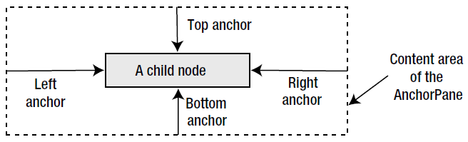
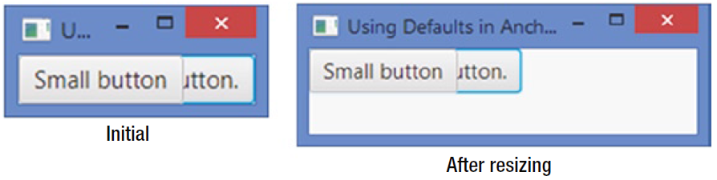

# AnchorPane

- [AnchorPane](#anchorpane)
  - [简介](#%e7%ae%80%e4%bb%8b)
  - [创建 AnchorPane](#%e5%88%9b%e5%bb%ba-anchorpane)
  - [设置子节点 anchor 值](#%e8%ae%be%e7%bd%ae%e5%ad%90%e8%8a%82%e7%82%b9-anchor-%e5%80%bc)

2020-05-18, 21:18
***

## 简介

`AnchorPane` 将其子节点的四个边以指定距离锚定到其自身的四个边。如下所示：



`AnchorPane` 可能用在如下情况：

- 沿着一个或多个边对齐子节点
- 在调整 `AnchorPane` 时跟着调节子节点尺寸

子节点和 `AnchorPane` 边的距离称为 `anchor`。对子节点，最多可以设置四个 `anchor` 值：

- `topAnchor`
- `rightAnchor`
- `bottomAnchor`
- `leftAnchor`

当设置子节点两个对边的 `anchor` 值，在 `AnchorPane` 调节大小时，为了保证 `anchor` 值不变，子节点也会跟着调节大小。

> `anchor` 距离是从 `AnchorPane` 的内容区域边到子节点的边。所以，如果 `AnchorPane` 具有边框和 padding，则从内部边（border+padding）开始计算距离。

## 创建 AnchorPane

无参构造：

```java
AnchorPane apane1 = new AnchorPane();
```

指定子节点构造：

```java
Button okBtn = new Button("OK");
Button cancelBtn = new Button("Cancel");
AnchorPane apane2 = new AnchorPane(okBtn, cancelBtn);
```

构造后添加子节点：

```java
Button okBtn = new Button("OK");
Button cancelBtn = new Button("Cancel");
AnchorPane apane3 = new AnchorPane();
apane3.getChildren().addAll(okBtn, cancelBtn);
```

在使用 `AnchorPane` 时需要记住如下两点：

- `AnchorPane` 默认将其子节点放在 (0, 0)。需要通过指定 `anchor` 值设定子节点位置。
- `AnchorPane` 的首选大小根据其子节点的首选大小和 `anchor` 值计算。
  - 首选宽度为子节点的首选宽度、左 anchor、右 anchor 的加和。
  - 子节点根据添加顺序绘制。

例如，下面添加两个按钮到 `AnchorPane`，一个按钮标签较长，另一个较短。先添加长标签按钮，因此先绘制，然后添加短标签按钮，和第一个按钮重合。

```java
import javafx.application.Application;
import javafx.scene.Scene;
import javafx.scene.control.Button;
import javafx.scene.layout.AnchorPane;
import javafx.stage.Stage;

public class AnchorPaneDefaults extends Application {

    public static void main(String[] args) {
        Application.launch(args);
    }

    @Override
    public void start(Stage stage) {

        Button bigBtn = new Button("This is a big button.");
        Button smallBtn = new Button("Small button");
        // Create an AnchorPane with two buttons
        AnchorPane root = new AnchorPane(bigBtn, smallBtn);
        Scene scene = new Scene(root);
        stage.setScene(scene);
        stage.setTitle("Using Defaults in AnchorPane");
        stage.show();
    }
}
```



## 设置子节点 anchor 值

|Constraint|Type|Description|
|---|---|---|
|topAnchor|Double|`AnchorPane` 内容区域顶边和子节点顶边的距离|
|rightAnchor|Double|`AnchorPane` 内容区域右边和子节点右边的距离|
|bottomAnchor|Double|`AnchorPane` 内容区域下边和子节点下边的距离|
|leftAnchor|Double|`AnchorPane` 内容区域左边和子节点左边的距离|

`AnchorPane` 右四个静态方法设置四个 anchor 值：

```java
// Create a Button and anchor it to top and left edges at 10px from each
Button topLeft = new Button("Top Left");
AnchorPane.setTopAnchor(topLeft, 10.0); // 10px from the top edge
AnchorPane.setLeftAnchor(topLeft, 10.0); // 10px from the left edge

AnchorPane root = new AnchorPane(topLeft);
```
