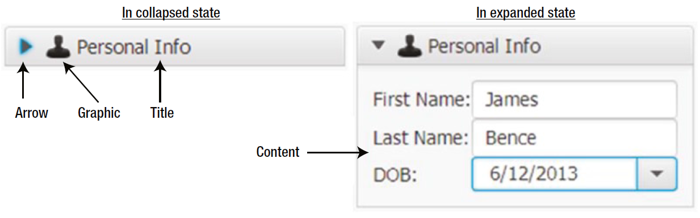

# TitledPane

- [TitledPane](#titledpane)
  - [简介](#%e7%ae%80%e4%bb%8b)
  - [创建](#%e5%88%9b%e5%bb%ba)
  - [属性](#%e5%b1%9e%e6%80%a7)
  - [CSS](#css)

2020-05-17, 15:41
***

## 简介

`TitledPane` 是带标签控件，继承自 `Labeled` 类。标签控件可以包含文本和图形，`TitledPane` 的文本作为标题，图形也在标题显示。

除了文本和图形，`TitledPane` 还包含内容，为 `Node` 类型。一般将多个控件放在一个容器中作为 `TitledPane` 的内容。

`TitledPane` 有折叠和展开两个状态：

- 折叠状态，只显示标题栏，隐藏其内容。
- 展开状态，显示标题栏和内容。

在标题栏中有一个箭头，用于指示是展开还是折叠。点击标题栏切换展开或折叠状态。如下所示：



## 创建

直接创建，随后设置标题和内容：

```java
// Create a TitledPane and set its title and content
TitledPane infoPane1 = new TitledPane();
infoPane1.setText("Personal Info");
infoPane1.setContent(new Label("Here goes the content."));
```

创建时提供标题和内容：

```java
// Create a TitledPane with a title and content
TitledPane infoPane2 = new TitledPane("Personal Info", new Label("Content"));
```

通过 `setGraphic()` 方法设置图形：

```java
String imageStr = "resources/picture/privacy_icon.png";
URL imageUrl = getClass().getClassLoader().getResource(imageStr);
Image img = new Image(imageUrl.toExternalForm());
ImageView imgView = new ImageView(img);
infoPane2.setGraphic(imgView);
```

## 属性

`TitledPane` 包含四个属性：

- animated
- collapsible
- content
- expanded

`animated` 为 boolean 属性，用于指定折叠和展示时是否设置动画。默认为 true。

`collapsible` 属性也是 boolean 属性，表示 `TitledPane` 是否可折叠。默认为 true。对不可折叠的 `TitledPane`，标题栏不显示箭头。

`content` 属性可用于指定任何 node。在展开状态，`content` 内容可见。

`expanded` 为 boolean 属性，该属性为 true 时，`TitledPane` 为展开状态，否则为折叠状态。`TitledPane` 默认处于展开状态，通过 `setExpanded()` 方法设置展开状态。例如：

```java
// Set the state to expanded
infoPane2.setExpanded(true);
```

一般在 `Accordion` 控件中使用 `TitledPane`，该控件一次只显示一个 `TitledPane`，以节省空间。

也可以单独使用 `TitledPane`，方便对控件进行分组。

> `TitledPane` 在展开和折叠时自动调整其高度，因此不要在代码中设置 `minimum`, `preferred` 和 `maximum` heights，否则可能出错。

## CSS

`TitledPane` 的默认 CSS 样式类名为 `titled-pane`。

`TitledPane` 额外包含两个 boolean 类型样式：

- -fx-animated
- -fx-collapsible

两个属性的默认值均为 true。

`TitledPane` 支持两个 CSS pseudo-classes:

- collapsed
- expanded


