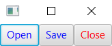

# JavaFX CSS Selector

2023-06-25, 10:24
****
## 1. 简介

样式表中每个样式都有一个关联的 selector，用于识别 scene graph 中的 node。JavaFX CSS 支持多种类型的 selector：class selectors
pseudo-class selectors, ID selector 等。

## 2. 类选择器

`Node` 的 `styleClass` 变量为 `ObservableList<String>` 类型，包含 node 的 JavaFX 样式类名。

JavaFX 样式类名与 Java 类是两种不同的东西。JavaFX 样式类名是字符串类型，用在 CSS 样式表中。

- 可以为 node 指定多个 CSS 类名，例如，给 HBox 指定两个类名

```java
HBox hb = new HBox();
hb.getStyleClass().addAll("hbox", "myhbox");
```

样式 class selector 将关联的样式应用于与样式 class 名称相同的所有 node 上。

```ad-note
node 的样式类名不以点号 `.` 开头，而 CSS 样式类名均以 `.` 开头，匹配时忽略 `.`
```

- 应用样式

使用类选择器定义两个样式，第一个为 .hbox，表示应用于所有样式 名为 hbox 的 node；第二个为 .button，应用于样式类名为 button 的 nodes。

```css
.hbox {
    -fx-border-color: blue;
    -fx-border-width: 2px;
    -fx-border-radius: 5px;
    -fx-border-insets: 5px;
    -fx-padding: 10px;
    -fx-spacing: 5px;
    -fx-background-color: lightgray;
    -fx-background-insets: 5px;
}

.button {
    -fx-text-fill: blue;
}
```

将上面两个样式保存到 `resources\css\styleclass.css` 文件

```java
import javafx.application.Application;
import javafx.application.Platform;
import javafx.scene.Scene;
import javafx.scene.control.Button;
import javafx.scene.control.Label;
import javafx.scene.control.TextField;
import javafx.scene.layout.HBox;
import javafx.stage.Stage;

public class StyleClassTest extends Application {

    public static void main(String[] args) {
        Application.launch(args);
    }

    @Override
    public void start(Stage stage) {
        Label nameLbl = new Label("Name:");
        TextField nameTf = new TextField("");
        Button closeBtn = new Button("Close");
        closeBtn.setOnAction(e -> Platform.exit());

        HBox root = new HBox();
        root.getChildren().addAll(nameLbl, nameTf, closeBtn);

        // Set the styleClass for the HBox to "hbox"
        root.getStyleClass().add("hbox");

        Scene scene = new Scene(root);
        var url = getClass().getResource("/css/styleclass.css").toExternalForm();
        scene.getStylesheets().add(url);

        stage.setScene(scene);
        stage.setTitle("Using Style Class Selectors");
        stage.show();
    }
}
```


`Button` 包含一个默认样式类名 button，所以 "Close" 按钮文本为蓝色。

JavaFX 中大多数常用控件都有一个默认样式类名。将 JavaFX 类名转换为小写，在单词之间插入短线 `-`，就得到对应的 CSS  类名。例如，默认样式类型对应关系：button 对 Button，label 对 Label，hyperlink 对 Hyperlink，text-field 对 TextField，text-area 对 TextArea，check-box 对 CheckBox。

Java 容器类，如 Region, Pane, HBox, VBox 没有默认样式类名。因此，如果需要使用样式类选择器为它们添加样式，则要为它们添加样式类名。

```ad-tip
JavaFX 样式类名区分大小写。
```

那么，如何查询 node 的默认样式类名，以便在样式表中使用。有三种方法：

- 根据类名猜测
- 参考 [JavaFX CSS 参考指南](https://openjfx.io/javadoc/20/javafx.graphics/javafx/scene/doc-files/cssref.html)
- 代码输出

例如，打印 Button 的默认样式类名：

```java
Button btn = new Button();
ObservableList<String> list = btn.getStyleClass();

if (list.isEmpty()) {
    System.out.println("No default style class name");
} else {
    for(String styleClassName : list) {
        System.out.println(styleClassName);
    }
}
```

## 3. root Node 的类选择器

scene 的 root node 的样式类名为 root。对被其它 node 继承的 CSS 属性，可以用 root 样式类选择器。

root node 是 scene graph 中所有 node 的父节点，**推荐**将 CSS 属性存储在 root node 中，这样 scene graph 中任何 node 都能找到它们。

- 定义 `resources\css\rootclass.css` 样式

```css
.root {
    -fx-cursor: hand;
    -my-button-color: blue;
}

.button {
    -fx-text-fill: -my-button-color;
}
```

```java
import javafx.application.Application;
import javafx.scene.Scene;
import javafx.scene.control.Button;
import javafx.scene.control.Label;
import javafx.scene.control.TextField;
import javafx.scene.layout.HBox;
import javafx.stage.Stage;

public class RootClassTest extends Application {

    public static void main(String[] args) {

        Application.launch(args);
    }

    @Override
    public void start(Stage stage) {

        Label nameLbl = new Label("Name:");
        TextField nameTf = new TextField("");
        Button closeBtn = new Button("Close");

        HBox root = new HBox();
        root.getChildren().addAll(nameLbl, nameTf, closeBtn);

        Scene scene = new Scene(root);
        /* The root variable is assigned a default style class name "root" */
        var url = getClass().getResource("/css/rootclass.css").toExternalForm();
        scene.getStylesheets().add(url);

        stage.setScene(scene);
        stage.setTitle("Using the root Style Class Selector");
        stage.show();
    }
}
```


这里 root 类选择器声明了两个属性：`-fx-cursor` 和 `-fx-button-color`。

`-fx-cursor` 被所有 node 继承，因此所有 node 都是 `HAND` 样式光标，除非覆盖该设置。所以将鼠标移到 scene 的任意地方，除了 `TextField`，其它地方都是 `HAND` 光标。因为 TextField 覆盖了 `-fx-cursor` 属性，将其设置为 `TEXT` 光标。

`-my-button-color` 是一个 look-up 属性，在第二个样式中引用它设置按钮的文本颜色。

## 4. ID Selector

`Node` 有一个名为 `id` 的 `StringProperty` 类型属性，可以为 scene graph 中每个 node 分配一个唯一的 id。id 的唯一性由开发者自己负责。

node 的 `id` 需要显式设置才能使用，主要用于基于 ID 选择器的 node 样式设置。

- 设置 Button 的 `id`

```java
Button b1 = new Button("Close");
b1.setId("closeBtn");
```

- 在样式表中 ID 选择器以 `#` 开头

在匹配样式表和 node 时，会移除 `#` 进行匹配，即 node id 不要带 `#`。

例如，CSS 文件 `resources\css\idselector.css` 内容如下：

```css
.button {
    -fx-text-fill: blue;
}

#closeButton {
    -fx-text-fill: red;
}
```

这里定义了两个样式：类选择器 ".button" 和 ID 选择器 `#closeButton`。

下面创建三个按钮，将 "closeButton" 的 id 设置为 "closeButton"：

```java
import javafx.application.Application;
import javafx.scene.Scene;
import javafx.scene.control.Button;
import javafx.scene.layout.HBox;
import javafx.stage.Stage;

public class IDSelectorTest extends Application {

    public static void main(String[] args) {

        Application.launch(args);
    }

    @Override
    public void start(Stage stage) {

        Button openBtn = new Button("Open");
        Button saveBtn = new Button("Save");

        Button closeBtn = new Button("Close");
        closeBtn.setId("closeButton");

        HBox root = new HBox();
        root.getChildren().addAll(openBtn, saveBtn, closeBtn);

        Scene scene = new Scene(root);
        var url = getClass().getResource("/css/idselector.css").toExternalForm();
        scene.getStylesheets().add(url);

        stage.setScene(scene);
        stage.setTitle("Using ID selectors");
        stage.show();
    }
}
```



这里给 "Close" 按钮指定了两个 `-fx-text-fill`，但是 ID 选择器优先级比类选择器高，所以 "Close" 按钮为红色。

## 5. 组合 ID 和 Class 选择器

可以同时使用 ID 选择器和类选择器，匹配同时包含两者的 node:

```css
#closeButton.button {
    -fx-text-fill: red;
}
```

`#closeButton.button` 选择器匹配 ID 为 `closeButton`，且样式类为 `button` 的 nodes。

也可以反过来，效果一样：

```css
.button#closeButton {
    -fx-text-fill: red;
}
```

## 6. 全选

`*` 匹配所有 nodes。该选择器优先级最低。

例如，将所有 node 的文本填充颜色设置为 blue:

```css
* {
    -fx-text-fill: blue;
}
```

当 `*` 选择器不是单独出现，可以忽略。例如，`*.button` 选择器与 `.button` 等价。

## 7. 选择器分组

如果需要在多个选择器中使用相同的 CSS 属性，可以有两种选择：

- 在多个样式中复制属性声明
- 将所有选择器组合成一个样式，用逗号分隔

例如，需要将 button 和 label 的文本颜色设置为 blue。使用两个两个演示，重复声明属性：

```css
.button {
    -fx-text-fill: blue;
}

.label {
    -fx-text-fill: blue;
}
```

也可以将两个样式合并为一个样式：

```css
.button, .label {
    -fx-text-fill: blue;
}
```

## 8. 后代选择器

**后代选择器**（descendant）用于匹配 scene graph 中一个 node 的后代 nodes。

后代选择器包含两个或多个由**空格**分隔的选择器。例如：

```css
.hbox .button {
    -fx-text-fill: blue;
}
```

该选择器匹配所有 button 样式类，且是 hbox 样式类的后代节点。这里"后代"指任何层次的子节点。

JavaFX 中许多控件包含子节点。例如，CheckBox 包含一个 LabeledText 和一个 StackPane，样式类名分别为 text 和 box。而 box 由包含一个样式类名为 mark 的 StackPane。可以使用后代选择器分别设置这些部分的样式。

- 使用后代选择器将 CheckBox 的文本设置为 blue，为 box 设置虚线边框

```css
.check-box .text {
    -fx-fill: blue;
}
.check-box .box {
    -fx-border-color: black;
    -fx-border-width: 1px;
    -fx-border-style: dotted;
}
```

## 9. 子选择器

子选择器（child selector）由两个或多个选择器组成，选择器之间以 `>` 分隔。

- 选择 hbox 样式类节点的子节点，且子节点的样式类为 button 

```css
.hbox > .button {
    -fx-text-fill: blue;
}
```

## 10. 状态选择器

状态选择器（state-based selector）也称为伪类选择器（pseudo-class selector）。伪类选择器根据节点的当前状态匹配节点。例如，`.button:focused` 是一个伪类选择器，匹配具有 button 样式类且持有焦点的节点；`#openBtn:hover` 匹配 ID 为 `#openBtn`，且鼠标悬停在上面的节点。

- 当鼠标悬停在节点上，将文本颜色更改为红色

```css
.button:hover {
    -fx-text-fill: red;
}
```

如果将该样式表添加到 scene，那么鼠标悬停的位置下方如果为按钮，该按钮文本变红色。

JavaFX CSS 不支持 CSS 支持的 `:first-child` 和 `:lang` 这两个伪类。

## 11. JavaFX 类名作为选择器

JavaFX 类名也可以作为选择器，但是不建议。例如：

```css
HBox {
    -fx-border-color: blue;
    -fx-border-width: 2px;
    -fx-border-insets: 10px;
    -fx-padding: 10px;
}
Button {
    -fx-text-fill: blue;
}
```

类名选择器开头没有点号 `.`，区分大小写。

```ad-warning
不推荐使用 JavaFX 类名选择器。比如继承一个 JavaFX 类，继承类由于类名不一致，应用于父类的 JavaFX 样式继承类无法获得。
```
