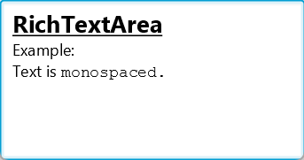

# RichTextArea

## 简介

`RichTextArea` 控件用于可视化和编辑多样式富文本。主要特征：

- 面向段落的模型，支持高达 ~20 亿行
- 虚拟化文本单元流
- 支持使用样式表或内联属性定制文本样式
- 支持一个模型连接多个视图
- 单选
- input-map，便于自定义行为和扩展

## 创建 RichTextArea

使用默认 `RichTextModel` 创建可编辑控件：

```java
RichTextArea textArea = new RichTextArea();
```

`appendText()`, `insertText()`, `replaceText()`, `applyStyle()`, `setStyle()` 可 `clear()` 可用于编程修改文本：

```java
// 创建样式
StyleAttributeMap heading = StyleAttributeMap.builder()
        .setBold(true).setUnderline(true).setFontSize(18).build();
StyleAttributeMap mono = StyleAttributeMap.builder()
        .setFontFamily("Monospaced").build();

RichTextArea textArea = new RichTextArea();
// 构建内容
textArea.appendText("RichTextArea\n", heading);
textArea.appendText("Example:\nText is ", StyleAttributeMap.EMPTY);
textArea.appendText("monospaced.\n", mono);
```

效果：




## 参考

- https://openjfx.io/javadoc/25/jfx.incubator.richtext/module-summary.html

