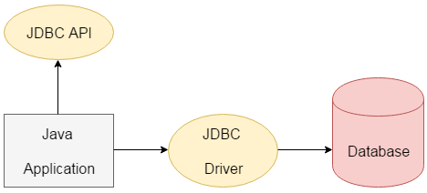
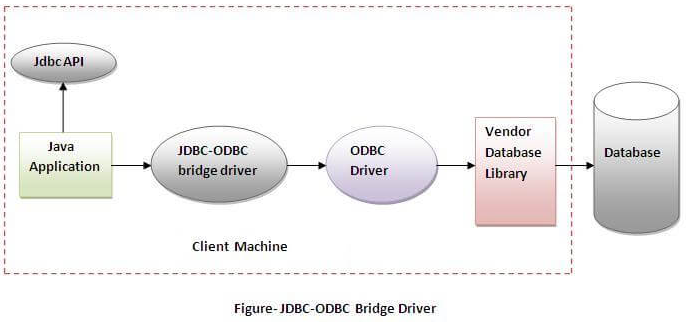
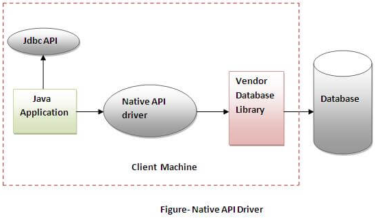
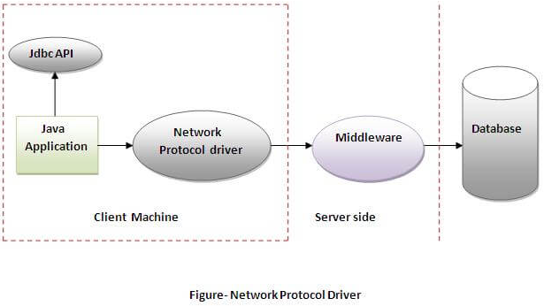
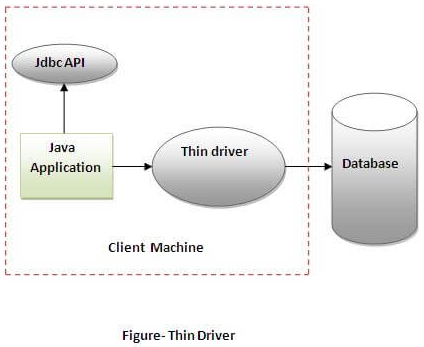

# JDBC Driver

- [JDBC Driver](#jdbc-driver)
  - [简介](#简介)
  - [JDBC-ODBC Bridge Driver](#jdbc-odbc-bridge-driver)
  - [JDBC本地驱动(Native API Driver)](#jdbc本地驱动native-api-driver)
  - [JDBC网络驱动(JDBC-NET Driver)](#jdbc网络驱动jdbc-net-driver)
  - [Thin driver](#thin-driver)

2020-06-20, 16:58
***

## 简介

JDBC本身提供的是一套数据库操作标准，而这些标准需要各个数据库厂商实现，所以针对每一个数据厂商都会提供一个JDBC的驱动程序。

目前JDBC驱动程序可以分为四大类：

1) JDBC-ODBC 桥驱动(Bridge Driver)，将JDBC首先翻译为ODBC，然后使用ODBC驱动程序和数据库通信。
2) JDBC本地驱动(Native API Driver)，由部分JAVA程序和部分本地代码组成，利用开发商提供的本地库函数来直接域数据库通讯。
3) JDBC网络驱动(JDBC-Net Driver)，纯Java程序，使用一种与具体数据库无关的协议将数据库请求发送给一个中间服务器。
4) 本地协议纯JDBC驱动(Native Protocol Driver)，纯Java的驱动程序，直接与协定的数据库系统通信。直接将JDBC命令转换为数据库系统的本地协议。

开发中通常采用第4种，它的使用更为直接简便。

但是一般在开发中会将以上的四类简单的划分成以下三类：

- JDBC-ODBC
- 纯JDBC连接
- 网络的JDBC连接

## JDBC-ODBC Bridge Driver

JDBC-ODBC是 SUN 提供的一个标准的JDBC操作，直接通过微软的 ODBC 进行数据库的连接操作。

这种操作性能较低，所以通常**不推荐**使用这种方式。

从 Java 8开始不再支持 JDBC-ODBC，Oracle推荐直接使用开发商提供的驱动。

优点：

- 使用简单
- 可以很容易地使用任何类型的数据库

缺点：

- 性能低，因为需要将JDBC方法调用转换为ODBC的函数调用
- 需要本地安装ODBC驱动

## JDBC本地驱动(Native API Driver)

直接使用各个数据库生产商提供的JDBC驱动程序，但是因为只能应用在特定的数据库上，会丧失掉程序的可移植性，但是这样操作的性能较高。

JDBC本身提供的是一组类和接口，那么各个数据库生产商要实现这些接口，所以这些驱动程序都需要单独配置，往往是以一组jar包的形式出现的，如果要使用的话，则肯定要配置classpath。

在开发中大部分情况都基于一种数据库的开发，所以一般使用此种模式是最多的。

优点：

- 性能高于JDBC-ODBC

缺点

- 需要在每台客户端计算机上安装Native驱动程序
- 需要安装数据库厂商的数据库操作客户端

## JDBC网络驱动(JDBC-NET Driver)

这种驱动将JDBC转换为与DBMS无关的网络协议，这种协议然后被某个服务器转换为一种DBMS协议。这种网络服务器中间件能够将它的纯Java客户机连接到多种不同的数据库上。所用的具体协议取决于提供者，通常是最灵活的JDBC驱动。具有最大的灵活性，一般由那些非数据库厂商提供，是四种类型中最小的。

优点：

- 客户端不需要安装数据库

缺点：

- 客户端需要网络支持
- 需要提供特定于数据库的中间层支持编码
- 网络协议驱动程序的维护更昂贵，因为需要在中间层完成特定于数据库的编码

## Thin driver

瘦驱动程序直接将JDBC调用转换为特定于数据库的指令，完全由 Java编写。

优点：

- 性能优于其它驱动
- 在客户端和服务器端都不需要安装软件

缺点：

- 需要特定于数据库的驱动。
