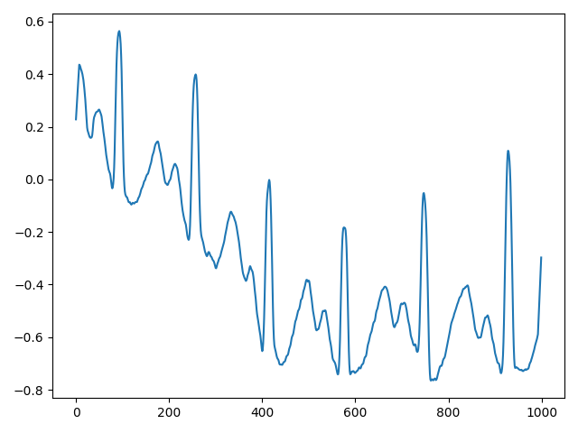

# JDSP

## 简介

JDSP 包含如下功能：

1. 滤波器（filter），基于频率和基于内核（kernel）的滤波器
2. 变换（transform），傅里叶变换和Hilbert 变换等
3. 信号（signal），信号处理，如平滑等
4. 峰检测（Peak Detection），峰检测和过滤
5. 窗口（windowing），不同 window 功能，如 Hamming, Hanning 等

## Peak Detection

在峰值检测中：

- peak 或局部最大值定义为高于两侧样本的样本点
- 局部最小值为低于两侧样本的样本点

谱峰检测通常用于识别某些事件，这些事件引起信号起伏，因此识别为峰。

JDSP 基于以下属性识别谱峰和过滤：

- **Peak Height**：peak 高度
- **Plateau Size**：peak 包含的样本点数
- **Peak Distance**：peak 与其右侧 peak 之间的样本数
- **Peak Sharpness**：peak 与其左右两次相邻样本之间的高度差
- **Peak Prominence**：峰的突出性衡量一个 peak 从基线中突出的程度
- **Peak** Width：peak height 和 prominence 之间的相对距离

下面使用如下信号作为示例：

```java
double[] data = UtilMethods.splitByIndex(UtilMethods.electrocardiogram(), 3200, 4200);
Smooth smooth = new Smooth(data, 15, "rectangular");
double[] ecgSignal = smooth.smoothSignal("same");
```



### 峰值检测

峰值检测的第一步是识别信号中的所有峰：

```java
FindPeak fp = new FindPeak(ecgSignal);

Peak out = fp.detectPeaks(); // 检测波峰
int[] peaks = out.getPeaks();

Peak out2 = fp.detectTroughs(); // 检测波谷
int[] troughs = out2.getPeaks();
```

### 峰值属性和过滤

#### Peak Height


#### Peak Prominence

- 查询 Prominence

```java
double[][] outPromData = out.getProminenceData(); // To get the prominence, left base and right base
double[] outProminence = out.getProminence();
```


## 参考

- https://github.com/psambit9791/jdsp/wiki