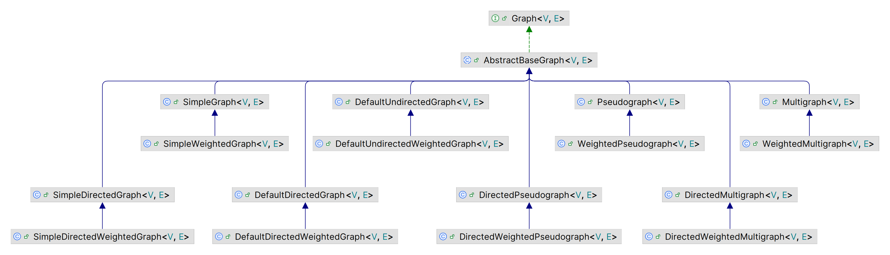

# JGraphT 指南

## 1. Hello JGraphT

graph 是由一组 edge 连接的 vertices 组成。例如，创建一个有向图：

```java
import org.jgrapht.*;
import org.jgrapht.graph.*;
import org.jgrapht.nio.*;
import org.jgrapht.nio.dot.*;
import org.jgrapht.traverse.*;

import java.io.*;
import java.net.*;
import java.util.*;

        Graph<URI, DefaultEdge> g = new DefaultDirectedGraph<>(DefaultEdge.class);

        URI google = new URI("http://www.google.com");
        URI wikipedia = new URI("http://www.wikipedia.org");
        URI jgrapht = new URI("http://www.jgrapht.org");

        // add the vertices
        g.addVertex(google);
        g.addVertex(wikipedia);
        g.addVertex(jgrapht);

        // add edges to create linking structure
        g.addEdge(jgrapht, wikipedia);
        g.addEdge(google, jgrapht);
        g.addEdge(google, wikipedia);
        g.addEdge(wikipedia, google);
```

JGraphT 将 vertex 设计为泛型，可以根据需要选择类型作为 vertex。

edge 类型也可以自由选择。如果不需要关联任何特定应用信息，则可以使用默认的 DefaultEdge。

## 2. Vertex 和 Edge 类型选择

## 3. Graph Accessors

## 4. Graph Structures

| 类名                            | Edges      | Self-loops | Multiple edges | Weighted |
| ------------------------------- | ---------- | ---------- | -------------- | -------- |
| SimpleGraph                     | undirected | no         | no             | no       |
| Multigraph                      | undirected | no         | yes            | no       |
| Pseudograph                     | undirected | yes        | yes            | no       |
| DefaultUndirectedGraph          | undirected | yes        | no             | no       |
| SimpleWeightedGraph             | undirected | no         | no             | yes      |
| WeightedMultigraph              | undirected | no         | yes            | yes      |
| WeightedPseudograph             | undirected | yes        | yes            | yes      |
| DefaultUndirectedWeightedGraph  | undirected | yes        | no             | yes      |
| SimpleDirectedGraph             | directed   | no         | no             | no       |
| DirectedMultigraph              | directed   | no         | yes            | no       |
| DirectedPseudograph             | directed   | yes        | yes            | no       |
| DefaultDirectedGraph            | directed   | yes        | no             | no       |
| **SimpleDirectedWeightedGraph** | directed   | no         | no             | yes      |
| DirectedWeightedMultigraph      | directed   | no         | yes            | yes      |
| DirectedWeightedPseudograph     | directed   | yes        | yes            | yes      |
| DefaultDirectedWeightedGraph    | directed   | yes        | no             | yes      |

说明：

- 无向边（undirected edges）: 一条 edge 连接一对 vertex，没有方向；
- 有向边（directed edges）：一条 edge 连接的 vertices 有 source 和 target 区别；
- 自循环边（self-loop）：是否允许连接 vertex 自身的 edge；
- 多重边（multiple edges）：一对 vertex 之间是否允许有多条 edges，在有向图中，一对 vertices 之间方向相反的两条边不算多重边；
- 权重（weighted）：edge 

类图如下：



## 7. Graph Traversal

创建 graph 后，可以使用深度优先、宽度优先或拓扑等顺序遍历。JGraphT 在 `org.jgrapht.traverse` 包中提供了相关功能。功能接口为 `GraphIterator`。

graph-iterator 根据要求的顺序迭代 vertices，随着迭代的进行，可以通过注册一个 [TraversalListener](https://jgrapht.org/javadoc/org.jgrapht.core/org/jgrapht/event/TraversalListener.html) 来获得额外信息，如如何遍历特定 edge。

下面是 [HelloJGraphT](#1-hello-jgrapht) 示例中的 depth-first 遍历：

```java
Graph<URI, DefaultEdge> hrefGraph = createHrefGraph();

// find the vertex corresponding to www.jgrapht.org
URI start = hrefGraph
    .vertexSet().stream().filter(uri -> uri.getHost().equals("www.jgrapht.org")).findAny()
    .get();

// depth-first 遍历
Iterator<URI> iterator = new DepthFirstIterator<>(hrefGraph, start);
while (iterator.hasNext()) {
    URI uri = iterator.next();
    System.out.println(uri);
}
```

输出：

```
http://www.jgrapht.org
http://www.wikipedia.org
http://www.google.com
```

## 8. Graph Algorithms

除了基本的遍历，JGraphT 在 `org.jgrapht.alg` 包中还提供了许多更复杂的算法。例如，`org.jgrapht.alg.shortestpath` 实现了各种最短路径算法。

当一个问题有多种实现算法，则在 `org.jgrapht.alg.interfaces` 接口中抽象出通用接口。这使得为给定 graph 选择最优算法更容易。

下面是一个在有向图上运算强烈接组件和最短路径算法的示例：

```java
import org.jgrapht.*;
import org.jgrapht.alg.connectivity.*;
import org.jgrapht.alg.interfaces.ShortestPathAlgorithm.*;
import org.jgrapht.alg.interfaces.*;
import org.jgrapht.alg.shortestpath.*;
import org.jgrapht.graph.*;

import java.util.*;

        // constructs a directed graph with the specified vertices and edges
        Graph<String, DefaultEdge> directedGraph =
            new DefaultDirectedGraph<String, DefaultEdge>(DefaultEdge.class);
        directedGraph.addVertex("a");
        directedGraph.addVertex("b");
        directedGraph.addVertex("c");
        directedGraph.addVertex("d");
        directedGraph.addVertex("e");
        directedGraph.addVertex("f");
        directedGraph.addVertex("g");
        directedGraph.addVertex("h");
        directedGraph.addVertex("i");
        directedGraph.addEdge("a", "b");
        directedGraph.addEdge("b", "d");
        directedGraph.addEdge("d", "c");
        directedGraph.addEdge("c", "a");
        directedGraph.addEdge("e", "d");
        directedGraph.addEdge("e", "f");
        directedGraph.addEdge("f", "g");
        directedGraph.addEdge("g", "e");
        directedGraph.addEdge("h", "e");
        directedGraph.addEdge("i", "h");

        // computes all the strongly connected components of the directed graph
        StrongConnectivityAlgorithm<String, DefaultEdge> scAlg =
            new KosarajuStrongConnectivityInspector<>(directedGraph);
        List<Graph<String, DefaultEdge>> stronglyConnectedSubgraphs =
            scAlg.getStronglyConnectedComponents();

        // prints the strongly connected components
        System.out.println("Strongly connected components:");
        for (int i = 0; i < stronglyConnectedSubgraphs.size(); i++) {
            System.out.println(stronglyConnectedSubgraphs.get(i));
        }
        System.out.println();

        // Prints the shortest path from vertex i to vertex c. This certainly
        // exists for our particular directed graph.
        System.out.println("Shortest path from i to c:");
        DijkstraShortestPath<String, DefaultEdge> dijkstraAlg =
            new DijkstraShortestPath<>(directedGraph);
        SingleSourcePaths<String, DefaultEdge> iPaths = dijkstraAlg.getPaths("i");
        System.out.println(iPaths.getPath("c") + "\n");

        // Prints the shortest path from vertex c to vertex i. This path does
        // NOT exist for our particular directed graph. Hence the path is
        // empty and the result must be null.
        System.out.println("Shortest path from c to i:");
        SingleSourcePaths<String, DefaultEdge> cPaths = dijkstraAlg.getPaths("c");
        System.out.println(cPaths.getPath("i"));
```

输出：

```
Strongly connected components:
([i], [])
([h], [])
([e, f, g], [(e,f), (f,g), (g,e)])
([a, b, c, d], [(a,b), (b,d), (d,c), (c,a)])

Shortest path from i to c:
[(i : h), (h : e), (e : d), (d : c)]

Shortest path from c to i:
null
```

## 12. Graph Wrappers

除了核心 graph 数据结构，JGraphT 还提供了许多 wrappers，用于

## 13. Graph Adapters

### 大型 graph adapter

对大型 graph，默认的 JGraphT 表示可能占用太多内存，此时可以使用 [WebGraph](https://jgrapht.org/guide/WebGraphAdapters) 或 [succinct graphs](https://jgrapht.org/guide/Sux4JImplementations) 的 adapters。

## 示例

### HelloJGraphT

1. 使用 JGraphT 的简单示例

```java
import org.jgrapht.*;
import org.jgrapht.graph.*;
import org.jgrapht.nio.*;
import org.jgrapht.nio.dot.*;
import org.jgrapht.traverse.*;

import java.io.*;
import java.net.*;
import java.util.*;

public final class HelloJGraphT {

    private HelloJGraphT() {} 

    /**
     * The starting point for the demo.
     *
     * @param args ignored.
     * @throws URISyntaxException if invalid URI is constructed.
     * @throws ExportException    if graph cannot be exported.
     */
    public static void main(String[] args) throws URISyntaxException, ExportException {
        Graph<String, DefaultEdge> stringGraph = createStringGraph();

        // note undirected edges are printed as: {<v1>,<v2>}
        System.out.println("-- toString output");
        System.out.println(stringGraph);
        // ([v1, v2, v3, v4], [{v1,v2}, {v2,v3}, {v3,v4}, {v4,v1}])
        System.out.println();

        // 创建基于 URI 对象的 graph
        Graph<URI, DefaultEdge> hrefGraph = createHrefGraph();

        // 查找 www.jgrapht.org 对应的 vertex
        URI start = hrefGraph
                .vertexSet().stream()
                .filter(uri -> uri.getHost().equals("www.jgrapht.org"))
            	.findAny().get();

        // 从 jgrapht vertex 开始遍历 graph
        System.out.println("-- traverseHrefGraph output");
        traverseHrefGraph(hrefGraph, start);
        System.out.println();

        System.out.println("-- renderHrefGraph output");
        renderHrefGraph(hrefGraph);
        System.out.println();
    }

    /**
     * 创建基于 URI 对象的有向图
     */
    private static Graph<URI, DefaultEdge> createHrefGraph()
            throws URISyntaxException {
        Graph<URI, DefaultEdge> g = new DefaultDirectedGraph<>(DefaultEdge.class);

        URI google = new URI("http://www.google.com");
        URI wikipedia = new URI("http://www.wikipedia.org");
        URI jgrapht = new URI("http://www.jgrapht.org");

        // add the vertices
        g.addVertex(google);
        g.addVertex(wikipedia);
        g.addVertex(jgrapht);

        // add edges to create linking structure
        g.addEdge(jgrapht, wikipedia);
        g.addEdge(google, jgrapht);
        g.addEdge(google, wikipedia);
        g.addEdge(wikipedia, google);

        return g;
    }

    /**
     * Traverse a graph in depth-first order and print the vertices.
     *
     * @param hrefGraph a graph based on URI objects
     * @param start     the vertex where the traversal should start
     */
    private static void traverseHrefGraph(Graph<URI, DefaultEdge> hrefGraph, URI start) {
        Iterator<URI> iterator = new DepthFirstIterator<>(hrefGraph, start);
        while (iterator.hasNext()) {
            URI uri = iterator.next();
            System.out.println(uri);
        }
    }

    /**
     * Render a graph in DOT format.
     *
     * @param hrefGraph a graph based on URI objects
     */
    private static void renderHrefGraph(Graph<URI, DefaultEdge> hrefGraph)
            throws ExportException {
        DOTExporter<URI, DefaultEdge> exporter =
                new DOTExporter<>(v -> v.getHost().replace('.', '_'));
        exporter.setVertexAttributeProvider((v) -> {
            Map<String, Attribute> map = new LinkedHashMap<>();
            map.put("label", DefaultAttribute.createAttribute(v.toString()));
            return map;
        });
        Writer writer = new StringWriter();
        exporter.exportGraph(hrefGraph, writer);
        System.out.println(writer.toString());
    }

    /**
     * 创建 String 对象的 graph
     */
    private static Graph<String, DefaultEdge> createStringGraph() {
        Graph<String, DefaultEdge> g = new SimpleGraph<>(DefaultEdge.class);

        String v1 = "v1";
        String v2 = "v2";
        String v3 = "v3";
        String v4 = "v4";

        // add the vertices
        g.addVertex(v1);
        g.addVertex(v2);
        g.addVertex(v3);
        g.addVertex(v4);

        // add edges to create a circuit
        g.addEdge(v1, v2);
        g.addEdge(v2, v3);
        g.addEdge(v3, v4);
        g.addEdge(v4, v1);

        return g;
    }
}
```

