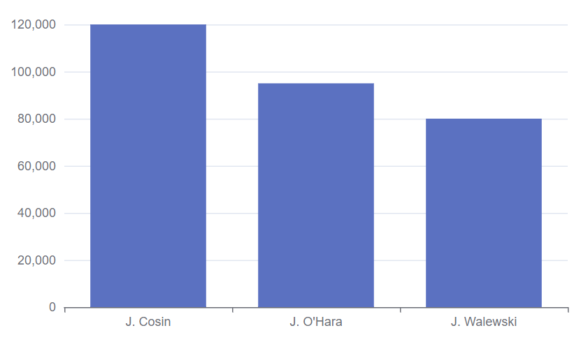

# DBLib

2024-09-29 ⭐
2024-09-27
@author Jiawei Mao

***
## 简介

DFLib (DataFrame Library) 是一个轻量级的 `DataFrame` 的纯 Java 实现。在数据科学和大数据领域，`DataFrame` 是非常常见的结构，提供搜索、过滤、连接、聚合、统计等功能。

在 Python (`pandas`) 和 R 等语言中都有 `DataFrame` 实现，DFLib 项目的目标是提供 `DataFrame` 的纯 Java 实现。它是一个简单的库，且核心库没有依赖项。

## 添加包

```xml
<dependency>
    <groupId>org.dflib</groupId>
    <artifactId>dflib</artifactId>
</dependency>
```

创建 DataFrame，操作数据，打印结果：

```java
DataFrame df1 = DataFrame.foldByRow("a", "b", "c")
        .ofStream(IntStream.range(1, 10000));
DataFrame df2 = df1.rows(r -> r.getInt(0) % 2 == 0).select();
System.out.println(Printers.tabular.toString(df2));
```

```
   a    b    c
---- ---- ----
   4    5    6
  10   11   12
  16   17   18
...
9982 9983 9984
9988 9989 9990
9994 9995 9996
1666 rows x 3 columns
```

## 数据结构

DFLib 有两个基本类 `Series` 和 `DataFrame`。

`Series` 包含一维数据，`DataFrame` 包含二维数据。`DataFrame` 的 column 存储为 `Series` 对象。另外还有一个 `Index` 对象，用于存储 `DataFrame` 的 column 名称。

`DataFrame` 和 `Series` (包括 `Index`) 都是 immutable 对象，因此对它们的所有操作都返回一个新对象。在实现时，DFLib 在实例之间尽可能共享数据，因此复制对象不会导致显著的性能下降，同时使得 DFLib 线程安全。从而支持并发操作。此外，immutable 保证每个步骤都拥有数据的完整快照，从而简化了数据 pipeline 的调试。

### Series

`Series` 可以看作对数组的包装，为泛型类。并为基础类型提供优化类 `IntSeries`, `LongSeries`, `DoubleSeries`, `BooleanSeries`。

`Series` 是 `DataFrame` 构建模块，并定义了许多数据操作和转换功能。

#### 从数组创建 Series

使用 static 方法 `Series.of` 创建：

```java
Series<String> s = Series.of("a", "bcd", "ef", "g");
System.out.println(Printers.tabular.toString(s));
```

```
a  
bcd
ef 
g  
4 elements
```

primitive 类型有专门的工厂方法：

```java
IntSeries is = Series.ofInt(0, 1, -300, Integer.MAX_VALUE);
```

#### 使用 byElement 创建

对长度不可预测的序列，使用 `Series.byElement()`。例如，从 `InputStream` 逐行读取字符串：

```java
SeriesAppender<String, String> appender = Series
        .byElement(Extractor.<String>$col())
        .appender();
Scanner scanner = new Scanner(System.in);
while (scanner.hasNext()) {
    appender.append(scanner.next());
}
Series<String> s = appender.toSeries();
```

`Series.byElement(Extractor.<String>$col()).appender();` 创建收集数据的 appender。对 primitive 数据可以使用 `Extractor.$int(...)`, `Extractor.$long(..)` 等。

`appender.append()` 逐个收集数据。

### DataFrame

`DataFrame` 是一个 in-memory 表格，由 `Index` header 和多个命名 column 组成。每个 column 都是一个 `Series`，column 名称保存在 `Index` 中。`DataFrame` 可以包含不同类型的 column，因为没有针对任何单一类型进行参数化。

"row" 是一个虚拟概念，因为数据是按 column 组织的，但是为了便于使用，通常提供操作 row 的 API。

创建 `DataFrame` 的方法有几种，下面如何将常见的 Java 集合对象（Array, Stream, Collection, Series）转换为 DataFrame。

> [!NOTE]
>
> `DataFrame` 通常是从外部源，如数据库、CSV 文件等创建，而不是从内存中的对象创建。

#### 逐行添加数据

```java
DataFrame df = DataFrame
        .byArrayRow("name", "age") // 创建 builder，每个 row 以可变数组指定
        .appender() // 使用默认设置的 builder 创建一个 appender
        .append("Joe", 18)   // 逐行添加数据
        .append("Andrus", 49)
        .append("Joan", 32)
        .toDataFrame();
```

```
name   age
------ ---
Joe     18
Andrus  49
Joan    32
3 rows x 2 columns
```

#### 从对象 list 创建

从对象 list 中提取对象属性来创建 column

```java
record Person(String name, int age) {
}

List<Person> people = List.of(
        new Person("Joe", 18),
        new Person("Andrus", 49),
        new Person("Joan", 32));

DataFrame df = DataFrame
        .byRow( // builder 以 Extractor 数组开始
                Extractor.$col(Person::name),
                Extractor.$int(Person::age))
        .columnNames("name", "age") // 指定 column 名称，如果忽略，则自动命名
        .appender() // 创建 row-by-row appender
        .append(people) // 添加 list 数据
        .toDataFrame();
```

```
name   age
------ ---
Joe     18
Andrus  49
Joan    32
3 rows x 2 columns
```

#### foldByRow

一维数组可以 row-by-row 折叠成 `DataFrame`

```java
DataFrame df = DataFrame
        .foldByRow("name", "age") // 创建 builder
        .of("Joe", 18, "Andrus", 49, "Joan", 32);
```

#### foldByColumn

```java
DataFrame df = DataFrame
        .foldByColumn("name", "age")
        .of("Joe", "Andrus", "Joan", 18, 49, 32);
```

#### 从 Collection 创建

可以从 Collection 或 Stream 接收数据，按 row 或 column 折叠创建 `DataFrame`。

下面使用 int Stream 创建由内存效率更高的 `IntSeries` series 组成的 `DataFrame`：

```javascript
DataFrame df = DataFrame
        .foldByColumn("col1", "col2")
        .ofStream(IntStream.range(0, 10000));
```

```
col1 col2
---- ----
   0 5000
   1 5001
   2 5002
...
4997 9997
4998 9998
4999 9999
5000 rows x 2 columns
```

#### 从 Series 数组

使用 `Series` 数组创建 `DataFrame`，每个 `Series` 代表一个 column：

```java
DataFrame df = DataFrame
        .byColumn("name", "age")
        .of(
                Series.of("Joe", "Andrus", "Joan"),
                Series.ofInt(18, 49, 32)
        );
```

这是最有效的方法，因为 `DataFrame` 内部就是采用的 `Series` 数组结构。

### Index

`Index` 与 `Series` 类似，用来表示 `DataFrame` 的 header，并且包含 column 标题到 index 的映射。获取所有 column 标题：

```java
String[] labels = df.getColumnsIndex().toArray();
```

## 查看 DataFrame 属性

- row 数

```java
int height()
```

- column 数

```java
int width()
```


## Printers

在分析数据时，数据可视化非常重要，将数据打印到控制台是最简单的可视化方法。`DataFrame` 和 `Series` 都实现了 `toString()` 方法，将它们的内容打印成一行，截断大型数据集，适合于调试。

以表格形式打印可读性更好。下面使用默认表格 printer 打印：

```java
DataFrame df = DataFrame
        .foldByColumn("col1", "col2", "col3")
        .ofStream(IntStream.range(0, 10000));

String table = Printers.tabular.toString(df);
System.out.println(table);
```

该方式最多显示 6 行，截断余下 rows。对单元格也是如此，长度超过 30 个字符的值也会被截断。

```
col1 col2 col3
---- ---- ----
   0 3334 6668
   1 3335 6669
   2 3336 6670
...
3331 6665 9999
3332 6666    0
3333 6667    0
3334 rows x 3 columns
```

可以调整截断参数：

```java
Printer printer = new TabularPrinter(3, 3); // 最多 3 行，每个 cell 最多 3 字符
String table = printer.toString(df);
System.out.println(table);
```

```
c.. c.. c..
--- --- ---
  0 3.. 6..
  1 3.. 6..
...
3.. 6..   0
3334 rows x 3 columns
```

> [!NOTE]
>
> 在 Jupyter Notebook 中，所有的 printer 都配置好。因此，如果 Jupyter cell 最后一行是 `DataFrame` 或 `Series`，它将打印一个 table。

## Expressions

DFLib 内置了一个表达式语言（实现为 Java DSL），可用来在 `DataFrame` 和 `Series` 上执行 column-centric 操作，如数据转换、聚合和过滤。`Exp` 是 expression 接口，expression 以 `DataFrame` 或 `Series` 为参数，生成指定类型的 `Series`。

首先静态导入 `Exp` 接口以使用其工厂方法：

```java
import static org.dflib.Exp.*;
```

下面创建两个简单的 exps，返回所需类型的命名 col 和位置 col：

```java
StrExp lastExp = $str("last");
DecimalExp salaryExp = $decimal(2);
```

求这两个 exps 的值：

```java
DataFrame df = DataFrame.foldByRow("first", "last", "salary").of(
        "Jerry", "Cosin", new BigDecimal("120000"),
        "Juliana", "Walewski", new BigDecimal("80000"),
        "Joan", "O'Hara", new BigDecimal("95000"));

Series<String> last = lastExp.eval(df);
Series<BigDecimal> salary = salaryExp.eval(df);
```

同样的操作也可以使用其它 DFLib API 完成，但这个基本抽象可以描述各种操作。exp 很少单独使用，它们通常作为参数传递给其它方法。

> [!NOTE]
>
> DFLib exp 处理 `Series` 而非单个值，因此其性能较好。Exp 是操作数据的首选方式，而不是直接的 API，包含自定义 lambda。

### col exp

col-exp 用于选择 col。上面示例中的 `$str(...)` 和 `$decimal(...)` exps 为查找 col 的 exp，返回 `DataFrame` 指定名称或指定位置(0-based)的 col。

> [!NOTE]
>
> 对 `Series` 使用 col-exp 直接返回该 `Series`，忽略隐含的 col-name 或 col-index。

`Exp` 接口中的 col-exp 工厂方法很容易找，它们都以 `$` 开始：

```java
$col("col"); // 检索 col，不要求类型

$decimal("col"); // 检索数值类型 col
$double("col");
$int("col");
$long("col");

$date("col"); // 检索 date/time 类型 col
$dateTime("col");
$time("col");

$bool("col"); // 检索 boolean 或 String 类型 col
$str("col");
```

为了避免开销，col-exp 不执行类型转换（`$bool` 除外）。因此，应该根据数据类型选择正确的方法，以避免 `ClassCastExceptions`，或者使用通用的 `$col(...)` exp。如果确实需要转换类型，可以使用 `castAs` 显式方法：

```java
$str("salary").castAsDecimal();
```

`castAs` 会尽量转换为目标类型，当出现无法转换的情况会抛出异常。当默认转换无法实现时，可以通过 `Exp.mapValue(...)` 自定义转换。

### constant exp

使用 `$val(..)` 生成具有相同重复值的 `Series`：

```java
Series<String> hi = $val("hi!").eval(df);
```

```
hi!
hi!
hi!
```

`$val(..)` 可用于为字符串连接创建分隔符：

```java
Series<String> fn = concat( // Exp.concat(...) 的静态导入
        $str("first"),
        $val(" "),  // 在 first 和 last 之间插入空格
        $str("last")).eval(df);
```

### String exp

### numeric exp

上面提到的`$int(..)`, `$long(..)`, `double(..)` 和 `$decimal(..)` 等 col-exp 都是数值型的（`NumExp` 子类），因此它们提供了算术、比较和数字聚合等操作。

算术示例：

```java
NumExp<?> exp = $int("c1")
        .add($long("c2")) // 两个 col 相加
        .div(2.);  // 除以一个常量

DataFrame df = DataFrame.foldByRow("c1", "c2").of(
                1, 2L,
                3, 4L)
        .cols("c3").select(exp);
```

> [!NOTE]
>
> 数学表达式按照方法调用顺序执行，不按照数学运算符的优先级。
>
> 将 `int` 和 `long` 相加，结果被隐式转换为 `long` 类型，除以 `double` 时，又转换为 `double`。

聚合操作示例：

```java
NumExp<?> exp = $int("c1")
        .add($long("c2"))
        .sum() // <1> aggregating here
        .div(2.);

DataFrame df = DataFrame.foldByRow("c1", "c2").of(
                1, 2L,
                3, 4L)
        .cols("c3").agg(exp);
```

### date exp

### complex exp

通过 `Exp` 的方法可以将多个 exp 合并为复杂的 exp。例如：

```java
// Condition 时一个 `Exp<Boolean>` exp
Condition c = and(  // Exp.add() 的 static 导入
        $str("last").startsWith("A"), // `startsWith()` 生成一个 condition
        $decimal("salary").add($decimal("benefits")).gt(100000.)  
    					// add 执行加法操作，`gt(..)` 生成 condition
);
```

### condition

### Sorter

`Sorter` 用于 DFLib 数据结构排序。`Sorter` 内部使用 exp 检索包含排序条件的值，并按指定顺序进行索引。

使用 `asc()` 或 `desc()` 方法创建 `Sorter` 对象。

```java
// sort by last name in the ascending order
Sorter s = $str("last").asc();
```

> [!NOTE]
>
> 虽然 DFLib 支持以任何表达式类型创建 `Sorter`，在运行时，实际类型必须是 java primitive 后 `Comparable` 实例，否则抛出 `ClassCastException`。

## col 操作

操作 `DataFrame` 数据，一般从选择 cols 或 rows 开始，所得子集用 `ColumnSet` 或 `RowSet` 对象表示。下面从 col 开始。

### 选择 col

可以按条件、名称、位置以及隐式选择 col。

#### by condition

用 `predicate` lambda 指定条件：

```java
DataFrame df1 = df.cols(c -> !"middle".equals(c)).select();
```

这种形式的 `cols(...)` 不允许对 col 重新排序。生成的 col 的顺序与原始 `DataFrame` 的相对顺序保持一致：

```
first   last
------- --------
Jerry   Cosin
Joan    O'Hara
```

#### by name

使用 col-name 从 `DataFrame` 选择两个 cols：

```java
DataFrame df = DataFrame.foldByRow("first", "last", "middle").of(
        "Jerry", "Cosin", "M",
        "Joan", "O'Hara", null);

DataFrame df1 = df
        .cols("last", "first") // 匹配名称的 cols 组成的 `ColumnSet`，columns 顺序与参数一致
        .select(); // 以 ColumnSet 创建新的 DataFrame
```

```
last     first
-------- -------
Cosin    Jerry
O'Hara   Joan
```

除了指定要选择的 cols，也可以选择排除哪些 cols。这种模式不支持重新排序：

```java
DataFrame df1 = df.colsExcept("middle").select();
```

#### by position

按位置选择 col (0-based)。

```java
DataFrame df1 = df.cols(1, 0).select();
```

#### 隐式

如果在构建 `COlumnSet` 时不提供参数，则返回的 `DataFrame` 与原来的 `DataFrame` 相同。

```java
DataFrame df1 = df.cols().select();
```

> [!TIP]
>
> 这里展示的隐式选择没什么用。但是可以根据应用于 `ColumnSet` 的操作选择更小的 col 子集。此外，它还允许一次对所有 col 应用转换。

### col 重命名

选择 col 后，可以使用 `selectAs(...)` 为其重命名。

重命名所选的所有 cols:

```java
DataFrame df1 = df
        .cols("last", "first")
        .selectAs("last_name", "first_name"); 
		// 传入新的 col-names，顺序与 ColumnSet 中 column 顺序一致
```

```
last_name first_name
--------- ----------
Cosin     Jerry
Walewski  Juliana
```

也可以只对 cols 的部分 cols 重命名：

```java
DataFrame df1 = df
        .cols("last", "first")
        .selectAs(Map.of("last", "LAST_NAME"));
```

```
LAST_NAME first
--------- -------
Cosin     Jerry
O'Hara    Joan
```

使用函数重命名，依次应用于所有 col：

```java
DataFrame df1 = df
        .cols("last", "first")
        .selectAs(String::toUpperCase);
```

```
LAST   FIRST
------ -----
Cosin  Jerry
O'Hara Joan
```

### col 转换

使用 exp 生成 cols：

```java
DataFrame df = DataFrame.foldByRow("first", "last", "middle").of(
        "Jerry", "Cosin", "M",
        "Joan", "O'Hara", null);

Exp fmExp = concat(
        $str("first"),
        ifNull($str("middle").mapVal(s -> " " + s), ""));

DataFrame df1 = df
        .cols("first_middle", "last") // (1)
        .select(fmExp, $str("last")); // (2)
System.out.println(Printers.tabular.toString(df1));
```

(1) 定义 `ColumnSet` 时，可以指定原 `DataFrame` 中不存在的 col，表示创建新的 col

(2) 对 `ColumnSet` 的每个 col，都应该有一个对应的 exp 来生成该 col。上面第一个 exp 转换数据，第二个 exp 直接选择一个 col。

```
first_middle last
------------ ------
Jerry M      Cosin
Joan         O'Hara
```

使用 `RowMapper` 逐行生成与上面一样的数据： 

```java
RowMapper mapper = (from, to) -> {
    String middle = from.get("middle") != null
            ? " " + from.get("middle")
            : "";
    to.set(0, from.get("first") + middle).set(1, from.get("last"));
};

DataFrame df1 = df
        .cols("first_middle", "last")
        .select(mapper);
```

另外还有一个 `RowToValueMapper`，其功能与上面差别不大。

### split col

拆分 col 并生成新的 col。

```java
DataFrame df = DataFrame.foldByRow("name", "phones").of(
        "Cosin", List.of("111-555-5555","111-666-6666","111-777-7777"),
        "O'Hara", List.of("222-555-5555"));

DataFrame df1 = df
        .cols("primary_phone", "secondary_phone")
        .selectExpand($col("phones"));
```

`selectExpand(..)` 的参数为包含 List 的 col。如果每个 List 包含 2 个以上数字，则忽略余下值，对缺失值使用 `null`。

```
primary_phone secondary_phone
------------- ---------------
111-555-5555  111-666-6666
222-555-5555  null
```

如果不知道 phone 的确切个数，但希望在单独 col 中捕获它们，则不要指定任何显式名称。为了容纳最长的 phone 数组，DFLib 会动态生成尽可能多的 cols，并动态分配名称：

```java
DataFrame df1 = df
        .cols() // 不指定任何名称，表示动态 spli cols
        .selectExpand($col("phones"));
```

```
0            1            2
------------ ------------ ------------
111-555-5555 111-666-6666 111-777-7777
222-555-5555 null         null
```

如果 phone numbers 是以逗号分隔的 String，而非 `List`，则可以使用 `split(..)` 将字符串拆分为数字数组，并使用 `selectExpandArray(..)` 生成 cols：

```java
DataFrame df = DataFrame.foldByRow("name", "phones").of(
        "Cosin", "111-555-5555,111-666-6666,111-777-7777",
        "O'Hara", "222-555-5555");

DataFrame df1 = df
        .cols("primary_phone", "secondary_phone")
        .selectExpandArray($str("phones").split(','));
```

### 合并 cols

`ColumnSet` 提供了许多合并操作。所有不以 `select...` 开头的 `ColumnSet` 方法都与源 `DataFrame` 执行合并。上面介绍的重命名和数据转换也可以作为合并来执行。

例如，清理数据集并添加新的 col：

```java
DataFrame df = DataFrame.foldByRow("first", "last", "middle").of(
        "jerry", "cosin", "M",
        "Joan", "O'Hara", null);

Function<String, Exp<String>> cleanup = col -> $str(col).mapVal(
        s -> s != null && !s.isEmpty()
                ? Character.toUpperCase(s.charAt(0)) + s.substring(1)
                : null); // 实现首字母大写

DataFrame df1 = df
        .cols("last", "first", "full") // 要选择或生成的 cols
        .merge( // 不使用 select，而是用 merge 将 col 与原 DataFrame 合并
                cleanup.apply("last"),
                cleanup.apply("first"),
                concat($str("first"), $val(" "), $str("last"))
        );
```

下面查看结果。`ColumnSet` 的前面两个 cols "last" 和 "first" 已经在 `DataFrame` 中，它们被替换为 cleanup 后的版本；"full" 是新的 col，添加到 `DataFrame` 的右侧，得到：

```
first last   middle full
----- ------ ------ -----------
Jerry Cosin  M      jerry cosin
Joan  O'Hara null   Joan O'Hara
```

合并规则：

- 合并按 **name** 完成
  - `DataFrame` 中与 `ColumnSet` 的名称匹配的 cols 被替换为 `ColumnSet` 的版本；
  - `DataFrame` 包含而 `ColumnSet` 不包含的 cols 保持不变；
  - `DataFrame` 不包含而 `ColumnSet` 包含的 cols 添加到 `DataFrame` 右侧；
- `ColumnSet` 中 cols 的顺序不影响被替换 cols 的顺序，添加的 cols 顺序与 `ColumnSet` 中一致
- 所有转换操作都应用于原始 `DataFrame` 的 cols，所以生成的 "full" col 中有一个小写名称。

如果希望添加 `ColumnSet` 的所有 cols，而不替换 `DataFrame` 中原有 cols？为此可以手动指定 `ColumnSet` 的 col-names，或者使用 `DataFrame.colsAppend(..)`，DFLib 会在每个新 col-name 添加 `_` 以确保不与已有 col-names 相同：

```java
DataFrame df1 = df
        .colsAppend("last", "first") // 添加 cols
        .merge(
                cleanup.apply("last"),
                cleanup.apply("first")
        );
```

```
first last   middle last_  first_
----- ------ ------ ------ ------
jerry cosin  M      Cosin  Jerry
Joan  O'Hara null   O'Hara Joan
```

### Compact col

将 col 类型转换为 primitive 类型。col 中的值可以为 numbers, booleans 或 string:

```java
DataFrame df = DataFrame.foldByRow("year", "sales").of(
        "2022", "2005365.01",
        "2023", "4355098.75");

DataFrame df1 = df
        .cols("year").compactInt(0)
        .cols("sales").compactDouble(0.);
```

`compact` 的参数指定要转换的值为 `null` 时的默认值。

`compactInt(..)`, `compactDouble(..)` 等方法不仅仅是语法糖，它们将 `DataFrame` 的 col 转换为 primitive `Series` 可以减少内存占用，且计算速度比基于对象的 `Series` 更快。

### Fill Null

使用常量替换 `null` 值：

```java
DataFrame df = DataFrame.foldByRow("c1", "c2").of(
        "a1", "a2",
        null, null,
        "b1", "b2");

DataFrame clean = df.cols("c1", "c2").fillNulls("X");
```

```
c1 c2
-- --
a1 a2
X  X
b1 b2
```

使用与 `null` 值相邻的值填充：

```java
DataFrame clean = df
        .cols("c1").fillNullsBackwards() // 使用 null 值前面的 non-null 值替换 null 值
        .cols("c2").fillNullsForward();  // 使用 null 值后面的 non-null 值替换 null 值
```

```
c1 c2
-- --
a1 a2
b1 a2
b1 b2
```

也可以从另外 `Series` 提取值来替换 `null` 值：

```java
Series<String> mask = Series.of("A", "B", "C", "D");
DataFrame clean = df.cols("c1", "c2").fillNullsFromSeries(mask);
```

```
c1 c2
-- --
a1 a2
B  B
b1 b2
```

> [!NOTE]
>
> mask `Series` 不需要与 `DataFrame` 一样高，值从 0 开始对齐。

最后，还可以使用 `Exp` 为 `null` 赋值：

```java
DataFrame df = DataFrame.foldByRow("c1", "c2").of(
                "a1", "a2",
                null, null,
                "b1", "b2");

DataFrame clean = df.cols("c1", "c2")
        .fillNullsWithExp(rowNum()); 
```

`Exp.rowNum()` 生成一个包含行号的 `Series`，因此 `null` 值被替换为所在 row 的行号。

```
c1 c2
-- --
a1 a2
2  2
b1 b2
```

### drop col

选择要删除的 cols，调用 `drop()` 删除；或者要保留的 cols，调用 `select()` 保留：

```java
DataFrame df1 = df.cols("middle").drop();
```

```java
DataFrame df1 = df.colsExcept("middle").select();
```

两种方法得到的结果相同

```
first last
----- ------
Jerry Cosin
Joan  O'Hara
```

## row 操作

和 col 操作一样，row 操作首先定义 `RowSet`，执行转换，然后合并到原 `DataFrame`，或作为独立的 `DataFrame`。

所有 row 操作基本都是在 `RowSet` 对象上完成，`RowSet` 和 `ColumnSet` 有许多相似点，但两者在选择等操作上差别很大。

### 选择 row

row 的选择支持 by-condition, by-index, by-range。前两者都通过 `DataFrame.rows()` 方法实现，by-range 则通过 `rowsRange()` 实现。

- 选择满足 `Condition` 的 rows

```java
RowSet rows(Condition rowCondition)
RowSet rows(BooleanSeries condition)
RowSet rows(RowPredicate condition)
```

- 选择指定位置以外的 rows

```java
RowSet rowsExcept(int... positions)
RowSet rowsExcept(IntSeries positions)
RowSet rowsExcept(RowPredicate condition)
RowSet rowsExcept(Condition condition)
```

#### rows

`rows()` 选择 `DataFrame` 的所有 rows。

```java
DataFrame df = DataFrame.foldByRow("a", "b", "c")
        .of(
                1, "x", "a",
                2, "y", "b",
                -1, "m", "n")
        .rows()
        .select();

new DataFrameAsserts(df, "a", "b", "c")
        .expectHeight(3)
        .expectRow(0, 1, "x", "a")
        .expectRow(1, 2, "y", "b")
        .expectRow(2, -1, "m", "n");
```

#### by condition

`Condition` (boolean `Exp`) 可以用来选择匹配的 rows：

```java
DataFrame df = DataFrame.foldByRow("first", "last", "middle").of(
        "Jerry", "Cosin", "M",
        "Juliana", "Walewski", null,
        "Joan", "O'Hara", "P");

DataFrame df1 = df
        .rows($str("last").startsWith("W").eval(df)) // 选择满足条件的 rows，保存为 RowSet 
        .select();  // 将 RowSet 转换为 DataFrame
```

```
first   last     middle
------- -------- ------
Juliana Walewski null
```

另一种形式的 condition 为 `RowPredicate` 对象：

```java
DataFrame df1 = df
        .rows(r -> r.get("last", String.class).startsWith("W"))
        .select();
```

`cond` 可以是预先算好的 `BooleanSeries`。一种常见的场景是在一个 `Series` 或 `DataFrame`/`RowSet` 调用 `locate()` 构建 `BooleanSeries` selector，然后使用它从另一个 `DataFrame`  选择 rows：

```java
// 创建 salaries Series，其大小与 DataFrame 的 rows 数目一样
IntSeries salaries = Series.ofInt(100000, 50000, 45600); 
// 创建可复用 selector
BooleanSeries selector = salaries.locateInt(s -> s > 49999); 

DataFrame df1 = df.rows(selector).select();
```

```
first   last     middle
------- -------- ------
Jerry   Cosin    M
Juliana Walewski null
```

#### by position

```java
RowSet rows(int... positions)
RowSet rows(IntSeries positions)
```

- 选择 index 0,2 两行

```java
DataFrame df = DataFrame.foldByRow("a", "b", "c")
        .of(
                1, "x", "a",
                2, "y", "b",
                -1, "m", "n")
        .rows(Series.ofInt(0, 2)).select();
new DataFrameAsserts(df, "a", "b", "c")
        .expectHeight(2)
        .expectRow(0, 1, "x", "a")
        .expectRow(1, -1, "m", "n");
```

- 什么都不选

```jade
DataFrame df = DataFrame.foldByRow("a", "b", "c")
        .of(
                1, "x", "a",
                2, "y", "b",
                -1, "m", "n")
        .rows(Series.ofInt()).select();

new DataFrameAsserts(df, "a", "b", "c").expectHeight(0);
```

- 重复选择 rows

```java
DataFrame df = DataFrame.foldByRow("a", "b", "c")
        .of(
                1, "x", "a",
                2, "y", "b",
                -1, "m", "n")
        .rows(0, 2, 2, 0).select();

new DataFrameAsserts(df, "a", "b", "c")
        .expectHeight(4)
        .expectRow(0, 1, "x", "a")
        .expectRow(1, -1, "m", "n")
        .expectRow(2, -1, "m", "n")
        .expectRow(3, 1, "x", "a");
```

> [!NOTE]
>
> 使用 index-array 可以设置顺序，且可以重复选择 rows。

- 使用 `IntSeries` 定义位置

和 cond 一样，通常使用另一个 `Series` 或 `DataFrame`/`RowSet` 计算得到 `IntSeries`：

```java
IntSeries selector = salaries.indexInt(s -> s > 49999); // 创建包含位置的 selector

DataFrame df1 = df.rows(selector).select();
```

```
first   last     middle
------- -------- ------
Jerry   Cosin    M
Juliana Walewski null
```

#### rowsRange

```java
RowSet rowsRange(int fromInclusive, int toExclusive)
```

- `rowsRange` 选择指定范围的 rows

```java
DataFrame df = DataFrame.foldByRow("a", "b", "c")
        .of(
                1, "x", "a",
                2, "y", "b",
                -1, "m", "n")
        .rowsRange(1, 2).select(); // [startIdx, endIdx)

new DataFrameAsserts(df, "a", "b", "c")
        .expectHeight(1)
        .expectRow(0, 2, "y", "b");
```

- startIdx 和 endIdx 相同时，什么也不选

```java
DataFrame df = DataFrame.foldByRow("a", "b", "c")
        .of(
                1, "x", "a",
                2, "y", "b",
                -1, "m", "n")
        .rowsRange(1, 1).select();

new DataFrameAsserts(df, "a", "b", "c").expectHeight(0);
```

- 选择所有 rows

```java
DataFrame df = DataFrame.foldByRow("a", "b", "c")
        .of(
                1, "x", "a",
                2, "y", "b",
                -1, "m", "n")
        .rowsRange(0, 3).select();

new DataFrameAsserts(df, "a", "b", "c")
        .expectHeight(3)
        .expectRow(0, 1, "x", "a")
        .expectRow(1, 2, "y", "b")
        .expectRow(2, -1, "m", "n");
```

### transform rows

和 `ColumnSet` 一样，`RowSet` 定义了许多基于 column 和 row 的转换操作。每个转换都可以作为 select 或 merge 调用，返回 `RowSet` 包含的 rows 或包含原 `DataFrame` 的所有 rows。下面先介绍 select 操作，然后讨论 merge。

使用 col exp 执行转换：

```java
DataFrame df = DataFrame.foldByRow("last", "age", "retires_soon").of(
        "Cosin", 61, false,
        "Walewski", 25, false,
        "O'Hara", 59, false);

DataFrame df1 = df
        .rows($int("age").mapBoolVal(a -> 67 - a < 10))
        .select(
                $col("last"),
                $col("age"),
                $val(true)); 
```

选择满足条件的 rows，"retires_soon" 全部设置为 true：

```
last   age retires_soon
------ --- ------------
Cosin   61         true
O'Hara  59         true
```

> [!NOTE]
>
> 需要为 `DataFrame` 的每个 col 指定一个 exp，即使只转换一个 col。

使用 `RowMapper` 逐行转换：

```java
RowMapper mapper = (from, to) -> {
    from.copy(to);
    to.set("retires_soon", true);
};

DataFrame df1 = df
        .rows($int("age").mapBoolVal(a -> 67 - a < 10))
        .select(mapper);
```

也可以使用 `RowToValueMapper` 对每个 col 进行 row-by-row 转换。

### merge rows

使用 `merge(..)` 合并 `RowSet` 和 `DataFrame`。

```java
DataFrame df = DataFrame.foldByRow("last", "age", "retires_soon").of(
        "Cosin", 61, false,
        "Walewski", 25, false,
        "O'Hara", 59, false);

DataFrame df1 = df
        .rows($int("age").mapBoolVal(a -> 67 - a < 10))
        .merge(
                $col("last"),
                $col("age"),
                $val(true));
```

```
last     age retires_soon
-------- --- ------------
Cosin     61         true
Walewski  25        false
O'Hara    59         true
```

合并 rows 与合并 cols 类似，只是 rows 没有 names，所以通过 pos 实现。

row 合并规则：

- 通过 row pos 合并
  - DataFrame 中位置匹配的 rows 被替换为 `RowSet` 中转换后的 rows
  - `DataFrame` 中与 `RowSet` 不匹配的 rows 不变
  - `RowSet` 包含 `DataFrame` 不包含的 rows (如重复 row 和分割 row) 添加到底部
- `RowSet` 中 row 的顺序不影响 `DataFrame` 中被替换的 row 的顺序
  - 附加到底部的 rows 与 `RowSet` 中的顺序一致

> [!NOTE]
>
> 和 col 一样，大多数 `RowSet.select(..)` 方法都有对应的 merge 方法，如 `map()`, `expand()`, `unique(..)` 等

### split row

split row 与 split col 类似。该 API 接收单个 col，split 出来的值保存为新的 row：

```java
DataFrame df = DataFrame.foldByRow("name", "phones").of(
        "Cosin", List.of(
                "111-555-5555",
                "111-666-6666",
                "111-777-7777"),
        "O'Hara", List.of("222-555-5555"));

DataFrame df1 = df
        .rows()
        .selectExpand("phones");
```

```
name   phones
------ ------------
Cosin  111-555-5555
Cosin  111-666-6666
Cosin  111-777-7777
O'Hara 222-555-5555
```

> [!NOTE]
>
> 拆分的 col 可以包含 scalar, array 或 iterables。

### unique row

可以根据所有 cols 或部分 cols 来选择 unique rows。

- 基于所有 cols 的 unique-row

```java
DataFrame df = DataFrame.foldByRow("first", "last").of(
        "Jerry", "Cosin",
        "Jerry", "Jones",
        "Jerry", "Cosin",
        "Joan", "O'Hara");

DataFrame df1 = df.rows().selectUnique(); // 选择完全 unique 的 rows
```

```
first last
----- ------
Jerry Cosin
Jerry Jones
Joan  O'Hara
```

- 基于 "first" col 为 unique

```java
DataFrame df2 = df.rows().selectUnique("first"); 
```

```
first last
----- ------
Jerry Cosin
Joan  O'Hara
```

### drop row

选择要删除的 rows，然后调用 `drop()`；或者选择需要的 rows，然后调用 `select()`：

```java
DataFrame df = DataFrame.foldByRow("first", "last", "middle").of(
        "Jerry", "Cosin", "M",
        "Juliana", "Walewski", null,
        "Joan", "O'Hara", "P");

DataFrame df1 = df.rows($col("middle").isNull()).drop();
```

```java
DataFrame df = DataFrame.foldByRow("first", "last", "middle").of(
        "Jerry", "Cosin", "M",
        "Juliana", "Walewski", null,
        "Joan", "O'Hara", "P");

DataFrame df1 = df.rowsExcept($col("middle").isNull()).select();
```

两者得到相同结果：

```
first last   middle
----- ------ ------
Jerry Cosin  M
Joan  O'Hara P
```

## row 和 col 操作

### 选择 row 和 col

### row 和 col 转换

### 合并 row 和 col

### 删除 row 和 col

## head 和 tail

大多数 `DataFrame` 的操作是在 RowSet 或 ColumnSet 上执行。还有一些操作直接用于 `DataFrame`，如 `head` 和 `tail`，返回 `DataFrame` 的前 N 行或最后 M 行。

示例：返回 `DataFrame` 的前 2 行：

```java
DataFrame df = DataFrame.foldByRow("first", "last").of(
        "Jerry", "Cosin",
        "Juliana", "Walewski",
        "Joan", "O'Hara");

DataFrame df1 = df.head(2); 
```

返回包含原 `DataFrame` 的前 2 行的 `DataFrame`:

```
first   last
------- ---------
Jerry   Cosin
Juliana Walewski
```

`tail` 功能类似，只是返回最后 N 行：

```java
DataFrame df1 = df.tail(1);
```

```
first last
----- ------
Joan  O'Hara
1 row x 2 columns
```

`head(..)` 和 `tail(..)` 的参数都可以为负数。表示跳过开头或末尾的 rows，返回余下 rows。

例如：跳过开头的 2 rows，余下 rows 以新的 `DataFrame` 返回：

```java
DataFrame df1 = df.head(-2);
```

```
first  last
------ ---------
Joan  O'Hara
1 row x 2 columns
```

> [!NOTE]
>
> 和 Java 中数组和 list 不同，`head(..)` 和 `tail(..)` 不边界检查不严格。
>
> 当长度超过 `DataFrame` 的 rows 数，不会抛出异常，而是返回空的 `DataFrame` 或 `Series`。
>
> `Series` 的 `head(..)` 和 `tail(..)` 的功能类似。

## 排序

可以对 `Series` 中的值或 `DataFrame` 中的 rows 排序。

排序不改变原对象 ，而是创建一个新对象。

### Series 排序

`Series` 提供了一个 `sort` 方法，该方法使用 [Sorter](#sorter) 对其数据进行排序。

- 按照字符串长度升序排序

```java
Series<String> s = Series
        .of("12", "1", "123")
        .sort($str("").mapVal(String::length).asc());
```

返回一个包含排序数据的新 `Series`：

```
1
12
123
3 elements
```

也可以使用 `Comparator` 实现相同功能：

```java
Series<String> s = Series
        .of("12", "1", "123")
        .sort(Comparator.comparingInt(String::length));
```

- 按自然顺序排序

```java
Series<String> s = Series
        .of("c", "d", "a")
        .sort($str("").asc());
```

```
a
c
d
3 elements
```

primitives 类型的 `Series` 按自然顺序排序不需要指定 sorter 或 comparator:

```java
LongSeries s = Series
        .ofLong(Long.MAX_VALUE, 15L, 0L)
        .sortLong();
```

```
                  0
                 15
9223372036854775807
3 elements
```

此外，`IntSeries` 可以使用自定义 `IntComparator` 高效排序。

### DataFrame 排序

`DataFrame` 的 rows 可以采用一个或多个 [Sorter](#sorter) 进行排序。

```java
DataFrame df = DataFrame.foldByRow("first", "last", "middle").of(
        "Jerry", "Cosin", "M",
        "Juliana", "Walewski", null,
        "Jerry", "Albert", null,
        "Joan", "O'Hara", "J");

DataFrame df1 = df.sort(
        $str("first").asc(),
        $str("last").asc());
```

```
first   last      middle
------- --------- ------
Juliana Walewski  null
Jerry   Albert    null
Jerry   Cosin     M
Joan    O'Hara    J
```

也可以使用使用单个 col-name 或 col 数组进行排序。

```java
DataFrame df = DataFrame.foldByRow("first", "last", "middle").of(
        "Jerry", "Cosin", "M",
        "Juliana", "Walewski", null,
        "Joan", "O'Hara", "J");

DataFrame df1 = df.sort("first", true); 
```

这里 `sort` 的第一个参数为 col-name，也可以使用 col-index，第二个参数表示排序方向，`true` 表示升序，`false` 表示降序。

```java
DataFrame df = DataFrame.foldByRow("first", "last", "middle").of(
        "Jerry", "Cosin", "M",
        "Juliana", "Walewski", null,
        "Jerry", "Albert", null,
        "Joan", "O'Hara", "J");

DataFrame df1 = df.sort(new String[]{"last", "first"}, new boolean[]{true, false});
```

## 拼接

合并多个 `Series` 后 `DataFrame` 的方法有多种。最简单的是串联，多个 `Series` 串联可以得到更长的 `Series`；`DataFrame` 则可以垂直连接或水平连接。

### 拼接 Series

使用 `Series.concat(...)` 拼接 `Series`：

```java
Series<String> s1 = Series.of("x", "y", "z");
Series<String> s2 = Series.of("a");
Series<String> s3 = Series.of("m", "n");

Series<String> sConcat = s1.concat(s2, s3);
```

得到更长的 series：

```
x
y
z
a
m
n
6 elements
```

对 `Series` 数组或集合，可以使用 `SeriesConcat.concat(..)` 拼接：

```java
Collection<Series<String>> ss = asList(
        Series.of("x", "y", "z"),
        Series.of("a"),
        Series.of("m", "n"));

Series<String> sConcat = SeriesConcat.concat(ss);
```

得到的结果与上例相同。

也可以将 series 与其自身拼接：

```java
Series<String> s = Series.of("x", "y");
Series<String> sConcat = s.concat(s);
```

```
x
y
x
y
4 elements
```

### 拼接 DataFrame

拼接 `DataFrame` 有两种方式：

- 垂直：将 `DataFrame` 堆叠在一起
- 水平：将 `DataFrame` 并排放一起

例如：

```java
DataFrame df1 = DataFrame.foldByRow("a", "b").of(
        1, 2,
        3, 4);

DataFrame df2 = DataFrame.foldByRow("a", "b").of(
        5, 6,
        7, 8);

DataFrame dfv = df1.vConcat(df2); 
```

`df1.vConcat(df2)` 表示垂直拼接，其参数为 vararg，因此可以同时拼接多个 `DataFrame`。

```
a b
- -
1 2
3 4
5 6
7 8
```

`hConcat` 表示水平拼接，参数同样为 vararg，可以同时拼接多个 `DataFrame`

```java
DataFrame dfh = df1.hConcat(df2); 
```

```
a b a_ b_
- - -- --
1 2 5  6
3 4 7  8
```

> [!NOTE]
>
> 由于 `df1` 和 `df2` 的 col-names 相同，而 `DataFrame` 要求 col-names 必须为 unique，因此 DFLib 会自动在冲突的 col-names 后面加 `_` 后缀。

上面两个示例的 `DataFrame` 维度都匹配：

- 对 `vConcat`，cols 的数目和 names 匹配
- `hConcat` 的 row 数目匹配

如果两个 `DataFrame` 的 shape 或 names 不匹配？

`concat` 方法支持额外的 `JoinType` 参数来定义拼接行为。`JoinType` 的可选值包括：

- inner (默认)
- left
- right
- full

以 `vConcat` 为例：

```java
DataFrame df1 = DataFrame.foldByRow("b", "a").of(
        1, 2,
        3, 4);

DataFrame df2 = DataFrame.foldByRow("a", "c").of( 
        5, 6,
        7, 8);

DataFrame dfv = df1.vConcat(JoinType.inner, df2); 
```

`df1` 的 col-names 为 "b" 和 "c"，而 `df2` 的为 `a` 和 "c"。

显式传入 `JoinType.inner` (这是默认设置，也可以忽略)。

```
a
-
2
4
5
7
```

从结果可以看出，`inner` 只保留 `df1` 和 `df2` 都包含的 cols。cols 按名称拼接，不考虑啊魂虚。

`left` 表示保留 `DataFrame` 左边的所有 cols，缺失值用 `null` 填充：

```java
DataFrame dfv = df1.vConcat(JoinType.left, df2);
```

```
b    a
---- -
1    2
3    4
null 5
null 7
```

`right` 拼接结果：

```java
a    c
- ----
2 null
4 null
5    6
7    8
```

`full` 拼接结果：

```java
   b a    c
---- - ----
   1 2 null
   3 4 null
null 5    6
null 7    8
```

`hConcat` 工作方式类似，只是 row 没有名称，所以用 index 来匹配：

```java
DataFrame df1 = DataFrame.foldByRow("a", "b").of(
        1, 2,
        3, 4,
        5, 6);

DataFrame df2 = DataFrame.foldByRow("c", "d").of(
        7, 8,
        9, 10);

DataFrame dfv = df1.hConcat(JoinType.left, df2);
```

```
a b c    d
- - ---- ----
1 2 7    8
3 4 9    10
5 6 null null
```

`right` 结果：

```
a b c  d
- - - --
1 2 7  8
3 4 9 10
```

full 结果：

```
a b    c    d
- - ---- ----
1 2    7    8
3 4    9   10
5 6 null null
```

## join

DFLib 提供了 4 类 join 方式：

- inner
- left (outer)
- right (outer)
- full (outer)

### inner join

```java
DataFrame left = DataFrame
        .foldByRow("id", "name")
        .of(1, "Jerry", 2, "Juliana", 3, "Joan");

DataFrame right = DataFrame
        .foldByRow("id", "age")
        .of(2, 25, 3, 59, 4, 40);

DataFrame joined = left
        .join(right) 
        .on("id") 
        .select();
```

`join(..)` 等价于 `innerJoin(..)`。`inner` 取两个 `DataFrame` 匹配的 rows。

join 操作中使用的 col 在两个 `DataFrame` 中有相同的名称，因此只需要指定一次 col-name。通常来说，col-names 不需要匹配，且可以使用多个 cols 参与 join。

```
id name    id_ age
-- ------- --- ---
 2 Juliana   2  25
 3 Joan      3  59
```

### col namespace

上例中使用的 `id` col，由于它同时出现在`left` 和 `right` `DataFrame`，因此在结果中出现两次。为了避免命名冲突，`right` dataframe 的被重命名为 `id_`。该规则也适合 `right` dataframe 其它与 leftframe col-names 命名冲突的 cols。

可以使用 name-pattern 将这些命名冲突的 cols 删除：

```java
DataFrame joined = left
        .join(right)
        .on("id")
        .colsExcept(c -> c.endsWith("_"))
        .select();
```

```
id name    age
-- ------- ---
 2 Juliana  25
 3 Joan     59
```

> [!NOTE]
>
> 可以发现 `colsExcept(..).select()` 和 col 操作 API 类似。`Join` 是一种特殊的 `ColumnSet`，只是它只包含 `select` 操作。

为了更清晰，可以在 join 之前重命名 left 和 right dataframe 的 col-names：

```java
DataFrame joined = left.as("L") // 为 left dataframe 设置名称
        .join(right.as("R"))  // 为 right dataframe 设置名称
        .on("id")
        .select();
```

```
L.id L.name  R.id R.age
---- ------- ---- -----
   2 Juliana    2    25
   3 Joan       3    59
```

> [!NOTE]
>
> `DataFrame` 的 immutable 也适用于命名。调用 `.as()` 会创建单独的 `DataFrame`。

### transform col

在构建 join 结果时，可以使用 exp 修改已有 col，也可以添加新的 col：

```java
DataFrame joined = left.as("L")
        .join(right.as("R"))
        .on("id")
        .cols("name", "retires_soon")
        .select(
                $col("name"),
                $int("R.age").gt(57)
        );
```

```
name    retires_soon
------- ------------
Juliana        false
Joan            true
```

> [!NOTE]
>
> 在 join 时，col-exp 可以引用 left 和 right col 的 short-col-names，也可以引用带前缀的完整 col-names。使用 short-col-names 时，需要考虑 `_` 后缀。

### outer join

以 `leftJoin(..)`  为例：

```java
DataFrame joined = left
        .leftJoin(right)
        .on("id")
        .select();
```

```
id name     id_  age
-- ------- ---- ----
 1 Jerry   null null
 2 Juliana    2   25
 3 Joan       3   59
```

`leftJoin` 包含 left dataframe 的所有 rows，以及 right dataframe 匹配的 rows。

### indicator col

join 操作可以输出 indicator-col 显示匹配的 rows。以 `fullJoin(..)` 为例：

```java
DataFrame joined = left
        .fullJoin(right)
        .on("id")
        .indicatorColumn("join_type") // 要求创建指定名称的 indicator-col
        .colsExcept(c -> c.endsWith("_"))
        .select();
```

```
  id name     age join_type
---- ------- ---- ----------
   1 Jerry   null left_only
   2 Juliana   25 both
   3 Joan      59 both
null null      40 right_only
```

`join_type` col 包含 `org.dflib.join.JoinIndicator` enum 类型。

> [!NOTE]
>
> 所有 join 类型都可以输出 indicator-col，但是它只对三种 outer-join 有意义，对 inner-join 结果总是 `both`。

### nested loop join

目前介绍的 join 操作都是通过对比 left-col 和 right-col 值来实现，称之为 hash-join，速度较快。

另一种 join 操作称为 nested-loop，将 left dataframe 和 right dataframe 逐行对比。例如，将一个包含工资的 dataframe 与其自身 join，生成成对的名字，左侧工资高，右侧工资低：

```java
DataFrame df = DataFrame.foldByRow("name", "salary").of(
        "Jerry", 120000,
        "Juliana", 80000,
        "Joan", 95000);

JoinPredicate p = (r1, r2) ->
        ((Integer) r1.get("salary")) > ((Integer) r2.get("salary"));

DataFrame joined = df
        .leftJoin(df)
        .predicatedBy(p) // 自定义 join 条件
        .select()
        .sort($int("salary").desc(), $int("salary_").desc()) // 排序并重命名
        .cols("name", "name_").selectAs("makes_more", "makes_less");
```

```
makes_more makes_less
---------- ----------
Jerry      Joan
Jerry      Juliana
Joan       Juliana
Juliana    null
```

> [!NOTE]
>
> nested-loop join 非常慢，除非绝对必要，否则不应使用。

## group 和 aggregate

根据 col 值进行分组。例如，下面是一份工资报表：

```
name             amount date
---------------- ------ ----------
Jerry Cosin        8000 2024-01-15
Juliana Walewski   8500 2024-01-15
Joan O'Hara        9300 2024-01-15
Jerry Cosin        4000 2024-02-15
Juliana Walewski   8500 2024-02-15
Joan O'Hara        9300 2024-02-15
Jerry Cosin        8000 2024-03-15
Joan O'Hara        9300 2024-03-15
```

可以通过 date 来分组：

```java
GroupBy groupBy = df.group("date"); 
```

这里采用 `date` 这一个 col 分组，也可以采用多个 cols。

`GroupBy` 对象包含许多操作分组数据的方法。例如对值进行聚合，每个 group 得到一个值。例如：

```java
DataFrame agg = df
        .group("date")
        .agg(
                $col("date").first(), // 按 date 分组，每个 group 中 date 相同，
    								 // 因此可以取第一个进行聚合
                $double("amount").sum(), // 计算每个 group 的工资加和
                count() // 每个 group 的 rows 数目
        );
```

```
date       sum(amount) count
---------- ----------- -----
2024-01-15     25800.0     3
2024-02-15     21800.0     3
2024-03-15     17300.0     2
```

`first(..)`, `sum(..)` 和 `count()` 都是聚合操作。与生成与输入 `Series` 相同大小 `Series` 的 exp 不同，聚合操作输出的 `Series` 只有一个值。因此，聚合生成的 `DataFrame` 的 row 数与 `GroupBy` 中的 group 数一样。

对上例做一点改进，并提供描述性更好的 col-name：

```java
DataFrame agg = df
        .group("date")
        .cols("date", "total", "employees")
        .agg(
                $col("date").first(),
                $double("amount").sum(),
                count()
        );
```

```
date         total employees
---------- ------- ---------
2024-01-15 25800.0         3
2024-02-15 21800.0         3
2024-03-15 17300.0         2
```

> [!NOTE]
>
> `GroupBy.cols(..)` 和 `DataFrame.cols(..)` 类似，不过其 `select(..)` 和 `map(..)` 方法与 `ColumnSet` 相同。

除了聚合 group，还可以采用 group-specific 转换，然后返回原始 rows。例如，可以进行组内排序：

```java
DataFrame ranked = df.group("date")
        .sort($double("amount").desc()) // 对每个 group，按 amount 降序
        .cols("date", "name", "rank")
        .select( // 使用 select 而非聚合操作
                $col("date"),
                $col("name"),
                rowNum() // 对每个 group 分别排序
        );
```

```
date       name             rank
---------- ---------------- ----
2024-01-15 Joan O'Hara         1
2024-01-15 Juliana Walewski    2
2024-01-15 Jerry Cosin         3
2024-02-15 Joan O'Hara         1
2024-02-15 Juliana Walewski    2
2024-02-15 Jerry Cosin         3
2024-03-15 Joan O'Hara         1
2024-03-15 Jerry Cosin         2
```

得到的 dataframe 与原 dataframe 的 rows 数相同，但是顺序不同。

可以使用 `GroupBy.head(..)` 和 `tail(..)` 查找每个 group 内收入最高的员工。该操作不做聚合，只是在 group 内排序后选择 top 结果：

```java
DataFrame topSalary = df.group("date")
        .sort($double("amount").desc()) // 排序
        .head(1) // 选择每个 group 的 top-row
        .select();
```

```
name        amount date
----------- ------ ----------
Joan O'Hara   9300 2024-01-15
Joan O'Hara   9300 2024-02-15
Joan O'Hara   9300 2024-03-15
```

## Window 操作

window 操作与 group 类似，不过它通常保留原始 DataFrame，并可能添加根据指定 row 的 window 计算出来的额外 col。下面使用如下 `DataFrame` 来显示 window 操作：

```
name             amount date
---------------- ------ ----------
Jerry Cosin        8000 2024-01-15
Juliana Walewski   8500 2024-01-15
Joan O'Hara        9300 2024-01-15
Jerry Cosin        8800 2024-02-15
Juliana Walewski   8500 2024-02-15
Joan O'Hara        9500 2024-02-15
```

调用 `DataFrame.over()` 创建 window:

```java
Window window = df.over();
```

为每个员工添加 max_salary col：

```java
DataFrame df1 = df
        .over()
        .partitioned("name") 
        .cols("max_salary").merge($int("amount").max()); 
```

```
name             amount date       max_salary
---------------- ------ ---------- ----------
Jerry Cosin        8000 2024-01-15       8800
Juliana Walewski   8500 2024-01-15       8500
Joan O'Hara        9300 2024-01-15       9500
Jerry Cosin        8800 2024-02-15       8800
Juliana Walewski   8500 2024-02-15       8500
Joan O'Hara        9500 2024-02-15       9500
```

上例中 `partitioned` 类似 `GroupBy`。另外也可以使用 `range(..)` 定义 window，该方法可以定义相对每个 row 的窗口大小。

## pivot

## stack

## 自定义函数

可以使用用户自定义函数（UDF）创建可重用 exp。[exp](#expressions) 是 col 的抽象转换，在某种程度上可重用。但是它们硬编码了 cols 的名称或位置，因为相同的 exp 无法用于不同 cols。UDF 旨在解决该问题，使得 exp 更加动态。

UDF 是一种函数，通常定义为 lambda 表达式或方法引用。它接受一个或多个 exps 作为参数，并生成一个 exp：

```java
void formatNames() {
    DataFrame df = DataFrame.foldByRow("first", "last").of(
            "JERRY", "COSIN",
            "juliana", "waLEwsKi");

    Udf1<String, String> formatName = e ->
            e.castAsStr().mapVal(this::formatName); // 定义一个 UDF，接受单个参数，首字母大小

    DataFrame clean = df.cols("first", "last").merge(
            formatName.call("first"),
            formatName.call("last")); // 相同 UDF 分别应用于 "first" 和 "last" name cols
}

String formatName(String raw) {
    return Character.toUpperCase(raw.charAt(0))
            + raw.substring(1).toLowerCase();
}
```

```
first   last
------- --------
Jerry   Cosin
Juliana Walewski
```

上例多次调用 UDF，应用不同的 col-name。除了 col-name，也可以使用位置或完整 exp 来调用 UDF。

上面使用 `Udf1` 函数，它接受一个 exp 或 col 为输入。有 `Udf1`, `Udf2`, `Udf3` 和 `UdfN` 接口，用于不同参数个数，其中 `UdfN` 用于超过 3 个参数或可变参数：

```java
DataFrame df = DataFrame.foldByRow("first", "last").of(
        "Jerry", "Cosin",
        null, "Walewski",
        "Joan", null);

UdfN<Boolean> noNulls = exps -> and( // 创建包含动态参数个数的 UDF，参数以 Exp[] 形式输入
        Stream.of(exps)
                .map(Exp::isNotNull)
                .toArray(Condition[]::new)
);

DataFrame clean = df
        .rows(noNulls.call("first", "last").castAsBool()) // 调用 UDF 创建 row-filter
        .select();
```

上面 UDF 返回 `Exp<Boolean>`，需要显式转换为 `Condition` 以满足`RowSet` 的需要。

```
first last
----- -----
Jerry Cosin
```

> [!TIP]
>
> 如果 UDF 中需要执行 col 类型转换，而该 col 类型是已知的，则应该提前转换为所需类型，这样性能更好。例如，如果 UDF 中对其参数调用 `castAsInt()`，那么 `udf.call($int("a"))` 比 `udf.call("a")` 要快。

## 使用关系数据库

关系数据库是最重要的数据存储类型之一，而它恰好可以很好地映射到 dataframe。DFLib 支持加载和保存到 RDBMS。支持事务、自动生成部分 SQL 语句、合并数据等操作。

首先要加入 `dflib-jdbc` 模块：

```xml
<dependency>
    <groupId>org.dflib</groupId>
    <artifactId>dflib-jdbc</artifactId>
</dependency>

<!-- 导入对应的 JDBC driver -->
```

### JdbcConnector

首先使用 `Jdbc` 类获得 `JdbcConnector` 实例来执行所有 DB 操作。你可能已经配置好了 `javax.sql.DataSource`，因此，创建 connector 的最简单方法时将该 datasource 传递给 `Jdbc` 工厂方法：

```java
JdbcConnector connector = Jdbc.connector(dataSource);
```

也可以从头开始构建：

```java
JdbcConnector connector = Jdbc
        .connector("jdbc:derby:target/derby/mydb;create=true")
        // .driver("com.foo.MyDriver") // optional，驱动名称。有些 driver 没有正确注册到 
    								  // DriverManager，需要显式声明
        // .userName("root")
        // .password("secret") // DB 用户名和密码(对 in-memory DB Derby 不需要)
        .build();
```

### TableLoader / TableSaver

有了 connector 后，就可以开始读取数据。许多 dataframe 直接映射到 db 的单个表格或视图。DFLib 提供了相当直接的操作，不需要用户编写 SQL:

```java
DataFrame df = connector.tableLoader("person").load();
```

```
id name              salary
-- ----------------- --------
 1 Jerry Cosin       70000.0
 2 Juliana Walewski  85000.0
 3 Joan O'Hara       101000.0
```

`tableLoader` 提供了自定义加载的方法，允许选择特定 cols，设置读取的最大 row 数、抽样 row，甚至可以通过另一个 `DataFrame` 指定条件。例如：

```java
DataFrame condition = DataFrame
        .byColumn("salary")
        .of(Series.ofInt(70_000, 101_000));

DataFrame df = connector.tableLoader("person")
        .cols("name", "salary")
        .eq(condition)
        .load();
```

```
name        salary
----------- --------
Jerry Cosin 70000.0
Joan O'Hara 101000.0
```

这里不需要显式指定 col 类型（csv 文件需要），因为从数据库的 metadata 可以推断出来。

`tableSaver` 用于将 `DataFrame` 保存为 table。`DataFrame` 的 col-names 需要匹配 DB table 的 col-names:

```java
DataFrame df = DataFrame.byArrayRow("id", "name", "salary")
        .appender()
        .append(1, "Jerry Cosin", 70_000)
        .append(2, "Juliana Walewski", 85_000)
        .append(3, "Joan O'Hara", 101_000)
        .toDataFrame();

connector.tableSaver("person").save(df);
```

在这里，`tableSaver` 对 `DataFrame` 的每个 row 逐个执行 insert 操作。如果 table 中已经有数据，则可以选择覆盖或合并数据：

- append 数据
- 插入前删除已有数据
- 通过比较 `DataFrame` 和 DB table 数据来自行合并。插入缺失 rows，更新已有 rows。如果 table 的 cols 数比 `DataFrame` 多，则保留额外 cols 的数据

插入前删除：

```java
connector.tableSaver("person")
        .deleteTableData()
        .save(df);
```

通过 DB metadata 检测 PK cols，然后合并：

```java
connector.tableSaver("person")
        .mergeByPk()
        .save(df);
```

### SqlLoader / SqlSaver

## CSV 文件

>  2024年9月27日 ⭐⭐
>
>  2024年9月29日 添加 row-filter

DFLib 支持读取 CSV，以及将 `DataFrame` 保存为 CSV。

需要添加额外的依赖项：

```xml
<dependency>
    <groupId>org.dflib</groupId>
    <artifactId>dflib-csv</artifactId>
</dependency>
```

`Csv` 类是所有 CSV 相关操作的入口。

### 读取 CSV

读取 CSV 最简单的 API：

```java
DataFrame df = Csv.load("src/test/resources/f1.csv"); // 参数支持文件名，File, Reader
```

这里，DFLib 假设 `f1.csv` 文件第一行为 col-names，所有 col 都是 String 类型，并读取所有 cols。

这些假设不一定满足要求，因此 DFLib 提供了设置功能，包括配置 col 类型，跳过 rows 和 cols，甚至对整个 CSV 进行采样。`Csv.loader()` 返回 `CsvLoader` 实例

例如：

```java
DataFrame df = Csv.loader() 
        .offset(1) // 跳过 header row
        .header("x", "y") // 自定义 header
        .intColumn("x") // 将第一个 col 类型设置为 int
        .load("src/test/resources/f1.csv");
```

> [!NOTE]
>
> 虽然可以直接加载原始数据，然后使用标准的 `DataFrame` 转换来得到所需类型，但是通过 loader 加载可以优化速度和内存。

#### csv row filter

对非常大的 CSV 文件，一边读一边过滤很有必要。通过为 `CsvLoader` 设置 `RowPredicate` 实现：

```java
public CsvLoader rows(RowPredicate rowCondition)
```

`RowPredicate` 是一个简单的接口，根据所选 col 的值是否满足条件来过滤 rows。也可以通过 `and()`, `or()` 和 `negate()` 来组合多个 `RowPredicate`。

例如，定义如下 csv 数据：

```java
private String csv() {
    return "A,B" + System.lineSeparator()
            + "1,7" + System.lineSeparator()
            + "2,8" + System.lineSeparator()
            + "3,9" + System.lineSeparator()
            + "4,10" + System.lineSeparator()
            + "5,11" + System.lineSeparator()
            + "6,12" + System.lineSeparator();
}
```

**使用 col-index 指定用于过滤的 col**

将第一个 col 值转换为 int，根据值是否为偶数过滤 rows：

- `RowPredicate.of()` 第一个参数为 col 索引
- 第二个参数为 `Predicate<Integer>` 类型

```java
@Test
public void pos() {
    DataFrame df = new CsvLoader()
            .intCol(0) // 将第一个 col 转换为 int 类型
            .rows(RowPredicate.of(0, (Integer i) -> i % 2 == 0)) // 要求第一个 col 为偶数
            .load(new StringReader(csv()));

    new DataFrameAsserts(df, "A", "B")
            .expectHeight(3)
            .expectRow(0, 2, "8")
            .expectRow(1, 4, "10")
            .expectRow(2, 6, "12");
}
```

**使用 col-name 指定用于过滤的 col**

通过 col-name 指定 col，效果一样：

- 此时 `RowPredicate.of()` 的第一个参数为 col-name

```java
@Test
public void name() {
    DataFrame df = new CsvLoader()
            .intCol(0)
            .rows(RowPredicate.of("A", (Integer i) -> i % 2 == 0))
            .load(new StringReader(csv()));

    new DataFrameAsserts(df, "A", "B")
            .expectHeight(3)
            .expectRow(0, 2, "8")
            .expectRow(1, 4, "10")
            .expectRow(2, 6, "12");
}
```

**指定多个 RowPredicate**

通过 `rows()` 指定多个 `RowPredicate`，仅最后一个生效：

```java
@Test
public void multipleConditions_LastWins() {
    DataFrame df = new CsvLoader()
            .intCol(0)
            .intCol(1)
            .rows(RowPredicate.of("B", (Integer i) -> i % 2 == 0))
            .rows(RowPredicate.of("B", (Integer i) -> i == 12))

            // 就下面这个有效
            .rows(RowPredicate.of("B", (Integer i) -> i > 10))
            .load(new StringReader(csv()));

    new DataFrameAsserts(df, "A", "B")
            .expectHeight(2)
            .expectRow(0, 5, 11)
            .expectRow(1, 6, 12);
}
```

**不能根据删除的 col 过滤**

```java
@Test
public void cantFilterOnExcludedColumns() {
    CsvLoader loader = new CsvLoader()
            .intCol("A")
            .intCol("B")
            // 因为 col "A" 不在结果中，所以使用 col "A" 的值进行过滤会报错
            .rows(RowPredicate.of("A", (Integer i) -> i % 2 == 0))
            .cols("B");

    assertThrows(IllegalArgumentException.class, () -> loader.load(new StringReader(csv())));
}
```

之所以会报错，是因为 DBLib 会先提取所选的 cols，然后进行过滤。在过滤时找不到 "A" col，因此报错。

#### 设置要处理的 cols

```java
public CsvLoader cols(String... columns)
public CsvLoader cols(int... columns)
```

这两种方法均可以指定要处理的 cols，并以指定的顺序存储到 `DataFrame`。

例如：

```java
@Test
public void selectColumns_Condition() {
    DataFrame df = new CsvLoader()
            .intCol("A") // 设置 col 类型
            .intCol("B") // 设置 col 类型
            .cols("B", "A") // 选择 cols
            // 此时 B 和 A 顺序调换，1 对应 col-A
            .rows(RowPredicate.of(1, (Integer i) -> i == 4))
            .load(new StringReader(csv()));

    new DataFrameAsserts(df, "B", "A")
            .expectHeight(1)
            .expectRow(0, 10, 4);
}
```

### 写入 CSV

写入 CSV 同样简单：

```java
Csv.save(df, "target/df.csv"); // 参数为 filename, File, Writer 或 Appendable
```

和 loader 一样，也可以设置：

```java
Csv.saver() // 使用 saver，而不是 save
        .createMissingDirs() // 如果输出位置目录缺失，则创建
        .format(CSVFormat.EXCEL) 
        .save(df, "target/csv/df.csv"); // 输出 CSV 格式
```

## Excel 文件

添加如下依赖以支持 excel 文件：

```xml
<dependency>
    <groupId>org.dflib</groupId>
    <artifactId>dflib-excel</artifactId>
</dependency>
```

## Avro 文件

Avro binary 格式在数据工程中很常见，其主要优点是 `.avro` 文件嵌入了 schema。因此在回读时，很容易将数据转换为对应 java 类型。这与 CSV 不同，读取 `.csv` 文件得到的 `DataFrame` 默认都是 str 类型。

添加如下依赖以支持 avro 格式：

```xml
<dependency>
    <groupId>org.dflib</groupId>
    <artifactId>dflib-avro</artifactId>
</dependency>
```

`Avro` 类是所有操作的入口。通过该类可以将 `DataFrame` 保存为 `.avro` 文件，以及加载 `.avro` 文件。

### Avro schema

大多情况不需要了解 avro schema。DBLib 在保存 `DataFrame` 时会自动生成一个 schema。当然，也可以根据 [Avro](https://avro.apache.org/docs/) 规范创建一个自定义 `Schema` 对象，并传递给 `AvroSaver`。

## Parquet

Parquey 时一种流行的基于 col 的 binary 格式。和 avro 一样，parquet 也内嵌了 schema，在回读时字段被转换为合适的 Java 类型。

添加如下依赖以支持 parquet 格式：

```xml
<dependency>
    <groupId>org.dflib</groupId>
    <artifactId>dflib-parquet</artifactId>
</dependency>
```

之后，`Parquet` 类为所有操作的入口。

## JShell

现在 JDK 附带了 jshell，即一个 Read-Evaluate-Print-Loop (REPL) 工具。可以在 JShell 中使用 DFLib 用于交互式数据探索。

首先需要配置，启动 jshell 并执行以下命令：

```sh
// 设置 classpath.
// jshell 没有自动依赖管理
// 需要显式包含 DFLib jars 及其依赖项

/env --class-path /path/to/dflib-1.0.0-M22.jar:/path/to/dflib-csv-1.0.0-M22.jar
```

```
// 禁用数据截断

/set mode mine normal -command
/set truncation mine 40000
/set feedback mine
```

添加 import：

```java
import org.dflib.*;
import org.dflib.csv.*;

import static org.dflib.Exp.*;
```

设置 tablular printer

```java
Environment.setPrinter(Printers.tabular());
```

然后就可以使用 `DataFrame`，查看输出：

```java
var df = Csv.load("../data/stuff.csv");
```

jshell 输出：

```
df ==>
id   name              salary
---- ----------------- --------
   1 Jerry Cosin       70000.0
   2 Juliana Walewski  85000.0
   3 Joan O'Hara       101000.0
...
 997 Jenny Harris      65000.0
 998 Matt Ostin        52000.0
 999 Andrew Tsui       99000.0
1000 rows x 3 columns
```

## Jupyter

jupyter 通过 web 与代码交互，可以逐步运行代码，检查每一步的运行结果。Jupyter 在 Python 中使用广泛，但也可以与 Java 一起使用。

## ECharts

DFLib 支持通过 Apache ECharts 从 `DataFrame` 生成 charts。charts 以 HTML/JavaScript 代码的形式生成，既可以在 Jupyter 中展示，也可以通过 web 显示。

这里讨论的重点是 DFLib API，对ECharts 的相关概念需要参考 ECharts 的文档。DFLib 方法主要差别在于，不需要显式指定数据集。

> [!NOTE]
>
> ECharts JavaScript API 包含大量 chart 类型和配置选项。DBLib 的 `EChart` 类只支持其中一部分功能。

为支持 ECharts，先添加依赖项：

```xml
<dependency>
    <groupId>org.dflib</groupId>
    <artifactId>dflib-echarts</artifactId>
</dependency>
```

然后就可以开始创建 charts。例如，创建 bar-chart：

```java
DataFrame df = DataFrame.foldByRow("name", "salary").of(
                "J. Cosin", 120000,
                "J. Walewski", 80000,
                "J. O'Hara", 95000)
        .sort($col("salary").desc());

EChartHtml chart = ECharts
        .chart()
        .xAxis("name")
        .series(SeriesOpts.ofBar(), "salary")
        .plot(df);
```

`EChartHtml` 对象包含在浏览器渲染 chart 所需的 HTML 和 JavaScript 代码：



在 Jupyter 中运行该代码将在浏览器中呈现上面的 chart。如果在 web 应用中嵌入 charts，还需要检查 `EChartHtml.getContainer()`, `EChartHtml.getExternalScript()`, `EChartHtml.getScript()` 方法，并在合适的时候将它们插入 HTML。

### Line Charts

### Bar Charts

### Scatter Charts

### Pie Charts

### Candlestick Charts


## Unit Testing


## 参考

- https://github.com/dflib/dflib
