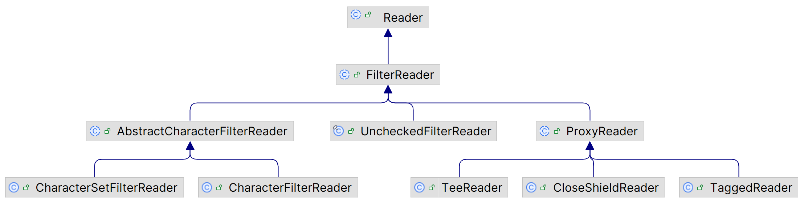
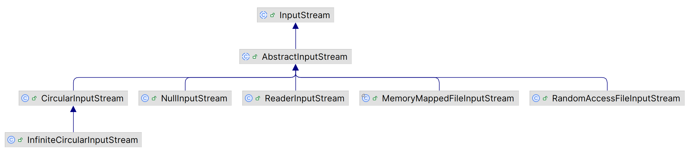

# Apache Commons IO

2025-07-18
update: 根据 commons-io 2.19.0 进行更新
2024-09-30
update: 根据最新版 commons-io 2.17.0 进行更新
2023-08-08
add: 完善内容
2022-11-30 ⭐
@author Jiawei Mao

****
## 1. 最佳实践

### java.io.File

我们经常需要处理文件和文件名，可能出错的地方有很多，例如：

- 在 Unix 中可以工作，在 Windows 中不能（反之亦然）
- 文件名因为双分隔符或缺少路径分隔符而无效

`java.io.File` 可以很好地处理上述许多情况，因此建议使用 `java.io.File` 作为文件名，而不是 `String`，以避免平台依赖问题。

commons-io 1.1 引入了 `FilenameUtils`，用于处理许多文件名问题，不过仍然建议尽可能使用 `java.io.File` 对象。例如：

```java
 public static String getExtension(String filename) {
   int index = filename.lastIndexOf('.');
   if (index == -1) {
     return "";
   } else {
     return filename.substring(index + 1);
   }
 }
```

看上去没问题，对不对？如果有人传递了完整路径，例如，"C:\Temp\documentation.new\README" 是一个完全合法的路径，上面定义的方法返回 "new\README"，显然不对。

因此强烈建议使用 `java.io.File` 作为文件名，而不是 `String`。`java.io.File` 的功能经过了很好的测试。在 `FileUtils` 类中可以找到其它有关 `java.io.File` 的实用函数。

不要用：

```java
String tmpdir = "/var/tmp";
String tmpfile = tmpdir + System.getProperty("file.separator") + "test.tmp";
InputStream in = new java.io.FileInputStream(tmpfile);
```

推荐用：

```java
File tmpdir = new File("/var/tmp");
File tmpfile = new File(tmpdir, "test.tmp");
InputStream in = new java.io.FileInputStream(tmpfile);
```

### Buffer Streams

**IO 性能**很大程度上取决于**缓冲策略**。通常，读取 512 或 1024 bytes 的数据包非常快，因为这与文件系统或文件系统硬盘使用的数据包大小匹配。

在读写 stream 时要求确保正确地缓冲 stream，特别是处理文件时。使用 `BufferedInputStream` 封装 `FileInputStream` 即可：

```java
 InputStream in = new java.io.FileInputStream(myfile);
 try {
   in = new java.io.BufferedInputStream(in);
   
   in.read(.....
 } finally {
   IOUtils.closeQuietly(in);
 }
```

> [!WARNING]
>
> 不要缓冲已经缓冲的流，有些组件（如 XML 解析器）可能已经缓冲，再次缓冲只会降低代码速度。

如果使用 commons-io 的 `CopyUtils` 或 `IOUtils`，不需要额外缓冲，方法内已经内嵌缓冲。

另外，使用 `ByteArrayOutputStream` **写入内存不需要缓冲**。

## 2. Utility

### IOUtils

`IOUtils` 包含读、写和复制功能，适用于 `InputStream`, `OutputStream`, `Reader` 和 `Writer`。

**示例：** 从 URL 读取 bytes 并打印

```java
InputStream in = new URL("https://commons.apache.org").openStream();
try {
    InputStreamReader inR = new InputStreamReader(in);
    BufferedReader buf = new BufferedReader(inR);
    String line;
    while ((line = buf.readLine()) != null) {
        System.out.println(line);
    }
} finally {
    in.close();
}
```

使用 `IOUtils` 执行相同功能：

```java
InputStream in = new URL("https://commons.apache.org").openStream();
try {
    System.out.println(IOUtils.toString(in));
} finally {
    IOUtils.closeQuietly(in);
}
```

在某些应用领域中，此类 IO 操作很常见，使用该类可以节省大量时间。commons-io 代码经过良好测试，值得信赖。

这个方法灵活、快速，但是缺点也很明显，如果读取 1GB 文件，会导致创建一个 1GB 的 `String`，**占内存**。

### FileUtils

`FileUtils` 包含处理 `File` 对象的方法，包括读、写、复制和比较功能。

**示例：** 逐行读取文件

```java
File file = new File("/commons/io/project.properties");
List lines = FileUtils.readLines(file, "UTF-8");
```

### FilenameUtils

`FilenameUtils` 类提供处理文件名的方法。该类在 Unix 和 Windows 中保持一致，以便在这些环境之间进行切换（例如从开发环境迁移到生产环境）。

**示例：** 规范文件名，删除多余的 `..` 号

```java
String filename = "C:/commons/io/../lang/project.xml";
String normalized = FilenameUtils.normalize(filename);
// result is "C:/commons/lang/project.xml"
```

### FileSystemUtils

`FileSystemUtils` 提供 JDK 不支持的**文件系统**相关功能。目前只有一个获取驱动空闲空间的方法。

```java
long freeSpace = FileSystemUtils.freeSpace("C:/");
```

> [!WARNING]
>
> 从 commons-io 2.6 开始不推荐使用，`java.nio.file.FileStore` 提供了相同功能。

```java
Files.getFileStore(Paths.get("/home")).getUsableSpace()
```

## 3. Endian

不同计算机的架构采用不同的字节顺序约定：

- 在 "Little Endian" 架构中（如 intel），lower-order 字节在内存中存储在较低地址，后续字节存储在较高内存地址。
- 对 "Big Endian" 架构（如 Motorola），则相反。

在 commons-io 中有两个相关类：

- `EndianUtils` 类包含一些静态方法，用于转换 Java 基本类型和 Stream 的 Endian
- `SwappedDataInputStream` 类实现 `DataInput` 接口，可以从 non-native Endian 文件读取数据

参考：http://www.cs.umass.edu/~verts/cs32/endian.html

## 4. Line Iterator

`org.apache.commons.io.LineIterator` 提供了逐行读取文件的功能。可以通过 `FileUtils` 或 `IOUtils` 的工厂方法创建该类实例。

推荐使用模式：

```java
try (LineIterator it = FileUtils.lineIterator(file, "UTF-8")) {
    while (it.hasNext()) {
        String line = it.nextLine();
        /// do something with line
    }
}
```


## 5. File Filters

`org.apache.commons.io.filefilter`  包定义了接口 `IOFileFilter`，它结合 `java.io.FileFilter` 和 `java.io.FilenameFilter`。此外，该包还提供了一系列 `IOFileFilter` 实现，还可以组合 `IOFileFilter`。

## 6. File Comparators

`org.apache.commons.io.comparator` 包为 `java.io.File` 提供了许多 `java.util.Comparator` 实现。这些 comparators 可用于文件排序。

## 7. Stream

`org.apache.commons.io.input` 和 `org.apache.commons.io.output` 包含多种 stream 实现。包括：

- Null output stream
- Tee output stream: 将输出数据发送到两个流，而不是一个流
- Byte array output stream: 比 JDK 版本更快
- Counting stream: 计算传递的字节数
- Proxy stream: 将任务委托给代理方法
- Lockable writer: 使用锁文件提供同步写操作

### reader

#### FilterReader



`FilterReader` 为 JDK 提供的过滤字符串流的抽象类，该默认实现不执行任何过滤。

`AbstractCharacterFilterReader` 在 `FilterReader`的基础上添加了 `IntPredicate` 字段，用于判断字符是否通过过滤， 其子类：

- `CharacterFilterReader` 过滤单个字符
- `CharacterSetFilterReader` 过滤多个字符


`ProxyReader` 就是代理类，其方法调用转发到底层 `Reader`，其实现类：

- `TeeReader` 将从 `Reader` 中读取的字符转发到另一个 `Writer`
- `CloseShieldReader` 可以防止底层的 `Reader` 被关闭。
- `TaggedReader` 可以标记异常


#### ReversedLinesFileReader

类似 `BufferedReader` ，但是从最后一行开始。例如，可用于日志文件搜索。使用方法：

```java
try (ReversedLinesFileReader reader = ReversedLinesFileReader.builder()
.setPath(path)
.setBufferSize(4096)
.setCharset(StandardCharsets.UTF_8)
.get()) {
   reader.forEach(line -> System.out.println(line));
}
```


### InputStream



#### PeekableInputStream

## 8. Buffer

### CircularByteBuffer

可以循环使用的 ByteBuffer：写入和读出循环使用。

## 9. 参考

- https://commons.apache.org/proper/commons-io/
