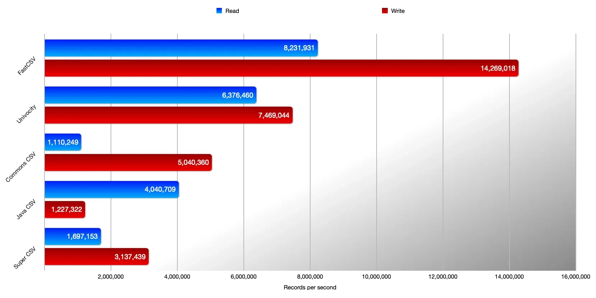

# FastCSV

2025-11-24: update to 4.1.0
2024-09-30 ⭐
@author Jiawei Mao

***

## 1. 简介

FastCSV 是一个高性能的 CSV IO 工具。

```xml
<dependency>
    <groupId>de.siegmar</groupId>
    <artifactId>fastcsv</artifactId>
    <version>4.1.0</version>
</dependency>
```

## 2. 快速入门

### 2.1 输出 CSV

`CsvWriter` 类用于输出 CSV 文件，该类采用 fluent-API 设计。例如：

```java
Path file = Paths.get("output.csv");
try (CsvWriter csv = CsvWriter.builder().build(file)) {
    csv
        .writeRecord("header 1", "header 2")
        .writeRecord("value 1", "value 2");
}
```

### 2.2 读取 CSV

FastCSV 提供了两个读取 CSV 记录的类：`CsvReader` 和 `IndexedCsvReader`。

#### 顺次读取 record

`CsvReader` 按顺序读取 csv record。示例：

```java
Path file = Paths.get("input.csv");
try (CsvReader<CsvRecord> csv = CsvReader.builder().ofCsvRecord(file)) {
    csv.forEach(System.out::println);
}
```

- 读取带 header 的 CSV 文件：

```java
Path file = Paths.get("input.csv");
try (CsvReader<NamedCsvRecord> csv = CsvReader.builder().ofNamedCsvRecord(file)) {
    csv.forEach(rec -> System.out.println(rec.getField("foo")));
}
```

`ofCsvRecord()` 和 `ofNamedCsvRecord()` 都提供了其它输入源的重载方法，包括 `Reader`, `String`, `InputStream` 等。

使用通用的 `build` 方法，还可以利用 callback 机制来处理 records。

#### 按页读取 record

`IndexedCsvReader` 按页读取 records。适合一次读取一个子集。

例如，读取 CSV 文件最后一页：

```java
Path file = Paths.get("input.csv");
try (IndexedCsvReader<CsvRecord> csv = IndexedCsvReader.builder().pageSize(10).ofCsvRecord(file)) {
    CsvIndex index = csv.getIndex();
    int lastPage = index.getPageCount() - 1;
    List<CsvRecord> csvRecords = csv.readPage(lastPage);
}
```

## 3. 基础教程

下面介绍 FastCSV 的基本用法。

### CsvReader 示例

#### 从 String 读取

```java
CsvReader.builder().ofCsvRecord("foo1,bar1\nfoo2,bar2")
    .forEach(System.out::println);
```

#### 从 File 读取

```java
try (CsvReader<CsvRecord> csv = CsvReader.builder().ofCsvRecord(file)) {
    csv.forEach(System.out::println);
}
```

#### 读取带 header 的 CSV 数据

```java
CsvReader.builder().ofNamedCsvRecord("header 1,header 2\nfield 1,field 2")
    .forEach(rec -> System.out.println(rec.getField("header 2")));
```

#### 自定义 header

```java
NamedCsvRecordHandler callbackHandler = NamedCsvRecordHandler.builder()
    .header("header 1", "header 2")
    .build();

CsvReader.builder().build(callbackHandler, "field 1,field 2")
    .forEach(rec -> System.out.println(rec.getField("header 2")));
```

#### 自定义设置

```java
CsvReader.builder()
    .fieldSeparator(';')
    .quoteCharacter('"')
    .commentStrategy(CommentStrategy.SKIP)
    .commentCharacter('#')
    .skipEmptyLines(true)
    .allowExtraFields(false)
    .allowMissingFields(false)
    .allowExtraCharsAfterClosingQuote(false)
    .detectBomHeader(false)
    .maxBufferSize(16777216);
```

### IndexedCsvReader 示例

按页读取 CSV 文件：

```java
try (IndexedCsvReader<CsvRecord> csv = IndexedCsvReader.builder().ofCsvRecord(file)) {
    CsvIndex index = csv.getIndex();

    System.out.println("Items of last page:");
    int lastPage = index.getPageCount() - 1;
    List<CsvRecord> csvRecords = csv.readPage(lastPage);
    csvRecords.forEach(System.out::println);
}
```

### CsvWriter 示例

#### 输出到 Writer

```java
var sw = new StringWriter();
CsvWriter.builder().build(sw)
    .writeRecord("header 1", "header 2")
    .writeRecord("value 1", "value 2");

System.out.println(sw);
```

#### 输出到 file

```java
try (CsvWriter csv = CsvWriter.builder().build(file)) {
    csv
        .writeRecord("header 1", "header 2")
        .writeRecord("value 1", "value 2");
}
```

#### 自定义设置

```java
CsvWriter.builder()
    .fieldSeparator(',')
    .quoteCharacter('"')
    .quoteStrategy(QuoteStrategies.ALWAYS)
    .commentCharacter('#')
    .lineDelimiter(LineDelimiter.LF);
```

## 4. 架构和设计

### 设计目标

FastCSV 以高性能和轻量级为目标而设计：

- 高性能（见下图）
- 轻量级：无其它依赖项，大小仅 64 KB
- 符合 RFC-4180 CSV 规范



### 架构

根据 CSV 规范 RFC 4180，先给出 CSV 相关的术语：

- **Line**: 以换行符结尾的字符串，换行符默认为 `\r\n`
- **Record**: 以字段分隔符分隔的字段集合
- **Field**: 表示 CSV record 的一个值，如果用引号括起来，一个字段可以跨越多行
- **Field Separator**: 用来区分 record 中不同字段的字符，即字段分隔符。默认为 `,`
- **Quote Character**: 用于封装 field，默认为双引号 `"`

### 读 CSV

读 CSV 涉及如下组件：

- `CsvReader`

`CsvReader` 为读取 CSV 数据的入口，通过 builder pattern 配置，提供设置 CSV 格式规范和解析行为。

`CsvReader` 使用 `CsvParser` 解析数据，使用 `CsvCallbackHandler` 处理 field 和 record。

`CsvReader` 通过 `Iterable` 接口返回 CSV  record。

- `CsvReaderBuilder`

`CsvReaderBuilder` 用于简化 `CsvReader` 的配置，帮助用于指定 CSV 格式和解析行为。其主要目的是以指定配置实例化 `CsvParser` 和 `CsvReader`。

- `CsvParser`

`CsvParser` 封装了解析 CSV 数据的底层逻辑。`CsvParser` 不适合直接使用。对每个 field，`CsvParser` 触发 `CsvCallbackHandler` 处理 field。此外，`CsvParser` 还负责处理换行符。

- `CsvCallbackHandler`

作为 `CsvReader` 和 `CsvParser` 之间的接口，`CsvCallbackHandler` 负责处理 fieldfs。解析完一个 record 的所有 fields 后，启用 `CsvCallbackHandler`。它可以利用 `FieldModifier` 修改字段，如去除首尾空格、改变大小写等。

`CsvRecordCallbackHandler` 为 `CsvCallbackHandler` 的一个实现，将解析的内容转换为 `CsvRecord` 对象。

- `FieldModifier`

`FieldModifier` 用于修改字段，提供修改 field 功能。

- `CsvRecord`

`CsvRecord` 表示单个 csv record，提供访问 field 的功能，由 `CsvRecordCallbackHandler` 创建。

这些类的**工作流程**：

- 使用 `CsvReaderBuilder` 配置 `CsvReader`
- 为 `CsvCallbackHandler` 提供自定义 `CsvCallbackHandler`，或使用默认 `CsvCallbackHandler` 
- `CsvReaderBuilder` 以指定设置实例化 `CsvParser` 和 `CsvReader`，返回实现 `Iterable` 接口的 `CsvReader` 对象
- 迭代时，`CsvReader` 通过 `CsvParser` 读取下一个 record
- `CsvParser` 将读取的 fields 发送给 `CsvCallbackHandler`，直到 record 末尾
- 对接收的每个 field，`CsvCallbackHandler` 调用 `FieldModifier` 修改 field 并存储到缓存
- `CsvReader` 调用 `CsvCallbackHandler` 将其缓存内容转换为 record，如 `CsvRecord`，并返回给用户

使用 `CsvReader` 的基本示例：

```java
try (CsvReader<CsvRecord> csv = CsvReader.builder().ofCsvRecord(file)) {
    csv.forEach(System.out::println);
}
```

解释：

- 使用 `CsvReader.builder()` 工厂方法一默认设置实例化 `CsvReaderBuilder`
- `ofCsvRecord()` 使用默认设置初始化 `CsvRecordCallbackHandler`，打开指定 csv 文件，初始化 `CsvParser` 和 `CsvReader`，并返回 `CsvReader`
- 通过调用 `forEach` 迭代 `Iterable` 对象
- 由于 `CsvReader` 实现了 `AutoCloseable` 接口，因此可以使用  `try-with`  语句来关闭打开的文件

使用显式设置获得相同效果：

```java
// Configures a reusable CsvReaderBuilder with default, but explicitly defined settings.
CsvReaderBuilder builder = CsvReader.builder()
    .fieldSeparator(',')
    .quoteCharacter('"');

// Use a "no operation" FieldModifier, which does not modify fields.
FieldModifier fieldModifier = FieldModifiers.NOP;

// Initializes a callback handler for CsvRecord objects and set the field modifier.
CsvCallbackHandler<CsvRecord> callbackHandler = new NamedCsvRecordHandler(fieldModifier);

// Use the builder to instantiate a CsvReader while passing the callback handler and the CSV file.
try (CsvReader<CsvRecord> csv = builder.build(callbackHandler, file)) {
    for (CsvRecord record : csv) {
        System.out.println(record);
    }
}
```

### 写 CSV

与读取 CSV 相比，输出 CSV 要简单很多。涉及如下组件：

- `CsvWriter`

`CsvWriter` 是输出 CSV 数据的入口，协调整个过程。也是通过 builder pattern 配置。

- `CsvWriterBuilder`

用于配置和实例化 `CsvWriter`。

- `QuoteStrategy`

用于确定是否对 field 加引号。

这些类的**工作流程**：

- 使用 `CsvWriterBuilder` 配置并实例化 `CsvWriter`
- `CsvWriter`将 record 写入文件，根据需要对 field 加引号
- `CsvWriter` 关闭文件

示例：

```java
try (CsvWriter csv = CsvWriter.builder().build(file)) {
    csv.writeRecord("field 1", "field 2");
}
```

说明：

- `CsvWriter.builder()` 工厂方法以默认设置实例化 `CsvWriterBuilder`
- `build()` 打开指定 csv 文件，初始化 `CsvWriter` 并返回
- 用户通过调用 `CsvWriter` 的 `writeRecord()` 方法输出 record
- `CsvWriter` 也实现了 `AutoCloseable` 接口，用户可以使用 `try-with` 关闭文件

默认配置的显式实现：

```java
CsvWriterBuilder builder = CsvWriter.builder()
    .fieldSeparator(',')
    .quoteCharacter('"');

try (CsvWriter csv = builder.build(file)) {
    csv.writeRecord("field 1", "field 2");
}
```

## 5. CSV 解释

CSV 格式很简单，但是有很多细节需要考虑。

### RFC 状态

RFC4180 可以追溯到 2005 年，最初采用 US-ASCII 字符串，而现在 UTF-8 成为 CSV 文件的标准编码。

RFC4180 的原作者和 FastCSV 的开发者对 RFC4180 进行了彻底的修订，重点解决实际应用中的许多边缘情况。

TFC4180-bis 的草案可以在 https://datatracker.ietf.org/doc/html/draft-shafranovich-rfc4180-bis 查看。

目前该草案正在由 IETF 审查。

### 实现细节

#### Encoding

RFC 4180 采用 US-ASCII，RFC 4180-bias 采用 UTF-8.

FastCSV 在读写 CSV 文件时指定任何编码，默认 UTF-8.

#### Empty fields / null values

csv 格式本身不提供区分 empty 值和 null 值的方法。当需要区分时，这可能是一个问题。

FastCSV 提供如下处理 null 值的选项：

**Writing**: 根据 `QuoteStrategy` 设置，null 值输出为 empty-field (默认)或引号括起来的 empty-field (`QuoteStrategies.EMPTY`)。例如，这有助于生成与 Postgres 兼容的 CSV 文件。如果希望将 null 输出为特定字符串，则需要将该字符串传递给 `CsvWriter.writeRecord()` 方法。

**Reading**: `CsvCallbackHandler.addField()` 有一个 `quoted` 参数，表示 field 是否带引号。标准 record 实现 `CsvRecord` 本身没有提供区分 empty 和 null 的方法，但自定义实现可以根据 `quoted` 参数来实现。

empty 和 quoted empty 的区别：

```csv
1,,fooCRLF
2,"",barCRLF
```

#### newline after last record

RFC 4180：不强制要求最后一个 record 包含换行符

RFC 4180-bis: 文件中最后一个 record **必须**包含换行符。

这个改变是为了消除歧义。例如，如果每个 record 只有一个 field，如果不要求包含换行符，就不确定最后一个是否包含一个 empty field:

```csv
fooCRLF
barCRLF
```

FastCSV 采用 RFC 4180-bis 规范，每条 record 后面必须包含换行符。

#### Different field count

RFC 要求每条 record 包含相同数量的 fields。

但是，在实践中，总会出现 field 缺失情况。例如：

```csv
header_a,header_bCRLF
value_a_1CRLF
value_a_2,value_b_2CRLF
```

其中 `value_a_1` 可以属于 header_a，此时 `header_b` 没有值。

FastCSV 通过 `CsvReaderBuilder.ignoreDifferentFieldCount(boolean)` 设置是否忽略 fields 数量不一致的情况。如果不忽略，遇到 fields 数目不一致时抛出错误。

#### Empty lines

如果不要求 record 的 fields 数量一致，就可能出现完全空的 record，对只有一个 column 的 CSV 文件，就需要判断是 record 为空还是 field 为空。

```csv
value_1CRLF
CRLF
value_2CRLF
```

FastCSV 默认跳过 empty lines (`CsvReaderBuilder.skipEmptyLines(boolean)`)。读取上面完成返回两个 records, `value_1` 和 `value_2`。

如果读取 empty lines，就返回 3 个 records: `value_1`, `""` 和 `value_2`。

#### Empty files

对空文件，FastCSV 返回空的 stream。

#### Fields spanning multiple lines

用双引号括起来的 field 可以跨越多行。

```
"a multi-lineCRLF
field"CRLF
```

FastCSV 支持多行 field 的读写。该 field 的 Java 值为 `"a multi-line\r\nfield"`。保留 field 内部的换行符。

#### Unique header names

> [!NOTE]
>
> RFC: CSV 解析器的实现者应该明白，有些应用程序将 headers 视为 unique 值（可能区分大小写）。

```
header_a,header_aCRLF
value_1,value_2CRLF
```

FastCSV 的 `NamedCsvRecord` 提供了几个选项来处理这种情况：

- `getField("header_a")`, `findField("header_a")` 和 `getFieldsAsMap()` 都值返回第一个值 `"value_1"`
- `findFields("header_a")` 和 `getFieldsAsMapList()` 返回包含所有值 `"value_1"` 和 `"value_2"` 的 list

不论哪种选项，FastCSV 都区分大小写。

#### Spaces within fields

> [!NOTE]
>
> RFC: spaces 是 field 的一部分，不能忽略

FastCSV 根据 RFC 规范，读取和写入字段时都会包含 spaces (leading and trailing)。

在读取 CSV 文件时，可以配置 `FieldModifier`，以去掉开头和结尾的 spaces。例如：

```java
var handler = new CsvRecordHandler(FieldModifiers.TRIM);
CsvReader.builder().build(handler, " foo , bar ")
    .forEach(System.out::println);
```

输出不包含 spaces 的 `"foo"` 和 `"bar"`。

#### Whitespace outside quoted fields

> [!NOTE]
>
> RFC: 当使用带引号的 field，不允许在引号和逗号之间有 whitespaces。

FastCSV 严格遵循这一要求：从不在引号和逗号直接输出 whitespaces。

那么，FastCSV 在读取 CSV 文件时如何处理：

```
"value 1","value 2" , "value 3"CRLF
```

此时：

1. 引号字段 `"value 1"` 没问题
2. 后面包含空格的引号字段 `"value 2"_`，后面 `_` 表示空格

FastCSV 默认保留引号后面的字符，包括空格。该字段的 java 值为 `"value 2 "` (不带引号)。这个宽松的行为可以通过 `CsvReaderBuilder.acceptCharsAfterQuotes(false)` 禁用，在遇到这类字段时就会抛出错误。

3. 前面包含空格的引号字段 `_"value 3"`

对应 Java 字段为 `" value 3"` (包含引号)。这么处理的理由：

- 不忽略空格的原则，其实引号是字段的一部分，而不是将字段括起来
- 有些 CSV 实现不使用引号，因此假设引号后面为字段不安全
- 处于性能考虑，当第一个字符不是引号，FastCSV 切换到无引号字段解析

#### Other field enclosures

除了双引号，RFC 没有提到其它用于包含 field 的字符。

FastCSV 支持任何字符作为 field 的包含字符。

#### Other field separators

FastCSV 支持任何字符作为 field separator。

#### Escaping double quotes

FastCSV 只支持用另一个双引号来转义双引号。

#### BOM header

FastCsv 能够处理包含 BOM header 的 CSV 文件。

> [!NOTE]
>
> BOM (byte order mark) header 是文本文件开头 2-4 **字节序列**，用于指示文件 Unicode 编码，如 UTF-8, UTF-16, UTF-32 等。对 UTF-16 和 UTF-32，BOM header 还表示 byte ordre (big endian 或 little-endian)。
>
> 虽然目前大部分文本文件采用 UTF-8 编码，但还是有一些程序采用 BOM header 来指定文件编码

- 通过 `CsvReaderBuilder.detectBomHeader(true)` 启用 BOM header 检测，就可以读取带 BOM header 的 CSV 文件。由于 BOM header 在现代应用中使用较少，且检测 BOM header 会影响性能，因此该功能默认禁用。

- FastCSV 不支持输出 BOM header，主要因为现在编码基本采用 UTF-8

下表为 FastCSV 可以检测的不同 Unicode 编码的 BOM header：

| Encoding    | BOM header (hex) |
| ----------- | ---------------- |
| UTF-8       | `EF BB BF`       |
| UTF-16 (BE) | `FE FF`          |
| UTF-16 (LE) | `FF FE`          |
| UTF-32 (BE) | `00 00 FE FF`    |
| UTF-32 (LE) | `FF FE 00 00`    |

解析带 BOM header 文件示例：

```java
import de.siegmar.fastcsv.reader.CsvReader;
import de.siegmar.fastcsv.reader.CsvRecord;
import de.siegmar.fastcsv.writer.CsvWriter;

import java.io.IOException;
import java.io.OutputStreamWriter;
import java.nio.file.Files;
import java.nio.file.Path;
import java.util.stream.Stream;

import static java.nio.charset.StandardCharsets.UTF_16LE;

public class ExampleCsvReaderWithBomHeader {

    public static void main(final String[] args) throws IOException {
        final Path testFile = prepareTestFile();

        final CsvReader.CsvReaderBuilder builder = CsvReader.builder()
                .detectBomHeader(true); // 启用 BOM header 检测

        try (Stream<CsvRecord> csv = builder.ofCsvRecord(testFile).stream()) {
            csv.forEach(System.out::println);
        }
    }

    // 创建一个 CSV 文件，用 BOM header 指定编码为 UTF-16 little-endian
    static Path prepareTestFile() throws IOException {
        final Path tmpFile = Files.createTempFile("fastcsv", ".csv");
        tmpFile.toFile().deleteOnExit();

        try (var out = Files.newOutputStream(tmpFile);
             var csv = CsvWriter.builder()
                     .build(new OutputStreamWriter(out, UTF_16LE))) {

            // 手动输出 UTF-16LE BOM header
            out.write(new byte[]{(byte) 0xff, (byte) 0xfe});

            csv.writeRecord("a", "o", "u");
            csv.writeRecord("ä", "ö", "ü");
        }

        return tmpFile;
    }
}
```

> [!NOTE]
>
> FastCSV 不支持创建包含 BOM header 的 csv 文件，所以上面是手动输出 BOM header 字节。

#### Comments

使用 `CsvWriter.writeComment(String)` 输出注释 line。如果 `String` 包含换行符，FastCSV 会自动在每行前面加上注释字符。

例如，`writeComment("foo\nbar")` 输出：

```
#fooCRLF
#barCRLF
```

在输出常规 csv record 时，如果第一个字段以注释字符开头，FastCSV 会自动将其放在双引号中。例如，`writeRecord("#foo", "#bar")` 输出为：

```
"#foo",#barCRLF
```

在读 CSV 文件时，FastCSV 默认启用注释处理。使用 `CsvReaderBuilder.commentStrategy()` 配置：

- `CommentStrategies.NONE`，禁用注释处理，将其作为常规 record 读取（默认）
- `CommentStrategies.READ`，
- `CommentStrategies.SKIP`

## 6. 示例

### Bean Mapping

许多 csv 库都支持将 csv record 映射为 Java Bean。该功能很方便，但大多数库使用基于反射的方法性能较低，这与 FastCsv 的设计目标矛盾。

FastCSV 通过 java stream mapping 提供类似功能，而无需牺牲性能。

```java
import java.io.IOException;
import java.util.stream.Stream;

import de.siegmar.fastcsv.reader.CsvReader;
import de.siegmar.fastcsv.reader.NamedCsvRecord;

/// Example for reading CSV data with a mapping function.
///
/// FastCSV supports Java 17 and later, but this code uses Java 25
/// for brevity, leveraging newer language features.
void main() throws IOException {
    try (var persons = readPersons()) {
        persons.forEach(IO::println);
    }
}

Stream<Person> readPersons() throws IOException {
    final String data = """
        ID,firstName,lastName
        1,John,Doe
        2,Jane,Smith
        """;

    try (var csv = CsvReader.builder().ofNamedCsvRecord(data)) {
        return csv.stream().map(this::mapPerson);
    }
}

Person mapPerson(final NamedCsvRecord rec) {
    return new Person(
        Long.parseLong(rec.getField("ID")),
        rec.getField("firstName"),
        rec.getField("lastName")
    );
}

record Person(long id, String firstName, String lastName) {
}
```

### 自定义 callback

一般用 `ofCsvRecord()` 或 `ofNamedCsvRecord` 读取 CSV 文件，分别返回 `CsvRecord` 和 `NamedCsvRecord` 对象。

FastCSV 在底层使用 callback 处理数据。

使用自定义 callback 处理数据更灵活：

```java
import java.io.IOException;
import java.io.UncheckedIOException;
import java.nio.file.Files;
import java.nio.file.Path;
import java.time.Duration;
import java.time.LocalDateTime;
import java.util.Random;
import java.util.function.Function;
import java.util.function.Supplier;
import java.util.stream.Stream;

import ch.randelshofer.fastdoubleparser.JavaDoubleParser;
import de.siegmar.fastcsv.reader.AbstractBaseCsvCallbackHandler;
import de.siegmar.fastcsv.reader.CsvReader;
import de.siegmar.fastcsv.reader.NamedCsvRecord;
import de.siegmar.fastcsv.reader.RecordWrapper;
import de.siegmar.fastcsv.writer.CsvWriter;

/**
 * 自定义 callback handler
 * <p>
 * 只有在需要充分发挥性能，并且 I/O 和后处理不是瓶颈的情况下，才建议自定义 callback.
 *
 * 标准实现 ({@link de.siegmar.fastcsv.reader.CsvRecordHandler}) 对大多数情况来说，已经足够快了。
 *
 * <p>
 * 下表是对 10 亿 records (86G) 的比较结果：
 * <table>
 *     <tr>
 *         <td>Standard stream-based Mapper (with standard Java Parser)</td>
 *         <td>11m 48s (1.41 M records/s) – baseline</td>
 *     </tr>
 *     <tr>
 *         <td>Standard stream-based Mapper (with FastNumberParser)</td>
 *         <td>4m 25s (3.77 M records/s) – 63% faster than baseline</td>
 *     </tr>
 *     <tr>
 *         <td>Custom Mapper (with FastNumberParser)</td>
 *         <td>3m 2s (5.49 M records/s) – 74% faster than baseline</td>
 *     </tr>
 * </table>
 * <p>
 * 可以发现，对性能影响最大的是数字解析。
 */
public class ExampleCsvReaderWithCustomCallbackHandler {

    /**
     * 一百万 records，大概 72MB，保存到临时文件。
     */
    private static final int RECORDS_TO_PRODUCE = 1_000_000;

    private static final Random RND = new Random();

    public static void main(final String[] args) throws IOException {
        // prepare a large fake dataset with temperature measurements
        final Path testFile = produceLargeFakeDataset();

        System.out.println("Mapping data with stream handler:");
        read(() -> streamMapper(testFile, mapWithStandardDoubleParser()));

        System.out.println("Mapping data with stream handler (and FastNumberParser):");
        read(() -> streamMapper(testFile, mapWithFastNumberParser()));

        System.out.println("Mapping data with custom callback handler (and FastNumberParser):");
        read(() -> customMapper(testFile));
    }

    private static void read(final Supplier<Stream<Measurement>> streamSupplier) {
        final LocalDateTime start = LocalDateTime.now();
        try (Stream<Measurement> stream = streamSupplier.get()) {
            System.out.printf("Duration to map %,d records: %s%n%n",
                    stream.count(), Duration.between(start, LocalDateTime.now()));
        }
    }

    private static Stream<Measurement> customMapper(final Path testFile) {
        try {
            return CsvReader.builder().build(new MeasurementCallbackHandler(), testFile).stream();
        } catch (final IOException e) {
            throw new RuntimeException(e);
        }
    }

    private static Stream<Measurement> streamMapper(final Path testFile,
            final Function<NamedCsvRecord, Measurement> mapper) {
        try {
            return CsvReader.builder().ofNamedCsvRecord(testFile).stream().map(mapper);
        } catch (final IOException e) {
            throw new UncheckedIOException(e);
        }
    }

    private static Function<NamedCsvRecord, Measurement> mapWithStandardDoubleParser() {
        return record -> new Measurement(
                Long.parseLong(record.getField("ID").substring(3)),
                Long.parseLong(record.getField("Timestamp")),
                Double.parseDouble(record.getField("Latitude")),
                Double.parseDouble(record.getField("Longitude")),
                Double.parseDouble(record.getField("Temperature")));
    }

    private static Function<NamedCsvRecord, Measurement> mapWithFastNumberParser() {
        return record -> new Measurement(
                FastNumberParser.parseLong(record.getField("ID").substring(3)),
                FastNumberParser.parseLong(record.getField("Timestamp")),
                FastNumberParser.parseDouble(record.getField("Latitude")),
                FastNumberParser.parseDouble(record.getField("Longitude")),
                FastNumberParser.parseDouble(record.getField("Temperature")));
    }

    /**
     * 创建数据集
     * <p>
     * 包含标题，共 4 列:
     * <ul>
     *     <li>ID</li>
     *     <li>Timestamp</li>
     *     <li>Longitude</li>
     *     <li>Latitude</li>
     *     <li>TemperatureUnit</li>
     *     <li>Temperature</li>
     * </ul>
     * <p>
     * 该文件在 JVM 退出时自定删除。
     *
     * @return path to the created file
     * @throws IOException if an I/O error occurs
     */
    private static Path produceLargeFakeDataset() throws IOException {
        final Path tmpFile = Files.createTempFile("fastcsv", ".csv");
        tmpFile.toFile().deleteOnExit();

        final long currentTime = System.currentTimeMillis();
        final long yearInMillis = Duration.ofDays(365).toMillis();

        System.out.printf("Creating file %s with %,d records...%n", tmpFile, RECORDS_TO_PRODUCE);

        try (CsvWriter csv = CsvWriter.builder().build(tmpFile)) {
            csv.writeRecord("ID", "Timestamp", "Longitude", "Latitude", "TemperatureUnit", "Temperature");

            for (int i = 0; i < RECORDS_TO_PRODUCE; i++) {
                final String measuringStationId = "ID-" + i;
                final long timestamp = currentTime - RND.nextLong(yearInMillis);
                final double latitude = RND.nextDouble() * 180 - 90;
                final double longitude = RND.nextDouble() * 360 - 180;
                final double temperature = RND.nextDouble() * 150 - 90;

                csv.writeRecord(measuringStationId,
                        Long.toString(timestamp),
                        Double.toString(latitude),
                        Double.toString(longitude),
                        "Celsius",
                        Double.toString(temperature));
            }
        }

        System.out.printf("File %s with %,d records and %,d bytes created%n%n",
                tmpFile, ExampleCsvReaderWithCustomCallbackHandler.RECORDS_TO_PRODUCE, Files.size(tmpFile));

        return tmpFile;
    }

    private static final class MeasurementCallbackHandler extends AbstractBaseCsvCallbackHandler<Measurement> {

        private long recordCount;

        private long id;
        private long timestamp;
        private double latitude;
        private double longitude;
        private double temperature;

        @SuppressWarnings("checkstyle:InnerAssignment")
        @Override
        public void handleField(final int fieldIdx, final char[] buf, final int offset, final int len,
                final boolean quoted) {

            if (recordCount == 0) {
                // Skip header
                return;
            }

            // As we're implementing a custom callback handler, we have to check length constraints ourselves
            if (len > 100) {
                throw new IllegalStateException("Field too long: %d, starting line: %d"
                        .formatted(len, getStartingLineNumber()));
            }

            // We expect fields are: ID, Timestamp, Latitude, Longitude, TemperatureUnit, Temperature

            switch (fieldIdx) {
                case 0 -> id = materializeId(buf, offset, len);
                case 1 -> timestamp = FastNumberParser.parseLong(buf, offset, len);
                case 2 -> latitude = FastNumberParser.parseDouble(buf, offset, len);
                case 3 -> longitude = FastNumberParser.parseDouble(buf, offset, len);
                case 4 -> {
                    // Skip temperature unit
                }
                case 5 -> temperature = FastNumberParser.parseDouble(buf, offset, len);
                default -> throw new IllegalStateException("Unexpected column: %d, starting line: %d"
                        .formatted(fieldIdx, getStartingLineNumber()));
            }
        }

        private long materializeId(final char[] buf, final int offset, final int len) {
            final int prefixLength = "ID-".length();
            if (len <= prefixLength) {
                throw new IllegalStateException("ID too short: %d, starting line: %d"
                        .formatted(len, getStartingLineNumber()));
            }
            return FastNumberParser.parseLong(buf, offset + prefixLength, len - prefixLength);
        }

        @Override
        protected RecordWrapper<Measurement> buildRecord() {
            if (recordCount++ == 0) {
                // Skip header
                return null;
            }

            if (getFieldCount() != 6) {
                throw new IllegalStateException("Expected 6 fields, but got %d, starting line: %d"
                        .formatted(getFieldCount(), getStartingLineNumber()));
            }

            return wrapRecord(new Measurement(id, timestamp, latitude, longitude, temperature));
        }

    }

    private record Measurement(long id, long timestamp, double latitude, double longitude, double temperature) {
    }

    // Use JavaDoubleParser instead of Double.parseDouble() for way better performance
    // see https://github.com/wrandelshofer/FastDoubleParser
    private static final class FastNumberParser {

        private static long parseLong(final String str) {
            long result = 0;
            for (int i = 0; i < str.length(); i++) {
                result = result * 10 + str.charAt(i) - '0';
            }

            return result;
        }

        private static long parseLong(final char[] buf, final int offset, final int len) {
            long result = 0;
            for (int i = 0; i < len; i++) {
                result = result * 10 + buf[offset + i] - '0';
            }

            return result;
        }

        private static double parseDouble(final String str) {
            return JavaDoubleParser.parseDouble(str);
        }

        private static double parseDouble(final char[] buf, final int offset, final int len) {
            return JavaDoubleParser.parseDouble(buf, offset, len);
        }

    }
}
```

### 处理 comments

注释 line 一般在开头用 `#` 标识，FastCSV 也是如此。FastCSV 支持自定义注释标识符，采用 `CsvReaderBuilder` 或 `CsvWriterBuilder` 的 `commentCharacter(char)` 方法设置。

下面是一个包含注释的 CSV 文件：

```
#This is a comment
field 1,field 2,field 3
```

下面是一种更复杂的情况：

```
#This is a comment
field 1,"field 2 with a # character","field 3
#This is not a comment, but part of the third field that spans multiple lines"
```

第二个 `#` 不是标识注释，而是跨行 field 的内容。

### 跳过非 csv head

有些 CSV 文件在实际 CSV 数据之前包含一行或多行文字。例如：

```csv
This is an example of a CSV file that contains
three lines before the actual CSV records.

header 1,header 2
value 1,value 2
```

严格来说，这不是一个有效 CSV 文件。

这些文件的主要问题：

- 在处理字段名称时，将第一行作为标题
- 除非设置 `allowExtraFields(true)`，否则报错

FastCSV 提供了两个功能来处理此类文件：

- `skipLines(int lineCount)`：跳过指定数量 `lineCount` 的 lines，不管其内容
- `skipLines(Predicate<String> predicate, int maxLines)`：跳过 lines 直到找到特定 line。在特定行数后停止跳过


## 7. 参考

- https://fastcsv.org/