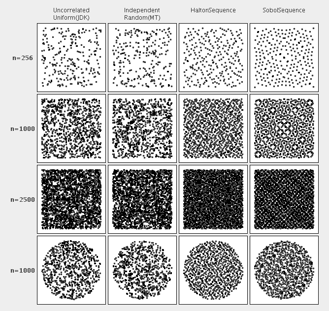

# 生成随机数

2026-03-19⭐
@author Jiawei Mao
***
## 使用总结

随机数：`RandomDataGenerator`


## 简介

hipparchus-core 模块中的 `org.hipparchus.random` 包含以下实用工具：

- 生成随机数
- 生成随机向量
- 生成随机字符串
- 生成随机样本和排列
- 分析输入文件中数组的分布，并生成与文件中数值“相似”的数值
- 为分组频率分布或直方图生成数据

数据生成工具使用的随机数据源是可插拔的。在大多数情况下，默认使用 Well 生成器。凡是提供默认值的地方，javadoc 都会明确标准默认生成器类型。该库在还提供了其他适用于蒙特卡洛分析（但不适用于密码学）的优秀 PRNG。

下面演示如何使用 Hipparchus API 生成不同类型的随机数据。这些示例都使用 JDK 自带的默认 PRNG。要使其它 PRNG，只需要将无参构造函数调用替换为包含 `RandomGenerator` 参数的调用。

## 随机数

`RandomDataGenerator` 类实现了生成随机数序列的各类方法。这些方法的 API 使用了以下概念：

### 来自概率分布的随机数序列

不存在单一的"随机数"，生成的是看起来随机的数字序列。使用内置的 JDK 函数 `Math.random()` 时，生成的数值序列服从**均匀分布**，即数值均匀分布在区间 [0,1) 内，任意等长区间包含生成数值的概率相同。

**概率分布**的数学概念的含义：在随机变量可能取值的集合中，不同区间包含该变量的概率各不相同。Hipparchus 支持从 `distributions` 包中的各种分布生成随机序列。

`RandomDataGenerator` 中 `nextXxx` 方法的 javadoc 描述了用于生成随机偏差的算法。`nextXxx` 方法支持直接获取随机偏差，而无需实例化分布。例如，获取服从均值为 3、标准差为 1.5 的正态分布的随机值：

```java
RandomDataGenerator randomDataGenerator = new RandomDataGenerator(1000)
randomDataGenerator.nextNormal(3,1.5)
```

这里使用默认的 Well 生成器作为随机源，并将 1000 作为初始种子。要生成用于模拟的随机值序列，则应当只创建一个 `RandomDataGenerator` 实例并重复使用。

对于用户定义的分布，或者 `RandomDataGenerator` 的 `nextXxx` 方法未包含的 Hipparchus 内置分布：

- 可以使用 `nextDeviate` 方法，这些方法以实数或整数分布实例为参数，为任意分布实现基于拟变换的通用抽样方法
- 还有 `nextDeviates` 方法接受一个分布和一个整数作为参数，用于生成随机值数组，这些方法很方便。

任何分布，包括 `nextXxx` 已覆盖的分布，都可以传入这些方法，`RandomDataGenerator` 自动采用内部最优的实现方式。

### 为伪随机数生成器设置种子

默认情况下，`RandomDataGenerator` 使用 Well19937c 生成器，并以系统时间和系统标识哈希码作为种子。使用相同的种子初始化，总是产生相同的数值序列。

要生成随机数据值序列，应该只实例化一个 `RandomDataGenerator` 并重复使用，而不是为序列中的后续值反复创建新实例。例如，以下代码将生成 50 个介于 1 和 1,000,000 之间的长整数的随机序列：

```java
RandomDataGenerator randomData = new RandomDataGenerator(); 
for (int i = 0; i < 1000; i++) {
    value = randomData.nextLong(1, 1000000);
}
```

以下代码通常无法生成良好的随机序列，因为伪随机数生成器（PRNG）在循环中每次都会重新设置种子：

```java
for (int i = 0; i < 1000; i++) {
    RandomDataGenerator randomData = new RandomDataGenerator(); 
    value = randomData.nextLong(1, 1000000);
}
```

以下代码每次执行时都会产生相同的随机序列：

```java
RandomDataGenerator randomData = new RandomDataGenerator(1000); 
for (int i = 0; i = 1000; i++) {
    value = randomData.nextLong(1, 1000000);
}
```

## 随机向量

有些算法需要**随机向量**而不是随机标量。如果这些向量的分量不相关，可以简单地逐个生成分量，再组合成向量。`UncorrelatedRandomVectorGenerator` 类简化了这一过程：只需设置每个分量的均值与偏差，即可生成完整向量。

然而，当分量之间存在相关性时，生成要困难得多。`CorrelatedRandomVectorGenerator` 类提供了此服务。此时，用户必须构造完整的**协方差矩阵**，而不是简单的标准差向量。该矩阵包含了概率分布的方差和相关性信息。

相关随机向量生成的主要用于具有多个变量的物理问题的**蒙特卡洛模拟**，例如生成要添加到标称向量的误差向量。常见应用：生成的向量应要服从**多元正态分布**。

### 从二元正态分布生成随机向量

```java
// 创建 RandomGenerator，可以使用 random 包中任意 generators
RandomGenerator rg = new JDKRandomGenerator();
rg.setSeed(17399225432l);  // Fixed seed means same results every time

// Create a GassianRandomGenerator using rg as its source of randomness
GaussianRandomGenerator rawGenerator = new GaussianRandomGenerator(rg);

// Create a CorrelatedRandomVectorGenerator using rawGenerator for the components
CorrelatedRandomVectorGenerator generator = 
    new CorrelatedRandomVectorGenerator(mean, covariance,
                                        1.0e-12 * covariance.getNorm(),
                                        rawGenerator);

// Use the generator to generate correlated vectors
double[] randomVector = generator.nextVector();
... 
```

`mean` 参数是一个 `double[]` 数组，指定随机向量分量的均值。在二元变量情况下，其长度为 2。

`covariance` 参数是一个 `RealMatrix` 类型矩阵，维度必须是 2 x 2。主对角线元素是向量分量的方差，非对角线元素是协方差。例如，如果两个分量的均值分别为 1 和 2，期望的标准差分别为 3 和 4，那需要使用：

```java
double[] mean = {1, 2};
double[][] cov = {{9, c}, {c, 16}};
RealMatrix covariance = MatrixUtils.createRealMatrix(cov);
```

其中 `c` 是期望的协方差。如果从期望的相关系数开始，需要将其乘以标准差的乘积，转换为协方差。例如，如果想生成 Pearson's R 为 0.5 的数据，则使用 `c = 3 * 4 * 0.5 = 6`。

除了多元正态分布，还可以用 `UniformRandomGenerator` 替代 `GaussianRandomGenerator`，来生成服从均匀分布的相关向量。更一般地，可以使用任何 `NormalizedRandomGenerator`。

### 低差异序列

存在多种准随机序列，它们具有如下性质：对任意 N，子序列 $X_1,...,X_N$ 都具有低偏差（discrepancy），使得样本均匀分布。虽然它们的准随机性使它们不适用于大多数应用（即数值序列是完全确定性的），但其独特的性质使其在**准蒙特卡洛模拟**中具有重要优势。

目前支持以下低差异序列：

- 生成随机数
- 生成随机向量
- 生成随机字符串
- 生成随机样本与排列组合
- 分析输入文件中数值的分布特征，并生成与文件中数值 “相似” 的数值
- 为分组频率分布或直方图生成数据

下图展示在区间 [0,1] 内生成 N 个样本时，低偏差序列的独特性质。

简单来说，这类序列能更均匀地填充对应空间，从而使准蒙特卡洛模拟收敛得更快。



## 随机字符串

`nextHexString` 可生成十六进制字符组成的随机字符串。该方法生成的字符串序列具备良好的离散性质。

`RandomDataGenerator` 中 `nextHexString(n)` 的实现使用以下简单算法生成一个包含 `n` 个十六进制数字的字符串：

1. 使用底层的 `RandomGenerator` 生成 `n/2+1` 个二进制字节
2. 每个二进制字节被转换成 2 个十六进制数字

## 随机排列、组合、抽样

要从集合中随机选择一个样本，可使用 `RandomDataGenerator` 实现的 `nextSample` 方法。

- 具体来说，如果 `c` 是一个包含至少 `k` 个对象的集合，而 `randomData` 是一个 `RandomDataGenerator` 实例，那么 `randomData.nextSample(c, k)` 将返回一个长度为 `k` 的 `Object[]` 数组，该数组由从集合中随机选择的元素组成。
- 如果 `c` 包含重复的引用，则返回的数组中可能有重复的引用；否则，返回的元素将是唯一的，即抽样是对集合包含对象引用进行**无放回**的抽样。

如果 `randomData` 是 `RandomDataGenerator` 实例，且 `n` 和 `k` 是满足 `k <= n` 的整数，那么 `randomData.nextPermutation(n, k)` 返回一个长度为 `k` 的 `int[]` 数组：该数组的元素从整数 0 到 `n-1`（包括）中随机选择且不重复，所以 `randomData.nextPermutation(n, k)` 返回从 n 个元素中一次取 k 个的随机排列。

## 生成"类似"输入文件的数据

使用 `ValueServer` 类，可以通过以下两种方式之一，基于输入文件中的值生成数据、

### 重放模式

以下代码从 `url`（一个 `java.net.URL` 实例）读取数据，按顺序循环使用文件中的数值，当所有值都读取完后，会重新打开文件并从头开始。

```java
ValueServer vs = new ValueServer();
vs.setValuesFileURL(url); 
vs.setMode(ValueServer.REPLAY_MODE);
vs.resetReplayFile();
double value = vs.getNext();
// ...Generate and use more values...
vs.closeReplayFile();
```

文件中的值不存储在内存中，因此文件大小无关紧要，但需要像上面那样显式关闭文件。文件格式是以 `\n` 分隔（即每行一个）的、表示有效浮点数的字符串。

### 摘要模式

在摘要模式下，`ValueServer` 读取整个文件，并根据文件中的数据估计一个概率密度函数。估计方法本质上是带有高斯平滑的**可变核方法**。

估计概率密度后，`getNext()` 返回的随机值，其概率分布与经验分布匹配——也就是说，如果生成大量这样的值，它们的分布应该"看起来像"输入文件中值的分布。

在这种情况下，值也不存储在内存中，因此输入文件的大小没有限制。示例：

```java
ValueServer vs = new ValueServer();
vs.setValuesFileURL(url); 
vs.setMode(ValueServer.DIGEST_MODE);
vs.computeDistribution(500); //Read file and estimate distribution using 500 bins
double value = vs.getNext();
// ...Generate and use more values...
```

更多详细信息请参阅 `ValueServer` 和 `EmpiricalDistribution` 的 javadoc。请注意，`computeDistribution()` 会自行打开和关闭输入文件。

## PRNG 可插拔性

为了使 PRNG 能够"插入"到 Hipparchus 数据生成工具中，并为替换 `java.util.Random` 提供通用方法，Hipparchus 添加了一个随机数生成器适配框架。

`RandomGenerator` 接口对 `java.util.Random` 的公共接口进行了抽象，该接口的任何实现都可以用作 Hipparchus 数据生成类的随机数据源。为了简化实现，框架还提供了一个抽象基类 `BaseRandomGenerator`。该类基于原始方法 `nextDouble()` 为"派生"的数据生成方法提供了默认实现。为了支持通用替换 `java.util.Random`，提供了 `RandomAdaptor` 类，它扩展 `java.util.Random` 并包装和委托调用给 `RandomGenerator` 实例。

Hipparchus 自身提供了 `RandomGenerator` 接口的几种实现：

- JDKRandomGenerator
- MersenneTwister
- Well512a
- Well1024a
- Well19937a
- Well19937c
- Well44497a
- Well44497b

JDK 提供的生成器比较简单，只能用于非常简单的需求。

梅森旋转算法（Mersenne Twister）是一个快速且性能优异的生成器，非常适合蒙特卡洛模拟。它在生成高达623 维的向量时具有均匀分布性，并且具有巨大的周期：2^19937 - 1（这是一个梅森素数）。这个生成器在 Makoto Matsumoto 和 Takuji Nishimura 于 1998 年发表的论文中有所描述：《*Mersenne Twister: A 623-Dimensionally Equidistributed Uniform Pseudo-Random Number Generator*》，ACM Transactions on Modeling and Computer Simulation, Vol. 8, No. 1, January 1998, pp 3–30。

WELL 生成器是一系列生成器，周期范围从 2^512 - 1 到 2^44497 - 1（最后一个也是梅森素数），具有比 Mersenne Twister 更好的特性。这些生成器在 François Panneton、Pierre L'Ecuyer 和 Makoto Matsumoto 的论文中有所描述：《*Improved Long-Period Generators Based on Linear Recurrences Modulo 2*》，ACM Transactions on Mathematical Software, 32, 1 (2006)。该论文的勘误表在 wellrng-errata.txt 中。

对于简单的抽样，这些生成器中的任何一个都足够了。对于蒙特卡洛模拟，JDK 生成器不具备其他生成器所具有的良好数学特性，应当避免使用。Mersenne twister 和 WELL 生成器根据其位池大小具有经过证明的均匀分布性质，这与其周期直接相关（它们都具有最大周期，即比特吃大小为 n 的生成器具有周期 2^n - 1）。它们对于高达 s/32 维度的 32 位块也具有等分布性质，其中 s 是比特池大小。例如，WELL19937c 的均匀分布维度最高可达 623 (19937/32)。这意味着每次迭代生成一个包含 n 个变量的向量的蒙特卡洛模拟，只要其维度不超过限制，就可以保证向量的性质。然而，由于我们使用两个连续的 32 位整数中提取位来创建 double，因此当变量为 double 类型时，这个维度限制会变小。因此，对于每次生成少于 16 个双精度浮点数的蒙特卡洛模拟，WELL1024 可能就足够了。如果需要更多 double 数，则x雨爱更大池的生成器。

WELL 生成器比 MersenneTwister 更新（描述它们的论文发表于 2006 年而不是 1998 年），并修复了梅森旋转算法的一些（少量）缺点。如果初始化数组包含许多 0 bit，MersenneTwister 可能需要很长时间（数十万次迭代）才能进入稳态，使其 bit-pool 中 0 和 1 的数量平衡。因此，正如 WELL 生成器的创建者所说，WELL 生成器能更好摆脱全 0 状态。Well19937a 和 Well44497a 生成器不是最大均匀分布（即某些维度或 bit 块大小，它们不是均匀分布）。Well512a、Well1024a、Well19937c 和 Well44497b 在 32 bit的块大小是最大均匀分布的（对于基于大于 32 位块的双精度浮点数，它们也应该表现良好，但在这些块大小上未证明均匀分布特征）。

MersenneTwister 生成器使用一个包含 624 个元素的整数数组，因此它消耗的内存不到 2.5 KB。WELL 生成器使用 6 个大小与 bit-pool 大小相等的整数数组，例如，WELL44497b 生成器使用大约 33 KB。如果需要同时使用大量生成器实例，这一点可能很重要。

所有生成器都非常快。这里给出一些对比，该结果在一台装有 2008 年处理器（AMD Phenom Quad 9550 2.2 GHz）的 Linux 计算机上的 64 位 JVM 上获得的。MersenneTwister 的生成速率在每秒 2500 万到 2700 万双精度浮点数之间（注意：生成每个 double 需要两个 32 位整数）。其他 PRNG 相对于 MersenneTwister 的生成速率：

| 名称               | 生成速率（相对于 MersenneTwister） |
| :----------------- | :--------------------------------- |
| MersenneTwister    | 1                                  |
| JDKRandomGenerator | 在 0.96 到 1.16 之间               |
| Well512a           | 在 0.85 到 0.88 之间               |
| Well1024a          | 在 0.63 到 0.73 之间               |
| Well19937a         | 在 0.70 到 0.71 之间               |
| Well19937c         | 在 0.57 到 0.71 之间               |
| Well44497a         | 在 0.69 到 0.71 之间               |
| Well44497b         | 在 0.65 到 0.71 之间               |

因此，对大多数模拟问题，像 Well19937c 和 Well44497b 这样更好的生成器通常是非常好的选择。

注意：这些生成器都**不适用于密码学**。它们专用于模拟，用于生成具备优良统计特征的长序列（均匀分布、无相关性）。它们并不试图创建具有密码学所需的极强不可预测性的短序列。

### 创建基于 RngPack 的 Mersenne Twister 的 RandomGenerator

要使用 RngPack Mersenne Twister PRNG 作为随机源创建 `RandomGenerator`，需要继承 `AbstractRandomGenerator` 并覆盖 RngPack 实现提供的派生方法：

```java
import edu.cornell.lassp.houle.RngPack.RanMT;

/**
 * AbstractRandomGenerator based on RngPack RanMT generator.
 */
public class RngPackGenerator extends AbstractRandomGenerator {
    
    private RanMT random = new RanMT();
    
    public void setSeed(long seed) {
       random = new RanMT(seed);
    }
    
    public double nextDouble() {
        return random.raw();
    }
    
    public double nextGaussian() {
        return random.gaussian();
    }
    
    public int nextInt(int n) {
        return random.choose(n);
    }
    
    public boolean nextBoolean() {
        return random.coin();
    }
}
```

### 在 RandomData 中使用 Mersenne Twister RandomGenerator 替代 java.util.Random

```java
RandomData randomData = new RandomDataImpl(new RngPackGenerator());
```

### 创建一个基于 Mersenne Twister 生成器的适配器实例替代 Random

```java
RandomGenerator generator = new RngPackGenerator();
Random random = RandomAdaptor.createAdaptor(generator);
// 现在可以在需要 Random 实例的地方使用 random，
// 数据生成调用将被委托给包装的 Mersenne Twister
```

## 参考

- https://hipparchus.org/hipparchus-core/random.html