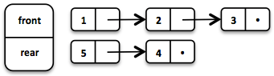
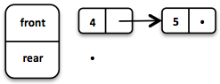

# vavr

## 1. 简介

vavr 为 java8+ 提供持久数据类型和函数式控制结构。

Java 8 引入的 lambda 表达式极大提高了 java 的表达能力。

vavr 利用 lambda 创建各种基于函数模式的新功能。其中之一为函数集合库，旨在替代 java 标准集合。

### 函数式编程

#### 副作用

Java 应用程序通常包含许多副作用（side-effects）。它们会改变某些状态，常见的副作用包括修改对象和变量、打印到控制台、写入日志文件或数据库。如果副作用影响程序的语义，则认为是有害的。

例如，如果一个 函数抛出异常，并且这个异常被解释，那么就认为它是影响程序的副作用。它们破坏正常的控制流。然而，现实世界的应用确实会产生副作用。

```java
int divide(int dividend, int divisor) {
    // throws if divisor is zero
    return dividend / divisor;
}
```

在函数式设置中，将副作用封装在 `Try` 中可以减少副作用的危害：

```java
// = Success(result) or Failure(exception)
Try<Integer> divide(Integer dividend, Integer divisor) {
    return Try.of(() -> dividend / divisor);
}
```

这个版本的 `divide` 不会抛出异常。根据 `Try` 类型可以明确是否失败。

#### 引用透明

如果一个函数或表达式的调用可以被其值替换而不影响程序的行为，则该函数被称为引用透明。简而言之，给定相同的输入，输出始终相同。

```java
// not referentially transparent
Math.random();

// referentially transparent
Math.max(1, 2);
```

如果所有表达式都是透明的，那个此函数称为纯函数（pure）。由纯函数组成的应用可能只要编译即可运行。

### 按值思考

immutable 值的重要性：

- 线程安全，不需要同步
- 对 `equals` 和 `hashCode` 稳定，因此可以作为 hash key
- 不需要克隆
- 在未经检查的强制类型转换中，类型安全。

vavr 提供了日常 Java 编程中实现这一目标所需的控件和集合。

### 集合

vavr 的集合库包含 一组基于 lambda 构建的丰富的函数数据结构。它们与 Java 的原始集合共享的唯一接口是 `Iterable`。主要原因是 Java 结合的 mutator 方法不返回底层集合类型的对象。

#### mutable 数据结构

Java 是一种面向对象的编程语言。我们将状态封装在对象中以实现数据隐藏，并提供 mutator 方法来控制状态。Java 集合框架（JCF）就是基于此思想构建的。

```java
interface Collection<E> {
    // removes all elements from this collection
    void clear();
}
```

`void` 返回类型意味着副作用、状态发生变化。共享可变状态是出错的重要根源。

#### immutable 数据结构

immutable 数据结构一旦创建无法修改。在 Java 环境中，它们被广泛用作集合 wrapper。

```java
List<String> list = Collections.unmodifiableList(otherList);

// Boom!
list.add("why not?");
```

有许多库提供类似的工具方法。得到特定集合的不可修改视图，当调用 mutator 方法时，会抛出运行时错误。

#### 持久数据结构

persistent 数据结构在修改时会保留其之前的版本，因此实际上是不可变的。完全持久性数据结构允许对任何版本进行更新和查询。

许多操作只进行微小修改。通过复制以前的版本效率不高。为了节省时间和内存，识别两个版本之间的相同点以共享尽可能多的数据至关重要。

### 函数式数据结构

函数式数据结构不可变且持久，且引用透明。

#### Linked List

Linked list 是最流行且最简单的数据结构之一，其行为类似 FIFO 的 Stack、

在 vavr 实例化 list：

```java
// = List(1, 2, 3)
List<Integer> list1 = List.of(1, 2, 3);
```

`List` 的每个元素组成一个 node。最后一个元素的 tail 为 Nil，即空 List。


这使得我们可以在 List 的不同版本之间共享元素。

```java
// = List(0, 2, 3)
List<Integer> list2 = list1.tail().prepend(0);
```

新的 head 元素 0 链接到原始 List 的 tail。原始 List 保持不变。


该操作时间复杂度为常量，换言之，它们与 List 大小无关。大多数其它操作需要线性时间。在 vavr 中，通过 `LinearSeq` 接口表示。

如果需要在 contant 时间查询的数据结构，vavr 提供 `Array` 和 `Vector`。两者都具有随机访问功能。

`Array` 通过 Java 对象数组实现。插入和删除操作需要线性时间。`Vector` 介于 `Array` 和 `List` 之间。它在随机访问和修改两个方面表现都可以。

此外，Linked list 也可以用来实现 `Queue` 数据结构。

#### Queue

通过两个 linked List 可以实现非常高效的 Queue。front List 保存 dequeue 元素，end List 保存 enqueue 元素。入队和出队操作的时间均为 $O(1)$。

```java
Queue<Integer> queue = Queue.of(1, 2, 3)
                            .enqueue(4)
                            .enqueue(5);
```

初始 `Queue` 保存三个元素。两个元素加入 end `List`：



如果 dequeue 操作导致 front List 元素用完，end List 反转称为新的 front List：




## 2. 入门

vavr 需要 Java1.8+。添加依赖项：

```xml
<dependencies>
    <dependency>
        <groupId>io.vavr</groupId>
        <artifactId>vavr</artifactId>
        <version>0.10.5</version>
    </dependency>
</dependencies>
```

## 3. 使用指南

vavr 包含一些最基本类型，这些类型在 Java 中缺失或不成熟：`Tuple`, `Value`, `λ`。vavr 的一切都建立在这三个基本类型之上：


### Tuples

Java 缺少 tuples。Tuple 将固定数量的元素组合在一起，以便将它们作为一个整体传递。与数组活 `List` 不同，tuple 可以保存不同类型的对象，但它们为 immutable。

tuple 包含 Tuple1, Tuple2, Tuple3 等。目前元素的上限为 8。对 tuple `t`，使用 `t._1` 访问第一个元素，`t._2` 访问第一个，以此类推。

#### 创建 tuple

```java
Tuple2<String, Integer> java8 = Tuple.of("Java", 8);
assertEquals("Java", java8._1);
assertEquals(8, java8._2);
```

说明：

1. 使用静态工程方法 `Tuple.of()` 创建 tuple
2. 使用 `._1` 获得第一个元素
3. 使用 `._2` 获得第二个元素

#### 映射 tuple 元素

对 tuple 的每个元素分别应用函数，返回另一个 tuple：

```java
Tuple2<String, Integer> that = java8.map(
        s -> s.substring(2) + "vr",
        i -> i / 8);
assertEquals(Tuple.of("vavr", 1), that);
```

说明：

1. 对第一个元素应用 `s.substring(2) + "vr"` 函数
2. 对第二个元素应用 `i/8` 函数

#### 单个 map 函数

```java
Tuple2<String, Integer> that2 = java8.map(
        (s, i) -> Tuple.of(s.substring(2) + "vr", i / 8)
);
assertEquals(Tuple.of("vavr", 1), that2);
```

说明：

1. 此时 `map` 的参数类型为 `BiFunction`，返回类型为 `Tuple`

#### 转换 tuple

根据 tuple 创建一个新类型：

```java
String that3 = java8.apply(
        (s, i) -> s.substring(2) + "vr " + i / 8
);
assertEquals("vavr 1", that3);
```


## 参考

- https://docs.vavr.io/