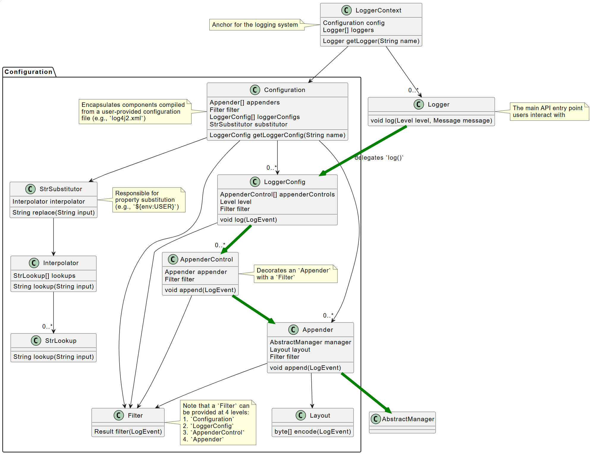
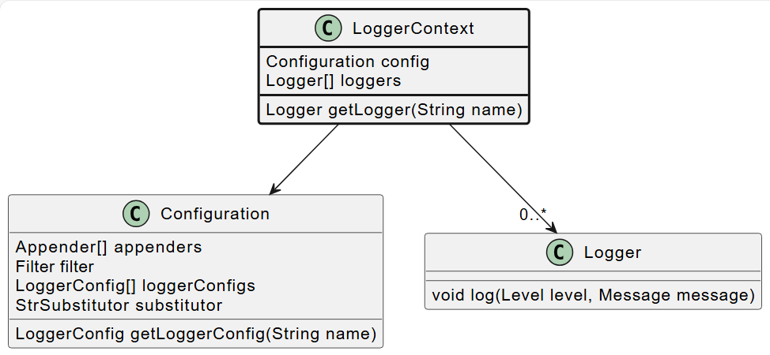
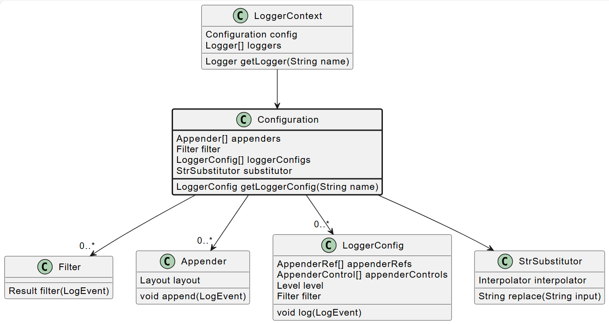
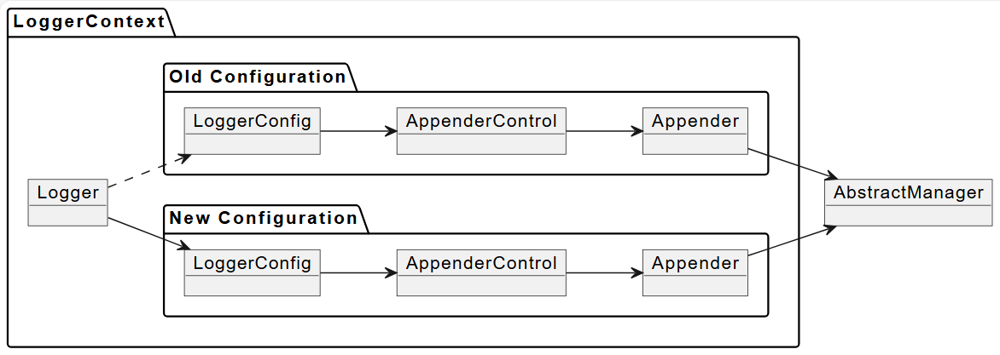
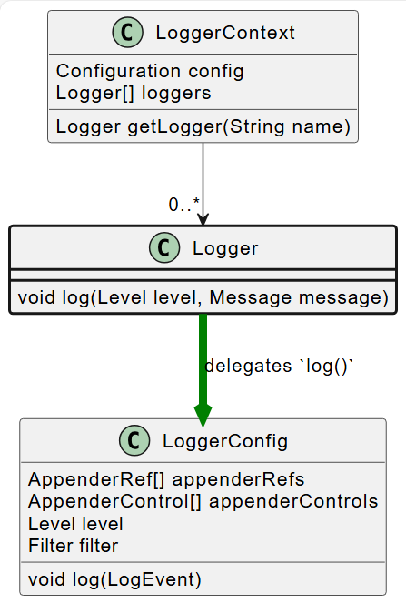

# Log4j

2025-01-23 ⭐

***

## 简介

Apache Log4j 是一个多功能企业级 Java 日志框架，由 api，实现和组件组成。

## Log4j 入门

### 什么是日志

logging 是在程序执行过程中发布诊断信息的行为。可以将日志信息写入日志文件或控制台，以帮助你了解应用程序正在做什么。

在 Java 中记录日志的最简单方法是使用 `System.out.println()`，例如：

```java
private void truncateTable(String tableName) {
  System.out.println("truncating table");
  db.truncate(tableName);
}
```

这已经很有用，但是通过这条消息读者不知道哪个表被截断。因此，开发人员继续使用 `System.out.format()` 或类似方法格式化消息。Log4j 提供了格式化字符串的功能，不过现在看看没有 Log4j 如何实现。

以下代码显示如何改进此方法以提供操作的更多信息：

```java
private void truncateTable(String tableName) {
    System.out.format("[WARN] truncating table `%s`%n", tableName);
    db.truncate(tableName);
}
```

如果开发人员决定截断 `fruits` 表格，会输出如下内容：

```
[WARN] Truncating table `fruits`
```

这提供了程序运行的实时状态。

但是，上述方法存在一些缺点，Log4j 的作用就是弥补这些缺点。Log4j 以更结构化的方式编写日志，提供更多信息，并更灵活。

### 为什么使用 Log4j

Log4j 是一个多功能的工业级 Java 日志框架，可以帮助我们完成常见的日志任务，让我们专注于应用逻辑。

支持：

- 增强消息：时间戳、文件、类、方法名、行号、主机、严重性等
- 根据指定 **layout** (csv, JSON 等)格式化消息
- 使用 **appender** 将消息写入各种位置（控制台、文件、套接字、数据库、队列等）
- 对写入的消息进行过滤

### Log4j 组成

Log4j 由 **Log4j API** 和参考实现 **Log4j Core** 组成。Log4j 还绑定了几个日志接口，从而可以从外部日志 API 使用 Log4j Core。

**Logging API**

日志 API 是你的代码直接依赖的接口。它是编译时必需的，与实现无关，可以确保应用程序可以写入日志，但不受特定日志实现的限制。Log4j API，SLF4J， JUL (Java Logging), JCL (Apache Commons Logging), JPL (Java Platform Logging), JBoss Logging 是主要的日志 API。

**Logging 实现**

日志实现仅在运行时需要，无需重新编译软件即可更改。Log4j Core, JUL (Java Logging)， Logback 是最著名的日志记录实现。

**Logging bridge**

Logging 实现接受来自其首选的单个 Logging API 的输入。Log4j Core 接受 Log4j API 的输入，Logback 接受 SLF4J 的输入。Logging bridge 是 logging api 的简单实现，它将所有消息转发到外部 logging api。通过 logging bridge 使得一个 logging 实现可以接受其它 logging api 的输入。例如，log4j-slf4j2-impl 将 SLF4J 调用转发到 Log4j API，使得 Log4j Core 能够接受 SLF4J 的输入。

### 安装

通过 BOM (Bill of Materials)管理依赖项，这样就不需要指定每个 Log4j 模块的版本：

```xml
<dependencyManagement>
  <dependencies>
    <dependency>
      <groupId>org.apache.logging.log4j</groupId>
      <artifactId>log4j-bom</artifactId>
      <version>2.24.3</version>
      <scope>import</scope>
      <type>pom</type>
    </dependency>
  </dependencies>
</dependencyManagement>
```

不过这个依赖项太多了，建议分别添加比较好：

```xml
<dependency>
    <groupId>org.apache.logging.log4j</groupId>
    <artifactId>log4j-api</artifactId>
    <version>2.24.3</version>
</dependency>
```

### 如何使用 Log4j API

要记录日志，需要 `Logger` 实例，该实例从 `LogManager` 中得到。这些都是 log4j-api 的一部分。

可以使用 `Logger` 实例的 `info()`, `warn()`, `error()` 等记录日志。这些方法名称代表了日志级别，这是 一种按严重性对日志进行分类的方法。日志消息还可以包含以 `{}` 形式编写的占位符，这些占位符被该方法的参数替代。

```java
import org.apache.logging.log4j.Logger;
import org.apache.logging.log4j.LogManager;

public class DbTableService {

    private static final Logger LOGGER = LogManager.getLogger();  // 1

    public void truncateTable(String tableName) throws IOException {
        LOGGER.warn("truncating table `{}`", tableName);  // 2
        db.truncate(tableName);
    }

}
```

1. 返回的 `Logger` 实例线程安全且可重复使用。除非明确提供参数，否则 `getLogger()` 将与 `Logger` 所在类绑定，即上例中的 `DbTableService`
2. 消息中的 `{}` 将被替换为 `tableName`

生成的 log-event 包含用户提供的日志消息和日志级别（`warn`），并隐式包含上下文信息：时间戳、类和方法名称，行号等。

生成的日志事件根据所使用的配置会有很大差异。它可以输出到控制台、写入文件，或者由于级别不够被过滤，从而忽略。

日志级别按严重性对日志事件进行分类，并控制日志的详细程度。Log4j 包含许多预定义级别，最常用的有：`DEBUG`, `INFO`, `WARN` 和 `ERROR`。借助它们可以过滤掉不太重要的日志，专注于最关键的日志。

对异常，我们可能会使用 `ERROR` 日志级别。为了确保记录具有诊断价值的异常，只需将 `Exception` 作为做后 一个参数传递给 log 方法：

```java
LOGGER.warn("truncating table `{}`", tableName);
try {
    db.truncate(tableName);
} catch (IOException exception) {
    LOGGER.error("failed truncating table `{}`", tableName, exception); // 1
    throw new IOException("failed truncating table: " + tableName, exception);
}
```

> 使用 `error()` 而不是 `warn()`，表示操作失败。

虽然消息中只有一个占位符，但我们传递了两个参数：`tableName` 和 `exception`。Log4j 会将最后一个 `Throwable` 类型的额外参数附加到生成的日志事件的单独字段中。

### 最佳实践

使用 Log4j api 时，存在几种普遍的不良做法。下面介绍几种最常见的做法，并了解如何修改。最佳实践的完整列表可参考 [Log4j 最佳实践](#log4j-最佳实践)。

#### 不要使用 toString

- 😒在参数中不要使用 `Object.toString()`，这是多余的

```java
/* BAD! */ LOGGER.info("userId: {}", userId.toString());
```

-  😁底层消息类型和 layout 会处理参数

```java
/* GOOD */ LOGGER.info("userId: {}", userId);
```

#### 将 exception 作为做后一个参数

- 😒不要调用 `Throwable#printStackTrace()!`，这不仅会绕过日志记录，还会泄露敏感信息

```java
/* BAD! */ exception.printStackTrace();
```

- 😒不要使用 `Throwable#getMessage()`，这会导致日志事件信息量太低

```java
/* BAD! */ LOGGER.info("failed", exception.getMessage());
/* BAD! */ LOGGER.info("failed for user ID `{}`: {}", userId, exception.getMessage());
```

- 😒不要同时提供 `Throwable#getMessage()` 和 `Throwable` 本身，这会使日志消息重复

```java
/* BAD! */ LOGGER.info("failed for user ID `{}`: {}", userId, exception.getMessage(), exception);
```

- 😁将 exception 最为最后一个参数

```java
/* GOOD */ LOGGER.error("failed", exception);
/* GOOD */ LOGGER.error("failed for user ID `{}`", userId, exception);
```

#### 不要使用字符串串联

不要在添加日志时使用字符串串联。

- 😒不要使用字符串串联来格式化参数。这会绕过消息类型和额 layout 处理参数。更重要的时，这种方法容易受到攻击。例如，用户提供的 `userId` 包含如下内容：`placeholders for non-existing args to trigger failure: {} {} {dangerousLookup}`

```java
/* BAD! */ LOGGER.info("failed for user ID: " + userId);
```

- 😁使用消息参数

```java
/* GOOD */ LOGGER.info("failed for user ID `{}`", userId);
```

### 如何添加 Log4j Core 到应用

首先，将 log4j-core runtime 依赖添加到应用。其次，强烈推荐添加 `log4j-layout-template-json` runtime 依赖项，以 JSON 格式编码日志事件。这是格式化日志最安全的方式，应该优先于默认的 `PatternLayout`，至少对生产部署而言。

```xml
<project>
  <!-- Assuming `log4j-bom` is added -->
  <dependency>

    <!-- Logging implementation (Log4j Core) -->
    <dependency>
      <groupId>org.apache.logging.log4j</groupId>
      <artifactId>log4j-core</artifactId>
      <scope>runtime</scope> // 1
    </dependency>

    <!-- Log4j JSON-encoding support -->
    <dependency>
      <groupId>org.apache.logging.log4j</groupId>
      <artifactId>log4j-layout-template-json</artifactId>
      <scope>runtime</scope>
    </dependency>
      
  </dependency>
</project>
```

对 Application，log4j-core 需要是 runtime 依赖类型。

如果你的 Application 使用另一个日志 api，则需要将其桥接到 Log4j。SLF4J 是另一种非常常用的日志 API。下面看看如何使用 log4j-slf4j2-impl bridge 来支持 SLF4J：

```xml
<project>

  <!-- Assuming `log4j-bom` is added -->

  <dependency>

    <!-- Assuming `log4j-core` and `log4j-layout-template-json` is added -->

    <!-- SLF4J-to-Log4j bridge -->
    <dependency>
        <groupId>org.apache.logging.log4j</groupId>
        <artifactId>log4j-slf4j2-impl</artifactId>
        <scope>runtime</scope> // 对 application，bridges 需要为 runtime 依赖
    </dependency>

  </dependency>

</project>
```

最后，还需要配置 Log4j Core。

### 如何配置 Log4j Core

下面介绍如何配置 Log4j 来定义处理日志的方式。

Log4j 支持多种配置输入和文件格式。下面从一个基本而强大的配置开始：将日志以 JSON 格式写入控制台。将如下 Log4j 配置文件保存到应用 `src/main/resources/log4j2.xml`：

```xml
<?xml version="1.0" encoding="UTF-8"?>
<Configuration xmlns:xsi="http://www.w3.org/2001/XMLSchema-instance"
               xmlns="https://logging.apache.org/xml/ns"
               xsi:schemaLocation="
                       https://logging.apache.org/xml/ns
                       https://logging.apache.org/xml/ns/log4j-config-2.xsd">

  <Appenders>
    <Console name="CONSOLE">
      <JsonTemplateLayout/>
    </Console>
  </Appenders>

  <Loggers>
    <Logger name="com.mycompany" level="INFO"/>
    <Root level="WARN">
      <AppenderRef ref="CONSOLE"/>
    </Root>
  </Loggers>

</Configuration>
```

1. `Appenders` 负责将日志事件写入特定目标：控制台、文件、套接字、数据库、队列等；
2. `Console Appender` 将日志写入控制台；
3. `Layouts` 在 appenders 输出日志前对日志进行编码。JSON Template Layout 将日志事件编码为 JSON 格式
4. `<Logger name="com.mycompany" level="INFO"/>` 接受由 `com.mycompany` 包（包括其子包）中的类生成的 INFO 级别或更高级别（`WARN`, `ERROR`, `FATAL`）的日志事件
5. `<Root level="WARN">` 除非另有说明，否则将接受 `WARN` 级别及更高级别的日志事件，它作为默认的 `<logger>` 配置。
6. `<AppenderRef ref="CONSOLE"/>` 除非另有说明，否则接受的日志事件将被转发到之前定义的 `console` appender。

### 如何添加 Log4j Core 到库

与 app 不同，lib 应该与日志实现无关。即，lib 应该通过日志 api 记录日志，但将日志实现的决定权留给 app。换句话说，lib 在运行测试时需要日志实现。

下面看看如何为测试添加 Log4j Core。首先添加依赖项：

```xml
<project>

  <!-- Assuming `log4j-bom` is added  -->

  <dependency>

    <!-- Logging implementation (Log4j Core) -->
    <dependency>
      <groupId>org.apache.logging.log4j</groupId>
      <artifactId>log4j-core</artifactId>
      <scope>test</scope>
    </dependency>

  </dependency>

</project>
```

如果 lib 使用另一个日志 api，则需要添加 bridge。例如，使用 log4j-slf4j2-impl 连接 SLF4J api：

```xml
<project>

  <!-- Assuming `log4j-bom` is added -->

  <dependency>

    <!-- Assuming `log4j-core` and `log4j-layout-template-json` is added -->

    <!-- SLF4J-to-Log4j bridge -->
    <dependency>
        <groupId>org.apache.logging.log4j</groupId>
        <artifactId>log4j-slf4j2-impl</artifactId>
        <scope>test</scope>
    </dependency>

  </dependency>

</project>
```

### 为 test 配置 Log4j Core

Log4j 支持多种配置输入和文件格式。下面从一个基本的、对开发人员友好的配置开始，日志以人性化的方式输出到控制台。

与 app 更保守的 Log4j 配置相比，对测试，则应采用更适合开发人员的配置。其中：

1. log 整洁的打印到控制台
2. 日志详细程度增加

虽然出于安全原因不建议在生产中使用 `PatternLayout`，但对测试来说是个不错的选择。

将以下 Log4j 配置文件保存到 `src/test/resources/log4j2-test.xml`：

```xml
<?xml version="1.0" encoding="UTF-8"?>
<Configuration xmlns:xsi="http://www.w3.org/2001/XMLSchema-instance"
               xmlns="https://logging.apache.org/xml/ns"
               xsi:schemaLocation="
                       https://logging.apache.org/xml/ns
                       https://logging.apache.org/xml/ns/log4j-config-2.xsd">

  <Appenders>
    <Console name="CONSOLE">
      <PatternLayout pattern="%d [%t] %5p %c{1.} - %m%n"/>
    </Console>
  </Appenders>

  <Loggers>
    <Logger name="com.mycompany" level="DEBUG"/>
    <Root level="WARN">
      <AppenderRef ref="CONSOLE"/>
    </Root>
  </Loggers>

</Configuration>
```

1. `PatternLayout` 用于以人类可读的方式对日志事件进行编码

## Log4j API

### Log4j 最佳实践

## Log4j Core

> 2025-01-23 ⭐

### 架构

Log4j Core 是 Log4j API 的参考实现，由多个组件组成。主要类如下：

- `LoggerContext`，与 `Configuration` 结合创建。两者均可在首次与 Log4j 交互时直接（编程方式）或间接创建。
- `LoggerContext` 创建与用户交互的用于记录日志的 `Logger`
- `Appender` 将 `LogEvent` 传递到目标，并通过 `Layout` 来编码，使用 `AbstractManager` 处理目标的生命周期
- `LoggerConfig` 封装 `Logger` 的配置，以及 `Appender` 的 `AppenderControl` 和 `AppenderRef`
- `Configuration` 配备 `StrSubstitutor` 等，从而在字符串中进行属性替换
- 典型的 `log()` 调用会按顺序通过 `Logger`, `LoggerConfig`, `AppenderControl`, `Appender` 和 `AbstractManager` 触发一系列调用（下绿色剪头）、



#### LoggerContext

`LoggerContext` 充当日志系统的锚点。它与 `Configuration` 关联，主要负责实例化 `Logger`。



在大多数情况，一个 app 只有一个全局 `LoggerContext`。但是在某些情况（如 Java EE app），Log4j 可以配置为容纳多个 `LoggerContext`。具体可参考 [Log separation](https://logging.apache.org/log4j/2.x/jakarta.html#log-separation)。

#### Configuration

每个 `LoggerContext` 与一个活跃的 `Configuration` 相关联。它配置所有 appenders, layouts, filters, loggers，并且包含对 `StrSubstitutor` 的引用。



Log4j Core 的配置通常在 app 初始化时完成。首选方式是读取配置文件，但也可以通过编程方式完成。

**重新配置的可靠性**

该架构的主要动机是保证配置更高的可靠性。当重新配置事件发生时，两个配置实例同时处于活动状态。已开始处理日志事件的线程将执行以下操作之一：

- 如果已经执行到 `LoggerConfig` 类，则以原配置继续记录日志
- 否则切换到新配置

管理重新配置过程的服务称为 `ReliabilityStrategy`，它决定：

- `Logger` 何时切换到新配置
- 何时停止原配置



#### Logger

`Logger` 是用户记录日志的主要入口。它们通过调用 `LogManager` 的 `getLogger()` 方法来创建。`Logger` 本身不执行任何直接操作，它只是有一个名称并与 `LoggerConfig` 关联。



`LoggerConfig` 之间的层次结构意味着 `Logger` 之间的层次结构完全相同。可以使用 `LogManager.getRootLogger()` 获得 root logger。注意，Log4j API 对 `Logger` 的层次结构没有任何假设，这是 Log4j Core 负责实现的功能。

修改配置后，`Logger` 可能与不同的 `LoggerConfig` 关联，从而导致其行为被修改。

### 配置

可以通过两种方式配置 Log4j Core：

- 配置文件
- 编程

一些元配置选项，如配置文件位置，只能通过系统属性获得。

## 配置文件

使用配置文件是配置 Log4j Core 最流行和推荐的方法。

### 配置文件位置

在初始化新的 `LoggerContext` 时，Log4j Core 会为其分配一个上下文名称，并按以下顺序扫描以查找配置文件：

1. `log4j2-test<contextName>.<extension>`
2. `log4j2-test.<extension>`
3. `log4j2<contextName>.<extension>`
4. `log4j2.<extension>`

上面的 `<contextName>` 和 `<extension>` 占位符的含义：

`<contextName>`

从运行时环境派生的名称：

- 对独立的 


## Appenders

Appenders 负责将日志发送到指定位置。所有 appender 必须实现 `Appender` 接口。

Log4j Core 大多数 appender 继承自 `AbstractAppender`，并且：

- 日志过滤委托给 `Filter` 实现。
- 日志格式化委托给 `Layout` 实现。
- appender 只负责将日志数据写入指定位置。

每个 appender 都有一个名字，在 logger 配置中可以引用。

### appender 集合

Log4j 捆绑了几个预定义的 appenders。

#### Console Appender

console-appender 输出到 stdout 或 stderr。该 appender 支持 4 种访问输出流的方式：

- **direct**

该模式性能最好。通过将 `direct` 属性设置为 `true` 启用。

- **default**


### 扩展

appenders 是实现 `Appender` 接口的插件。下面介绍如何自定义 appender。

> [!WARNING]
>
> 实现一个可靠且高效的 appender 并不容易，因此建议：
>
> 1. 尽可能使用已有的 appender
> 2. 如果有需求，可以向 log4j 团队反馈

#### 准备插件


## 迁移

### 从 SLF4J 迁移

SLF4J 是一种日志 API，其参考实现是 Logback。下面介绍如何从 SLF4J 迁移到 Log4j api。

迁移到 Log4j api 的步骤：

1. 移除 `org.slf4j:slf4j-api` 依赖
2. 添加 log4j-api 依赖
3. 在项目中搜索 `org.slf4j` 并将其替换为等效的 Log4j API

> [!IMPORTANT]
>
> 可以用 [OpenRewrite ](https://docs.openrewrite.org/recipes/java/logging/log4j/slf4jtolog4j) 自动替换。

- `org.slf4j.LoggerFactory`

替换为 [`org.apache.logging.log4j.LogManager`](https://logging.apache.org/log4j/2.x/javadoc/log4j-api/org/apache/logging/log4j/LogManager.html)。注意，如果 `Foo` 是该字段所在的类，则可以将 `LogManager.getLogger(Foo.class)` 简化为 `LogManager.getLogger()`。

- `org.slf4j.Logger`

替换为 `org.apache.logging.log4j.Logger`。由于 SLF4J 的 `Logger` 几乎是 Log4j 的 `Logger` 的父类，因此大多数方法都无需更改。

- `org.slf4j.MDC`

替换为 `org.apache.logging.log4j.ThreadContext`。

4. 如果使用 Lombok 的 `@Slf4j`，则替换为 `@Log4j2`。

都这一步，就完成 Log4j API 的替换。

如果迁移的是 lib，则无需采取额外步骤。因为 lib 与日志框架的实现无关。

如果迁移的是 app，并且没有使用 Log4j Core 作为日志实现。

**使用 OpenRewrite 迁移**

添加 Maven 依赖项：

```xml
<project>
  <build>
    <plugins>
      <plugin>
        <groupId>org.openrewrite.maven</groupId>
        <artifactId>rewrite-maven-plugin</artifactId>
        <version>6.0.4</version>
        <configuration>
          <exportDatatables>true</exportDatatables>
          <activeRecipes>
            <recipe>org.openrewrite.java.logging.log4j.Slf4jToLog4j</recipe>
          </activeRecipes>
        </configuration>
        <dependencies>
          <dependency>
            <groupId>org.openrewrite.recipe</groupId>
            <artifactId>rewrite-logging-frameworks</artifactId>
            <version>3.0.0</version>
          </dependency>
        </dependencies>
      </plugin>
    </plugins>
  </build>
</project>
```

2. 运行 `mvn rewrite:run`

### 从 Logback 迁移

Logback 是 ALF4J api 的实现，就像 Log4j Core 是 Log4j API 的实现一样。下面介绍如何从 Logback 迁移到 Log4j Core。


## 参考

- https://logging.apache.org/log4j/2.x/index.html