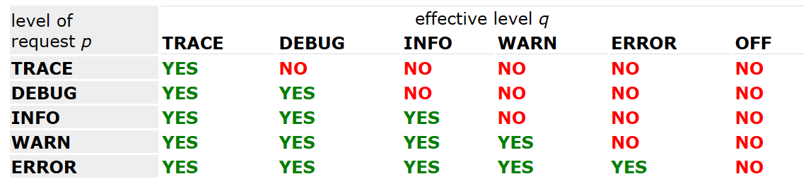

# logback 架构

- [logback 架构](#logback-架构)
  - [简介](#简介)
  - [Logger, Appender 和 Layout](#logger-appender-和-layout)
    - [Logger context](#logger-context)
  - [日志等级继承](#日志等级继承)
  - [输出日志方法](#输出日志方法)
    - [获取 Logger](#获取-logger)
    - [Appenders 和 Layouts](#appenders-和-layouts)
  - [参数化日志](#参数化日志)
    - [推荐方式](#推荐方式)
  - [底层日志步骤](#底层日志步骤)
  - [性能](#性能)

2024-02-22 ⭐
@author Jiawei Mao
***

## 简介

logback 划分为三个模块： logback-core, logback-classic 和 logback-access。

- logback-core 是其它两个模块的基础
- logback-classic 可以看做 log4j 的升级版，原生实现了 slf4j
- logback-access 集成到 Servlet 容器，以提供 HTTP 访问日志功能

access 有专门的介绍文档，下面介绍 logback-classic 的模块。

## Logger, Appender 和 Layout

Logback 构建在三个核心类上：`Logger`, `Appender` 和 `Layout`。`Logger` 类在 logback-classic 模块中。`Appender` 和 `Layout` 接口在 logback-core 模块中。

### Logger context

logging API 相对于 `System.out.println` 的最重要的优点在于能禁用部分日志，且不影响其它日志。该功能的实现依赖于日志空间(logging space)分类。在 logback-classic 中，该分类功能通过 `LoggerContext` 实现，每个 `Logger` 都有一个 `LoggerContext`，`LoggerContext` 负责生成 logger，并将 loggers 组织成树形结构。

Loggers 的命名规则和 Java 完全一致。

> **分层命名**
> 如果一个 logger 名加点号后是另一个 logger 的前缀，就称前者是后者的祖先 logger。

例如，名为 "com.foo" 的 logger 是名为 "com.foo.Bar" logger 的父 logger。

root-logger 是 logger-tree 的树根，获取方式：

```java
Logger rootLogger = LoggerFactory.getLogger(org.slf4j.Logger.ROOT_LOGGER_NAME);
```

其它 logger 都通过 `org.slf4j.LoggerFactory.getLogger` 方法获得。`Logger` 接口中的一些基本方法：

```java
package org.slf4j; 
public interface Logger {

  // 输出方法
  public void trace(String message);
  public void debug(String message);
  public void info(String message); 
  public void warn(String message); 
  public void error(String message); 
}
```

## 日志等级继承

日志级别定义在 `ch.qos.logback.classic.Level` 类中，包括(`TRACE`, `DEBUG`, `INFO`, `WARN`, `ERROR`)。 `Level` 为 `final` 类，不能继承，如果需要更灵活的分类方式，可以使用 `Marker` 对象。

> [!NOTE]
>
> **日志级别顺序**
>
> `TRACE<DEBUG<INFO<WARN<ERROR`

如果没有给 logger 分配级别，那么它会从其最近的已分配级别的祖先处继承级别。

日志级别继承概念：

- 如果该 `Logger` 设置了`level`，则以该 `level` 为准；
- 如果该 Logger 未设置 level，则从其父 `Logger` 继承；
- root-logger 默认级别为 DEBUG。

下面 4 个示例，设置不同的日志级别，以及以及根据级别继承规则对应的效果

**示例 1**

|Logger name|Assigned level|Effective level|
|---|---|---|
|root|DEBUG|DEBUG|
|X|none|DEBUG|
|X.Y|none|DEBUG|
|X.Y.Z|none|DEBUG|

这里只为 root-logger 分配了 level，即 `DEBUG`，余下 loggers 都继承该 level。

**示例 2**

|Logger name|Assigned level|Effective level|
|---|---|---|
|root|ERROR|ERROR|
|X|INFO|INFO|
|X.Y|DEBUG	|DEBUG|
|X.Y.Z|WARN	|WARN|

所有 logger 都分配了 level，因此无需继承规则。

**示例 3**

|Logger name|Assigned level|Effective level|
|---|---|---|
|root|DEBUG|DEBUG|
|X|INFO|INFO|
|X.Y	|none	|INFO|
|X.Y.Z	|ERROR	|ERROR|

`X.Y` logger 从 `X` 继承 `INFO` 日志级别。

**示例 4**

|Logger name|Assigned level|Effective level|
|---|---|---|
|root|DEBUG|DEBUG|
|X|INFO|INFO|
|X.Y	|none|INFO|
|X.Y.Z	|none|INFO|

`X.Y` 和 `X.Y.Z` 从 `X` 继承 `INFO` 日志级别。

## 输出日志方法

根据定义，输出日志方法决定了日志级别，如 `L.info("…")` 的日志级别为 `INFO`。

高于等于有效级别的日志请求才会输出。如设置级别 `INFO`，则能够输出 `INFO`, `WARN` 和 `ERROR` 级别的日志。如下表所示：



垂直方向是请求的日志级别，水平方向是 logger 的有效级别。

下面是基本选择规则示例：

```java
import ch.qos.logback.classic.Level;
import org.slf4j.Logger;
import org.slf4j.LoggerFactory;
....

// 获取名为 com.foo 的 logger 实例
ch.qos.logback.classic.Logger logger = 
        (ch.qos.logback.classic.Logger) LoggerFactory.getLogger("com.foo");
// 设置 logger 级别
logger.setLevel(Level.INFO);

Logger barlogger = LoggerFactory.getLogger("com.foo.Bar");

// 有效：WARN >= INFO
logger.warn("Low fuel level.");

// 无效：DEBUG < INFO. 
logger.debug("Starting search for nearest gas station.");

// barlogger "com.foo.Bar" 从 "com.foo" 继承日志级别
// 有效：INFO >= INFO. 
barlogger.info("Located nearest gas station.");

// 无效：DEBUG < INFO. 
barlogger.debug("Exiting gas station search");
```

### 获取 Logger

使用相同名字调用 `LoggerFactory.getLogger` 总是返回相同的 logger 对象。例如：

```java
Logger x = LoggerFactory.getLogger("wombat"); 
Logger y = LoggerFactory.getLogger("wombat");
```

`x` 和 `y` 引用完全相同的 `Logger` 对象。

因此，可以配置好一个 logger，然后在其它地方获取相同的实例，且无需传递引用。

### Appenders 和 Layouts

logback 支持将日志输出到多个地方。在 logback 中，日志输出目的地称为 appender，logback 目前支持控制台、文件、远程 socket 服务器、MySQL、PostgreSQL、Oracle 和其它数据库，JMS，远程 UNIX Syslog daemons。

一个 logger 可以配置几多个 appenders，即一条日志可以输出到多个地方。

`addAppender` 方法为指定 logger 添加 appender。logger 的所有有效日志会输出到该 logger 以及父 logger 的 appenders。换言之，appender 也有继承效果。例如，如果为 root-logger 添加一个 console-appender，那么所有有效日志至少会输出到控制台。如果在 logger `L` 上还添加了一个 file-appender，那么 `L` 以及其子 logger 将输出日志到控制台和文件。将 logger 的 `additivity` flag 设置为 false 可以禁用该默认行为，不再继承 appender。

**appender 加性规则总结：**

> logger `L` 的日志输出到 L 及其父 logger 的所有 appenders，即 appender 加性。
> 如果 `L` 的父 logger `P`，其 `additivity` 属性为 `false`，那么 L 的日志将输出到 L 的所有 appenders，以及 P 的所有 appenders，但不包括 P 的祖先的 appenders。
> logger 的 `additivity` 属性默认为 `true`。

示例：

|Logger Name|Attached Appenders|Additivity Flag|Output Targets|Comment|
|---|---|---|---|---|
|root|A1|not applicable|A1|root-logger 位于 logger 树顶端，加性规则对其无效|
|x|A-x1, A-x2|true|A1, A-x1, A-x2|"x" 和 root 的 appenders|
|x.y|none|true|A1, A-x1, A-x2|"x" 和 root 的 appenders|
|x.y.z|A-xyz1|true|A1, A-x1, A-x2, A-xyz1|"x.y.z", "x" 和 root 的 appenders|
|security|A-sec|`false`|A-sec|由于 additivity 设置为 `false`，因此不累加 appender，只使用 A-sec|
|security.access|none|true|	A-sec|只有 "security" 的 appender|

通常，用户不仅需要自定义输出位置，还需要自定义输出格式。通过组合 layout 和 appender 即可实现。

layout 负责格式化日志，appender 负责将格式化的日志输出到指定位置。logback 中的 `PatternLayout` 使用类似 C 语言 `printf` 函数的语法指定输出格式。

例如，转换模式为 "%-4relative [%thread] %-5level %logger{32} - %msg%n" 的 `PatternLayout` 将输出类似如下内容：

```
176  [main] DEBUG manual.architecture.HelloWorld2 - Hello world.
```

第一个字段是程序开始后经过的毫秒数；第二个字段是发出日志请求的线程；第三个字段是日志级别；第四个字段是 logger 名称；`-` 后面是日志消息。

## 参数化日志

由于 logback-classic 的 logger 实现了 SLF4J 的 `Logger` 接口，因此有些 print 方法支持多个参数。这些 print 方法变体主要为了在提高性能的同时减少对代码可读性的影响。

对有些 logger：

```java
logger.debug("Entry number: " + i + " is " + String.valueOf(entry[i]));
```

会有构造消息的成本，即将整数 `i` 和 `entry[i]` 转换为 `String`，并连接这些字符串。这与消息是否被记录都会有这些开销。

避免参数构造成本的一种方法是在日志语句前加一个判断，例如：

```java
if(logger.isDebugEnabled()) { 
  logger.debug("Entry number: " + i + " is " + String.valueOf(entry[i]));
}
```

如果 `logger` 的 `DEBUG` 被禁用，就不会产生参数构造开销。另一方面，如果启用了 `DEBUG` 级别，则将产生两次评估开销：一次在 `isDebugEnabled` 中，一次在 `debug` 中。在实践中，这个开销微不足道，因为判断 logger 是否开启的开销不足记录一条日志的 1%。

### 推荐方式

假设 entry 是一个对象，可以按如下方式：

```java
Object entry = new SomeObject(); 
logger.debug("The entry is {}.", entry);
```

这种方式，只在评估日志有效后才会构造格式化日志信息，将 `{}` 替换为 `entry` 的字符串值。换言之，当禁用该日志语句，这种方式不会有构造参数的开销。

下面两行生成的输出相同。但是，在禁用日志的情况下 ，第二个版本性能比第一个高出至少 30 倍。

```java
logger.debug("The new entry is "+entry+".");
logger.debug("The new entry is {}.", entry);
```

还有两个参数的版本：

```java
logger.debug("The new entry is {}. It replaces {}.", entry, oldEntry);
```

多个参数的版本：

```java
logger.debug("Value {} was inserted between {} and {}.", newVal, below, above);
```

多个参数的版本会产生创建 `Object[]` 实例的成本。

## 底层日志步骤

介绍完 logback 的基本组件后，下面简要描述当用户调用 logger 的输出方法时，logback 框架执行了哪些操作。

分析：当用户调用名为 `com.wombat` logger 的 `info()` 方法时，logback 所采取的步骤。

**1. 获得 filter 结果**

调用 `TurboFilter` chain（如果存在）。Turbo filter 可以设置 context 范围阈值，或根据每个日志请求相关信息（如 `Marker`, `Level`, `Logger`, 信息或 `Throwable`）过滤事件，filter-chain 可能结果有：

- `FilterReply.DENY`，丢弃日志请求；
- `FilterReply.NEUTRAL`，继续下一步；
- `FilterReply.ACCEPT`，跳过下一步，直接到步骤 3。

**2. 应用基本选则规则**

比较 logger 的有效级别与请求日志级别。如果没请求级别低于 logger 级别，丢弃日志请求，不再继续处理。否则，继续执行下一步。

**3. 创建 `LoggingEvent` 对象**

如果日志请求通过了前面的过滤器，logback 将创建 `ch.qos.logback.​classic.​LoggingEvent` 对象，该对象包含日志请求相关的所有信息，如日志级别、日志信息、可能异常、当前时间，当前线程和 MDC 等。有些字段是 lazily 初始化的。MDC 在日志记录上附加上下文信息，后面会讨论。

**4. 调用 appenders**

创建 `LoggingEvent` 后，logback 调用所有 appenders 的 `doAppend()` 方法。

logback 自带的 appenders 都扩展 `AppenderBase` 抽象类。在类在 synchronized 中实现 `doAppend` 方法，以确保线程安全。`AppenderBase` 的 `doAppend()` 方法还会调用 appender 中的自定义过滤器。后面会单独讲解自定义过滤器。

**5. 格式化输出**

被调用的 appender 负责格式化日志事件。然而，部分（不是全部） appender 将格式化任务委托给 layout。layout 格式化 `LoggingEvent` 实例，返回日志 `String`。有些 appenders，如 `SocketAppender`，不会格式化 `LoggingEvent`，而是直接序列化，因此不需要 layout。

**6. 输出 `LoggingEvent`**

格式化 `LoggingEvent` 后，由 appender 将其发送到目的地。

## 性能

反对日志框架的一个常用论据是它的计算成本。这是一个合理的担心，因为即使中等规模的应用也可能生成数千个日志请求。因此 logback 团队的大部分开发工作都花在测试和调整性能上。另外，用户应注意以下性能问题。

**1. 完全关闭日志记录时的日志性能**

将 root-logger 的日志级别设置为 `Level.OFF` 可以完全关闭日志记录。当完全关闭日志记录，一个日志请求的开销包括一个方法调用和一个整数比较。在 3.2Ghz Pentium D 机器上，这个成本大约 20 纳秒。

但是，任何方法调用都涉及参数构造的隐含成本。例如，logger `x` 写入：

```java
x.debug("Entry number: " + i + "is " + entry[i]);
```

会有构造参数的成本，即将整数 `i` 和 `entry[i]` 转换为字符串，然后连接字符串的成本，不管是否记录该消息，都有该成本。

构建参数的成本可能相当高，具体取决于参数的大小。为了避免构造参数的开销，可以利用 SLF4J 的参数化日志：

```java
x.debug("Entry number: {} is {}", i, entry[i]);
```

如果该日志记录没有通过过滤器，这种变体不会产生构造参数的成本。只有当日志请求被发送到 appenders 时，才会格式化消息。此外，格式化消息的组件也进行了大量优化。

另外，不建议将日志语句放在循环语句中，即非常频繁地记录日志，这会导致性能下降。即使关闭日志记录，在 大量循环中记录日志也会降低应用速度，如果打开日志记录，里面会有大量输出（因此无用）。

**2. 启用日志时判断是否记录的性能**

在 logback 中，不需要遍历 logger 层次树，logger 在创建时就知道了它的有效 level。如果更改父 logger 的 level，则所有子 logger 会收到通知。因此，在基于有效 level 接受或拒绝之前，logger 可以立即做出决定，无需咨询其祖先 loggers。

**3. 实际日志（格式化并输出）**

格式化日志和输出的成本。写入本地文件的成本在 9 到 12 微妙，而写入远程服务器的数据库需要几毫秒。

性能是仅次于可靠性的要求，为了提高性能，部分 logback 组件已经重写了几次。
