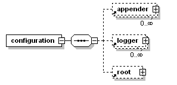

# logback 配置

2025-03-03 
@author Jiawei Mao
***
## 简介

下面介绍配置 logback 的方法，并提供许多配置脚本示例。在后面会介绍 logback 依赖的配置框架 Joran。

## 初始化时的配置

将日志请求插入应用代码需要大量的工作。调查显示，大约 4% 的代码专用于日志记录。因此，即使中等规模的应用在代码中也包含上千条日志语句。考虑到它们的数量，有必要用专门的工具来管理日志。

logback 既可以通过编程方式配置，也可以使用 XML、Groovy 或序列化模型格式配置。另外，log4j 用户可以使用 [PropertiesTranslator](https://logback.qos.ch/translator/) 网页应用将 log4j.properties 文件转换为 logback.xml 配置文件。

logback 初始化配置的步骤：

1. logback 使用 `ServiceLoader` 搜索自定义 `Configurator` providers。如果找到任何这样的自定义程序，则优于 logback 的配置，如 `DefaultJoranConfigurator` 。

自定义配置器是 `ch.qos.logback.classic.spi.Configurator` 接口的实现，logback 通过查找位于 `META-INF/services/ch.qos.logback.classic.spi.Configurator` 中的类来搜索自定义 `Configurator`。该文件的内容应该指定 `Configurator` 实现的完全限定名。

2. **SINCE 1.3.9/1.4.9** 如果在上一步中没有找到用户自定义配置器，logback 将实例化一个 `SerializedModelConfigurator`。

> [!NOTE]
>
> 鉴于用户对 `SerializedModelConfigurator` 不感兴趣，并且考虑到 logback-tyler 项目的出现，`SerializedModelConfigurator`  将在 2025-07-01 删除。

- 如果设置了 *logback.scmoFile* 系统属性，`SerializedModelConfigurator` 将尝试查找该系统属性指定的文件，并根据文件内容进行配置。
- 如果未设置上述系统属性，或无法找到指定文件，`SerializedModelConfigurator` 将在类路径中搜索序列化配置模型文件 *logback-test.scmo*。如果找到该文件，读取并配置。
- 如果找不到上述文件，`SerializedModelConfigurator` 将搜索序列化配置文件 *logback.scmo*。如果找到该文件，读取并配置。
- 如果没找到任何序列化配置文件，`SerializedModelConfigurator` 将返回一个执行状态，请求下一个配置器，即 `DefaultJoranConfigurator`。

从序列化模型文件的配置执行速度更快，并且不需要任何 XML 库。结合 GraalVM，能获得更小的可执行文件，启动速度更快。

3. 如果前面的配置器无法找到所需配置文件，将创建并调用 `DefaultJoranConfigurator`。

- 如果设置了系统属性 *logback.configurationFile*，`DefaultJoranConfigurator` 读取系统属性对应的文件，配置 logback；
- 如果上一步失败，`DefaultJoranConfigurator` 将尝试在类路径上搜索 *logback-text.xml* 配置文件，读取并配置 logback；
- 如果上一步失败，`DefaultJoranConfigurator` 继续尝试在类路径上搜索 *logback.xml* 配置文件，读取并配置 logback；
- 如果没找到任何配置文件，`DefaultJoranConfigurator` 返回一个执行状态，并请求下一个配置器，即 `BasicConfigurator`。

> [!NOTE]
>
> **SINCE 1.5.8** 在 1.5.8 种引入的 `PropertiesConfigurator` 支持通过属性文件设置 logger 级别。属性文件位置可以通过 HTTP 或 HTTPS 协议指定为文件路径或 URL。还支持监视文件并在更改时重新配置。请注意，属性格式的配置文件旨在作为 XML 格式或 logback-tyler 的一部分。

4. 如果以上步骤都没有成功，logback-classic 将使用 `BasicConfigurator`，将日志记录输出到控制台。 

最后一步是在没有配置文件下的默认选择。

根据 Maven 的文件夹结构使用构建工具，将 logback-test.xml 放在 src/text/resources 文件夹，Maven 能保证它不会包含在生成的文件中。因此，可以在测试期间使用 logback-test.xml，在生产中使用 logback.xml。

**快速启动**

Joran 解析 logback 配置文件大概需要 100 毫秒。为了减少启动时间，可以使用 `ServiceLoader`（上面的第一项）来加载自定义的 `Configurator` 类，可以参考 `BasicConfigurator` 来自定义实现 `Configurator`。

使用 `TylerConfigurator` 将 XML 文件转化为诶 Java 是一种快速且便捷的缩短配置时间的方法。

**GROOVY**

考虑到 GROOVY 已经是一个成熟的语言，logback 放弃了 logback.groovy 支持。

## logback 默认配置

配置 logback 的最简单方法是让 logback 回滚到默认配置。例如：

```java
import org.slf4j.Logger;
import org.slf4j.LoggerFactory;

public class MyApp1 {
    final static Logger logger = LoggerFactory.getLogger(MyApp1.class);

    public static void main(String[] args) {
        logger.info("Entering application.");

        Foo foo = new Foo();
        foo.doIt();
        logger.info("Exiting application.");
    }
}
```

```java
import org.slf4j.Logger;
import org.slf4j.LoggerFactory;

public class Foo {
    static final Logger logger = LoggerFactory.getLogger(Foo.class);

    public void doIt() {
        logger.debug("Did it again!");
    }
}
```

假设没有 logback-test.xml 和 logback.xml 配置文件，logback 使用默认的 `BasicConfigurator`：

- 输出位置：控制台（`ConsoleAppender`）
- 输出格式(`PatternLayoutEncoder`)，`%d{HH:mm:ss.SSS} [%thread] %-5level %logger{36} - %msg%n`
- root-logger 默认级别：DEBUG

因此，上例在控制台有类似如下输出：

```
16:06:09.031 [main] INFO  chapters.configuration.MyApp1 -- Entering application.
16:06:09.046 [main] DEBUG chapters.configuration.Foo -- Did it again!
16:06:09.046 [main] INFO  chapters.configuration.MyApp1 -- Exiting application.
```

## 使用 logback-test.xml 或 logback.xml 进行配置

logback 会尝试在类路径下查找 logback-test.xml 和 logback.xml 文件进行配置。下面的 XML 配置文件(*sample0.xml*)等效于 `BasicConfigurator` 默认配置：

```xml
<?xml version="1.0" encoding="UTF-8" ?>
<!DOCTYPE configuration>

<configuration>
  <import class="ch.qos.logback.classic.encoder.PatternLayoutEncoder"/>
  <import class="ch.qos.logback.core.ConsoleAppender"/>

  <appender name="STDOUT" class="ConsoleAppender">
    <encoder class="PatternLayoutEncoder">
      <pattern>%d{HH:mm:ss.SSS} [%thread] %-5level %logger{36} -%kvp- %msg%n</pattern>
    </encoder>
  </appender>

  <root level="debug">
    <appender-ref ref="STDOUT"/>
  </root>
</configuration>
```

将 *sample0.xml* 文件重命名为 *logback.xml* 或 *logback-text.xml*，并放在类路径可访问的目录中。运行 `MyApp1`，其效果与上例类似。

## 输出错误配置信息

如果在解析配置文件时出错，logback 会自动将错误信息输出到控制台；如果已指定状态监听器，logback 会禁用该功能。

配置没有出错，也可以主动查询 logback 内部状态，方法有两种：

### 使用 StatusPrinter

可以使用 `StatusPrinter.print()` 查看 logback 内部状态：

```java
public static void main(String[] args) {
    // 假设SLF4J和logback绑定
    LoggerContext lc = (LoggerContext) LoggerFactory.getILoggerFactory();
    // 打印 logback 的内部状态
    StatusPrinter.print(lc);
    …
}
```

### 状态数据

启用状态数据的输出对诊断 logback 问题很有帮助。需要注意的是，错误可能发生在配置之后，如磁盘已满，或日志文件由于权限问题无法归档等。因此，强烈建议注册一个 `StatusListener`。

下例演示 `OnConsoleStatusListener`：

```xml
<?xml version="1.0" encoding="UTF-8" ?>
<!DOCTYPE configuration>

<configuration>
  <import class="ch.qos.logback.core.status.OnConsoleStatusListener"/>
  <statusListener class="OnConsoleStatusListener"/>
</configuration>
```

使用配置文件设置 `StatusListener` 的要求：

1. 能找到配置文件
2. 配置文件是良好的 XML 格式


将 configuration 元素的 `debug` 属性设置为 `true` 也能注册 `OnConsoleStatusListener`：

```xml
<?xml version="1.0" encoding="UTF-8" ?>
<!DOCTYPE configuration>

<configuration debug="true">
  <import class="ch.qos.logback.classic.encoder.PatternLayoutEncoder"/>
  <import class="ch.qos.logback.core.ConsoleAppender"/>

  <appender name="STDOUT" class="ConsoleAppender">
    <encoder class="PatternLayoutEncoder">
      <pattern>%d{HH:mm:ss.SSS} [%thread] %-5level %logger{36} -%kvp- %msg%n</pattern>
    </encoder>
  </appender>

  <root level="debug">
    <appender-ref ref="STDOUT"/>
  </root>
</configuration>
```

设置 `debug="true"` 与前面安装 `OnConsoleStatusListener` 完全等效。

## 直接调用 JoranConfigurator

logback 的配置依赖于 Joran 库，该库为 logback-core 的一部分。Logback的默认配置机制调用JoranConfigurator 处理类路径上的默认配置文件。如果要修改覆盖这种行为，可直接调用JoranConfigurator类。

logback 在找到配置文件后会调用 JoranConfigurator 进行配置，如下所示：

```java
import org.slf4j.Logger;
import org.slf4j.LoggerFactory;

import ch.qos.logback.classic.LoggerContext;
import ch.qos.logback.classic.joran.JoranConfigurator;
import ch.qos.logback.core.joran.spi.JoranException;
import ch.qos.logback.core.util.StatusPrinter;

public class MyApp3 {
  final static Logger logger = LoggerFactory.getLogger(MyApp3.class);

  public static void main(String[] args) {
    // assume SLF4J is bound to logback in the current environment
    LoggerContext context = (LoggerContext) LoggerFactory.getILoggerFactory();

    try {
      JoranConfigurator configurator = new JoranConfigurator();
      configurator.setContext(context);
      // Call context.reset() to clear any previous configuration, e.g. default
      // configuration. For multi-step configuration, omit calling context.reset().
      context.reset();
      configurator.doConfigure(args[0]);
    } catch (JoranException je) {
      // StatusPrinter will handle this
    }
    StatusPrinter.printInCaseOfErrorsOrWarnings(context);

    logger.info("Entering application.");

    Foo foo = new Foo();
    foo.doIt();
    logger.info("Exiting application.");
  }
}
```

先获得当前起作用的 LoggerContext，然后创建JoranConfigurator实例，设置其作用的context实例，重置context，然后载入配置文件进行配置。

## 停止 logback-classic

通过停止logback context，可以释放logback-classic占用的资源。停止context会关闭所有和对应logger连接的appender，并停止对应的线程：

```java
import org.sflf4j.LoggerFactory;
import ch.qos.logback.classic.LoggerContext;
...

// assume SLF4J is bound to logback-classic in the current environment
LoggerContext loggerContext = (LoggerContext) LoggerFactory.getILoggerFactory();
loggerContext.stop();
```

## 配置文件语法

配置文件基本结构：`<configuration>` 元素，包含 0 或多个 `<appender>`，后跟 0 或多个 `<logger>` 元素，以及最多一个 `<root>` 元素。如下图：



### tag 名称

从 logback 0.9.17 开始，与显式规则相关的 tag 名称不区分大小写。例如，`<logger>`, `<Logger>` 和 `<LOGGER>` 等价。不过，依然要保证 XML 格式的正确性，如果以 `<xyz>` 开头，就必须以 `</xyz>` 结尾，用 `<Xyz>` 不对。

对隐式规则，tag 名称除了首字母外，其它字母区分大小写。例如，`<xyz>` 和 `<Xyz>` 是等价的，但与 `<xYz>` 不等价。隐式规则遵循 Java 的 camelCase 约定。

由于很难分辨 tag 名称何时与显式操作相关，何时与隐式规则相关，因此很难判断 XML 标签是否区分首字母大小写。因此建议一直采用 camelCase 规则，这几乎总是对的。

### 配置 logger

logger 使用 `<logger>` 元素配置。

`<logger>` 属性：

- `name`，强制
- `level`，可选：TRACE, DEBUG, INFO, WARN, ERROR, ALL, OFF，不区分大小写。INHERITED 或 NULL 表示强制从父 logger 继承级别。
- `additivity`，可选： `true` 或 `false`

`<logger>` 元素可以包含 0 或多个 `<appender-ref>` 元素，引用的每个 appender 都添加到该 logger。

### 配置 root-logger

`<root>` 元素用于配置 root-logger。它只有一个 `level` 属性，因为 `additivity` 属性对 root-logger 不适用，`name` 则默认为 "ROOT":

- `level`：TRACE, DEBUG, INFO, WARN, ERROR, ALL, OFF，不能设置为 INHERITED 或 NULL。

与 `<logger>` 元素类似，`<root>` 元素可以包含 0 或多个 `<appender-ref>` 元素；引用的 appender 添加到 root-logger。

**示例**

设置 logger 或 root-logger 的级别非常简单。假设我们不想收到来自 `chapters.configuration` 包的 DEBUG 信息，设置方法如下：

```xml
<?xml version="1.0" encoding="UTF-8" ?>
<!DOCTYPE configuration>

<configuration>
  <import class="ch.qos.logback.classic.encoder.PatternLayoutEncoder"/>
  <import class="ch.qos.logback.core.ConsoleAppender"/>

  <appender name="STDOUT" class="ConsoleAppender">
    <encoder class="PatternLayoutEncoder">
      <pattern>%d{HH:mm:ss.SSS} [%thread] %-5level %logger{36} -%kvp- %msg%n</pattern>
    </encoder>
  </appender>

  <logger name="chapters.configuration" level="INFO"/>

  <root level="DEBUG">
    <appender-ref ref="STDOUT"/>
  </root>
</configuration>
```

启用该配置，在 `MyApp3` 种将跳过 debug 信息：

```
17:34:07.578 [main] INFO  chapters.configuration.MyApp3 -- Entering application.
17:34:07.578 [main] INFO  chapters.configuration.MyApp3 -- Exiting application.
```

即 `chapters.configuration.Foo` logger 生成的 DEBUG 级别日志被跳过。

设置多个 loggers 的级别：sample3.xml

```xml
<?xml version="1.0" encoding="UTF-8" ?>
<!DOCTYPE configuration>

<configuration>
  <import class="ch.qos.logback.classic.encoder.PatternLayoutEncoder"/>
  <import class="ch.qos.logback.core.ConsoleAppender"/>

  <appender name="STDOUT" class="ConsoleAppender">
    <encoder class="PatternLayoutEncoder">
      <pattern>%d{HH:mm:ss.SSS} [%thread] %-5level %logger{36} -%kvp- %msg%n</pattern>
    </encoder>
  </appender>

  <logger name="chapters.configuration" level="INFO"/>
  <logger name="chapters.configuration.Foo" level="DEBUG"/>

  <root level="DEBUG">
    <appender-ref ref="STDOUT"/>
  </root>
</configuration>
```

使用该配置运行 `MyApp3` 在控制台得到如下输出：

```
17:39:27.593 [main] INFO  chapters.configuration.MyApp3 -- Entering application.
17:39:27.593 [main] DEBUG chapters.configuration.Foo -- Did it again!
17:39:27.593 [main] INFO  chapters.configuration.MyApp3 -- Exiting application.
```

在 `JoranConfigurator` 使用 sample3.xml 配置文件配置 logback 后，下表为各个 logger 的级别：

| Logger name                   | Assigned Level | Effective Level |
| ----------------------------- | -------------- | --------------- |
| root                          | DEBUG          | DEBUG           |
| chapters.configuration        | INFO           | INFO            |
| chapters.configuration.MyApp3 | null           | INFO            |
| chapters.configuration.Foo    | DEBUG          | DEBUG           |

因此，`MyApp3` 类中的两个 `INFO` 级别的日志语句以及 `Foo.doIt()` 中的 DEBUG 消息均启用。注意，root-logger 的级别总是非空，默认为 DEBUG。

注意：日志是否输出取决于 logger 的有效级别，而不是 appender 附加 logger 的级别。logback 首先判断日志语句是否启用，如果已启用，则根据 logger 层次结构调用 appenders，不管添加 appenders 的 logger 的级别。

示例：sample4.xml

```xml
<?xml version="1.0" encoding="UTF-8" ?>
<!DOCTYPE configuration>

<configuration>
  <import class="ch.qos.logback.classic.encoder.PatternLayoutEncoder"/>
  <import class="ch.qos.logback.core.ConsoleAppender"/>

  <appender name="STDOUT" class="ConsoleAppender">
    <encoder class="PatternLayoutEncoder">
      <pattern>%d{HH:mm:ss.SSS} [%thread] %-5level %logger{36} -%kvp- %msg%n</pattern>
    </encoder>
  </appender>

  <logger name="chapters.configuration" level="INFO"/>

  <root level="OFF">
    <appender-ref ref="STDOUT"/>
  </root>
</configuration>
```

下表列出了 sample4.xml 配置后 logger 的级别：

| Logger name                   | Assigned Level | Effective Level |
| ----------------------------- | -------------- | --------------- |
| root                          | OFF            | OFF             |
| chapters.configuration        | INFO           | INFO            |
| chapters.configuration.MyApp3 | null           | INFO            |
| chapters.configuration.Foo    | null           | INFO            |

`ConsoleAppender` 命名为 *STDOUT*，是 sample4.xml 中唯一的 appender，它添加到级别为 `OFF` 的 root-logger。但是，以 sample4.xml 配置 logback 运行 MyApp3 依然得到输出：

```
17:52:23.609 [main] INFO chapters.configuration.MyApp3 - Entering application.
17:52:23.609 [main] INFO chapters.configuration.MyApp3 - Exiting application.
```

因此，root-logger 的级别不影响 appender 的级别，即 appender 的继承不受 logger 的级别影响。

### 配置 Appender

使用 `<appender>` 元素配置 appender。

`<appender>` 属性：

- `name`，必选：appender 名称
- `class`，必选：指定 appender 的完全限定类名

`<appender>` 元素可以包含 0 或 1 个 `<layout>` 元素、0 或多个 `<encoder>` 元素，0 或多个 `<filter>` 元素。

除了这 3 类元素，`<appender>` 还可以包含任意数量 appender 类的 JavaBean 属性。无缝支持 logback 组件的任何属性是 Joran 的优势之一，后面会详细讨论。


`<layout>` 元素有一个强制 `class` 属性，指定 layout 类的完全限定名称。与 `<appender>` 元素一样，`<layout>` 可以包含任意数量的 layout 实例的 JavaBean 属性。`PatternLayout` 是最常使用的 layout，如果使用该类，则可以省略类属性。

要输出到多个位置，只需要定义多个 appenders，然后在 logger 中引用。如 multiple.xml 所示：

```xml
<?xml version="1.0" encoding="UTF-8" ?>
<!DOCTYPE configuration>

<configuration>
  <import class="ch.qos.logback.classic.encoder.PatternLayoutEncoder"/>
  <import class="ch.qos.logback.core.FileAppender"/>
  <import class="ch.qos.logback.core.ConsoleAppender"/>

  <appender name="FILE" class="FileAppender">
    <file>myApp.log</file>
    <encoder class="PatternLayoutEncoder">
      <pattern>%date %level [%thread] %logger{10} [%file:%line] -%kvp- %msg%n</pattern>
    </encoder>
  </appender>

  <appender name="STDOUT" class="ConsoleAppender">
    <encoder class="PatternLayoutEncoder">
      <pattern>%kvp %msg%n</pattern>
    </encoder>
  </appender>

  <root level="debug">
    <appender-ref ref="FILE"/>
    <appender-ref ref="STDOUT"/>
  </root>
</configuration>
```

上面定义了两个 appenders，分别为 `FILE` 和 `STDOUT`。

`FILE` appender 将日志记录到名为 myApp.log 的文件。该 appender 的 encoder 为 `PatternLayoutEncoder`，输出 date, level, thread-name, logger-name, file-name, line-number, 消息以及换行符。

`STDOUT` appender 将日志输出到控制台。该 appender 的 encoder 仅输出消息，后面跟换行符。

在 root-logger 中通过 `<appender-ref>` 元素，使用 appender 名称添加两个 appender。每个 appender 都有自己的 encoder。encoder 和 layout 通常不同享，所有 logback 配置文件没有提供共享 encodder 或 layout 的语法。

### Appender 累加

appender 默认加性：logger 将日志发送到其自身的 appender，以及其祖先的所有 appenders。因此，将同一个 appender 附加到多个 logger 会导致记录重复。

示例：duplicate.xml

```xml
<?xml version="1.0" encoding="UTF-8" ?>
<!DOCTYPE configuration>

<configuration>
  <import class="ch.qos.logback.classic.encoder.PatternLayoutEncoder"/>
  <import class="ch.qos.logback.core.ConsoleAppender"/>

  <appender name="STDOUT" class="ConsoleAppender">
    <encoder class="PatternLayoutEncoder">
      <pattern>%d{HH:mm:ss.SSS} [%thread] %-5level %logger{36} -%kvp- %msg%n</pattern>
    </encoder>
  </appender>

  <logger name="chapters.configuration">
    <appender-ref ref="STDOUT"/>
  </logger>

  <root level="debug">
    <appender-ref ref="STDOUT"/>
  </root>
</configuration>
```

使用 duplicate.xml 配置 logback 运行 `MyApp3`：

```
14:25:36.343 [main] INFO  chapters.configuration.MyApp3 -- Entering application.
14:25:36.343 [main] INFO  chapters.configuration.MyApp3 -- Entering application.
14:25:36.359 [main] DEBUG chapters.configuration.Foo -- Did it again!
14:25:36.359 [main] DEBUG chapters.configuration.Foo -- Did it again!
14:25:36.359 [main] INFO  chapters.configuration.MyApp3 -- Exiting application.
14:25:36.359 [main] INFO  chapters.configuration.MyApp3 -- Exiting application.
```

可以发现重复输出。`STDOUT` appender 添加到 root 和 chapters.configuration 2 个 logger。由于 root-logger 是所有 loggers 的祖先，而 chapters.configuration 是 chapters.configuration.MyApp3 和 chapters.configuration.Foo 的父 logger，因此使用这 2 个 logger 发出的日志请求都将输出两次，一次因为 STDOUT 附加到 chapters.configuration，一次因为 STDOUT 附加到 root。

appender 的加性不是为了制造陷阱。通过它可以使得部分 logger 到控制台，特定 logger 才会流入特定 appender。

示例：多个 appender, restricted.xml

```xml
<?xml version="1.0" encoding="UTF-8" ?>
<!DOCTYPE configuration>

<configuration>
  <import class="ch.qos.logback.classic.encoder.PatternLayoutEncoder"/>
  <import class="ch.qos.logback.core.FileAppender"/>
  <import class="ch.qos.logback.core.ConsoleAppender"/>

  <appender name="FILE" class="FileAppender">
    <file>myApp.log</file>
    <encoder class="PatternLayoutEncoder">
      <pattern>%date %level [%thread] %logger{10} [%file:%line] -%kvp- %msg%n</pattern>
    </encoder>
  </appender>

  <appender name="STDOUT" class="ConsoleAppender">
    <encoder class="PatternLayoutEncoder">
      <pattern>%kvp %msg%n</pattern>
    </encoder>
  </appender>

  <logger name="chapters.configuration">
    <appender-ref ref="FILE"/>
  </logger>

  <root level="debug">
    <appender-ref ref="STDOUT"/>
  </root>
</configuration>
```

在该示例中，console-appender 记录所有消息，而只有来自 `chapters.configuration` logger 的日志会记录到 myApp.log 文件。

### 覆盖默认加性行为

如果默认的加性行为不符合需求，可以将 `additivity` flag 设置为 false。

示例：additivityFlag.xml

```xml
<?xml version="1.0" encoding="UTF-8" ?>
<!DOCTYPE configuration>

<configuration>
  <import class="ch.qos.logback.classic.encoder.PatternLayoutEncoder"/>
  <import class="ch.qos.logback.core.FileAppender"/>
  <import class="ch.qos.logback.core.ConsoleAppender"/>

  <appender name="FILE" class="FileAppender">
    <file>foo.log</file>
    <encoder class="PatternLayoutEncoder">
      <pattern>%date %level [%thread] %logger{10} [%file : %line] -%kvp- %msg%n</pattern>
    </encoder>
  </appender>

  <appender name="STDOUT" class="ConsoleAppender">
    <encoder class="PatternLayoutEncoder">
      <pattern>%msg%n</pattern>
    </encoder>
  </appender>

  <logger name="chapters.configuration.Foo" additivity="false">
    <appender-ref ref="FILE"/>
  </logger>

  <root level="debug">
    <appender-ref ref="STDOUT"/>
  </root>
</configuration>
```

将 `FILE` appender 添加到 `chapters.configuration.Foo` logger，此外，将 `chapters.configuration.Foo` 的 `additivity` flag 设置为 false，使得它的日志输出到 `FILE` appender，但不会发送到其父 logger 附加的其他 appenders。

### 设置 context 名称

每个 logger 都与一个 logger-context 绑定。logger-context 默认名称为 "default"。通过 `<contextName>` 可以设置为其它名称。设置 context-name 可用于区分同一目标上的多个应用。

示例：contextName.xml

```xml
<?xml version="1.0" encoding="UTF-8" ?>
<!DOCTYPE configuration>

<configuration>
  <import class="ch.qos.logback.classic.encoder.PatternLayoutEncoder"/>
  <import class="ch.qos.logback.core.ConsoleAppender"/>
  <contextName>myAppName</contextName>

  <appender name="STDOUT" class="ConsoleAppender">
    <encoder class="PatternLayoutEncoder">
      <pattern>%d %contextName [%t] %level %logger{36} -%kvp- %msg%n</pattern>
    </encoder>
  </appender>

  <root level="debug">
    <appender-ref ref="STDOUT"/>
  </root>
</configuration>
```

这里在 layout 中添加了 contextName。

### 变量替换

> [!NOTE]
>
> 属性替换（property substitution）和变量替换（variable substitution）等价。

与许多脚本语言一样，logback 配置文件支持定义和替换变量。变量具有作用域。此外，可以在配置文件内部、外部文件、外部资源甚至动态计算来定义变量。

变量替换可以在配置文件中任何需要指定值的地方进行。语法与 Unix shell 类型，以 `${` 开始，以 `}` 结尾，大括号内部为变量值。例如，对属性 `aName`，字符串 `${aName}` 被替换为 `aName` 属性的值。

`HOSTNAME` 和 `CONTEXT_NAME` 变量由于使用广泛，因此自动定义，具有 context-scope 作用域。由于某些环境中计算 hostname 需要一点时间，因此其值为延迟计算。当然，也可以直接在配置文件中设置 HOSTNAME。

### 定义变量

可以在配置文件中逐个定义变量，也可以从外部属性文件或资源中批量加载。由于历史原因，定义变量的 XML 元素是 `<property>`，从 logback 1.0.7 开始，`<variable>` 可以互换使用。

下面在配置文件开头定义变量，然后在 appender 中使用该变量定义输出位置：

```xml
<?xml version="1.0" encoding="UTF-8" ?>
<!DOCTYPE configuration>

<configuration>
  <import class="ch.qos.logback.classic.encoder.PatternLayoutEncoder"/>
  <import class="ch.qos.logback.core.FileAppender"/>
  <variable name="USER_HOME" value="/home/sebastien"/>

  <appender name="FILE" class="FileAppender">
    <file>${USER_HOME}/myApp.log</file>
    <encoder class="PatternLayoutEncoder">
      <pattern>%kvp %msg%n</pattern>
    </encoder>
  </appender>

  <root level="debug">
    <appender-ref ref="FILE"/>
  </root>
</configuration>
```

下一个示例使用系统属性实现相同的结果。该属性未在属性文件中声明，因此 logback 将在系统属性中查找。Java 系统属性可以在命令行中设置：

```shell
java -DUSER_HOME="/home/sebastien" MyApp2
```

variableSubstitution2.xml 文件：

```xml
<?xml version="1.0" encoding="UTF-8" ?>
<!DOCTYPE configuration>

<configuration>
  <import class="ch.qos.logback.classic.encoder.PatternLayoutEncoder"/>
  <import class="ch.qos.logback.core.FileAppender"/>

  <appender name="FILE" class="FileAppender">
    <file>${USER_HOME}/myApp.log</file>
    <encoder class="PatternLayoutEncoder">
      <pattern>%kvp %msg%n</pattern>
    </encoder>
  </appender>

  <root level="debug">
    <appender-ref ref="FILE"/>
  </root>
</configuration>
```

当需要多个变量，创建一个包含所有变量的单独文件可能更方便。以下是进行此类设置示例。

variableSubstitution3.xml

```xml
<?xml version="1.0" encoding="UTF-8" ?>
<!DOCTYPE configuration>

<configuration>
  <import class="ch.qos.logback.classic.encoder.PatternLayoutEncoder"/>
  <import class="ch.qos.logback.core.FileAppender"/>
  <variable file="src/main/java/chapters/configuration/variables1.properties"/>

  <appender name="FILE" class="FileAppender">
    <file>${USER_HOME}/myApp.log</file>
    <encoder class="PatternLayoutEncoder">
      <pattern>%kvp %msg%n</pattern>
    </encoder>
  </appender>

  <root level="debug">
    <appender-ref ref="FILE"/>
  </root>
</configuration>
```

该配置文件包含一个对名为 variables1.properties 文件的引用。该文件中包含的变量将被读取，然后在本地范围内引用。

variables1.properties 文件可能如下：

```properties
USER_HOME=/home/sebastien
```

也可以引用类路径上的资源：

```xml
<?xml version="1.0" encoding="UTF-8" ?>
<!DOCTYPE configuration>

<configuration>
  <import class="ch.qos.logback.classic.encoder.PatternLayoutEncoder"/>
  <import class="ch.qos.logback.core.FileAppender"/>
  <variable resource="resource1.properties"/>

  <appender name="FILE" class="FileAppender">
    <file>${USER_HOME}/myApp.log</file>
    <encoder class="PatternLayoutEncoder">
      <pattern>%kvp %msg%n</pattern>
    </encoder>
  </appender>

  <root level="debug">
    <appender-ref ref="FILE"/>
  </root>
</configuration>
```

### scope

变量的作用域有三类：local-scope, context-scope 和 system-scope。默认为 local-scope。虽然可以从 OS 环境读取变量，但是无法写入 OS 环境。

**local-scope**

