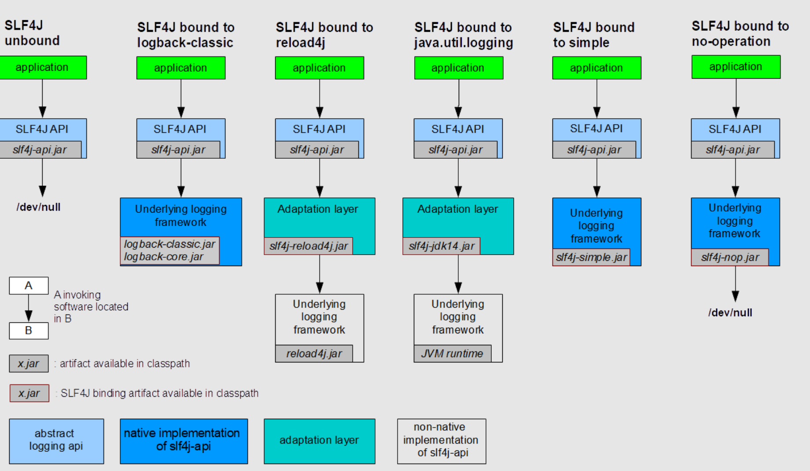

# SLF4J 使用指南

- [SLF4J 使用指南](#slf4j-使用指南)
  - [简介](#简介)
  - [Hello World](#hello-world)
  - [使用的典型模式](#使用的典型模式)
  - [Fluent Logging API](#fluent-logging-api)
  - [日志框架](#日志框架)
  - [常见问题](#常见问题)
    - [Logger 声明为 static](#logger-声明为-static)
  - [参考](#参考)

2025-02-28 ⭐
@author Jiawei Mao
***

## 简介

Java 简单日志外观（Simple Logging Facade for Java, SLF4J）可用作各种日志框架的抽象层，从而可以在部署时使用任何自己喜欢的日志框架。如 java.util.logging, log4j 1.x, reload4j 以及 logback 等。

SLF4J 只有 slf4j-api-x.x.xx.jar 一个必需依赖项。如果在类路径上没有任何绑定框架，则 SLF4J 默认不执行任何操作。
## Hello World

按照惯例，下面是使用 SLF4J 输出 "Hello World" 的简单方法。它首先获取一个名为 "HelloWorld" 的 logger，然后用该 logger 记录 "Hello World" 消息。

```java
import org.slf4j.Logger;
import org.slf4j.LoggerFactory;

public class HelloWorld{
    public static void main(String[] args) {
        Logger logger = LoggerFactory.getLogger(HelloWorld.class);
        logger.info("Hello World");
    }
}
```

如果类路径上只有 slf4j-api.jar，运行后控制台输出如下信息：

```
SLF4J: No SLF4J providers were found.
SLF4J: Defaulting to no-operation (NOP) logger implementation
SLF4J: See https://www.slf4j.org/codes.html#noProviders for further details.
```

如果使用的是 SLF4J 1.7 之前的版本，信息稍有不同：

```
SLF4J: Failed to load class "org.slf4j.impl.StaticLoggerBinder".
SLF4J: Defaulting to no-operation (NOP) logger implementation
SLF4J: See https://www.slf4j.org/codes.html#StaticLoggerBinder for further details.
```

该警告⚠️信息表示在类路径没有找到 slf4j provider。

在类路径添加 provider 后该警告信息会消失。slf4j-simple.jar 是最简单的日志框架（将日志输出到控制台），将其添加到类路径：

- slf4j-api-2.0.10.jar
- slf4j-simple-2.0.10.jar

编译并运行，在控制台得到如下输出：

```
0 [main] INFO HelloWorld - Hello World
```
## 使用的典型模式

以下代码演示 SLF4J 的典型使用模式。

```java
import org.slf4j.Logger;
import org.slf4j.LoggerFactory;

public class Wombat {

    final Logger logger = LoggerFactory.getLogger(Wombat.class);
    Integer t;
    Integer oldT;

    public void setTemperature(Integer temperature) {
        oldT = t;
        t = temperature;

        logger.debug("Temperature set to {}. Old value was {}.", t, oldT);

        if (temperature.intValue() > 50) {
            logger.info("Temperature has risen above 50 degrees.");
        }
    }
}
```

> [!TIP]
>
> 上面 `{}` 被后面的参数依次替代。

## Fluent Logging API

SLF4J 2.0.0（需要 Java 8）引入了向后兼容的 fluent API。所谓向后兼容，指不需要修改现有日志框架就能受益于 fluent API。

其核心思想是使用 `LoggingEventBuilder` 逐步构建日志事件，在完全构建日志后再记录。`org.slf4j.Logger`  接口中加入的 `atTrace()`, `atDebug()`, `atInfo()`, `atWarn()` 和 `atError()` 方法都返回 `LoggingEventBuilder` 实例。对禁用的 log-level，返回的 `LoggingEventBuilder` 不执行任何操作，因此保留了传统日志接口的纳秒级性能。

在使用 fluent API 时，最后必须调用 `log()` 或其变体方法。忘记调用 `log()` 方法会导致日志没有记录上。幸运的是，如果忘记调用 `log()`，有些 IDE 会发出[编译期警告](https://slf4j.org/faq.html#missingLogMethodCall)，如 Intellij IDEA 和 Eclipse。

下面是一些使用示例。

语句：

```java
logger.atInfo().log("Hello world.");
```

等价于：

```java
logger.info("Hello world.");
```

以下日志语句输出相同：

```java
int newT = 15;
int oldT = 16;

// 传统 API
logger.debug("Temperature set to {}. Old value was {}.", newT, oldT);

// fluent API
logger.atDebug().log("Temperature set to {}. Old value was {}.", newT, oldT);
   
// fluent API：逐个添加参数，最后 log 消息
logger.atDebug().setMessage("Temperature set to {}. Old value was {}.").addArgument(newT).addArgument(oldT).log();

// fluent API：使用 Supplier 提供参数
// Assume the method t16() returns 16.
logger.atDebug().setMessage("Temperature set to {}. Old value was {}.").addArgument(() -> t16()).addArgument(oldT).log();
```

fluent API 允许将许多不同类型的数据添加到 `org.slf4j.Logger`，还不会导致 `Logger` 接口方法过多。

现在可以传入多个 marker，传递带 `Supplier` 的参数，或传入多个 key-value 对。其中 key-value 对与日志数据分析工具结合使用非常方便。

如下日志语句等价：

```java
int newT = 15;
int oldT = 16;

// using classical API
logger.debug("oldT={} newT={} Temperature changed.", oldT, newT);

// using fluent API 
logger.atDebug().setMessage("Temperature changed.").addKeyValue("oldT", oldT).addKeyValue("newT", newT).log();
```

key-value 对作为单独对象保存。org.slf4j.Logger 中的默认实现将 key-value 对放在消息前面。日志后端可以重新定制行为。
## 日志框架

如前所述，SLF4J 旨在作为各种日志框架的包装层。SLF4J 提供了几个称为 provider 的 jar 文件，每个对应一个支持的日志框架。SLF4J 1.7 之前将具体日志框架成为 binding。

|框架|说明|
|---|---|
|slf4j-log4j12-2.0.17.jar |绑定log4j 1.2，一个应用广泛的日志框架。由于 log4j 1.x 在 2015 年和2022年宣布 EOL，SLF4J-log4j 模块从 1.7.35 开始自动重定向到 SLF4J-reload4j 模块。如果需要继续使用 log4j 1.x 框架，建议使用 slf4j-reload4j。|
|slf4j-reload4j-2.0.10.jar| SINCE 1.7.33：reload4j 框架的 provider。Reload4j 是 log4j 1.2.7 的替代品。同时需要将 reload4j.jar 放在类路径|
|slf4j-jdk14-2.0.10.jar|绑定 java.util.logging，即 JDK 1.4 logging|
|slf4j-nop-2.0.10.jar|绑定NOP，即丢弃所有日志|
|slf4j-simple-2.0.10.jar|绑定简单实现，输出所有日志到 `System.err`。只输出 level 高于或等于 INFO 的信息|
|slf4j-jcl-2.0.10.jar|绑定 Apache Commons Logging 框架，即 Jakarta Commons Logging（JCL）|
|logback-classic-1.4.6.jar|需要 logback-core-1.4.6.jar，用于 Jakarta EE|
|logback-classic-1.5.15.jar|用于 Jakarta EE，需要 logback-core-1.5.15.jar|

> [!IMPORTANT]
>
> logback 本地实现了 SLF4J。Logback 的 `ch.qos.logback.classic.Logger` 类直接实现了 `org.slf4j.Logger`，因此 SLF4J 与 logback 结合使用，额外开销最小。

要切换日志框架，只需替换类路径上的 slf4j-bindings。例如，要从 java.util.logging 切换到 reload4j，只需将 slf4j-jdk14-2.0.10.jar 替换为 slf4j-reload4j-2.0.10.jar。

**SINCE 2.0.0**，SLF4J bindings 改名为 providers。不同总体思路一样，SLF4J 2.0.0 通过 `ServiceLoader` 机制查找日志后端。

下面是总体思路图示：



SLF4J 接口及其各种 adapter 非常简单。大多数熟悉 Java 语言的开发人员应该能在一小时内阅读并完全理解代码。

## 常见问题

### Logger 声明为 static

static logger 对类的所有实例，只有一个变量引用，而 instance logger 则对类的每个实例，都有一个变量引用。如果一个简单的类实例化上千次，则其资源消耗会很显著。

但是，日志系统框架（如 log4j, logback）为应用服务器中的每个运行程序提供不同的 logger context。因此，即使服务器中只部署了单个 log4j.jar 或 logback-classic.jar，日志系统会区分不同应用，为不同应用提供不同的 logger context。

具体来说，每次通过调用 LoggerFactory.getLogger() 获得 logger，底层的日志系统会返回一个适合当前应用的 logger 实例。即，在相同程序的，相同日志名获得相同的 logger，而在不同应用，相同日志名或得到不同的 logger。

如果 logger 是 static 的，那么当托管类被加载到内存中，它只会被创建一次。如果托管类只在一个应用中使用，那么没有任何问题。如果托管类在不同应用中共享，则共享类的所有实例都将输出日志到最先载入共享类的 logger context，这种不可预测的行为往往不为人所喜。

SL4J API的 non-native 实现，即 slf4j-log4j12，log4j 的仓库选择器无法根据环境选择合适的 logger。 SLF4J的原生实现，如 logback-classic，则可以按照预期的选择合适的仓库。

我们曾经建议将 logger 声明为实例变量而不是静态变量。但是经过进一步分析，我们不再推荐任何一种方法。

**声明为 static**

**优点：**

1. 普遍的使用模式
2. CPU 开销更少：logger 对每个类只初始化一次
3. 内存开销更少：logger 对每个类只有一个引用

**缺点：**

1. 对应用程序之间的共享库，无法利用储存库选择器。如果每个应于都有一个 SLF4J provider 和底层日志框架，则每个应用的日志环境依然是独立的。
2. 在IOC中不好使用。

**声明为实例变量**

**优点：**

1. 不同应用共享的库，也可以利用储存库选择器。但是只对 logback-classic 框架有效。存储库选择器在 SLFJ+log4j 中不能使用。
2. IOC友好

**缺点：**

1. 相对声明为 static 来说，使用较少
2. CPU开销较大：对类的每个实例，需要一个 logger
3. 内存开销较大

## 参考

- https://slf4j.org/manual.html