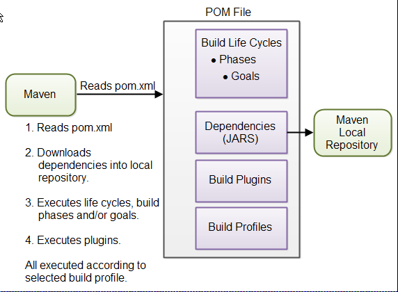

- [简介](#%e7%ae%80%e4%bb%8b)
- [构建生命周期](#%e6%9e%84%e5%bb%ba%e7%94%9f%e5%91%bd%e5%91%a8%e6%9c%9f)
  - [构建生命周期（Build Life cycles）](#%e6%9e%84%e5%bb%ba%e7%94%9f%e5%91%bd%e5%91%a8%e6%9c%9fbuild-life-cycles)
  - [构建阶段（Build Phases）](#%e6%9e%84%e5%bb%ba%e9%98%b6%e6%ae%b5build-phases)
  - [Build Goals](#build-goals)
  - [插件](#%e6%8f%92%e4%bb%b6)
- [Maven 安装](#maven-%e5%ae%89%e8%a3%85)
  - [Maven 目录结构](#maven-%e7%9b%ae%e5%bd%95%e7%bb%93%e6%9e%84)

# 简介
Maven 是一个项目管理和分析工具，使项目的构建，单元测试，文档生成等任务更轻松的完成。

Maven 的核心是POM，POM包含构建所需的所有资源引用。下面演示 Maven 如何使用POM文件：

下面简略的介绍一下上图中涉及到的概念：

1) **POM文件**

Maven 执行所需的文件，Maven 根据POM文件中的内容执行命令。

2) **构建生命周期、阶段和目标**（Build Life Cycles, Phases and Goals）

Maven 的构建过程被划分为不同的生命周期、阶段和目标。
- 生命周期包含一系列的构建阶段（phases）;
- 每个构建阶段（phases）包含一系列的构建目标（goals）

当将命令传递给 Maven 执行，该命令为生命周期、阶段或目标的名称。
- 如果执行的为生命周期，则该生命周期中的所有阶段均执行；
- 如果执行的为阶段，则在预定义构建阶段序列中该构建阶段前的所有构建阶段也会执行。

3) **依赖项和仓库**（Dependencies and Repositories）

依赖项（Dependencies）是项目所依赖的外部 JAR文件。

如果在本地仓库没有找到依赖项，Maven 会从 Maven 中心仓库下载并保存到本地仓库。

本地仓库是当前电脑上的一个目录，可以通过配置指定本地仓库的位置；还可以指定远程仓库的位置。

4) **构建插件**（Build Plugins）

构建插件用于将额外的构建目标（goals）插入到构建阶段（phase）中。

如果标准的 Maven 构建生命周期中不包含你所需的功能，可以通过在 POM 中添加包含该功能的插件。Maven 包含许多标准插件，基本涵盖了构建所需的所有功能，如果没有，也可以自定义实现 Maven 插件。

5) **构建配置**（Build Profiles）

如果需要以不同的方式构建项目，可以使用构建配置。例如，你可能需要为开发、测试和发布定义不同的构建选项，此时可以在 POM 中添加不同的构建配置，在执行时选择对应的配置。

# 构建生命周期
基本概念：
- 构建生命周期（build life cycle）由多个构建阶段（build phases）组成;
- 每个构建阶段（build phases）由多个构建目标（build goals）组成。

## 构建生命周期（Build Life cycles）
Maven 包含3个标准 build life cycles:
1) default (or build)，处理所有和编译打包相关的事
2) clean，移除输出目录下所有的临时文件，包括省从源码，编译类，之前的JAR文件等
3) site，生成文档相关的业务，实际上，site可以根据项目文档生成一个完整的网站。

这三个 build life cycles 用于构建项目的不同方面，它们相互独立。

## 构建阶段（Build Phases）
不能直接执行 default life cycle，可以指定 default life cycle 中的某个 build phase or goal.

当执行特定的 phase, 该 phase 之前的所有 phases 都会依次执行。
default life cycle中最常见的build phases如下：

|Build Phase|Description|
|---|---|
|validate|Validates that the proejct is correct and all necessary information is available. This also makes sure the dependencies are downloaded|
|compile|Compiles the source code of the project|
|test|Runs the tests against the compiled source code using a suitable unit testing framework. These tests should not require the code be packaged or deployed|
|package|Packs the compiled code in its distributable format, such as a JAR|
|verify|run any checks to verify the package is valid and meets quality criteria|
|install|Install the package into the local repository, for use as a dependency in other projects locally.|
|deploy|Copies the final package to the remote repository for sharing with other developers and projects.|

阶段实际上映射到底层的目标（goal），每个阶段执行的目标取决于项目类型。例如，对 `package`，如果项目类型为 JAR，执行 `jar:jar`，如果项目类型为 WAR，则执行 `war:war`。

mvn install
编译，构建并安装到 local repository.

mvn clean install
To ensure that the build target is removed before a new build, add the clean target.
mvn clean install

mvn package
打包JAR、

mvn clean
remove the target directory with all the build data before starting so that it is fresh.

mvn idea:idea
generate an intellij idea descriptor for the project

mvn eclipse:eclipse
生成eclipse 项目文件

jar:jar
will not recompile sources- it will simply just create a JAR from the target/classes directory, under the assumption everything else had already been done.

## Build Goals
Build goals,最细小的执行步骤。

## 插件
插件用于实现标准 Maven 流程中没有的功能，每个插件包含多个 goals，用于实现某个功能。

# Maven 安装
Maven 安装十分简单，下载解压后设置环境变量即可。

## Maven 目录结构
|目录|说明|
|---|---|
|src/main/java|源码目录|
|src/main/resources|资源目录|
|src/main/resources-filtered|过滤资源(Maven 3.4.0)|
|src/main/filters|Resource filter files|
|src/main/webapp|Web application sources|
|src/test/java|测试源码|
|src/test/resources|测试资源|
|src/test/resoutces-filtered|Test resources which are filtered by default. (Maven 3.4.0)|
|src/test/filters|Test resource filter files|
|src/it|Integration Tests (primarily for plugins)|
|src/assembly|Assembly descriptors|
|src/site|Site|
|LICENSE.txt|Project's license|
|NOTICE.txt|Notices and attributions required by libraries that the proejct depends on|
|README.txt|Project's readme|
