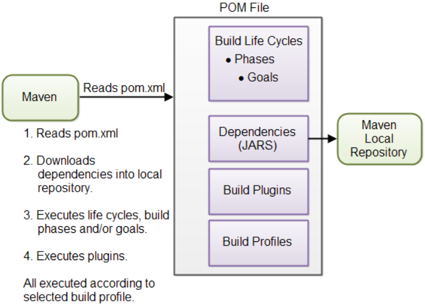

# Introduction

- [Introduction](#introduction)
  - [概述](#%e6%a6%82%e8%bf%b0)
    - [POM文件](#pom%e6%96%87%e4%bb%b6)
    - [生命周期、阶段和目标](#%e7%94%9f%e5%91%bd%e5%91%a8%e6%9c%9f%e9%98%b6%e6%ae%b5%e5%92%8c%e7%9b%ae%e6%a0%87)
    - [依赖项和仓库](#%e4%be%9d%e8%b5%96%e9%a1%b9%e5%92%8c%e4%bb%93%e5%ba%93)
    - [构建插件](#%e6%9e%84%e5%bb%ba%e6%8f%92%e4%bb%b6)
    - [构建配置](#%e6%9e%84%e5%bb%ba%e9%85%8d%e7%bd%ae)
  - [构建生命周期](#%e6%9e%84%e5%bb%ba%e7%94%9f%e5%91%bd%e5%91%a8%e6%9c%9f)
    - [Life cycle](#life-cycle)
    - [Phase](#phase)
    - [Goal](#goal)
  - [插件](#%e6%8f%92%e4%bb%b6)
  - [Maven 安装](#maven-%e5%ae%89%e8%a3%85)
  - [Maven 目录结构](#maven-%e7%9b%ae%e5%bd%95%e7%bb%93%e6%9e%84)

***

## 概述

Maven 是一个项目管理和分析工具，其宗旨是使项目的构建、单元测试和文档生成等任务的执行更轻松。

Maven 的核心是POM，POM包含构建所需所有资源的引用。下图演示 Maven 如何使用POM文件：

下面简要介绍一下上图中涉及到的概念。

### POM文件

Maven 执行所需的文件，Maven 根据POM文件中的内容执行命令。

### 生命周期、阶段和目标

Maven 的构建过程可以分为不同的生命周期（life cycle）、阶段（phase）和目标（goal）：

- 生命周期包含一系列的构建阶段（phases）;
- 每个构建阶段（phases）包含一系列的构建目标（goals）

传递给 Maven 执行的命令为生命周期、阶段或目标的名称：

- 如果执行的为生命周期，则该生命周期中的所有阶段均执行；
- 如果执行的为阶段，则在预定义构建阶段序列中该阶段前的所有阶段也会执行。

### 依赖项和仓库

依赖项（Dependencies）是项目所依赖的外部 JAR文件。

如果在本地仓库没有找到依赖项，Maven 会从 Maven 中心仓库（Repository）下载并保存到本地仓库。

本地仓库是当前电脑上的一个目录，可以通过配置指定本地仓库的位置；还可以指定远程仓库的位置。

### 构建插件

构建插件（Build Plugins）用于将额外的 goals 插入到 phase 中。

通过在 POM 中添加插件，可以在标准的 Maven 构建生命周期中添加额外功能。Maven 包含许多标准插件，基本涵盖了构建所需的所有功能，如果没有你要的功能，还可以自定义实现 Maven 插件。

### 构建配置

如果需要以不同的方式构建项目，可以使用构建配置（Build Profiles）。例如，你可能需要为开发、测试和发布定义不同的构建选项，此时可以在 POM 中添加不同的构建配置，在执行时选择对应的配置。

## 构建生命周期

基本概念：

- 构建生命周期（build life cycle）由多个构建阶段（build phases）组成;
- 每个构建阶段（build phases）由多个构建目标（build goals）组成。

### Life cycle

Maven 包含3个标准构建声明周期（build life cycles）:

1) default (or build)，处理所有和编译、打包相关的事
2) clean，移除 maven 输出目录下所有的临时文件，包括编译类和之前的JAR文件等
3) site，生成文档相关的业务，实际上，site可以根据项目文档生成一个完整的网站。

这三个 build life cycles 用于构建项目的不同方面，它们相互独立。

### Phase

生命周期不能直接执行，而是执行某个 phase 或 goal 。

当执行特定的 phase, 该 phase 之前的所有 phases 都会依次执行。

默认生命周期中常见的 phases 如下：

| Build Phase | Description                                                                              |
| ----------- | ---------------------------------------------------------------------------------------- |
| validate    | 验证项目是否正确，包括所需资源是否可用，所需依赖性是否已下载                             |
| compile     | 编译项目的源代码                                                                         |
| test        | 使用合适的单元测试框架对已编译的源代码运行测试。运行测试不需要将代码打包或部署（deploy） |
| package     | 将编译后的代码打包为可分发的格式，如 JAR                                                 |
| verify      | 验证包是否有效                                                                           |
| install     | 将包安装到本地 maven 仓库，从而可以作为其它本地项目的依赖性                              |
| deploy      | 将最终的软件包复制到远程仓库，以便与其他人共享                                           |

phase 实际上映射到底层的 goal，每个 phase 执行的 goal 取决于项目类型。例如，对 `package`，如果项目类型为 JAR，执行 `jar:jar`，如果项目类型为 WAR，则执行 `war:war`。

- `mvn install`

编译，构建并安装到 local repository.

- `mvn clean install`

在 `install` 前 `clean` 以确保新构建前删除之前构建生成的文件。

- `mvn package`

打包JAR。

- `mvn clean`

在开始构建之前，删除包含所有构建数据的目录，以确保每次构建内容都是最新的。

- `mvn idea:idea`

生成 intellij idea 项目文件。

- `mvn eclipse:eclipse`

生成eclipse 项目文件。

- `jar:jar`

该命令不会重新编译源码，而是直接将 target/classes 目录打包为 JAR 文件。

### Goal

Build goals,最细小的执行步骤。

## 插件

插件用于实现标准 Maven 流程中没有的功能，每个插件包含多个 goals，用于实现某个功能。

## Maven 安装

Maven 安装十分简单，下载解压后设置环境变量即可。

## Maven 目录结构

| 目录                        | 说明                                                                       |
| --------------------------- | -------------------------------------------------------------------------- |
| src/main/java               | 源码目录                                                                   |
| src/main/resources          | 资源目录                                                                   |
| src/main/resources-filtered | 过滤资源(Maven 3.4.0)                                                      |
| src/main/filters            | Resource filter files                                                      |
| src/main/webapp             | Web application sources                                                    |
| src/test/java               | 测试源码                                                                   |
| src/test/resources          | 测试资源                                                                   |
| src/test/resoutces-filtered | Test resources which are filtered by default. (Maven 3.4.0)                |
| src/test/filters            | Test resource filter files                                                 |
| src/it                      | Integration Tests (primarily for plugins)                                  |
| src/assembly                | Assembly descriptors                                                       |
| src/site                    | Site                                                                       |
| LICENSE.txt                 | Project's license                                                          |
| NOTICE.txt                  | Notices and attributions required by libraries that the proejct depends on |
| README.txt                  | Project's readme                                                           |
