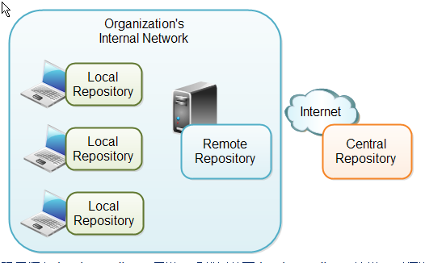

# Maven repository

- [Maven repository](#maven-repository)
  - [简介](#%e7%ae%80%e4%bb%8b)
  - [Local](#local)
  - [Central](#central)
  - [Remote](#remote)

***

## 简介

Maven 仓库可以分为三种类型：

- 本地仓库（local）
- 中心仓库（central）
- 远程仓库（remote）

Maven 按照上面的顺序搜索对应的JAR。即：

1) 搜索 Local repository, 找不到则到下一步
2) 搜索 Central repository, 如果找不到，且有设置 remote repository，则到Step 4
3) 如果未设置 remote repository, Maven 停止执行并报错
4) 搜索 remote repository，如果找到则下载到 local repository, 否则停止执行并报错



## Local

本地仓库就是电脑上的一个目录。该 repository 包含 Maven 下载下来的所有dependencies。

在 `settings.xml` 中设置本地仓库目录，例如：

```xml
<localRepository>D:/jrepo</localRepository>
```

设置本地仓库为 "D:/jrepo"。

## Central

[Central 仓库地址](http://repo1.maven.org/maven2/)

[搜索地址](http://search.maven.org/#browse)

## Remote

自定义仓库的方式。

如repo:

- [http://repo.maven.apache.org/maven2/](http://repo.maven.apache.org/maven2/)
- [http://central.maven.org/maven2/](http://central.maven.org/maven2/)
