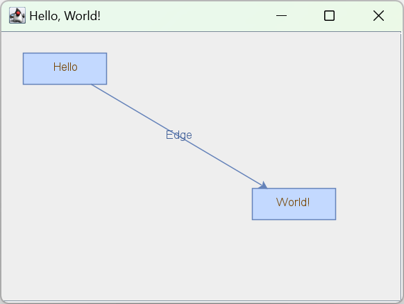
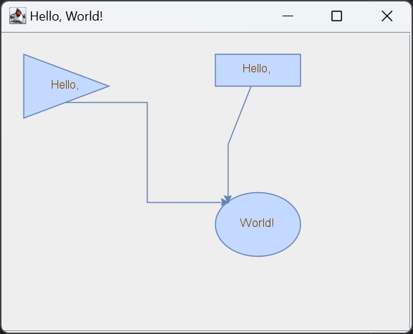
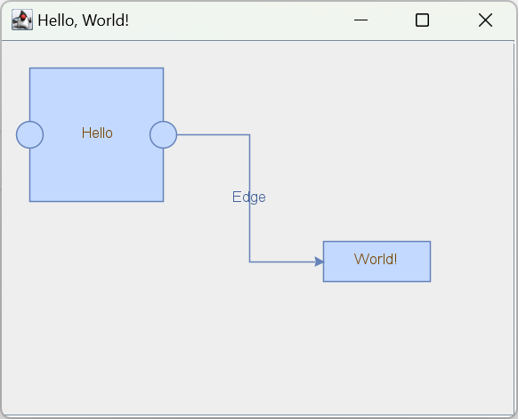

# JGraphX

## 简介

JGraphX 是 Java Swing 版本的 mxGraph。JGraphX 兼容 Java 5。

JGraphX 的包名为 `com.mxgraph`，主类为 `mxGraph`。

JGraphX 可用于：流程图、工作流和 BPM 可视化、交通或水流、数据库和 WWW 可视化、网络、GIS、UML 图、电路、金融和社交网络、数据挖掘、生物化学、生态循环等。

JGraphX 的特点：

1. 支持丰富的样式；
2. 支持交互：拖拽、缩放、平移等
3. layout 算法，如分层布局、树形布局、圆形布局
4. 导入和导出

JGraphX 用 cell 表示图的元素，包括 edge 和 vertex。

可视化指创建 graph 的视觉表示的过程。JGraphX 支持广泛的 graph 可视化功能，cell 的显示仅受开发人员的技能和 Swing 平台的限制。顶点可以是形状、图像、矢量图、动画，Swing 中任何图形操作几户都可以。还可以在文本标签中使用 HTML。

## JGraphX 框架

### JGraphX 模型

`mxGraphModel` 为 graph 模型类，`mxGraph` 为主类，主要操作通过 `mxGraph` 类执行。即 `mxGraph` 中添加了 `mxGraphModel` 的代理方法，图形结构的添加、更改和删除均通过该 API 进行。该模型还提供确定 graph 结构的方法，以及设置视觉状态（可见性、分组和样式）的方法。

JGraphX 使用事务系统更改模型。在 HelloWorld 示例中，可以看到：

```java
// 位模型添加 cells
graph.getModel().beginUpdate(); // 开始修改模型
try {
   Object v1 = graph.insertVertex(parent, null, "Hello,", 20, 20, 80, 30);
   Object v2 = graph.insertVertex(parent, null, "World!", 200, 150, 80, 30);
   Object e1 = graph.insertEdge(parent, null, "", v1, v2);
} finally {
   // 更新显示
   graph.getModel().endUpdate(); // 完成修改
}
```

这里添加了 2 个 vertices 和 1 个 edge。每次更改模型，都要先调用 `beginUpdate()`，完成后调用 `endUpdate()` 发出事件更改通知。

关键 API：

- `mxGraphModel.beginUpdate()`，开始一个新事务或新的子事务；
- `mxGraphModel.endUpdate()`，完成一个事务或子事务；
- `mxGraph.addVertex()`，添加一个新的 vertex 到指定 parent-cell；
- `mxGraph.addEdge()`，添加一个新的 edge 到指定 parent-cell

> [!NOTE]
>
> 从技术上讲，不需要使用 beginUpdate 和 endUpdate 包围修改调用。在 update 范围以外的修改会立刻生效，并立刻发出通知。更新范围是为了控制事件通知和撤销操作的粒度。

将修改内容放在 try...finally 中可以确保更新完成，即使修改模型操作出错。为了更好调试，建议在修改模型时使用此范式。

后面会介绍 parent-cell，暂时忽略它。

### 事务模型

JGraphX 事务支持嵌套，即模型中有一个计数器，每次调用 `beginUpdate` +1，每次 `endUpdate` -1。在增加到至少 1 之后，当该计数再次达到 0，认为模型事务完成，触发模型更改的事件通知。

这意味着每个更新模型的代码段都应该放在 begin/end 内。撤销操作、自动布局等均需要该特性。

在自动布局中，用户通过用户界面对图形进行更改，应用程序根据某些规则自动定位。自动布局是位于 begin/end update 之间的独立算法。由于 being/end update 中的所有更改都直接针对 graph-model，因此 layout 可以在更改过程中根据 model 的状态采取行为。

#### 修改模型方法

以下方法会修改 graph 模型，应该放在 update score 中：

- `add(parent, child, index)`
- `remove(cell)`
- `setCollapsed(cell, collapsed)`
- `setGeometry(cell, geometry)`
- `setRoot(root)`
- `setStyle(cell, style)`
- `setTerminal(cell, terminal, isSource)`
- `setTerminals(edge,source,target)`
- `setValue(cell, value)`
- `setVisible(cell, visible)`

这些方法都在 `mxGraph` 类中。

模型的视觉信息包括 cell 位置、可见性和折叠状态。模型存储这些属性的默认值，视图（view）则可以覆盖这些属性值。模型只是框架中第一个可以全局设置这些属性的通用位置。

#### 插入 Cell

HelloWorld 中的 graph 包含 3 个 cells，即 2 个 vertices 和 1 个 edge。可以使用模型的 `add()` 方法添加顶点和边。但是为了简便，推荐使用 `mxGraph` 方法：

- `mxGraph.insertVertex(parent, id, value, x, y, width, height, style)`：创建并插入一个新的 vertex
- `mxGraph.insertEdge(parent, id, value, source, target, style)`：创建并插入一个新的 edge

模型要求添加的 cell 已经创建，而 `mxGraph.insertVertex()` 会创建并返回 `mxCell` 对象，其参数：

- `parent`，group 结构中的直接 parent-cell。这里跳过，直接使用 `graph.getDefaultParent()` 作为默认 parent-cell；
- `id`，cell 的全局识别符，String 类型。如果不想自己维护 id，可以传入 `null` 并保证 `mxGraphModel.isCreateIds()` 返回 true 即可，这样模型会自动创建并管理 id。
- `value`，cell 的用户对象，用于关联业务逻辑与 JGraphX 可视化表示。如果使用 String，它会作为 vertex 或 edge 的标签。
- x, y, width, height，作为 vertex 左上角位置，宽度和高度。
- `style`，应用于 vertex 的样式。是遵循特定格式的字符串。

添加 edge 方法的参数与此类似，在添加 edge 前，其 source 和 target 必须已经插入到模型。

## mxCell

`mxCell` 表示 vertex 和 edge。mxCell 许多方法与模型相同，主要区别在于：使用模型会创建事件通知和支持撤销，使用 cell 修改则没有修改记录。这对于临时视觉效果，如动画、鼠标悬停时的变化非常有用。但一般来说，建议使用模型 API。

创建新的 cell，至少需要三个信息：value, geometry, style。

### Styles

cell 样式与 CSS 样式表类似。

mxStyleSheet 包含一个 styles 对象，该对象定义样式名称到具体样式数组的映射。


JGraphX 创建了两种默认样式，一种用于顶点，一种用于边。

#### 设置 cell 样式

如果不喜欢默认样式，则可以在创建 cell 时（insertVertex, insertEdge）或用 model.setStyle() 定义样式。

1. 已经创建了 ROUNDED 样式，应用到 vertex

```java
Object v1 = graph.insertVertex(parent, null, "Hello", 20, 20, 80, 30, "ROUNDED");
```

2. 使用 ROUNDED 样式创建新的 vertex，覆盖 stroke 和 fill 颜色

```java
Object v1 = graph.insertVertex(parent, null, "Hello",  20, 20, 80, 30, 
                               "ROUNDED;strokeColor=red;fillColor=green");
```

3. 创建一个新的 vertex，没有全局样式，只有 local stroke 和 fill 颜色

```java
Object v1 = graph.insertVertex(parent, null, "Hello", 20, 20, 80, 30, 
                               ";strokeColor=red;fillColor=green");
```

4. 创建一个 vertex，使用 defaultVertex 样式，但是使用其它 fill 颜色

```java
Object v1 = graph.insertVertex(parent, null, "Hello", 20, 20, 80, 30, 
                               "defaultVertex;fillColor=blue");
```

注意，这里必须显式命名默认样式。如果不以分号开头，则使用默认样式。

`mxGraph` 类也提供了修改 cell 样式的函数：

- `mxGraph.setCellStyle(style, cells)`：在 begin/end scope 中，设置 cell 数组的样式
- `mxGraph.getCellStyle(cell)`：返回指定 cell 的样式，合并 local-style 和 default-cell

#### 创建新的 global 样式

可以按照下面的模板创建上面的 ROUNDED global 样式，并注册到 mxStyleSheet：

```java
mxStylesheet stylesheet = graph.getStylesheet();
Hashtable<String, Object> style = new Hashtable<String, Object>();
style.put(mxConstants.STYLE_SHAPE, mxConstants.SHAPE_RECTANGLE);
style.put(mxConstants.STYLE_OPACITY, 50);
style.put(mxConstants.STYLE_FONTCOLOR, "#774400");
stylesheet.putCellStyle("ROUNDED", style);
```

### Geometry

在 HelloWorld 示例中，可以看到在 `insertVertex` 方法的参数包含 vertex 的位置和大小。在 java 中，坐标系统是 x 向右正，y 向下为正，对 graph，则是相对 `mxGraph` 所在容器的绝对位置。

之所以使用单独的 `mxGeometry` 类，而不是直接使用 `mxRectangle` 类保存该信息，是因为 edge 也有几何信息。

edge 的宽度和高度被忽略，x 和 y 与标签的位置有关。此外，edge 有控制点的概念。


> 该 edge 有 2 个控制点

geometry 还有两个重要概念，相对定位和偏移（offset）。

#### 相对定位

vertex 的 x 和 y 默认是相对 parent 矩形边框左上点的偏移。parent 和 group 的概念后面会介绍。如果一个 cell 没有 parent，graph 的容器就是其 parent，便于定位。


> 非相对 vertex 定位

在非相对定位模式，edge-label 的位置是相对 graph origin 的绝对 offset。


在相对模式，顶点的 (x,y) 是相对 parent cell 的比例。(0,0) 表示与 parent-cell 左上角，(1,1)  表示 parent-cell 的右下角。相对模式对保持子 cell 与 parent-cell 的相对位置和大小很重要。


> 相对 vertex 定位

最后，相对模式下的 edge label 是参考 edge 中心位置。x 坐标是从 edge 的 source (-1) 到 edge 的 target (1) 的相对距离。y 坐标是 edge 正交的像素偏移。

启用 edge label 相对定位比较方便。在 `mxGraph.insertEdge()` 方法中，可以看到它调用 `createEdge()`，而在 `createEdge()` 中，使用该范式创建的几何形状都是相对的。

`mxGeometry` 中的 offset 字段应用于 cell 标签的绝对 x,y 偏移。对于 edge 标签，offset 是根据相对 label 计算 edge 标签后应用。

核心 API：

- **mxGraph.resizeCell(cell, bounds)** – 在 begin/end update 内，将指定 cell 的大小调整到指定 bounds
- **mxGraph.resizeCells(cells, bounds)** – 批量操作

### User Object

user-object 位 JGraphX 图标提供上下文，存储鱼可视化 cell 相关的业务逻辑。在 HelloWorld 示例中，user-object 是一个字符串，仅用作 cell 的标签。在更复杂的营业中，user-object 为 `Object`，其一些属性作为可视化 cell 的标签，其余部分描述应用逻辑。

以工作流为例：


假设用户右键单击 `Check Inventory` 并选择属性，出现对话框：


这些属性包括几何属性、标签、ID 等，对 dialog 可以轻松显示 cell 的 user-object。

### Cell Types

`mxGraph` 是使用该库的主要 API。但是 cell 类型只能在 cell 或 model 上查看。

`mxCell` 有两个 boolean 值，vertex 和 edge，辅助方法在创建 cell 时将其中一个设置为 true。

`mxGraphModel` 的 `isVertex()`, `isEdge()` 是模型用来确定 cell 类型。从技术上讲，可以在运行时切换 cell 类型，但是在修改类型后需要使 cell 状态无效。另外，注意几何对象变量对顶点和边的含义不同。通常不建议在运行时更改 cell 类型。

## Group 结构

分组，是将逻辑上管理的 cell 分组。许多图形工具包中，将 group 称为 sub-graph。分组 graph 模型中一个或多个顶点和边设为一个 cell 的子节点（通常为 vertex）。JGraphX 通过 group 提供了许多功能：

- sub-graph，逻辑上独立的 graph,在更高级别的 graph 中座位 cell 显示
- 展开和折叠。折叠指一组 cells 用一个 parent-cell 显示；展开则相反。在 GraphEditor 示例中创建 cell-group 时，点击左上角的 `-` 可以看到该行为。在下面的复杂性管理部分进行了描述。
- 分层。分层指将 cells 按特定 z-order 显示。
- drill down, step up。将 sub-graph 如完整 graph 一样进行可视化和编辑。例如，将 workflow 中每个 vertex 描述为执行任务的软件流程。应用程序可能提供一个深入检查库存的顶点。这将导致出现一个新的 graph，详细描述系统如何检查库存。该 graph 可能以 "检查库存" 为标题表明它是 sub-graph，以及返回上一级的选项。

分组时，cells 被分配一个 parent-cell。在最简单的情况，所有 cells 都以 default-parent 作为 parent-cell。default-parent 是一个不可见的 cell，其 bounds 与 graph 相同。在 HelloWorld 示例中，`graph.getDefaultParent()` 返回 default-parent。顶点位置 (x,y) 是相对于 parent-cell 的位置，因此在默认分组中，cell 定位也是 graph 组件的绝对坐标。如果所有 cell 都添加到默认 root，则在 HelloWorld 示例中，group 结构在逻辑上如下：


注意 Layout0 cell，这是 group 结构中默认间接寻址，便于根据附加 cell 更改。后面的 group 视图忽略它。

edge label 的位置也是相对 parent-cell。

## 示例

### Hello World

```java
import com.mxgraph.swing.mxGraphComponent;
import com.mxgraph.view.mxGraph;

import javax.swing.*;

public class HelloWorld extends JFrame {

    private static final long serialVersionUID = -2707712944901661771L;

    public HelloWorld() {
        super("Hello, World!");

        mxGraph graph = new mxGraph();
        Object parent = graph.getDefaultParent();

        graph.getModel().beginUpdate();
        try {
            Object v1 = graph.insertVertex(parent, null, "Hello", 20, 20, 80,
                    30);
            Object v2 = graph.insertVertex(parent, null, "World!", 240, 150,
                    80, 30);
            graph.insertEdge(parent, null, "Edge", v1, v2);
        } finally {
            graph.getModel().endUpdate();
        }

        mxGraphComponent graphComponent = new mxGraphComponent(graph);
        getContentPane().add(graphComponent);
    }

    public static void main(String[] args) {
        HelloWorld frame = new HelloWorld();
        frame.setDefaultCloseOperation(JFrame.EXIT_ON_CLOSE);
        frame.setSize(400, 320);
        frame.setVisible(true);
    }
}
```



显示两个矩形和一条连接线。

### ClickHandler

显示图形元素的点击事件，点击矩形和边都有响应。

```java
import java.awt.event.MouseAdapter;
import java.awt.event.MouseEvent;

import javax.swing.JFrame;

import com.mxgraph.swing.mxGraphComponent;
import com.mxgraph.view.mxGraph;

public class ClickHandler extends JFrame {

    private static final long serialVersionUID = -2764911804288120883L;

    public ClickHandler() {
        super("Hello, World!");

        final mxGraph graph = new mxGraph();
        Object parent = graph.getDefaultParent();

        graph.getModel().beginUpdate();
        try {
            Object v1 = graph.insertVertex(parent, null, "Hello", 20, 20, 80,
                    30);
            Object v2 = graph.insertVertex(parent, null, "World!",
                    240, 150, 80, 30);
            graph.insertEdge(parent, null, "Edge", v1, v2);
        } finally {
            graph.getModel().endUpdate();
        }

        final mxGraphComponent graphComponent = new mxGraphComponent(graph);
        getContentPane().add(graphComponent);

        graphComponent.getGraphControl().addMouseListener(new MouseAdapter() {
            public void mouseReleased(MouseEvent e) {
                Object cell = graphComponent.getCellAt(e.getX(), e.getY());

                if (cell != null) {
                    System.out.println("cell=" + graph.getLabel(cell));
                }
            }
        });
    }

    public static void main(String[] args) {
        ClickHandler frame = new ClickHandler();
        frame.setDefaultCloseOperation(JFrame.EXIT_ON_CLOSE);
        frame.setSize(400, 320);
        frame.setVisible(true);
    }
}
```

### CustomCanvas

自定义主题。

```java
import javax.swing.BorderFactory;
import javax.swing.CellRendererPane;
import javax.swing.JFrame;
import javax.swing.JLabel;
import javax.swing.border.BevelBorder;

import com.mxgraph.canvas.mxICanvas;
import com.mxgraph.canvas.mxImageCanvas;
import com.mxgraph.swing.mxGraphComponent;
import com.mxgraph.swing.handler.mxRubberband;
import com.mxgraph.swing.view.mxInteractiveCanvas;
import com.mxgraph.view.mxCellState;
import com.mxgraph.view.mxGraph;

public class CustomCanvas extends JFrame {

    private static final long serialVersionUID = -844106998814982739L;

    public CustomCanvas() {
        super("Custom Canvas");

        // 使用 Swing 组件渲染节点
        // Note: Use the heavyweight feature to allow for event handling in
        // the Swing component that is used for rendering the vertex.
        mxGraph graph = new mxGraph() {
            public void drawState(mxICanvas canvas, mxCellState state,
                    boolean drawLabel) {
                String label = (drawLabel) ? state.getLabel() : "";

                // 在 image canvas 中包括 Swing canvas（用于在拖动 cell 时创建预览 image）
                if (getModel().isVertex(state.getCell())
                        && canvas instanceof mxImageCanvas
                        && ((mxImageCanvas) canvas)
                        .getGraphicsCanvas() instanceof SwingCanvas) {
                    ((SwingCanvas) ((mxImageCanvas) canvas).getGraphicsCanvas())
                            .drawVertex(state, label);
                }
                // Redirection of drawing vertices in SwingCanvas
                else if (getModel().isVertex(state.getCell())
                        && canvas instanceof SwingCanvas) {
                    ((SwingCanvas) canvas).drawVertex(state, label);
                } else {
                    super.drawState(canvas, state, drawLabel);
                }
            }
        };

        Object parent = graph.getDefaultParent();

        graph.getModel().beginUpdate();
        try {

            Object v1 = graph.insertVertex(parent, null, "Hello", 20, 20, 80,
                    30);
            Object v2 = graph.insertVertex(parent, null, "World!", 240, 150, 80,
                    30);
            graph.insertEdge(parent, null, "Edge", v1, v2);
        } finally {
            graph.getModel().endUpdate();
        }

        mxGraphComponent graphComponent = new mxGraphComponent(graph) {
            private static final long serialVersionUID = 4683716829748931448L;

            public mxInteractiveCanvas createCanvas() {
                return new SwingCanvas(this);
            }
        };

        getContentPane().add(graphComponent);

        // Adds rubberband selection
        new mxRubberband(graphComponent);
    }

    public class SwingCanvas extends mxInteractiveCanvas {
        protected CellRendererPane rendererPane = new CellRendererPane();

        protected JLabel vertexRenderer = new JLabel();

        protected mxGraphComponent graphComponent;

        public SwingCanvas(mxGraphComponent graphComponent) {
            this.graphComponent = graphComponent;

            vertexRenderer.setBorder(
                    BorderFactory.createBevelBorder(BevelBorder.RAISED));
            vertexRenderer.setHorizontalAlignment(JLabel.CENTER);
            vertexRenderer
                    .setBackground(graphComponent.getBackground().darker());
            vertexRenderer.setOpaque(true);
        }

        public void drawVertex(mxCellState state, String label) {
            vertexRenderer.setText(label);
            // TODO: Configure other properties...

            rendererPane.paintComponent(g, vertexRenderer, graphComponent,
                    (int) (state.getX() + translate.getX()),
                    (int) (state.getY() + translate.getY()),
                    (int) state.getWidth(), (int) state.getHeight(), true);
        }

    }

    public static void main(String[] args) {
        CustomCanvas frame = new CustomCanvas();
        frame.setDefaultCloseOperation(JFrame.EXIT_ON_CLOSE);
        frame.setSize(400, 320);
        frame.setVisible(true);
    }
}
```


### FixedPoints

演示多种图形边框和线条。

```java
import javax.swing.JFrame;

import com.mxgraph.swing.mxGraphComponent;
import com.mxgraph.view.mxGraph;

public class FixedPoints extends JFrame {

    private static final long serialVersionUID = -2707712944901661771L;

    @SuppressWarnings("unused")
    public FixedPoints() {
        super("Hello, World!");

        mxGraph graph = new mxGraph();
        Object parent = graph.getDefaultParent();

        graph.getModel().beginUpdate();
        try {
            Object v1 = graph.insertVertex(parent, null, "Hello,", 20, 20, 80,
                    60, "shape=triangle;perimeter=trianglePerimeter");
            Object v2 = graph.insertVertex(parent, null, "World!", 200, 150,
                    80, 60, "shape=ellipse;perimeter=ellipsePerimeter");
            Object v3 = graph.insertVertex(parent, null, "Hello,", 200, 20, 80,
                    30);
            Object e1 = graph.insertEdge(parent, null, "", v1, v2,
                    "edgeStyle=elbowEdgeStyle;elbow=horizontal;"
                            + "exitX=0.5;exitY=1;exitPerimeter=1;entryX=0;entryY=0;entryPerimeter=1;");
            Object e2 = graph.insertEdge(parent, null, "", v3, v2,
                    "edgeStyle=elbowEdgeStyle;elbow=horizontal;orthogonal=0;"
                            + "entryX=0;entryY=0;entryPerimeter=1;");
        } finally {
            graph.getModel().endUpdate();
        }

        mxGraphComponent graphComponent = new mxGraphComponent(graph);
        getContentPane().add(graphComponent);
    }

    public static void main(String[] args) {
        FixedPoints frame = new FixedPoints();
        frame.setDefaultCloseOperation(JFrame.EXIT_ON_CLOSE);
        frame.setSize(400, 320);
        frame.setVisible(true);
    }
}
```



### Port

```java
import java.util.Map;

import javax.swing.JFrame;

import com.mxgraph.model.mxCell;
import com.mxgraph.model.mxGeometry;
import com.mxgraph.swing.mxGraphComponent;
import com.mxgraph.util.mxConstants;
import com.mxgraph.util.mxPoint;
import com.mxgraph.util.mxRectangle;
import com.mxgraph.view.mxEdgeStyle;
import com.mxgraph.view.mxGraph;

public class Port extends JFrame {
    private static final long serialVersionUID = -464235672367772404L;

    final int PORT_DIAMETER = 20;

    final int PORT_RADIUS = PORT_DIAMETER / 2;

    public Port() {
        super("Hello, World!");

        mxGraph graph = new mxGraph() {

            // Ports are not used as terminals for edges, they are
            // only used to compute the graphical connection point
            public boolean isPort(Object cell) {
                mxGeometry geo = getCellGeometry(cell);

                return (geo != null) ? geo.isRelative() : false;
            }

            // Implements a tooltip that shows the actual
            // source and target of an edge
            public String getToolTipForCell(Object cell) {
                if (model.isEdge(cell)) {
                    return convertValueToString(model.getTerminal(cell, true)) + " -> " +
                            convertValueToString(model.getTerminal(cell, false));
                }

                return super.getToolTipForCell(cell);
            }

            // Removes the folding icon and disables any folding
            public boolean isCellFoldable(Object cell, boolean collapse) {
                return false;
            }
        };

        // Sets the default edge style
        Map<String, Object> style = graph.getStylesheet().getDefaultEdgeStyle();
        style.put(mxConstants.STYLE_EDGE, mxEdgeStyle.ElbowConnector);

        Object parent = graph.getDefaultParent();

        graph.getModel().beginUpdate();
        try {
            mxCell v1 = (mxCell) graph.insertVertex(parent, null, "Hello", 20,
                    20, 100, 100, "");
            v1.setConnectable(false);
            mxGeometry geo = graph.getModel().getGeometry(v1);
            // The size of the rectangle when the minus sign is clicked
            geo.setAlternateBounds(new mxRectangle(20, 20, 100, 50));

            mxGeometry geo1 = new mxGeometry(0, 0.5, PORT_DIAMETER,
                    PORT_DIAMETER);
            // Because the origin is at upper left corner, need to translate to
            // position the center of port correctly
            geo1.setOffset(new mxPoint(-PORT_RADIUS, -PORT_RADIUS));
            geo1.setRelative(true);

            mxCell port1 = new mxCell(null, geo1,
                    "shape=ellipse;perimter=ellipsePerimeter");
            port1.setVertex(true);

            mxGeometry geo2 = new mxGeometry(1.0, 0.5, PORT_DIAMETER,
                    PORT_DIAMETER);
            geo2.setOffset(new mxPoint(-PORT_RADIUS, -PORT_RADIUS));
            geo2.setRelative(true);

            mxCell port2 = new mxCell(null, geo2,
                    "shape=ellipse;perimter=ellipsePerimeter");
            port2.setVertex(true);

            graph.addCell(port1, v1);
            graph.addCell(port2, v1);

            Object v2 = graph.insertVertex(parent, null, "World!", 240, 150, 80, 30);

            graph.insertEdge(parent, null, "Edge", port2, v2);
        } finally {
            graph.getModel().endUpdate();
        }

        mxGraphComponent graphComponent = new mxGraphComponent(graph);
        getContentPane().add(graphComponent);
        graphComponent.setToolTips(true);
    }

    public static void main(String[] args) {
        Port frame = new Port();
        frame.setDefaultCloseOperation(JFrame.EXIT_ON_CLOSE);
        frame.setSize(400, 320);
        frame.setVisible(true);
    }
}
```



### UserObject


## 参考

- https://jgraph.github.io/mxgraph/docs/manual_javavis.html