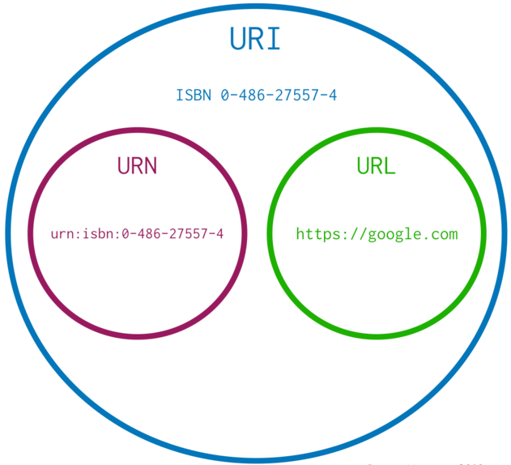
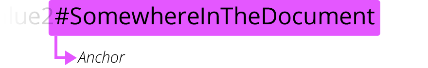

# 简介
`java.net.URI` 类用于 URI 实例的创建和字段获取。

# URI, URL 和 URN 的差别
URI、URL和URN是识别、定位和命名网络资源的标准。

URI （Uniform Resource Identifier，统一资源标识符）是一段用于识别资源或名称的字符。URI 是个纯粹的句法结构，可以识别资源的各个不同部分。

URL（Uniform Resource Locator，统一资源定位符）是URI的一个子集，是URI的一个特定实现。所以，所有的URL是URI，但并非所有的URI是URL。

URL也称为 Web 地址，例如：
```
https://developer.mozilla.org
https://developer.mozilla.org/en-US/docs/Learn/
https://developer.mozilla.org/en-US/search?q=URL
```

`java.net.URL` 类不提供对标准RFC2396规定的特殊字符的转义， 因此需要调用者自己对 URL 各组成部分进行编码。而 `java.net.URI` 则会提供转义功能，因此建议使用 `java.net.URI` 对 URL 进行编码和解码，然后使用 `URL.toURI()` 和 `URI.toURL()` 方法对两个类型进行转换。对于 HTML 样式的 URL编码，可以使用 `java.net.URLEncoder`和 `java.net.URLDecoder` 完成。


URN (Uniform Resource Name，统一资源名称)命名资源但不指定如何定位资源，是另外一种形式的URI，它通过特定名称空间中的唯一名称来标识资源。例如：
```
urn:isbn:9780141036144
urn:ietf:rfc:7230
```

三者的关系如下所示：




# URI 语法

|Component|Type|
|---|---|
|scheme|string|
|scheme-specific-part|string|
|authority|string|
|user-info|string|
|host|string|
|port|int|
|path|string|
|query|string|
|fragment|string|

## 协议


`http://` 告诉浏览器使用何种协议。大部分 Web 资源使用 HTTP 协议或其安全版本，HTTPS 协议。另外，浏览器也知道如何处理其他协议。例如， mailto: 协议指示浏览器打开邮件客户端；ftp:协议指示浏览器处理文件传输。常见的协议有：

|协议	|描述|
|---|---|
|data	|Data URIs|
|file	|指定主机上文件的名称|
|ftp	|文件传输协议|
|http/https|超文本传输​​协议／安全的超文本传输协议|
|mailto	|电子邮件地址|
|ssh	|安全 shell|
|tel	|电话|
|urn	|统一资源名称|
|view-source|资源的源代码|
|ws/wss	|（加密的） WebSocket 连接|

## 主机


`www.example.com`既是一个域名，也标识管理该域名的结构。它指示需要向网络上哪一台主机发起请求。当然，也可以直接向主机的IP地址发起请求，但直接使用IP地址的场景并不常见。

## 端口


`:80` 是端口。它表示用于访问 Web 服务器上资源的技术“门”。如果访问的该 Web 服务器使用HTTP协议的标准端口（HTTP为80，HTTPS为443）授予对其资源的访问权限，则通常省略此部分。否则端口就是 URI 必须的部分。

## 路径


`/path/to/myfile.html` 是 Web 服务器上资源的路径。在 Web 的早期，类似这样的路径表示 Web 服务器上的物理文件位置。现在，它主要是由没有任何物理实体的 Web 服务器抽象处理而成的。

## 查询


`?key1=value1&key2=value2` 是提供给 Web 服务器的额外参数。这些参数是用 & 符号分隔的键/值对列表。Web 服务器可以在将资源返回给用户之前使用这些参数来执行额外的操作。每个 Web 服务器都有自己的参数规则，想知道特定 Web 服务器如何处理参数的唯一可靠方法是询问该 Web 服务器所有者。

## 片段


`#SomewhereInTheDocument` 是资源本身的某一部分的一个锚点。锚点代表资源内的一种“书签”，它给予浏览器显示位于该“加书签”点的内容的指示。 例如，在HTML文档上，浏览器将滚动到定义锚点的那个点上；在视频或音频文档上，浏览器将转到锚点代表的那个时间。值得注意的是 # 号后面的部分，也称为片段标识符，永远不会与请求一起发送到服务器。

# 参考
- https://developer.mozilla.org/zh-CN/docs/Web/HTTP/Basics_of_HTTP/Identifying_resources_on_the_Web