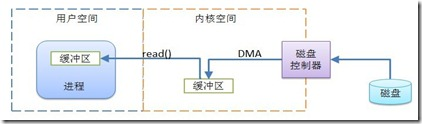
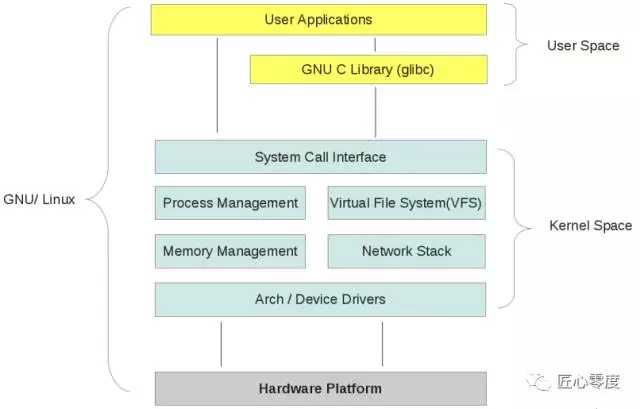
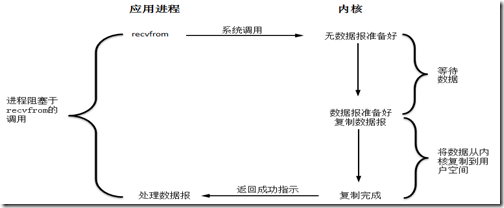
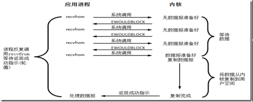
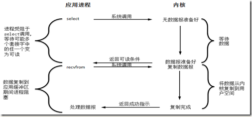
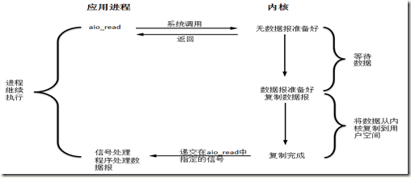

# TOC
- [TOC](#toc)
- [概述](#%e6%a6%82%e8%bf%b0)
- [用户空间和内核空间](#%e7%94%a8%e6%88%b7%e7%a9%ba%e9%97%b4%e5%92%8c%e5%86%85%e6%a0%b8%e7%a9%ba%e9%97%b4)
- [Linux 网络I/O模型](#linux-%e7%bd%91%e7%bb%9cio%e6%a8%a1%e5%9e%8b)
    - [I/O复用（Java NIO就是这种模型）](#io%e5%a4%8d%e7%94%a8java-nio%e5%b0%b1%e6%98%af%e8%bf%99%e7%a7%8d%e6%a8%a1%e5%9e%8b)
- [Why NIO?](#why-nio)
- [NIO 组成](#nio-%e7%bb%84%e6%88%90)
- [NIO 和 IO的差别](#nio-%e5%92%8c-io%e7%9a%84%e5%b7%ae%e5%88%ab)

# 概述
Java NIO 是 Java 1.4 之后新出的一套IO API，在JDK 7之后进一步扩展，为文件系统功能和文件处理提供了增强支持。

NIO 将填充、排空缓存等耗时的I/O操作转移到操作系统，从而大大提高I/O速度。

NIO 中的所有 IO 都从 Channel 中开始。
- 从通道进行数据读取：创建一个缓冲区，然后请求通道读取数据。
- 从通道进行数据写入：创建一个缓冲区，填充数据，并要求通道写入数据。

缓冲区及操作是所有I/O的基础。进程执行I/O操作，归结起来就是向操作系统发出请求，让它要么把缓冲区里的数据排干（写），要么把缓冲区填满（读）。如下图

# 用户空间和内核空间

现在操作系统都采用虚拟存储器，对32位操作系统，它的寻址空间（虚拟存储空间）为4G（2的32次方）。操心系统的核心是内核，独立于普通的应用程序，可以访问受保护的内存空间，也有访问底层硬件设备的所有权限。为了保证用户进程不能直接操作内核，保证内核的安全，操心系统将虚拟空间划分为两部分，一部分为**内核空间**，一部分为**用户空间**。

针对linux操作系统而言，将最高的1G字节（从虚拟地址 `0xC0000000` 到 `0xFFFFFFFF`），供内核使用，称为**内核空间**，而将较低的 3G 字节（从虚拟地址`0x00000000` 到 `0xBFFFFFFF`），供各个进程使用，称为**用户空间**。每个进程可以通过系统调用进入内核，因此，Linux内核由系统内的所有进程共享。于是，从具体进程的角度来看，每个进程可以拥有4G字节的虚拟空间。

即用户空间是常规进程（如JVM）所在区域，用户空间是非特权区域，不能直接访问硬件设备。内核空间是操作系统所在区域，能于设备控制器通讯，控制用户区域的进程运行状态。在进程执行I/O操作时，它会执行一个系统调用，将控制权转交给内核。

有了用户空间和内核控件，整个linux内部结构可以分为三部分，从底层到最上层一次为：硬件-->内核空间-->用户空间。如下图所示：

内核的组成：
- 内核空间存放的是内核代码和数据，而进程的用户空间中存放的是用户程序的代码和数据。不管是内核空间还是用户空间，它们都处于虚拟空间中。
- Linux 使用两级保护机制：0级供内核使用，3级供用户程序使用。

# Linux 网络I/O模型
为了OS的安全考虑，进程无法直接操作I/O设备，必须通过系统调用请求内核来协助完成I/O动作，而内核为每个I/O设备维护一个buffer。

说起I/O模型，网络上有一个错误的概念，异步非阻塞/阻塞模型，其实异步根本就没有阻不阻塞之说，异步模型就是异步模型。让我们来看一看Richard Stevens在其UNIX网络编程卷1中提出的5个I/O模型吧。

**阻塞式I/O**

**非阻塞式I/O**

### I/O复用（Java NIO就是这种模型）

I/O多路复用有两种经典模式：基于同步I/O的reactor和基于异步I/O的proactor。 

**Reactor**
- 某个事件处理者宣称它对某个socket上的读事件很感兴趣;
- 事件分离者等着这个事件的发生;
- 当事件发生了，事件分离器被唤醒，这负责通知先前那个事件处理者;
- 事件处理者收到消息，于是去那个socket上读数据了. 如果需要，它再次宣称对这个socket上的读事件感兴趣，一直重复上面的步骤;

**Proactor**
- 事件处理者直接投递发一个写操作(当然，操作系统必须支持这个异步操作). 这个时候，事件处理者根本不关心读事件，它只管发这么个请求，它魂牵梦萦的是这个写操作的完成事件。这个处理者很拽，发个命令就不管具体的事情了，只等着别人（系统）帮他搞定的时候给他回个话。
- 事件分离者等着这个读事件的完成(比较下与Reactor的不同);
- 当事件分离者默默等待完成事情到来的同时，操作系统已经在一边开始干活了，它从目标读取数据，放入用户提供的缓存区中，最后通知事件分离者，这个事情我搞完了;
- 事件分享者通知之前的事件处理者: 你吩咐的事情搞定了;
- 事件处理者这时会发现想要读的数据已经乖乖地放在他提供的缓存区中，想怎么处理都行了。如果有需要，事件处理者还像之前一样发起另外一个写操作，和上面的几个步骤一样。

异步的proactor固然不错，但它局限于操作系统（要支持异步操作），为了开发真正独立平台的通用接口，我们可以通过reactor模拟来实现proactor。

**Proactor（模拟）**
- 等待事件 (Proactor 的工作)
- 读数据(看，这里变成成了让 Proactor 做这个事情)
- 把数据已经准备好的消息给用户处理函数，即事件处理者(Proactor 要做的)
- 处理数据 (用户代码要做的)

**信号驱动式I/O**

**异步I/O**

由POSIX术语定义，同步I/O操作导致请求进程阻塞，直到I/O操作完成；异步I/O操作不导致请求进程阻塞。5种模型中的前4种都属于同步I/O模型。

# Why NIO?
开始讲NIO之前，了解为什么会有NIO，相比传统流I/O的优势在哪，它可以用来做什么等等的问题，还是很有必要的。

传统流I/O是基于字节的，所有I/O都被视为单个字节的移动；而NIO是基于块的，大家可能猜到了，NIO的性能肯定优于流I/O。没错！其性能的提高要得益于其使用的结构更接近操作系统执行I/O的方式：通道和缓冲器。我们可以把它想象成一个煤矿，通道是一个包含煤层（数据）的矿藏，而缓冲器则是派送到矿藏的卡车。卡车载满煤炭而归，我们再从卡车上获得煤炭。也就是说，我们并没有直接和通道交互；我们只是和缓冲器交互，并把缓冲器派送到通道。通道要么从缓冲器获得数据，要么向缓冲器发送数据。（这段比喻出自Java编程思想）

NIO的主要应用在高性能、高容量服务端应用程序，典型的有Apache Mina就是基于它的。

# NIO 组成
NIO核心有三部分：通道（Channel）、缓冲区（Buffer）和Selector。传统IO基于字节流和字符流进行操作，而NIO基于Channel和Buffer进行操作。

NIO 中的所有IO都从Channel开始：
- 读取数据：创建一个缓冲区，请求通道读取数据。
- 写入数据：创建一个缓冲区，填充数据，并要求通道写入数据。

数据总是从通道读取到缓冲区，或者从缓冲区写入通道。Selector用于监听多个通道的事件。因此，单个线程可以监听多个数据通道。

# NIO 和 IO的差别

| IO              | NIO             |
|:----------------|:----------------|
| Stream oriented | Buffer oriented |
| Blocking IO     | Non blocking IO |
|                 | Selectors       |

**面向流和面向缓存**

- IO 面向流，而 NIO 面向通道和缓冲区。
- IO 面向流意味着每次从流中读 1 或多个字节，直到读取所有字节，它们没有被缓存在任何地方。
- NIO 面向缓存，将数据读入缓冲器，使用通道进一步处理数据。

**IO 是阻塞的，NIO流不阻塞**
- NIO 进行非阻塞IO操作。比如，单线程中从通道读取数据到 buffer，同时可以继续做其他事情，当数据读取到 buffer 后，线程再继续处理数据。写操作同样如此。
- IO 的各种流是阻塞的，即当一个线程在读写时，该线程被阻塞，知道数据完全读入或写出，该线程在此期间不能再干任何其他事情。

**选择器**
- NIO 选择器用于使用单个线程处理多个通道，因此，它需要较少的线程来处理这些通道。
- 线程之间的切换对操作系统来说是昂贵的，因此，为了提高系统效率选择器是有用的。