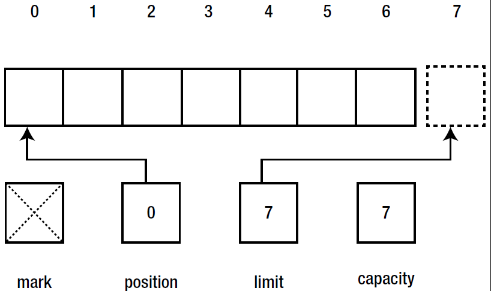
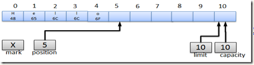
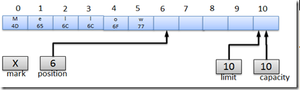
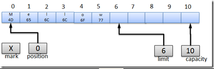
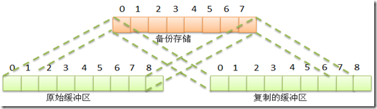
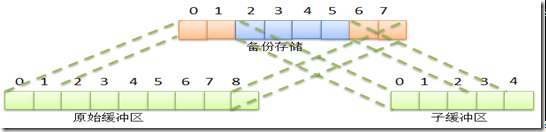

# TOC
- [TOC](#toc)
- [Intro](#intro)
- [Buffer 属性](#buffer-%e5%b1%9e%e6%80%a7)
- [Buffer 方法](#buffer-%e6%96%b9%e6%b3%95)
  - [内部细节](#%e5%86%85%e9%83%a8%e7%bb%86%e8%8a%82)
  - [创建 Buffer](#%e5%88%9b%e5%bb%ba-buffer)
  - [复制缓冲区](#%e5%a4%8d%e5%88%b6%e7%bc%93%e5%86%b2%e5%8c%ba)
  - [ByteBuffer](#bytebuffer)
  - [直接缓冲区](#%e7%9b%b4%e6%8e%a5%e7%bc%93%e5%86%b2%e5%8c%ba)
  - [视图缓冲区](#%e8%a7%86%e5%9b%be%e7%bc%93%e5%86%b2%e5%8c%ba)
  - [存取无符号整数](#%e5%ad%98%e5%8f%96%e6%97%a0%e7%ac%a6%e5%8f%b7%e6%95%b4%e6%95%b0)

# Intro
NIO Buffers 用于和 NIO Channel交互，从Channel读取数据到 buffers，以及将数据从 Buffer写入 Channels，是构建 `java.nio` 的基石。

缓冲区实质上就是一个数组，但它又不仅仅是一个数组，它还提供了对数据的结构化访问功能以及跟踪系统的读/写进程功能。

讲缓冲区细节之前，我们先来看一下缓冲区的类图：


# Buffer 属性
缓冲区对象作为类似数组的对象，有四个基本属性：
|属性|说明|
|---|---|
|Capacity|容量，缓冲区能容纳的数据量。容量在缓冲区创建时指定，无法更改|
|Limit|上界，缓冲区的第一个不能被读或写的元素的索引。在写模式，limit 表示能写入的最大数据量，等同于 buffer 的容量；在读模式，limit 表示能读取的最大数据量，它的值等同于写模式下的 position 的位置，即可以读取与写入数量相同的字节数|
|Position|位置，下一个要被读或写的元素的索引。position 最大可以到 capacity-1。当从Buffer读取数据时，buffer从写模式变为读模式，position会归零，每次读取后，position向后移动|
|Mark|标记，备忘位置，调用 `mark()` 来设定 mark=position，调用 `reset()` 设定 position=mark|

这四个属性满足：0<=mark<=position<=limit<=capacity。下图是新创建的容量为7的 `ByteBuffer` 逻辑视图：



# Buffer 方法
|方法|说明|
|---|---|
|`Object array()`|返回支持该 buffer 的数组。该方法是为了将数组支持的buffer更高效的传递给本机代码（native code），buffer 子类重写该方法，并通过协变返回强类型。如果支持数组为只读，该方法抛出 `java.nio.ReadOnlyBufferException`；对非数组支持的 buffer 抛出 `java.lang.UnsupportedOperationException`|
|`int arrayOffset()`|返回该缓冲区的第一个元素在数组中的偏移|
|`int capacity()`|缓冲区容量|
|`Buffer clear()`|清除缓冲区。设置 position=0; limit=capacity; mark=-1|
|`Buffer flip()`|从写模式切换到读模式。position=0; limit=之前写模式的position的位置|
|`boolean hasArray()`|是否由可访问的数组支持，如果返回 true，就可以使用 `array()` 和 `arrayOffset()` 方法|
|`boolean hasRemaining()`|return position < limit, 是否还有未读的内容|
|`boolean isDirect()`|缓冲区是否为 direct|
|`boolean isReadOnly()`|是否为只读|
|`int limit()`|缓冲区的 limit|
|`Buffer limit(int newLimit)`|设置 limit 位置|
|`int position()`|返回 position|
|`Buffer position(int newPosition)`|设置 position|
|`int remaining()`|return limit-position;|
|`Buffer rewind()`|将position=0; mark=-1; 不改变 limit 值|
|`Buffer mark()`|标记当前位置|
|`Buffer reset()`|重置 position 到之前 mark 的位置|
|`compact()`|将 position 和 limit 之间的数据移动到 buffer 开头|

使用 `Buffer` 读写数据一般包括四步：
- 将数据写入 `Buffer`
- 调用 `flip()` 方法
- 从 `Buffer` 读取数据
- 调用 `clear()` 或 `compact()`

如下：
```java
buf.clear(); // 清空一下，准备
for (;;) {
    if (in.read(buf) < 0 && !buf.hasRemaining())
        break; // 没有读入数据了，并且buffer里没有剩余数据了
    buf.flip(); //当前位置设置为EOF，指针挪到0
    out.write(buf); //写出数据，即读取buffer的数据
    buf.compact(); // write方法可能只写出了部分数据，buffer里还有剩余。
    //压缩一下，把后一段的数据挪到前面。指针也挪到有效数据的后一位。
}
```

数据写入 buffer，buffer 会记录已经写入的数据大小，当需要读数据时，调用 `flip()` 将 buffer从写模式调整为读模式。

读完数据后，需要清空 buffer，以满足后续的写入操作。clear 清空 buffer, `compact()` 清空已读取的数据。


## 内部细节

```java
buffer.put((byte)'H').put((byte)'e').put((byte)'l').put((byte)'l').put((byte)'o');
```

五次调用put后的缓冲区： 



```java
buffer.put(0,(byte)'M').put((byte)'w');
```

调用绝对版本的put不影响position： 



现在缓冲区满了，我们必须将其清空。我们想把这个缓冲区传递给一个通道，以使内容能被全部写出，但现在执行get()无疑会取出未定义的数据。我们必须将posistion设为0，然后通道就会从正确的位置开始读了，但读到哪算读完了呢？这正是limit引入的原因，它指明缓冲区有效内容的未端。这个操作在缓冲区中叫做翻转: `buffer.flip()`。



rewind操作与flip相似，但不影响limit。
将数据从输入通道copy到输出通道的过程应该是这样的：
```java
while (true) {
     buffer.clear();  // 重设缓冲区以便接收更多字节
     int r = fcin.read( buffer );
     if (r==-1) {
       break;
     }
     buffer.flip(); // 准备读取缓冲区数据到通道
     fcout.write( buffer );
}
```

## 创建 Buffer
创建 Buffer 的方法有多种种，包括：
|方法|说明|
|---|---|
|`ByteBuffer allocate(int  capacity)`|创建指定容量的 buffer。初始状态：position=0, limit=capacity, mark 未定义，所有元素初始化为0。具有后端数组，arrayOffset=0|
|`ByteBuffer allocateDirect(int capacity)`|创建指定容量的 direct buffer。不一定有后端数组，其它同上|
|`ByteBuffer wrap(byte[] array)`|以指定数组创建 buffer，buffer 和数组内容同步|
|`duplicate()`|创建一个新的 buffer，具有的独立的 position, limit, mark，其它和当前buffer一致，两者有相同的后端数组|

一般，新分配一个缓冲区是通过allocate方法的。如果你想提供自己的数组用做缓冲区的备份存储器，请调用wrap方法。 

例1：
```java
ByteBuffer buf = ByteBuffer.allocate(28);
```
例2：
```java
Buffer buffer = ByteBuffer.allocate(7);
assertEquals(buffer.capacity(), 7);
assertEquals(buffer.limit(), 7);
assertEquals(buffer.position(), 0);
assertEquals(buffer.remaining(), 7); // the number of elements between the current position and the limit

buffer.limit(5); // set this buffer's limit to newLimit. When the position is larger than newLimit,
// the position is set to newLimit. When the mark is defined and is larger than newLimit, the mark is discarded.
// This method throws IllegalArgumentException when newLimit is negative or larger than this buffer's capacity; otherwise
// it returns this buffer
assertEquals(buffer.limit(), 5);
assertEquals(buffer.position(), 0);
assertEquals(buffer.remaining(), 5);

buffer.position(3);
assertEquals(buffer.position(), 3);
assertEquals(buffer.remaining(), 2);
assertEquals(buffer.capacity(), 7);
```


上面两种方式创建的缓冲区都是间接的，间接的缓冲区使用备份数组（相关的方法 hasArray(), array(), arrayOffset()。

## 复制缓冲区
duplicate方法创建一个与原始缓冲区类似的缓冲区，两个缓冲区共享数据元素，不过它们拥有各自的position、limit、mark，如下图： 



另一个方法，slice与duplicate相似，但slice方法创建一个从原始缓冲区的当前位置开始的新缓冲区，而且容量是原始缓冲区的剩余元素数量（limit-position），见下图。 
       


## ByteBuffer
**字节序**，为什么会有字节序？比如有1个int类型数字 `0x036fc5d9`，它占4个字节，那么在内存中存储时，有可能其最高字节03位于低位地址（大端字节顺序），也有可能最低字节d9位于低位地址（小端字节顺序）。

在IP协议中规定了使用大端的网络字节顺序，所以我们必须先在本地主机字节顺序和通用的网络字节顺序之间进行转换。java.nio中，字节顺序由ByteOrder类封装。
 
在ByteBuffer中默认字节序为ByteBuffer.BIG_ENDIAN，不过byte为什么还需要字节序呢？ByteBuffer和其他基本数据类型一样，具有大量便利的方法用于获取和存放缓冲区内容，这些方法对字节进行编码或解码的方式取决于ByteBuffer当前字节序。

## 直接缓冲区
直接缓冲区是通过调用ByteBuffer.allocateDirect方法创建的。通常直接缓冲区是I/O操作的最好选择，因为它避免了一些复制过程；但可能也比间接缓冲区要花费更高的成本；它的内存是通过调用本地操作系统方面的代码分配的。

## 视图缓冲区
视图缓冲区和缓冲区复制很像，不同的只是数据类型，所以字节对应关系也略有不同。比如ByteBuffer.asCharBuffer，那么转换后的缓冲区通过get操作获得的元素对应备份存储中的2个字节。


## 存取无符号整数
Java中并没有直接提供无符号数值的支持，每个从缓冲区读出的无符号值被升到比它大的下一个数据类型中。 
```java
public static short getUnsignedByte(ByteBuffer bb) {
    return ((short) (bb.get() & 0xff));
}

public static void putUnsignedByte(ByteBuffer bb, int value) {
    bb.put((byte) (value & 0xff));
}
```