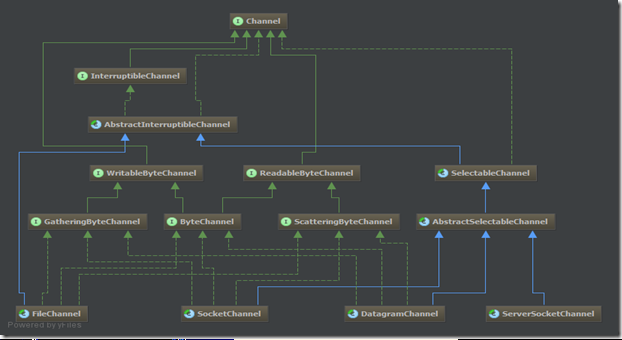

# TOC
- [TOC](#toc)
- [Intro](#intro)
- [使用通道](#%e4%bd%bf%e7%94%a8%e9%80%9a%e9%81%93)
- [FileChannel](#filechannel)
- [关闭通道](#%e5%85%b3%e9%97%ad%e9%80%9a%e9%81%93)
- [Socket 通道](#socket-%e9%80%9a%e9%81%93)
- [ServerSocketChannel](#serversocketchannel)
- [SocketChannel](#socketchannel)
  - [DatagramChannel](#datagramchannel)

# Intro
通道用于在缓冲区和位于通道另一侧的实体（文件、套接字）之间有效的传输数据。

Channel 和 Stream 很类似，也有几点不同：
- Channel 可以读写，而 stream 是单向的（读或者写）；
- Channel 可以异步读写；

相对于缓冲区，通道的类图略显复杂：



其具体实现类有四个：
|Channel|说明|
|---|---|
|`FileChannel`|文件读写|
|`DatagramChannel`|通过 UDP 读写数据|
|`SocketChannel`|通过TCP 读写数据|
|`ServerSocketChannel`|监听传入的 TCP 连接，为每个连接创建 SocketChannel|

Channel 方法：
|方法|说明|
|---|---|
|`void close()`|关闭通道|
|`boolean isOpen()`|通道是否打开|


# 使用通道
打开通道比较简单，除了 `FileChannel`，都用open方法打开。 

我们知道，通道是和缓冲区交互的，从缓冲区获取数据进行传输，或将数据传输给缓冲区。从类继承层次结构可以看出，通道一般都是双向的（除FileChannel）。
 
下面来看一下通道间数据传输的代码： 
```java
private static void channelCopy(ReadableByteChannel src,
                                 WritableByteChannel dest)
        throws IOException {
    ByteBuffer buffer = ByteBuffer.allocateDirect(16 * 1024);
    while (src.read(buffer) != -1) {
        // Prepare the buffer to be drained
        buffer.flip();
        // Write to the channel; may block
        dest.write(buffer);
        // If partial transfer, shift remainder down
        // If buffer is empty, same as doing clear( )
        buffer.compact();
    }
    // EOF will leave buffer in fill state
    buffer.flip();
    // Make sure that the buffer is fully drained
    while (buffer.hasRemaining()) {
        dest.write(buffer);
    }
}
```

# FileChannel


# 关闭通道
通道不能被重复使用，这点与缓冲区不同；关闭通道后，通道将不再连接任何东西，任何的读或写操作都会导致 `ClosedChannelException`。 

调用通道的close()方法时，可能会导致线程暂时阻塞，就算通道处于非阻塞模式也不例外。如果通道实现了InterruptibleChannel接口，那么阻塞在该通道上的一个线程被中断时，该通道将被关闭，被阻塞线程也会抛出ClosedByInterruptException异常。当一个通道关闭时，休眠在该通道上的所有线程都将被唤醒并收到一个AsynchronousCloseException异常。

# Socket 通道
Socket通道有三个，分别是 `ServerSocketChannel`、`SocketChannel` 和`DatagramChannel`，而它们又分别对应 `java.net` 包中的Socket对象`ServerSocket`、`Socket` 和 `DatagramSocket`；Socket通道被实例化时，都会创建一个对等的Socket对象。 

Socket通道可以运行非阻塞模式并且是可选择的，非阻塞I/O与可选择性是紧密相连的，这也正是管理阻塞的API要在SelectableChannel中定义的原因。设置非阻塞非常简单，只要调用configureBlocking(false)方法即可。如果需要中途更改阻塞模式，那么必须首先获得blockingLock()方法返回的对象的锁。

# ServerSocketChannel
`ServerSocketChannel` 是一个基于通道的socket监听器。但它没有 `bind()` 方法，因此需要取出对等的Socket对象并使用它来绑定到某一端口以开始监听连接。在非阻塞模式下，当没有传入连接在等待时，其accept()方法会立即返回null。正是这种检查连接而不阻塞的能力实现了可伸缩性并降低了复杂性，选择性也因此得以实现。 

```java
ByteBuffer buffer = ByteBuffer.wrap("Hello World".getBytes());
ServerSocketChannel ssc = ServerSocketChannel.open();
ssc.socket().bind(new InetSocketAddress(12345));
ssc.configureBlocking(false);

for (;;) {
    System.out.println("Waiting for connections");
    SocketChannel sc = ssc.accept();
    if (sc == null)
        TimeUnit.SECONDS.sleep(2000);
    else {
        System.out.println("Incoming connection from:" + sc.socket().getRemoteSocketAddress());
        buffer.rewind();
        sc.write(buffer);
        sc.close();
    }
}
```

# SocketChannel
相对于 `ServerSocketChannel`，它扮演客户端，发起到监听服务器的连接，连接成功后，开始接收数据。 

要注意的是，调用它的 `open()` 方法仅仅是打开但并未连接，要建立连接需要紧接着调用 `connect()` 方法；也可以两步合为一步，调用 `open(SocketAddress remote)` 方法。 

你会发现 `connect()` 方法并未提供 `timout` 参数，作为替代方案，你可以用 `isConnected()`、`isConnectPending()` 或 `finishConnect()` 方法来检查连接状态。

## DatagramChannel
不同于前面两个通道对象，它是无连接的，它既可以作为服务器，也可以作为客户端。