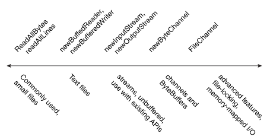

# Files

2020-07-14, 16:15
@author Jiawei Mao
****

## 文件操作

`Files` 类是 `java.nio.file` 包的另一个入口。该类提供了许多用于读取、写入和操作文件和目录的静态方法。`Files` 类针对 `Path` 对象进行操作。

### Files 方法

|方法|说明|
|---|---|
|`byte[] readAllBytes(Path path)`|读取文件所有内容|
|`List<String> readAllLines(Path path, Charset charset)`|读取文件内容为文本|
|`Path write(Path path, byte[] content, OpenOption... options)`|写入文件|
|`Path write(Path path, Iterable<? extends CharSequence> contents, OpenOption options)`|写入文件|
|`InputStream newInputStream(Path path, OpenOption... options)`|打开文件读取|
|`OutputStream newOutputStream(Path path, OpenOption... options)`|打开文件输出|
|`BufferedReader newBufferedReader(Path path, Charset charset)`|打开文件读取|
|`BufferedWriter newBufferedWriter(Path path, Charset charset, OpenOption... options)`|打开文件输出|
|`Files.createDirectory(path)`|创建目录，要求上级目录存在|
|`Files.createDirectories(path)`|创建目录|
|`Files.createFile(path)`|创建文件|
|`Files.createTempFile()`|创建临时文件|
|`Files.copy(fromPath, toPath)`|复制文件|
|`Files.move(fromPath, toPath)`|剪切文件|
|`Files.copy(fromPath, toPath, StandardCopyOption.REPLACE_EXISTING, StandardCopyOption.COPY_ATTRIBUTES)`|复制文件，如果目标文件存在，覆盖|
|`Files.move(fromPath, toPath, StandardCopyOption.ATOMIC_MOVE)`|原子操作剪切|
|`Files.delete(path)`|删除文件|
|`Files.deleteIfExists(path)`|删除文件，文件不存在不抛出异常|

|选项|说明|
|---|---|
|`StandardOpenOption`|适用于 `newBufferedWriter`, `newInputStream`, `newOutputStream`, `write`|
|`READ`|读模式|
|`WRITE`|写模式|
|`APPEND`|对写模式，追加内容|
|`TRUNCATE_EXISTING`|对写模式，移除已有内容|
|`CRATE_NEW`|创建新文件，如果文件已存在则失败|
|`CREATE`|如果文件不存在，创建文件，原子操作|
|`DELETE_ON_CLOSE`|文件关闭后删除|
|`SPARSE`|告诉文件系统，这是个稀疏文件|
|`DSYNC|SYNC`|要求文件数据|元数据和存储设备同步|
|`StandardCopyOption`|**针对 `copy` 和 `move`**|
|`ATOMIC_MOVE`|原子剪切|
|`COPY_ATTRIBUTES`|复制文件属性|
|`REPLACE_EXISTING`|替换目标文件|
|`LinkOption`|应用以上所有方法，以及 `exists`, `isDirectory`, `isRegularFile`|
|`NOFOLLOW_LINKS`|不跟踪符号链接|
|`FileVisitOption`|应用于 `find`, `walk`, `walkFileTree`|
|`FOLLOW_LINKS`|跟踪符号链接|

### 移动文件

`move(Path, Path, CopyOption...)` 方法可以移动文件或目录。如果目标文件存在，除非指定 `REPLACE_EXISTING` 选项，否则移动失败。

可以移动空目录，如果目录中包含有文件，则只是移动目录，不移动目录中的内容。在 UNIX 系统中，在同一分区中移动目录效果等同于重命名，此时即使目录中有其它文件，也能成功运行。

该方法支持如下 `StandardCopyOption`:
|选项|说明|
|---|---|
|`REPLACE_EXISTING`|目标文件存在也执行操作。如果目标为符号链接，符号链接被替换，但是符号链接指向的内容不变|
|`ATOMIC_MOVE`|以原子操作执行移动操作。如果文件系统不支持原子移动，抛出异常|

### 复制文件

使用 `Files.copy(Path, Path, CopyOption...)` 方法可以复制文件或目录。如果目标文件已存在，除非指定 `REPLACE_EXISTING` 选择，否则复制失败。

目录也可以复制，不过并不复制目录中的文件，所以即使原目录中包含许多文件，新目录也是空的。

当复制符号链接，符号链接的目标文件也被复制。如果只希望复制链接，而不包含链接的内容，则可以使用 `NOFOLLOW_LINKS` 或 `REPLACE_EXISTING` 选项。

该方法支持可变参数。支持 `StandardCopyOption` 和 `LinkOption` 如下选项：
|选项|说明|
|---|---|
|`REPLACE_EXISTING`|即使目标文件存在也复制。如果目标为符号链接，复制链接本身（不复制链接指向的文件）。如果目标是非空目录，抛出 `FileAlreadyExistsException` 异常|
|`COPY_ATTRIBUTES`|复制文件属性到目标文件。文件属性依赖于文件系统，不过 `last-modified-time` 支持跨平台，可复制到目标文件|
|`NOFOLLOW_LINKS`|复制链接，而不复制链接指向的文件|

除了文件复制，`Files` 还有在文件和流之间复制的方法，如

- `copy(InputStream, Path, CopyOptions...)` 可以将输入流复制到指定文件。
- `copy(Path, OutputStream)` 可以将指定文件的所有字节复制到指定输出流。

### 删除文件

删除文件、目录或符号链接。对符号链接，删除的是链接而非目标文件；对目录，目录必须为空，否则删除失败。

`Files` 类提供了两个删除方法。

- `delete(Path)`, 删除文件或抛出异常，如果文件不存在抛出 `NoSuchFileException`

```java
try {
    Files.delete(path);
} catch (NoSuchFileException x) {
    System.err.format("%s: no such" + " file or directory%n", path);
} catch (DirectoryNotEmptyException x) {
    System.err.format("%s not empty%n", path);
} catch (IOException x) {
    // File permission problems are caught here.
    System.err.println(x);
}
```

- `deleteIfExists(Path)`，如果文件不存在不抛出异常。当多线程删除文件，该方法安静的删除文件特别有用。

### 释放系统资源

该 API 使用的许多资源，如流、通道等，都实现或扩展了 `java.io.Closeable` 接口。实现该接口的基本要求是，在不需要时，调用 `close` 方法释放资源。忘记关闭资源会导致许多负面效果，而使用 `try-with` 语法可以自动关闭资源。

### 捕获异常

文件 I/O 中有很多因素会导致异常，如文件不存在，程序无法访问文件系统，默认文件系统不支持特定功能等，可能碰到各种错误。

所有访问文件系统的方法都可以引发 `IOException`。最好的方式是使用 java7 引入的 `try-with-resources` 语句捕获这些异常。该语法的优点是在不再需要资源编译器会自动生成关闭资源的代码。例：

```java
try (BufferedWriter writer = Files.newBufferedWriter(Paths.get(""), StandardCharsets.US_ASCII)) {
    writer.write("hello");
} catch (IOException e) {
    e.printStackTrace();
}
```

当然，也可以使用 try-catch-finally 方法：

```java
BufferedWriter writer = null;
try {
    writer = Files.newBufferedWriter(Paths.get(""), StandardCharsets.US_ASCII);
    writer.write("hello");
} catch (IOException e) {
    e.printStackTrace();
} finally {
    if (writer != null)
        writer.close();
}
```

### 可变参数

`Files` 的许多方法都接收可变数目的参数。如 `move` 方法：

```java
Path Files.move(Path, Path, CopyOption...)
```

对包含可变参数的方法，可以传递给它逗号分隔的多个值或数组。

### 原子操作

`Files` 的几个方法，如 `move` 在部分文件系统上可以执行原子操作。

## 检查文件或目录

|方法|说明|
|---|---|
|`exists`|
|`isHidden`|
|`isReadable`, `isWritable`, `isExecutable`|
|`isRegularFile`, `isDirectory`, `isSymbolicLink`|
|`size`|文件大小|

### 检查是否存在

- `Files.exists(Path, LinkOption...)`
- `notExists(Path, LinkOption...)`

当检查文件是否存在，结果有三种可能：

- 文件存在
- 文件不存在
- 文件状态不可知。当程序无法访问文件时出现该结果。

所以 `!Files.exists(path)` 不等于 `Files.notExists(path)`。

### 检查是否可访问

- `isReadable(Path)`
- `isWritable(Path)`
- `isExecutable(Path)`

如，检查文件存在并且程序可执行文件：

```java
Path file = ...;
boolean isRegularExecutableFile = Files.isRegularFile(file) &
         Files.isReadable(file) & Files.isExecutable(file);
```

### 检查两个路径是否对应同一个文件

- `isSameFile(Path, Path)`

例：

```java
Path p1 = ...;
Path p2 = ...;

if (Files.isSameFile(p1, p2)) {
    // Logic when the paths locate the same file
}
```

## 文件元数据

文件系统的元数据一般指文件属性。`Files` 类支持元数据的获取和设置。

|方法|说明|
|---|---|
|`size(Path)`|文件大小 (bytes)|
|`isDirectory(Path, LinkOption)`|`Path` 指向的是否为目录|
|`isRegularFile(Path, LinkOption...)`|`Path` 指向的是否为常规文件|
|`isSymbolicLink(Path)`|`Path` 指向的是否为符号链接|
|`isHidden(Path)`|`Path` 指向的是否为隐藏文件|
|`getLastModifiedTime(Path, LinkOption...)`, `setLastModifiedTime(Path, FileTime)`|文件最后修改时间|
|`getOwner(Path, LinkOption...)`, `setOwner(Path, UserPrincipal)`|文件拥有者|
|`getPosixFilePermissions(Path, LinkOption...)`, `setPosixFilePermissions(Path, Set<PosixFilePermission>)`|POSIX 文件权限|
|`getAttribute(Path, String, LinkOption...)`, `setAttribute(Path, String, Object, LinkOption...)`|文件属性|

如果同时需要多个文件属性，因此调用单个方法效率太低，反复访问文件系统获取三个文件属性会影响性能。因此，`Files` 类提供了一次读取多个属性的方法：

|方法|说明|
|---|---|
|`readAttributes(Path, String, LinkOption...)`|读取多个属性，String 参数用于指定读取的属性|
|`readAttributes(Path, Class<A>, LinkOption...)`|读取多个属性。`Class<A>` 为待读取属性类型，返回值为该类类型|

不同的文件系统对文件属性有不同的定义。因此此处对文件属性进行了分组，每个分组有对应的视图。
|视图|说明|
|---|---|
|`BasicFileAttributeView`|所有文件系统都支持的基本属性视图|
|`DosFileAttributeView`|支持DOS属性的标准四位扩展文件系统|
|`PosixFileAttributeView`|POSIX 扩展，包括 file owner, group owner等属性|
|`FileOwnerAttributeView`|支持 file owner 的文件系统扩展|
|`AclFileAttributeView`|支持访问控制列表（Access Control Lists, ACL）|
|`UserDefinedFileAttributeView`|支持自定义属性|

大多时候，你不需要和任何 `FileAttributeView` 借口打交道。如果有这需求，可以通过 `getFileAttributeView(Path, Class<V>, LinkOption...)` 方法获取。

`readAttributes` 方法使用泛型，可用于读取任何文件属性视图的属性。例如：

```java
BasicFileAttributes attributes = Files.readAttributes(path, BasicFileAttributes.class);
```

## 文件的读写和创建

文件 I/O 的方法有许多，下图方法从左到右，越来越复杂：



说明：

- `readAllBytes`, `readAllLines` 以及对应的 write 方法，用于简单的读写；
- `newBufferedReader`, `newBufferedWriter`, `newInputStream` 和 `newOutputStream` 用于对流或文件进行迭代，这些方法可以和 `java.io` 包交互；
- `ByteChannels`, `SeekableByteChannels`, `ByteBuffers` 等；
- 最右边的 `FileChannel` 支持文件锁定或内存映射 I/O 等高级应用，最为复杂。

### `OpenOptions`

许多文件读写方法都有 `OpenOptions` 可选参数，`OpenOptions` 支持如下 `StandardOpenOptions` enum 值：

| 选项                  | 说明                                                                   |
| ------------------- | -------------------------------------------------------------------- |
| `WRITE`             | 打开文件以写入                                                              |
| `APPEND`            | 追加模式，打开文件以写入到文件末尾。和 `WRITE` 或 `CREATE` 选项联用                          |
| `TRUNCATE_EXISTING` | 将文件清空。和 `WRITE` 联用                                                   |
| `CREATE_NEW`        | 创建新文件，如果已存在，抛出异常                                                     |
| `CREATE`            | 如果文件已存在，打开文件；如果文件不存在，创建新文件                                           |
| `DELETE_ON_CLOSE`   | 在流关闭后删除文件。适合于临时文件                                                    |
| `SPARSE`            | 提示新创建的文件是稀疏的。此功能在部分文件系统上（如NTFS）很有用，带有间隙的大文件可以更有效的存储，文件里的空白内容不会占用磁盘空间 |
| `SYNC`              | 文件和底层的存储设备同步（文件内容和元数据）                                               |
| `DSYNC`             | 文件内容和底层设备同步                                                          |

### 小文件读写

#### 读取所有字节或行

如果文件很小而你想一次性读取全文件内容，可以使用 `readAllBytes(Path)` 或 `readAllLines(Path, Charset)` 方法。如：

```java
Path file = ...;
byte[] fileArray;
fileArray = Files.readAllBytes(file);
```

#### 写入所有字节或行

- `write(Path, byte[], OpenOption...)`
- `write(Path, Iterable< extends CharSequence>, Charset, OpenOption...)`

可以分别将字节和文本一次性写入文件。

如：

```java
Path file = ...;
byte[] buf = ...;
Files.write(file, buf);
```

### 文本文件的缓冲 I/O

`java.nio.file` 包支持通道 I/O，通道将数据移动到缓冲区，从而绕过了一些会阻塞 I/O 的操作。

#### 读缓冲流

`newBufferedReader(Path, Charset)` 打开一个文件，返回 `BufferedReader` 对象，用于文本文件的缓冲读取。例如：

```java
Charset charset = Charset.forName("US-ASCII");
try (BufferedReader reader = Files.newBufferedReader(file, charset)) {
    String line = null;
    while ((line = reader.readLine()) != null) {
        System.out.println(line);
    }
} catch (IOException x) {
    System.err.format("IOException: %s%n", x);
}
```

#### 写缓冲流

`newBufferedWriter(Path, Charset, OpenOption...)` 创建一个 `BufferedWriter` 用于缓冲输出。

```java
Charset charset = Charset.forName("US-ASCII");
String s = ...;
try (BufferedWriter writer = Files.newBufferedWriter(file, charset)) {
    writer.write(s, 0, s.length());
} catch (IOException x) {
    System.err.format("IOException: %s%n", x);
}
```

### 无缓冲流以及和 `java.io` 的互操作

#### 无缓冲 Stream 读文件

`newInputStream(Path, OpenOption...)` 方法创建 `InputStream`，用于文件的无缓冲读取。例如：

```java
Path file = ...;
try (InputStream in = Files.newInputStream(file);
    BufferedReader reader = new BufferedReader(new InputStreamReader(in))) {
    String line = null;
    while ((line = reader.readLine()) != null) {
        System.out.println(line);
    }
} catch (IOException x) {
    System.err.println(x);
}
```

#### 无缓冲流输出

使用 `newOutputStream(Path, OpenOption...)` 创建无缓冲的输出流。该方法打开或创建一个文件用于输出字节，返回一个无缓冲的 `OutputStream`。

该方法带有一个可选的 `OpenOption` 参数。如果不指定选项，则当输出文件不存在时，创建一个新的文件；如果文件存在，则截断文件。该选项和 `CREATE` 和 `TRUNCATE_EXISTING` 选项等效。

如下例所示，打开一个日志文件，如果文件不存在，创建一个新的文件，如果日志文件存在，则追加内容：

```java
import static java.nio.file.StandardOpenOption.*;
import java.nio.file.*;
import java.io.*;

public class LogFileTest {

  public static void main(String[] args) {

    // Convert the string to a
    // byte array.
    String s = "Hello World! ";
    byte data[] = s.getBytes();
    Path p = Paths.get("./logfile.txt");

    try (OutputStream out = new BufferedOutputStream(
      Files.newOutputStream(p, CREATE, APPEND))) {
      out.write(data, 0, data.length);
    } catch (IOException x) {
      System.err.println(x);
    }
  }
}
```

## Channels 和 ByteBuffers 方法

### 使用 Channel 读写文件

stream I/O 一次读取一个字符，而 channel I/O 一次读取一个缓冲区。`ByteChannel` 接口提供基本的读写功能。`SeekableByteChannel` 在 `ByteChannel` 的基础上提供了可用于定位的位置，`SeekableByteChannel` 还支持和通道相关文件的阶段以及文件大小查询。

用于 channel I/O 读写的方法有两种：

- `newByteChannel(Path, OpenOption...)`
- `newByteChannel(Path, Set<? extends OpenOption>, FileAttribute<?>...)`

> `newByteChannel` 方法返回 `SeekableByteChannel` 实例。在默认文件系统中，可以将其转换为 `FileChannel`，从而获得更多高级功能，如将文本部分内容直接映射到内存实现快速访问，锁定文件的部分内容使其它进行无法访问，在不影响通道当前位置的前提下以绝对位置读写字节。

两个 `newByteChannel` 方法都可以指定 `OpenOption` 选项。支持，READ, WRITE, APPEND。

下面的例子读取文件并输出到标准输出：

```java
// Defaults to READ
try (SeekableByteChannel sbc = Files.newByteChannel(file)) {
    ByteBuffer buf = ByteBuffer.allocate(10);

    // Read the bytes with the proper encoding for this platform.  If
    // you skip this step, you might see something that looks like
    // Chinese characters when you expect Latin-style characters.
    String encoding = System.getProperty("file.encoding");
    while (sbc.read(buf) > 0) {
        buf.rewind();
        System.out.print(Charset.forName(encoding).decode(buf));
        buf.flip();
    }
} catch (IOException x) {
    System.out.println("caught exception: " + x);
```

## File Tree

File Tree，递归访问文件夹树形结构的功能。

### FileVisitor

递归访问目录，需要实现 `FileVisitor` 接口。`FileVisitor` 指定了在遇到文件、文件夹以及访问文件夹后的具体行为。源码如下：

```java
public interface FileVisitor<T> {

    // 在访问目录之前调用
    FileVisitResult preVisitDirectory(T dir, BasicFileAttributes attrs) throws IOException;

    // 访问文件时调用
    FileVisitResult visitFile(T file, BasicFileAttributes attrs) throws IOException;

    // 文件无法访问时调用，对传入的异常，可以选择抛出异常、输出到控制台或日志等
    FileVisitResult visitFileFailed(T file, IOException exc) throws IOException;

    // 在访问完一个目录所有内容之后调用，如果访问过程抛出异常，将该异常传递给该方法
    FileVisitResult postVisitDirectory(T dir, IOException exc) throws IOException;
}
```

如果你不想实现所有四个方法，可以选择扩展 `SimpleFileVisitor` 类。该类实现了 `FileVisitor` 接口，访问所有问题，碰到错误抛出 `IOError`。你可以扩展该类，选择性的覆盖某些方法。

下面示例扩展 `SimpleFileVisitor`，输出目录中所有的条目。

```java
public class PrintFiles extends SimpleFileVisitor<Path>
{
    // 输出文件类型
    @Override
    public FileVisitResult visitFile(Path file, BasicFileAttributes attrs) throws IOException
    {
        if (attrs.isSymbolicLink()) {
            System.out.format("Symbolic link: %s ", file);
        } else if (attrs.isRegularFile()) {
            System.out.printf("Regular file: %s ", file);
        } else {
            System.out.printf("Other: %s ", file);
        }

        return FileVisitResult.CONTINUE;
    }

    @Override
    public FileVisitResult preVisitDirectory(Path dir, BasicFileAttributes attrs) throws IOException
    {
        System.out.printf("Directory: %s%n", dir);
        return FileVisitResult.CONTINUE;
    }

    @Override
    public FileVisitResult visitFileFailed(Path file, IOException exc) throws IOException
    {
        System.err.println(exc);
        return FileVisitResult.CONTINUE;
    }
}
```

### 执行过程

实现 `FileVisitor` 后，如何使用？在 `Files` 类中有两个 `walkFileTree` 方法：

- `walkFileTree(Path, FileVisitor)`
- `walkFileTree(Path, Set<FileVisitOption>, int, FileVisitor)`

第一个方法只需要两个参数，起始目录和 `FileVisitor`，使用方式如下：

```java
Path startingDir = ...;
PrintFiles pf = new PrintFiles();
Files.walkFileTree(startingDir, pf);
```

第二个版本可以限制递归的深度以及额外的 `FileVisitOption`。如果你需要访问整个目录树，可以将其设置为 `Integer.MAX_VALUE`.

添加 `FileVisitOption` enum `FOLLOW_LINKS` 表示跟随符号链接。

### 创建 `FileVisitor` 的注意事项

目录树是深度优先访问，而且无法指定子目录访问顺序。

如果程序会修改文件系统，则在实现 `FileVisitor` 的时候需要谨慎考虑。

例如，如果你要递归删除，首先删除目录中的文件，然后删除目录，此时，你就需要在 `postVisitDirectory` 中删除目录。

如果你要递归复制，则在复制文件（在 `visitFiles` 方法中实现）前需要在 `preVisitDirectory` 中创建目录。如果你希望保留原目录的属性，则要在复制文件之后，在 `postVisitDirectory` 中实现。下面演示了具体实现：

```java
import java.nio.file.*;
import static java.nio.file.StandardCopyOption.*;
import java.nio.file.attribute.*;
import static java.nio.file.FileVisitResult.*;
import java.io.IOException;
import java.util.*;

/**
 * Sample code that copies files in a similar manner to the cp(1) program.
 */
public class Copy {

    /**
     * Returns {@code true} if okay to overwrite a  file ("cp -i")
     */
    static boolean okayToOverwrite(Path file) {
        String answer = System.console().readLine("overwrite %s (yes/no)? ", file);
        return (answer.equalsIgnoreCase("y") || answer.equalsIgnoreCase("yes"));
    }

    /**
     * Copy source file to target location. If {@code prompt} is true then
     * prompt user to overwrite target if it exists. The {@code preserve}
     * parameter determines if file attributes should be copied/preserved.
     */
    static void copyFile(Path source, Path target, boolean prompt, boolean preserve) {
        CopyOption[] options = (preserve) ?
            new CopyOption[] { COPY_ATTRIBUTES, REPLACE_EXISTING } :
            new CopyOption[] { REPLACE_EXISTING };
        if (!prompt || Files.notExists(target) || okayToOverwrite(target)) {
            try {
                Files.copy(source, target, options);
            } catch (IOException x) {
                System.err.format("Unable to copy: %s: %s%n", source, x);
            }
        }
    }

    /**
     * A {@code FileVisitor} that copies a file-tree ("cp -r")
     */
    static class TreeCopier implements FileVisitor<Path> {
        private final Path source;
        private final Path target;
        private final boolean prompt;
        private final boolean preserve;

        TreeCopier(Path source, Path target, boolean prompt, boolean preserve) {
            this.source = source;
            this.target = target;
            this.prompt = prompt;
            this.preserve = preserve;
        }

        @Override
        public FileVisitResult preVisitDirectory(Path dir, BasicFileAttributes attrs) {
            // before visiting entries in a directory we copy the directory
            // (okay if directory already exists).
            CopyOption[] options = (preserve) ?
                new CopyOption[] { COPY_ATTRIBUTES } : new CopyOption[0];

            Path newdir = target.resolve(source.relativize(dir));
            try {
                Files.copy(dir, newdir, options);
            } catch (FileAlreadyExistsException x) {
                // ignore
            } catch (IOException x) {
                System.err.format("Unable to create: %s: %s%n", newdir, x);
                return SKIP_SUBTREE;
            }
            return CONTINUE;
        }

        @Override
        public FileVisitResult visitFile(Path file, BasicFileAttributes attrs) {
            copyFile(file, target.resolve(source.relativize(file)),
                     prompt, preserve);
            return CONTINUE;
        }

        @Override
        public FileVisitResult postVisitDirectory(Path dir, IOException exc) {
            // fix up modification time of directory when done
            if (exc == null && preserve) {
                Path newdir = target.resolve(source.relativize(dir));
                try {
                    FileTime time = Files.getLastModifiedTime(dir);
                    Files.setLastModifiedTime(newdir, time);
                } catch (IOException x) {
                    System.err.format("Unable to copy all attributes to: %s: %s%n", newdir, x);
                }
            }
            return CONTINUE;
        }

        @Override
        public FileVisitResult visitFileFailed(Path file, IOException exc) {
            if (exc instanceof FileSystemLoopException) {
                System.err.println("cycle detected: " + file);
            } else {
                System.err.format("Unable to copy: %s: %s%n", file, exc);
            }
            return CONTINUE;
        }
    }

    static void usage() {
        System.err.println("java Copy [-ip] source... target");
        System.err.println("java Copy -r [-ip] source-dir... target");
        System.exit(-1);
    }

    public static void main(String[] args) throws IOException {
        boolean recursive = false;
        boolean prompt = false;
        boolean preserve = false;

        // process options
        int argi = 0;
        while (argi < args.length) {
            String arg = args[argi];
            if (!arg.startsWith("-"))
                break;
            if (arg.length() < 2)
                usage();
            for (int i=1; i<arg.length(); i++) {
                char c = arg.charAt(i);
                switch (c) {
                    case 'r' : recursive = true; break;
                    case 'i' : prompt = true; break;
                    case 'p' : preserve = true; break;
                    default : usage();
                }
            }
            argi++;
        }

        // remaining arguments are the source files(s) and the target location
        int remaining = args.length - argi;
        if (remaining < 2)
            usage();
        Path[] source = new Path[remaining-1];
        int i=0;
        while (remaining > 1) {
            source[i++] = Paths.get(args[argi++]);
            remaining--;
        }
        Path target = Paths.get(args[argi]);

        // check if target is a directory
        boolean isDir = Files.isDirectory(target);

        // copy each source file/directory to target
        for (i=0; i<source.length; i++) {
            Path dest = (isDir) ? target.resolve(source[i].getFileName()) : target;

            if (recursive) {
                // follow links when copying files
                EnumSet<FileVisitOption> opts = EnumSet.of(FileVisitOption.FOLLOW_LINKS);
                TreeCopier tc = new TreeCopier(source[i], dest, prompt, preserve);
                Files.walkFileTree(source[i], opts, Integer.MAX_VALUE, tc);
            } else {
                // not recursive so source must not be a directory
                if (Files.isDirectory(source[i])) {
                    System.err.format("%s: is a directory%n", source[i]);
                    continue;
                }
                copyFile(source[i], dest, prompt, preserve);
            }
        }
    }
}
```

如果实现文件检索功能，则在 `visitFile` 方法中执行对比。该方法查找所有满足条件的文件，但是不查找目录。如果同时实现目录查找，则需要在 `preVisitDirectory` 或 `postVisitDirectory` 方法中执行对比。实例如下：

```java
import java.io.*;
import java.nio.file.*;
import java.nio.file.attribute.*;
import static java.nio.file.FileVisitResult.*;
import static java.nio.file.FileVisitOption.*;
import java.util.*;

public class Find {

    /**
     * A {@code FileVisitor} that finds
     * all files that match the
     * specified pattern.
     */
    public static class Finder
        extends SimpleFileVisitor<Path> {

        private final PathMatcher matcher;
        private int numMatches = 0;

        Finder(String pattern) {
            matcher = FileSystems.getDefault()
                    .getPathMatcher("glob:" + pattern);
        }

        // Compares the glob pattern against
        // the file or directory name.
        void find(Path file) {
            Path name = file.getFileName();
            if (name != null && matcher.matches(name)) {
                numMatches++;
                System.out.println(file);
            }
        }

        // Prints the total number of
        // matches to standard out.
        void done() {
            System.out.println("Matched: "
                + numMatches);
        }

        // Invoke the pattern matching
        // method on each file.
        @Override
        public FileVisitResult visitFile(Path file,
                BasicFileAttributes attrs) {
            find(file);
            return CONTINUE;
        }

        // Invoke the pattern matching
        // method on each directory.
        @Override
        public FileVisitResult preVisitDirectory(Path dir,
                BasicFileAttributes attrs) {
            find(dir);
            return CONTINUE;
        }

        @Override
        public FileVisitResult visitFileFailed(Path file,
                IOException exc) {
            System.err.println(exc);
            return CONTINUE;
        }
    }

    static void usage() {
        System.err.println("java Find <path>" +
            " -name \"<glob_pattern>\"");
        System.exit(-1);
    }

    public static void main(String[] args)
        throws IOException {

        if (args.length < 3 || !args[1].equals("-name"))
            usage();

        Path startingDir = Paths.get(args[0]);
        String pattern = args[2];

        Finder finder = new Finder(pattern);
        Files.walkFileTree(startingDir, finder);
        finder.done();
    }
}
```

还需要决定是否要跟随符号链接，对删除文件，跟随符号链接可能不好；对复制文件，则可以。`walkFileTree` 方法默认不跟随符号链接。

对文件会调用 `visitFile` 方法。如果指定 `FOLLOW_LINKS` 选项，并且目录结构中存在指向父目录的循环裂解，在 `visitFileFailed` 中会抛出 `FileSystemLoopException`。如下是捕获循环链接的示例：

```java
@Override
public FileVisitResult visitFileFailed(Path file, IOException exc) {
    if (exc instanceof FileSystemLoopException) {
        System.err.println("cycle detected: " + file);
    } else {
        System.err.format("Unable to copy:" + " %s: %s%n", file, exc);
    }
    return CONTINUE;
}
```

这种错误只在启用 `FOLLOW_LINKS` 选项时才会抛出。

### 控制流程

在轮询目录时，你可能是为了找到一个指定目录，找到后，你希望停止执行。也可能你喜欢跳过某些目录。

`FileVisitor` 方法返回 `FileVisitResult` 值。通过 `FileVisitor` 方法的返回值可以控制是否舍弃访问某些目录：
|值|含义|
|---|---|
|CONTINUE|继续遍历目录，如果 `preVisitDirecotry` 返回 `CONTINUE`，表示已访问完目录|
|TERMINATE|继续文件遍历。返回该值后不再调用其它文件遍历方法|
|SKIP_SUBTREE|当 `preVisitDirecotry` 返回该值，跳过该目录及其子目录|
|SKIP_SIBLINGS|当 `preVisitDirecotry` 返回该值，不再访问该目录，并不再调用 `postVisitDirectory`，也不再访问姊妹文件。如果 `postVisitDirectory` 返回该值，不再访问姊妹文件|

如下，跳过 "SCCS" 目录：

```java
import static java.nio.file.FileVisitResult.*;

public FileVisitResult preVisitDirectory(Path dir, BasicFileAttributes attrs) {
    if (dir.getFileName().toString().equals("SCCS")) {
         return SKIP_SUBTREE;
    }
    return CONTINUE;
}
```

下面则是在发现特定文件后，输出文件名并停止遍历：

```java
import static java.nio.file.FileVisitResult.*;

// The file we are looking for.
Path lookingFor = ...;

public FileVisitResult visitFile(Path file, BasicFileAttributes attr) {
    if (file.getFileName().equals(lookingFor)) {
        System.out.println("Located file: " + file);
        return TERMINATE;
    }
    return CONTINUE;
}
```

## 文件夹操作

|方法|说明|
|---|---|
|`Files.list`|读取文件夹内容，返回 `Stream<Path>`，因为是 lazily 读取，所以对包含许多文件的文件夹也没问题。该方法不进入子文件夹|
|`Files.walk`|depth-first 方式访问文件，包括子文件夹|

### 文件查找（`PathMatcher`）

`PatchMatcher` 用于匹配满足指定规则的 `Path` 对象，匹配方法：

```java
boolean matches(Path path);
```

获得 `PathMatcher`:

```java
FileSystem.getPathMatcher(String syntax);
```

传递给 `getPathMatcher` 的参数格式为：

```java
syntax:pattern
```

其中 `syntax` 表示语法规则，目前支持两种语法，`regex` 和 `glob`。例如，以正则表达式匹配 "png" 或 "jpg" 文件：

```java
regex:([^\s]+(\.(?i)(png|jpg))$)
```

完整演示：

```java
PathMatcher pm = FileSystems.getDefault().getPathMatcher("glob:*.java");
assertTrue(pm.matches(Paths.get("PathMatcherDemo.java")));
assertFalse(pm.matches(Paths.get("PathMatcherDemo.txt")));

pm = FileSystems.getDefault().getPathMatcher("regex:([^\\s]+(\\.(?i)(png|jpg))$)");
assertTrue(pm.matches(Paths.get("figure.jpg")));
assertTrue(pm.matches(Paths.get("figure.png")));
assertFalse(pm.matches(Paths.get("figure.gif")));
```

### Glob

glob 相对正则表达式要简单许多，支持有限的一些规则。
`Files` 类有两个方法支持 glob 参数。

glob 语法类似于正则表达式，但是要简单许多。
|语法|说明|
|---|---|
|`*`|匹配任意数目的字符，不能跨国目录边界|
|`**`|类似于 `*`，但能跨越目录边界。该语法一般用于匹配完整路径|
|`?`|匹配一个字符|
|`{}`|花括号指定子模式的集合，例如：<br>- `{sun, moon, stars}` 匹配 "sun", "moon" 或 "stars";<br>- `{temp*, tmp*}` 匹配任意以 "temp" 或 "tmp" 的字符|
|`[]`|方括号指定字符集合，用 `-` 指定字符范围。例如：<br>`[aeiou]` 匹配任意元音字母；<br>`[0-9]` 匹配任意数字；<br>`[A-Z]` 匹配任意大写字母；<br>`[a-z,A-Z]` 匹配大小和小写字母；<br>`[!a-c]` 匹配a, b, c 以外的字符<br />在方括号中，`*`, `?` 和 `\` 匹配自身|

另外：

- 所有其它字符匹配自身
- 匹配 `*`, `?`和 `\` 等特殊字母，可以用转义。

示例：

- `*.java`，匹配以 `.java` 结尾的 path
- `*.*`，匹配包含 `.` 的文件名
- `*.{java,class}`，匹配以 `.java` 或 `.class` 结尾的文件名
- `foo.?`，匹配以 `foo.` 开始，单字符扩展名的文件名
- `/home/*/*`，在 UNIX 平台匹配 `/home/gus/data`
- `/home/**`，在 UNIX 平台匹配 `/home/gus` 和 `/home/gus/data`

- `*.html`，匹配以 `.html` 结尾的字符串；
- `???`，匹配任意三个字符或数字的字符串；
- `*[0-9]*`，匹配包含一个数字的字符；
- `*.{htm,html,pdf}`，匹配以 *.htm*, *.html*, *.pdf* 结尾的字符串；

### 列出文件夹内容

2025年4月25日⭐

我们经常需要循环访问目录里的内容，NIO.2 通过 `DirectoryStream` 提供该功能，即 `DirectoryStream` 用于迭代目录中的对象，由于 `DirectoryStream`扩展了 `Iterable` 接口，因此可以通过 `for` 循环访问目录中的文件。

> [!WARNING]
>
> 虽然 `DirectoryStream` 扩展了 `Iterable`，但它不是一个通用的 `Iterable`，因为它只支持一个 `Iterator`；重复调用 `iterator` 方法或抛出 `IllegalStateException`。

`DirectoryStream`  `Iterator` 的 `hasNext` 方法会至少预读一个元素。如果 `hasNext` 返回 `true`，并且随后调用 `next` 方法，则保证 `next` 方法不会因为 I/O 错误或流已关闭而引发异常。另外，该 `Iterator` 不支持 `remove` 操作。

`DirectoryStream` 在创建时打开，调用 `close` 关闭。关闭后会释放相关资源；关闭失败可能会导致资源泄露。建议使用 `try-with` 范式以确保其关闭：

```java
Path dir = ...
try (DirectoryStream<Path> stream = Files.newDirectoryStream(dir)) {
    for (Path entry: stream) {
        ...
    }
}
```

`DirectoryStream` 关闭后使用 `Iterator`，其行为与到达流末尾一样。不过由于其预读特性，迭代器在关闭流后依然可能返回一个或多个元素。读取完缓存元素，继续调用 `hasNext` 将返回 `false`，后续调用 `next` 抛出 `NoSuchElementException`。

`DirectoryStream` 不要求异步可关闭。如果一个线程在 `DirectoryStream` 的迭代器读取目录时被阻塞，而另一个现场调用其 `close` 方法，那么第二个线程可能会阻塞，直到读取操作完成。

如果在访问目录时遇到 I/O 错误，则会导致 `Iterator` 的 `hasNext` 或 `next` 方法因为 `IOException ` 抛出 `DirectoryIteratorException `。另外，由于 `hasNext` 的预读特性，如果 `hasNext` 返回 `true`，那么可以保证随后调用 `next` 不会因 `DirectoryIteratorException` 而失败。

`Iterator` 返回的元素没有特定顺序。某些文件系统会维护指向目录自身以及父目录的特殊 links。`DirectoryStream` 不会返回这些 links。

该 `Iterator` 一致性较弱。它是线程安全的，但在迭代时不会冻结目录，因此它可能反映 `DirectoryStream` 创建后对目录的更新。

**示例**：使用 `Files.newDirectoryStream(Path dir)` 创建 `DirectoryStream`

```java
DirectoryStream<Path> stream = Files.newDirectoryStream(Paths.get("D:\\data"));
for (Path path : stream) {
    System.out.println(path);
}
```

**示例**：使用 `Files.newDirectoryStream(Path dir, String glob)` 过滤

通过将文件名字符串与给定的通配符模式进行匹配，从而对迭代器返回的条目进行过滤。例如，遍历目录中以 `.java` 结尾的文件：

```java
Path dir = ...
try (DirectoryStream<Path> stream = Files.newDirectoryStream(dir, "*.java")) {
    :
}
```

**示例**：假设我们需要获取目录中源文件列表

```java
List<Path> listSourceFiles(Path dir) throws IOException {
    List<Path> result = new ArrayList<>();
    try (DirectoryStream<Path> stream = Files.newDirectoryStream(dir, "*.{c,h,cpp,hpp,java}")) {
        for (Path entry: stream) {
            result.add(entry);
        }
    } catch (DirectoryIteratorException ex) {
        // I/O error encountered during the iteration, the cause is an IOException
        throw ex.getCause();
    }
    return result;
}
```

## 老版 File I/O

在 Java7 之前，文件I/O 由 `java.io.File` 实现，不过该类具有许多缺点：

- 许多方法在失败后不抛出异常，这样无法得到有用的错误信息。例如文件删除失败，则获得 “删除失败”的消息，但是不知道为什么删除失败。
- 重命名方法跨平台工作有问题。
- 不支持符号链接
- 对元数据的支持有限，例如文件权限，文件所有者以及其它安全属性等。
- 访问文件元数据的效率低下。
- 许多 `File` 的方法无法扩展。

如果你有仍在使用 `java.io.File` 的旧代码，但是又想使用 `java.nio.file.Path` 的功能，而对代码的影响降到最低。可以将 `java.io.File` 转换为 `Path`:

```java
Path input = file.toPath();
```

也可以将 `Path` 转换为 `java.io.File`:

```java
Path fp = file.toPath()
```

### IO 映射 NIO

由于 Java 实现的文件 I/O 方法在 Java7 种完全重新设计实现，所以这些方法不能互换。如果要使用 `java.nio.file` 的丰富功能，则最好通过 `File.toPath` 方法进行转换。

两套 API 之间没有完全的一对一关系，下表大致列出对应的功能。

|功能|`java.io.File`|`java.nio.file`|
|---|---|---|
|类名|`java.io.File`|`java.nio.file.Path`|
|按字典顺序对比路径|`File.compareTo(File)`|`Path.compareTo(Path)`|
|文件路径是否相同|`File.equals`|`Path.equals`|
|Random access file|`java.io.RandomAccessFile`|`SeekableByteChannel`|
|文件是否可读|`File.canRead`|`Files.isReadable(Path)`|
|设置读取权限|`File.setReadable(boolean, boolean)`|`Files.setAttribute()`|
|设置只读|`File.setReadOnly()`|`Files.setAttribute()`|
|文件是否可写入|`File.canWriter`|`Files.isWritable(Path)`|
|设置可写|`File.setWritable()`|`Files.setAttribute()`|
|文件是否可执行|`File.canExecute`|`Files.isExecutable(Path)`|
|设置可执行权限|`File.setExecutable(boolean, boolean)`|`Files.setAttribute(Path, String, Object, LinkOption...)`|
|判断文件信息|`File.isDirectory`, `File.isFile`|`Files.isDirectory`, `Files.isRegularFile`|
|文件大小|`File.length()`|`Files.size(Path)`|
|文件修改时间|`File.lastModified`|`Files.getLastModifiedTime()`|
|设置最后修改时间|`File.setLastModified()`|`Files.setLastModifiedTime()`|
|合并两个路径|`new File(parent, "newfile")`|`parent.resolve("newfile")`|
|重命名文件|`File.renameTo(File)`|`Files.move(Path, Path, CopyOption)`|
|删除文件|`File.delete`|`Files.delete(Path)`, `Files.deleteIfExists(Path)`|
|原子创建新文件|`File.createNewFile`|`Files.createFile(Path, FileAttribute<?>...)`|
|退出时删除|`File.deleteOnExit`|Replaced by the `DELETE_ON_CLOSE` option specified in the createFile method|
|创建临时文件|`File.createTempFile(String,String)`|`Files.createTempFile(Path, String, FileAttributes<?>)`, `Files.createTempFile(Path, String, String, FileAttributes<?>)`|
|文件是否存在|`File.exists`|`Files.exists` and `Files.notExists`|
|返回绝对路径|`File.getAbsolutePath` and `getAbsoluteFile`|`Path.toAbsolutePath`|
|返回规范路径|`File.getCanonicalPath` and `getCanonicalFile`|`Path.toRealPath` or `Path.normalize`|
|转换为URI|`File.toURI`|`Path.toURI`|
|是否为隐藏文件|`File.isHidden`|`Files.isHidden(Path)`|
|创建目录|`File.mkdir`|`Files.createDirectory(Path, FileAttribute<?>...)`|
|创建目录，需要时创建父目录|`File.mkdirs`|`Files.createDirectories(Path, FileAttribute<?>...)`
|分区大小|`File.getTotalSpace()`|`FileStore.getTotalSpace()`|
|分区空余空间大小|`File.getFreeSpace()`|`FileStore.getUnallocatedSpace`|
|返回可用空间|`File.getUsableSpace()`|`FileStore.getUsableSpace`, FileStore.getTotalSpace|
|返回路径中的所有文件|`File.list()`, `File.listFiles()`|`Files.newDirectoryStream(Path)`|
|返回路径中满足条件的所有文件|`File.list(FilenameFilter)`, `File.listFiles(FileFilter)`, `File.listFiles(FilenameFilter)`|`Files.newDirectoryStream(Path,DirectoryStream.Filter<? super Path>)`, `Files.newDirectoryStream(Path, String)`|
|系统根目录|`File.listRoots()`|`FileSystem.getRootDirectories()`|
