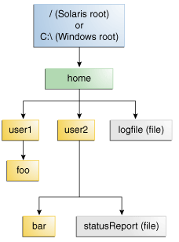
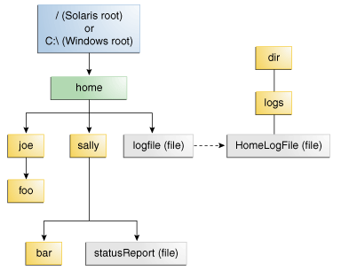

# Path

- [Path](#path)
  - [简介](#简介)
  - [路径](#路径)
    - [符号链接（Symbolic Links）](#符号链接symbolic-links)
    - [文件系统](#文件系统)
  - [Path 类](#path-类)
  - [创建 `Path`](#创建-path)
    - [创建绝对路径](#创建绝对路径)
    - [创建相对当前根目录的路径](#创建相对当前根目录的路径)
    - [创建相对工作目录的路径](#创建相对工作目录的路径)
    - [通过 URI 创建](#通过-uri-创建)
    - [使用 FileSystems.getDefault().getPath() 定义](#使用-filesystemsgetdefaultgetpath-定义)
    - [获得主目录Path](#获得主目录path)
  - [路径信息查询](#路径信息查询)
  - [路径操作](#路径操作)
    - [移除路径冗余](#移除路径冗余)
    - [路径转换](#路径转换)
    - [合并路径](#合并路径)
    - [创建相对路径](#创建相对路径)
    - [路径比较](#路径比较)

2020-05-11, 15:58
***

## 简介

`Path` 类在 JDK7 引入，表示文件路径对象。`Path` 类实例不是系统独立的，在 Windows 和 Solaris 中语法不同。

在具体讨论 Path 的功能前，先介绍一下文件路径的概念。

## 路径

操作系统基本都是按照树形结构组织文件。Windows 系统支持多个根节点，每个根节点映射一个分区，如 `C:\` 或 `D:\`；Solaris 系统则只支持一个根节点，通过 `/` 标识。如下所示：



文件通过在文件系统里的路径进行识别，从根节点开始。例如，上图中的 `statusReport` 文件的路径：

- Solaris OS `/home/sally/statusReport`
- Windows 系统 `C:\home\sally\statusReport`

分隔目录的字符称为分隔符，不同操作系统的分隔符不同：Solaris OS 为 `/`，Windows 系统为 `\`。

另外，"." 表示当前目录，".." 表示父目录。

路径又可分为相对路径和绝对路径。

__绝对路径__

绝对路径包含用于定位文件的根元素和完整的目录序列。如 `/home/sally/statusReport` 为绝对路径，包含定位文件所需的所有信息。

__相对路径__

相对路径需要和其它的路径一起来定位文件。如 `joe/foo` 为相对路径，如果不给出其它信息，无法定位 `joe/foo` 目录。

### 符号链接（Symbolic Links）

有些文件系统除了目录和文件外，还支持符号链接(symbolic links)。符号链接（symbolic link）由称为 *symlink* 或 *soft link*.

**符号链接**是指向其他文件的文件。对应用程序来说，符号链接文件基本是透明的，对该文件的操作，会重定向到该链接指向的实际文件；当符号链接文件删除或重命名，实际文件不变。如下如所示：



对用户来说 `logfile` 为一个常规文件，而实际上它是指向 "dir/logs/HomeLogFile" 的符号链接文件。

解析一个链接(resolving a link)表示从符号链接获得实际文件目录，如解析 "logFile" 得到 "dir/logs/HomeLogFile"。

在实际中，大多数文件系统支持符号链接。

符号链接会出现循环引用的情况，当链接的目标指向链接本身，就出现循环引用；还有间接循环的情况，如目录 a 指向 b，b 指向 c，c 指向a 。当程序递归遍历目录结构时，循环引用可能会导致无限循环。不过这种情况在 JDK 7 中已有考虑，不会导致无限循环出现。

### 文件系统

在 NIO 中路径由 `Path` 表示，文件系统由 `FileSystem` 表示。通过 `FileSystems` 获取文件系统，该类有两个重要方法：

- `getDefault()`, 返回当前 JVM 的默认`FileSystem`，一般是OS的默认文件系统；
- `getFileSystem(URI uri)`, 从已有的文件系统中找到一个和指定 URI 模式匹配的文件系统。

## Path 类

Java7 中引入的 `Path` 是 `java.nio.file` 包的主要切入点。`Path` 类，顾名思义，表示文件系统中文件的路径。`Path` 对象包含构建文件路径所需的文件名和目录，可用于检查、定位和操作文件。

`Path` 类相当于 `java.io.File` 类的升级版，不过 `File` 类目前还保留有少部分特定操作，所以没有被 deprecated。

另外，`Path` 类并非系统无关的，不同系统的 `Path` 实例不同，即使它们指向的文件具有相同的路径。

`Path` 类包含各种路径相关的方法，包括用于获取路径相关信息、提取路径、路径匹配等方法。

|方法|说明|
|---|---|
|`Paths.get(String first, String... more)`|创建 `Path`|
|`Path resolve(Path other)`|如果 other 是绝对路径，返回 other；否则连接 this 和 other 生成新的路径|
|`Path resolveSibling(Path other)`|如果 other 是绝对路径，返回 other；否则连接 this 的 parent 和 other|
|`Path relativize(Path other)`|返回other相对this的路径|
|`Path normalize()`|移除路径中的冗余元素|
|`Path toAbsolutePath()`|返回绝对距离|
|`Path getParent()`|返回父路径，如果没有，返回 null|
|`Path getFileName()`|返回路径最后一个元素，如果路径没有任何组成，返回 null|
|`Path getRoot()`|返回根结点，如果没有，返回 null|
|`toFile()`|转换为 File|

## 创建 `Path`

`Path` 实例包含文件或目录的位置信息。

通过 `Paths` 的 `get` 方法创建 `Path`:

```java
Path path = Paths.get("/tmp/foo");
assertEquals(path.toString(), "\\tmp\\foo");

Path p2 = Paths.get("D:/", "test", "p.xml");
assertEquals(p2.toString(), "D:\\test\\p.xml");
```

### 创建绝对路径

```java
assertEquals(Paths.get("C:\\Program Files\\Git\\etc\\hello.txt").toString(), "C:\\Program Files\\Git\\etc\\hello.txt");
assertEquals(Paths.get("C:\\Program Files\\Git\\etc\\", "hello.txt").toString(), "C:\\Program Files\\Git\\etc\\hello.txt");
assertEquals(Paths.get("C:\\Program Files", "Git/etc", "hello.txt").toString(), "C:\\Program Files\\Git\\etc\\hello.txt");
assertEquals(Paths.get("C:\\Program Files", "Git", "etc", "hello.txt").toString(), "C:\\Program Files\\Git\\etc\\hello.txt");
```

### 创建相对当前根目录的路径

相对路径在创建网页中经常使用，相对绝对路径使用更多。定义相对当前根目录的相对路径，例如：

```java
Path path = Paths.get("/Program Files");
assertEquals(path.toAbsolutePath().toString(), "D:\\Program Files");
```

由于测试代码在D盘，所以绝对路径以D盘符开始。

### 创建相对工作目录的路径

定义相对工作目录的路径，开头不要以文件分隔符开头。

### 通过 URI 创建

```java
URI uri = URI.create("file:///C:/test/hello.txt");
Path path = Paths.get(uri);
assertEquals(path.toString(), "C:\\test\\hello.txt");
```

### 使用 FileSystems.getDefault().getPath() 定义

```java
Path path = FileSystems.getDefault().getPath("/rafaelnadal/tournaments/2009", "BNP.txt");
Path path = FileSystems.getDefault().getPath("/rafaelnadal/tournaments/2009/BNP.txt");
Path path = FileSystems.getDefault().getPath("rafaelnadal/tournaments/2009", "BNP.txt");
Path path = FileSystems.getDefault().getPath("/rafaelnadal/tournaments/./2009","BNP.txt").normalize();
```

### 获得主目录Path

例如：

```java
Path path = Paths.get(System.getProperty("user.home"), "downloads", "game.exe");
```

## 路径信息查询

可以将 `Path` 看作一个序列，位置 0 是根目录，最后一个是文件或目录名。例如，对如下的目录结构：


|方法|说明|
|---|---|
|`getFileName()`|目录结构中和根目录最远的路径对象|
|`getName(int index)`|`index`是和根结点的距离，和根结点挨着的路径 `index=0`，最远的为 `count-1`|
|`getNameCount()`|路径中名称元素个数，对根目录为0|
|`subpath()`|子路径|
|`getParent()`|当前路径的上级目录|
|`getRoot()`|当前路径的根目录|

实例，绝对路径：

```java
Path path = Paths.get("C:\\home\\joe\\foo");

assertEquals(path.toString(), "C:\\home\\joe\\foo");
assertEquals(path.getFileName().toString(), "foo");
assertEquals(path.getName(0).toString(), "home");
assertEquals(path.getNameCount(), 3);
assertEquals(path.subpath(0, 2).toString(), "home\\joe");
assertEquals(path.getParent().toString(), "C:\\home\\joe");
assertEquals(path.getRoot().toString(), "C:\\");
```

实例，相对路径：

```java
Path path = Paths.get("sally/bar");
assertEquals(path.toString(), "sally\\bar");
assertEquals(path.getFileName().toString(), "bar");
assertEquals(path.getName(0).toString(), "sally");
assertEquals(path.getNameCount(), 2);
assertEquals(path.subpath(0, 2).toString(), "sally\\bar");
assertEquals(path.subpath(0, 1).toString(), "sally");
assertEquals(path.getParent().toString(), "sally");
assertNull(path.getRoot());
```

## 路径操作

### 移除路径冗余

许多文件系统使用 `.` 标识当前目录，使用 `..` 标识上级目录。由此会导致包含冗余目录信息的 `Path`，如 "/dir/logs/." 后面的 "/."。

例如，下面两个目录都包含冗余信息：

```text
/home/./joe/foo
/home/sally/../joe/foo
```

`normalize` 方法可用于移除冗余元素，上面的两个目录都转换为 "/home/joe/foo"。

需要注意的是，`normalize` 在清理路径时并不检查文件系统，只是单纯的路径语法操作。对第二个例子，如果 `sally` 是符号链接，则移除 `sally/..` 可能导致 `Path` 不再指向原文件。

在清理路径时确保能找到正确文件，可以使用 `toRealPath` 方法。

### 路径转换

有三种转换 `Path` 的方法，`toUri` 方法可以将其转换为URI：

```java
Path path = Paths.get("/home/logfile");
URI uri = path.toUri();
assertEquals(uri.toString(), "file:///D:/home/logfile");
```

`toAbsolutePath` 方法将路径转换为绝对路径，如果 `Path` 已经是绝对路径，则不改变直接返回。该方法在处理用户输入的文件名时很有用，例：

```java
Path path = Paths.get("");
Path path1 = path.toAbsolutePath();
assertEquals(path1.toString(), "D:\\code\\tutorials\\jdk-tutorial");
```

`toAbsolutePath` 在当前路径的基础上加上了当前工作目录。

`toRealPath`返回已存在文件的真实路径，该方法执行了多个操作：

- 如果将 `true` 传递给此方法，并且文件系统支持符号链接，则该方法解析路径中的所有符号链接；
- 如果 `Path` 为相对路径，则返回绝对路径；
- 如果 `Path` 包含冗余元素，则移除冗余项。

如果文件不存在或无法访问，抛出异常。

### 合并路径

通过 `resolve` 方法可以合并路径。如果参数为绝对路径，则返回参数路径；如果参数为空，则返回当前路径。否则该方法将当前路径当作一个目录，将参数路径合并到当前路径。例如，如果参数路径不包含根目录，该方法将参数路径合并到当前路径，创建一个完整路径。如：

```java
Path path = Paths.get("C:\\home\\joe\\foo");
assertEquals(path.resolve("bar").toString(), "C:\\home\\joe\\foo\\bar");
assertEquals(Paths.get("foo").resolve("/home/joe").toString(), "\\home\\joe");
```

### 创建相对路径

通过 `relativize` 方法可以创建相对路径，即从当前路径指向另一路径的路径，新的路径是当前路径相对参数的相对路径。

例如，定义两个路径：

```java
Path p1 = Paths.get("zhao");
Path p2 = Paths.get("qian");
```

假设这两个路径在同一个文件夹，则有：

```java
Path p1 = Paths.get("zhao");
Path p2 = Paths.get("qian");

Path p1_2 = p1.relativize(p2);
assertEquals(p1_2.toString(), "..\\qian");

Path p2_1 = p2.relativize(p1);
assertEquals(p2_1.toString(), "..\\zhao");
```

再来个复杂点的例子：

```java
Path p3 = Paths.get("home");
Path p4 = Paths.get("home/zhao/er");
assertEquals(p3.relativize(p4).toString(), "zhao\\er");
assertEquals(p4.relativize(p3).toString(), "..\\..");
```

- 如果两个路径中有一个包含根结点，则无法创建相对路径；
- 如果两个路径都包含根结点，则是否能创建相对路径取决于操作系统

### 路径比较

`Path` 类支持 `equals` 方法，因此可以测试两个路径是否相等。 `startsWith` 和 `endsWith` 方法用于测试路径是否以指定字符串开头或结尾。例：

```java
Path begin = Paths.get("/home");
Path end = Paths.get("foo");
Path path = Paths.get("/home/zhao/foo");
assertTrue(path.startsWith(begin));
assertTrue(path.endsWith(end));
```

另外，`Path` 类还支持 `Iterable`接口，`Comparable` 接口，可以迭代路径的元素，也可以对比 `Path` 对象。
