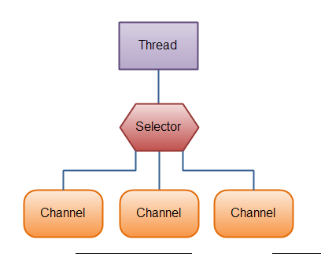
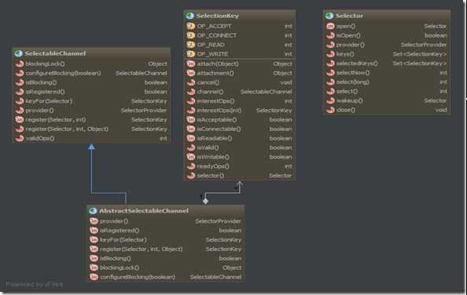

# Selector

- [Selector](#selector)
  - [简介](#简介)
  - [使用选择器](#使用选择器)
    - [选择过程](#选择过程)
    - [停止选择过程](#停止选择过程)
  - [选择过程的可扩展性](#选择过程的可扩展性)

***

## 简介

选择器提供选择执行已经就绪的任务的能力，这使得多元I/O成为可能。就绪选择和多元执行使得单线程能够有效率地同时管理多个I/O通道。选择器可谓NIO中的重头戏，I/O复用的核心，下面我们来看看这个神奇的东东。

用于单线程处理多个Channel。如果打开多个通道，每个通道的流量好很低，使用Selector就会很方便。



我们先来看下选择器相关类的关系图： 



由图中可以看出，选择器类 `Selector` 并没有和通道有直接的关系，而是通过叫选择键的对象 `SelectionKey` 来联系。选择键代表了通道与选择器之间的一种注册关系，channel()和selector()方法分别返回注册的通道与选择器。由类图也可以看出，一个通道可以注册到多个选择器；注册方法register()是放在通道类里，而我感觉放在选择器类里合适点。 

非阻塞特性与多元执行的关系非常密切，如果在阻塞模式下注册一个通道，系统会抛出`IllegalBlockingModeException` 异常。 

那么，通道注册到选择器后，选择器又是如何实现就绪选择的呢？真正的就绪操作是由操作系统来做的，操作系统处理I/O请求并通知各个线程它们的数据已经准备好了，而选择器类提供了这种抽象。 

选择键作为通道与选择器的注册关系，需要维护这个注册关系所关心的通道操作interestOps()以及通道已经准备好的操作readyOps()，这两个方法的返回值都是比特掩码，另外ready集合是interest集合的子集。选择键类中定义了4种可选择操作：read、write、connect和accept。类图中你可以看到每个可选择通道都有一个validOps()的抽象方法，每个具体通道各自有不同的有效的可选择操作集合，比如ServerSocketChannel的有效操作集合是accept，而SocketChannel的有效操作集合是read、write和connect。 

回过头来再看下注册方法，其第二个参数是一个比特掩码，这个参数就是上面讲的这个注册关系所关心的通道操作。在选择过程中，所关心的通道操作可以由方法interestOps(int operations)进行修改，但不影响此次选择过程（在下一次选择过程中生效）。

## 使用选择器

### 选择过程

类图中可以看出，选择器类中维护着两个键的集合：已注册的键的集合keys()和已选择的键的集合selectedKeys()，已选择的键的集合是已注册的键的集合的子集。已选择的键的集合中的每个成员都被选择器（在前一个选择操作中）判断为已经准备好（所关心的操作集合中至少一个操作）。 除此之外，其实选择器内部还维护着一个已取消的键的集合，这个集合包含了cancel()方法被调用过的键。

选择器类的核心是选择过程，基本上来说是对select()、poll()等系统调用的一个包装。那么，选择过程的具体细节或步骤是怎样的呢？ 

当选择器类的选择操作select()被调用时，下面的步骤将被执行： 
1. 已被取消的键的集合被检查。如果非空，那么该集合中的键将从另外两个集合中移除，并且相关通道将被注销。这个步骤结束后，已取消的键的集合将为空。 
2. 已注册的键的集合中的键的interest集合将被检查。在这个步骤执行过后，对interset集合的改动不会影响剩余的检查过程。一旦就绪条件被确定下来，操作系统将会进行查询，以确定每个通道所关心的操作的真实就绪状态。这可能会阻塞一段时间，最终每个通道的就绪状态将确定下来。那些还没有准备好的通道将不会执行任何操作；而对于那些操作系统指示至少已经准备好interest集合中的一个操作的通道，将执行以下两种操作中的一种： 
   1) 如果通道的键还没有在已选择的键的集合中，那么键的ready集合将被清空，然后表示操作系统发现的当前通道已经准备好的操作的比特掩码将被设置。 
   2) 如果通道的键已处于已选择的键的集合中，键的ready集合将被表示操作系统发现的当前通道已经准备好的操作的比特掩码所更新，所有之前的已经不再是就绪状态的操作不会被清除。 
3. 步骤2可能会花费很长时间，特别是调用的线程处于休眠状态。同时，与选择器相关的键可能会被取消。当步骤2结束时，步骤1将重新执行，以完成任意一个在选择过程中，键已经被取消的通道的注销。 
4. select操作返回的值是ready集合在步骤2中被修改的键的数量，而不是已选择键的集合中的通道总数。返回值不是已经准备好的通道的总数，而是从上一个select调用之后进入就绪状态的通道的数量。之前调用中就绪的，并且在本次调用中仍然就绪的通道不会被计入。

### 停止选择过程

选择器类提供了方法wakeup()，可以使线程从被阻塞的select()方法中优雅的退出，它将选择器上的第一个还没有返回的选择操作立即返回。 

调用选择器类的close()方法，那么任何一个阻塞在选择过程中的线程将被唤醒，与选择器相关的通道将被注销，而键将被取消。 

另外，选择器类也能捕获InterruptedException异常并调用wakeup()方法。

## 选择过程的可扩展性

在单cpu中使用一个线程为多个通道提供服务可能是个好主意，但对于多cpu的系统，单线程必然比多线程在性能上要差很多。 

一个比较不错的多线程策略是，以所有的通道使用一个选择器（或多个选择器，视情况），并将以就绪通道的服务委托给其他线程。用一个线程监控通道的就绪状态，并使用一个工作线程池来处理接收到的数据。

讲了这么多，下面来看一段用NIO写的简单服务器代码： 

```java
private void run(int port) throws IOException {
    // Allocate buffer
    ByteBuffer echoBuffer = ByteBuffer.allocate(1024);
    // Create a new selector
    Selector selector = Selector.open();
// Open a listener on the port, and register with the selector
    ServerSocketChannel ssc = ServerSocketChannel.open();
    ssc.configureBlocking(false);
    ServerSocket ss = ssc.socket();
    InetSocketAddress address = new InetSocketAddress(port);
    ss.bind(address);
SelectionKey key = ssc.register(selector, SelectionKey.OP_ACCEPT);
    System.out.println("Going to listen on " + port);
for (;;){
        int num = selector.select();
Set selectedKeys = selector.selectedKeys();
        Iterator it = selectedKeys.iterator();
while (it.hasNext()) {
            SelectionKey selectionKey = (SelectionKey) it.next();
if ((selectionKey.readyOps() & SelectionKey.OP_ACCEPT)
                    == SelectionKey.OP_ACCEPT) {
                // Accept the new connection
                ServerSocketChannel serverSocketChannel = (ServerSocketChannel) selectionKey.channel();
                SocketChannel sc = serverSocketChannel.accept();
                sc.configureBlocking(false);
// Add the new connection to the selector
                SelectionKey newKey = sc.register(selector, SelectionKey.OP_READ);
                it.remove();
System.out.println("Got connection from " + sc);
            } else if ((selectionKey.readyOps() & SelectionKey.OP_READ)
                    == SelectionKey.OP_READ) {
                // Read the data
                SocketChannel sc = (SocketChannel) selectionKey.channel();
// Echo data
                int bytesEchoed = 0;
                while (true) {
                    echoBuffer.clear();
                    int r = sc.read(echoBuffer);
                    if (r <= 0) {
                        break;
                    }
                    echoBuffer.flip();
                    sc.write(echoBuffer);
                    bytesEchoed += r;
                }
                System.out.println("Echoed " + bytesEchoed + " from " + sc);
                it.remove();
            }
        }
    }
}
```
