# Reactor Operators

2025-03-21
@author Jiawei Mao

***

## 1. 创建

> [!TIP]
>
> - `just()` 是使用 已有值创建 `Publisher` 最简单的方法
> - `from*()` 从其它对象创建 `Publisher`，部分可以延迟执行
> - `defer()` 可以延迟创建 `Publisher`，`Supplier` 表达式在订阅时才执行
> - `create()` 通过 `MonoSink` 和 `FluxSink` 可以完全控制 `Publisher` 的创建

- 生成一个已有元素 `T`：`just(Flux|Mono)`
  - 从 `Optional<T>`: `Mono#justOrEmpty(Optional<T>)`
  - 可能为 nul 的 `T`：`Mono#justOrEmpty(T)`

- 生成从方法返回的 `T`：`just(Flux|Mono)`
  - lazy 捕获：`Mono#fromSupplier`
  - 或在 `defer(Flux|Mono)` 中包装 `just(Flux|Mono)`

- 生成可枚举的多个 `T`：`Flux#just(T...)`
- 迭代
  - 数组：`Flux#fromArray`
  - 集合或 iterable：`Flux#fromIterable`
  - 整数范围：`Flux#range`
  - `Stream`：`Flux#fromStream(Supplier<Stream>)`
- 从单个值的 source emits，例如：
  - 从 `Supplier<T>`：`Mono#fromSupplier`
  - 从 task：`Mono#fromCallable`, `Mono#fromRunnable`
  - 从 `CompletableFuture<T>`：`Mono#fromFuture`
- 直接完成：`empty(Flux|Mono)`
- 直接 error：`error(Flux|Mono)`
  - lazy 构建 `Throwable`：`error(Supplier<Throwable>)(Flux|Mono)`
- 不做任何事：`never(Flux|Mono)`
- 在订阅时决定：`defer(Flux|Mono)`
- 取决于 disposable 资源：`using(Flux|Mono)`
- 以编程方式生成事件（可以使用状态）：
  - 逐个同步生成：`Flux#generate` 参考 [同步:generate](#同步-generate)
  - 异步，一次 emit 多个信号：`Flux#create`, `Mono#create` 也可以，但不能 emit 多个信号

### empty

- **Mono**

```java
public static <T> Mono<T> empty();
```

⭐创建的 `Mono` 直接完成，不 emit 任何值。

**示例**：创建空 `Mono`，即直接完成，不 emit 值

```java
Mono<String> mono = Mono.empty();
StepVerifier.create(mono)
        .verifyComplete();
```

- **Flux**

```java
public static <T> Flux<T> empty();
```

⭐创建的 `Flux` 直接完成，不 emit 任何值。

**示例**：创建空 `Flux`

```java
Flux<String> flux = Flux.empty();

StepVerifier.create(flux)
        .verifyComplete();
```

**示例**：创建空的 `Mono<String>` 和 `Flux<String>`，订阅这两个 `Publisher`，因为它们没有值，所以只 emit complete 信号

```java
Mono<String> emptyMono = Mono.empty();
Flux<String> emptyFlux = Flux.empty();
```

### error

在命令式同步代码中， 可以采用 `try-catch` 和 `throws` 处理异常。

在异步代码中，处理方式稍有不同。Reactive Streams 定义 `onError` 信号来处理异常。不过这是一个 terminal 事件，即 `Flux` 生成的最后一个事件。

- **Mono**

```java
public static <T> Mono<T> error(Throwable error);
```

⭐创建一个 `Mono`，在订阅后立即因指定错误而终止。

**示例**：创建一个 `Mono`，因 `IllegalStateException` 而异常终止

```java
Mono<String> mono = Mono.error(new IllegalStateException());
StepVerifier.create(mono)
        .verifyError(IllegalStateException.class);
```

- **Flux**

**示例**：创建 emit `IllegalStateException` 的 `Flux` 

```java
Flux<String> flux = Flux.error(new IllegalStateException());
StepVerifier.create(flux)
        .verifyError(IllegalStateException.class);
```


### just

- **Mono**

```java
public static <T> Mono<T> just(T data);
```

⭐创建包含指定元素的 `Mono`。

**示例**：创建一个包含 "foo" 值的 `Mono`

```java
Mono<String> mono = Mono.just("foo");
StepVerifier.create(mono)
        .expectNext("foo")
        .verifyComplete();
```

- **Flux**

```java
public static <T> Flux<T> just(T data);
public static <T> Flux<T> just(T... data);
```

⭐创建包含指定元素的 `Flux`。

**示例**：创建包含 "foo" 和 "bar" 两个值的 `Flux`，不使用数组或集合

```java
Flux<String> flux = Flux.just("foo", "bar");
StepVerifier.create(flux)
        .expectNext("foo", "bar")
        .verifyComplete();
```

**示例**：

```java
Mono<Integer> integerMono = Mono.just(1);
Flux<Integer> integerFlux = Flux.just(1, 2);
```

### Mono.justOrEmpty

```java
public static <T> Mono<T> justOrEmpty(Optional<? extends T> data);
public static <T> Mono<T> justOrEmpty(T data);
```

⭐如果知道没有值，用 `Mono#empty()`；如果知道有值，用 `Mono#just()`。

`Mono#justOrEmpty` 用于不确定有没有值的情况。

- 如果 `Optional.isPresent()`，则创建的 `Mono` 包含该元素
- 否则 `Mono` 只发出 `onComplete` 信号

**示例**：使用已有可能为 null 的值创建 `Mono`

```java
String potentiallyNull = null;
Mono<String> potentiallyNullMono = Mono.justOrEmpty(potentiallyNull);

StepVerifier.create(potentiallyNullMono) // null 直接 complete
            .verifyComplete();
```

**示例**：使用 `Optional` 创建 `Mono`

```java
Optional<String> optionalValue = Optional.of("optional");
Mono<String> optionalMono = Mono.justOrEmpty(optionalValue);

StepVerifier.create(optionalMono)
            .expectNext("optional")
            .verifyComplete();
```

**示例**：

```java
Optional<Integer> optionalEmpty = Optional.empty();
Optional<Integer> optionalWithValue = Optional.of(1);
Mono<Integer> monoEmpty = Mono.justOrEmpty(optionalEmpty);
Mono<Integer> monoWithValue = Mono.justOrEmpty(optionalWithValue);
monoWithValue.subscribe(
        val -> System.out.println("Mono with value - Value: " + val),
        error -> System.err.println("Mono with value - error: " + error.getMessage()),
        () -> System.out.println("Mono with value complete"));

monoEmpty.subscribe(
        element -> System.out.println("Mono empty - value: " + element),
        error -> System.err.println("Mono empty - error: " + error.getMessage()),
        () -> System.out.println("Mono empty complete")
);
```

```
Mono with value - Value: 1
Mono with value complete
Mono empty complete
```

### Mono.from

`from*()` 有许多方法：

- 从另一个 `Publisher`

```java
public static <T> Mono<T> from(Publisher<? extends T> source);
public static <I> Mono<I> fromDirect(Publisher<? extends I> source);
```

- 从 `Callable`, `Runnable` 或 `Supplier`

```java
public static <T> Mono<T> fromCallable(Callable<? extends T> supplier);
public static <T> Mono<T> fromRunnable(Runnable runnable);
public static <T> Mono<T> fromSupplier(Supplier<? extends T> supplier);
```

- 从 `CompletableFuture`, eagerly 或 lazily (`Supplier` 参数)

```java
public static <T> Mono<T> fromFuture(CompletableFuture<? extends T> future);
public static <T> Mono<T> fromFuture(CompletableFuture<? extends T> future,
                                     boolean suppressCancel);
public static <T> Mono<T> fromFuture(
    Supplier<? extends CompletableFuture<? extends T>> futureSupplier);
public static <T> Mono<T> fromFuture(
    Supplier<? extends CompletableFuture<? extends T>> futureSupplier,
    boolean suppressCancel);
```

- 从 `CompletionStage`, eagerly 或 lazily (`Supplier` 参数)

```java
public static <T> Mono<T> fromCompletionStage(
    CompletionStage<? extends T> completionStage);
public static <T> Mono<T> fromCompletionStage(
    Supplier<? extends CompletionStage<? extends T>> stageSupplier);
```

#### from

```java
public static <T> Mono<T> from(Publisher<? extends T> source);
```

将 `Publisher` 转换为 `Mono`，在 `Publisher` emit 第一个 `onNext` 后，取消 source。

> [!NOTE]
>
> `from` 和 `fromDirect` 差别在于，`from` 在接收 `Publisher` 第一个元素后，会取消 `Publisher`，而 `fromDirect` 没有该检查操作。

示例：

```java
Flux<Integer> integerFlux = Flux.just(1, 2);
Mono<Integer> mono1 = Mono.from(integerFlux);
Mono<Integer> mono2 = Mono.fromDirect(integerFlux);
```

`mono1` 和 `mono2` 都会 emit `integerFlux` 的第一个元素 1。但是，`mono1` 在 emit 1 后会取消 `integerFlux`，而 `mono2` 允许 `integerFlux` 在后台继续 emit 2。这会导致意想不到的 side-effect，所以只有当你确定作为参数的 `Publisher` 只会 emit 一个元素时，才使用 `fromDirect`。

#### fromDirect

```java
public static <I> Mono<I> fromDirect(Publisher<? extends I> source);
```

将 `Publisher` 转换为 `Mono`，不检查基数（第一个元素之后不取消 source）。

使用该 operator 意味着你直到要转换的 `Publisher` 遵循 `Mono` 语义，即只 emit 一个元素。

#### fromRunnable

```java
public static <T> Mono<T> fromRunnable(Runnable runnable);
```

创建一个 `Mono`，当提供的 `Runnable` 执行完成，`Mono` 直接完成。

此时，`Mono` 包含的不是数据，而是一个动作。

**示例**：将 `Runnable` 转换为 `Mono`

```java
AtomicInteger runnableCounter = new AtomicInteger(0);
Runnable runnable = () -> {
    runnableCounter.incrementAndGet();
    System.out.println("You are incrementing a counter via Runnable!");
};
Mono<Integer> runnableMono = Mono.fromRunnable(runnable);

StepVerifier.create(runnableMono.repeat(2))
        .verifyComplete();
assertEquals(3, runnableCounter.get());
```

**示例**：用 `Runnable` 异步修改值（作为 side-effect）

```java
private int myValue = 0;
@Test
void example_06_FromRunnable() {
    Mono<Void> runnableMono = Mono.fromRunnable(new Runnable() {
        @Override
        public void run() {
            myValue++;
        }
    });
}
```

**示例**：用 `Runnable` 执行某些动作（也是 side-effect）

```java
Mono<Void> runnableMono2 = Mono.fromRunnable(
        () -> System.out.println("Hello from Runnable!")
);
```

#### fromCallable

```java
public static <T> Mono<T> fromCallable(Callable<T> supplier)
```

使用 `Callable` 创建 `Mono`。如果 `Callable` 结果为 `null`，则生成的 `Mono` 为空。

**示例**：将 callback 转换为 Mono

```java
AtomicInteger callableCounter = new AtomicInteger(0);
Callable<Integer> callable = () -> {
    System.out.println("You are incrementing a counter via Callable!");
    return callableCounter.incrementAndGet();
};

Mono<Integer> callableCounterMono = Mono.fromCallable(callable);

StepVerifier.create(callableCounterMono.repeat(2))
            .expectNext(1, 2, 3)
            .verifyComplete();
```

#### fromFuture

```java
public static <T> Mono<T> fromFuture(CompletableFuture<T> future);
```

使用 `CompletableFuture` 创建 `Mono`，如果 `Mono` 被取消，则 future 也被取消。

`CompletableFuture` 会立即执行（eager），将执行结果交给 `Mono`。

**示例**：将 Future 转换为 Mono

```java
AtomicInteger futureCounter = new AtomicInteger(0);
CompletableFuture<Integer> completableFuture = CompletableFuture.supplyAsync(() -> {
    System.out.println("You are incrementing a counter via Future!");
    return futureCounter.incrementAndGet();
});
Mono<Integer> futureCounterMono = Mono.fromFuture(completableFuture);

StepVerifier.create(futureCounterMono)
        .expectNext(1)
        .verifyComplete();
```

**示例**：以下代码会打印 "Eager"，因为 `CompletableFuture` 会在 `Mono` 创建时立即执行

```java
Mono<String> futureMonoEager = Mono.fromFuture(CompletableFuture.supplyAsync(() -> {
    System.out.println("Eager");
    return "Hello from eager future!";
}));
```


```java

public static <T> Mono<T> fromFuture(CompletableFuture<T> future,
                                     boolean suppressCancel);
public static <T> Mono<T> fromFuture(Supplier<CompletableFuture<T>> futureSupplier);
public static <T> Mono<T> fromFuture(Supplier<CompletableFuture<T>> futureSupplier,
                                     boolean suppressCancel);
```

示例：以下代码不会打印 "Lazy"（使用 `Supplier` 提供 `CompletableFuture`），因为 `CompletableFuture` 会在使用 `Mono` 时才执行

```java
Mono<String> futureMonoLazy = Mono.fromFuture(
        () -> CompletableFuture.supplyAsync(() -> {
            System.out.println("Lazy");
            return "Hello from lazy future!";
        }));
```


### Flux.from

```java
public static <T> Flux<T> from(Publisher<? extends T> source);
```

`Flux` 可以 emit 多个元素，可以许多包含多个元素的对象创建 `Flux`。

#### fromArray

```java
public static <T> Flux<T> fromArray(T[] array);
```

⭐创建一个 `Flux`，emit 数组中包含的元素。

**示例**：创建一个 `Flux`，emit 数组的所有值

```java
Integer[] array = {1, 2, 3, 4, 5};
Flux<Integer> arrayFlux = Flux.fromArray(array);

StepVerifier.create(arrayFlux)
        .expectNext(1, 2, 3, 4, 5)
        .verifyComplete();
```

#### fromIterable

```java
public static <T> Flux<T> fromIterable(Iterable<T> it);
```

⭐创建一个 `Flux`，emit `Iterable` 包含的元素。每个 subscriber 至少调用一次 `Iterable.iterator()`，最多调用两次。

该 operator 会检查 `Iterable` 的 `Spliterator` 以估计迭代是否是有限（参考 `Operators.onDiscardMultiple()`）。由于默认 `Spliterator` 包装  `Iterator`，因此可以调用 `Iterable.iterator()` 两次。不过对 `Collection`  类型，第二次调用被跳过。

**示例**： 从 `List` 创建 `Flux`，包含 "foo" 和 "bar" 两个元素

```java
Flux<String> flux = Flux.fromIterable(Arrays.asList("foo", "bar"));
StepVerifier.create(flux)
        .expectNext("foo", "bar")
        .verifyComplete();
```

**示例**：创建一个 `Flux`，emit list 的所有元素

```java
List<String> list = Arrays.asList("1", "2", "3", "4", "5");
Flux<String> listFlux = Flux.fromIterable(list);

StepVerifier.create(listFlux)
        .expectNext("1", "2", "3", "4", "5")
        .verifyComplete();
```

#### fromStream

```java
public static <T> Flux<T> fromStream(Stream<T> s);
public static <T> Flux<T> fromStream(Supplier<Stream<T>> streamSupplier);
```

⭐创建一个 `Flux`，emit `Stream` 包含的所有元素。

两个 `fromStream` 的差别在于是否可重用 `Stream`：

- 第一个 `Stream` 不能重复使用，多次订阅或重复订阅（如 `repeat()` 或 `retry()`）可能出问题。在取消、错误或完成时，`Stream` 自定关闭
- 第二个 `fromStream` 在每次订阅时 `Supplier` 会重新创建 `Stream`，因此可以重复订阅

**示例**：创建 `Flux`，emit `Stream` 的所有值

```java
Stream<String> stream = Stream.of("5", "6", "7", "8", "9");
Flux<String> streamFlux = Flux.fromStream(stream);

StepVerifier.create(streamFlux)
        .expectNext("5", "6", "7", "8", "9")
        .verifyComplete();
```

如果订阅 `streamFlux` 两次，会抛出异常，因为第一个订阅后，会自动关闭 `Stream`。

示例：`fromStream(Supplier)`

```java
Flux<Integer> streamFluxUseMultipleTimes = Flux.fromStream(() -> Stream.of(1, 2, 3));
```

对两种情况，`Stream` 都会延迟到订阅 `Flux` 执行。

### Flux.range

```java
public static Flux<Integer> range(int start,
                                  int count)
```

⭐生成一系列整数 [start, start+count)：

- 从 `start` 开始
- 生成 `count` 个数

**示例**：创建 `Flux` 生成 [-5,5] 整数

```java
Flux<Integer> range = Flux.range(-5, 11);

System.out.println("Range: ");
StepVerifier.create(range.doOnNext(System.out::println))
        .expectNext(-5, -4, -3, -2, -1, 0, 1, 2, 3, 4, 5)
        .verifyComplete();
```

```
Range: 
-5
-4
-3
-2
-1
0
1
2
3
4
5
```


### Mono.never

```java
public static <T> Mono<T> never()
```

⭐`Mono.never()` 不发出任何数据、错误和完成信号，无限期运行，仅在测试中有用。

**示例**：创建一个 `Mono`，不 emit 值，也永远不完成

```java
Mono<String> mono = Mono.never();
StepVerifier
        .create(mono)
        .expectSubscription()
        .expectTimeout(Duration.ofSeconds(1))
        .verify();
```


### defer

`defer` 在订阅时才执行 `Supplier`，即延迟提供 `Publisher`。

- **Mono**

```java
public static <T> Mono<T> defer(Supplier<? extends Mono<? extends T>> supplier)
```

- **Flux**

```java
public static <T> Flux<T> defer(Supplier<? extends Publisher<T>> supplier)
```

对生成的 `Flux` 进行订阅时，会延迟提供 `Publisher`，将 source 的实例化推迟到每次订阅，并且 `Supplier` 可以创建特定于 Subscriber 的实例。但是，如果 supplier 不生成新实例，则该 operator 的行为与 `from(Publisher)` 类似。

示例：`Flux.just()` 在订阅后才执行

```java
Flux<Integer> fluxDeferred = Flux.defer(() -> Flux.just(1, 2, 3));
```

另外，`Supplier` 会为每个订阅生成新的 `Publisher`，类似 `fromStream`。

示例：每次订阅 `monoDeferred`，`getValue` 都会执行一次 

```java
Mono<Integer> monoDeferred = Mono.defer(() -> Mono.just(getValue()));
// ...
private Integer getValue() {
    System.out.println("getValue()");
    return 1;
}
```

示例：没有 `defer`，`getValue` 只执行一次，不管订阅与否，`getValue` 都执行一次

```java
Mono<Integer> monoNotDeferred = Mono.just(getValue());
```


## 2. 转换

- **转换已有数据**

  - 1-to-1 转换（如字符串->长度）：`map(Flux|Mono)`
    - 直接 cast：`cast(Flux|Mono)`
    - materialize 每个 source 值的 index：`Flux#index`

  - 1-to-n 转换（如字符串->字符）：`flatMap(Flux|Mono)` + factory 方法

  - 1-to-n 转换，对 source 每个元素进行编程处理：`handle(Flux|Mono)`
  - 为 source 的每个元素运行异步任务（如 url -> http request）：`flatMap(Flux|Mono)`+一个异步 `Publisher` 返回方法
    - 忽略一些数据：在 `flatMap` lambda 中根据条件返回 `Mono.empty()`
    - 保持原始序列顺序：`Flux#flatMapSequential` （立即触发异步进程，但对结果重新排序）
    - 异步任务可以从 `Mono` 源返回多个值：`Mono#flatMapMany`

- 向已有序列添加元素：

  - 添加到开头：`Flux#startWith(T...)`
  - 添加到末尾：`Flux#concatWithValues(T...)`

- 聚合 `Flux`：以下都有前缀 `Flux#`

  - 聚合为 `List`: `collectList`, `collectSortedList`
  - 聚合为 `Map`：`collectMap`, `collectMultiMap`
  - 聚合为任意容器：`collect`
  - 聚合为序列大小：`count`
  - 在元素之间应用函数（如 sum）：`reduce`
    - emit 每个中间值：`scan`
  - 从 predicate 转换为 boolean
    - 应用于所有值（AND）：`all`
    - 至少一个值（OR）：`any`
    - 测试值的存在：`hasElements` (`Mono` 也有)
    - 测试特定值的存在：`hasElement(T)`
- 重复已有序列：`repeat(Flux|Mono)`
  - 按时间间隔：`Flux.interval(duration).flatMap(tick -> myExistingPublisher)`
- 有一个空序列，但是：
  - 需要一个值：`defualtIfEmpty(Flux|Mono)`
  - 需要另一个序列：`switchIfEmpty(Flux|Mono)`
- 有一个序列，但是对序列元素不感兴趣：`ignoreElements(Flux.ignoreElements()|Mono.ignoreELement())`
  - 完成结果为 `Mono<Void>`: `then(Flux|Mono)`
  - 最后等待另一个 task 完成：`thenEmpty(Flux|Mono)`
  - 最后切换到另一个 `Mono`: `Mono#then(mono)`
  - 最后 emit 一个值：`Mono#thenReturn(T)`
  - 最后切换到另一个 `Flux`：`thenMany(Flux|Mono)`
- 有一个 `Mono`，希望推迟完成：
  - 直到另一个从该值派生的 publisher 完成：`Mono#delayUntil(Function)`
- 递归扩展为序列 graph，并 emit 组合：
  - 广度优先扩展：`expand(Function)(Flux|Mono)`
  - 深度优先扩展：`expandDeep(Function)(Flux|Mono)`

### map

- **Mono**

```java
public final <R> Mono<R> map(Function<T,R> mapper);
```

⭐**同步**转换操作。

**示例**：名字转换为大写

这是一个简单的 1-1 转换，没有延迟，可以采用 `map` operator。下面将 `User` 的所有名称转换为大写：

```java
mono.map(user -> new User(user.getUsername().toUpperCase(),
            user.getFirstname().toUpperCase(),
            user.getLastname().toUpperCase()));
```


- **Flux**

```java
public final <V> Flux<V> map(Function<T,V> mapper)
```

⭐对 `Flux` 的每个元素应用同步函数进行转换。

**示例**：对 `Flux` 的每个名称，将名字转换为大写

```java
flux.map(user -> new User(user.getUsername().toUpperCase(),
            user.getFirstname().toUpperCase(),
            user.getLastname().toUpperCase()));
```

**示例**：每个值 +1

```java
Flux<Integer> numbersFlux = Flux.range(1, 10)
        .map(val -> val + 1);

StepVerifier.create(numbersFlux)
            .expectNext(2, 3, 4, 5, 6, 7, 8, 9, 10, 11)
            .verifyComplete();
```

**示例**：如果数字 >0，返回 `>`；等于 0 返回 "="；小于 0 返回  "<"

```java
Flux<Integer> numbersFlux = Flux.just(100, -1, 0, 78, 1);

Flux<String> resultSequence = numbersFlux
        .map(i -> {
            if (i > 0)
                return ">";
            else if (i == 0)
                return "=";
            else
                return "<";
        });

StepVerifier.create(resultSequence)
        .expectNext(">", "<", "=", ">", ">")
        .verifyComplete();
```

### Mono.flatMap

```java
public final <R> Mono<R> flatMap(Function<T,Mono<R>> transformer)
```

异步转换此 `Mono` emit 的元素，然后以另一个 `Mono` 类型返回。

### Mono.flatMapMany

```java
public final <R> Flux<R> flatMapMany(Function<T,Publisher<R>> mapper)
```

⭐将 `Mono` emit 的元素转换为 `Publisher`，然后将其 emit 转发到返回的 `Flux`。


### Flux.flatMap

```java
public final <R> Flux<R> flatMap(Function<T,Publisher<R>> mapper)
```

⭐将此 `Flux` emit 的元素**异步**转换为 publishers，然后通过合并将内部 publishers 展开为单个 `Flux`。

**示例**：假设你需要调用一个 Web 服务来将字符串大写。这个调用可能会有延迟，因此不能使用 `map`，而是用 `flatMap`。

`flatMap` 采用一个 trans `Function`，返回 `Publisher<U>` 而不是 `U`。`flatMap`订阅内部 publisher，合并为一个全局输出，得到 `Flux<U>`。

注意：内部 publisher 生成的值因达到时间不同，得到的结果在 `Flux` 中可能交错。

```java
Mono<User> asyncCapitalizeUser(User u) {
    return Mono.just(new User(u.getUsername().toUpperCase(),
            u.getFirstname().toUpperCase(),
            u.getLastname().toUpperCase()));
}

flux.flatMap(user -> asyncCapitalizeUser(user));
```


### cast

- **Flux**

```java
public final <E> Flux<E> cast(java.lang.Class<E> clazz);
```

将 `Flux` 当前生成的类型转换为目标类型。

示例：使用 `map` 也能够转换类型，但是 `cast` 更便捷

```java
Flux<Object> objectFlux = Flux.just("1", "2", "3", "4", "5");
Flux<String> numbersFlux = objectFlux
        .cast(String.class);

StepVerifier.create(numbersFlux)
        .expectNext("1", "2", "3", "4", "5")
        .verifyComplete();
```


### Flux.collectList

```java
public final Mono<List<T>> collectList();
```

⭐收集 `Flux` emit 的所有元素到一个 `List`，以 `Mono` 形式返回。如果序列为空，返回空 `List`。

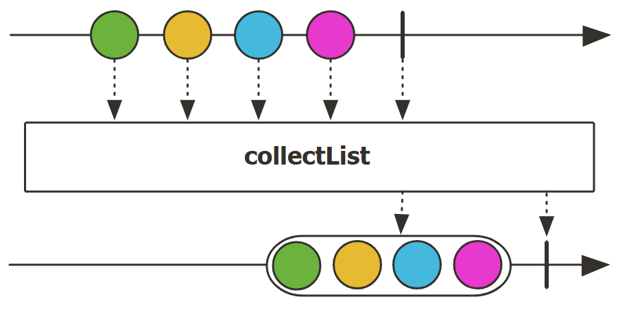

**示例**：`collectList()` 组合 `block()` 获取值

```java
Flux<String> serviceResult = fortuneTop5();

List<String> results = serviceResult.collectList().block();
assertEquals(Arrays.asList("Walmart", "Amazon", "Apple", "CVS Health", "UnitedHealth Group"), results);
```

### defaultIfEmpty

- **Mono**

```java
public final Mono<T> defaultIfEmpty(T defaultV);
```

如果 `Mono` 完成后没有任何数据，则提供一个默认值。

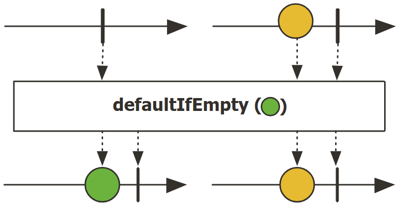

示例：如果没有值，就返回提供的默认值

```java
Mono<String> maybe_service = Mono.empty();
Mono<String> result = maybe_service
        .defaultIfEmpty("no results");

StepVerifier.create(result)
        .expectNext("no results")
        .verifyComplete();
```

### Flux.hasElement

```java
public final Mono<Boolean> hasElement(T value);
```

⭐如果 `Flux` 的任何元素等于提供的值，返回 true。

该实现采用短路逻辑，任何元素匹配该值，立即返回 true 并完成。


### Flux.reduce

```java
public final <A> Mono<A> reduce(A initial,
                                BiFunction<A,T,A> accumulator)
```

⭐将 Flux 序列的值缩减为与 `initial` 类型匹配的单个值。缩减操作由 `BiFunction` 执行。

**示例**：计算数字加和

```java
Flux<Integer> numerical_service = Flux.range(1, 10);
Mono<Integer> sum = numerical_service
        .reduce(0, Integer::sum);

StepVerifier.create(sum)
        .expectNext(55)
        .verifyComplete();
```

### Flux.scan

```java
public final <A> Flux<A> scan(A initial,
                              java.util.function.BiFunction<A,? super T,A> accumulator);
public final Flux<T> scan(java.util.function.BiFunction<T,T,T> accumulator);
```

使用 `BiFunction` 缩减 `Flux` 的值，同时输出函数的中间结果。与 `reduce` 的唯一差别就是 `scan` 会输出中间结果。

accumulator 执行过程：

```java
result[0] = initialValue;
result[1] = accumulator(result[0], source[0])
result[2] = accumulator(result[1], source[1])
result[3] = accumulator(result[2], source[2])
...
```

没有 `initial` 的版本，将 `Flux` 的第一个值作为初始值，执行过程：

```java
result[0] = source[0]
result[1] = accumulator(result[0], source[1])
result[2] = accumulator(result[1], source[2])
result[3] = accumulator(result[2], source[3])
...
```

示例：

```java
Flux<Integer> numerical_service = Flux.range(1, 10);
Flux<Integer> sumEach = numerical_service
        .scan(Integer::sum);

StepVerifier.create(sumEach)
        .expectNext(1, 3, 6, 10, 15, 21, 28, 36, 45, 55)
        .verifyComplete();
```

### Flux.startWith

```java
public final Flux<T> startWith(java.lang.Iterable<? extends T> iterable);
public final Flux<T> startWith(T... values);
public final Flux<T> startWith(Publisher<? extends T> publisher);
```

在 `Flux` 前面添加指定值。

示例：`numerical_service` 前面忘了添加 0，现在需要补上

```java
Flux<Integer> numerical_service = Flux.range(1, 10);
Flux<Integer> result = numerical_service
        .startWith(0);

StepVerifier.create(result)
        .expectNext(0, 1, 2, 3, 4, 5, 6, 7, 8, 9, 10)
        .verifyComplete();
```

### repeat

- **Mono**

```java
public final Flux<T> repeat();
```


### Flux.repeat

```java
public final Flux<T> repeat(long numRepeat,
                            BooleanSupplier predicate)
```

⭐1. 如果前一次订阅完成后，`predicate` 返回 `true`，则重复订阅。`numRepeat` 限制重新订阅的次数。


```java
public final Flux<T> repeat(long numRepeat);
```

⭐2. 重复订阅 source `numRepeat` 次。这会导致对 source 的总订阅次数为 `numRepeat+1`。因此，`numRepeat` 取 0 表示订阅一次。

- 相对 1，不需要 `predicate` 判断即可重复。


```java
public final Flux<T> repeat(BooleanSupplier predicate)
```

⭐3. 如果前一次订阅完成后 `predicate` 返回 `true`，则重复订阅。

- 相对 1，没有重新订阅次数上限


```java
public final Flux<T> repeat()
```

⭐4. 上一次订阅完成后，重复无限期订阅该源。

- 相对 1，即不需要 `predicate` 条件判断，也没有次数限制


**示例**：生成一个 `Callable`，使用它增加 `counter` 计数，并返回 `counter` 值，然后使用 `repeat()` 创建包含 1-10 的`Flux` 

```java
AtomicInteger counter = new AtomicInteger(0);
Flux<Integer> repeated = Mono.fromCallable(counter::incrementAndGet)
        .repeat(9);

System.out.println("Repeat: ");
StepVerifier.create(repeated.doOnNext(System.out::println))
        .expectNext(1, 2, 3, 4, 5, 6, 7, 8, 9, 10)
        .verifyComplete();
```

```
Repeat: 
1
2
3
4
5
6
7
8
9
10
```

### then

- **Mono**

```java
public final Mono<Void> then();
```

⭐返回一个 `Mono<Void>`，只转发该 `Mono` 的 complete 和 error 信号。


- **Flux**

```java
public final Mono<Void> then();
```

⭐返回一个 `Mono<Void>`，当该 `Flux` complete，它也 complete。简而言之，忽略序列，只转播 completion 或 error 信号。

**示例**：将 `Flux<User>` 转换为代表完成的 `Mono<Void>`

```java
flux.then();
```


## 3. 查看

lifecycle hooks 用于添加额外的行为（side effect）并查看序列，但不修改序列。

| 事件       | 方法             |
| ---------- | ---------------- |
| subscribe  | `doOnSubscribe`  |
| request    | `doOnRequest`    |
| element    | `doOnNext`       |
| error      | `doOnError`      |
| completion | `doOnCompletion` |
| cancel     | `doOnCancel`     |

- 不修改最终序列，想要：
  - 收到通知，或执行额外行为（side-effect）
    - emission: `doOnNext(Flux|Mono)`
    - completion: `Flux#doOnComplete`, `Mono#doOnSuccess`
    - error termination: `doOnError(Flux|Mono)`
    - cancellation: `doOnCancel(Flux|Mono)`
    - 序列开始：`doFirst(Flux|Mono)`
      - 这与 `Publisher#subscribe(Subscriber)` 相关
    - 订阅后：`doOnSubscribe(Flux|Mono)`
      - `subscribe` 后确定 `Subscription`
      - 与 `Subscriber#onSubscribe(Subscription)` 关联
    - request: `doOnRequest` (Flux|Mono)
    - completion or error: `doOnTerminate`(Flux|Mono)
      - 传播到下游之后执行：`doAfterTerminate`(Flux|Mono)
    - 任何类型信号，表示为 `Signal`：`doOnEach`(Flux|Mono)
    - 任何终止条件（complete, error, cancel）: `doFinally`(Flux|Mono)
  - 记录内部情况：`log`(Flux|Mono)
- 了解所有事件
  - 每个事件表示为 `Signal` 对象
    - 在序列之外的 callback 中：`doOnEach`(Flux|Mono)
    - 非原来的 `onNext` emit: `materialize`(Flux|Mono)
      - 回到 `onNext`: `dematerialize`(Flux|Mono)

  - 作为日志的一行：`log`(Flux|Mono)


如果希望指定自定义操作，而不是修改序列中的元素，则可以使用以 `do` 或 `doOn` 开头的带副作用的方法。

例如，如果希望operator 每次收到 request 都打印 "Requested"，则可以使用 `doOnRequest`。

如果每次收到 `subscription`，在发出任何信号之前先打印 "Starting"，则可以使用 `doFirst`。

每个 `doOn` 方法都采用一个 callback 表示相应事件的自定义操作。

在这些 callbacks 中不应该调用具有延迟的操作。

**示例**：所有用户，先打印 "Starring:"，然后对每个元素打印 "firstname lastname"，完成后输出 "The end!"。

```java
repository.findAll()
    .doFirst(() -> System.out.println("Starring:"))
    .doOnNext(user -> System.out.println(user.getFirstname() + " " + user.getLastname()))
    .doOnComplete(() -> System.out.println("The end!"));
```

### doFirst

```java
public final Flux<T> doFirst(Runnable onFirst);
```

添加在 Flux 被订阅之前触发的行为（side-effect），是在组装后最先执行的事件。

当在 operator-chain 中多个位置使用 `doFirst(Runnable)`，它们的执行顺序与声明顺序相反，因为订阅信号是从 subscriber 向 source 流动：

```java
Flux.just(1, 2)
    .doFirst(() -> System.out.println("three"))
    .doFirst(() -> System.out.println("two"))
    .doFirst(() -> System.out.println("one"));
//would print one two three
```

如果 `Runnable` 抛出异常，该异常会与 no-op `Subscription` 一起直接传播到 `Subscriber`，类似 `error(Throwable)`。

与 `doOnSubscribe(Consumer)` 相比，该 side-effect 优先级更高。

**示例**：添加一个 hook，在 `temperatureFlux` 被订阅前执行。该 side-effect 将 "before subscribe" 添加到 `hooksTriggered`。

```jade
CopyOnWriteArrayList<String> hooksTriggered = new CopyOnWriteArrayList<>();

Flux<Integer> room_temperature_service =
        Flux.interval(Duration.ofMillis(100), Duration.ofMillis(100))
                .take(20)
                .map(i -> ThreadLocalRandom.current().nextInt(10, 30));
Flux<Integer> temperatureFlux = room_temperature_service
        .doFirst(() -> hooksTriggered.add("before subscribe"));

StepVerifier.create(temperatureFlux
                .take(5).doOnSubscribe(s -> hooksTriggered.add("subscribe")))
        .expectNextCount(5)
        .verifyComplete();

assertEquals(hooksTriggered, Arrays.asList("before subscribe", "subscribe"));
```

### doOnNext

**Flux**

```java
public final Flux<T> doOnNext(Consumer<T> onNext)
```

当 `Flux` emit 一个元素触发的行为（**side-effect**）。

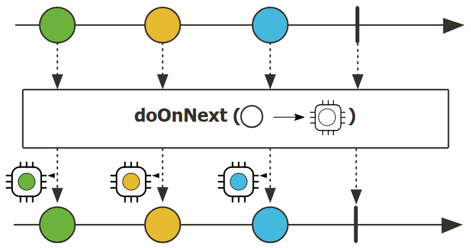

首先执行 `Consumer`，然后 `onNext` 信号向下游传播。

示例：`temperatureFlux` 每 emit 一个元素，执行一次 hook。该 hook 打印值，并用 `counter` 计数。

```java
Flux<Integer> room_temperature_service =
        Flux.interval(Duration.ofMillis(100), Duration.ofMillis(100))
                .take(20)
                .map(i -> ThreadLocalRandom.current().nextInt(10, 30));

AtomicInteger counter = new AtomicInteger(0);
Flux<Integer> temperatureFlux = room_temperature_service
        .doOnNext(val -> {
            System.out.println(val);
            counter.incrementAndGet();
        });

StepVerifier.create(temperatureFlux)
        .expectNextCount(20)
        .verifyComplete();

assertEquals(20, counter.get());
```

### doOnSubscribe

- **Flux**

```java
public final Flux<T> doOnSubscribe(Consumer<Subscription> onSubscribe)
```

添加在 `Flux` 被订阅时触发的行为（side effect），即当 `Publisher` 生成一个 `SubScription` 并传递给 `Subscriber.onSubscribe(Subscription)` 时执行。

首先执行 `Consumer`，然后 `Subscription` 向下游传播到下一个 subscriber。

示例：当 `temperatureFlux` 被订阅，添加 "subscribe" 到 `hooksTriggered`（作为 side-effect）

```java
CopyOnWriteArrayList<String> hooksTriggered = new CopyOnWriteArrayList<>();

Flux<Integer> room_temperature_service =
        Flux.interval(Duration.ofMillis(100), Duration.ofMillis(100))
                .take(20)
                .map(i -> ThreadLocalRandom.current().nextInt(10, 30));
Flux<Integer> temperatureFlux = room_temperature_service
        .doOnSubscribe(subscription -> hooksTriggered.add("subscribe"));

StepVerifier.create(temperatureFlux.take(5))
        .expectNextCount(5)
        .verifyComplete();

assertEquals(hooksTriggered, List.of("subscribe"));
```

### doOnComplete

```java
public final Flux<T> doOnComplete(Runnable onComplete);
```

`Flux` 成功完成触发的行为（side-effect）。

首先执行 `Runnable`，然后将 onComplete  信号向下游传递。

示例：当 `temperatureFlux` 成功完成，将 `completed` 设置为 true（作为 side-effect）

```java
AtomicBoolean completed = new AtomicBoolean(false);

Flux<Integer> temperatureFlux = room_temperature_service()
        .doOnComplete(() -> completed.set(true));

StepVerifier.create(temperatureFlux.skip(20))
        .expectNextCount(0)
        .verifyComplete();

assertTrue(completed.get());
```

### doOnCancel

```java
public final Flux<T> doOnCancel(Runnable onCancel);
```

当 `Flux` 被取消时触发的行为（side-effect）。

先执行 `Runnable`，再将取消信号向上游 source 传递。

**示例**：当 `temperatureFlux` 被 subscriber 取消执行 hook。该 hook 将 `canceled` 设置为 true。

```java
AtomicBoolean canceled = new AtomicBoolean(false);

Flux<Integer> temperatureFlux = room_temperature_service()
        .doOnCancel(() -> canceled.set(true));

StepVerifier.create(temperatureFlux.take(0))
        .expectNextCount(0)
        .verifyComplete();

assertTrue(canceled.get());
```

### doOnTerminate

```java
public final Flux<T> doOnTerminate(Runnable onTerminate)
```

添加当 `Flux` 终止触发的行为（side-effect），不管是成功还是出错而终止。

首先执行 `Runnable`，然后将 onComplete/onError 信号向下游传播。

**示例**：当 `temperatureFlux` 终止（因为成功完成或出错失败），触发一个 side-effect，增加 `hooksTriggeredCounter` 计数器

```java
Flux<Integer> room_temperature_service =
        Flux.interval(Duration.ofMillis(100), Duration.ofMillis(100))
                .take(20)
                .map(i -> ThreadLocalRandom.current().nextInt(10, 30));
AtomicInteger hooksTriggeredCounter = new AtomicInteger(0);

Flux<Integer> temperatureFlux = room_temperature_service
        .doOnTerminate(() -> hooksTriggeredCounter.incrementAndGet());

StepVerifier.create(temperatureFlux.take(0)) // take(0) 表示取消
        .expectNextCount(0)
        .verifyComplete();

StepVerifier.create(temperatureFlux.skip(20))
        .expectNextCount(0)
        .verifyComplete();

StepVerifier.create(temperatureFlux.skip(20)
                .concatWith(Flux.error(new RuntimeException("oops"))))
        .expectError()
        .verify();

assertEquals(2, hooksTriggeredCounter.get());
```

### doFinally

```java
public final Flux<T> doFinally(Consumer<SignalType> onFinally)
```

添加当 `Flux` 因任何原因（包括取消）终止后触发的行为（side-effect）。终止事件 `SignalType.ON_COMPLETE`, `SignalType.ON_ERROR`, `SignalType.CANCEL` 传递给 consumer，该事件在信号传递到下游后执行。

callback 在信号传递之后执行，意味着如果添加多个 `doFinally`，它们会以相反顺序执行。如果要断言 callback 的执行，需要记住 Flux 先完成，然后执行 callbacks，因此其效果可能不会在如 `blockLast()` 之后立即可见。

**示例**：当 `temperatureFlux` 因为运行成功、取消或出错失败，触发 side-effect，增加 `hooksTriggeredCounter` 计数。

```java
AtomicInteger hooksTriggeredCounter = new AtomicInteger(0);

Flux<Integer> temperatureFlux = room_temperature_service()
        .doFinally(signalType -> hooksTriggeredCounter.incrementAndGet());

StepVerifier.create(temperatureFlux.take(0))
        .expectNextCount(0)
        .verifyComplete();

StepVerifier.create(temperatureFlux.skip(20))
        .expectNextCount(0)
        .verifyComplete();

StepVerifier.create(temperatureFlux.skip(20)
                .concatWith(Flux.error(new RuntimeException("oops"))))
        .expectError()
        .verify();

assertEquals(3, hooksTriggeredCounter.get());
```

### doOnEach

```java
public final Flux<T> doOnEach(Consumer<Signal<T>> signalConsumer)
```

当 `Flux` emit 一个元素、出错失败、成功完成，触发一个行为（side-effect）。所有这些事件都表示为 `Signal`，传递给 side-effect callback。这是一个高级 operator，通常用于**监视 Flux**。这些 `Signal` 包含与之关联的 `Context`。

首先执行 `Consumer`，然后相关信号向下游传播。

**示例**：Flux emit 3 个元素然后完成，当信号出现，将 signal 名称添加到 `signal`。

```java
CopyOnWriteArrayList<String> signals = new CopyOnWriteArrayList<>();

Flux<Integer> flux = Flux.just(1, 2, 3)
        .doOnEach(signal -> signals.add(signal.getType().name()));

StepVerifier.create(flux)
        .expectNextCount(3)
        .verifyComplete();

assertEquals(signals, Arrays.asList("ON_NEXT", "ON_NEXT", "ON_NEXT", "ON_COMPLETE"));
```

### log

- **Mono**

```java
public final Mono<T> log();
```

⭐观察所有 reactive stream，并使用 `Logger` 记录。默认使用 `java.util.logging` 和 `Level.INFO`。如果 SLF4J 可用，则转用 SLF4J。

默认日志类别为 `reactor.Mono`，然后根据 operator 添加后缀，如 `reactor.Mono.Map`。


- **Flux**

**示例**：下面使用 `log` operator 来输出序列内部状态。

`repository` 是包含多个 `User` 的 `Flux`。

```java
repository
        .findAll()
        .log();
```

```
15:04:00.116 [main] INFO reactor.Flux.Zip.1 - onSubscribe(FluxZip.ZipCoordinator)
15:04:00.116 [main] INFO reactor.Flux.Zip.1 - request(1)
15:04:00.225 [parallel-1] INFO reactor.Flux.Zip.1 - onNext(User{username='swhite', firstname='Skyler', lastname='White'})
15:04:00.225 [parallel-1] INFO reactor.Flux.Zip.1 - request(1)
15:04:00.336 [parallel-1] INFO reactor.Flux.Zip.1 - onNext(User{username='jpinkman', firstname='Jesse', lastname='Pinkman'})
15:04:00.336 [parallel-1] INFO reactor.Flux.Zip.1 - request(2)
15:04:00.426 [parallel-1] INFO reactor.Flux.Zip.1 - onNext(User{username='wwhite', firstname='Walter', lastname='White'})
15:04:00.531 [parallel-1] INFO reactor.Flux.Zip.1 - onNext(User{username='sgoodman', firstname='Saul', lastname='Goodman'})
15:04:00.531 [parallel-1] INFO reactor.Flux.Zip.1 - onComplete()
```

## 4. 过滤

- 过滤序列：
  - 基于任何规则：`filter`(Flux|Mono)
    - 异步计算：`filterWhen`(Flux|Mono)
  - 限制生成对象的类型：`ofType`(Flux|Mono)
  - 忽略某些值：`ignoreElements`(`Flux.ignoreElements()`, `Mono.ignoreElement()`)
  - 忽略重复值
    - 在整个序列 ：`Flux#distinct`
    - 后面生成的元素：`Flux#distinctUntilChanged`
- 序列子集
  - 选择 N 个 元素
    - 序列开头：`Flux#take(long)`
      - 向上游 request 无限量：`Flux#take(long,false)`
      - 基于 duration: `Flux#take(Duration)`
      - 仅第一个元素，类似 `Mono`：`Flux#next()`
    - 序列末尾：`Flux#takeLast`
    - 直到满足条件（inclusive）：`Flux#takeUntil`(基于 predicate), `Flux#takeUntilOther`(基于 companion publisher)
    - 当某个条件满足（exclusive）：`Flux#takeWhile`
  - 最多取 1 个元素
    - 在特定位置：`Flux#elementAt`
    - 末尾：`.takeLast(1)`
      - 如果为空，emit 错误：`Flux#last()`
      - 如果未空，emit 默认值：`Flux#last(T)`
  - 跳过元素
    - 序列开头：`Flux#skip(long)`
      - 基于 duration：`Flux#skip(Duration)`
    - 序列末尾：`Flux#skipLast`
    - 直到满足条件（inclusive）：`Flux#skipUntil`（基于 predicate），`Flux#skipUntilOther`（基于 companion publisher）
    - 当某个条件满足（exclusive）：`Flux#skipWhile`
  - 抽样
    - 基于 duration：`Flux#sample(Duration)`
      - 保留采样窗口的第一个元素而不是最后一个：`sampleFirst`
    - 基于 publisher window：`Flux#sample(Publisher)`
    - 基于 publisher 超时：`Flux#sampleTimeout` （每个元素触发一个 publisher，如果该 publisher 与下一个 publisher 不重叠，则 emit 该元素）
- 最后一个元素（超出则 error）
  - 如果序列为空，error：`Flux#single()`
  - 如果序列为空，返回默认值：`Flux#single(T)`
  - 接收空序列：`Flux#singleOrEmpty`

### filter

- **Flux**

```java
public final Flux<T> filter(java.util.function.Predicate<? super T> p);
```

使用指定 `Predicate` 评估每个元素，如果通过则 emit，失败则忽略，并向上游 `request(1)`.

示例：选择长度不超过 4 个字符的名字

```java
Flux<String> popular_girl_names_service = Flux.just(
        "Olivia", "Emma", "Ava", "Charlotte", "Sophia",
        "Amelia", "Isabella", "Mia", "Evelyn", "Harper",
        "Camila", "Gianna", "Abigail", "Luna", "Ella");
Flux<String> shortListed = popular_girl_names_service
        .filter(name -> name.length() <= 4);

StepVerifier.create(shortListed)
        .expectNext("Emma", "Ava", "Mia", "Luna", "Ella")
        .verifyComplete();
```

#### ofType

```java
public final <U> Flux<U> ofType(java.lang.Class<U> clazz);
```

过滤，只选择指定类型的元素。类型不满足的元素忽略，比向上游 emit `request(1)`。

示例：`mashed_data_service` 是 Object 类型的序列，不使用 `filter()`，收集 `String` 类型元素

```java
Flux<Object> mashed_data_service = Flux.just("1", new LinkedList<String>(), 
        new AtomicReference<String>(), "String.class", String.class);
Flux<String> strings = mashed_data_service
        .ofType(String.class);

StepVerifier.create(strings)
        .expectNext("1", "String.class")
        .verifyComplete();
```

#### Flux.distinct

```java

public final <V> Flux<T> distinct(java.util.function.Function<? super T,? extends V> keySelector);
public final <V,C extends java.util.Collection<? super V>> Flux<T> distinct(
    java.util.function.Function<? super T,? extends V> keySelector,
    java.util.function.Supplier<C> distinctCollectionSupplier)
```

```java
public final Flux<T> distinct();
```

对每个 `Subscriber`，跟踪该 `Flux` 的元素，出现重复就过滤掉。

由 `HashSet` 记录元素，用于重复值检测。如果需要一个更轻量级的方法，不保留所有对象，但很容易由于 hashcode 冲突而错误地将两个元素视为不同，可使用 `distinct(Object::hashcode)。`

示例：过滤掉重复值

```java
Flux<String> duplicated_records_service = Flux.just("1", "2", "1", "3", 
                                                    "4", "5", "3", "3");
Flux<String> items = duplicated_records_service
        .distinct();

StepVerifier.create(items)
        .expectNext("1", "2", "3", "4", "5")
        .verifyComplete();
```

#### Flux.next

```java
public final Mono<T> next()
```

仅选择第一个元素，返回 `Mono`。如果 `Flux` 为空，则 emit 一个空 `Mono`。

示例：取第一个元素

```java
Flux<String> fragile_service = Flux.just("watch_out")
        .concatWith(Flux.error(new RuntimeException("Spiders!")));
Mono<String> firstResult = fragile_service.next();

StepVerifier.create(firstResult)
        .expectNext("watch_out")
        .verifyComplete();
```

#### Flux.take

```java
public final Flux<T> take(long n);
```

取 `Flux` 的前  n 个元素。如果 `n` 为 0，则不订阅 source，operator 在订阅后立即 complete。

该 operator 可以确保上游 request 上限为 n，但如果下游的 request 小于 n，也可以生成更少的元素。

示例：`number_service` 生成 300 个数字，但我们只需要前 100 个

```java
        Flux<Integer> number_service = Flux.range(0, 300);
        Flux<Integer> numbers = number_service
                .take(100);

        StepVerifier.create(numbers)
                .expectNextCount(100)
                .verifyComplete();
```


- 在指定时间内从 `Flux` 生成值，如果 `timespan` 为 0，则生成 1 个值后立刻停止

```java
public final Flux<T> take(java.time.Duration timespan);
```

- 

```java
public final Flux<T> take(java.time.Duration timespan,
                          Scheduler timer);
```


#### Flux.takeLast

```java
public final Flux<T> takeLast(int n);
```

取 `Flux` 最后 `n` 个元素。

示例：`number_service` 生成 300 个 元素，但我们只需要最后 100 个

```java
Flux<Integer> number_service = Flux.range(0, 300);
Flux<Integer> numbers = number_service
        .takeLast(100);

StepVerifier.create(numbers)
        .expectNextMatches(i -> i >= 200)
        .expectNextCount(99)
        .verifyComplete();
```

#### Flux.skip

```java
public final Flux<T> skip(long skipped);
```

跳过开头指定数目的元素。

示例：`number_service` 返回 300 个 元素，但只需要中间 100  个

```java
Flux<Integer> number_service = Flux.range(0, 300);
Flux<Integer> numbers = number_service
        .skip(100) // 跳过开头的 100 个
        .take(100);

StepVerifier.create(numbers)
        .expectNextMatches(i -> i >= 100)
        .expectNextCount(99)
        .verifyComplete();
```


## 5. 处理 Errors

- **创建 error 序列**：`error(Flux|Mono)`

  - 替换一个成功 `Flux` 的 completion: `.concat(Flux.error(e))`

  - 替换一个成功 `Mono` 的 emission：`.then(Mono.error(e))`

  - onNexts 之间间隔时间过长：`timeout(Flux|Mono)`

  - lazy: `error(Supplier<Throwable>)(Flux|Mono)`

- try/catch 等价
  - 抛出异常：`error`(Flux|Mono)
  - 捕获异常
    - 出错时回退到默认值：`onErrorReturn`(Flux|Mono)
    - 完成：`onErrorComplete`(Flux|Mono)
    - 回退到另一个 Flux 或 Mono：`onErrorResume`(Flux|Mono)
    - 包装后抛出异常：`.onErrorMap(t → new RuntimeException(t))`（Flux|Mono）

  - finally block: `doFinally`(Flux|Mono)
  - 使用 java 7 pattern: `using`(Flux|mono) factory 方法

- 从错误恢复
  - 回退
    - 回退到某个值：`onErrorReturn`(Flux|Mono)
    - 回退到 completion: `onErrorComplete`(Flux|Mono)
    - 回退到 Publisher 或 Mono：`Flux#onErrorResume` 和 `Mono#onErrorResume`

  - 重新尝试
    - 简单策略：`retry()` (Flux|Mono), `retry*long`(Flux|Mono)
    - 由一个伴侣 Flux 触发：`retryWhen`(Flux|Mono)
    - 使用一个标准的回退策略：`retryWhen(Retry.backoff(...))`(Flux|Mono)

- 处理反压错误（从上游请求最大值，当下游不能生成足够 request 应用该策略）
  - 抛出一个特殊的 `IllegalStateException`异常：`Flux#onBackpressureError`
  - 删除多余的值：`Flux#onBackpressureDrop`
    - 除了最后一个：`Flux#onBackpressureLatest`

  - 缓冲多余的值：`Flux#onBackpressureBuffer`
    - buffer 也溢出时采取的策略：`Flux#onBackpressureBuffer` 与 `BufferOverflowStrategt`

### onErrorReturn

- **Mono**

```java
public final Mono<T> onErrorReturn(T fallbackValue);
```

⭐当 `Mono` 出错时，返回指定的默认值。

**示例**：当输入 `Mono` 出错时，返回默认 `User.SAUL`，否则不变。

```java
mono.onErrorReturn(User.SAUL);
```


- **Flux**


### onErrorResume

- **Mono**


- **Flux**

```java
public final Flux<T> onErrorResume(Function<Throwable,Publisher<T>> fallback);
```

在 `Flux` 出错时回退到另一个 `Publisher`，使用函数根据错误选择后备 `Publisher`。

**示例**：出错时返回包含 `User.SAUL` 和 `User.JESSE` 的 `Flux<User>`，否则不改变输入 flux

```jva
flux.onErrorResume(throwable -> Flux.just(User.SAUL, User.JESSE));
```

`onErrorReturn` 只能返回一个值，`onErrorREsume` 则可以返回多个值。

### Exceptions

处理异常稍微复杂一些。最简单的方式是在 lambda 表达式中使用 `try-catch` 将其转换为 `RuntimeException`，向下游发出信号。

`Exceptions#propagate` 工具可以将异常包装成一个特殊的 runtime 异常，该异常可以由 Reactor Subscriber 和 `StepVerifier` 解包，从而避免在堆栈中看到不相关的 `RuntimeException`。

**示例**：`capitalizeUser` 会抛出 `GetOutOfHereException`，在 catch 中用 `Exceptions.propagate(e)` 进行包装。

```java
flux.map(user -> {
        try {
            return capitalizeUser(user);
        } catch (GetOutOfHereException e) {
            throw Exceptions.propagate(e);
        }
    });
```

## 6. 处理 Time

- 希望将 emit 与时间关联
- 固定时间间隔：`Flux#interval`
- 在初始延迟后 emit 一个 0：`Mono.delay`
- 引入延迟
  - 在每个 `onNext` 信号之前：`Mono#delayElement`, `Flux#delayElements`
  - 订阅之前：`delaySubscription`(Flux|Mono)


### Mono.delay

```java
public static Mono<Long> delay(Duration duration)
```

⭐创建一个 `Mono`，在默认 scheduler 延迟 `onNext` 信号，`duration` 为延迟时间。如果无法满足要求，发出 `onError` 信号。`delay` 通过默认 `parallel` Scheduler 引入。


### Flux.interval

```java
public static Flux<Long> interval(Duration delay,
                                  Duration period,
                                  Scheduler timer)
```

⭐1. 创建一个 `Flux<Long>`，在指定 `Scheduler` 上执行，从 0 开始，然后以固定速度 `period` 递增：

- 第一个元素在 `delay` 延迟后发出
- 如果未及时生成元素，会发出 `onError` 信号，抛出 `IllegalStateException` 异常
- 在正常情况下，`Flux` 不会完成，一直执行

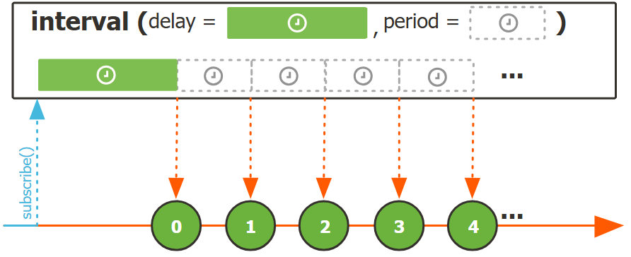

**示例**：创建一个 `Flux`，包含 0 到 9，每 100 ms emit 一个值

```java
Flux<Long> flux = Flux.interval(Duration.ofMillis(100))
        .take(10);
StepVerifier.create(flux)
        .expectNext(0L, 1L, 2L, 3L, 4L, 5L, 6L, 7L, 8L, 9L)
        .verifyComplete();
```


```java
public static Flux<Long> interval(Duration period,
                                  Scheduler timer)
```

⭐2. 同1，差异：

- 初始 `delay` 等于 `period`。


```java
public static Flux<Long> interval(Duration delay,
                                  Duration period);
```

⭐3. 同 1，差异：

- timer 为 global-timer，在 `Schedulers.parallel()` Scheduler 运行。


```java
public static Flux<Long> interval(Duration period)
```

⭐4. 同 1，差异：

- timer 为 global-timer，在 `Schedulers.parallel()` 运行
- `delay` 等于 `period`

**示例**：创建一个 `Flux`，每秒生成一个数

```java
Flux<Long> interval = Flux.interval(Duration.ofSeconds(1));

System.out.println("Interval: ");
StepVerifier.create(interval.take(3).doOnNext(System.out::println))
        .expectSubscription()
        .expectNext(0L)
        .expectNoEvent(Duration.ofMillis(900))
        .expectNext(1L)
        .expectNoEvent(Duration.ofMillis(900))
        .expectNext(2L)
        .verifyComplete();
```

```
Interval: 
0
1
2
```


### Flux.delayElements

```java
public final Flux<T> delayElements(Duration delay);
```

⭐延迟 Flux 每个元素的`Subscriber.onNext(T)` 信号，`delay` 为延迟时间。信号的延迟和执行在默认 `parallel` Scheduler 上，空序列和错误信号不会被延迟。


```java
public final Flux<T> delayElements(Duration delay,
                                   Scheduler timer);
```

⭐对 `Flux` 的每个元素（`Subscriber.onNext(T)` 信号）延迟指定 `Duration`。信号被延迟并在指定 `Scheduler` 继续执行，但空序列和错误信号不会 延迟。


### Flux.delaySequence

```java
public final Flux<T> delaySequence(Duration delay);
```


```java
public final Flux<T> delaySequence(Duration delay,
                                   Scheduler timer);
```


### Flux.delaySubscription

```java
public final Flux<T> delaySubscription(Duration delay);
```

⭐延迟该 Flux 的 `subscription`。该延迟通过默认的 `parallel` `Scheduler` 引入。


```java
public final Flux<T> delaySubscription(Duration delay,
                                       Scheduler timer)
```

⭐延迟 `Flux` 的 `subscription`。延迟时间通过指定 `Scheduler` 衡量。


```java
public final <U> Flux<T> delaySubscription(Publisher<U> subscriptionDelay);
```

⭐延迟 `Flux` 的 `subscription`，直到另一个 `Publisher` 发出一个值或完成。


## 7. 拆分 Flux

- 通过规则将 `Flux<T>` 拆分为 `Flux<Flux<T>>`：
  - 大小：`window(int)`
    - 重叠或删除: `window(int,int)`
  - 时间：`window(Duration)`
    - 重叠或删除：`window(Duration,Duration)`
  - size or time (达到计数或时间到了)：`windowTimeout(int,Duration)`
  - 基于元素的 predicate: `windowUntil`
    - 

## 8. 同步和异步

阻塞 operator 通常用于测试，或者在没有其它方法可用，只能返回同步。

> [!NOTE]
>
> 如果从标记为  non-blocking-only 的 `Scheduler`（默认为 `parallel()` 和 `single()`）调用这些方法，会抛出 `UnsupportedOperatorException `（`Mono#toFuture` 除外）。

假设有一个 `Flux<T>`：

- 阻塞直到获取第一个元素：`Flux#blockFirst`
  - 加一个 timeout: `Flux#blockFirst(Duration)`
- 阻塞直到获取最后一个元素（如果为空，则返回 null）：`Flux#blockLast`
  - 加一个 timeout: `Flux#blockLast(Duration)`
- 同步切换到 `Iterable<T>`：`Flux#toIterable`
- 同步切换到 Java 8 `Stream<T>`：`Flux#toStream`

假设有一个 `Mono<T>`：

- 阻塞直到获取值：`Mono#block`
  - 加一个 timeout: `Mono#block(Duration)`
- `CompletableFuture<T>`: `Mono#toFuture`


### Flux.blockFirst

```java
public final T blockFirst();
```

订阅 `Flux` 并阻塞，直到上游发出第一个值或完成。返回第一个值，如果  `Flux` 为空则返回 null。如果 Flux 出错，则抛出异常。

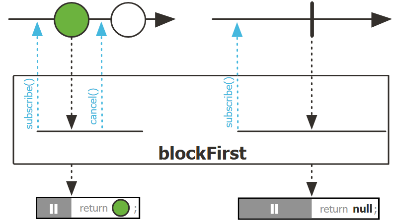

示例：

```java
Flux<String> serviceResult = Flux.just("valid result")
        .concatWith(Flux.error(new RuntimeException("oops, you collected to many, and you broke the service...")));

String result = serviceResult.blockFirst();

assertEquals("valid result", result);
```


```java
public final T blockFirst(java.time.Duration timeout);
```

订阅 `Flux` 并阻塞，直到上游发出第一个值的信号、完成或超时。返回第一个值，如果 `Flux` 为空则返回 null。如果 `Flux` 出错则抛出错误，如果超时，也抛出错误。

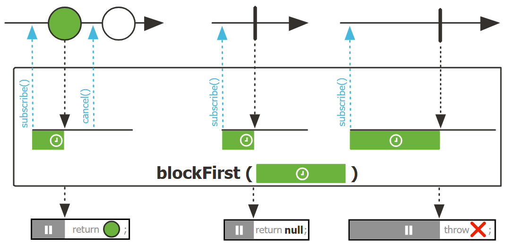

### Flux.blockLast

### Flux.toIterable

```java
public final Iterable<T> toIterable();
```

⭐将该 `Flux` 转换为 lazy `Iterable`，在 `Iterator.next()` 调用上阻塞。reactive->阻塞转换。

> [!NOTE]
>
> 不允许在标记为 "non-blocking only" 的线程中迭代，否则会抛出 `IllegalStateException`，不过在这些线程中获取 `Iterable` 是可以的。

### Flux.toStream

### Mono.block

```java
public T block();
```

⭐`block()` 订阅 `Mono`，阻塞直到收到下一个信号：

- 返回 `Mono` 的值
- 如果 `Mono` 为空则返回 `null`
- 如果 `Mono` 出错，则抛出异常

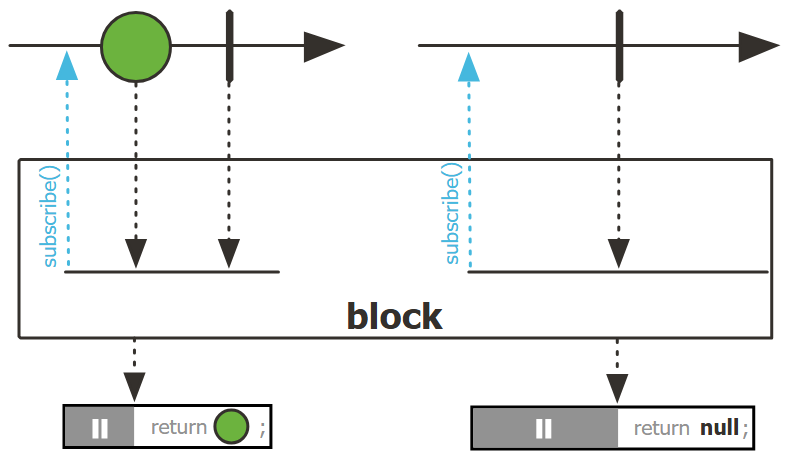

示例：

```java
Mono<String> serviceResult = Mono.just("Hello World!");

String result = serviceResult.block();
assertEquals("Hello World!", result);
```


```java
public T block(java.time.Duration timeout)
```

⭐加了时间限制。订阅 `Mono`，阻塞直到收到下一个信号，或者超时。超时也会抛出 `RuntimeException `。其它同上。

另外，每个 `block()` 会触发一个新订阅，因此，对 hot-publisher，该操作可能错过信号。

示例：最多阻塞 1 秒，超时抛出异常

```java
Exception exception = assertThrows(IllegalStateException.class, () -> {
    Mono<String> serviceResult = Mono.never(); // unresponsiveService()

    String result = serviceResult.block(Duration.ofSeconds(1));
});

String expectedMessage = "Timeout on blocking read for 1";
String actualMessage = exception.getMessage();

assertTrue(actualMessage.contains(expectedMessage));
```

### Mono.blockOptional

```java
public java.util.Optional<T> blockOptional();
public java.util.Optional<T> blockOptional(java.time.Duration timeout);
```

同 `Mono#block`，只是以 `Optional` 的形式返回。

## 9. 合并

- 合并 publishers
  - 按顺序：`Flux#concat` 或 `.concatWith(Other)(Flux|Mono)`
    - 延迟错误直到剩余 Publisher emit：`Flux#concatDelayError`
    - eagerly 订阅后面的 publisher: `Flux#mergeSequential`
  - 按 emit 顺序（按元素到的顺序组合）：`Flux#merge`, `.mergeWith(other)(Flux|Mono)`
    - 不同类型（变换 merge）：`Flux#zip`, `Flux#zipWith`
  - 配对值
    - 2 个 Mono 合并为一个 `Tuple2`：`Mono#zipWith`
    - n 个 `Mono` 完成后合并：`Mono#zip`
  - 协调终止
    - 1 个 `Mono` 和任意 source 到 `Mono<Void>`：`Mono#add`
    - n 个 sources，完成时：`Mono#when`
    - 放入任意容器类型
      - 每次所有  publishers 都 emit 时：`Flux#zip` (直到最小基数)
      - 每当有新值到达：`Flux#combineLatest`
  - 选择第一个 publisher，当：
    - 生成一个值 `onNext`: `firstWithValue(Flux|Mono)`
    - 生成任意信号：`firstWithSignal(Flux|Mono)`
  - 由 source 序列中的元素触发：`switchMap` （每个 source 元素映射到一个 `Publisher`）
  - 由 publisher 序列中的下一个启动的 publisher 触发：`switchOnNext`


### Flux.concat

```java
public static <T> Flux<T> concat(Iterable<Publisher<T>> sources);
```

⭐静态方法 `concat` 串联 `sources` 提供的所有 `Publisher` 的元素。

- **按顺序**合并，先订阅第一个 source 的元素，完成到下一个
- 任何错误都会导致序列中断，并立即转发到下游

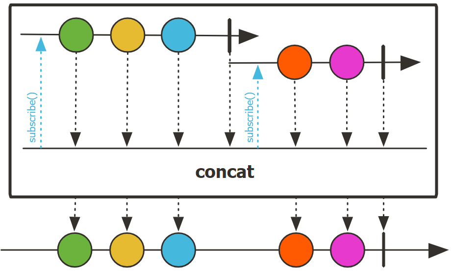

**示例**：按顺序合并 numberService1 和 numberService2，不要有交错

```java
Flux<Integer> numberService1 = Flux.range(1, 3).doOnNext(System.out::println);
Flux<Integer> numberService2 = Flux.range(4, 4).doOnNext(System.out::println);
Flux<Integer> numbers = Flux.concat(numberService1, numberService2);

StepVerifier.create(numbers)
            .expectNext(1, 2, 3, 4, 5, 6, 7)
            .verifyComplete();
```

### concatWith

- **Mono**

- **Flux**

```java
public final Flux<T> concatWith(Publisher<T> other);
```

将当前 `Flux` 和另一个 `Publisher` 的数据拼接，没有交错。

如果希望保持数据的顺序，`concatWith` 与 `mergeWith` 更合适。

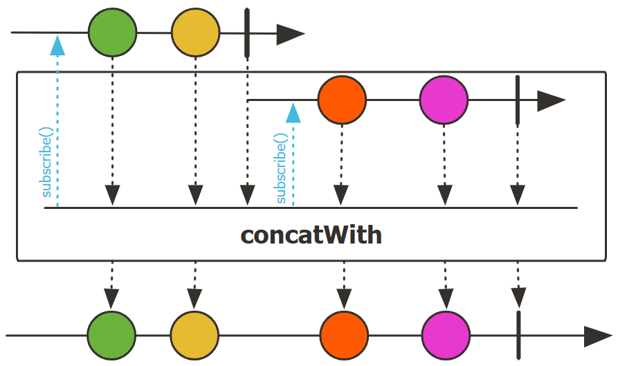

### Flux.concatMap

```java
public final <V> Flux<V> concatMap(Function<T,Publisher<V>> mapper);
```

⭐将该 `Flux` emit 的元素异步转换为 `Publisher`，然后按顺序将这些内部 publishers 展平为单个 `Flux`，并使用 concat 保持顺序。

该 operator 与 `flatMap` 及 `flatMapSequential` 比较：

- 内部 publisher 的生成和订阅：`concatMap` 等一个 publisher 完成后，再生成下一个 publisher 并订阅，即按顺序进行
- 展开值的顺序：`concatMap` 保留与 source 元素相同的顺序，按顺序连接每个 source 元素展开后的值
- 交错：`concatMap` 不允许 souce 不同元素展开后的值交错

`concatMap` 没有预取行为。

**示例**：`taskExecutor` 包含重要的 tasks，获取所有 tasks 并执行

```java
Flux<Void> tasks = taskExecutor()
        .concatMap(Function.identity());

StepVerifier.create(tasks)
            .verifyComplete();

assertEquals(10, taskCounter.get());
```


### Flux.merge

```java
public static <T> Flux<T> merge(Publisher<Publisher<T>> source);
```

⭐将 `Publisher` 序列 emit 的数据合并为交错序列。与 `concat` 不同的是，内部 sources 是 eagerly。

`merge` 是为异步 sources 或有限 sources 设计的。对还没有在专用 `Scheduler` 发布的无限 source，必须在单独的 `Scheduler` 隔离，否则 `merge` 可能在订阅其它 source 时尝试将其耗尽。


```java

public static <T> Flux<T> merge(Publisher<Publisher<T>> source,
                                int concurrency);
public static <T> Flux<T> merge(Publisher<Publisher<T>> source,
                                int concurrency,
                                int prefetch);
public static <I> Flux<I> merge(Iterable<Publisher<I>> sources);
public static <I> Flux<I> merge(Publisher<I>... sources);
public static <I> Flux<I> merge(int prefetch, Publisher<I>... sources);
```

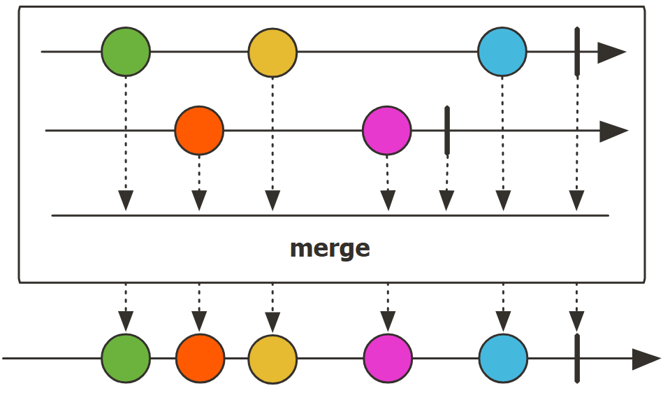

### firstWithValue

- **Mono**

```java
public static <T> Mono<T> firstWithValue(Iterable<Mono<T>> monos);
```

⭐选择第一个发出值的 `Mono`。

包含值的 source 比空 source (仅发出 `onComplete`)或失败的 source（仅发出 `onError`）优先级高。

如果没有任何 source 提供值，`firstWithValue` 失败并抛出 `NoSuchElementException`（前提是至少有两个 sources）。

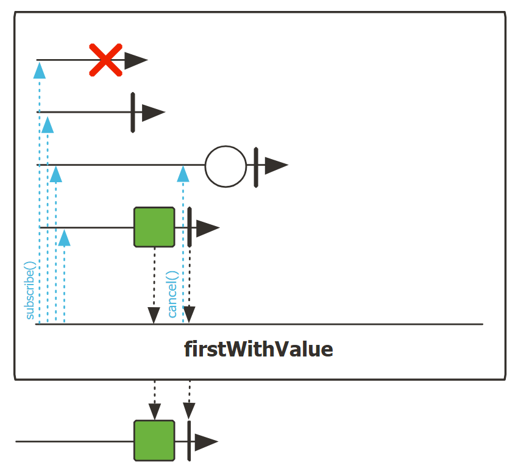

**示例**：选择返回值更快的 Mono

```java
Mono.firstWithValue(mono1, mono2);
```

- **Flux**

```java
public static <I> Flux<I> firstWithValue(Iterable<Publisher<I>> sources);
```

⭐哪个 `Publisher` 最先 emit 第一个值，就选择该 `Publisher`，即选择第一个发出 `onNext` 事件的 source。

- 包含值的 source 总是比 empty source 或 failing source (只发出 onError) 优先
- 当没有 source 提供值，抛出 `NoSuchElementException` （前提是至少有 2 个 sources）
- 与 `firstWithSignal()` 一样，如果没有其它 source 发出 `onNext`，则无限 source 会出问题

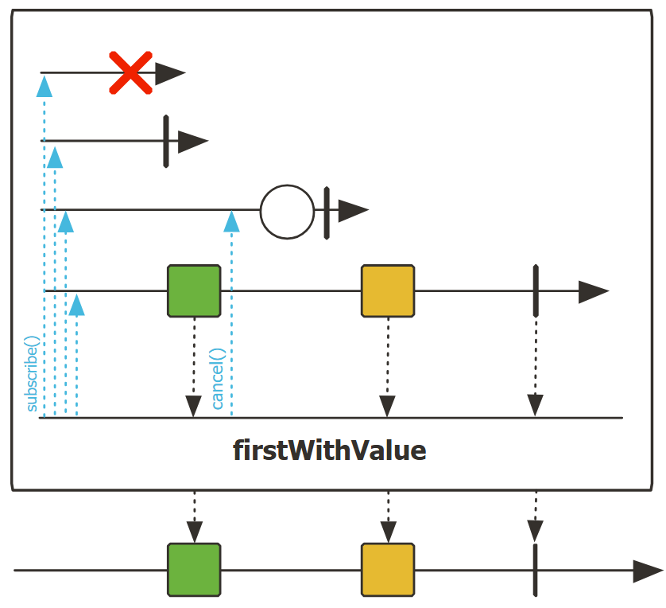

**示例**：getStocksGrpc 和 getStocksRest 检索当前股票价格，由于目标是最佳响应时间，因此调用这两个服务，但仅使用最先响应的服务地结果

```java
Flux<String> getStocksGrpc = Flux.range(1, 5)
        .map(i -> i + "$")
        .doOnNext(n -> System.out.println("(GRPC) Got stock, price: " + n))
        .delaySubscription(Duration.ofMillis(30));
Flux<String> getStocksRest = Flux.range(10, 6)
        .map(i -> i + "$")
        .doOnNext(n -> System.out.println("(REST) Got stock, price: " + n))
        .delaySubscription(Duration.ofMillis(100));

Flux<String> stonks = Flux.firstWithValue(getStocksGrpc, getStocksRest);

StepVerifier.create(stonks)
        .expectNextCount(5)
        .verifyComplete();
```

```
(GRPC) Got stock, price: 1$
(GRPC) Got stock, price: 2$
(GRPC) Got stock, price: 3$
(GRPC) Got stock, price: 4$
(GRPC) Got stock, price: 5$
```


### mergeWith

- **Mono**


- **Flux**

```java
public final Flux<T> mergeWith(Publisher<T> other);
```

⭐将当前 `Flux` 与另一个 `Publisher` 序列合并（允许交错）。

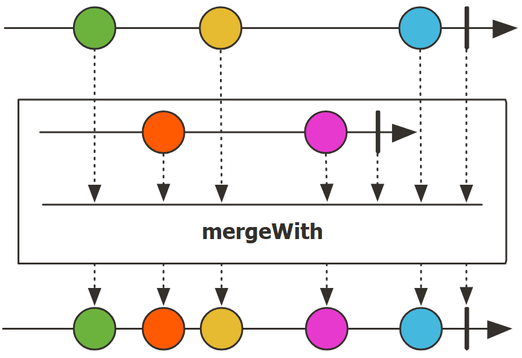

**示例**：将 `flux1` 和 `flux2` 合并，值交错

```java
flux1.mergeWith(flux2);
```


### Flux.zip

```java
public static <T1,T2,T3> Flux<Tuple3<T1,T2,T3>> zip(Publisher<T1> source1,
                                                    Publisher<T2> source2,
                                                    Publisher<T3> source3)
```

⭐将三个 source 合并在一起，即等待所有 source 生成一个元素，然后合并这些元素为一个 `Tuple3`。持续该操作，直到其中一个 source 完成。

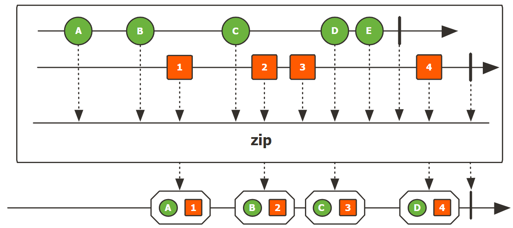

**示例**：使用三个 `Flux<String>` 创建用户：`zip` 得到一个 `Tuple3`，然后用 `Tuple3` 创建 `User`：

```java
Flux.zip(usernameFlux, firstnameFlux, lastnameFlux)
        .map(tuple -> new User(tuple.getT1(), tuple.getT2(), tuple.getT3()));
```


### ignoreElements

```java
public final Mono<T> ignoreElements()
```

忽略 `onNext()` 信号，仅传播终止事件。

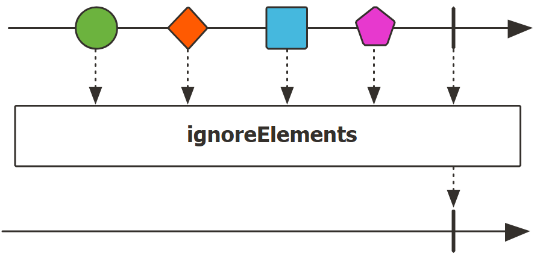

### then

```java
public final Mono<java.lang.Void> then()
```

返回一个当 `Flux` 完成，同时完成的 `Mono`。该操作忽略序列，仅响应完成或错误信号。

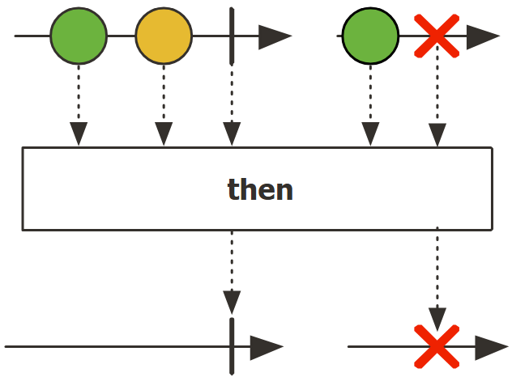