# Reactor

2025-03-21 modify: operators 太多, 放到单独的文件
2025-03-20 add: Reactive Streams 规范，100+ 示例 ⭐
2025-03-19 add: Scheduler, 编程创建序列 ⭐
2025-03-18 add: Reactor 核心功能 ⭐
2025-03-12 add: Reactive 编程简介
@author Jiawei Mao

***

## 1. 简介

响应式编程（reactive programming）通过声明式语法构建异步处理 pipeline，采用基于事件的模型将数据推送到 consumer，围绕**异步**和**非阻塞**建立，比 JDK 基于 callback 的 API 和 `Future` 更强大。响应式编程的核心就是非阻塞和异步。

Reactor 是 JVM 非阻塞 reactive 编程基础，具有高效的需求管理。它直接与 Java 8 函数式 API 集成，尤其是 `CompletableFuture`, `Stream` 和 `Duration`。它提供了可组合的异步序列 API：`Flux` (用于  N 个元素)和 `Mono` (用于 0 或 1 个元素)，以广泛实现 [Reactive Streams](https://www.reactive-streams.org/) 规范。

Reactive Streams 规范是行业驱动的结果，旨在标准化 JVM 的响应式编程库。已有库包括 Reactor 3、RxJava、Akka Streams、Vert.x 和 Ratpack。

Reactor 还通过 reactor-netty 项目支持进程间的非阻塞通讯。reactor-netty 适合微服务架构，为 HTTP、TCP 和 UDP 提供 backpressure-ready 网络引擎。

**基本要求**：Reactor 需要 Java 8+。

> [!TIP]
>
> **反压（backpressure）**
>
> 数据流从上游生产者到下游消费者传输过程中，上游生产速度大于下游消费速度，导致下游的 buffer 溢出，这种现象称为出现了 backpressure。
>
> 反压功能的实现指下游消费者能够告诉生产者需要多少数据以防止反压的形成。

异步：完成了会通知你，你不用在这儿等着。

### BOM 和版本

Reactor 3 使用 BOM（Bill of Materials）模型（since reactor-core 3.0.4）。

artifacts 采用版本方案为 `AJOR.MINOR.PATCH-QUALIFIER`，而 BOM 采用 `YYYY.MINOR.PATCH-QUALIFIER`，其中：

- `MAJOR` 为主版本，不同主版本之间有重大变化，可能需要进行迁移；
- `YYYY` 指发行周期的第一个 GA 发行的年份
- `.MINOR` 是从 0 开始的数字，每次增加表示一个新的发行周期：
  - 对项目而言，表示很多变化，有少量的迁移工作
  - 对 BOM 而言，如果有两个 BOM 在同一年首次发布，它用于辨别不同的发布周期
- `.PATCH` 是从 0 开始的数字，用于表示服务周期
- `-QUALIFIER` 是文本识别符，在 GA 版本中忽略

因此，按照该约定第一个发行周期是 `2020.0.x`，名称 `Europium`。采用如下识别符：

- `-M1`..`-M9`：里程碑，一个服务周期不超过 9
- `-RC1`..`-RC9`：发布候选版本，每个服务周期不超过 9
- `-SNAPSHOT`：快照

> [!NOTE]
>
> 快照（snapshot）在上面顺序最高，因为它们通常是每个 `PATCH` 最先预发行版本。

### 安装 Reactor

使用 reactor 的最简单方式是使用 BOM，并将相关依赖项添加到项目中。

- Maven

首先在 pom.xml 中导入 BOM

```xml
<dependencyManagement>
    <dependencies>
        <dependency>
            <groupId>io.projectreactor</groupId>
            <artifactId>reactor-bom</artifactId>
            <version>2024.0.3</version>
            <type>pom</type>
            <scope>import</scope>
        </dependency>
    </dependencies>
</dependencyManagement>
```

然后根据需要添加依赖项，只是不需要指定 `<version>`：

```xml
<dependencies>
    <dependency>
        <groupId>io.projectreactor</groupId>
        <artifactId>reactor-core</artifactId>

    </dependency>
    <dependency>
        <groupId>io.projectreactor</groupId>
        <artifactId>reactor-test</artifactId>
        <scope>test</scope>
    </dependency>
</dependencies>
```

## 2. Reactive Streams 规范

问题：多个具有依赖关系的并发执行路径，还需要共享数据。同步是最基本的问题，解决同步有许多方案，publish-subscibe 模式追求的是 1:N 关系。

该模式有两个对象：一个 **publisher**，负责生产数据；许多 **subscriber**，负责消费数据

- subscriber 可以订阅 publisher，表示对其数据感兴趣
- publisher 在准备好数据时，可以通知所有 subscribers

与其它同步机制相比，这种模式无需等待，并基于推送（push）机制进行交流。subscriber 不需要刻意等待数据到达，只需提前定义好数据到达时要执行的操作。反之亦然，publisher 也不用考虑 subsciber 是否准备好接收数据，直接推送给他即可。


Reactive Streams 规范定义了一组标准接口：

- `Processor`
- `Publisher`
- `Subscriber`
- `Subscription`

它们之间的关系如下：

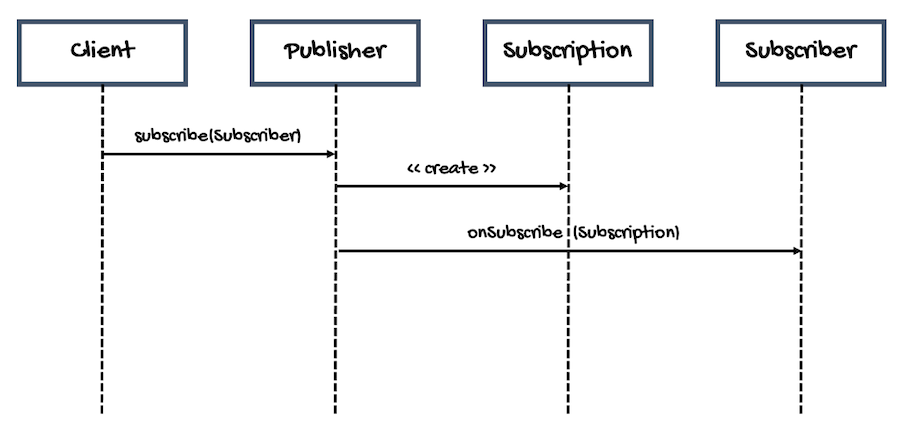

`Publisher` 为生产者，根据从 `Subscriber`(s) 收到的需求生成元素序列（可能无限）。

`Publisher` 接口定义如下：

```java
public interface Publisher<T> {
    public void subscribe(Subscriber<? super T> s);
}
```

`subscribe()` 方法要求 `Publisher` 开始将数据推送到指定 `SubScriber`。该方法可以调用多次，从而将数据推送到多个 `Subscribe` 实例。

`Subscriber` 接口定义如下：

```java
public interface Subscriber<T> {
    public void onSubscribe(Subscription s);
    public void onNext(T t);
    public void onError(Throwable t);
    public void onComplete();
}
```

首先，`Publisher` 对象创建 `Subscription` 对象，将其传递给 `Subscriber` 的 `onSubscribe` 方法，以便 `Subscriber` 能够执行初始化操作。

当 `Publisher` 序列的某个元素可用（`T` 类型），`Publisher` 调用 `onNext(T t)` 将其发送给 `Scriber`。循环执行该操作，直到：

- `Subscriber` 请求的所有元素已发送完毕。接着，`Publisher` 调用 `onComplete()` 方法
- 发生错误。此时，`Publisher` 调用 `onError(Throwable t)`，传递表示错误的异常

`Subsciber` 通过 `Subscription` 对象来控制对 `Publisher` 的订阅。`Subscription` 接口定义如下：

```java
public interface Subscription {
    public void request(long n);
    public void cancel();
}
```

`Subscriber` 通过 `Subscription` 对象可以控制 request 元素的数量，也可以取消订阅。

> [!NOTE]
>
> 每对 `Publisher` 和 `Subscriber` 对应一个 `Subscription`，`Subscription` 不会在 `Subscriber` 之间共享。 

最后是 `Processor` 接口的定义：

```java
public interface Processor<T, R> extends Subscriber<T>, Publisher<R> {}
```

可以发现，`Processor` 合并了 `Subscriber` 和 `Publisher` 的功能。

`Reactor` 提供了两个 `Publisher` 接口的实现：

- `Mono`
- `Flux`

Reactor 还提供了 operator 的概念：

- operator 用于处理数据
- 将多个 operator 串联实现对数据复杂分析
- operator 返回中间 `Publisher`，中间 `Publisher` 可以看作上游 `Publisher` 的 `Subscriber`，下游的 `Publisher`
- 处理好的数据发送给最后的 `Subscriber` 

### Publisher

#### 生命周期

Reactor 中有两个 publisher 实现：`Flux` 和 `Mono`。从数据源创建 publisher 后，可以添加 operator-chain 处理数据，最后传递给 subscriber。因此，publisher 的生命周期有三个阶段：

- 组装
- 订阅
- 执行

在组装阶段，创建 publisher 并定义 operator-chain。然后 subscriber 订阅 publisher，接着执行。

**`subscribe()` 之前无计算**

在 `subscribe()` 之前只是定义数据分析流程，没有执行任何实际操作。最后调用 `subscribe()` 或 `block()` 进行订阅，执行才开始。执行结束时，`subscriber` 接收结果。

#### 后台

publisher 为 immutable。当使用 operator 时，创建并返回新的 immutable publisher。operator-publisher 组合订阅原始 publisher。因此，当在 `Mono` 上定义一系列 operators 时，对每个 operator，创建一个新的 publisher，该 publisher 订阅上一个 publisher，并 publish 到下一个 publisher。

例如，每个 operator 调用后都注释了返回类型：

```java
Mono.just("text") // MonoJust.class
    .map(String::length) // MonoMap.class
    .filter(this::isOdd) //MonoFilter.class
    .subscribe(log::info); //LambdaMonoSubscriber.class
```

注意：订阅时执行仅适用于显式订阅，不适用于内部订阅。因此仅在调用 `subscribe()` 或 `block()` 才执行。

#### hot/cold publisher

有两种 publisher 类型，可以简单描述为：

- hot：已经准备好数据，如 `Mono.just("data")`
- cold：没有准备好数据，需要 request，如 http 客户端请求

**hot publisher**

hot-publisher 是 `subscribe` 前没有任何发生规则的唯一例外，因为数据已经准备好。

**code publisher**

code-publisher 与 Reactor 声明周期描述的那样，订阅后出发执行，数据准备就绪时 push 到 subscriber。

需要注意的是，code-publisher 会为每个 subscriber 启动该过程。因此，如果两个 subscriber 连接到一个 `Mono`执行 http 请求，会得到 2 个 http 请求，即 1:1 关系。也可以使用 `share` 或 `publish` operator 将其转换为 1:n 关系，将数据传送到所有 subscriber，无需出发单独的调用。如果某个 subscriber 来晚了，在数据发送后才 subscribe，则会触发对 source 的调用。

有许多操作可以将 code-publisher 转换为 hot-publisher，如 `cache()`。

### push vs pull

Java 8 Stream 基于 pull (拉式)，Reactive Streams 基于 push (推式)，什么是 pull？什么是 push？

对 Java 8 Stream，数据已经准备好，处理流程从 Stream 拉取数据进行分析：

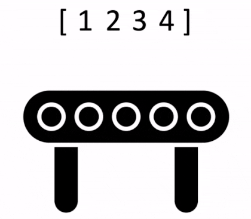

Reactive Stream 则随时间推动生成数据或时间序列：

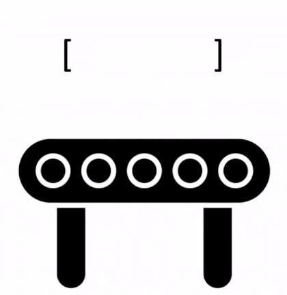

数据一开始可能没准备好，因此不能直接从 source 提取数据。在某些情况，我们无法直到数据或事件何时达到，等上游将数据推过来。

基于 push 的流程不适合阻塞调用，一直阻塞等待你不知道什么时候到的元素显然不合适。

## 3. Reactive 编程简介

Reactor 实现 reactive 编程范式，可以概括为：

> [!NOTE]
>
> reactive 编程是与数据流和变化传播相关的异步编程范式。使用它可以轻松地表达静态或动态数据流。
>
> https://en.wikipedia.org/wiki/Reactive_programming

微软首先在 .NET 中创建了 reactive 扩展库（Rx）。然后 RxJava 在 JVM 中实现 reactive 编程。随着时间推移，Reactive Streams 定义了 JVM 上 reactive 库的一组接口和交互规范。其接口已经集成到 Java 9 的 `Flow` 类。

reactive 编程范式在面向对象语言中通常以 Observer 设计模式实现。可以将 reactive 流模式与迭代器设计模式进行比较，一个主要区别是：迭代器基于 pull，reactive 流基于 push。

迭代器是基于命令的编程模式，由开发人员选择何时访问序列的下一个元素。在 reactive-stream 中，对应 `Publisher`-`Subscriber`。`Publisher` 通知 `Subscriber` 有新元素，这是 reactive 的关键。同样，应用于 push 值的操作也是声明式的，而不是命令式：程序员描述计算的逻辑，而不是描述确切的控制流。

`Publisher` 通过调用 `onNext` 向 `Subscriber` 推送新的值，也可以调用 `onErro` 发送错误，或调用 `onComplete` 表示已完成。错误和完成都终止序列。可以总结为：

```
onNext x 0..N [onError | onComplete]
```

这种方法非常灵活。该模式支持没有值、1 个值或 n 个值。

但是，为什么需要这种异步 reactive 库？

### 阻塞是一种浪费

从广义上讲，改善程序性能的方法有两种：

- 并行（parallelize）：使用更多线程和硬件资源
- 效率（efficiency）：在当前资源的使用上寻求更大的效率

Java 开发人员通常使用阻塞代码编程。这种实践很好，直到有性能瓶颈。然后就需要引入其它线程，运行类似的阻塞代码。这种方式很容易引入数据争用等并发问题。

更重要的是，阻塞会浪费资源。一旦程序涉及延时操作，特别是 I/O、数据库请求或网络调用，就会浪费资源，因为线程会闲置下来等待数据。

因此，并行不是万能药，有必要获得硬件的全部能力。

### 异步

编写异步代码，而非阻塞代码，可以让程序切换到另一个使用相同基础资源的任务，然后在异步处理完成后返回当前任务。

但是，在 JVM 上如何编写异步代码？Java 提供了两种异步编程模式：

- **Callbacks**: 异步方法没有返回值，而是在结果可用时采用额外的 `callback` 参数。如 Swing 的 `EventListener`
- `Future`：异步方法直接返回 `Future<T>`。异步过程计算 `T` 值，`Future` 对象包含对其访问。该值无法立即可用，可以进行轮询直到可用为止。例如，`ExecutorService` 使用 `Future` 对象运行 `Callable<T>` 任务。

两种方法各有局限性。

Callbacks 很难聚合，很容易导致难以阅读和维护的代码，称为 "callback hell"。

例如：在 UI 显示用户的 top-5 favorites，如果没有则显示建议。这涉及 3 个服务：一个给出 favorite IDs, 一个获取 favorite 详细信息，一个提供建议的详细信息。如下：

```java
userService.getFavorites(userId, new Callback<List<String>>() { // ①
  public void onSuccess(List<String> list) { // ②
    if (list.isEmpty()) { // ③
      suggestionService.getSuggestions(new Callback<List<Favorite>>() {
        public void onSuccess(List<Favorite> list) { // ④
          UiUtils.submitOnUiThread(() -> { // ⑤
            list.stream()
                .limit(5)
                .forEach(uiList::show); // ⑥
            });
        }

        public void onError(Throwable error) { // ⑦
          UiUtils.errorPopup(error);
        }
      });
    } else {
      list.stream() // ⑧
          .limit(5)
          .forEach(favId -> favoriteService.getDetails(favId, // ⑨
            new Callback<Favorite>() {
              public void onSuccess(Favorite details) {
                UiUtils.submitOnUiThread(() -> uiList.show(details));
              }

              public void onError(Throwable error) {
                UiUtils.errorPopup(error);
              }
            }
          ));
    }
  }

  public void onError(Throwable error) {
    UiUtils.errorPopup(error);
  }
});
```

1. 使用基于 callback 对的服务：`Callback` 接口，当异步过程成功时调用 `onSuccess`，失败时调用 `onError`
2. 第一个服务使用 favorite ID list 调用其 callback
3. 如果 list 为空，转到 `suggestionService`
4. `suggestionService` 将 `List<Favorite>` 发给第一个 callback
5. 由于是处理 UI，所以要确保在 UI 线程上运行
6. 使用 Java 8 `Stream` 将 suggestions 限制到 5，并在 UI 上显示
7. 弹窗显示错误信息
8. 回到 favorite ID，如果服务返回完整 list，需要转到 `favoriteService` 获取详细的 `Favorite` 对象。只需要 5 个。
9. 再次 callback。这次获得了 5 个 `Favorite` 对象，并在 UI 线程显示。

这么多代码，并且具有重复性的内容。下面是等价的 reactor 实现：

```java
userService.getFavorites(userId) // ①
           .flatMap(favoriteService::getDetails) // ②
           .switchIfEmpty(suggestionService.getSuggestions()) // ③
           .take(5) // ④
           .publishOn(UiUtils.uiThreadScheduler()) // ⑤
           .subscribe(uiList::show, UiUtils::errorPopup); // ⑥
```

1. 从 favorite ID flow 开始
2. 异步将它们转换为 `Favorite` 对象 (`flatMap`)，得到 `Favorite` flow
3. 如果 `Favorite` flow 是空的，则通过 `suggestionService` 切换
4. 获取最多 5 个结果
5. 再 UI 线程依次处理数据
6. 描述数据的最终处理方式，成功则在 UI 列表显示，错误则弹窗显示

如果要确保检索 favorite ID 的时间少于 800 ms，或者（如果需要更长时间）从缓存中获取？在基于 callback 的代码中，这是一个复杂的任务。在 Reactor 中通过 `timeout` 操作符很容易实现：

```java
userService.getFavorites(userId)
           .timeout(Duration.ofMillis(800)) // ①
           .onErrorResume(cacheService.cachedFavoritesFor(userId)) // ②
           .flatMap(favoriteService::getDetails) // ③
           .switchIfEmpty(suggestionService.getSuggestions())
           .take(5)
           .publishOn(UiUtils.uiThreadScheduler())
           .subscribe(uiList::show, UiUtils::errorPopup);
```

1. 如果检索时间超过 800 ms，发出错误
2. 对错误，转到 `cacheService`
3. 余下和上例类似

`Future` 对象比 callback 好点，但是即使有 java 8 引入的 `CompletableFuture`，在组合方面依然表现不佳。将多个 `Future` 对象组合起来是可行的，但是并不容易。另外，`Future` 还有其他问题：

- 调用 `get()` 方法，很容易碰到另一种阻塞情况
- 不支持 lazy 计算
- 不支持多个值和高级错误处理

再举个例子：获得一个 ID list，希望获取名称和统计数据，并配对组合在一起，所有这些异步。下面使用 `CompletableFuture` 实现：

```java
CompletableFuture<List<String>> ids = ifhIds(); // ①

CompletableFuture<List<String>> result = ids.thenComposeAsync(l -> { // ②
	Stream<CompletableFuture<String>> zip =
			l.stream().map(i -> { // ③
				CompletableFuture<String> nameTask = ifhName(i); // ④
				CompletableFuture<Integer> statTask = ifhStat(i); // ⑤

				return nameTask.thenCombineAsync(statTask, (name, stat) -> "Name " + name + " has stats " + stat); // ⑥
			});
	List<CompletableFuture<String>> combinationList = zip.collect(Collectors.toList());// ⑦
	CompletableFuture<String>[] combinationArray = combinationList.toArray(new CompletableFuture[combinationList.size()]);

	CompletableFuture<Void> allDone = CompletableFuture.allOf(combinationArray); // ⑧
	return allDone.thenApply(v -> combinationList.stream()
			.map(CompletableFuture::join) // ⑨
			.collect(Collectors.toList()));
});

List<String> results = result.join(); // ⑩
assertThat(results).contains(
		"Name NameJoe has stats 103",
		"Name NameBart has stats 104",
		"Name NameHenry has stats 105",
		"Name NameNicole has stats 106",
		"Name NameABSLAJNFOAJNFOANFANSF has stats 121");
```

1. 从输出 id-list 的 `Future` 开始
2. 得到 list 后，进行更深入的异步处理
3. 对 list 的每个元素
4. 异步获取关联名称
5. 异步获取统计量
6. 合并两个结果
7. 此时已有代表所有组合任务的 `Future` list，为了执行这些任务，将 list 转换为数组
8. 将数组传递给 `CompletableFuture.allOf`，当所有任务完成，它输出一个完成的 `Future`
9. 比较棘手的是 `allOf` 返回 `CompletableFuture<Void>`，所以这里重新迭代 future-list，使用 `join()`收集结果（这里不会阻塞，因为 `allOf` 确保所有 future 完成）
10. 当所有异步 pipeline 被触发，等待它被处理比国内返回，就可以断言结果。

由于 Reactor 包含许多开箱即用的组合操作符，所以可以简化该过程：

```java
Flux<String> ids = ifhrIds(); // ①

Flux<String> combinations =
		ids.flatMap(id -> { // ②
			Mono<String> nameTask = ifhrName(id); // ③
			Mono<Integer> statTask = ifhrStat(id); // ④

			return nameTask.zipWith(statTask, // ⑤
					(name, stat) -> "Name " + name + " has stats " + stat);
		});

Mono<List<String>> result = combinations.collectList(); // ⑥

List<String> results = result.block();// ⑦
assertThat(results).containsExactly( // ⑧
		"Name NameJoe has stats 103",
		"Name NameBart has stats 104",
		"Name NameHenry has stats 105",
		"Name NameNicole has stats 106",
		"Name NameABSLAJNFOAJNFOANFANSF has stats 121"
);
```

1. 这次，从异步提供的 id 序列 `Flux<String>` 开始
2. 对序列的每个元素异步处理两次（`flatMap` 内部）
3. 获取关联名称
4. 获取关联统计量
5. 异步组合这两个值
6. 当值可用时，将其聚合到 list 中
7. 在生产中，可以继续异步使用 `Flux`，进一步组合或订阅。最有可能的是返回 `Mono` 结果。由于这里处于测试阶段，因此改为阻塞，等待处理完成，直接返回聚合的结果。
8. 断言结果

使用 callback 和 `Future` 的风险是类似的，使用 `Publisher-Subscriber` 的 reactive 编程就是为了解决该问题。

### 从命令式编程到响应式编程

reactive 库（如 Reactor）旨在解决 JVM 中经典异步方法的缺点，同时还关注其它方面：

- 可组合性和可读性
- 数据作为流处理，由丰富的运算符进行操作
- 在订阅前什么都不会发生
- 反压或消费者向生产者发出信号表示生产过快的能力
- 高级但高价值的抽象，与并发无关

#### 可组合性和可读性

可组合性（composability）指能够排列多个异步任务，使前面的任务作为后续任务的输入。或者，可以使用 fork-join 的方式运行多个任务。此外，可以在高级系统中将异步任务作为离散组件重用。

排列任务的能力与代码的可读性和可维护性紧密相关。随着异步进程层数和复杂性的增加，编写和阅读代码变得越来越困难。callback 模型很简单，它的主要缺点是，对复杂的任务，需要从 callback 中调用 callback，而 callback 本身又嵌套在另一个 callback 中，依此类推，这种混乱称为 callback-hell。这样的代码很难回溯和推理。

Reactor 提供了丰富的组合选项，代码反映了抽象过程的排列，并且所有内容通常保持在同一级别（嵌套最小化）。

#### 类比装配线

可以将 reactive 处理数据的过程类比为装配线。原材料从原始 `Publisher` 触发，最终成为成品推动给消费者 `Subscriber`。

原材料可以经过各种转化和其它中间步骤，也可能是为一个大型装配线组装中间零件。如果某一点出现故障或堵塞，受影响的工作者可以向上游发出信号以限制原材料的流动。

#### 操作符

在 Reactor 中，操作符就是装配线中的工作站。每个操作符都会向 `Publisher` 添加行为，并将上一步的 `Publisher` 包装到新的实例。整个 chain 就这样串联起来，数据从第一个 `Publisher` 出发，沿着chain 移动，并被每个 link 进行转换。最终，`Subscriber` 完成整个过程。需要注意，在 `Subscriber` 订阅之前不会执行任何操作。

虽然 Reactive Streams 规范没有指定操作符，但 Reactor 等 reactive 库最大的价值之一就是提供了丰富的操作符。这些操作符覆盖很多方面，从简单的转换到过滤到复杂的排列和错误处理等。

#### subscribe 前不执行

在 Reactor 中，在编写 `Publisher` chain 时，默认一开始不会注入数据。通过订阅操作，将 `Publisher` 和 `Subscriber` 绑定，从而触发整个 chain 的数据流。这是 `Subscriber` 内部发出的 `request` 信号实现，该信号向上传播，直到最初的 `Publisher`。

#### Backpressure

向上传播信号也用于实现反压。

Reactive Streams 规范定义的机制与此机制非常接近：订阅者可以在无界模式下工作，让 source 以最快的速度推送所有数据；或者使用 request 机制向 source 发出信号，表示它只能处理最多 n 个元素。

中间操作符也可以在传输过程中更改请求。例如一个缓冲区操作符将元素分为 10 个一组，如果订阅者请求一个缓冲区，则 source 可以生成 10 个元素。有些操作符还实现了预取策略，从而避免 `request(1)` 往返，如果在请求之前生成元素的成本不高，`request(1)` 是有益的。

这将 push 模型转变为 push-pull 混合模型，下游可以从上游拉取 n 个 元素。但如果这些元素还未准备好，上游会在每次生产时 push  元素。

#### Hot vs Cold

Rx 系列 reactive 库将 reactive 序列分为两类：hot 和 cold。主要区别在于 reactive 流如何响应订阅者：

- **Cold**: cold 序列为每个 `Subscriber` 重新开始，包含数据源。例如，如果 source 包装一个 HTTP 调用，则每个订阅都回发出新的 HTTP 请求。
- **Hot**: hot 序列不会为每个 `Subscriber` 从头开始。后期订阅者会订阅后会收到之前发出的信号。注意，有些 hot reactive stream 可以全部或部分缓存/重新发射。从一般角度看，hot 序列甚至可以在没有订阅者时发出信号。

## 4. Reactor 核心功能

Reactor 项目的主要 artifact 为 reactor-core，这是一个实现 Reactive Streams 规范基于 Java 8 实现的 reactive 库。

Reactor 引入了可组合的 reactive 类型，这些类型实现 `Publisher`，同时提供了丰富的操作符，`Flux` 和 `Mono`：

- `Flux` 对象表示 0 到 N 个元素的 reactive 序列
- `Mono` 对象表示 0 或 1 个元素

这种区别带入一些语义信息，指示异步处理的大致基数。例如，一个 HTTP 请求仅生成一个响应，因此执行 `count` 操作没有意义。因此，将此类 HTTP 调用的结果表示为 `Mono<HttpResponse>` 比表示为 `Flux<HttpResponse>` 更有意义，`Mono` 仅提供与 0 或1 项元素相关的操作符。

更改基数的操作符会切换到相应类型。例如，如果 `Flux` 中存在 `count` 运算符，它会返回 `Mono<Long>`。

### Flux 

下图展示 `Flux` 如何转换元素：

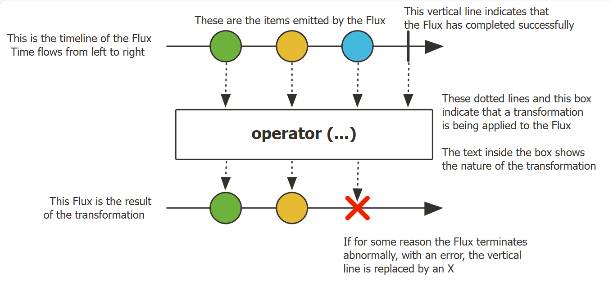

`Flux<T>` 是标准的 `Publisher<T>` 实现，表示一个异步序列，可以生成 0 到 N 个元素，然后完成（成功或失败）。与 Reactive Streams 规范一样，这三种类型的信号会转换为对下游订阅者的 `onNext`, `onComplete` 和 `onError` 方法的调用。

`Flux` 的信号范围很大，是一种通用的 reactive 类型。所有事件（包括终止事件）都是可选的：

- 没有 `onNext` 但有 `onComplete` 事件代表一个空序列，删除 `onComplete` 则得到一个无限空序列（除了测试取消操作，没有其它 用处）
- `Flux.interval(Duration)` 生成一个无限的 `Flux<Long>`，从时钟发出规则的 ticks

API 说明：

- 采用 `Flux` 的 factory 从 sources 创建 `Flux`，或者从几种 callback 类型生成 `Flux`
- `Flux` 的实例方法，即 operators，可用来构建异步处理 pipeline，以生成异步序列
- 每个`Flux#subscribe()` 或多播操作，如 `Flux#publish` 和 `Flux#publishNext`， 会将 pipeline 具体化（materialize），触发数据流

#### 创建 Flux

> [!TIP]
>
> 如果想知道 `Flux` 或 `Mono` 内部情况，可以在返回前调用 `.log()` 输出日志信息。

- 创建空的 `Flux`

空 `Flux`，不生成任何元素，直接完成：

```java
public static <T> Flux<T> empty()
```

- 使用已有数据创建 `Flux`

生成提供的数据后，`Flux` 完成：

```java
public static <T> Flux<T> just(T... data);
public static <T> Flux<T> just(T data);
```

示例：

```java
Flux.just("foo", "bar");
```

- 使用集合创建 `Flux`

```java
public static <T> Flux<T> fromIterable(java.lang.Iterable<? extends T> it);
```

示例：

```java
Flux<String> flux = Flux.fromIterable(Arrays.asList("foo", "bar"));
```

- 异常处理

`Flux#error` 升成一个 `Flux`，该 `Flux` 只升成 `onError` 信号，并立即终止。

```java
public static <T> Flux<T> error(java.lang.Throwable error);
public static <T> Flux<T> error(java.util.function.Supplier<? extends 	
                                java.lang.Throwable> errorSupplier);
public static <O> Flux<O> error(java.lang.Throwable throwable,
                                boolean whenRequested)
```

例如：

```java
Flux<String> flux = Flux.error(new IllegalStateException());
```

### Mono

下图展示 `Mono` 如何转换一个元素：

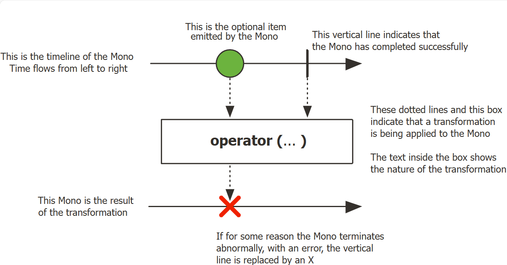

`Mono<T>` 是一个 `Publisher<T>` 实现，它通过 `onNext` 最多生成一个元素，然后以 `onComplete` 信号终止（成功的 `Mono`），失败则仅发射一个 `onError` 信号。

大多数 `Mono` 实现在调用 `onNext` 后立即在 `Subscriber` 上调用 `onComplete`。`Mono.never()` 例外：它不发出任何信号，这在技术上是可行的，不过仅在测试中有用。另外，`onNext` 和 `onError` 的组合是明确禁止的。

`Mono` 仅提供 `Flux` 的部分操作符，并且某些操作符，尤其是将 `Mono` 与另一个 `Publisher` 组合起来的操作符会切换到 `Flux`。例如，`Mono#concatWith(Publisher)` 返回 `Flux`，而 `Mono#then(Mono)` 返回另一个 `Mono`。

对无返回值，类似 `Runnable` 的任务，可以用 `Mono<Void>` 表示。

#### 创建 Mono

- 创建空的  `Mono`

```java
public static <T> Mono<T> empty();
```

例如：

```java
Mono<String> mono = Mono.empty();
```

- 不发出任何信号

`Mono.empty()` 好歹会发出 `onCommplete` 信号，`never()` 不发出任何信号。本质上无限期运行。

```java
public static <T> Mono<T> never();
```

例如：

```java
Mono<String> mono = Mono.never();
```

- 生成一个值

```java
public static <T> Mono<T> just(T data);
```

例如：

```java
Mono<String> mono = Mono.just("foo");
```

- 发出异常信号

在订阅后立即因指定错误而终止。

```java
public static <T> Mono<T> error(java.lang.Throwable error);
public static <T> Mono<T> error(java.util.function.Supplier<? extends 
                                java.lang.Throwable> errorSupplier);
```

### 创建 Flux 或 Mono 并订阅

使用 `Flux` 和 `Mono` 的最简单方法是使用它们各自的**工厂方法**。

例如，创建一个 `String` 序列，可以枚举它们，或者将它们放在一个集合中并创建 `Flux`：

```java
Flux<String> seq1 = Flux.just("foo", "bar", "foobar"); // 直接枚举

List<String> iterable = Arrays.asList("foo", "bar", "foobar");
Flux<String> seq2 = Flux.fromIterable(iterable);// 通过集合
```

其它工厂方法：

```java
Mono<String> noData = Mono.empty(); // ①

Mono<String> data = Mono.just("foo");

Flux<Integer> numbersFromFiveToSeven = Flux.range(5, 3); // ②
```

1. 工厂方法也支持泛型
2. 第一个参数为范围开始，第二个参数是要生成的元素个数

在订阅方面，`Flux` 和 `Mono` 使用 Java 8 lambda。`.subscribe()` 有许多版本，通过 lambda 来实现不同的 callback 组合，如下所示：

```java
subscribe(); // ➊

subscribe(Consumer<? super T> consumer); // ➋

subscribe(Consumer<? super T> consumer,
          Consumer<? super Throwable> errorConsumer); // ➌

subscribe(Consumer<? super T> consumer,
          Consumer<? super Throwable> errorConsumer,
          Runnable completeConsumer); // ➍

subscribe(Consumer<? super T> consumer,
          Consumer<? super Throwable> errorConsumer,
          Runnable completeConsumer,
          Consumer<? super Subscription> subscriptionConsumer); // ➎
```

1. 订阅并触发序列
2. 对生成的每个值执行某些操作
3. 处理值，同时处理错误
4. 处理值和错误，并在序列成功完成时运行一些代码
5. 处理值和错误以及成功完成时运行一些代码，同时对此订阅调用产生的订阅执行某些操作

> [!TIP]
>
> 这些不同版本均返回对订阅的引用，当不需要更多数据时，可以使用该引用取消订阅。取消后，source 应停止生成值并清理其创建的任何资源。这种取消和清理行为在 Reactor 由通用的 `Disposable` 接口表示。

示例：收集 emit 的每个元素，不处理错误，完成时将 `serviceCallCompleted` 设置为 true

```java
AtomicReference<Boolean> serviceCallCompleted = new AtomicReference<>(false);
CopyOnWriteArrayList<String> companyList = new CopyOnWriteArrayList<>();

fortuneTop5()
        .subscribe(companyList::add,e->{},()->serviceCallCompleted.set(true));

Thread.sleep(1000);

assertTrue(serviceCallCompleted.get());
assertEquals(Arrays.asList("Walmart", "Amazon", "Apple", 
                           "CVS Health", "UnitedHealth Group"), 
             companyList);
```

#### subscribe

```java
public final Disposable subscribe();
public final Disposable subscribe(Consumer<? super T> consumer);
public final Disposable subscribe(Consumer<? super T> consumer,
                                  Consumer<Throwable> errorConsumer);
public final Disposable subscribe(Consumer<? super T> consumer,
                                  Consumer<Throwable> errorConsumer,
                                  Runnable completeConsumer);
public final Disposable subscribe(Consumer<? super T> consumer,
                                  Consumer<Throwable> errorConsumer,
                                  Runnable completeConsumer,
                                  Context initialContext);
public final void subscribe(Subscriber<? super T> actual);
```

 下面介绍 5 个版本的 `subscribe` 的最简单示例。

- 以下为不带参数的示例：

```java
Flux<Integer> ints = Flux.range(1, 3); // ①
ints.subscribe(); // ②
```

1. 设置 `Flux`，当添加订阅者时，生成 3 个值
2. 最简单的订阅方式

上述代码产生以下输出：

```
1
2
3
```

- 为了演示下一个版本，我们故意引入一个错误：

```java
Flux<Integer> ints = Flux.range(1, 4) // ①
      .map(i -> { // ②
        if (i <= 3) return i; // ③
        throw new RuntimeException("Got to 4"); // ④
      });
ints.subscribe(i -> System.out.println(i), // ⑤
      error -> System.err.println("Error: " + error));
```

1. 设置 `Flux`，生成 4 个值
2. 通过 `map`，对不同值以不同方式处理
3. 对大多数值，返回该值
4. 对 4，则抛出错误
5. 使用包含错误处理程序的 subscriber 订阅

现在有 2 个 lambda 表达式：一个用于期望的输出，一个 用于错误。上述代码输出：

```
1
2
3
Error: java.lang.RuntimeException: Got to 4
```

- 下一个 `subscribe` 包含错误处理和完成事件处理

```java
Flux<Integer> ints = Flux.range(1, 4); // ①
ints.subscribe(i -> System.out.println(i),
    error -> System.err.println("Error " + error),
    () -> System.out.println("Done")); // ②
```

1. 设置 `Flux`，生成 4 个值
2. 使用包含完成事件处理程序的 `Subscriber` 进行订阅

错误信号和完成信号都是终止事件，并且彼此独立（不可能同时获得两者）。为了使事件完成 consumer 工作，必须注意不要触发错误。

完成 callback 没有输入，用一对空括号表示：与 `Runnable` 接口的 `run` 方法对应。上述代码的输出：

```
1
2
3
4
Done
```

#### 取消 subscribe

所有这些基于 lambda 的 `subscribe()` 方法都返回 `Disposable` 类型。`Disposable` 接口表示可以通过调用 `dispose()` 方法来取消订阅。

对 `Flux` 或 `Mono`，取消是让 source 停止生成元素的信号。但是，不能保证立即停止，某些 source 特别快，在收到取消指令之前就已经完成。

在 `Disposables` 类中有一些针对 `Disposable` 的辅助工具。其中，`Disposables.swap()` 创建一个 `Disposable` wrapper，可以 atomically 取消并替换为另一个 `Disposable`。例如，在 UI 中，当用户点击按钮，可以通过它取消 request 并替换为其它操作。

另外还有 `Disposables.composite(...)`。它可以收集多个 `Disposable`，例如，多个与一个 service-call 相关的 in-flight request，并随后全部取消。一旦调用 composite 的 `dispose()` 方法，后面添加的 `Disposable` 都会被立即取消。

#### lambda 的替代方案：BaseSubscriber

还有一种更通用的 `subscribe` 方法，需要更成熟的 `Subscriber`，而不是 lambda 的组合。为了辅助编写这种 `Subscriber`，Reactor 提供了可扩展类 `BaseSubscriber`。

> [!WARNING]
>
> `BaseSubscriber` 及其子类的实例是一次性的，因此，如果使用 `BaseSubscriber` 订阅第二个 `Publisher`，则会取消对第一个 `Publisher` 的订阅。这是因为使用相同实例两次会违反 Reactive Streams `onNext` 不能不行调用的规范。因此，匿名实现只有在 `Publisher#subscribe(Subscriber)`直接调用才行。

现在假设实现了一个 `BaseSubscriber`，称其为 `SampleSubscriber`。下面演示如何用它订阅 `Flux`：

```java
SampleSubscriber<Integer> ss = new SampleSubscriber<Integer>();
Flux<Integer> ints = Flux.range(1, 4);
ints.subscribe(ss);
```

下面为  `SampleSubscriber`，是 `BaseSubscriber` 的简单实现：

```java
import org.reactivestreams.Subscription;

import reactor.core.publisher.BaseSubscriber;

public class SampleSubscriber<T> extends BaseSubscriber<T> {

	@Override
	public void hookOnSubscribe(Subscription subscription) {
		System.out.println("Subscribed");
		request(1);
	}

	@Override
	public void hookOnNext(T value) {
		System.out.println(value);
		request(1);
	}
}
```

`BaseSubscriber` 是 Reactor 推荐的用户自定义 `Subscriber` 的抽象类，`SampleSubscriber` 扩展该类。该类提供了可以覆盖的 hooks 以调整 subscriber 的行为。它默认触发一个无限 request，与 `subscribe()` 行为相同。但是，当需要自定义 request，则扩展 `BaseSubscriber` 更合适。

扩展 `BaseSubscriber` 至少需要实现 `hookOnSubscribe(Subscription subscription)` 和 `hookOnNext(T value)`。在 `SampleSubscriber` 中，`hookOnSubscribe` 打印状态并提出第一个 request。`hookOnNext` 打印状态并提出另一个 request。

`SampleSubscriber` 输出如下：

```java
Subscribed
1
2
3
4
```

`BaseSubscriber` 还提供了 `requestUnbounded()` 方法，用于切换到无界模式（等价于 `request(Long.MAX_VALUE)`）；以及 `cancel()` 方法。

另外还有：`hookOnComplete`, `hookOnError`, `hookOnCancel`, `hookFinally`（序列终止时被调用）。

#### backpressure 以及 reshape request 的方法

在 Reactor 中实现反压时，consumer 压力通过发送 `request` 向上游操作符传播实现。当前 request 的加和被称为当前 demand。demand 上限为 `Long.MAX_VALUE`，表示无限 request (表示尽可能快地生产，基本等价于禁用反压)。

第一个 request 来自 final-subscriber，订阅全部内容的最直接方式是触发 `Long.MAX_VALUE` 无界 request：

- `subscribe()` 极其大多数 lambda 版本（包含 `Consumer<Subscription>` 的除外）
- `block()`, `blockFirst()` 和 `blockLast()`
- 迭代 `toIterable()` 或 `toStream()`

自定义原始 request 的最简单方式是实现 `BaseSubscriber` 并覆盖 `hookOnSubscribe`，如下所示：

```java
Flux.range(1, 10)
    .doOnRequest(r -> System.out.println("request of " + r))
    .subscribe(new BaseSubscriber<Integer>() {

      @Override
      public void hookOnSubscribe(Subscription subscription) {
        request(1);
      }

      @Override
      public void hookOnNext(Integer integer) {
        System.out.println("Cancelling after having received " + integer);
        cancel();
      }
    });
```

输出

```
request of 1
Cancelling after having received 1
```

> [!WARNING]
>
> 在操作 request 时，要谨慎提出需求，以避免 Flux 卡住。这是 `BaseSubscriber` 的 `hookOnSubscribe` 默认为无界 request 的原因。在覆盖该 hook 时，至少需要调用一次 `request`。

#### 从下游修改需求的操作符

在 subscribe 水平表达的需求可以被上游的操作符重塑。以 `buffer(N)` 操作符为例：如果它收到 `request(2)`，它将其理解为 2 个状态的 buffer 需求。由于 buffer 需要 N 个元素填满，因此 `buffer` 操作符将需求重塑为 `2xN` 。

另外，有些操作符包含一个 `int` 类型的参数 `prefetch`。这是修改下游去求的另一类操作符。它们通常用于处理内部需求，从每个传入元素生成 `Publisher`，如 `flatMap`。

`prefetch` 是调整内部序列初始需求的 一种方法，如果未指定，大多数操作符初始需求为 32。

这些操作符通常还实现了补充优化：当操作符发现其 75% 预取请求，它会从上游重新要求 75%。这是一种启发式优化。

另外还有操作符直接调整请求：`limitRate` 和 `limitRequest`。

`limitRate(N)` 将下游请求拆分为较小的 batch 传到上游。例如，一个 `100` 的请求传到 `limitRate(10)`，会得到 10 个 request`10`  传递到上游。这也是一种补充优化。

该操作符还有一个可以调整补充量得版本：`limitRate(highTide, lowTide)`。将 `lowTide` 设置为 `0` 会得到严格的 `highTide` 请求，而不是通过补充策略进行优化。

`limitRequest(N)` 限制下游的最大需求。如果单个 `request`不会使总需求超出 `N`，则将该去求向上游传播。当 source 发出对应数量，`limitRequest` 认为序列完成，发出 `onComplete` 信号到下游，并取消 source。

### 编程创建序列

下面以编程方式通用定义 `onNext`, `onError` 和 `onComplete` 等相关事件来创建 `Flux` 和 `Mono`。这些方法都通过 API 触发称为 sink 的事件。

#### 同步: generate

```java
public static <T,S> Flux<T> generate(Callable<S> stateSupplier,
                                     BiFunction<S,SynchronousSink<T>,S> generator,
                                     Consumer<? super S> stateConsumer)
```

⭐1. 以编程的方式创建 `Flux`：通过 callback 和 state 逐个生成信号，最后使用 `stateConsumer` 执行清理工作：

- `stateSupplier`：对每个 `Subscriber` 为 `BiFunction` 提供初始状态
- `generator`：根据当前状态生成信号，并返回新状态
- `stateConsumer`：当 `generator` 终止或下游取消时调用，接收要处理的最后状态，负责释放资源和清理工作

```java
public static <T,S> Flux<T> generate(Callable<S> stateSupplier,
                                     BiFunction<S,SynchronousSink<T>,S> generator)
```

⭐2. 同 1，只是没有负责清理的 `stateConsumer`。

```java
public static <T> Flux<T> generate(Consumer<SynchronousSink<T>> generator);
```

⭐同 1，只是没有初始状态和 `stateConsumer`。

**示例**：生成 0 到 5，然后 complete

```java
AtomicInteger counter = new AtomicInteger(0);
Flux<Integer> generateFlux = Flux.generate(sink -> {
    if (counter.get() > 5) sink.complete();
    sink.next(counter.getAndIncrement());
});

StepVerifier.create(generateFlux)
        .expectNext(0, 1, 2, 3, 4, 5)
        .verifyComplete();
```

以编程创建 `Flux` 的最简单方式是调用 `generate()` 通过 generator 函数生成 `Flux`。

该方法同步逐个 emit 元素，sink 类型为 `SynchronousSink`，每次 callback 最多调用一次 `next()`。也可以另外调用 `error()` 或 `complete()`，这是可选的。

第一个包含 state 的版本可能最有用，在 sink 时引用 state 以决定接下来 emit 的元素。生成器函数为 `BiFunction<S, SynchronousSink<T>, S>`，其中 `<S>` 为 state 对象的类型。必须提供一个 `Supplier<S>` 作为初始 state，然后生成器函数在每一轮返回一个新的 state。

**示例**：使用 `int` 作为 state：

```java
Flux<String> flux = Flux.generate(
    () -> 0, // ①
    (state, sink) -> {
      sink.next("3 x " + state + " = " + 3*state); // ②
      if (state == 10) sink.complete(); // ③
      return state + 1; // ④
    });
```

1. 初始 state 值为 0
2. 根据 state 选择 emit 内容（乘法表中  3x 的一行）
3. 根据 state 确定 stop 条件
4. 返回一个新的 state，在下一次调用中使用

输出：

```
3 x 0 = 0
3 x 1 = 3
3 x 2 = 6
3 x 3 = 9
3 x 4 = 12
3 x 5 = 15
3 x 6 = 18
3 x 7 = 21
3 x 8 = 24
3 x 9 = 27
3 x 10 = 30
```

state 对象类型也可以是 mutable。

**示例**：使用 `AtomicLong` 作为 state 重写上述示例

```java
Flux<String> flux = Flux.generate(
    AtomicLong::new, // ①
    (state, sink) -> {
      long i = state.getAndIncrement(); // ②
      sink.next("3 x " + i + " = " + 3*i);
      if (i == 10) sink.complete();
      return state; // ③
    });
```

1. 将 mutable 对象作为 state
2. 修改 state 值
3. 返回相同实例作为新的 state

> [!TIP]
>
> 如果 state 对象在使用后需要清理资源，请使用 `generate(Supplier<S>, BiFunction, Consumer<S>)` 版本来清理最后一个 state 实例。

**示例**：使用包含 `Consumer` 的 `generate` 方法：

```java
Flux<String> flux = Flux.generate(
    AtomicLong::new,
      (state, sink) -> { // ①
      long i = state.getAndIncrement(); // ②
      sink.next("3 x " + i + " = " + 3*i);
      if (i == 10) sink.complete();
      return state; // ③
    }, (state) -> System.out.println("state: " + state)); // ④
```

1. 使用 mutable 对象作为 state
2. 修改 state 值
3. 返回相同实例作为新的 state
4. 将最后一个 state 值（11）作为此 `Consumer` 的输出

如果 state 包含数据库连接或其它需要在结束时清理的资源，则可以在 `Consumer` 中关闭连接。

#### 异步和多线程：create

- **Mono**

```java
public static <T> Mono<T> create(Consumer<MonoSink<T>> callback);
```

`MonoSink` 定义：

```java
public interface MonoSink<T> {
    // 直接 complete，没有值
	void success();
    // 返回指定值，然后 complete
	void success(@Nullable T value);
    // 以指定异常终止
	void error(Throwable e);

	default ContextView contextView() {
		return this.currentContext();
	}

	MonoSink<T> onRequest(LongConsumer consumer);
	MonoSink<T> onCancel(Disposable d);
	MonoSink<T> onDispose(Disposable d);
}
```

- **Flux**

```java
public static <T> Flux<T> create(Consumer<FluxSink<T>> emitter);
public static <T> Flux<T> create(Consumer<FluxSink<T>> emitter,
                                 FluxSink.OverflowStrategy backpressure);
```

`FluxSink` 定义：

```java
public interface FluxSink<T> {
	// emit 一个非 null 值
	FluxSink<T> next(T t);
	// 完成并终止
	void complete();
	// 报错并终止
	void error(Throwable e);

	default ContextView contextView() {
		return currentContext();
	}

	long requestedFromDownstream();

	boolean isCancelled();

	FluxSink<T> onRequest(LongConsumer consumer);
	FluxSink<T> onCancel(Disposable d);
	FluxSink<T> onDispose(Disposable d);

	/**
	 * Enumeration for backpressure handling.
	 */
	enum OverflowStrategy {
		IGNORE,
		ERROR,
		DROP,
		LATEST,
		BUFFER
	}
}
```

`create` 是以编程创建 `Flux` 更高级的形式，适合每次 emit 多次，甚至可以从多线程 emit。

它公开了一个 `FluxSink`，其中包含 `next`, `error` 和 `complete` 方法。与 `generate` 不同，它没有基于 state 的版本，但是能够在 callback 中触发多线程事件。

> [!TIP]
>
> `create` 对于将现有 API 与 reactive 代码连接起来非常有用：如基于 listeners 的异步  API。

> [!WARNING]
>
> 虽然 `create` 可以与异步 API 一起使用，但它不会并行你的代码，也不会使其异步。如果在 `create`  的 lambda 中阻塞，将面临死锁或类似的问题。即使使用 `subscribeOn`，长时间阻塞的 `create` lambda （如 `sink.next(t)` 的无限循环）也可能锁死 pipeline：循环耗竭线程，使得同一线程的 request 无法执行。使用 `subscribeOn(Scheduler, false)` 版本：`requestOnSeparateThread = false` 对 `create` 使用 `Scheduler` 线程，并在原始线程中执行 request。

假设你使用一个 listener API。它按 chunk 处理数据，具有两个时间：（1）data-chunk 就绪；（2）处理完成（terminal-event），如 `MyEventListener` 接口所示：

```java
interface MyEventListener<T> {
    void onDataChunk(List<T> chunk);
    void processComplete();
}
```

可以使用 `create` 将其桥接到 `Flux<T>`：

```java
Flux<String> bridge = Flux.create(sink -> {
    myEventProcessor.register( // ➍
      new MyEventListener<String>() { // ➊

        public void onDataChunk(List<String> chunk) {
          for(String s : chunk) {
            sink.next(s); // ➋
          }
        }

        public void processComplete() {
            sink.complete(); // ➌
        }
    });
});
```

1. 桥接 `MyEventListener`
2. chunk 的每个元素成为 `Flux` 的 一个元素
3. `processComplete` event 转换为 `onComplete`
4. 每当 `myEventProcessor` 执行，这些都是异步完成

此外，由于 `create` 可以桥接异步 API 并管理反压，因此可以通过指定 `OverflowStrategy` 来优化反压行为：

- `IGNORE`：完全忽略下游的反压 request。当下游队列满了，会引发 `IllegalStateException`；
- `ERROR`：当下游跟不上，抛出 `IllegalStateException`；
- `DROP`：当下游没准备好接收信号，则丢弃传入的信号；
- `LATEST`：下游只获取来自上游的最新信号；
- `BUFFER`(默认)：如果下游跟不上，则缓存所有信号（无限制缓冲，因此可能导致 `OutOfMemoryError`）

> [!NOTE]
>
> `Mono` 也有一个 `create` generator。`Mono.create` 的 `MonoSink` 不支持多次 emit。在第一次 emit 后丢弃余下所有信号。

示例：生成 0 到 5

```java
Flux<Integer> createFlux = Flux.create(sink -> {
    for (int i = 0; i <= 5; i++) {
        sink.next(i);
    }
    sink.complete();
});

StepVerifier.create(createFlux)
        .expectNext(0, 1, 2, 3, 4, 5)
        .verifyComplete();
```

#### 单线程异步：push

```java
public static <T> Flux<T> push(Consumer<FluxSink<T>> emitter,
                               FluxSink.OverflowStrategy backpressure)
```

⭐以编程方式创建 `Flux`，该 `Flux` 能够通过 `FluxSink` 从单线程 producer emit 多个元素。对多线程，则应使用 `create`。

`push` 介于 `generate` 和 `create` 之间，适用于处理来自单个 producer 的事件。

它与 `create` 类似可以异步，并且可以使用 `create` 支持的所有 `OverflowStrategy` 策略来管理反压。但是，一次只能有一个 producer 线程调用 `next`, `complete` 或 `error`。

```java
Flux<String> bridge = Flux.push(sink -> {
    myEventProcessor.register(
      new SingleThreadEventListener<String>() { // ➊

        public void onDataChunk(List<String> chunk) {
          for(String s : chunk) {
            sink.next(s); // ➋
          }
        }

        public void processComplete() {
            sink.complete(); // ➌
        }

        public void processError(Throwable e) {
            sink.error(e); // ➍
        }
    });
});
```

1. 桥接 `SingleThreadEventListener`
2. 来自单个 listener 线程的事件使用 `next` push 给 `sink`
3. 从同一个 listener 线程生成的 `complete` event
4. 从同一个 listener 线程生成的 `error` event


**示例**：生成 0 到 5

```java
Flux<Integer> pushFlux = Flux.push(sink -> {
    for (int i = 0; i <= 5; i++) {
        sink.next(i);
    }
    sink.complete();
});

StepVerifier.create(pushFlux)
        .expectNext(0, 1, 2, 3, 4, 5)
        .verifyComplete();
```

##### 混合 push/pull 模型

多数 Reactor operators，如 `create` 都采用 push/pull 混合模型：尽管大多数处理都是异步的（采用 push 方法），但是有一个小的 pull 组件，即 request。

consumer 从 source pull 数据，在第一次 request 之前，它不会 emit 任何内容。只要数据可用，source 会 push 数据给 consumer，但要在 consumer request 的范围内。

`push()` 和 `create()` 都允许设置 `onRequest` consumer，以管理 request 量，并确保仅在有待处理的 request 才通过 sink push 数据。

```java
Flux<String> bridge = Flux.create(sink -> {
    myMessageProcessor.register(
      new MyMessageListener<String>() {

        public void onMessage(List<String> messages) {
          for(String s : messages) {
            sink.next(s); // ➌
          }
        }
    });
    sink.onRequest(n -> {
        List<String> messages = myMessageProcessor.getHistory(n); // ➊
        for(String s : messages) {
           sink.next(s); // ➋
        }
    });
});
```

1. 提出 request 时的 message-poll
2. 如果 msg 立即可用，push 给 sink
3. 稍后异步到达的 msg 也传递

##### push 或 create 后清理

`onDispose` 和 `onCancel` 两个 callbacks 负责取消或终止时执行清理工作。

`onDispose` 可用于在 `Flux` 完成、出错或取消时执行清理工作。

`onCancel` 可用于在使用 `onDispose` 清理之前执行特定于取消的操作。

```java
Flux<String> bridge = Flux.create(sink -> {
    sink.onRequest(n -> channel.poll(n))
        .onCancel(() -> channel.cancel()) // ➊
        .onDispose(() -> channel.close()) // ➋
    });
```

1. 先 `onCancel` ，仅用于取消信号
2. `onDispose` 在完成、错误或取消信号时调用

#### Handle

`handle` 方法稍有不同，它与通用 operator 一样，是实例方法，在 `Mono` 和 `Flux` 中都有。

与 `generate` 类似，它使用 `SynchronousSink` 并且只允许逐个 emit。不同的是，`handle` 可以从每个 source 元素生成任意值，可以跳过某些元素。它可以作为 `map` 和 `filter` 的组合，其签名如下：

```java
Flux<R> handle(BiConsumer<T, SynchronousSink<R>>);
```

Reactive Streams 规范不允许序列中存在 null 值。如果你想要执行 `map`，但想要使用也有的方法作为映射 函数，但是该方法有时返回 null？

例如，以下方法可以用于整数数据源：

```java
public String alphabet(int letterNumber) {
	if (letterNumber < 1 || letterNumber > 26) {
		return null;
	}
	int letterIndexAscii = 'A' + letterNumber - 1;
	return "" + (char) letterIndexAscii;
}
```

此时，可以用 `handle` 删除 null 值：

```java
Flux<String> alphabet = Flux.just(-1, 30, 13, 9, 20)
    .handle((i, sink) -> {
        String letter = alphabet(i); // ➊
        if (letter != null) // ➋
            sink.next(letter); // ➌
    });

alphabet.subscribe(System.out::println);
```

1. 映射为字符
2. 如果 map 函数返回 null
3. 通过不调用 `sink.next` 进行过滤

输出：

```
M
I
T
```

### 线程和 Schedulers

示例：在新线程运行 `Mono`

```java
public static void main(String[] args) throws InterruptedException {
  final Mono<String> mono = Mono.just("hello "); // ①

  Thread t = new Thread(() -> mono
      .map(msg -> msg + "thread ")
      .subscribe(v -> // ②
          System.out.println(v + Thread.currentThread().getName()) // ③
      )
  );
  t.start();
  t.join();
}
```

1. 在 `main` 线程组装 `Mono<String>`
2. 在 `Thread-0` 线程订阅 `Mono<String>`
3. 因此，`map` 和 `onNext` callback 实际上都在 `Thread-0` 运行

```
hello thread Thread-0
```

> [!WARNING]
>
> `boundedElastic` 可以帮助处理遗留的阻塞代码，但 `single` 和 `parallel` 不能。在默认的 `single` 和 `parallel` scheduler 中使用 Reactor 阻塞 API，如 `block()`, `blockFirst()`, `blockLast()`  等以及 `toIterable()`, `toStream` 会抛出 `IllegalStateException`。
>
> 通过创建实现 `NonBlocking` 接口的 `Thread` 实例，可以将自定义 `Schedulers` 标记为 "non blocking only"。

有些 operators 使用 `Schedulers` 中的特定 scheduler（一般会提供其它 scheduler 选项）。

例如，调用 `Flux.interval(Duration.ofMillis(300))` 工厂方法会在每 300 毫秒生成一个 `Flux<Long>`。该 operator 默认在 `Schedulers.parallel()` 启用。下面将 `Scheduler` 改为类似 `Schedulers.single()` 的实例：

```java
Flux.interval(Duration.ofMillis(300), Schedulers.newSingle("test"))
```

#### subscribeOn

`subscribeOn` 适用于订阅过程，即构建 chain 时。通常建议将其放在数据 source 后面，因为中间的 operators 会影响执行 context。

但是，它不会影响 `publishOn` 对后续行为的影响，`publishOn` 仍然会切换 chain 余下部分的执行 context。

- `subscribeOn` 更改整个 operator-chain 订阅的线程
- 从 `Scheduler` 选择一个线程 

> [!NOTE]
>
> 下游最接近的 `subscribeOn` 调用才能有效地将订阅和 request 信号调度到 source，或拦截它们的操作符。使用多个 `subscribeOn` 调用会引入不必要的线程切换，这些切换毫无意义。

示例：

```java
Scheduler s = Schedulers.newParallel("parallel-scheduler", 4); // ①

final Flux<String> flux = Flux
    .range(1, 2)
    .map(i -> 10 + i) // ②
    .subscribeOn(s) // ③
    .map(i -> "value " + i); // ④

new Thread(() -> flux.subscribe(System.out::println)); // ⑤
```

1. 创建一个包含 4 个线程的 `Scheduler`
2. 第一个 `map` 在 4 个线程之一上 运行
3. 因为 `subscribeOn` 从订阅开始 <5> 就切换了整个序列
4. 第二个 `map` 在相同线程运行
5. 该匿名线程是随处订阅的地方，当 `subscribeOn` 立即将其转移到 `Scheduler` 的线程

### 处理错误

> [!TIP]
>
> 快速查看处理错误的 operators，可参考 [操作符决策树](#处理-errors)。

在 Reactive Streams 中，error 是终止 event。一旦发生错误，它会停止序列，并沿着 operator-chain 传播到最后一步，即 `Subscriber` 的 `onError` 方法。

此类错误应在应用层面处理。例如，在 UI 中显示错误通知。因此，推荐定义 subscriber 的 `onError` 方法。

> [!WARNING]
>
> 如果未定义，`onError` 会抛出 `UnsupportedOperationException`。可以使用 `Exceptions.isErrorCallbackNotImplemented` 进一步检测和分类。

### Sinks

## 5. Reactive

仅在 main 线程订阅，真正异步代码无法很好执行，因为在订阅完成后，立即返回 main 线程，退出应用，而在其它线程执行的任务可能还没完成。例如：

```java
Flux<String> helloPauseWorld = Mono.just("Hello")
        .concatWith(Mono.just("world")
        .delaySubscription(Duration.ofMillis(500)));
helloPauseWorld.subscribe(System.out::println);
```

该代码仅输出 "Hello"。因为在 main 线程订阅后，`Mono.just("Hello")` 在 main 线程执行，而 `Mono.just("world")` 的订阅在 `parallel` Scheduler 延迟，main 线程迅速执行完成，退出应用，此时 `Mono.just("world")` 还没订阅。

为了输出 "world"，需要将其转换为阻塞行为，可以选择创建一个 `CountDownLatch`，然后在 `subscriber` 的 `onError` 和 `onComplete` 中调用 `countDown`，但这不 reactive。

所以 Reactor 提供了第二种选择：转回 non-reactive 的 operators。例如，`toIterable` 和 `toStream` 都能得到一个阻塞实例。例如：

```java
Flux<String> helloPauseWorld = Mono.just("Hello")
        .concatWith(Mono.just("world")
        .delaySubscription(Duration.ofMillis(500)));
helloPauseWorld.toStream()
        .forEach(System.out::println);
```

```
Hello
world
```

此时打印 `Hello`，短暂停顿，然后打印 “world”。

**示例**：下面 `Mono` 的订阅延迟 450 ms；`Flux` 每个元素的 emit 延迟 400 ms。使用 `firstWithValue` 选择，因此 `Flux` 的第一个元素先到，所以最后执行 `Flux` 序列

```java
Mono<String> a = Mono.just("oops I'm late")
        .delaySubscription(Duration.ofMillis(450));
Flux<String> b = Flux.just("let's get", "the party", "started")
        .delayElements(Duration.ofMillis(400));
Flux.firstWithValue(a, b)
        .toIterable()
        .forEach(System.out::println);
```

```
let's get
the party
started
```

### Reactive to Blocking

有时候，我们只能把部分代码迁移为响应式的，然后在命令式代码中重用响应式序列。

因此，对 `Mono` 需要阻塞直到值可用，可以使用 `Mono#block()`。如果触发 `onError` 事件，会抛出异常。

一般来说，应该尽可能端到端的使用响应式代码。阻塞操作可能导致整个 pipeline 锁死。

- **Flux**


```java
public final T blockLast();
```

订阅 `Flux` 并阻塞，直到上游发出最后一个值或完成。返回最后一个值，如果 `Flux` 为空则返回 null。如果出错则抛出异常。

需要注意的是，`blockLast()` 会触发一个新的订阅，换言之，对 hot-publisher，`blockLast()` 可能会错过信号。

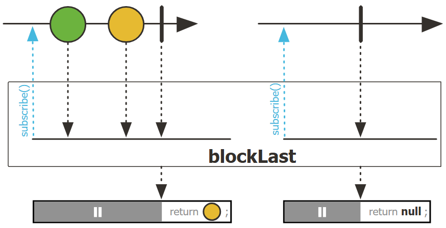

```java
public final T blockLast(java.time.Duration timeout);
```

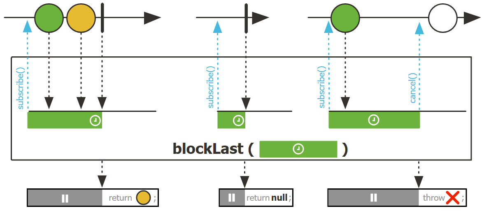

```java
public final java.lang.Iterable<T> toIterable();
```

将 `Flux` 转换为 `Iterable`，在 `Iteratoe.next()` 调用上阻塞。

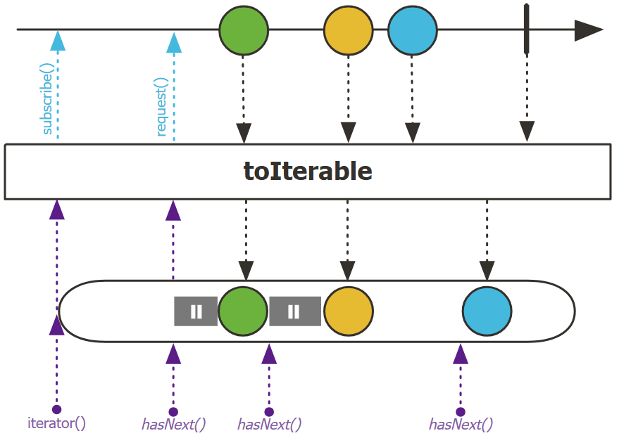

### Blocking to Reactive

假设你有阻塞代码，如与数据库的 JDBC 连接，现在希望将其集成到 reactive pipeline 中，同时避免影响性能。

最好的做法是通过 `Scheduler` 将阻塞的部分进行隔离，保持 pipeline 余下部分的高效，并且只在需要时创建额外线程。

对 JDBC 示例，可以用 `fromIterable`，问题是如何防止它阻塞 pipeline 的余下分布。

`subscribeOn` 可以从 `Scheduler` 的开始隔离序列。例如，`Schedulers.boundedElastic()` 会创建一个按需增长的线程池，自动释放在一段时间内未使用的线程。为了避免滥用导致线程过多，`boundedElastic` 可以设置线程数上限。

JDBC 示例:

```java
Flux.defer(() -> Flux.fromIterable(repository.findAll()))
            .subscribeOn(Schedulers.boundedElastic());
```

## 6. Adapt

RxJava3 和 Reactor 3 都实现了 Reactive Streams 规范，两者可以交互。

两个库都提供从 `Publisher` 创建的工厂方法，因此转换很容易。

- Reactor `Flux` 转换为 RxJava `Flowable`

```java
Flowable<User> flowable = Flowable.fromPublisher(flux)
```

- 从 `Flowable` 到 `Flux`

```java
Flux<User> flux = Flux.from(flowable);
```

- 从 `Flux` 到 `Observable`

```java
Observable<User> observable = Observable.fromPublisher(flux);
```

- 从 `Observable` 到 `Flux`

```java
Flux<User> flux = Flux.from(observable.toFlowable(BackpressureStrategy.BUFFER));
```

这里需要定义反压策略，因为 RxJava 3 `Observable` 不支持反压。

- 从 `Mono` 到 `Single`

```java
Single<User> single = Single.fromPublisher(mono);
```

- 从 `Single` 到 `Mono`

```java
Mono<User> mono = Mono.from(single.toFlowable());
```

- 从 `Mono` 到 Java 8 `CompletableFuture`

```java
CompletableFuture<User> future = mono.toFuture();
```

- 从 `CompletableFuture` 到 `Mono`

```java
Mono<User> mono = Mono.fromFuture(future);
```

## 7. FAQ

### 理解 marble diagram

marble diagram 以直观的方式解释 operator 的行为，下面介绍如何理解这些图。

有些 operator 为实例方法：它们通过 source `Flux` 的实例调用，如 `Flux<T> output = source.fluxOperator()`：

- 水平箭头表示 `Publisher` 的时间线，时间从左向右流动
- 圆圈表示 `Publisher` emit 的元素
- 虚线表示元素经过 operator 变换
- 方框内的文字表示 operator 名称和应用的变换
- 在 operator 方框下面，为变换结果
- 垂直黑线表示 `Publisher` 成功完成（`onComplete`）
- 垂直黑线被 X 取代，表示 `Publisher` 抛出错误

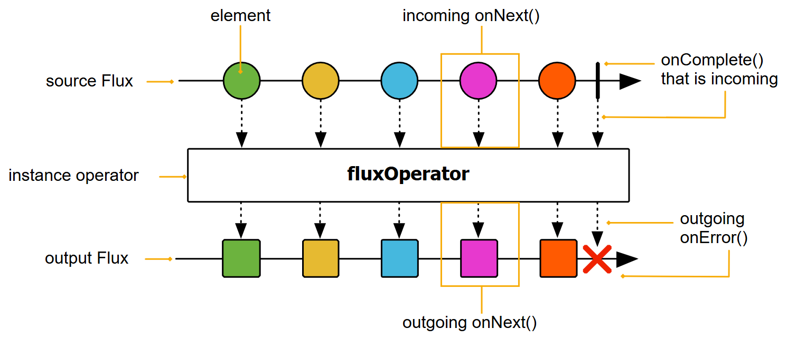

其它 operator 为 static 方法。它们以 source 为输入参数。例如 `Flux<T> output = Flux.merge(sourceFlux1, sourcePublisher2)`，它们表示如下：


有时需要根据 operator 的输入来表示多个行为，此时只有一个 operator "box"，但是 source 和 output 分开：

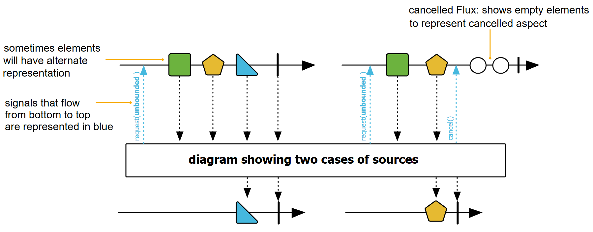

这些就是基本情况。有些 operator 更复杂一点。

例如，`ParallelFlux` 创建多个轨道，因此它们具有多个输出 `Flux`。如下所示：

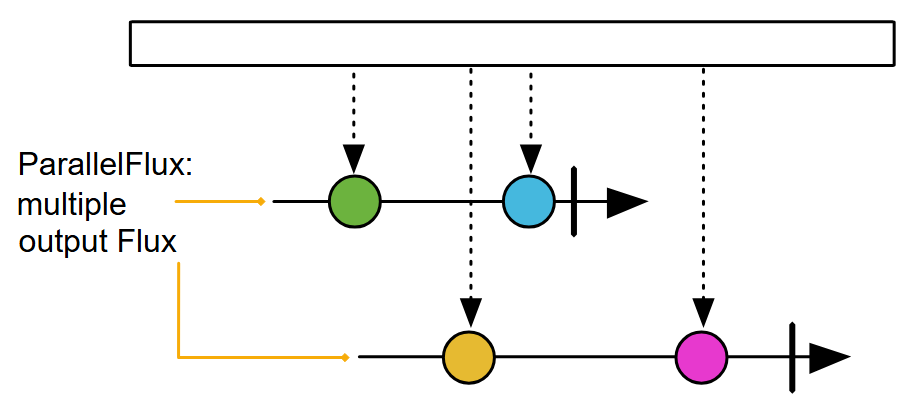

window-operator 会生成 `Flux<Flux<T>>`：main `Flux` 通知每个 window 的打开，而内部 `Flux` 表示 window 的内容和终止。window 表示为 main `Flux` 的分支，如下：

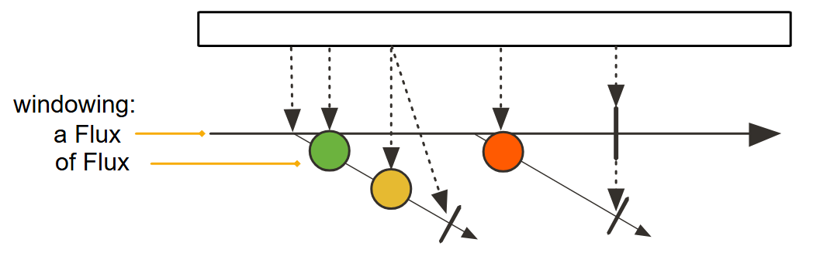

有时，operator 会将 companion-publisher 作为输入。此类 companion-publisher 有助于自定义 operator 的行为，它会使用 companion 的信号触发自身内部的行为。表示如下：

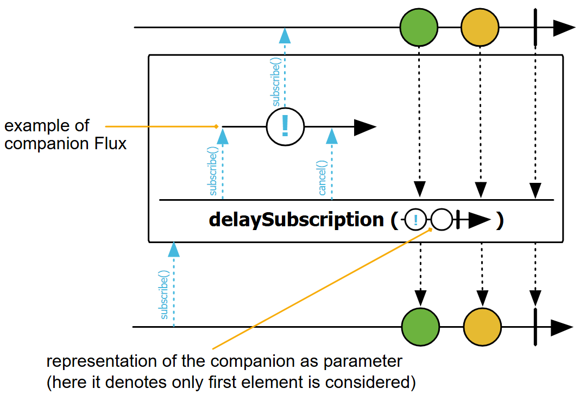

以上介绍了常见的 operator 模式，下面展示一下 `Flux` 或 `Mono` 中可能发出的不同信号、事件和元素的图形：

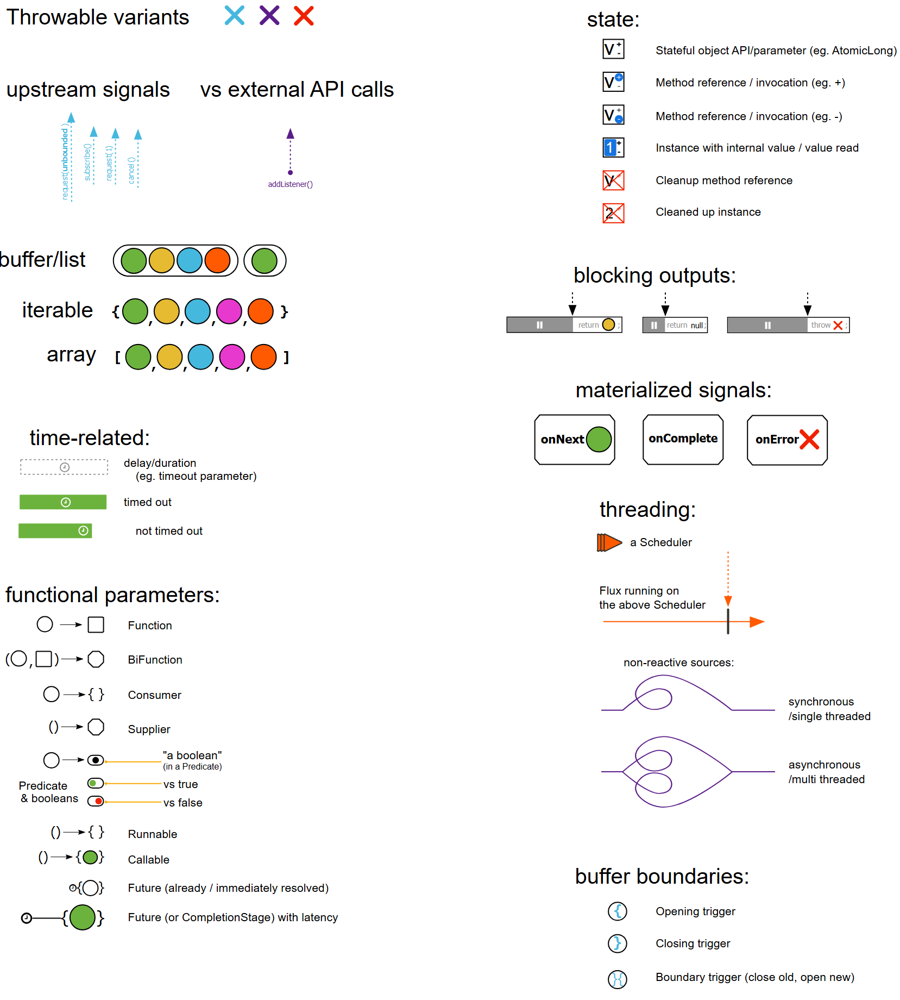

最后是副作用的图形表示：

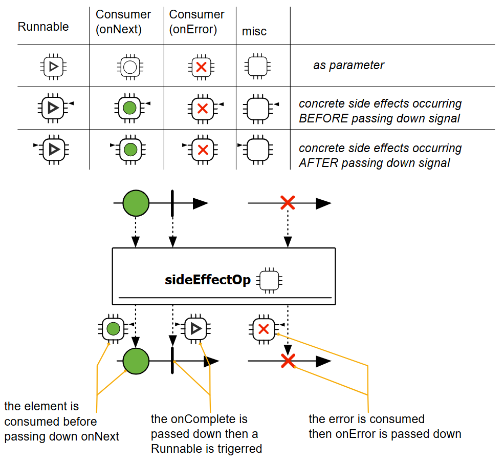

### 何时使用 Reactor

是否应该将 Java 8 `Stream` 和 `CompletableFuture` 都转换为 `Flux/Mono`？并非如此。当用于装饰 IO 等昂贵操作，`Flux` 或 `Mono` 装饰的间接成本可以忽略不计，但在其它场景，与普通同步 java 代码相比，创建 Reactor 的 `Publisher` Flux/Mono 具有明显的性能开销。Reactor 主要用于处理异步调用，对非异步调用不需要用 Reactor，使用 `Stream` 足够了。

另外，`Mono` 和 `Flux` 也提供了字面量和简单对象的工厂方法，但它们主要为了与更高级别的 flow 合并。因此，`long getCount()` 这样的代码没必要转换为 `Mono<Long> getCount()`。

> [!WARNING]
>
> 创建 Reactor 的开销大概是 for 循环的 5 倍。因此，只在需要时使用 Reator，Reactor 用于异步调用，因此仅在需要异步调用时使用 Reactor。

### 反压（backpressure）

Reactive Streams 规范以及 Reactor 的重点之一（不是唯一重点）反压。反压的核心思想是：在 push 场景中，producer 的速度比 consumer 快，consumer 跟 producer 说 “你慢一点，我忙不过来”。这样 producer 就可以控制速度，而不用丢失数据（采样）甚至导致失败。

那么，`Mono` 会出现反压么：什么样的 consumer 会因单个值就歇菜了？应该没有，不过 `Mono` 的工作原理与 `CompletableFuture` 有一个关键区别。`CompletableFuture` 是 push-only：如果引用 `Future`，这意味着异步处理任务已经在执行，而启用反压的 `Flux` 或 `Mono` 是延迟的 pull-push 相互作用：

- 延迟：因为在调用 `subscribe()` 前不是执行任何内容
- pull：因为在订阅和 request 步骤，`Subscriber` 向上游 source 发送信号，pull 下一批数据
- push：在 request 元素范围内，producer 向 consumer push 数据

对 `Mono`，调用 `subscribe()` 表示 consumer 准备接收数据。对 `Flux`，`request(n)` 表示准备好接收 `n` 个数据。

`Mono` 是一个 `Publisher`，通常用于昂贵任务（IO，延迟等）：如果不订阅，则不执行，没有任何消耗。由于 `Mono` 通常与反压 `Flux` 一起使用，可能用于合并来自多个异步 sources 的结果，因此按需触发订阅是避免阻塞的关键。

反压有助于区分最后一个操作和另一个 `Mono`：异步将 `Flux` 的数据汇总到一个 `Mono`。`reduce` 和 `hasElement` 等 operators 能够消耗 `Flux` 的所有元素，从而汇总数据，并以 `Mono` 类型返回。此时，上有的反压为 `Long.MAX_VALUE`，即不限制上游全力 push。

反压还可以限制内存占用：

- 当 `Publisher` 很慢，此时下游 request 数量可以超出可用数据量，此时，整个 stream 处于 push 模型，每个元素都通知 consumer；
- 当 `Publisher` 加速，超出 cosumer 的水平，此时，整个 stream 就转换为 pull 模型。

对两种场景，最多 `N` 的数据在内存中（`request` 量）。

可以通过 request 量 `N` 和每个元素消耗的内存 `W` 来推理异步处理所需内存：`W*N`。实际上，Reactor 会利用已知的 `N` 进行优化：常见相应的有界队列（queue），应用合适的预取策略（prefetch），当收到 3/4 的数据，会自动 request(N*0.75) 数据。

最后，operators 有时会更改反压信号，以与 operator 的操作匹配。一个典型示例是  `buffer(10)`：对下游的 `request(N)`，该 operator 从上游 `request(10N)` 来填充 buffer。这称为主动反压（active backpressure），开发人员可以利用它实现批处理方案。

## 参考

- https://projectreactor.io/docs/core/release/reference/gettingStarted.html
- https://gist.github.com/Lukas-Krickl/50f1daebebaa72c7e944b7c319e3c073
- https://github.com/schananas/practical-reactor
- https://eherrera.net/project-reactor-course/