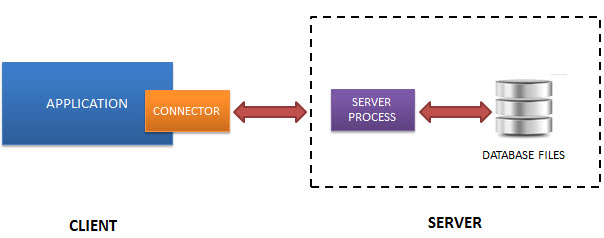
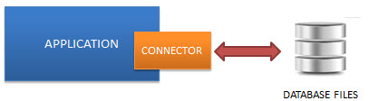

# Introduction

- [Introduction](#introduction)
  - [简介](#简介)
  - [Serverless (无服务器)](#serverless-无服务器)
  - [Self-Container (自包含)](#self-container-自包含)
  - [Zero-configuration (零配置)](#zero-configuration-零配置)
  - [Transactional (事务性)](#transactional-事务性)
  - [SQLite 独有特征](#sqlite-独有特征)

2020-06-20, 09:35
***

## 简介

SQLite 是轻量级的关系数据库管理系统，其轻量级体现在设置、数据库管理和所需资源方面。

SQLite 具有自包含、无服务器、零配置等特征。

## Serverless (无服务器)

一般来说，RDBMS数据库如 MySQL, PostgreSQL 等，需要一个单独运行的服务器进程。访问程序通过 TCP/IP 协议发送和接收请求，即客户端/服务器框架。如下图所示：

SQLite 则没有采用这种框架，SQLite 数据库和访问数据库集成在一起，应用程序直接用 SQLite 数据库的数据库文件读写，其结构如下：

## Self-Container (自包含)

自包含，表示SQLite对系统和额外包的需求极少。这使得 SQLite 可以在任何系统，特别是嵌入式设备，如 iPhone, Android 手机，游戏机，手持媒体播放器中使用。

SQLite 使用 ANSI-C 开发。其源码为一个很大的 `sqlite3.c` 和头文件 `sqlite3.h`。如果需要嵌入 SQLite源码，只需要包含这两个文件即可。

## Zero-configuration (零配置)

SQLite的非服务器框架使其不用安装就可以直接使用，无需配置、启动和终止的服务器进程。

另外，SQLite 不使用任何配置文件。

## Transactional (事务性)

SQLite 的所有事务都是 ACID 兼容的。即所有的查询和修改都是 Atomic, Consistent, Isolated, Durable。

换句话说，如果发生应用程序崩溃、断电等鼓掌，所有事务要么完整执行，要么完全不执行。

## SQLite 独有特征

SQLite 数据库表使用动态类型，即每一列都可以存储各种类型的数据。

SQLite 通过单个连接可以访问多个数据库文件，从而可以在不同数据库连接表之间进行复制操作等。

并且，SQLite 可以创建 in-memory 数据库，可以快速访问。
