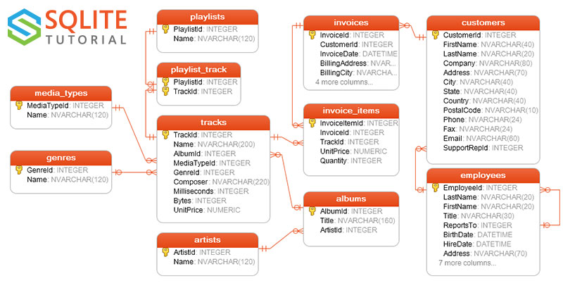

# Connect to SQLite Database

- [Connect to SQLite Database](#connect-to-sqlite-database)
  - [下载 SQLite JDBC 驱动](#下载-sqlite-jdbc-驱动)
  - [连接格式](#连接格式)
  - [JDBC 连接数据库](#jdbc-连接数据库)
  - [创建新的数据库](#创建新的数据库)

2020-06-20, 09:44
***

## 下载 SQLite JDBC 驱动

2020-06-20, 09:42

当前最新 SQLite JDBC

```xml
<dependency>
    <groupId>org.xerial</groupId>
    <artifactId>sqlite-jdbc</artifactId>
    <version>3.31.1</version>
</dependency>
```

sqlite-jdbc 包含 SQLite 和 Java 接口类。

## 连接格式

可以使用如下格式在 SQLite JDBC 中连接 SQLite 数据库：

```java
jdbc:sqlite:sqlite_database_file_path
```

其中 `jdbc:sqlite:sqlite_database_file_path` 是指向 SQLite 数据库文件的路径，可以是相对路径：

```txt
jdbc:sqlite:sample.db
```

或绝对路径

```txt
jdbc:sqlite:C:/sqlite/db/chinook.db
```

或内存中数据库：

```txt
jdbc:sqlite::memory:
```

## JDBC 连接数据库

连接 `chinook.db` 文件指向的数据库：

```java
Connection conn = null;
String url = "jdbc:sqlite:D:\\code\\test\\chinook.db";
try {
    conn = DriverManager.getConnection(url);
    System.out.println("Connection to SQLite successfully");
} catch (SQLException e) {
    System.out.println(e.getMessage());
} finally {
    if (conn != null) {
        try {
            conn.close();
        } catch (SQLException e) {
            System.out.println(e.getMessage());
        }
    }
}
```

样例数据库 `chinook.db` 包含 13 个表格。



## 创建新的数据库

创建 SQLite 数据库分两步：

1. 指定数据库名称和路径
2. 通过 SQLite JDBC driver 连接数据库

当连接的数据库不存在，SQLite会自动创建一个新的数据库。所以，创建新的数据库，只需要指定数据库名称，然后连接即可，和连接数据库语法一样。

例如，创建一个 `test.db` 数据库：

```java
String url = "jdbc:sqlite:D:\\code\\test\\test.db";
try (Connection conn = DriverManager.getConnection(url)) {
    if (conn != null) {
        DatabaseMetaData metaData = conn.getMetaData();
        assertEquals(metaData.getDriverName(), "SQLite JDBC");
    }
} catch (SQLException e) {
    System.out.println(e.getMessage());
}
```
