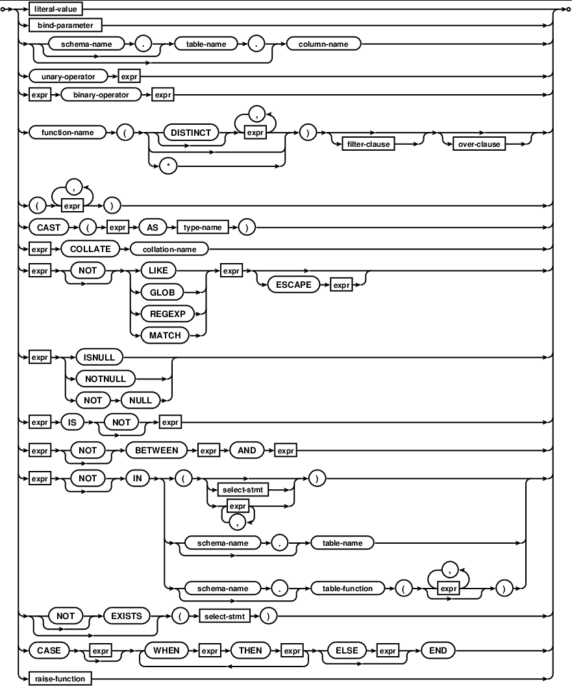
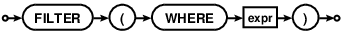
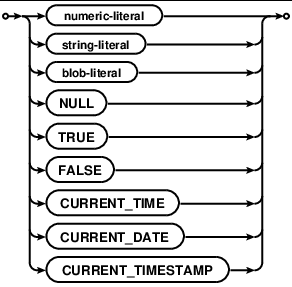

# SQL Language Expressions

- [SQL Language Expressions](#sql-language-expressions)
  - [Syntax](#syntax)
    - [expr](#expr)
    - [filter-clause](#filter-clause)
    - [literal-value](#literal-value)
  - [ROWIDs and the INTEGER PRIMARY KEY](#rowids-and-the-integer-primary-key)

2020-07-07, 18:34
***

## Syntax

### expr

### filter-clause

### literal-value

## ROWIDs and the INTEGER PRIMARY KEY

除了 WITHOUT ROWID table，SQLite 表格的所有行都包含一个 64-bit signed integer key，用于识别 table 的行。该 integer 一般称为 "rowid"。"rowid"值可以使用 "rowid", "oid", `_rowid_` （不区分大小写）访问。如果用户自定义名为 "rowid", "oid" 或 `_rowid_` 的列，则无法再用这些名称访问 rowid 值。

WITHOUT ROWID tables 没有 rowid，仅在 SQLite 3.8.2 之后才支持这种表格。

包含 rowid 的表格称为 rowid table。

rowid table 的数据存储为 B-Tree 结构，每一行对应一个 entry，rowid 作为 key。所有按 rowid 检索或排序很快。使用 rowid 检索的速度大概是使用 PRIMARY KEY 或其它索引值检索速度的两倍。

